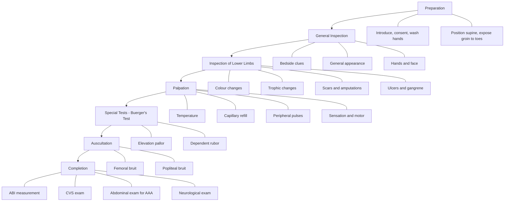

# Examination of the Peripheral Arterial System

## Master Examination Framework

---

## Preparation (MUST DO — will fail if omitted)

**How to do it:**

1. **Introduce yourself**: "Good morning, I'm [Name], a medical student. May I examine your legs today?" / 「你好，我係醫學生[名字]，我想檢查你嘅腳，可以嗎？」
2. **Obtain consent**: "I'll need to look at and feel both your legs from the groin down to your toes. Please let me know if anything is painful." / 「我需要睇同摸你兩條腿，由大腿到腳趾，如果有任何唔舒服請話俾我知。」
3. **Wash hands**: State aloud "I would wash my hands with alcohol gel before proceeding."
4. **Positioning**: Patient supine on the bed, in a **warm room** (cold causes vasoconstriction and can mask findings or accentuate pallor) [1][2].
5. **Exposure**: Bilaterally **from the groin to the toes** — ideally the patient wears underwear only below the waist. Both limbs must be exposed for comparison [1][2].

> **Model commentary**: *"I would like to position the patient supine on the bed in a warm room and expose both lower limbs from the groin down to the toes."*

<Callout title="Common Pitfall" type="error">
Forgetting to expose **both limbs** is a common OSCE error. You must always compare left with right — unilateral disease is the norm in peripheral arterial disease, and side-to-side comparison is fundamental.
</Callout>

---

## General Inspection

### Bedside Clues (MUST DO)

Stand at the foot of the bed and scan the environment before touching the patient.

| What to look for | Significance |
|---|---|
| IV drip / fluid bags | Hydration status; post-op fluids; heparin infusion (suggests acute ischemia management) |
| Oxygen supplementation | Cardiorespiratory comorbidity |
| Fasting card / NBM sign | Planned intervention or surgery |
| **Pressure stockings / heel protectors** | Measures to prevent pressure ulcers in ischemic limbs |
| Splinting | Post-operative immobilization |
| Medication chart at bedside | Anticoagulants, antiplatelets, statins |
| Wheelchair / walking aids | Functional limitation from claudication |

### General Appearance (MUST DO)

- **Pain**: Is the patient grimacing or resting comfortably? Rest pain suggests **critical limb ischemia** (ABI < 0.4) — characteristically worse at night and relieved by hanging the leg over the bed [1][3].
- **Dyspnoea**: Suggests concomitant congestive heart failure — atherosclerosis is a systemic disease [2].
- **Body habitus**: Cachexia or obesity — both relevant to cardiovascular risk.
- **Tar staining of fingers**: ***Major risk factor for peripheral vascular disease*** [2][4].

### Hands and Face (Good to do — distinction level)

- **Hands**: Tar stain, peripheral cyanosis, xanthomata (hyperlipidemia), radial pulse.
- **Eyes**: Pallor (anemia worsens ischemia), xanthelasma, arcus senilis.
- **Face**: Central cyanosis, malar flush (if mitral stenosis with AF → embolic source).

> **Model commentary**: *"The patient is lying comfortably on the bed. He is not in pain or dyspnoea. There is no tar stain. I can see heel protectors in place bilaterally."*

---

## Inspection of the Lower Limbs (MUST DO)

**Why**: Inspection alone can reveal the severity and chronicity of arterial disease before you even touch the patient.

**How**: Systematically inspect both legs from the groin to the toes, paying particular attention to **pressure areas** (metatarsal heads, between toes, tips of toes, heel) [2][4].

> **Model commentary**: *"I will now inspect both legs, especially the pressure areas — the metatarsal heads, between the toes, the tips of the toes, and the heels."*
> 「我而家會檢查你兩條腿，特別係受壓嘅位置。」

### 1. Colour Changes

| Colour | Meaning | Pathophysiology |
|---|---|---|
| ***White / Pallor*** | ***Advanced ischemia*** | Severely reduced arterial inflow; inadequate perfusion of skin |
| ***Red*** | ***Vasodilatation of microcirculation*** | Impaired vasoregulation; loss of sympathetic tone → chronic reactive vasodilation |
| ***Blue / Cyanotic hue ("sunset foot")*** | ***Stagnated deoxygenated blood*** | Reduced flow velocity → increased oxygen extraction → deoxygenated Hb > 5 g/dL |
| ***Mottled*** | ***Prolonged acute limb ischemia*** | Patchy areas of capillary thrombosis alternating with perfused areas; ominous sign |
| ***Black*** | ***Gangrene*** | Complete tissue death from irreversible ischemia [1] |

### 2. Trophic Changes

These indicate **chronic** interruption of nutrition to the tissues [1][2]:

- **Hair loss** (especially dorsum of toes and shin) — reduced nutritional blood flow to hair follicles
- **Dry, shiny, atrophic (thin) skin** — autonomic neuropathy with loss of sweat and sebaceous gland function
- **Thickened, brittle, ridged nails** — impaired nail matrix nutrition
- **Muscle atrophy** — chronic disuse or denervation from concurrent neuropathy
- **Pointed toes** — tissue wasting at the toe tips [1]

### 3. Scars and Amputations (MUST DO)

Look for evidence of previous intervention — this is ***very commonly tested*** in OSCE stations [2]:

| Scar | Significance |
|---|---|
| **Bilateral groin scars (small, puncture-type)** | ***Endovascular access — often admitted for pre-op femorofemoral angiogram in exams!*** [2] |
| **Long longitudinal scar (medial thigh to popliteal fossa)** | ***Femoropopliteal bypass — remember to palpate posteriorly for the graft*** [2] |
| **Scar along medial leg (course of GSV)** | Saphenous vein harvesting for venous graft (CABG or bypass) |
| **Median sternotomy scar** | Previous CABG (systemic atherosclerosis) |
| **Radial artery scar** | Arterial graft harvest for CABG |
| **Previous amputation sites** | Document the level — DIP/PIP disarticulation, ray amputation, forefoot (Lisfranc/Chopart), Syme's, BKA, AKA [2] |

### 4. Ulcers and Gangrene

If an ulcer is present, describe: **site**, **size**, **shape**, **edge**, **base**, **depth**, **discharge**, and **surrounding skin** [5].

**Arterial ulcers** are characteristically:
- Located at **pressure areas** and **distal** (toes, heel)
- **Punched-out edges**, pale/necrotic base
- **Painful**
- Surrounded by atrophic, hairless skin

**Gangrene** — distinguish two types [1]:

| Type | Features | Clinical significance |
|---|---|---|
| ***Dry gangrene*** | ***Hard, black, mummified, shrivelled tissue; clear line of demarcation*** | Gradual arterial occlusion → autoamputation may occur; may be managed conservatively if infection absent |
| ***Wet gangrene*** | ***Soft, moist, swollen; infected; no clear demarcation*** | Infected necrosis — ***surgical emergency requiring debridement or amputation*** [1] |

> **Model commentary**: *"On inspection, the right leg looks pale compared to the left, with thin and shiny skin and brittle nails, indicating chronic ischaemia. I can see a previous ray amputation of the second toe and a longitudinal scar on the medial thigh suggesting a previous femoropopliteal bypass. There is no active ulceration or gangrene."*

---

## Palpation (MUST DO)

<Callout title="Always Ask About Pain First" type="error">
Before palpating, ask: "Is there any area that's particularly painful?" / 「有冇邊度特別痛？」 Failure to ask this before touching an ischemic limb is a common OSCE mistake and may lose marks.
</Callout>

### 1. Temperature

- **How**: Use the **dorsum (back) of your hand** — it is more sensitive to temperature than the palmar surface.
- **Technique**: Run both hands **simultaneously** up from the feet to the shins and thighs, comparing temperature side-to-side [1].
- **Normal**: Both limbs warm and equal.
- **Abnormal**: A cool limb suggests **reduced arterial inflow**. Identify the level where temperature changes — this approximates the level of arterial occlusion.
- **Pathophysiology**: Arterial blood carries core body heat; reduced perfusion → reduced heat delivery.

> **Model commentary**: *"I will now feel the temperature of both legs using the back of my hands, moving from the feet up to the thighs, comparing both sides simultaneously."*
> 「我而家會用手背感受兩條腿嘅溫度，由腳板開始向上摸，比較兩邊。」

### 2. Capillary Refill Time (CRT)

- **How**: Press firmly on the **nail bed** or **toe pulp** for 5 seconds, then release [1].
- **Normal**: Blanched area turns pink within **< 2 seconds**.
- **Abnormal**: **> 2 seconds** (delayed) — indicates impaired peripheral perfusion.
- **Pathophysiology**: CRT reflects the time for capillary blood to return; prolonged CRT occurs with reduced arterial pressure, increased sympathetic tone, or peripheral vasoconstriction.

> **Model commentary**: *"I am now pressing on the great toe nail bed for five seconds and releasing — the capillary refill time is approximately 4 seconds, which is delayed, suggesting impaired arterial perfusion."*

### 3. Peripheral Pulses (MUST DO — Core of Examination)

Palpate **bilaterally** and **grade each pulse**: 0 (absent), 1 (diminished), 2 (normal), 3 (bounding).

| Pulse | Location | Technique |
|---|---|---|
| **Femoral** | Midpoint between **ASIS and pubic symphysis** | Deep palpation with 2-3 fingertips |
| **Popliteal** | **Popliteal fossa** (posterior knee) | Patient's knee slightly flexed (~30°); wrap both hands around the knee with thumbs on the patella; compress against the **posterior aspect of the tibia** with your fingertips — this is the hardest pulse to find [1] |
| **Posterior tibial** | Posterior and inferior to the **medial malleolus** (about 1/3 of the way down from the malleolus) [1] | Curl your fingers behind the medial malleolus |
| **Dorsalis pedis** | **Dorsum of foot**, lateral to the tendon of extensor hallucis longus | Palpate between the first and second metatarsals |

**Key interpretive principle**: Absent pulses localize the level of disease.
- Absent femoral pulse → **aortoiliac disease** (consider Leriche syndrome if bilateral + buttock claudication + impotence)
- Present femoral + absent popliteal → **superficial femoral artery disease** (most common, ~70% of cases [3])
- Present popliteal + absent pedal pulses → **infrapopliteal disease** (common in diabetics)

**Pathophysiology**: Atherosclerotic plaque narrows or occludes arteries → distal pulse pressure is reduced or absent.

<Callout title="OSCE Tip" type="idea">
The popliteal pulse is commonly missed because students don't flex the knee or compress firmly enough against the tibia. Practise this! In an OSCE, if you cannot find it, say: "I am unable to palpate the popliteal pulse — I would confirm with a handheld Doppler." This shows you know the next step.
</Callout>

> **Model commentary**: *"I will now palpate the peripheral pulses bilaterally, starting with the femoral, then popliteal, posterior tibial, and dorsalis pedis. The right femoral pulse is palpable but diminished. The right popliteal and distal pulses are absent. On the left, all pulses are palpable and normal."*

### 4. Sensation and Motor (MUST DO — brief screen)

- **Sensation**: Test light touch and pinprick in a stocking distribution. Loss of sensation or paraesthesia may indicate:
  - Concurrent **diabetic neuropathy** (most common)
  - **Ischemic neuropathy** from acute or severe chronic ischemia
- **Motor**: Ask the patient to dorsiflex and plantarflex the foot and toes.
  - **Motor loss is a late sign** of severe ischemia and indicates tissue non-viability [1][6].
  - Tissue sensitivity to ischemia: ***Nerves > Muscle > Skin > Bone*** [6]

> 「可唔可以將腳板向上翹？」("Can you pull your foot up?") / 「將腳趾向下踩？」("Push your toes down?")

---

## Special Tests

### Buerger's Test (MUST DO — The Key Special Test)

This is the **signature test** of the peripheral arterial examination and is almost always expected in an OSCE.

**Technique** [1][2][4]:

1. With the patient **supine**, ask them to lie as close to the side of the bed as possible.
2. Hold the patient's **heel** with the lower limb **straightened**.
3. **Slowly raise** the entire limb, keeping the knee extended.
4. Observe the **sole and toes** — look for the point at which the foot becomes **pale (white)**.
5. The angle at which pallor develops is the **Buerger's angle**.
6. Then gently lower the limb and **hang it over the edge of the bed** (dependent position).
7. Observe for **dependent rubor** — the foot turns a dusky purple-red colour.

> 「我而家會慢慢抬高你嘅腳，請你放鬆。」("I'm going to slowly raise your leg, please relax.")

**Interpretation:**

| Finding | Interpretation |
|---|---|
| **Normal**: Foot remains pink even at 90° elevation | Normal arterial supply |
| ***Elevation pallor with Buerger's angle < 20°*** | ***Severe peripheral arterial disease / critical ischemia*** [1] |
| Buerger's angle 20°–45° | Moderate arterial insufficiency |
| ***Dependent rubor*** (dusky flush spreading from toes proximally) | ***Reactive hyperaemia confirming arterial insufficiency*** [1][4] |

**Pathophysiology**:
- **Elevation pallor**: When the limb is raised, gravity opposes arterial inflow. In a normal person, arterial pressure easily overcomes gravity even at 90°. In a patient with significant proximal stenosis/occlusion, the already-reduced perfusion pressure cannot fill the capillary bed against gravity → pallor.
- **Dependent rubor**: When the limb is lowered, blood rushes into the maximally dilated (chronically ischemia-adapted) microcirculation. The sluggish return of blood causes pooling of deoxygenated blood → dusky red/purple colour. This is NOT a sign of good perfusion — it is a sign of disease.

> **Model commentary**: *"I am now performing Buerger's test. I am slowly raising the right leg — I can see the foot becoming pale at approximately 25 degrees, giving a Buerger's angle of roughly 25 degrees. I will now lower the leg over the edge of the bed — after about 30 seconds, the foot is becoming dusky red, showing dependent rubor. This is consistent with significant peripheral arterial disease on the right side."*

<Callout title="Why Buerger's Test Matters">
Buerger's test is a bedside test that can be done without any equipment and gives a semi-quantitative assessment of arterial insufficiency. A Buerger's angle < 20° with dependent rubor is essentially diagnostic of critical limb ischemia at the bedside.
</Callout>

---

## Auscultation (MUST DO)

- **How**: Use the **bell** of the stethoscope (better for low-frequency flow turbulence sounds).
- **Where**: Listen over the **femoral artery** (groin) and the **adductor canal** (medial mid-thigh) [2].
- **Normal**: No bruit heard.
- **Abnormal**: A **bruit** (vascular murmur) indicates turbulent flow through a stenosed artery.
- **Pathophysiology**: Blood flowing through a narrowed arterial lumen accelerates and becomes turbulent → audible bruit. A bruit heard at rest implies > 50% stenosis. If only heard on exercise, stenosis may be less severe.

> **Model commentary**: *"I will now auscultate over the femoral arteries bilaterally using the bell of the stethoscope. I can hear a bruit over the right femoral artery, suggesting arterial stenosis at this level."*
> 「我而家會用聽筒聽你大腿內側嘅血管。」

---

## Completing the Examination (MUST DO to mention)

State that you would like to perform the following to complete your assessment:

### 1. Ankle-Brachial Index (ABI) — ***MUST MENTION***

This is the most important bedside investigation to **confirm diagnosis and quantify severity** of lower limb arterial disease [1][2][3][4].

**Technique**:
- Measure **brachial systolic pressure** in both arms using a BP cuff and Doppler probe at the brachial artery. Take the **higher** value.
- Measure **ankle systolic pressure** bilaterally using a BP cuff around the calf and Doppler probe at the **dorsalis pedis** and **posterior tibial** arteries. Take the **higher** of the two on each side.
- **ABI** = Ankle systolic pressure ÷ Higher brachial systolic pressure

| ***ABI*** | ***Interpretation*** |
|---|---|
| ***> 1.3*** | ***Calcified, non-compressible artery (especially in diabetic patients) — use toe-brachial pressure index (TBPI) instead*** [1][3] |
| ***0.9–1.3*** | ***Normal*** |
| ***0.4–0.9*** | ***Claudication (arterial obstruction)*** |
| ***< 0.4*** | ***Critical limb ischemia — associated with rest pain, non-healing ulcers, gangrene*** [1][3] |

**Key point**: ABI > 1.3 does NOT mean the patient is fine — it means the arteries are calcified (Mönckeberg's sclerosis, common in DM) and falsely elevated. In this case, use **TBPI** because digital arteries are usually spared from medial calcification [3].

### 2. Other Examinations to Complete

| Examination | Rationale |
|---|---|
| **Complete cardiovascular examination** (including palpation of **all** peripheral pulses including upper limb and carotid) | Atherosclerosis is a **systemic** disease; look for AF, murmurs, carotid bruits [2] |
| **Abdominal examination** | Palpate for ***abdominal aortic aneurysm (AAA)*** — expansile pulsatile mass [2][4] |
| **Neurological examination of the lower limbs** | Screen for concurrent peripheral neuropathy, especially in diabetics [2][4] |
| **Examination of contralateral limb** | Already done if you examined both limbs side by side |
| **Blood pressure measurement** | Part of cardiovascular risk assessment; hypertension is a major RF |
| **Urine dipstick** | Screen for glycosuria (undiagnosed DM) [4] |

> **Model commentary**: *"To complete my examination, I would like to measure the ankle-brachial index using a handheld Doppler, perform a complete cardiovascular examination including palpation of all peripheral pulses, examine the abdomen for any abdominal aortic aneurysm, and perform a neurological examination of the lower limbs."*

---

## Summary of Must-Do vs Optional Steps

| Step | Must Do? | Notes |
|---|---|---|
| Introduction, consent, hand washing, positioning, exposure | ✅ **MUST DO** | Will fail if omitted |
| General inspection (bedside + general appearance) | ✅ **MUST DO** | Quick scan; sets the tone |
| Inspection of both limbs (colour, trophic changes, scars, ulcers, gangrene) | ✅ **MUST DO** | Core of inspection |
| Palpation: temperature | ✅ **MUST DO** | Quick and essential |
| Palpation: capillary refill | ✅ **MUST DO** | Takes seconds |
| Palpation: all four lower limb pulses bilaterally | ✅ **MUST DO** | The heart of the exam |
| Brief sensory/motor screen | ✅ **MUST DO** | Especially for the 6 P's of acute ischemia |
| **Buerger's test** | ✅ **MUST DO** | Signature test |
| **Auscultation for bruits** | ✅ **MUST DO** | Quick; shows completeness |
| Mention ABI | ✅ **MUST DO** | Must at least mention it |
| Hands/face detailed examination | 🔶 **Good for distinction** | Takes time; mention if pressed for time |
| Ulcer description | 🔶 **Do if ulcer present** | Follow structured approach |
| Palpate posteriorly for bypass graft | 🔶 **Good for distinction** | Shows awareness of surgical anatomy |
| Mention cardiovascular, abdominal, neuro exam | ✅ **MUST DO** (mention) | You don't have to do them, just state you would |
| Urine dipstick mention | 🔶 **Good for distinction** | Quick mention |

---

## Expected Positive and Negative Findings

### Expected Positive Findings in Peripheral Arterial Disease
- Pallor or cyanosis of the affected limb
- Trophic changes (hair loss, shiny skin, nail changes)
- Absent or diminished pulses distal to the lesion
- Cool limb with delayed CRT
- Positive Buerger's test (elevation pallor + dependent rubor)
- Femoral bruit
- Previous surgical scars or amputations

### Important Negative Findings to Document
- "No evidence of gangrene or ulceration" (rules out critical limb ischemia tissue loss)
- "No rest pain" (suggests the limb is not critically ischemic)
- "No motor or sensory deficit" (excludes advanced ischemia / acute limb ischemia)
- "Contralateral limb examination is normal" (identifies unilateral vs bilateral disease)
- "No abdominal aortic aneurysm palpable" (important in atherosclerotic patients)

---

## Red-Flag Examination Findings & Escalation Triggers

These findings suggest **acute limb ischemia** or **critical limb ischemia** requiring **urgent vascular surgery referral**:

The **6 P's** of acute limb ischemia [6]:
1. ***Pain*** — sudden onset, severe, at rest
2. ***Pallor*** — white/waxy limb
3. ***Pulselessness*** — absent pulses distal to occlusion
4. ***Perishing cold*** — cold limb
5. ***Paraesthesia*** — early nerve dysfunction
6. ***Paralysis*** — ***late sign indicating potential irreversibility*** [6]

| Red Flag | Escalation |
|---|---|
| Paralysis or complete sensory loss | **Immediately threatened limb** — needs emergency revascularization (Rutherford IIb) [6] |
| Wet gangrene with systemic signs of sepsis | **Surgical emergency** — debridement/amputation + antibiotics |
| Buerger's angle < 20° with rest pain | **Critical limb ischemia** — urgent vascular referral |
| Mottled, fixed staining of the skin | **Irreversible ischemia** — may not be salvageable (Rutherford III) [6] |
| Sudden loss of all pulses in a previously well limb | **Acute arterial embolism/thrombosis** — needs emergency imaging ± embolectomy |

---

## Common OSCE Pitfalls

<Callout title="OSCE Mistakes to Avoid" type="error">

1. **Not exposing both limbs** — you cannot compare if only one side is visible.
2. **Forgetting to ask about pain before palpation** — this is both clinically important and an OSCE courtesy mark.
3. **Missing the popliteal pulse** — flex the knee, use both hands, compress against the tibia.
4. **Not performing Buerger's test** — this is the one special test expected in every peripheral arterial exam station.
5. **Confusing dependent rubor with normal** — dependent rubor is a sign of disease, not good blood flow.
6. **Not mentioning ABI** — even if you can't measure it, you must say you would.
7. **Forgetting to look posteriorly for scars** — femoropopliteal bypass scars extend to the popliteal fossa.
8. **Not mentioning systemic atherosclerosis** — always offer to do a CVS exam and abdominal exam for AAA.
9. **Checking temperature with the palmar surface** — use the dorsum of the hand.
10. **Not grading pulses systematically** — state each pulse as present/diminished/absent bilaterally.

</Callout>

---

## High-Yield Interpretation Tips

- **Why do we check upper limb pulses/BP too?** Because ABI requires brachial pressure as the denominator, and radial pulse abnormalities can indicate proximal subclavian stenosis.
- **Why is ABI > 1.3 a problem?** Calcified (Mönckeberg's) arteries cannot be compressed by the cuff → falsely high readings. This is especially common in **diabetic patients** → use TBPI or transcutaneous oxygen pressure (TcO₂) instead [3].
- **Why does hair loss occur?** Hair follicles are metabolically active and sensitive to reduced blood flow — chronic ischemia starves them.
- **Why rubor and not just return to pink?** In chronic ischemia, arterioles lose their normal vasomotor tone and become maximally dilated. When the limb is lowered, gravity drives blood into these dilated vessels, but the slow flow means blood becomes highly deoxygenated → dusky red/purple, not healthy pink.
- ***Claudication distance and site localize the lesion*** [3]: Calf claudication → superficial femoral artery disease (70%); thigh + buttock claudication → aortoiliac disease (30%); buttock claudication + impotence → ***Leriche syndrome***.

---

## Model Reporting Script

> *"On examination, Mr Chan is a 68-year-old gentleman who appears comfortable at rest. There is no tar staining. Vital signs are stable — he is not in pain or dyspnoea.*
>
> *On inspection of the lower limbs, the right leg appears paler than the left, with evidence of chronic ischemic changes including loss of hair on the dorsum of the foot, dry and shiny skin, and thickened brittle nails. There is a healed ray amputation site at the right second toe and a longitudinal scar on the right medial thigh consistent with a previous femoropopliteal bypass. There is no active ulceration or gangrene. The left leg appears normal.*
>
> *On palpation, the right foot is cool to touch compared to the left, with the temperature transition at approximately the mid-calf level. Capillary refill time is prolonged at approximately 4 seconds on the right and normal at under 2 seconds on the left. The right femoral pulse is palpable but diminished; the right popliteal, posterior tibial, and dorsalis pedis pulses are absent. All left-sided pulses are present and normal volume. Sensation is grossly intact bilaterally but there is reduced light touch sensation over the right dorsal foot in a stocking distribution.*
>
> *On Buerger's test, the right foot becomes pale at approximately 25 degrees of elevation. On lowering the limb into the dependent position, dependent rubor develops within 30 seconds. The left limb remains pink at 90 degrees with no dependent rubor.*
>
> *On auscultation, there is a bruit over the right femoral artery. No bruit is heard on the left.*
>
> *To complete my examination, I would like to measure the ankle-brachial index, perform a cardiovascular examination, examine the abdomen for any abdominal aortic aneurysm, and perform a neurological examination of the lower limbs.*
>
> *In summary, this gentleman has clinical features consistent with chronic peripheral arterial disease of the right lower limb, likely at the femoropopliteal level, with evidence of previous intervention. The clinical findings suggest moderate-to-severe disease. I would like to quantify this with an ABI and arrange duplex ultrasonography."*

---

<Callout title="High Yield Summary">

**Core structure**: Preparation → General inspection → Inspect (colour, trophic changes, scars, ulcers/gangrene) → Palpate (temperature, CRT, pulses ×4 bilaterally, sensation/motor) → Special test (Buerger's test) → Auscultate (femoral ± popliteal bruits) → Complete (ABI, CVS exam, abdo exam for AAA, neuro exam).

**Must-do tests**: Peripheral pulses (×4, bilaterally), Buerger's test, mention ABI.

**Key findings**: Absent pulses localize the lesion. Buerger's angle < 20° = critical ischemia. ABI < 0.4 = critical limb ischemia. ABI > 1.3 = calcified arteries (use TBPI in diabetics). Dependent rubor ≠ good perfusion.

**Red flags (6 P's)**: Pain, Pallor, Pulselessness, Perishingly cold, Paraesthesia, Paralysis (paralysis = limb may be non-viable).

**Always think systemic**: PVD patients need full CVS assessment — check for AF, carotid bruits, AAA, and manage cardiovascular risk factors.

</Callout>

---

<ActiveRecallQuiz
  title="Active Recall - Physical Exam"
  items={[
    {
      question: "What is the Buerger's angle and what does an angle of less than 20 degrees indicate?",
      markscheme: "Buerger's angle is the angle of leg elevation at which the foot becomes pale. An angle less than 20 degrees indicates severe peripheral arterial disease or critical limb ischemia.",
    },
    {
      question: "How do you calculate the Ankle-Brachial Index and what are the key interpretation thresholds?",
      markscheme: "ABI equals the higher ankle systolic pressure divided by the higher brachial systolic pressure. Normal is 0.9 to 1.3. Claudication is 0.4 to 0.9. Critical limb ischemia is less than 0.4. Greater than 1.3 suggests calcified non-compressible arteries.",
    },
    {
      question: "What is dependent rubor and what is its pathophysiological basis?",
      markscheme: "Dependent rubor is a dusky red-purple discolouration of the foot when placed in a dependent position after elevation. It occurs because chronically ischemic arterioles are maximally dilated and lose vasomotor tone. When the limb is lowered, blood pools in these dilated vessels and becomes deoxygenated, causing the dusky colour. It is a sign of arterial insufficiency, not good perfusion.",
    },
    {
      question: "Why might the ABI be falsely elevated above 1.3 and what should you do instead?",
      markscheme: "Falsely elevated ABI above 1.3 occurs due to medial arterial calcification, especially in diabetic patients. The calcified arteries are non-compressible by the blood pressure cuff. Use the toe-brachial pressure index instead because digital arteries are usually spared from calcification.",
    },
    {
      question: "Name the 6 P's of acute limb ischemia and state which is the most ominous prognostic sign.",
      markscheme: "Pain, Pallor, Pulselessness, Perishingly cold, Paraesthesia, Paralysis. Paralysis is the most ominous sign as it indicates late irreversible ischemia. Tissue sensitivity to ischemia follows the order: Nerves then Muscle then Skin then Bone.",
    },
    {
      question: "A patient has absent femoral pulses bilaterally with buttock claudication and erectile dysfunction. What is the diagnosis and where is the level of disease?",
      markscheme: "Leriche syndrome due to aortoiliac occlusive disease. The triad is bilateral buttock or thigh claudication, absent femoral pulses bilaterally, and erectile dysfunction in males. The occlusion is at the aortic bifurcation or common iliac arteries.",
    },
  ]}
/>

---

## References

[1] Senior notes: felixlai.md (Vascular Examination — Arterial System, pp. 132–137)
[2] Senior notes: Ryan Ho Cardiology.pdf (Section 4.2 — Examination of Peripheral Arterial System, pp. 201–204)
[3] Senior notes: maxim.md (PVD section — ABPI, physical examination, investigations)
[4] Senior notes: Ryan Ho Fundamentals.pdf (Section 2.15.1 — Examination of Peripheral Arterial System, pp. 176–179)
[5] Senior notes: Ryan Ho Rheumatology.pdf (Ulcer examination framework, p. 161)
[6] Senior notes: felixlai.md (Acute Arterial Ischemia — 6 P's and Rutherford classification, pp. 919–922)
