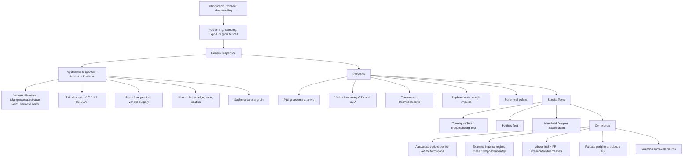

# Examination of the Peripheral Venous System

## Master Examination Framework

---

## General Approach: The 3Cs + 1H

Before you touch the patient or even look at the legs, you need to get the basics right. Examiners are watching from the moment you walk in.

1. **Introduce yourself**: "Good morning, my name is Dr [Name], I am a medical student. May I confirm your name and date of birth?"
   - 「你好，我係醫學生 [名字]，可唔可以確認一下你嘅名同出生日期？」
2. **Consent**: "I would like to examine the veins in your legs today. This will involve me looking at, touching, and applying a band to your legs. Is that alright?"
   - 「我想檢查你對腳嘅靜脈，需要睇、摸同埋用條帶綁住你對腳，可以嗎？」
3. **Comfort**: Check if the patient is in any pain or discomfort. Ensure dignity throughout.
4. **Hand hygiene**: State: *"I would like to wash my hands before beginning the examination."*

### Positioning and Exposure

- ***Position: The patient should be standing comfortably with the leg being examined extended slightly forward (丁字腳 stance)*** [1][2]
- ***Exposure: Both lower limbs exposed from the groin to the toes, preferably wearing underwear only*** [1][2]
- Standing is essential because varicose veins collapse when supine — you will miss them if the patient is lying down
- 「請你企喺度，著住底褲就得，兩隻腳都要露出嚟」("Please stand here, wearing just your underwear, with both legs exposed.")

<Callout title="Why standing?" type="idea">
Varicose veins are filled by gravity. In the supine position, they decompress and become invisible/impalpable. You **must** examine the patient standing first. The only time you lie the patient down is for the tourniquet test and palpation of pulses.
</Callout>

---

## General Inspection

Before approaching the patient, take a step back and observe from the end of the bed (or in this case, from a few feet away while the patient stands).

**Running commentary:**
> *"On general inspection, the patient is standing comfortably. He/she does not appear to be in distress. I do not see any walking aids, compression stockings at the bedside, or evidence of bandages/dressings. There is no obvious limb asymmetry."*

**What to look for:**

| Finding | Significance |
|---|---|
| Compression stockings at bedside | Known venous disease; patient on conservative management |
| Walking aids / wheelchair | Reduced calf muscle pump → worsens venous hypertension |
| Bandages / dressings on legs | Possible active venous ulcer |
| Body habitus — obesity | Major risk factor for varicose veins and CVI |
| Obvious limb swelling/asymmetry | Suggests significant venous insufficiency or DVT |
| Skin colour changes visible at distance | Advanced CVI (C4–C6) |

---

## A. Systematic Inspection

This is the core of the venous examination. You need to inspect **anteriorly and posteriorly** and along the **entire course of the great saphenous vein (GSV) and small saphenous vein (SSV)** [1][2].

**Running commentary:**
> *"I will now inspect the legs anteriorly and posteriorly, looking specifically along the course of the great and small saphenous veins for any varicosities and signs of chronic venous insufficiency."*

Walk around the patient. Make a deliberate gesture to show the examiner you are inspecting both front and back of both legs.

### 1. Venous Dilatation

Look for and classify any dilated veins:

| Type | Location | Size | Palpable? |
|---|---|---|---|
| **Telangiectasia** ("spider veins") | Intradermal | < 1 mm | No |
| **Reticular veins** | Subdermal | 1–3 mm | No |
| ***Varicose veins*** | Subcutaneous | > 3 mm | **Yes** |

**Distribution matters** — it tells you which vein is incompetent [3]:

| Distribution of Varicosities | Likely Incompetent Vein |
|---|---|
| ***Medial thigh and medial calf*** | **Great saphenous vein (GSV)** — most common |
| ***Posterior calf*** | **Small saphenous vein (SSV)** |
| Anterolateral thigh and calf | Isolated incompetence of proximal anterolateral GSV tributary |

**Pathophysiology:** Varicose veins develop because of **venous hypertension** → loss of wall compliance → dilatation → secondary valvular dysfunction → reflux → further dilatation. This is a self-perpetuating cycle [4].

**Running commentary:**
> *"On inspection, there are dilated and tortuous veins visible along the medial aspect of the right lower limb, in keeping with the great saphenous vein distribution."*

### 2. Saphena Varix

- A ***blue-tinged bulge in the groin*** due to dilatation of the termination of the GSV or one of its major tributaries [1][2]
- It is compressible and has a **cough impulse** (which you will test during palpation)
- Important DDx of a groin lump!

### 3. Corona Phlebectatica (Ankle Flare)

- ***Fan-shaped pattern of small intradermal veins beneath the lateral and/or medial malleoli*** [1][2]
- ***This is an early sign of advanced venous disease*** — it tells you the venous hypertension has been transmitted to the distal microvasculature
- Easy to miss if you don't specifically look at the ankle region

### 4. Signs of Chronic Venous Insufficiency (CVI)

Use the **CEAP classification** to grade severity. Focus on the skin at the ***gaiter region (distal medial 1/3 of leg)*** [1][2]:

| CEAP Class | Finding | Description / Pathophysiology |
|---|---|---|
| C1 | Telangiectasia / reticular veins | Earliest visible change |
| C2 | Varicose veins | Subcutaneous, palpable, > 3 mm |
| C3 | Oedema | Venous hypertension → increased capillary filtration |
| C4a | ***Hyperpigmentation*** | Haemosiderin deposition from RBC extravasation due to venous HTN |
| C4a | ***Venous stasis eczema*** | Pruritic, weeping, scaling with erosion and crusting — inflammatory response to venous HTN |
| C4b | ***Lipodermatosclerosis*** | Firm, indurated, hyperpigmented skin ± ***'inverted champagne bottle' appearance*** — fibrosis of subcutaneous fat |
| C4b | ***Atrophie blanche*** | Ivory-white areas with hyperpigmented borders and telangiectasia — localised avascular fibrosis |
| C5 | Healed venous ulcer | Scarring at gaiter area |
| C6 | ***Active venous ulcer*** | Shallow, irregular, in gaiter region, with surrounding skin changes |

**Running commentary:**
> *"The leg looks swollen, with venous skin changes seen including some hyperpigmentation, venous stasis eczema and lipodermatosclerosis at the gaiter region. There are no active ulcers."*

### 5. Venous Ulcers

If present, comment on:
- **Shape**: usually irregular
- **Edge**: sloping (not punched-out like arterial, not rolled like malignant)
- **Base**: granulation tissue (healthy) or slough
- **Location**: classically **medial malleolus / gaiter area** (vs arterial ulcers at pressure points)
- **Surrounding skin**: expect CVI changes (pigmentation, eczema, lipodermatosclerosis)

<Callout title="Venous vs Arterial Ulcer" type="idea">
Venous ulcers: **shallow, irregular, medial malleolus, surrounding skin changes, painless or mildly painful, pulses present.**
Arterial ulcers: **deep, punched-out, over pressure areas (toes, heel), pale base, very painful, pulses absent/reduced.**
This distinction is very commonly tested in OSCEs.
</Callout>

Look for signs of ***malignant transformation (Marjolin's ulcer)***: painful, malodorous, thickened/raised edge, large inguinal lymph nodes [1][2].

### 6. Scars

Look for scars indicating previous venous surgery:
- **Groin crease scar**: previous saphenofemoral ligation (Trendelenburg operation)
- **Long medial leg scar**: GSV stripping
- **Popliteal fossa scar**: saphenopopliteal ligation
- **Multiple small scars**: previous phlebectomies or perforator ligation
- **Also look for arterial surgery scars** (groin access for angiogram, bypass scars) as coexisting PVD affects management

### 7. Thrombophlebitis

- ***Red, swollen skin overlying a superficial vein indicating inflammation*** [1][2]
- The vein may feel like a firm, tender cord on palpation
- Represents thrombosis + inflammation of a superficial vein

---

## B. Palpation

Ask the patient if they have any pain before you touch. 「我而家會摸你對腳，有冇邊度痛？」("I'm going to feel your legs now — is there anywhere that is painful?")

### 1. Pitting Oedema

- **How**: Press firmly over the medial malleolus / pretibial area for at least 5 seconds, then release
- **Normal**: No indentation
- **Abnormal**: Pit remains after pressure released (pitting oedema)
- **Pathophysiology**: Venous hypertension → increased capillary hydrostatic pressure → fluid transudation into interstitial space
- Usually **confined to ankle** but can extend to the whole leg
- In venous disease, oedema is typically **unilateral** (bilateral suggests systemic cause: cardiac, hepatic, renal)

**Running commentary:**
> *"I will now test for pitting oedema at the ankle. There is pitting oedema up to the mid-calf on the right side."*

### 2. Palpate Varicosities

- **How**: Run your fingers along the course of the GSV (from medial malleolus → medial leg → medial thigh → groin) and SSV (posterior calf → popliteal fossa) [1][2][3]
- Feel for:
  - **Varicosities**: soft, compressible, tortuous subcutaneous veins
  - **Tenderness**: indicates **thrombophlebitis** (thrombosis with inflammation)
  - **Fascial defect**: occasionally palpable at the site of an incompetent perforator — feels like a "hole" in the fascia through which the vein passes
  - **Temperature**: warm skin over thrombophlebitis or cellulitis

**Running commentary:**
> *"I will now palpate along the course of the great saphenous vein. I can feel dilated, tortuous, non-tender veins along the medial aspect of the calf and thigh."*

### 3. Saphena Varix (Palpation)

- **How**: Palpate the inguinal region, specifically at the ***saphenofemoral junction (SFJ) — 2.5 cm below and lateral to the pubic tubercle*** [1][2]
- **Findings**: A compressible lump that disappears on pressure and refills when released
- **Cough impulse test**: Place your fingers over the lump and ask the patient to cough 「請咳一下」
  - **Positive**: A palpable impulse (thrill) transmitted to your fingers
  - This occurs because the incompetent SFJ transmits the raised intra-abdominal pressure directly to the dilated vein terminus
- **Important DDx**: femoral hernia, inguinal hernia, lymph node, lipoma, psoas abscess — a saphena varix is distinguished by its blue tinge, compressibility, and cough impulse

### 4. Palpate Ulcer (if present)

- Gently palpate around and within the ulcer
- Assess: **tenderness** (infection), **bogginess** (underlying abscess), **discharge** (purulent = infection), **warmth**
- 「我而家會輕輕掂你個瘡口，會唔會痛？」("I'm going to gently touch the area around your wound — does it hurt?")

### 5. Peripheral Pulses

This is **critical** and frequently forgotten.

- **Why**: You must ***rule out peripheral arterial disease (PAD)*** because **compression stockings are contraindicated in significant PAD** (can cause critical ischaemia) [1][2][3][4]
- **How**: Palpate dorsalis pedis and posterior tibial arteries bilaterally
- Lie the patient down for this if needed
- If pulses are not clearly palpable, state you would measure the **ankle-brachial index (ABI)** with a handheld Doppler

**Running commentary:**
> *"I will now palpate the peripheral pulses to rule out peripheral arterial disease, as this would be a contraindication to compression therapy. Both dorsalis pedis and posterior tibial pulses are palpable bilaterally."*

---

## C. Special Tests

### 1. Tourniquet Test (Brodie-Trendelenburg Test)

This is the **most important special test** in the peripheral venous examination and is **very commonly examined** in OSCEs [1][2][3].

**Purpose**: To identify the ***level of incompetent perforating veins*** — i.e., where the superficial-to-deep valve incompetence lies.

**Technique** [1][2]:

1. **Position**: Lie the patient supine. Elevate the affected leg (place it on your shoulder or ask the patient to raise it) — 「請你瞓低，我會托高你隻腳」
2. **Empty the veins**: Stroke along the varicosities from distal to proximal (towards the heart) to drain the superficial veins
3. **Apply tourniquet**: Tie a rubber tourniquet tightly around the **upper thigh** (just below the SFJ). The tourniquet must be tight enough to occlude the superficial veins but not the deep veins.
4. **Ask patient to stand**: 「而家請你慢慢企起身」("Please stand up slowly")
5. **Observe**: Watch for refilling of varicosities **below** the tourniquet for 30 seconds

**Interpretation** [1][2][3]:

| Finding | Interpretation |
|---|---|
| ***NO refilling below tourniquet*** | The SFJ is the site of incompetence — the tourniquet has controlled it. All reflux was coming from above. |
| ***Refilling below tourniquet*** | There are ***other sites of incompetence below the level of the tourniquet*** (incompetent perforators lower down) |

6. **Confirm**: Release the tourniquet. If varicosities rapidly refill from above, this **confirms SFJ incompetence** was being controlled by the tourniquet.

7. **Repeat**: If varicosities refill below the tourniquet, ***repeat the test with the tourniquet moved progressively distally***: mid-thigh → below knee → mid-calf, to locate all levels of perforator incompetence [1][2].

<Callout title="Anatomical Landmarks for Perforators" type="idea">
Remember the named perforators and where to place tourniquets [1]:
- **Hunterian perforator**: mid-thigh
- **Dodd's perforator**: distal thigh
- **Boyd's perforator**: at the knee
- **Cockett's perforators**: at 5 cm, 10 cm, and 15 cm above the medial malleolus (calf/posterior tibial perforators)
</Callout>

**Pathophysiology**: In a normal leg, when the patient stands, blood should flow from superficial → deep veins via perforating veins, with one-way valves preventing reflux. When these valves are incompetent, blood refluxes from the deep system back into the superficial system (retrograde flow), causing varicosities. By occluding the superficial vein at various levels, you can determine which perforators are allowing this reflux.

**Running commentary:**
> *"I would like to perform the tourniquet test to locate the site of incompetent perforator. I will now first empty the varicosities. [Elevates leg, strokes veins]. I am now tying the tourniquet just below the saphenofemoral junction. [Ties tourniquet]. Please stand up. [Patient stands]. The varicosities are controlled — they have not refilled below the tourniquet. This suggests the saphenofemoral junction is incompetent. I will now release the tourniquet to confirm. [Releases]. The varicosities are rapidly refilling from above, confirming saphenofemoral junction incompetence."*

<Callout title="Tourniquet Tips" type="error">
Common OSCE pitfalls with the tourniquet test [1]:
1. **Not tying it tightly enough** → false negative (varicosities appear controlled when they're not)
2. **Forgetting to empty the veins first** → cannot interpret refilling
3. **Not waiting long enough** → refilling through perforators is slower than through SFJ
4. **Forgetting to release the tourniquet** to confirm — this is the confirmatory step!
5. **Tip**: Just twist the tourniquet and hold it in place with forceps or your hand — don't waste time tying a knot
</Callout>

### 2. Trendelenburg Test (Variant)

- **Technique**: Identical to the tourniquet test except **direct digital pressure** is applied over the SFJ instead of a tourniquet [1][2]
- **Interpretation**: Same as tourniquet test
- **Advantage**: Quicker, no equipment needed
- **Disadvantage**: Harder to maintain consistent pressure; only tests SFJ, not other levels

### 3. Multiple Tourniquet Test (Variant)

- **Technique**: Apply **multiple tourniquets** at all perforator sites simultaneously after emptying veins in supine. Then remove them **one by one from below upward** [1][2]
- If removal of a tourniquet leads to reappearance of varicosities, the **incompetent perforator is immediately above that tourniquet level**
- Useful for identifying multiple levels of incompetence in one go

### 4. Perthes Test

**Purpose**: To assess ***deep venous patency*** — this is crucial before planning any varicose vein surgery, because operating on superficial veins when the deep system is occluded can be catastrophic (the superficial veins may be the only venous drainage route) [1][2][4].

**Technique** [1][2]:

1. **Apply tourniquet** just below the knee (to occlude superficial vein drainage)
2. **Ask the patient to stand on tiptoe repeatedly (10 times)** — 「請你反覆踮腳尖十次」— this activates the **calf muscle pump** which drives blood into the deep venous system
3. **Observe/palpate** for varicosities

**Interpretation**:

| Finding | Interpretation |
|---|---|
| ***Varicosities empty*** | Normal deep venous drainage + competent perforators — deep system is patent |
| ***Varicosities remain enlarged or worsen*** | ***Deep vein obstruction*** or reflux (or distal perforator reflux) — the deep system cannot accommodate the blood |

**Pathophysiology**: The calf muscle pump normally propels blood from superficial → deep via perforators. If the tourniquet blocks superficial drainage upward, and the deep system is patent, the calf pump should drain the superficial system effectively. If the deep system is blocked (e.g. previous DVT), blood has nowhere to go → the varicosities stay filled or become more distended, and the patient may experience **pain and swelling** [4].

**Running commentary:**
> *"I would like to perform a Perthes test to assess deep venous patency. I am applying the tourniquet below the knee. Please stand on your tiptoes repeatedly — ten times. [Patient performs]. The varicosities have emptied, which suggests the deep venous system is patent."*

### 5. Handheld Doppler Examination

*Not formally included in HKU MBBS practical exam, but important to mention for completion* [2].

- **Sites**: SFJ (2.5 cm inferolateral to pubic tubercle) and SPJ (popliteal fossa)
- **Technique**: Place probe → squeeze calf → release
  - **Normal (uniphasic)**: 'Whooshing' sound on squeezing only
  - **Incompetence (biphasic)**: 'Whooshing' sound on both squeezing AND releasing (the release sound = reflux)
- Can also be tested with Valsalva maneuver
- **Note**: Handheld Doppler may miss up to 30% of valvular incompetence [2]

### 6. Auscultation

- **How**: Use the bell of the stethoscope to listen over any large varicosities
- **Why**: A continuous **bruit** suggests an ***arteriovenous malformation (AVM)*** rather than simple varicose veins [3]
- AVMs cause high-flow states; this is a rare but important finding

**Running commentary:**
> *"I will auscultate over the varicosities to listen for any bruits that would suggest an AV malformation. No bruit is heard."*

---

## D. Completion of Examination

**Running commentary:**
> *"To complete the examination, I would like to..."*

1. ***Perform a handheld Doppler examination*** to confirm clinical findings and locate the site of reflux [1][2]
2. ***Perform a Perthes test*** to rule out deep vein incompetence [1][2]
3. ***Palpate all peripheral pulses*** and ***measure the ankle-brachial index (ABI)*** to rule out PVD — compression stockings are contraindicated in PAD [1][2][3][4]
4. ***Examine the inguinal region*** for masses or lymphadenopathy that could cause venous outflow obstruction [3]
5. ***Examine the abdomen*** and perform a ***per rectal (PR) examination*** for masses obstructing the IVC [4]
6. ***Examine the contralateral limb*** — venous disease is often bilateral
7. ***Test neurological function*** (e.g. sural nerve) if surgical scars are present — sural nerve can be damaged during SSV surgery [4]

---

## Summary of Expected Findings

### Positive Findings (Varicose Veins / CVI)

- Dilated, tortuous subcutaneous veins in GSV or SSV distribution
- Unilateral pitting oedema at ankle
- Skin changes: hyperpigmentation, eczema, lipodermatosclerosis, atrophie blanche
- Corona phlebectatica (ankle flare)
- Saphena varix at groin with cough impulse
- Positive tourniquet test identifying level of perforator incompetence
- Venous ulcer at gaiter area (if present)

### Important Negatives to Document

- **No arterial insufficiency signs** (pulses present, no trophic changes, warm feet) — critical for management planning
- **No signs of DVT** (no acute calf swelling, warmth, or tenderness) — DVT is a contraindication to varicose vein surgery
- **No signs of malignant transformation** of any ulcer (no raised edges, no large nodes)
- **Perthes test negative** (deep system patent) — essential before considering surgery
- **No bruits** (excludes AVM)
- **No abdominal/pelvic mass** obstructing venous return

---

## Red-Flag Examination Findings and Escalation Triggers

| Red Flag | Concern | Action |
|---|---|---|
| Acute painful, swollen, warm calf (unilateral) | Acute DVT | Urgent duplex USS, start anticoagulation |
| Absent peripheral pulses + ulceration | Co-existing critical limb ischaemia | Urgent ABI, vascular referral; DO NOT compress |
| Active bleeding from a varicosity | Variceal haemorrhage | Elevate limb + direct pressure; can be life-threatening |
| Rapidly enlarging, painful, malodorous ulcer with raised edges | Marjolin's ulcer (SCC) | Biopsy urgently |
| Varicosities worsen on Perthes test + pain | Deep venous obstruction | Do NOT strip superficial veins — they are the collateral drainage |
| Hard, fixed inguinal lymphadenopathy | Metastatic disease / lymphoma | Biopsy, staging |

---

## Common OSCE Pitfalls

<Callout title="Don't Make These Mistakes" type="error">

1. **Examining the patient supine** — varicose veins collapse when lying down. Start with the patient **standing**.
2. **Forgetting to examine posteriorly** — SSV varicosities are on the **posterior calf**. Walk around the patient.
3. **Not checking peripheral pulses** — the examiner will specifically ask about this. Compression in PAD = ischaemia.
4. **Poorly performed tourniquet test** — not emptying veins first, not tying tightly enough, not waiting, not confirming by releasing.
5. **Confusing the tourniquet test and Perthes test** — Tourniquet = locates level of superficial incompetence. Perthes = tests deep vein patency. They answer different questions.
6. **Not mentioning the CEAP classification** — examiners love this. At minimum, know C1–C6.
7. **Forgetting to offer abdominal/PR examination** — pelvic masses can cause venous obstruction.
8. **Ignoring the contralateral limb** — always compare.

</Callout>

---

## High-Yield Exam-Focused Interpretation Tips

- **Medial varicosities = GSV, posterior calf = SSV** — this is tested constantly. If you can't say which vein is involved, you will lose marks.
- **Corona phlebectatica is the earliest sign of advanced venous disease** — mentioning it shows you know the CEAP grading beyond the basics [1][2].
- **Hyperpigmentation = haemosiderin** — RBCs extravasate due to venous hypertension → RBCs break down → haemosiderin deposited in dermis. This is irreversible.
- **Lipodermatosclerosis = fibrosis** — chronic inflammation from venous stasis → subcutaneous fat fibrosis → the leg narrows above the ankle but stays wide below = ***inverted champagne bottle***.
- **Atrophie blanche ≠ healed ulcer** — it's a specific sign of localized ischaemic fibrosis from CVI, characterized by ivory-white plaques with telangiectasia.
- **The tourniquet test is largely replaced by venous duplex in clinical practice** — but it remains the most tested clinical examination skill for this topic in OSCEs.
- ***Valve closure time > 0.5 seconds on duplex = pathological reflux*** — this is the gold-standard definition of venous incompetence [3][4].
- ***DVT must be excluded before varicose vein surgery*** — operating when the deep system is the source of the problem (post-thrombotic syndrome) is both ineffective and dangerous [3][4].

---

## Model Reporting Script

> *"On examination, Mrs Chan is a middle-aged lady standing comfortably with both lower limbs exposed. There are no compression stockings or dressings at the bedside.*
>
> *Vital signs are within normal limits.*
>
> *On inspection, there are dilated and tortuous varicose veins along the great saphenous vein distribution of the right lower limb, extending from the medial thigh to the medial calf. The left lower limb shows a few reticular veins but no significant varicosities. At the right gaiter region, there is brownish hyperpigmentation and an area of indurated, shiny skin consistent with lipodermatosclerosis. I also note corona phlebectatica at the right medial malleolus. There are no active ulcers, no surgical scars, and no thrombophlebitis changes.*
>
> *On palpation, the varicosities are soft, non-tender, and compressible. There is mild pitting oedema at the right ankle. A saphena varix is palpable in the right groin with a positive cough impulse. Both dorsalis pedis and posterior tibial pulses are palpable bilaterally.*
>
> *On tourniquet testing, when the tourniquet is applied at the upper right thigh just below the saphenofemoral junction, the varicosities are controlled. On release, the varicosities rapidly refill from above, confirming saphenofemoral junction incompetence. When the tourniquet is applied at the mid-thigh, varicosities refill below, suggesting there may be additional perforator incompetence at a more distal level.*
>
> *The Perthes test is negative — the varicosities empty with calf muscle contraction, confirming deep venous patency.*
>
> *Auscultation over the varicosities reveals no bruit. The inguinal region shows no masses or significant lymphadenopathy. The abdomen is soft and non-tender with no palpable mass.*
>
> *In summary, Mrs Chan has right-sided great saphenous vein varicose veins with clinical evidence of chronic venous insufficiency — CEAP class C4b. The saphenofemoral junction is incompetent. Deep venous system appears patent. Peripheral arterial pulses are intact. I would recommend a venous duplex ultrasound to confirm the clinical findings and define the anatomy prior to planning definitive management."*

---

<Callout title="High Yield Summary">

**Examination of the Peripheral Venous System — Key Points:**

1. **Position**: Patient must be **standing** for inspection; supine for tourniquet test
2. **Inspect**: Anterior + posterior; identify distribution (GSV vs SSV); grade CVI using CEAP (C1–C6)
3. **Palpate**: Varicosities, tenderness, oedema, saphena varix (cough impulse), and **always check peripheral pulses**
4. **Tourniquet test**: Empty veins supine → apply tourniquet at SFJ → stand → observe refilling. No refilling = SFJ incompetence. Refilling = incompetence below tourniquet level. Repeat at progressively distal levels.
5. **Trendelenburg test**: Same principle, digital pressure replaces tourniquet
6. **Perthes test**: Tests deep vein patency — tourniquet below knee + calf pump exercise. Varicosities empty = deep system patent.
7. **Always complete**: Doppler, peripheral pulses/ABI, abdominal exam, inguinal exam, contralateral limb
8. **Contraindications to compression**: PAD (check pulses!); Contraindication to VV surgery: DVT (check Perthes/duplex!)

</Callout>

---

<ActiveRecallQuiz
  title="Active Recall - Physical Exam"
  items={[
    {
      question: "What position should the patient be in for initial inspection of varicose veins, and why?",
      markscheme: "Standing position, because varicose veins collapse in the supine position due to loss of hydrostatic pressure and will not be visible or palpable.",
    },
    {
      question: "Describe how you perform and interpret the tourniquet test for saphenofemoral junction incompetence.",
      markscheme: "Lie patient supine, elevate leg and empty veins by stroking distally to proximally, tie tourniquet tightly at upper thigh just below SFJ, ask patient to stand. No refilling below tourniquet means SFJ is the site of incompetence. Confirm by releasing tourniquet and observing rapid refilling from above. If refilling occurs below tourniquet, incompetent perforators exist below that level.",
    },
    {
      question: "What does the Perthes test assess and how do you perform it?",
      markscheme: "Perthes test assesses deep venous patency. Tie tourniquet below the knee to occlude superficial drainage, ask patient to stand on tiptoes 10 times to activate calf muscle pump. If varicosities empty, deep system is patent. If varicosities persist or worsen, suspect deep venous obstruction or reflux.",
    },
    {
      question: "Why must you check peripheral pulses in the venous examination?",
      markscheme: "To rule out peripheral arterial disease. Compression stockings, a mainstay of conservative management for varicose veins and CVI, are contraindicated in significant PAD as they can worsen limb ischaemia.",
    },
    {
      question: "What is corona phlebectatica and what is its clinical significance?",
      markscheme: "A fan-shaped pattern of small intradermal veins beneath the medial or lateral malleoli. It is an early sign of advanced chronic venous insufficiency, indicating that venous hypertension has been transmitted to the distal microvasculature.",
    },
    {
      question: "Name three skin changes of chronic venous insufficiency and explain the pathophysiology of hyperpigmentation.",
      markscheme: "Hyperpigmentation, venous stasis eczema, lipodermatosclerosis, atrophie blanche. Hyperpigmentation is caused by haemosiderin deposition: venous hypertension causes RBC extravasation through capillary walls, RBCs break down releasing haemosiderin which is deposited in the dermis, causing permanent brown discolouration.",
    },
  ]}
/>

---

## References

[1] Senior notes: Ryan Ho Fundamentals.pdf (Section 2.15.2 Examination of Peripheral Venous System, pp. 179–181)
[2] Senior notes: Ryan Ho Cardiology.pdf (Section 5.2 Examination of Peripheral Venous System, pp. 230–232)
[3] Senior notes: felixlai.md (Section II. Examination of venous system — Varicose veins)
[4] Senior notes: maxim.md (Section: Varicose veins)
