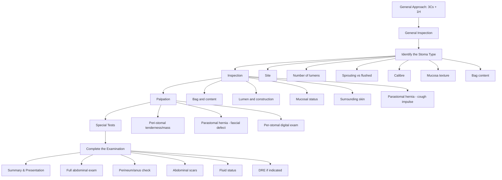

# Examination of Stoma

## Master Examination Framework

---

## General Approach (3Cs + 1H)

Before touching anything, you need to establish the basics. This is a guaranteed mark in every OSCE station—don't throw it away.

| Step | Action | Running Commentary |
|:-----|:-------|:-------------------|
| **Introduce** | State your name and role | *"Good morning, my name is Dr Chan, I am a medical student. May I confirm your name and date of birth?"* |
| **Consent** | Explain what you plan to do | *"I would like to examine your stoma today. This will involve looking at it, gently touching around it, and possibly a brief internal check. Is that okay?"* 「我想檢查你嘅造口，會睇同輕輕掂吓，可以嗎？」 |
| **Comfort** | Ensure patient is comfortable; offer chaperone | *"Please let me know at any point if you feel uncomfortable."* |
| **Hand hygiene** | State you would wash hands and don gloves | *"I would wash my hands and put on a pair of gloves before examining you."* |

**Positioning:** Patient supine, abdomen exposed from xiphisternum to symphysis pubis. Ensure adequate lighting. Ask the patient to relax with arms by their sides. The bed should be at a comfortable height for examination standing on the patient's right side.

> **Cantonese:** 「請你瞓低，放鬆你嘅肚，雙手放喺身旁。」(*Please lie down, relax your abdomen, place your arms at your sides.*)

---

## General Inspection (End of the Bed)

Before zooming in on the stoma, do a full 360° environmental scan. Examiners mark this — it shows you're thinking about the patient, not just the pathology.

- **Patient appearance:** Body habitus (cachexia in malignancy? obesity increasing parastomal hernia risk?), pallor, jaundice, distress level, nutritional status
- **Bedside clues:**
  - IV lines — TPN (suggests high-output stoma/short bowel)?
  - Fluid balance chart — monitoring stoma output
  - Stoma appliance supplies at bedside
  - Drainage bags (wound drain, catheter)
  - Medication chart — loperamide, codeine (used to reduce ileostomy output), electrolyte supplements
- **Hands:** Clubbing (IBD), palmar erythema, Dupuytren contracture (liver disease), koilonychia (iron deficiency from chronic GI loss)
- **Face/Eyes:** Pallor of conjunctivae, jaundice, oral ulcers (Crohn's), angular stomatitis
- **Abdominal overview:** Visible distension, scars (midline laparotomy, laparoscopic port sites, Pfannenstiel), obvious parastomal bulge

**Running commentary:**
> *"On general inspection, the patient appears comfortable at rest, is of normal body habitus, and there is no obvious distress. I can see a stoma appliance bag in the right/left iliac fossa. I note IV fluids running and a fluid balance chart at the bedside. I would like to proceed to examine the stoma more closely."*

---

## Step 1: Identify the Stoma Type — "What Is This Stoma?"

This is the first thing the examiner is testing. You need to classify the stoma before you start describing complications. Think of it as a systematic checklist [1][2][3]:

### Differentiating Features

| Feature | ***Ileostomy*** | ***Colostomy*** | Urostomy |
|:--------|:------------|:------------|:---------|
| **Site** | ***Right iliac fossa (RIF)*** | ***Left iliac fossa (LIF)*** (end); epigastric (transverse loop) | Usually RIF |
| **Calibre** | ***Small*** | ***Large*** | Small |
| **Sprouting** | ***Protruding sprout 2–3 cm*** | ***Flushed to skin*** | Sprouted |
| **Mucosa** | ***Pinkish, carpet-like texture (villi), 'double-sleeved'*** | ***Smoother mucosa*** | Pinkish |
| **Content** | ***Watery, greenish liquid*** | ***Formed or semisolid brown stool*** | Urine (with ureteric stents possibly visible early post-op) |

**Why does an ileostomy have a spout?** The ileal effluent is alkaline and contains activated proteolytic enzymes. If it contacts the peristomal skin, it causes severe excoriation and chemical dermatitis. The 2–3 cm Brooke spout directs effluent directly into the bag, protecting the skin. Colostomy content is more formed and less irritant, so it can sit flush [2][3].

### Number of Lumens [1]

| Configuration | What you see | Typical scenario |
|:--------------|:-------------|:-----------------|
| **One lumen (end stoma)** | Single circular opening | End colostomy (post-APR), end ileostomy (post-panproctocolectomy) |
| **Two adjacent lumens (loop stoma)** | Two openings side by side, often with a bridge visible early post-op | Loop ileostomy (defunctioning after anterior resection), loop colostomy |
| **Two separate stomas** | Two separate stomas on abdomen | Double-barrel stoma (e.g., colostomy + mucous fistula, or colostomy + end ileostomy) |

<Callout title="Exceptions to Conventional Siting" type="idea">
Exceptions include mobilization across quadrants to form double-barreled stomas to facilitate later re-anastomosis. In total pelvic exenteration, an ileostomy may be moved to the LIF to accommodate the ileal conduit in the RIF [1].
</Callout>

**Running commentary:**
> *"There is a drainage bag situated in the right iliac fossa. I would like to ask the patient's permission to remove the bag for further examination."*
> 「我可以除咗呢個造口袋嚟檢查吓嗎？」

---

## Step 2: Inspection

Once the bag is removed (ask first!), systematically inspect [1][2][3]:

### a) Bag and Content

- **How:** Look at the bag type (transparent vs opaque, one-piece vs two-piece) and its content before removing.
- **Normal:** Appropriate content for stoma type — greenish liquid for ileostomy, formed stool for colostomy.
- **Abnormal:** Blood in the bag (mucosal trauma, disease recurrence, ischaemia), high-output watery content from a colostomy (infection, overflow from obstruction), bile-stained output from a colostomy (possible small bowel pathology), absent output (obstruction, ileus).

**Commentary:**
> *"The bag is opaque. I would like to remove the bag for further examination. On removal, I can see greenish liquid content consistent with ileal effluent."*

### b) Lumen and Construction

- **How:** Count the number of openings. Assess whether the stoma is sprouted (raised above skin level) or flush with the skin.
- **Normal:** Single lumen end stoma or double lumen loop stoma, as expected for the clinical context.
- **Abnormal:** A sprouted stoma that was intended to be flush (prolapse?) or a flush stoma that should have been sprouted (retraction?).

**Commentary:**
> *"There is a stoma behind the bag with one lumen. The bowel is constructed with a sprout, projecting approximately 2 cm from the skin surface. Given the RIF location, small calibre, and sprouted construction, this is likely to be an end ileostomy."*

### c) Mucosal Status

- **How:** Inspect the colour, moisture, and integrity of the mucosal surface.
- **Normal:** ***Pinkish, moist, healthy-appearing mucosa*** [2]
- **Abnormal [2]:**
  - ***Dusky/purplish:*** Venous congestion — may be from tight fascial opening, oedema, or early ischaemia
  - ***Black/necrotic:*** Arterial ischaemia — surgical emergency if extends below fascial level
  - ***Pale:*** Anaemia or poor perfusion
  - ***Bleeding/ulcerated:*** Trauma from ill-fitting appliance, Crohn's recurrence, or varices (portal hypertension)
- **Pathophysiology:** Stoma ischaemia occurs when the mesenteric blood supply is compromised during stoma creation (excessive tension on mesentery, inadequate marginal artery) or post-operatively from oedema/compression.

**Commentary:**
> *"The mucosa looks pink and healthy with no features suggestive of ischaemia. There are no retractions or prolapse."*

### d) Surrounding Skin

- **How:** Examine the peristomal skin in a full 360° around the stoma.
- **Normal:** Intact, non-erythematous skin
- **Abnormal [1][2]:**
  - ***Erythema and excoriations:*** Contact dermatitis from effluent leakage — especially common around ileostomies due to alkaline enzymatic content
  - **Fistulation:** Openings near the stoma draining enteric content — Crohn's disease recurrence
  - **Fungal infection:** Satellite lesions with erythematous border — candidiasis in warm moist environment
  - **Gangrenous spots/bleeding:** Ischaemic changes spreading to skin level
  - **Mucocutaneous separation:** Breakdown at the junction — early post-op complication, infection, malnutrition, steroid use

**Commentary:**
> *"In the surrounding skin, there are no excoriations, erythema suggestive of dermatitis, fistulation, gangrenous or bleeding spots."*

### e) Stoma Complications Visible on Inspection [2][3]

| Complication | What you see | Mechanism |
|:-------------|:-------------|:----------|
| ***Stoma retraction (sunken stoma)*** | Stoma sits below skin level | Excessive tension, weight gain, ischaemia with scarring, insufficient mobilisation |
| ***Stoma prolapse*** | Stoma protrudes excessively (can be dramatic — > 5 cm) | Loop stomas most common; due to inadequate fixation, raised intra-abdominal pressure |
| ***Stoma stenosis*** | Narrowed opening, difficulty passing finger | Ischaemia → fibrosis, Crohn's disease, skin-level cicatrization |
| ***Parastomal hernia*** | Bulge around stoma, especially on coughing/straining | Fascial defect around stoma allows peritoneal contents to herniate |

### f) Parastomal Hernia Assessment (Inspection Phase)

- **How:** Ask the patient to cough 「請你咳一下」 while you observe the peristomal area. Look for a ***visible cough impulse*** — a bulge appearing or enlarging with the Valsalva manoeuvre [1][2][3].
- **Normal:** No bulge or impulse.
- **Abnormal:** A visible bulge that expands with coughing.
- **Why this matters:** Parastomal hernia is the ***most common late complication*** of stomas (up to 50% incidence for end colostomies). It can cause obstruction, strangulation, difficulty with appliance fitting, and cosmetic distress.

**Commentary:**
> *"I would now ask the patient to cough. Can you give me a cough, please?"* 「請你咳一下。」 *"There is no visible cough impulse to suggest a parastomal hernia."*

---

## Step 3: Palpation

> **Always ask for permission and wear gloves!** 「我會輕輕掂吓你嘅造口，可能會有少少唔舒服，如果痛就話我知。」(*I will gently touch around your stoma. It may be slightly uncomfortable — please tell me if it is painful.*)

### a) Peristomal Palpation (Outside → Inside)

- **How:** Palpate systematically from the peristomal skin inward toward the stoma base [1].
- **What to feel for:**
  - **Tenderness:** Suggests parastomal abscess, mucocutaneous separation with underlying infection, or ischaemia
  - **Mass:** Could be parastomal abscess or hernia contents
  - **Warmth:** Active inflammation/abscess
- **Normal:** Non-tender, no masses, normal temperature

### b) Recheck Parastomal Hernia (Palpation Phase)

- **How:** Ask the patient to cough again 「再咳一下」 while palpating around the stoma. If a bulge is present, palpate for the ***fascial defect*** — its size, edges, and reducibility [1].
- **Positive finding:** Palpable defect in the rectus sheath/fascia with reducible hernia content (bowel loops, omentum).
- **Assess reducibility:** Gently attempt to reduce the hernia content while the patient is relaxed. Note if it is easily reducible, partially reducible, or irreducible.

<Callout title="Irreducible parastomal hernia" type="error">
An irreducible, tender parastomal hernia with overlying skin changes is a **surgical emergency** — suspect strangulation or incarceration. Escalate immediately.
</Callout>

**Commentary:**
> *"I am now palpating from the surrounding skin towards the stoma base. There is no tenderness, no palpable mass, and no warmth. I will ask the patient to cough once more — there is no palpable cough impulse or fascial defect."*

### c) Per-Stomal Digital Examination

- **How:** This is essentially like a PR examination but through the stoma. Ask for permission again. Lubricate your gloved finger and gently insert into the stoma lumen [1][3].
- **What to assess:**
  - **Patency:** Can the finger pass easily? Resistance suggests stenosis.
  - **Lumen direction:** Helps assess the orientation of the bowel
  - **Mucosal feel:** Smooth? Masses? Polyps?
  - **Sphincter tone:** Not applicable (no sphincter), but note any circumferential tightness (stenosis at fascial level vs skin level)
- **Normal:** Finger passes easily, smooth mucosa, no masses
- **Abnormal:** Tight stenosis (finger cannot pass), palpable mass (recurrence, granulation tissue), bleeding on examination

> **Note:** The stoma has no somatic nerve supply in the mucosa — the patient should not feel sharp pain from mucosal palpation. If they experience pain, it is likely from the skin-mucosal junction or from underlying peritoneal irritation, which is a red flag [1].

**Commentary:**
> *"With your permission, I would like to gently examine inside the stoma opening, similar to a rectal examination. This should not be painful."*
> *"The stoma is patent, admitting my index finger easily. The mucosa is smooth with no palpable masses. There is no stenosis at the skin or fascial level."*

---

## Step 4: Special Tests and Named Clinical Signs

### Cough Impulse Test for Parastomal Hernia

- **Technique:** Patient supine → observe and palpate peristomal area → ask patient to cough
- **Positive result:** Visible bulge or palpable impulse expanding on coughing
- **Mechanism:** Raised intra-abdominal pressure forces peritoneal contents through the fascial defect around the stoma
- **High yield:** This is the ***single most important special test*** for stoma examination. Never forget it [1][2][3].

### Standing Examination for Parastomal Hernia

- **Technique:** If clinically suspected but not obvious supine, ask the patient to stand 「請你企起身」and repeat the cough test
- **Why:** Gravity increases the hernial sac size, making small hernias more apparent
- **Positive result:** Bulge visible on standing that was not apparent supine

### Stoma Prolapse Assessment

- **Technique:** Observe the stoma with the patient at rest, then during coughing/straining
- **Positive result:** Increasing protrusion of bowel through the stoma site, sometimes dramatically
- **Note:** A prolapsed loop colostomy classically involves the distal (non-functioning) limb prolapsing. Distinguish from normal spouting of an ileostomy (2–3 cm is normal).

---

## Step 5: Completing the Examination

To show the examiner you are thinking holistically [1][3]:

### a) Full Abdominal Examination
> *"To complete my assessment, I would like to perform a full abdominal examination including inspection of all quadrants, palpation for masses and organomegaly, percussion, and auscultation for bowel sounds."*

### b) Abdominal Scars
- Look for midline laparotomy scars, laparoscopic port sites (usually 4 in laparoscopic surgery), Pfannenstiel scars
- This helps you deduce the surgical history

### c) Perineum and Anus — Critical for End Colostomy [3]

> *"For an end colostomy, I would examine the perineum."*

| Finding | Implication |
|:--------|:-----------|
| ***Absent anus + 4 laparoscopic port scars*** | ***Abdominoperineal resection (APR)*** — permanent end colostomy for low rectal cancer |
| ***Present anus + midline laparotomy scar*** | ***Hartmann's procedure*** — potentially reversible end colostomy (e.g., for diverticular perforation, obstruction) |

**Why this matters:** This is a favourite OSCE question. Identifying whether the anus is present or absent helps you determine the surgical procedure and whether the stoma is potentially reversible.

### d) Digital Rectal Examination (DRE)
- If anus present: DRE to assess for rectal stump pathology, recurrence, mucous fistula
- If anus absent: Document its absence — confirms APR

### e) Digital Examination of Stoma for Patency [3]
- Already covered in palpation, but mention it explicitly to the examiner

### f) Fluid Status Assessment
- Especially important for ileostomy patients who are at risk of dehydration and electrolyte disturbance (high-output stoma)
- Check skin turgor, mucous membranes, JVP, capillary refill, urine output

**Commentary:**
> *"To complete my examination, I would perform a full abdominal examination, inspect the perineum for the presence or absence of the anus, perform a DRE if the anus is present, and assess the patient's fluid and nutritional status."*

---

## Expected Positive vs Important Negative Findings

### Expected Positive Findings (to describe)
- Stoma type correctly identified (site, calibre, sprout, content)
- Healthy pink mucosa
- Patent stoma
- Appropriate stoma output

### Important Negative Findings (to document)
- **No** ischaemic changes (no dusky, purplish, or black mucosa)
- **No** retraction or prolapse
- **No** stenosis
- **No** parastomal hernia (no cough impulse, no fascial defect)
- **No** peristomal skin excoriation or dermatitis
- **No** fistulae
- **No** mucocutaneous separation

---

## Red-Flag Examination Findings and Escalation Triggers

| Red Flag | Concern | Action |
|:---------|:--------|:-------|
| ***Black/necrotic mucosa*** | Arterial ischaemia — extends below fascia | **Urgent surgical review** — may need laparotomy |
| Irreducible, tender parastomal hernia | Strangulation/incarceration | **Emergency surgical consult** |
| No stoma output > 12 hours + abdominal distension | Bowel obstruction | Urgent imaging (AXR/CT), NBM, IV fluids |
| High-output stoma ( > 1.5–2 L/day) | Dehydration, electrolyte derangement (↓Na, ↓K, ↓Mg, metabolic acidosis) | Aggressive IV fluid replacement, check U&E, consider loperamide/codeine |
| Active bleeding from stoma | Mucosal trauma, variceal bleeding, recurrence | Assess haemodynamic stability, urgent review |
| Mucocutaneous separation with purulent discharge | Abscess, wound infection | Wound swab, antibiotics, surgical review |

---

## Common OSCE Pitfalls

<Callout title="Don't Make These Mistakes" type="error">

1. **Forgetting to ask to remove the bag** — You MUST ask the patient/examiner if you can remove the stoma bag. Jumping straight to describing the stoma without doing this looks amateurish.
2. **Not asking the patient to cough** — The parastomal hernia cough test is the most commonly forgotten step and is always on the mark scheme.
3. **Not checking the perineum** — For an end colostomy, failing to check whether the anus is present or absent means you cannot differentiate APR from Hartmann's. This is a classic viva question.
4. **Calling every stoma a colostomy** — Use the systematic checklist (site, calibre, spout, content, mucosa) before committing to a label.
5. **Forgetting to mention per-stomal digital examination** — Even if you don't perform it (the examiner may tell you not to on a real patient), *state that you would like to do it*.
6. **Not mentioning fluid status for ileostomies** — Ileostomy patients are at high risk of dehydration and electrolyte abnormalities. The examiner wants to hear you mention this.
7. **Not wearing gloves** — Basic infection control. Always state it.

</Callout>

---

## High-Yield Exam-Focused Interpretation Tips

- **Why ileostomies are sited in the RIF:** The terminal ileum naturally lies in the RIF, and the stoma is brought out through the rectus abdominis muscle (reduces parastomal hernia risk). The same logic applies to colostomies in the LIF (sigmoid colon).
- **Why loop stomas are preferred for defunctioning:** They are easier to reverse (no need for re-laparotomy in some cases, as the posterior wall is intact). ***Loop ileostomy has the highest complication rate*** among stoma types [2].
- **Why colostomies are flush:** Colonic content is formed and less irritant to skin, so a spout is unnecessary and cosmetically undesirable.
- **Content tells you the level:** The more proximal the stoma, the more liquid and enzymatic the content. Ileostomy output is alkaline and rich in bile salts → skin damage. Colostomy output is more formed → less skin damage.
- **Complications timeline:**
  - **Early (days):** Ischaemia/necrosis, mucocutaneous separation, oedema, high output
  - **Late (weeks–months):** Parastomal hernia, prolapse, stenosis, retraction, peristomal dermatitis

---

## Model Reporting Script

> *"On examination, Mr Chan appears comfortable at rest and is of normal body habitus. Vital signs are stable.*
>
> *On inspection, there is a stoma appliance bag situated in the right iliac fossa. With permission, I removed the bag and identified greenish liquid content consistent with ileal effluent. The stoma has a single lumen and is constructed with a Brooke spout, projecting approximately 2 cm from the skin surface. Given the RIF location, small calibre, sprouted construction, and liquid content, this is consistent with an end ileostomy.*
>
> *The mucosa appears pink, moist, and healthy with no features suggestive of ischaemia, retraction, or prolapse. The surrounding peristomal skin is intact with no excoriations, erythema, fistulation, or mucocutaneous separation.*
>
> *On asking the patient to cough, there is no visible cough impulse to suggest a parastomal hernia.*
>
> *On palpation, there is no peristomal tenderness, mass, or warmth. There is no palpable cough impulse or fascial defect. Per-stomal digital examination reveals a patent stoma with smooth mucosa and no palpable masses or stenosis.*
>
> *I examined the abdomen which is soft and non-tender with no distension. There is a midline laparotomy scar. The perineum reveals the anus is absent, consistent with a prior abdominoperineal resection. Fluid status assessment shows moist mucous membranes and normal skin turgor.*
>
> *In summary, this patient has a well-functioning end ileostomy with healthy mucosa and no complications. The absent anus and midline scar suggest a previous panproctocolectomy, likely in the context of inflammatory bowel disease."*

---

<Callout title="High Yield Summary">

**Stoma Identification Checklist:** Site → Lumens → Spout → Calibre → Mucosa → Content

**Key Differentiators:** RIF + sprouted + liquid green = ileostomy; LIF + flush + formed stool = colostomy

**Never forget:** (1) Ask to remove the bag, (2) Ask the patient to cough for parastomal hernia, (3) Check the perineum for end colostomy (APR vs Hartmann's), (4) Offer per-stomal digital exam, (5) Assess fluid status for ileostomies

**Complication rate:** ***Loop ileostomy has the highest complication rate*** among all stoma types [2]

**Red flags to escalate:** Black/necrotic mucosa (ischaemia below fascial level), irreducible tender parastomal hernia (strangulation), absent stoma output with distension (obstruction), high-output stoma > 2L/day (dehydration crisis)
</Callout>

---

<ActiveRecallQuiz
  title="Active Recall - Physical Exam"
  items={[
    {
      question: "How do you differentiate an ileostomy from a colostomy on physical examination?",
      markscheme: "Ileostomy: RIF, small calibre, sprouted 2-3cm, liquid greenish content, carpet-like villi mucosa. Colostomy: LIF, large calibre, flush to skin, formed brown stool, smoother mucosa.",
    },
    {
      question: "Why is an ileostomy constructed with a Brooke spout rather than flush to the skin?",
      markscheme: "Ileal effluent is alkaline and contains activated proteolytic enzymes that cause severe peristomal skin excoriation and chemical dermatitis. The spout directs effluent into the bag, protecting the skin.",
    },
    {
      question: "How do you assess for parastomal hernia and what constitutes a positive finding?",
      markscheme: "Ask the patient to cough while inspecting and palpating the peristomal area. Positive finding: visible cough impulse or palpable bulge expanding on coughing, with a palpable fascial defect. If negative supine, repeat standing.",
    },
    {
      question: "For an end colostomy, how do you determine whether it was formed as part of an APR or a Hartmann procedure?",
      markscheme: "Examine the perineum: absent anus with laparoscopic port scars suggests APR (permanent stoma); present anus with midline laparotomy scar suggests Hartmann procedure (potentially reversible).",
    },
    {
      question: "What are the red-flag signs on stoma examination that require urgent surgical escalation?",
      markscheme: "Black or necrotic mucosa extending below fascial level (arterial ischaemia), irreducible tender parastomal hernia (strangulation), absent stoma output with abdominal distension (obstruction), active haemorrhage from stoma.",
    },
    {
      question: "Which stoma type has the highest complication rate, and what fluid and electrolyte problems are associated with ileostomies?",
      markscheme: "Loop ileostomy has the highest complication rate. Ileostomies risk high-output dehydration, hyponatraemia, hypokalaemia, hypomagnesaemia, and metabolic acidosis due to bicarbonate loss.",
    },
  ]}
/>

## References

[1] Senior notes: Ryan Ho Fundamentals.pdf (Section 2.4.3 / 2.10.3 - Examination of a Stoma, pp. 82, 154–155)
[2] Senior notes: felixlai.md (Section II - Physical Examination / Examination of Stoma, pp. 67–68)
[3] Senior notes: maxim.md (Section: Examination of stoma, pp. 83–84)
[4] Senior notes: Ryan Ho GI.pdf (Section 1.3 / 3.3.7.2 - Examination of a Stoma, pp. 30, 187)
