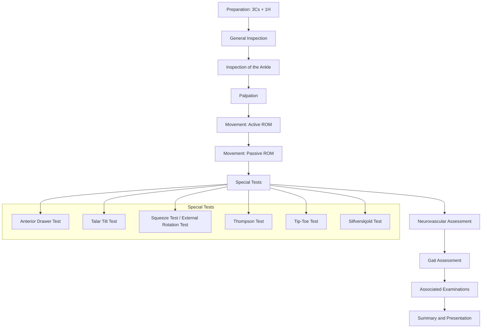

# Examination of the Ankle

## Master Examination Framework

---

## Preparation (3Cs + 1H + 3Ps)

Before you touch the patient, set the scene properly. This is a free-marks station — don't lose marks here.

| Step | Action | Running Commentary |
|---|---|---|
| **Consent** | Introduce yourself, explain what you will do, and ask permission | *"Good morning, my name is Dr Chan. I am a medical student. I have been asked to examine your ankle today. May I proceed?"* 「你好，我姓陳，係醫學生。我今日想檢查下你隻腳踝，可以嗎？」 |
| **Curtains** | Draw the curtains for privacy | *"Let me draw the curtains for your privacy."* |
| **Chaperone** | Offer a chaperone | *"Would you like a chaperone present?"* |
| **Hand hygiene** | Wash hands or use alcohol gel | *"I would like to wash my hands before I begin."* |
| **Exposure** | Expose both lower limbs from the knee down (bilateral comparison is essential); ideally, shoes and socks off on both sides | *"Could you please remove your shoes and socks on both sides, and roll your trousers up to above your knees?"* 「可唔可以除咗你兩邊嘅鞋同襪，同埋將褲腳捲到膝頭以上？」 |
| **Pain** | Ask about pain before touching | *"Before I begin, do you have any pain at the moment?"* 「開始之前，你而家有冇邊度痛？」 |
| **Positioning** | Start with the patient **sitting on the edge of the bed** (feet hanging) or **supine** — you will need them **standing** later for gait and hindfoot assessment | *"Please sit comfortably on the edge of the bed with your legs hanging over."* |

<Callout title="Always Compare Both Sides" type="idea">
The ankle exam is inherently comparative. Every step of inspection, palpation, and movement should be performed bilaterally. Examiners expect you to make this explicit.
</Callout>

---

## General Inspection

Begin from the end of the bed. This takes 10–15 seconds and earns easy marks.

**Around the bedside:**
- Walking aids (crutches, CAM boot, orthotic devices) — suggests weight-bearing restriction
- Ankle brace or taping — suggests instability or recent injury
- Plaster / backslab — suggests fracture
- IV lines, drains — suggest post-operative state
- Medications: analgesia chart

**On first glance at the patient:**
- **General status**: comfortable at rest vs. in distress/pain
- **Body habitus**: obesity (increased load on ankle), athletic build (sports injury)
- **Mobility**: weight-bearing vs. non-weight-bearing
- **Footwear nearby**: look at the soles for asymmetric wear patterns (suggests malalignment)

**Running commentary:**
> *"On general inspection, the patient appears comfortable at rest. I note a pair of crutches beside the bed. There is no plaster or ankle brace currently in situ. The patient does not appear to be in acute distress."*

---

## Systematic Examination Sequence

### A. Inspection

This is the "Look" phase. You inspect systematically from anterior, medial, lateral, and posterior aspects.

**How:** Inspect both ankles simultaneously, comparing side to side. Ask the patient to point to the most painful area first so you can palpate that last.

| What to Look For | Normal | Abnormal | Pathophysiology |
|---|---|---|---|
| **Swelling** | Symmetrical, well-defined malleoli | Diffuse soft tissue swelling, effusion (fullness anterior to malleoli), localised swelling | Joint effusion fills the ankle recess anterior to the malleoli. Diffuse swelling suggests inflammation or trauma. Localised swelling may be a ganglion, bursitis, or tendon sheath thickening |
| **Skin changes** | Normal colour, no breaks | Ecchymosis/bruising (esp. around malleoli), erythema, trophic changes, ulceration | Bruising tracks distally with gravity after ligamentous injury. Erythema may indicate infection or inflammatory arthritis. Trophic changes suggest chronic venous insufficiency or PAD [1] |
| **Deformity** | Neutral hindfoot alignment | Valgus (eversion) or varus (inversion) deformity, pes planus, pes cavus | ***Hindfoot valgus*** is associated with **pes planus** and posterior tibial tendon dysfunction. ***Hindfoot varus*** is associated with **pes cavus** and lateral ligament overload [2] |
| **Muscle wasting** | Symmetric calf bulk | Calf wasting (measure circumference 10 cm below tibial tuberosity) | Disuse atrophy from chronic ankle pathology or L5/S1 radiculopathy |
| **Scars** | None | Lateral scars (lateral ligament reconstruction e.g. ***Brostrom-Gould procedure***), medial scars (deltoid repair/ORIF), posterior scar (Achilles tendon repair), arthroscopy portals [3] | Suggest previous surgical intervention |
| **Foot arch** | Normal medial longitudinal arch | Flat (pes planus) or excessively high (pes cavus) | Pes planus → tibialis posterior insufficiency; pes cavus → neurological causes (CMT, spina bifida) |
| **Achilles tendon** | Smooth contour, symmetric bulk | Thickening, nodularity, gap/defect | Thickening = tendinopathy; gap = acute rupture |
| **Hindfoot alignment** (view from behind, patient standing) | Slight valgus (5–10°), 2 toes visible laterally ("too many toes sign" is abnormal) | Excessive valgus: > 2 toes visible from behind ("***too many toes sign***"); excessive varus | Too many toes sign = forefoot abduction secondary to posterior tibial tendon dysfunction / pes planus [2] |

**Running commentary:**
> *"On inspection, the right ankle appears swollen, particularly around the lateral malleolus, with bruising extending to the lateral aspect of the foot. There is no obvious deformity, no scars, and no muscle wasting of the calves bilaterally. The skin appears intact with no ulceration or trophic changes. Looking from behind, the hindfoot alignment appears neutral and there is no too-many-toes sign."*

**Cantonese instruction:**
- *"Please stand up for me."* 「請你企起身。」
- *"Can you stand on one leg?"* 「可唔可以用一隻腳企？」

---

### B. Palpation

**Golden rule:** Ask about pain first, palpate the unaffected side first, and save the most tender area for last.

**Temperature:**
- Use the **dorsum of your hand** bilaterally, comparing both ankles simultaneously.
- Warmth suggests synovitis, infection, or recent injury.

**Running commentary:**
> *"I will now assess the temperature of both ankles using the back of my hands. The right ankle feels warmer than the left, which may suggest an active inflammatory or infective process."*

#### Systematic Palpation (Bony Landmarks)

Work through these landmarks systematically. A good mnemonic is to go **medial → anterior → lateral → posterior**.

| Structure | How to Palpate | What You're Looking For | Clinical Significance |
|---|---|---|---|
| **Medial malleolus** | Palpate the tip and the posterior 6 cm of the posterior edge of the tibia | Point tenderness | Fracture (Ottawa rules) [3] |
| **Deltoid ligament** (medial) | Fan-shaped, below medial malleolus | Tenderness, swelling | Deltoid ligament sprain (eversion injury) — the ***deltoid ligament is very strong*** so more commonly get fracture than sprain [3] |
| **Tibialis posterior tendon** | Palpate posterior to medial malleolus, follows to navicular tuberosity insertion | Tenderness, thickening, subluxation | Tibialis posterior tendinopathy / rupture → progressive pes planus [2] |
| **Navicular tuberosity** | Palpate the bony prominence on the medial midfoot | Point tenderness | Navicular stress fracture, accessory navicular, tibialis posterior insertional tendinopathy |
| **Anterior ankle joint line** | Palpate medial to the tibialis anterior tendon; ***dorsiflex to palpate anterior talus, plantarflex to palpate posterior talus*** [2] | Effusion (boggy swelling), tenderness | Joint effusion, osteochondral lesion of the talus, anterior ankle impingement |
| **Lateral malleolus** | Palpate the tip and posterior 6 cm of the posterior edge of the fibula | Point tenderness | Fracture (Ottawa rules) [3] |
| **ATFL** (anterior talofibular ligament) | Immediately anterior and inferior to the lateral malleolus, in the **sinus tarsi** region | Tenderness, swelling | ***Most commonly injured ankle ligament*** (injured in inversion with plantarflexion) [3] |
| **CFL** (calcaneofibular ligament) | Inferior to lateral malleolus, runs vertically to the calcaneus | Tenderness | Second most commonly injured lateral ligament |
| **Sinus tarsi** | Depression anteroinferior to lateral malleolus, between talus and calcaneus on the lateral side [2] | Tenderness | Sinus tarsi syndrome (post-traumatic subtalar instability, subtalar arthritis) |
| **Base of 5th metatarsal** | Palpate the bony prominence on the lateral aspect of the midfoot | Point tenderness | Avulsion fracture (peroneus brevis insertion) — commonly missed with "ankle sprain" |
| **Peroneal tendons** | Behind and below the lateral malleolus | Tenderness, subluxation (ask patient to actively evert against resistance and watch for snapping) | Peroneal tendinopathy / subluxation |
| **Achilles tendon** | Palpate from the ***musculotendinous junction*** → ***midshaft*** → ***insertion on calcaneus*** [2] | Thickening, nodularity, tenderness, gap/defect | Tendinopathy (midportion most common), partial/complete rupture (gap at 2–6 cm from insertion) |
| **Retrocalcaneal bursa** | Squeeze anterior to the Achilles tendon at its insertion (between tendon and calcaneus) [2] | Tenderness, fullness | Retrocalcaneal bursitis (Haglund's disease) |
| **Calcaneus** | Squeeze from both sides, then palpate the plantar surface | Medial/lateral squeeze tenderness vs. plantar tenderness | Calcaneal stress fracture (squeeze test positive) vs. plantar fasciitis (plantar medial tubercle tenderness) |

<Callout title="Ottawa Ankle Rules" type="error">
**This is extremely high yield for OSCE.** An X-ray is indicated if there is pain in the malleolar zone AND any one of: (1) bone tenderness at the distal 6 cm of the posterior edge of the **tibia** or tip of the **medial malleolus**, (2) bone tenderness at the distal 6 cm of the posterior edge of the **fibula** or tip of the **lateral malleolus**, (3) inability to bear weight **immediately** after injury + in A&E for **4 steps**. Don't forget the midfoot rules: tenderness over the navicular or base of the 5th metatarsal also warrants imaging. [3]
</Callout>

**Running commentary:**
> *"I will now palpate the ankle, starting on the unaffected side first. On the right ankle, there is point tenderness over the anterior talofibular ligament and mild tenderness over the calcaneofibular ligament. There is no bony tenderness over the medial or lateral malleolus, the base of the fifth metatarsal, or the navicular. The Achilles tendon is non-tender with no palpable defect."*

---

#### Soft Tissue / Effusion Assessment

- **Ankle effusion** is best detected by palpating the anteromedial and anterolateral gutters (depressions either side of the extensor tendons on the anterior ankle). Fullness or bogginess here indicates effusion.
- Unlike the knee, the ankle does not have a reliable "bulge sign" equivalent, so gentle palpation for boggy fluctuance is the standard.

#### Peripheral Pulses

Always check vascular status — especially important after trauma or if considering compression:

- ***Posterior tibial pulse***: posterior and inferior (⅓ of the way down) to the medial malleolus [1]
- ***Dorsalis pedis pulse***: dorsum of foot, lateral to the extensor hallucis longus tendon [1]
- **Capillary refill**: press the nail bed or pulp for a few seconds; normal < 2 seconds [1]

**Running commentary:**
> *"Both the dorsalis pedis and posterior tibial pulses are palpable bilaterally with a capillary refill time of less than 2 seconds."*

---

### C. Movement

Assess **active ROM** first, then **passive ROM**. The ankle complex involves multiple joints, and you must distinguish them.

**Cantonese instructions:**
- *"Please point your toes down as far as you can."* 「請將腳趾盡量向下指。」(plantarflexion)
- *"Now pull your toes up towards you."* 「而家將腳趾盡量向上翹。」(dorsiflexion)
- *"Turn the sole of your foot inward."* 「將腳板向內翻。」(inversion)
- *"Turn the sole of your foot outward."* 「將腳板向外翻。」(eversion)

| Movement | Joint(s) Involved | Normal ROM | How to Test | Abnormal Findings |
|---|---|---|---|---|
| **Dorsiflexion** | Ankle (tibiotalar) | ~20° | Stabilise the hindfoot with one hand, push the forefoot upward with the other | ↓ROM: gastrocnemius/soleus tightness, anterior impingement, OA |
| **Plantarflexion** | Ankle (tibiotalar) | ~50° | Push the forefoot downward | ↓ROM: posterior impingement, OA, Achilles tendon pathology |
| **Inversion** | ***Subtalar + talocalcaneonavicular*** [2] | ~30° | Cup the heel and turn the sole inward | ↓ROM: subtalar OA, coalition. Pain: lateral ligament injury |
| **Eversion** | ***Subtalar + talocalcaneonavicular*** [2] | ~20° | Cup the heel and turn the sole outward | ↓ROM: subtalar pathology. Pain: deltoid injury, medial impingement |

**Key point:** When assessing ankle dorsiflexion vs. plantarflexion, you must **neutralise the subtalar joint** by holding the calcaneus in neutral, otherwise subtalar motion contaminates your measurement [2].

**Running commentary:**
> *"I will now assess the range of movement. Can you please move your ankle up and down for me? ... Good. Now I will gently move it myself. On passive dorsiflexion of the right ankle, the range is reduced to approximately 10 degrees compared to 20 degrees on the left, with discomfort at the end of range. Plantarflexion, inversion, and eversion are full and pain-free bilaterally."*

<Callout title="Active vs Passive ROM" type="idea">
↓ Active ROM with preserved passive ROM → soft tissue problem (e.g. tendon rupture, muscle weakness, pain inhibition).
↓ Both active and passive ROM → joint pathology (e.g. OA, synovitis, capsular contracture, bony block) [4].
</Callout>

---

### D. Special Tests

These are the money-makers in an ankle OSCE. Know when to apply each test and what it means.

---

#### 1. Anterior Drawer Test (for ATFL integrity)

**Technique:**
1. Patient sitting or supine with the knee flexed to ~90° (relaxes the gastrocnemius) and the foot in slight plantarflexion (~10–20°).
2. One hand stabilises the anterior distal tibia.
3. The other hand cups the heel (calcaneus) and draws the foot **anteriorly**.

**Positive result:** Excessive anterior translation of the talus compared to the contralateral side, often with a soft or absent endpoint. A "clunk" or "suction" sensation may be felt.

**What it tests:** Integrity of the ***anterior talofibular ligament (ATFL)*** — the primary restraint to anterior talar translation, especially in plantarflexion [3].

**Sensitivity/Specificity:** Sensitivity ~58–74%, specificity ~84% (varies with timing — more reliable > 5 days post-injury when guarding subsides).

**Pathophysiological basis:** The ATFL is the weakest lateral ligament and is the first to fail in an inversion-plantarflexion injury. When ruptured, the talus can sublux anteriorly out of the mortise [3].

**Running commentary:**
> *"I will now perform the anterior drawer test to assess the integrity of the anterior talofibular ligament. I am stabilising the tibia with my left hand and cupping the heel with my right hand, drawing the foot forward. On the right, there is increased anterior translation compared to the left with a soft endpoint, suggesting ATFL insufficiency."*

---

#### 2. Talar Tilt Test (for CFL integrity)

**Technique:**
1. Patient supine or sitting, ankle in neutral position.
2. One hand stabilises the distal tibia/fibula.
3. The other hand cups the heel and applies an **inversion (varus) stress**.

**Positive result:** Excessive talar tilt (> 5–10° more than the uninjured side) with a soft endpoint.

**What it tests:** Integrity of the ***calcaneofibular ligament (CFL)*** — the primary restraint to varus tilt of the talus in neutral ankle position [3].

**Pathophysiological basis:** The CFL bridges both the ankle and subtalar joints. When the CFL is torn (usually after the ATFL has already failed), there is combined ankle and subtalar instability [3].

**Running commentary:**
> *"I will now perform the talar tilt test. I am holding the tibia steady and applying an inversion force to the heel. There is increased talar tilt on the right compared to the left, suggesting CFL injury in addition to ATFL injury."*

---

#### 3. External Rotation Stress Test (for syndesmotic / high ankle sprain)

**Technique:**
1. Patient sitting with knee flexed to 90°.
2. One hand stabilises the leg just above the ankle.
3. The other hand externally rotates the foot.

**Positive result:** Pain at the anterolateral ankle (over the ***anterior inferior tibiofibular ligament, AITFL***).

**What it tests:** Integrity of the syndesmosis (AITFL, PITFL, interosseous membrane) [3].

---

#### 4. Squeeze Test (for syndesmotic injury)

**Technique:**
1. Squeeze the tibia and fibula together at the **mid-calf level** (well above the ankle).

**Positive result:** Pain felt at the syndesmosis (distal tibiofibular joint).

**Pathophysiological basis:** Compressing the tibia and fibula proximally splays the bones distally, stressing the syndesmotic ligaments. If the syndesmosis is disrupted, this produces pain [3].

**Clinical relevance:** ***High ankle sprains*** (syndesmotic injuries) are more disabling and take longer to heal than low ankle sprains. They are caused by external rotation/dorsiflexion mechanism [3].

**Running commentary:**
> *"I will now perform the squeeze test for a syndesmotic injury. I am compressing the tibia and fibula at the mid-calf level. This does not reproduce any pain at the ankle, making a high ankle sprain less likely."*

---

#### 5. Thompson Test (Simmonds' Test) — for Achilles Tendon Rupture

**Technique:**
1. Patient **prone** (lying face down) with feet hanging off the edge of the bed, or kneeling on a chair.
2. Squeeze the calf muscle belly firmly with both hands.

**Positive result (abnormal):** **No plantarflexion** of the foot on squeezing the calf = **positive Thompson test** = Achilles tendon rupture.

**Normal result:** Squeezing the calf produces passive plantarflexion of the foot.

**Sensitivity:** ~96% sensitive for complete Achilles tendon rupture.

**Pathophysiological basis:** Squeezing the gastrocnemius-soleus complex mechanically compresses the muscle, which should transmit force through an intact Achilles tendon to plantarflex the foot. If the tendon is ruptured, this mechanical linkage is broken.

**Running commentary:**
> *"I will now perform the Thompson test to check for Achilles tendon rupture. I am asking the patient to lie face-down. I am squeezing the right calf firmly. The foot plantarflexes normally, indicating an intact Achilles tendon. The test is negative."*

**Cantonese:** *"Please lie face down on the bed."* 「請你反轉面趴低喺床度。」

---

#### 6. Tip-Toe Test (for posterior tibial tendon function / hindfoot alignment)

**Technique:**
1. Patient standing, viewed from behind.
2. Ask the patient to rise up onto their tiptoes (bilateral first, then **single-leg**).

**What to look for:**
- Normal: The hindfoot should swing from its resting slight valgus into ***varus*** when going on tiptoe [2].
- Abnormal: The hindfoot remains in valgus or the patient cannot perform a single-leg heel raise.

**Positive result:** Failure of the hindfoot to invert = posterior tibial tendon insufficiency.

**Pathophysiological basis:** The tibialis posterior is the primary dynamic stabiliser of the medial longitudinal arch and the primary invertor of the hindfoot. When it is dysfunctional, the heel remains in valgus and the arch collapses [2].

**Running commentary:**
> *"I will now perform the tip-toe test. Please stand up on both tiptoes for me... Good. Now can you do that on just your right foot? ... On the right, the hindfoot inverts normally. Now the left... The left hindfoot fails to invert and remains in valgus, which suggests posterior tibial tendon dysfunction."*

**Cantonese:** *"Please stand on your tiptoes."* 「請你用腳尖企起。」 *"Now just on your right foot."* 「而家淨係用右腳。」

---

#### 7. Silfverskiöld Test (for gastrocnemius vs. soleus contracture)

**Technique:**
1. ***Neutralise the subtalar joint*** by holding the calcaneus [2].
2. Assess ankle dorsiflexion with the **knee extended** (gastrocnemius taut).
3. Repeat with the **knee flexed to 90°** (gastrocnemius relaxed).

**Interpretation:**
- ↓ Dorsiflexion with knee extended that **improves with knee flexion** = ***gastrocnemius contracture*** (positive Silfverskiöld test) [2].
- ↓ Dorsiflexion with both knee extended AND flexed = soleus contracture (or combined).

**Pathophysiological basis:** The gastrocnemius crosses both the knee and ankle joints. Flexing the knee relaxes the gastrocnemius, isolating the soleus contribution to ankle dorsiflexion.

---

#### 8. Coleman Block Test (for flexible vs. rigid hindfoot varus)

**Technique:**
1. Patient standing with the lateral border of the foot on a wooden block (~2.5 cm) so the 1st metatarsal head hangs off the medial edge.

**Interpretation:**
- If the hindfoot varus **corrects** to neutral/valgus → ***forefoot-driven (flexible)*** varus [2].
- If the hindfoot varus **persists** → ***rigid*** hindfoot varus.

**Relevance:** Determines whether surgical correction should address the forefoot alone or the hindfoot as well. Commonly tested in pes cavus assessment.

---

### E. Neurovascular Assessment

Always assess the neurovascular status of the foot to complete the ankle examination — this is especially critical in trauma and post-operatively.

| Assessment | Method | Relevant Nerve/Vessel |
|---|---|---|
| **Sensation: superficial peroneal nerve** | Light touch over dorsum of foot (except 1st web space) | L5 (superficial peroneal) |
| **Sensation: deep peroneal nerve** | Light touch over 1st web space | L5 (deep peroneal) |
| **Sensation: tibial nerve** | Light touch over sole of foot | S1 (tibial) |
| **Sensation: sural nerve** | Light touch over lateral border of foot | S1 (sural) |
| **Motor: deep peroneal** | Dorsiflexion of great toe / ankle (EHL / TA) | L4-5 |
| **Motor: superficial peroneal** | Eversion of foot (peroneal muscles) | L5-S1 |
| **Motor: tibial** | Plantarflexion of foot / toe flexion | S1-2 |
| **Pulses** | Dorsalis pedis + posterior tibial | — |
| **Capillary refill** | Nail bed compression | < 2 seconds normal [1] |

---

### F. Gait Assessment

**Cantonese:** *"Please walk to the end of the room and back for me."* 「請你行去房間盡頭再行返嚟。」

Observe:
- Antalgic gait (shortened stance phase on affected side — avoids bearing weight due to pain)
- Foot drop / steppage gait (common peroneal nerve palsy — L4/5)
- Trendelenburg gait (hip pathology — may refer to ankle area)
- Heel and toe walking (tests L4-5 and S1 respectively)

**Running commentary:**
> *"On gait assessment, the patient has a mildly antalgic gait favouring the right ankle. Heel and toe walking are possible bilaterally. There is no evidence of a foot drop."*

---

## Associated Examinations to Complete the Assessment

> *"To complete my examination, I would like to…"*

- **Examine the knee** — to rule out referred pain (knee pathology can refer to the ankle and vice versa) [4]
- **Examine the foot** — assess the forefoot, midfoot, and toes (hallux valgus, lesser toe deformities, plantar fascia) [2]
- **Examine the contralateral ankle** — for comparison (if not already done during the exam)
- **Perform a full neurovascular examination of the lower limb** — especially if trauma or compartment syndrome is suspected
- **Assess the peripheral arterial system** — palpate all peripheral pulses if vascular disease is suspected; measure **ankle-brachial index (ABI)** if a Doppler probe is available [1]
- **Perform an Ottawa Ankle Rules assessment** — to determine need for X-ray [3]
- **Order imaging**: X-ray (AP, lateral, and ***mortise view — 20° internal rotation for uniform joint space***) if Ottawa rules are met [3]

---

## Expected Positive vs. Important Negative Findings

### For Lateral Ankle Sprain (most common OSCE scenario)

| Expected Positive Findings | Important Negatives to Document |
|---|---|
| Swelling and ecchymosis over lateral malleolus | No bony tenderness over malleoli, base of 5th MT, or navicular (Ottawa rules negative) |
| Tenderness over ATFL ± CFL | No tenderness over syndesmosis (squeeze test negative) |
| Positive anterior drawer test | No Achilles tendon defect (Thompson test negative) |
| ± Positive talar tilt test | Intact neurovascular status distally |
| ↓ ROM (dorsiflexion and inversion limited by pain) | No evidence of compartment syndrome |
| Antalgic gait | Contralateral ankle normal |

### For Achilles Tendon Rupture

| Expected Positive | Important Negatives |
|---|---|
| Palpable gap 2–6 cm proximal to insertion | No lateral ligament tenderness |
| Positive Thompson test (no plantarflexion on calf squeeze) | Ottawa rules negative for fracture |
| Reduced active plantarflexion | Intact neurovascular status |
| Calf muscle swelling/bruising | No syndesmotic injury |

---

## Red-Flag Examination Findings and Escalation Triggers

| Red Flag | Concern | Action |
|---|---|---|
| **Severe deformity** (obvious dislocation / subluxation) | Fracture-dislocation | Urgent orthopaedic referral; neurovascular check pre- and post-reduction |
| **Absent distal pulses / prolonged CRT** | Vascular compromise | Urgent vascular assessment; consider compartment syndrome |
| **Disproportionate pain, pain on passive stretch of toes** | Compartment syndrome | Emergency fasciotomy |
| **Open wound communicating with joint / fracture** | Open fracture / septic joint | Urgent orthopaedic review; IV antibiotics within 1 hour |
| **Systemically unwell + hot, swollen, erythematous joint** | Septic arthritis | Urgent joint aspiration and IV antibiotics [4] |
| **Progressive neurological deficit** | Nerve injury / cauda equina (if associated back pain) | Urgent neurosurgical / orthopaedic review |
| **Inability to bear weight with bony tenderness** | Fracture | X-ray per Ottawa rules [3] |

---

## Common OSCE Pitfalls

<Callout title="Don't Make These Mistakes" type="error">

1. **Forgetting to remove both shoes and socks** — you must compare both ankles.
2. **Not asking about pain before palpating** — you will lose marks and hurt the patient.
3. **Not palpating the base of the 5th metatarsal and navicular** — commonly fractured structures missed as "just an ankle sprain."
4. **Confusing ankle joint motion (DF/PF) with subtalar motion (inversion/eversion)** — the examiner expects you to distinguish these.
5. **Performing the Thompson test with the patient sitting** — the patient must be prone with feet off the edge; sitting falsely activates the long toe flexors.
6. **Not examining from behind in standing** — you miss the hindfoot alignment and the too-many-toes sign.
7. **Not mentioning the Ottawa Ankle Rules** when trauma is the scenario — this is a classic completion step and often asked in viva.
8. **Not neutralising the subtalar joint** during the Silfverskiöld test [2].
9. **Forgetting to comment on gait** — ankle exams should almost always include a gait assessment.
</Callout>

---

## High-Yield Exam Interpretation Tips

- **"Why does bruising appear below the lateral malleolus after an inversion injury?"** → Blood from the torn ATFL/CFL tracks distally under gravity; this does NOT mean the fracture is at that level.
- **"Why is the ATFL the most commonly injured ligament?"** → It is the weakest of the three lateral ligaments and is taut in plantarflexion — the position of most ankle sprains (landing from a jump, stepping on uneven ground) [3].
- **"Why does a syndesmotic injury take longer to recover?"** → The syndesmosis maintains the mortise width. Disruption leads to widening of the mortise and talar instability, requiring prolonged immobilisation or surgical fixation.
- **"Why do we get a mortise view X-ray?"** → 20° internal rotation aligns the bimalleolar axis with the X-ray beam, producing a uniform joint space that allows detection of subtle talar shift or widening.
- ***Medial ankle joint pain after an inversion injury should raise suspicion for an osteochondral lesion of the talar dome*** (most commonly at the medial talar dome) — this is an important viva point [3].
- **"What does a positive Thompson test actually tell you?"** → It confirms a mechanical disconnection between the calf muscles and the calcaneus — i.e., a complete Achilles tendon rupture. Partial tears may have a weakly positive response.

---

## Model Reporting Script

> *"On examination, Mr Chan is a young man who appears comfortable at rest. He is using crutches. Vital signs are stable.*
>
> *On inspection of both lower limbs, there is swelling and ecchymosis around the right lateral malleolus. There are no scars, deformities, or skin changes. Hindfoot alignment is neutral bilaterally. The left ankle appears normal.*
>
> *On palpation, the right ankle is warmer than the left. There is marked tenderness over the anterior talofibular ligament and mild tenderness over the calcaneofibular ligament. There is no bony tenderness over the medial or lateral malleoli, the base of the fifth metatarsal, or the navicular — so the Ottawa Ankle Rules are not met for imaging at this point. The Achilles tendon is non-tender with no palpable gap. Peripheral pulses are palpable bilaterally with a capillary refill time of less than 2 seconds.*
>
> *On movement, active dorsiflexion of the right ankle is limited to approximately 10 degrees due to pain, compared to 20 degrees on the left. Passive range is similarly reduced. Plantarflexion, inversion, and eversion are full but inversion reproduces lateral pain.*
>
> *On special testing, the anterior drawer test is positive on the right with a soft endpoint and increased anterior translation compared to the left, suggesting ATFL insufficiency. The talar tilt test shows mild increased tilt on the right. The squeeze test and external rotation stress test are negative, making a syndesmotic injury unlikely. The Thompson test is negative bilaterally.*
>
> *Neurological assessment shows intact sensation and motor function in the foot. Gait is antalgic on the right.*
>
> *In summary, the findings are consistent with a Grade II lateral ankle sprain involving the ATFL and possibly the CFL, without evidence of fracture by Ottawa criteria, syndesmotic injury, or Achilles tendon pathology. I would recommend RICE protocol with early mobilisation, and I would arrange a follow-up assessment in 1 week."*

---

<Callout title="High Yield Summary">

**Ankle examination framework: Look → Feel → Move → Special Tests → Neurovascular → Gait → Complete**

- **Look**: Swelling, bruising, deformity, scars, skin changes, hindfoot alignment from behind (too-many-toes sign)
- **Feel**: Temperature → bony landmarks (medial malleolus → anterior joint line → lateral malleolus → ATFL → CFL → base of 5th MT → navicular → Achilles → retrocalcaneal bursa) → pulses
- **Move**: DF/PF at tibiotalar joint; inversion/eversion at subtalar joint; always compare sides
- **Special tests**: Anterior drawer (ATFL), talar tilt (CFL), squeeze + ER stress (syndesmosis), Thompson (Achilles rupture), tip-toe test (tibialis posterior), Silfverskiöld (gastrocnemius contracture), Coleman block (hindfoot flexibility)
- **Ottawa Ankle Rules**: Bone tenderness at posterior 6 cm of tibia/fibula tips OR inability to weight-bear 4 steps → X-ray (AP, lateral, mortise)
- **Red flags**: Open fracture, absent pulses, compartment syndrome, septic arthritis, dislocation
- ***Mortise view = 20° internal rotation*** for uniform joint space [3]
- ***Medial talar dome osteochondral lesion*** — think of it when medial ankle pain follows inversion injury [3]
</Callout>

---

<ActiveRecallQuiz
  title="Active Recall - Physical Exam"
  items={[
    {
      question: "What are the Ottawa Ankle Rules criteria for obtaining an ankle X-ray?",
      markscheme: "Pain in the malleolar zone PLUS any one of: (1) bone tenderness at the distal 6 cm of posterior edge of tibia or tip of medial malleolus, (2) bone tenderness at distal 6 cm of posterior edge of fibula or tip of lateral malleolus, (3) inability to bear weight immediately and for 4 steps in the emergency department. Midfoot rules: tenderness at navicular or base of 5th metatarsal.",
    },
    {
      question: "What does a positive anterior drawer test at the ankle indicate, and how is it performed?",
      markscheme: "Tests ATFL integrity. Knee flexed to 90 degrees, ankle in slight plantarflexion. Stabilise distal tibia, cup heel and draw foot anteriorly. Positive = excessive anterior translation of talus with soft or absent endpoint compared to the contralateral side.",
    },
    {
      question: "How do you perform the Thompson test and what does a positive result mean?",
      markscheme: "Patient prone with feet off the bed edge. Squeeze the calf muscle firmly. Normal: foot plantarflexes. Positive (abnormal): no plantarflexion, indicating complete Achilles tendon rupture due to loss of mechanical linkage between calf muscles and calcaneus.",
    },
    {
      question: "What is the too-many-toes sign and what does it suggest?",
      markscheme: "Viewed from behind while patient is standing: normally only 1-2 lateral toes are visible. If more than 2 toes are visible lateral to the heel, this is the too-many-toes sign indicating forefoot abduction secondary to posterior tibial tendon dysfunction and pes planus.",
    },
    {
      question: "How does the Silfverskiold test differentiate gastrocnemius from soleus contracture?",
      markscheme: "Neutralise the subtalar joint. Assess ankle dorsiflexion with knee extended then with knee flexed to 90 degrees. If dorsiflexion improves with knee flexion, the tightness is in the gastrocnemius (which crosses the knee). If dorsiflexion remains limited in both positions, the contracture is in the soleus.",
    },
    {
      question: "What two tests assess for syndesmotic (high ankle) sprain and how are they performed?",
      markscheme: "1. Squeeze test: compress tibia and fibula at mid-calf level; positive if pain is felt at the syndesmosis distally. 2. External rotation stress test: knee flexed 90 degrees, stabilise leg, externally rotate the foot; positive if pain reproduced at the anterolateral ankle over the AITFL. High ankle sprains have a longer recovery than low ankle sprains.",
    },
  ]}
/>

---

## References

[1] Senior notes: felixlai.md (Examination of Arterial System — peripheral pulse landmarks, capillary refill, ankle-brachial index); Senior notes: Ryan Ho Cardiology.pdf (Section 4.2: Examination of Peripheral Arterial System)

[2] Senior notes: maxim.md (Section 8: Foot and Ankle — anatomy, physical examination of the ankle, tip-toe test, Coleman block test, Silfverskiöld test, hindfoot alignment, sinus tarsi)

[3] Senior notes: maxim.md (Section 8.3: Ankle sprain and instability — MOI, Ottawa Ankle Rules, anterior drawer test, talar tilt test, Brostrom-Gould procedure, syndesmotic injuries, osteochondral lesion)

[4] Senior notes: Ryan Ho Fundamentals.pdf (p8: General Examination — 3C+1H, inspection sequence); Ryan Ho Rheumatology.pdf (p29: Approach to joint examination — ROM interpretation, synovitis, physical examination of joints)
