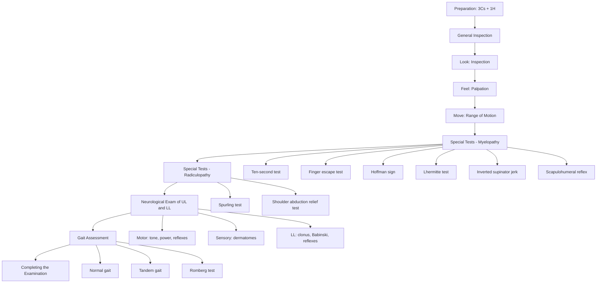

# Examination of the Cervical Spine

## Master Examination Framework

---

## General Approach: The 3Cs + 1H

Before you lay a finger on the patient, get the boring stuff right — it's the easiest marks you'll ever earn.

- **Consent**: "Hello, my name is Dr ___, I'm a medical student. May I check your name and date of birth? I'd like to examine your neck and spine today — would that be alright?" 「你好，我叫___醫生，我係醫科學生。我想幫你檢查頸椎，可以嗎？」
- **Comfort**: "Please let me know at any point if you feel any pain." 「如果你覺得痛，請即刻話俾我知。」
- **Chaperone**: "Would you like a chaperone present?" (offer, especially if the patient needs to undress)
- **Hand hygiene**: "Before I begin, I would like to wash my hands." State this explicitly — even if you've already done it.

**Positioning and Exposure**:
- The patient should be **sitting upright on a chair or the edge of the bed**, with the **neck, upper back, and upper limbs exposed** (shirt off, or gown open at the back) [1][2].
- For inspection from behind, you need to see the full posterior cervical spine down to the upper thoracic region.

---

## General Inspection

> *Running commentary*: "On general inspection, the patient appears comfortable at rest. There are no signs of acute distress. I note no cervical collar, no walking aids, and no obvious postural abnormality."

### Around the Bedside
- **Cervical collar** (hard/soft) — suggests acute injury or post-operative immobilization
- **Walking aids** (frame, wheelchair) — suggests myelopathic gait instability
- **IV lines, drains** — post-operative or acute trauma setting
- **Sputum jar, O2 tubing** — respiratory co-morbidity

### On First Glance (Head-to-Toe)
- **Body habitus**: age, build, nutritional state
- **Posture**: torticollis (wry neck), forward head posture, loss of normal cervical lordosis
- **Facial expression**: grimacing (pain), masked facies (Parkinsonism — differential for neck stiffness)
- **Upper limb posture**: asymmetry, arm held in protective posture (radiculopathy)
- **Scars**: posterior midline scar (laminectomy/laminoplasty), anterior transverse scar (anterior cervical discectomy and fusion — ACDF)
- **Skin lesions**: herpes zoster in cervical dermatome, neurofibromas, café au lait spots [3]
- **Muscle wasting**: visible trapezius, deltoid, or hand intrinsic wasting

---

## Systematic Examination: Look → Feel → Move → Special Tests → Neurology → Gait

### 1. LOOK (Inspection)

Inspect systematically from **anterior, lateral, and posterior** aspects.

#### Anterior Inspection
- **Scars**: Kocher-like incision (anterior cervical approach for ACDF), tracheostomy scar
- **Neck masses**: lymphadenopathy, thyroid swelling — may co-exist but are differential diagnoses
- **Tracheal position**: midline vs deviated
- **Muscle bulk symmetry**: sternocleidomastoid (SCM), trapezius

#### Lateral Inspection
- ***Normal cervical lordosis***: a gentle forward curve; assess whether this is preserved, flattened, or reversed [4]
- **Chin-brow vertical angle**: relevant if ankylosing spondylitis is suspected
- **Forward head posture**: suggestive of chronic degenerative change

#### Posterior Inspection
- **Midline alignment**: any lateral list or torticollis
- ***Scars***: posterior midline (laminectomy), paramedian (foraminotomy)
- **Muscle bulk**: trapezius symmetry, supraspinatus/infraspinatus wasting (rotator cuff co-pathology vs C5/6 root)
- **Skin changes**: erythema, sinuses (infection), hairy patches or dimples (spinal dysraphism — rare in cervical spine)
- ***Bruising, stepping***: key trauma signs — a "step" between spinous processes suggests ligamentous injury or facet dislocation [4]

> *Running commentary*: "On inspection from behind, the cervical spine appears aligned. I note a well-healed midline posterior scar, consistent with a previous laminectomy. There is mild flattening of the cervical lordosis. No bruising, stepping, or skin changes are seen."

**Why inspect?** Inspection establishes the baseline anatomy and identifies clues to the underlying pathology before you touch the patient. A visible step-off between spinous processes is a red flag for instability.

---

### 2. FEEL (Palpation)

Ask the patient: "I'm going to feel around your neck now. Please tell me if anything is tender." 「我而家會摸下你嘅頸，如果痛就話俾我知。」

#### Posterior Midline Structures
- **Spinous processes C2–C7**: palpate each one for ***tenderness*** and ***stepping*** [4]
  - C2 spinous process: large, bifid — the first palpable spinous process below the occiput
  - C7 spinous process (vertebra prominens): most prominent with neck flexion
  - *Normal*: non-tender, aligned
  - *Abnormal*: focal tenderness (fracture, infection, tumour), step deformity (subluxation/dislocation)
- **Interspinous ligaments**: tenderness suggests ligamentous injury
- **Supraspinous ligament**: palpate along the tips of spinous processes

#### Paraspinal Structures
- **Paraspinal muscles**: feel for ***spasm*** and ***tenderness*** [5]
  - Bilateral spasm → degenerative, diffuse pathology
  - Unilateral spasm → may lateralize to the side of a disc prolapse or facet pathology
- **Facet joints**: approximately 2 cm lateral to the midline — tenderness here suggests facet joint arthropathy

#### Lateral Structures
- **Transverse processes**: deep palpation — tenderness may suggest fracture
- **Sternocleidomastoid**: spasm in torticollis
- **Supraclavicular fossa**: lymphadenopathy, Pancoast tumour (associated with T1 root involvement / Horner syndrome)

#### Anterior Structures (with patient facing you)
- **Tracheal position**: palpate from cricoid to suprasternal notch — deviation suggests mass effect or post-surgical change [6]
- **Lymph node chains**: submental, submandibular, deep cervical, posterior triangle, supraclavicular

> *Running commentary*: "On palpation, there is midline tenderness at the C5 and C6 levels. No step deformity is felt. There is bilateral paraspinal muscle spasm. No lymphadenopathy and the trachea is central."

**Why palpate?** Focal spinous process tenderness localizes the level of pathology. A step deformity is a critical sign of vertebral subluxation. Paraspinal spasm is the body's protective response to underlying instability or inflammation.

---

### 3. MOVE (Range of Motion)

Assess **active** ROM first, then **passive** ROM only if active movements are full and pain-free. In trauma, **do not** perform ROM testing until the C-spine has been cleared.

Ask the patient to perform each movement while you observe:

| Movement | Normal ROM | Patient Instruction (English) | Patient Instruction (Cantonese) |
|---|---|---|---|
| **Flexion** | ~45° | "Try to touch your chest with your chin" | 「用你嘅下巴掂胸口」 |
| **Extension** | ~45° | "Look up towards the ceiling" | 「望上天花板」 |
| **Rotation (R and L)** | ~70° each side | "Look over your right/left shoulder" | 「望右/左邊膊頭」 |
| **Lateral flexion (R and L)** | ~45° each side | "Try to touch your right/left shoulder with your ear — don't lift your shoulder" | 「用耳仔掂你嘅右/左膊頭，唔好聳膊」 |

[1][2]

#### What to Look For
- **Range**: is it globally reduced (spondylosis, AS) or restricted in one direction (unilateral facet pathology, disc prolapse)?
- **Pain provocation**: which direction reproduces pain? Radiation into the arm during extension + rotation = suggestive of radiculopathy (foraminal narrowing)
- **Crepitus**: audible or palpable — degenerative disease
- **Smooth vs jerky movement**: guarding suggests pain or instability

**Pathophysiology**: Extension narrows the intervertebral foramina and spinal canal → exacerbates both radiculopathy and myelopathy. Flexion opens the canal. This is why patients with stenosis often prefer a flexed posture [7].

> *Running commentary*: "Active range of motion shows flexion to approximately 30 degrees with discomfort, extension to approximately 20 degrees with pain radiating into the right arm, and reduced right rotation. Left rotation and bilateral lateral flexion appear full."

<Callout title="OSCE Pitfall" type="error">
Do NOT test passive ROM in a trauma patient or if active ROM reproduces significant neurological symptoms. In the exam, state: "I would not proceed with passive movements given the reproduction of radicular pain."
</Callout>

---

## Special Tests

### A. Tests for Cervical Myelopathy

Cervical myelopathy = compression of the **spinal cord** → UMN signs below the level of the lesion. This is the **most important** pathology to identify because it is progressive and surgical intervention may be needed [4][7][8].

#### i. Ten-Second Test
- **Procedure**: Ask the patient to fully extend the elbows and wrists, then open and close the fists as quickly as possible for 10 seconds [1][2]
- 「盡量快咁開合雙手十秒鐘」
- **Normal**: > 20 times in 10 seconds, smooth and coordinated
- **Positive**: ***< 20 times, or dyssynergy*** (e.g. wrist flexing when fingers extend, slowness, clumsiness) [1]
- **Mechanism**: Corticospinal tract compression impairs fine motor coordination of intrinsic hand muscles. The dyssynergy between wrist and finger movements reflects loss of independent distal motor control.
- *Commentary*: "The patient manages 14 grip-release cycles in 10 seconds, with noticeable clumsiness and wrist flexion on finger extension. This is consistent with myelopathic hand signs."

#### ii. Finger Escape Test
- **Procedure**: Ask the patient to hold both hands out with fingers fully extended and adducted [1][2]
- 「伸直雙手，手指合埋唔好郁」
- **Normal**: All fingers remain adducted
- **Positive**: ***Little finger (and eventually other fingers) drift into abduction and flexion*** [1]
- **Grading**: Little finger only (Grade 1) → little finger from the start (Grade 2) → ring finger (Grade 3) → middle finger (Grade 4) [1]
- **Mechanism**: UMN dysfunction in the corticospinal tract leads to weakness of finger adductors and extensors (intrinsic hand muscles). The ulnar-innervated fingers escape first because they have the least cortical representation.
- *Commentary*: "On the finger escape test, the patient's left little finger drifts into abduction within 5 seconds — this is a Grade 2 positive finger escape sign."

#### iii. ***Hoffman Sign***
- **Procedure**: Stabilize the patient's middle finger at the PIPJ in extension. Flick the DIPJ into flexion (flick the fingernail downward) [1][2][4]
- **Normal**: No response
- **Positive**: ***Reflex flexion of the thumb and/or index finger*** [1]
- **Mechanism**: This is a stretch reflex of the finger flexors, analogous to the Babinski sign in the lower limb. It indicates hyperreflexia from corticospinal tract dysfunction (UMN lesion).
- **Sensitivity/Specificity**: Sensitivity ~58%, specificity ~78% for cervical myelopathy. A bilateral positive Hoffman is more specific than unilateral [8].
- *Commentary*: "On flicking the distal phalanx of the middle finger, there is brisk reflex flexion of the thumb bilaterally — a positive Hoffman sign."

#### iv. ***Lhermitte Test (Sign)***
- **Procedure**: Ask the patient to actively flex the neck (chin to chest) [1][2][4]
- 「請低頭將下巴掂胸口」
- **Normal**: No abnormal sensation
- **Positive**: ***Electric shock-like sensation radiating through the back and into the limbs*** [1]
- **Mechanism**: Neck flexion stretches the posterior columns of an already-compressed or demyelinated spinal cord, triggering abnormal sensory discharge. Also positive in MS and B12 deficiency.
- *Commentary*: "The patient reports an electric shock sensation down the back and into both arms on neck flexion — a positive Lhermitte sign, consistent with cervical cord compression."

<Callout title="Key Concept" type="idea">
Lhermitte sign is NOT pathognomonic for cervical myelopathy — it also occurs in MS, subacute combined degeneration (B12), and post-radiation myelopathy. Context matters.
</Callout>

#### v. ***Inverted Supinator Jerk*** (Indicates C5/6 Lesion)
- **Procedure**: Percuss directly on the distal radius (brachioradialis tendon) with a tendon hammer [1][2]
- **Normal**: Elbow flexion in midpronation (brachioradialis reflex)
- **Positive (Inverted)**: ***No elbow flexion + finger flexion*** [1]
  - No elbow flexion → **LMN lesion at C5/6** (brachioradialis reflex arc destroyed at that level)
  - Finger flexion → **UMN lesion affecting C8** (finger flexors become hyperreflexic because the cord is damaged above that level)
- **Mechanism**: This is a classic **combined LMN + UMN sign** at the level of the lesion, pathognomonic for cervical myelopathy at C5/6.
- *Commentary*: "On percussing the brachioradialis tendon, there is no elbow flexion but I observe finger flexion — this is an inverted supinator jerk, localizing the lesion to C5/6."

#### vi. Scapulohumeral Reflex (Indicates Lesion Above C3)
- **Procedure**: Tap the tip of the scapular spine and acromion with a tendon hammer [1][2]
- **Normal**: No response or minimal response
- **Positive**: ***Trapezius contraction with scapular elevation (C3/4)*** [1]
- **Mechanism**: A brisk scapulohumeral reflex indicates UMN disinhibition — the reflex arc (C3/4) is released from higher control, implying a lesion above C3.

---

### B. Tests for Cervical Radiculopathy

Cervical radiculopathy = compression of a **nerve root** → LMN signs at the affected level, with dermatomal sensory loss [7][8].

#### i. ***Spurling Test***
- **Procedure**: Ask the patient to extend the neck, then rotate and laterally flex to the **symptomatic side**. Apply gentle ***downward axial compression*** on the top of the head [1][2][4]
- **Normal**: No radicular symptoms
- **Positive**: ***Reproduction of radicular pain/paraesthesia radiating into the ipsilateral arm*** [4]
- **Sensitivity**: ~40–60% | **Specificity**: ~92–100% [8]
- **Mechanism**: Extension + ipsilateral rotation narrows the intervertebral foramen on that side. Axial loading further compresses the exiting nerve root, reproducing the patient's symptoms.
- *Commentary*: "On Spurling's manoeuvre with extension and right lateral flexion with axial compression, the patient reports shooting pain into the right arm in a C6 distribution — a positive Spurling test."

<Callout title="High Specificity Alert">
Spurling test has poor sensitivity but excellent specificity. A positive test virtually rules in radiculopathy. A negative test does not rule it out.
</Callout>

#### ii. ***Shoulder Abduction Relief Test***
- **Procedure**: Ask the patient to rest the symptomatic arm on top of the head (shoulder abduction + slight external rotation) [7]
- **Normal**: No change
- **Positive**: ***Reduction or relief of radicular symptoms*** [7]
- **Mechanism**: Shoulder abduction reduces tension on the nerve root by shortening the course of the brachial plexus, thereby decompressing the affected root.
- *Commentary*: "On placing the right arm on the head, the patient reports significant relief of arm pain — a positive shoulder abduction relief test."

---

## Neurological Examination of the Upper Limbs

This is a **critical** component. You must examine motor, sensory, and reflexes to localize the root level [1][3][7].

### Motor (Myotomes)

| Root | Muscle Group | Test | Commentary |
|---|---|---|---|
| **C5** | Deltoid, biceps | Shoulder abduction, elbow flexion | "Push your arm out against my hand" |
| **C6** | Wrist extensors, biceps | Wrist extension | "Cock your wrist back — don't let me push it down" |
| **C7** | Triceps, wrist flexors, finger extensors | Elbow extension, finger extension | "Push me away / straighten your fingers" |
| **C8** | Finger flexors, hand intrinsics | Finger flexion, grip strength | "Squeeze my fingers" |
| **T1** | Hand intrinsics (interossei) | Finger abduction/adduction | "Spread your fingers apart — don't let me close them" |

### Sensory (Dermatomes)

Test light touch and pinprick in key dermatomal areas:

| Root | Sensory Area |
|---|---|
| **C5** | Lateral arm (regimental badge area) |
| **C6** | Lateral forearm, thumb, index finger |
| **C7** | Middle finger |
| **C8** | Ring + little finger, medial forearm |
| **T1** | Medial arm |

### Reflexes

| Root | Reflex |
|---|---|
| **C5/6** | Biceps jerk |
| **C5/6** | Brachioradialis (supinator) jerk |
| **C7** | Triceps jerk |

- **Radiculopathy** → ***hyporeflexia*** at the affected level (LMN) [7][8]
- **Myelopathy** → ***hyperreflexia*** below the level of cord compression (UMN) [8]

> *Commentary*: "Power is reduced to MRC grade 4/5 in right wrist extension and biceps. The right biceps reflex is diminished. Sensation to pinprick is reduced over the right lateral forearm and thumb. This pattern is consistent with a C6 radiculopathy."

---

## Neurological Examination of the Lower Limbs

This is essential to assess for **myelopathy** (UMN signs in the legs indicate cord involvement) [1][4][8].

- **Tone**: check for spasticity (clasp-knife)
- **Power**: hip flexion (L1/2), knee extension (L3/4), ankle dorsiflexion (L4/5), ankle plantarflexion (S1/2)
- **Reflexes**: knee jerk (L3/4), ankle jerk (S1/2) — brisk in myelopathy
- ***Ankle clonus***: > 3 beats = sustained clonus → highly specific for UMN lesion [1][2]
- ***Babinski sign (plantar reflex)***: upgoing great toe = UMN lesion [1][2]
- **Sensory level**: check for a dermatomal sensory level on the trunk (T4 = nipple, T10 = umbilicus) [8]

> *Commentary*: "In the lower limbs, tone is increased bilaterally with clasp-knife spasticity. Reflexes are brisk. I elicit sustained clonus at both ankles and bilateral upgoing plantars. This is consistent with an upper motor neuron pattern from cervical cord compression."

---

## Gait Assessment

Always examine gait — it is often the most functionally significant finding [1][2][4].

- **Normal gait**: observe for steadiness, arm swing, stride length
- ***Tandem gait (heel-to-toe)***: ask patient to walk heel-to-toe in a straight line — very sensitive for myelopathy [4]
  - 「請你用腳跟對腳尖咁行一條直線」
- ***Romberg test***: stand with feet together, arms out, eyes closed → positive if unsteady with eyes closed (posterior column dysfunction) [4]
  - 「企直，合埋雙眼」— ensure you stand close to catch the patient

**Pathophysiology**: Myelopathy affects the corticospinal tracts (motor) and posterior columns (proprioception), producing a spastic, wide-based, unsteady gait that is exacerbated by removing visual input (Romberg) or narrowing the base of support (tandem gait).

---

## Completing the Examination

> "To complete my examination, I would like to:"

1. **Examine the upper limb neurologically in full** (if not already done) — including pronator drift, coordination
2. **Examine the lower limbs neurologically** — tone, power, reflexes, clonus, plantars, sensory level
3. **Assess gait** — normal, tandem, Romberg
4. ***Assess sphincter function***: ask about urinary/bowel symptoms (late feature of myelopathy, red flag for cauda equina) [8]
5. **Examine the shoulder** — to exclude shoulder pathology mimicking cervical radiculopathy
6. **Examine the peripheral nerves of the upper limb** — to exclude ulnar/median nerve entrapment (differential for hand weakness/numbness) [7]
7. **Investigations**: request cervical spine X-ray (AP, lateral, open mouth for odontoid), MRI cervical spine (gold standard for cord/root compression)

---

## Expected Positive Findings vs Important Negatives

### Expected Positive Findings (Cervical Myelopathy)
- Reduced cervical ROM, especially extension
- Positive myelopathic hand signs (ten-second test, finger escape, Hoffman)
- Positive Lhermitte sign
- UMN signs in lower limbs: hyperreflexia, clonus, upgoing plantars
- Spastic, unsteady gait; failed tandem walk
- Inverted supinator jerk (if C5/6 lesion)

### Expected Positive Findings (Cervical Radiculopathy)
- Positive Spurling test
- Positive shoulder abduction relief test
- Dermatomal sensory loss + myotomal weakness + hyporeflexia at affected level
- Reduced cervical ROM in the direction that narrows the foramen

### Important Negatives to Document
- No sphincter disturbance (rules out cauda equina / severe myelopathy)
- No saddle anaesthesia
- No fever (rules out infection: epidural abscess, discitis)
- No progressive bilateral leg weakness (if present → urgent MRI)
- No Horner syndrome (rules out Pancoast, high cord lesion)
- Peripheral pulses intact, no vascular compromise

---

## Red-Flag Examination Findings and Escalation Triggers

| Red Flag | Implication | Action |
|---|---|---|
| ***Bilateral UMN signs in legs + sphincter disturbance*** | Severe cervical myelopathy / cord compression | Urgent MRI, surgical referral |
| ***Progressive motor weakness*** | Progressive cord / root compression | Urgent imaging |
| ***Fever + spinal tenderness*** | Epidural abscess, discitis | Urgent MRI, blood cultures |
| ***Saddle anaesthesia + urinary retention*** | Cauda equina syndrome (if conus involvement) | Emergency MRI |
| ***Trauma + step deformity*** | Unstable cervical fracture/dislocation | Immobilize, urgent CT |
| ***Rapid neurological deterioration*** | Expanding epidural haematoma or central cord syndrome | Emergency escalation |

---

## Common OSCE Pitfalls

<Callout title="Common OSCE Mistakes" type="error">

1. **Forgetting to assess gait** — this is the most functionally relevant test for myelopathy and is often the first abnormality. Never skip it.
2. **Not testing lower limbs** — a cervical spine exam is incomplete without assessing for UMN signs below the level of the lesion.
3. **Performing Spurling test roughly** — use gentle axial compression. Excessive force is dangerous and loses marks.
4. **Confusing myelopathy and radiculopathy** — myelopathy = cord = UMN signs below; radiculopathy = root = LMN signs at level. These can coexist.
5. **Not asking about bladder/bowel function** — this is a red flag and must be asked even if not tested in a PE station.
6. **Forgetting the inverted supinator jerk** — this is a favourite OSCE finding. Practice it.
7. **Testing passive ROM in a trauma patient** — explicitly state you would NOT do this if instability is suspected.
</Callout>

---

## High-Yield Exam Interpretation Tips

- **Hoffman sign positive bilaterally** is much more significant than a unilateral positive (which can be a normal variant in up to 3% of the population) [8].
- **The inverted supinator jerk** is the single most localizing sign in cervical myelopathy — it tells you the lesion is at **C5/6** specifically because it demonstrates combined LMN loss at C5/6 and UMN signs at C8 [1][2].
- **Spurling test**: High specificity means if it's positive, the diagnosis is likely. But don't be fooled by a negative test — it misses up to 50% of cases [8].
- **Ten-second test**: This is a quick screening tool. If the patient can do > 20 grip-releases smoothly, significant myelopathy is unlikely.
- ***The nerve root numbering rule***: Above C8, roots exit **above** their numbered vertebra (C6 root exits at C5/6). Below C8, roots exit **below** their numbered vertebra. Therefore, a C5/6 disc herniation compresses the **C6** root [8].

---

## Model Reporting Script

> "On examination, Mr Chan is a 62-year-old gentleman seated comfortably in a chair. He has no cervical collar or walking aids. Vital signs are stable.
>
> **Inspection**: There is a well-healed posterior midline cervical scar consistent with previous surgery. The cervical lordosis is flattened. There is no torticollis, no bruising, and no skin changes.
>
> **Palpation**: There is midline tenderness over C5 and C6 spinous processes. No step deformity. Bilateral paraspinal muscle spasm is present. The trachea is central and there is no cervical lymphadenopathy.
>
> **Range of motion**: Active flexion is limited to approximately 30 degrees. Extension is limited to 20 degrees and reproduces pain radiating into the right arm. Rotation is reduced bilaterally, worse on the right. Lateral flexion is mildly limited.
>
> **Special tests**: The Spurling test is positive on the right, reproducing C6-distribution radicular pain. The ten-second test reveals 14 cycles with dyssynergy between wrist and finger movements. The finger escape test is Grade 2 positive on the left. Hoffman sign is positive bilaterally. Lhermitte sign is positive. The inverted supinator jerk is present bilaterally.
>
> **Upper limb neurology**: Power is reduced to 4/5 in right wrist extension and right biceps. The right biceps reflex is diminished. Pinprick sensation is reduced over the right lateral forearm and thumb, consistent with a C6 distribution.
>
> **Lower limb neurology**: Tone is increased bilaterally with clasp-knife spasticity. Reflexes are brisk. Sustained ankle clonus is present bilaterally. Plantar responses are extensor bilaterally.
>
> **Gait**: Broad-based and unsteady. Unable to perform tandem gait. Romberg test is positive.
>
> **Summary**: The findings are consistent with **cervical myelopathy with superimposed right C6 radiculopathy**, likely secondary to cervical spondylosis. I would recommend an urgent MRI cervical spine and referral to the neurosurgical or orthopaedic spine team."

---

<Callout title="High Yield Summary">

**Cervical spine examination** follows **Look → Feel → Move → Special Tests → Neurology → Gait**.

The two key pathologies to differentiate are:
- **Myelopathy** (cord compression): UMN signs below the lesion — Hoffman, finger escape, ten-second test, inverted supinator jerk, Lhermitte, LL hyperreflexia/clonus/upgoing plantars, gait instability
- **Radiculopathy** (root compression): LMN signs at the level — Spurling test, dermatomal sensory loss, myotomal weakness, hyporeflexia

The **inverted supinator jerk** is the most localizing single sign (C5/6). **Spurling test** has excellent specificity for radiculopathy. Always examine the **lower limbs and gait** — they are the most commonly missed components in OSCEs and the most functionally important findings for surgical decision-making.

Red flags: bilateral UMN signs + sphincter disturbance = urgent MRI. Fever + tenderness = infection until proven otherwise.
</Callout>

---

<ActiveRecallQuiz
  title="Active Recall - Physical Exam"
  items={[
    {
      question: "What is the inverted supinator jerk and what level does it localize to?",
      markscheme: "Percuss brachioradialis tendon: absent elbow flexion (LMN at C5/6) plus finger flexion (UMN at C8). Localizes to C5/6 myelopathy with combined LMN and UMN signs at a single level.",
    },
    {
      question: "Name three myelopathic hand signs and describe how to perform each.",
      markscheme: "1) Ten-second test: grip-release less than 20 times in 10 seconds with dyssynergy. 2) Finger escape test: fingers drift into abduction when held extended and adducted. 3) Hoffman sign: flick DIPJ of middle finger - positive if thumb/index flexes reflexively.",
    },
    {
      question: "What is the sensitivity and specificity of Spurling test, and what is its clinical significance?",
      markscheme: "Sensitivity approximately 40-60 percent, specificity approximately 92-100 percent. High specificity means a positive test strongly suggests radiculopathy, but a negative test does not rule it out.",
    },
    {
      question: "A C5/6 disc herniation compresses which nerve root, and why?",
      markscheme: "The C6 nerve root. Above C8, nerve roots exit above their corresponding vertebra. C6 root exits between C5 and C6, so a posterolateral C5/6 disc herniation compresses C6.",
    },
    {
      question: "What lower limb signs would you expect in cervical myelopathy, and why do they occur?",
      markscheme: "Hyperreflexia, clonus (more than 3 beats), upgoing plantars (Babinski positive), spasticity, and broad-based unsteady gait. These are UMN signs caused by compression of the corticospinal tracts in the cervical cord, which carry motor fibres destined for the lower limbs.",
    },
    {
      question: "What red flag findings on cervical spine examination require emergency escalation?",
      markscheme: "Bilateral progressive UMN signs with sphincter disturbance (severe myelopathy), fever with spinal tenderness (epidural abscess/discitis), saddle anaesthesia with urinary retention (cauda equina), and rapid neurological deterioration. All require urgent MRI and appropriate referral.",
    },
  ]}
/>

---

## References

[1] Senior notes: Ryan Ho Fundamentals.pdf (pp. 146–147)
[2] Senior notes: Ryan Ho Rheumatology.pdf (pp. 25–26)
[3] Senior notes: Ryan Ho Neurology.pdf (pp. 5–6)
[4] Lecture slides: GC 227. Cervical Spine Pathology.pdf (pp. 18, 42, 66)
[5] Lecture slides: GC 226. Lumbar Spine Pathology_Part B (2).pdf (p. 2)
[6] Senior notes: Ryan Ho Endocrine.pdf (pp. 7–8)
[7] Senior notes: Ryan Ho Neurology.pdf (pp. 172–173)
[8] Senior notes: maxim.md (pp. 460, 464, 466, 774)
