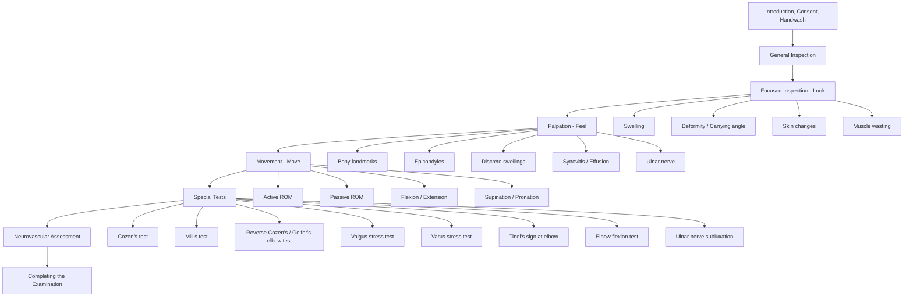

# Examination of the Elbow

## Master Examination Framework

---

## General Approach (3Cs + 1H)

Before touching the patient, you must set the stage properly. This is worth easy marks and sets a professional tone.

1. **Introduce yourself**: "Good morning, my name is Dr. ___, I am a medical student/doctor."
2. **Confirm identity**: Check the patient's name and date of birth (wristband if available).
3. **Consent**: "I would like to examine your elbow(s) today. This will involve me looking at, touching, and moving your arm. Please let me know if anything is painful at any point. Is that alright?" 「我想檢查你嘅手肘，會望吓、掂吓同埋郁動吓你隻手臂。如果有任何唔舒服，請即刻話畀我知。可以嗎？」
4. **Hand hygiene**: "Before I begin, I would wash my hands." State this explicitly — the examiner is listening for it.
5. **Positioning**: Patient should be sitting on a chair or the edge of the bed, arms exposed from shoulder to fingertips. Both arms should be visible for comparison.
6. **Exposure**: "Could you please remove your top (or roll your sleeves up) so that both arms are fully exposed?" 「可唔可以除咗上衫，或者將衫袖捲上去，等我可以睇到兩邊手臂？」
7. **Adequate lighting** and a **pillow on the patient's lap** can be helpful for resting the arms during palpation.

<Callout title="Don't Forget Exposure" type="error">
A very common OSCE pitfall is examining through clothing. You MUST expose both arms from shoulder to fingertips. Note any difficulty the patient has in removing clothing — this itself is a functional observation [1].
</Callout>

---

## General Inspection

Before zooming in on the elbow, take a step back and survey the whole picture. This is your "end of the bed" assessment.

### What to look for around the bedside:
- **Mobility aids**: sling, splint, brace (e.g., **soft elbow extension splint** used in cubital tunnel syndrome [2])
- **IV lines, drains**: may indicate recent surgery or septic arthritis management
- **Medications at bedside**: NSAIDs, allopurinol (gout), methotrexate (RA)

### On first glance at the patient:
- **Body habitus**: obesity (risk factor for OA), cachexia (malignancy, chronic disease)
- **Distress level**: Is the patient holding the arm protectively? Guarding suggests acute pathology (fracture, septic arthritis, acute gout)
- **Skin**: generalised rashes (psoriasis → psoriatic arthritis), bruising
- **Hands**: quickly glance at the hands for rheumatoid changes (ulnar deviation, swan-neck, boutonnière), gouty tophi, or nail pitting — these provide clues to the underlying aetiology before you even touch the elbow

**Running commentary:**
> *"On general inspection, the patient appears comfortable at rest, sitting upright. I can see no slings, splints, or walking aids at the bedside. There are no obvious rashes or skin changes visible at a distance. I will now proceed to focused inspection of the elbows."*

---

## Systematic Examination

### 1. Inspection (Look)

**Why we look first:** Visual inspection identifies pathology non-invasively and guides the rest of the exam — you don't want to press on an obvious abscess.

**How to perform:** Inspect both elbows anteriorly, posteriorly, and laterally with the arms by the side, then with the arms in full extension with palms facing forward (anatomical position).

#### What to look for:

| Feature | Normal | Abnormal | Pathophysiology |
|---|---|---|---|
| ***Swelling*** | No visible swelling | Joint effusion: swelling on either side of olecranon [1]. Discrete swellings over olecranon or proximal subcutaneous border of ulna → ***rheumatoid nodules, gouty tophi, enlarged olecranon bursa*** [1] | Effusion = synovial inflammation or blood. Olecranon bursitis = repetitive pressure ("student's elbow") or crystal/septic inflammation |
| ***Deformity / Carrying angle*** | 5–10° valgus (larger in women) [1] | ***Cubitus valgus*** (increased angle): may follow lateral condyle malunion → tardy ulnar nerve palsy. ***Cubitus varus*** (gun-stock deformity): follows supracondylar fracture malunion | Malunion changes the mechanical axis; cubitus valgus stretches the ulnar nerve over time [2] |
| ***Skin changes*** | Normal skin | Psoriatic plaques, erythema, scars (previous surgery), sinuses (chronic infection), bruising | Psoriasis at extensor surfaces is classic; scars suggest previous trauma/surgery |
| ***Muscle wasting*** | Symmetrical muscle bulk | Wasting of forearm flexors/extensors; thenar/hypothenar wasting (ulnar nerve involvement) | Denervation atrophy from nerve entrapment, or disuse atrophy from chronic pain/immobilisation |

**Running commentary:**
> *"On inspection, with the patient's arms extended and palms facing forward, I note a normal carrying angle bilaterally of approximately 10 degrees of valgus. There is no visible swelling, deformity, skin changes, psoriatic plaques, or scars. There is no evidence of muscle wasting in the forearms. I can see no discrete swellings over the olecranon or the proximal ulnar border."*

---

### 2. Palpation (Feel)

**Why we palpate:** To localise the pathology. The elbow has easily accessible bony landmarks, and tenderness at specific points has high diagnostic specificity.

**General principles:**
- Always ask about pain first: "Please tell me if I cause you any discomfort." 「如果我掂到邊度痛，請即刻話我知。」
- Palpate the non-painful side first.
- Use the **back of your hand** to assess temperature over the joint before deep palpation.

#### Systematic palpation sequence:

**a. Temperature**
- Compare both elbows with the dorsum of your hand
- **Warmth** → inflammation (septic arthritis, gout, RA flare)

**b. Bony landmarks (the "triangle" of the elbow)**
- With the elbow flexed at 90°, palpate:
  - **Olecranon** (tip of the elbow posteriorly)
  - **Medial epicondyle** (prominent bony point medially)
  - **Lateral epicondyle** (less prominent, laterally)
- These three points form an **isosceles triangle** when the elbow is flexed and a **straight line** when the elbow is fully extended
- **Disruption of this relationship** → suggests fracture or dislocation (e.g., supracondylar fracture, olecranon fracture)

**c. Epicondyle tenderness**
- ***Lateral epicondyle tenderness*** → **lateral epicondylitis ("tennis elbow")** [1]: due to microtearing and tendinopathy of the common extensor origin (especially extensor carpi radialis brevis)
- ***Medial epicondyle tenderness*** → **medial epicondylitis ("golfer's elbow")** [1]: due to tendinopathy of the common flexor origin

**d. Olecranon and proximal ulnar border — discrete swellings**
- ***Rheumatoid nodules***: quite hard, may be tender, **attached to underlying structures** [1]
- ***Gouty tophi***: firm, often appear **yellow under skin** [1]
- ***Olecranon bursa***: fluctuant, well-demarcated over olecranon — may be inflamed (warm, tender) in bursitis

**e. Joint effusion / Synovitis**
- **Small amounts of fluid** are palpable by the thumb of the opposite hand along the **edge of the ulnar shaft just distal to the olecranon** (where the synovium is closest to the surface) [1]
- With the elbow in **full extension**, a palpable bulge in this area indicates effusion [1]
- **Why here?** The synovial membrane is most superficial in the groove between the olecranon and the lateral epicondyle; fluid collects here first.

**f. Ulnar nerve**
- Palpate the ulnar nerve in the **cubital tunnel** (the groove between the medial epicondyle and the olecranon)
- Feel for **thickening** of the nerve
- Check for **Tinel's sign** (see Special Tests below)
- Check for **ulnar nerve subluxation**: flex and extend the elbow while palpating the nerve — a subluxing nerve will "pop" out of the groove [2][3]

**g. Radial head**
- Palpated in the "soft spot" — the centre of the triangle formed by the lateral epicondyle, the tip of the olecranon, and the radial head
- Ask the patient to pronate and supinate the forearm while you palpate — the radial head will rotate under your thumb
- Tenderness here → radial head fracture (commonly after fall on outstretched hand)

**Running commentary:**
> *"I am now going to feel both elbows, starting with the unaffected side. The temperature is equal bilaterally. I am palpating the bony landmarks — olecranon, medial and lateral epicondyles — the triangle relationship is preserved. There is no tenderness over the lateral or medial epicondyle. I am now palpating the olecranon and the proximal subcutaneous border of the ulna for any discrete swellings — I can feel no rheumatoid nodules, tophi, or bursal enlargement. With the elbow in full extension, I am palpating for effusion just distal to the olecranon — there is no palpable fluid. I am now palpating the ulnar nerve in the cubital tunnel — the nerve is not thickened and does not sublux on elbow flexion."*

---

### 3. Movement (Move)

**Why we test movement:** Restricted range of motion (ROM) tells you about the severity and nature of pathology. The pattern of restriction helps differentiate:
- **↓ active ROM with preserved passive ROM** → soft tissue problem (e.g., tendinopathy, muscle weakness) [4]
- **↓ active + passive ROM** → intra-articular pathology (e.g., OA, synovitis, mechanical block) or soft tissue contracture [4]

#### Normal ranges [1]:
| Movement | Normal Range |
|---|---|
| Flexion | 0° → 150° |
| Extension | 150° → 0° (full extension) |
| Supination | 0° → 80–90° |
| Pronation | 0° → 80–90° |

**Functional arc:** Most activities of daily living require 30–130° of flexion and 50° pronation to 50° supination.

#### How to test:

**a. Active ROM (test first)**
- "Can you please bend your elbow as far as it will go?" 「請你將手肘屈到盡。」
- "Now straighten it all the way." 「而家伸直佢。」
- "Turn your palm face up." 「掌心向上。」(supination)
- "Now turn your palm face down." 「掌心向下。」(pronation)
- Stabilise the patient's upper arm with one hand to isolate elbow movement (particularly important for pronation/supination — you want to prevent shoulder rotation compensating)

**b. Passive ROM (test after active)**
- Support the patient's forearm and gently move through flexion, extension, supination, and pronation
- Note: **end-feel** — bony block (hard end-feel in extension is normal; hard end-feel in flexion is abnormal and suggests loose body or osteophyte)
- Note: **pain at end-range** vs throughout range
- Note: **crepitus** — coarse crepitus suggests OA or loose bodies

**c. Document any fixed flexion deformity**
- If the patient cannot fully extend, measure the fixed flexion angle (e.g., "20° fixed flexion deformity")

**Running commentary:**
> *"I am now going to test the range of movement. Starting with active range of movement — please bend your elbow as far as you can... and now straighten it out... now turn your palm up... and down. Active flexion is to approximately 140 degrees, extension is full, supination and pronation are both approximately 80 degrees. I am now testing passive range of movement — the passive range mirrors the active range, there is no crepitus, and the end-feel is normal. There is no fixed flexion deformity."*

---

### 4. Special Tests

These are the high-yield tests that examiners love. Each test has a specific clinical context.

---

#### a. Lateral Epicondylitis (Tennis Elbow) Tests

**i. Cozen's Test (Resisted Wrist Extension Test)** [3]

- **Why:** Reproduces the exact loading pattern that stresses the common extensor origin (CEO), specifically extensor carpi radialis brevis (ECRB).
- **How to perform:**
  - Patient's elbow at 90° flexion, forearm pronated, fist clenched
  - Stabilise the patient's elbow with one hand
  - Ask the patient to extend the wrist against your resistance (you push down on the dorsum of the fist)
  - "Make a fist and try to cock your wrist up against my hand." 「握實拳頭，然後向上擘手腕，我會向下壓住。」
- **Positive:** Pain at the **lateral epicondyle**
- **Normal:** No pain
- **Pathophysiology:** Resisted wrist extension loads the CEO at its origin on the lateral epicondyle. In tendinopathy, this reproduces microtear-related pain at the origin.

**ii. Mill's Test** [3]

- **Why:** A passive stretch test that stresses the CEO from the opposite direction.
- **How to perform:**
  - Examiner palpates the lateral epicondyle with one hand
  - With the other hand, fully pronate the forearm, flex the wrist, and extend the elbow simultaneously
- **Positive:** Pain at the lateral epicondyle on passive stretch
- **Normal:** No pain
- **Pathophysiology:** Passive wrist flexion + pronation + elbow extension maximally stretches the extensor origin; damaged tendon is pain-sensitive to stretch.

**Running commentary:**
> *"I am now performing Cozen's test for lateral epicondylitis. With the elbow flexed at 90 degrees and the forearm pronated, I am asking the patient to extend the wrist against resistance... this reproduces pain at the lateral epicondyle, which is a positive Cozen's test. I will now perform Mill's test — passively pronating, flexing the wrist, and extending the elbow... this also reproduces lateral epicondyle pain, consistent with lateral epicondylitis."*

---

#### b. Medial Epicondylitis (Golfer's Elbow) Test

**Reverse Cozen's Test (Resisted Wrist Flexion Test)**

- **Why:** Stresses the common flexor origin (CFO) at the medial epicondyle.
- **How to perform:**
  - Patient's elbow at 90° flexion, forearm supinated
  - Stabilise the elbow
  - Ask the patient to flex the wrist against resistance (you resist wrist flexion)
  - "Try to bend your wrist towards you against my hand." 「試吓向自己方向屈手腕，我會頂住。」
- **Positive:** Pain at the **medial epicondyle**
- **Pathophysiology:** Resisted wrist flexion loads the CFO; in tendinopathy, this reproduces the pain.

---

#### c. Collateral Ligament Stress Tests

These assess the integrity of the medial (ulnar) and lateral (radial) collateral ligaments — essential in trauma or instability presentations.

**i. Valgus Stress Test (Medial/Ulnar Collateral Ligament)** [3]

- **Why:** The UCL (especially the anterior bundle) is the primary restraint to valgus stress. Injury is common in throwing athletes.
- **How to perform:**
  - Elbow flexed to 20–30° (to unlock the olecranon from its fossa and isolate the ligament)
  - One hand stabilises the upper arm, the other holds the wrist
  - Apply a valgus force (push the forearm laterally / "open up" the medial side)
- **Positive:** Pain and/or increased laxity (gapping) at the medial joint line compared to the contralateral side
- **Normal:** Firm end-point, no pain
- **Pathophysiology:** Valgus force stretches the UCL. If torn or attenuated, the medial joint line "opens up."

**ii. Varus Stress Test (Lateral/Radial Collateral Ligament)** [3]

- **How to perform:**
  - Same position as valgus stress test
  - Apply a varus force (push the forearm medially / "open up" the lateral side)
- **Positive:** Pain and/or increased laxity at the lateral joint line
- **Pathophysiology:** Varus force stretches the lateral collateral ligament complex (LUCL). Injury is less common but can follow elbow dislocations.

**Running commentary:**
> *"I am now testing the collateral ligaments. With the elbow flexed to about 20 degrees, I am applying a valgus stress to test the ulnar collateral ligament — there is a firm end-point and no pain. Now applying a varus stress to test the lateral collateral ligament — again, firm end-point and no pain. The collateral ligaments are intact."*

---

#### d. Ulnar Nerve Assessment at the Elbow

The ulnar nerve is extremely vulnerable at the cubital tunnel. Three key manoeuvres [2][3]:

**i. Tinel's Sign at the Cubital Tunnel**

- **How:** Tap gently over the ulnar nerve in the groove between the medial epicondyle and the olecranon.
- **Positive:** Tingling/electric shock sensation radiating into the ring and little finger (ulnar nerve distribution).
- **Normal:** No radiating paraesthesia (mild local discomfort is acceptable).
- **Pathophysiology:** Tapping a demyelinated or irritated nerve triggers ectopic action potentials along the affected axons, producing paraesthesia in the sensory distribution.

**ii. Elbow Flexion Test**

- **How:** Ask the patient to fully flex the elbow and hold this position for 60 seconds with the wrist in neutral. 「請你將手肘屈到盡，保持呢個姿勢一分鐘。」
- **Positive:** Reproduction of ulnar nerve symptoms (numbness/tingling in ring and little fingers) within 60 seconds.
- **Pathophysiology:** Full elbow flexion increases intraneural pressure within the cubital tunnel by up to 20× by tightening the arcuate ligament (Osborne's ligament) and narrowing the tunnel.

**iii. Ulnar Nerve Subluxation**

- **How:** Palpate the ulnar nerve in the cubital tunnel while passively flexing and extending the elbow.
- **Positive:** The nerve "pops" or subluxes out of the groove, sometimes visible.
- **Pathophysiology:** Congenital or acquired laxity of the soft tissue restraints allows the nerve to dislocate anteriorly over the medial epicondyle during flexion, causing repetitive microtrauma and neuropathy.

<Callout title="Cubital Tunnel Syndrome — Exam Tip" type="idea">
When examining the elbow, **always** palpate the ulnar nerve and test for Tinel's sign, subluxation, and the elbow flexion test. Cubital tunnel syndrome is the second most common upper limb nerve entrapment after carpal tunnel, and examiners love it. Remember: ***cubital valgus*** deformity is a risk factor for tardy ulnar nerve palsy [2].
</Callout>

---

#### e. Posterolateral Rotatory Instability (PLRI) — Lateral Pivot Shift Test

- **Why:** Tests for insufficiency of the lateral ulnar collateral ligament (LUCL), typically after elbow dislocation.
- **How:** Patient supine, arm overhead. Supinate the forearm, apply valgus and axial compression while flexing the elbow from full extension.
- **Positive:** Apprehension, a palpable clunk, or subluxation of the radial head as the elbow flexes past ~40° — followed by reduction as flexion continues.
- **Note:** This is difficult to elicit in an awake patient due to guarding; often tested under anaesthesia. In OSCEs, the ability to **describe** it is usually sufficient.

---

### 5. Neurovascular Assessment

**Why:** The elbow is an anatomical crossroads for the median, ulnar, and radial nerves, and the brachial artery. Any elbow pathology (especially trauma) can compromise these structures.

#### Quick neurological screen [3]:
| Nerve | Motor Test | Sensory Test |
|---|---|---|
| **Radial nerve (C7)** | Wrist extension ("cock your wrist up") 「手腕向上郁」; thumb extension ("thumbs up") | Dorsal first web space |
| **Median nerve (C6-T1)** | Thumb opposition ("touch your thumb to your little finger") 「拇指掂尾指」; OK sign (AIN) | Palmar aspect of index finger tip |
| **Ulnar nerve (C8-T1)** | Finger abduction ("spread your fingers apart") 「將手指張開」; finger adduction ("squeeze this paper between your fingers") | Palmar aspect of little finger |

#### Vascular:
- Palpate **brachial pulse** (medial to biceps tendon in the antecubital fossa)
- Palpate **radial pulse** at the wrist
- Assess **capillary refill** in the fingertips ( < 2 seconds is normal)
- **Why:** Supracondylar fractures in particular can injure the brachial artery → **Volkmann's ischaemic contracture** (compartment syndrome of the forearm). The **5 Ps** (pain on passive extension of fingers, pallor, pulselessness, paraesthesia, paralysis) must be assessed in any acute elbow injury.

**Running commentary:**
> *"To complete the neurovascular assessment: radial nerve — wrist extension is strong and sensation in the first dorsal web space is intact. Median nerve — thumb opposition is strong, sensation in the index fingertip is intact. Ulnar nerve — finger abduction and adduction are strong, sensation in the little finger is intact. The brachial and radial pulses are palpable and equal bilaterally. Capillary refill is less than 2 seconds."*

---

### 6. Completing the Examination

**To complete the examination, I would:**

- **Examine the joints above and below**: shoulder and wrist/hand [1]
  - This is mandatory for any joint examination — pain can be referred
  - "The elbow is sandwiched between the shoulder and the wrist — always examine neighbours"
- **Examine the contralateral elbow** for comparison
- **Examine the cervical spine**: C5-T1 radiculopathy can mimic elbow pathology (particularly cubital tunnel syndrome vs C8/T1 radiculopathy) [2]
- **Look for extra-articular features** if rheumatological disease is suspected:
  - ***Rheumatoid nodules*** at olecranon, ulnar border [1]
  - Rheumatoid hands (MCPJ swelling, ulnar deviation, swan-neck, boutonnière)
  - ***Gouty tophi*** (ears, hands, feet)
  - Psoriatic plaques (extensor surfaces, scalp, behind ears, nails)
- **Functional assessment**: Ask the patient to perform tasks — e.g., grip strength, lifting a cup, reaching behind the head (assesses combined shoulder + elbow function)
- **Imaging**: I would request **plain X-rays** (AP and lateral) of the elbow. On X-ray, look for:
  - **Fat pad sign** (anterior "sail sign" and/or posterior fat pad) → indicates occult fracture with haemarthrosis [4]
  - Joint space narrowing, osteophytes (OA)
  - Periarticular erosions (RA)
  - Chondrocalcinosis (pseudogout)
  - Loose bodies

---

## Expected Positive and Negative Findings by Condition

| Condition | Expected Positive Findings | Important Negatives to Document |
|---|---|---|
| **Lateral epicondylitis** | Lateral epicondyle tenderness, positive Cozen's, positive Mill's | No medial tenderness, no effusion, no instability, full ROM, no neurological deficit |
| **Medial epicondylitis** | Medial epicondyle tenderness, positive reverse Cozen's | No lateral tenderness, no UCL laxity, Tinel's negative |
| **Cubital tunnel syndrome** | Positive Tinel's at cubital tunnel, positive elbow flexion test, ± ulnar nerve subluxation, ± cubitus valgus, ± intrinsic muscle wasting (hypothenar, interossei), ± claw hand | No cervical myelopathy signs, no Tinel's at Guyon's canal |
| **Olecranon bursitis** | Fluctuant swelling over olecranon ± warmth, tenderness | ROM typically preserved (bursitis is extra-articular), no joint-line tenderness |
| **Rheumatoid arthritis** | Bilateral synovitis, effusion on either side of olecranon, rheumatoid nodules, limited ROM, associated hand changes | No crystal deposits, no septic features |
| **Elbow OA** | Crepitus, reduced ROM (especially extension), osteophytes palpable, bony enlargement | No synovitis warmth, no systemic features |
| **Elbow dislocation/fracture** | Deformity, gross swelling, loss of triangle relationship, reduced ROM, ± neurovascular deficit | Must document intact neurovascular status distally |

---

## Red-Flag Examination Findings and Escalation Triggers

| Red Flag | Concern | Action |
|---|---|---|
| **Hot, red, swollen joint with fever** | Septic arthritis | Urgent joint aspiration, IV antibiotics — do NOT delay |
| **Loss of distal pulses after trauma** | Vascular injury (brachial artery) | Emergency orthopaedic/vascular referral |
| **Rapidly progressive weakness/wasting** | Acute nerve injury or compartment syndrome | Urgent surgical review |
| **5 Ps (pain on passive finger extension, pallor, pulselessness, paraesthesia, paralysis)** | Compartment syndrome (Volkmann's ischaemic contracture) | Emergency fasciotomy |
| **Disrupted bony triangle relationship** | Fracture or dislocation | Urgent X-ray, orthopaedic referral |
| **Inability to extend the elbow with a "mechanical block"** | Loose body, displaced fracture fragment | Imaging and orthopaedic review |

---

## Common OSCE Pitfalls

<Callout title="Common OSCE Pitfalls" type="error">

1. **Forgetting to compare with the contralateral side** — always examine both elbows.
2. **Not adequately exposing the arm** — you must see from shoulder to fingertips.
3. **Skipping the ulnar nerve** — cubital tunnel assessment is expected in every elbow exam.
4. **Not testing passive ROM after active ROM** — the difference between active and passive deficits is diagnostically critical [4].
5. **Forgetting neurovascular assessment distally** — especially important post-trauma.
6. **Not offering to examine joints above and below** — the examiner is waiting for you to say "shoulder and wrist."
7. **Performing special tests without clinical context** — don't just run through every test robotically. State why you are performing each one ("Given the lateral epicondyle tenderness, I would like to perform Cozen's test to confirm lateral epicondylitis").
8. **Failing to check the carrying angle** — inspect in the anatomical position with palms forward.
9. **Not mentioning the fat pad sign on X-ray** — a high-yield radiology finding for occult elbow fractures.
</Callout>

---

## High-Yield Exam-Focused Interpretation Tips

- ***The elbow triangle*** (olecranon + medial epicondyle + lateral epicondyle): preserved triangle = no bony disruption; disrupted = fracture/dislocation. Test this with elbow flexed at 90°.
- **Tennis elbow is 5–10× more common than golfer's elbow** — but know both. The ECRB is the most commonly affected tendon in lateral epicondylitis.
- ***Cubitus valgus*** is a risk factor for **tardy ulnar nerve palsy** — this is a classic OSCE viva question [2].
- **Posterior fat pad on lateral X-ray** is ALWAYS pathological — it indicates intra-articular fluid (haemarthrosis from occult fracture until proven otherwise) [4].
- **Anterior fat pad** can be normal (small "sail sign"), but an **elevated anterior fat pad** is abnormal.
- In RA, **synovitis** indicates inflammatory arthritis — manifested by soft tissue swelling, warmth, and joint effusion [4].
- **Differentiate cubital tunnel syndrome from Guyon's canal compression**: in cubital tunnel, the **dorsal sensory branch is affected** (numbness on dorsal hand) and the FDP to ring/little fingers is weak (Pollock's sign). In Guyon's canal, dorsal sensation is spared [2].
- The **elbow flexion test** is considered more sensitive than Tinel's sign for cubital tunnel syndrome.

---

## Model Reporting Script

> *"On examination, Mr. Chan is a 45-year-old gentleman who appears comfortable at rest. There are no splints, slings, or aids at the bedside. Vital signs are stable.*
>
> *On inspection of both upper limbs, there is no visible swelling, deformity, or skin changes. The carrying angle is approximately 10 degrees of valgus bilaterally and symmetric. There is no muscle wasting.*
>
> *On palpation, temperature is equal bilaterally. There is point tenderness over the right lateral epicondyle. There are no discrete swellings over the olecranon or proximal ulnar border — no rheumatoid nodules, tophi, or bursal enlargement. There is no joint effusion. The ulnar nerve is non-tender and does not sublux.*
>
> *Range of movement: active and passive flexion is 0 to 150 degrees bilaterally. Supination and pronation are full at approximately 80 degrees each. There is no crepitus and no fixed flexion deformity.*
>
> *On special testing, Cozen's test is positive on the right — reproducing the patient's lateral epicondyle pain on resisted wrist extension. Mill's test is also positive. The valgus and varus stress tests demonstrate intact collateral ligaments. Tinel's sign at the cubital tunnel is negative.*
>
> *Neurovascular examination distally reveals intact radial, median, and ulnar nerve motor and sensory function. Brachial and radial pulses are palpable with brisk capillary refill.*
>
> *In summary, the findings are consistent with right lateral epicondylitis. I would like to examine the right shoulder and wrist to complete the assessment, and request plain radiographs of the right elbow."*

---

<Callout title="High Yield Summary">

**Elbow examination follows: Look → Feel → Move → Special Tests → Neurovascular → Complete.**

- **Look**: Swelling (effusion vs discrete), carrying angle deformity (cubitus valgus/varus), skin changes (psoriasis, scars), muscle wasting.
- **Feel**: Temperature, epicondyle tenderness (lateral = tennis elbow, medial = golfer's elbow), discrete swellings (rheumatoid nodules, gouty tophi, olecranon bursa), joint effusion (palpable just distal to olecranon in full extension), ulnar nerve in cubital tunnel.
- **Move**: Active then passive — flexion (150°), extension (0°), supination (80–90°), pronation (80–90°). Note any fixed flexion deformity.
- **Special tests**: Cozen's & Mill's (tennis elbow), reverse Cozen's (golfer's elbow), valgus/varus stress (collateral ligaments), Tinel's sign + elbow flexion test + ulnar nerve subluxation (cubital tunnel syndrome).
- **Always**: Neurovascular assessment distally, examine joints above and below, compare with contralateral side, offer X-ray (look for fat pad sign).
</Callout>

---

<ActiveRecallQuiz
  title="Active Recall - Physical Exam"
  items={[
    {
      question: "What three bony landmarks form the 'triangle of the elbow' and how does this triangle change with elbow position?",
      markscheme: "Olecranon, medial epicondyle, lateral epicondyle. They form an isosceles triangle in 90 degrees flexion and a straight line in full extension. Disruption suggests fracture or dislocation.",
    },
    {
      question: "Describe Cozen's test and explain the pathophysiological basis for a positive result in lateral epicondylitis.",
      markscheme: "Elbow 90 degrees, forearm pronated, fist clenched, resist wrist extension. Positive = pain at lateral epicondyle. Resisted wrist extension loads the common extensor origin (ECRB) at its attachment on the lateral epicondyle; tendinopathy causes pain at the insertion.",
    },
    {
      question: "How do you differentiate cubital tunnel syndrome from ulnar nerve compression at Guyon's canal on physical examination?",
      markscheme: "Cubital tunnel: dorsal sensory branch affected (dorsal hand numbness), FDP to ring/little weak (Pollock's sign), positive Tinel's at elbow. Guyon's canal: dorsal sensation spared, FDP spared, Tinel's positive at wrist.",
    },
    {
      question: "What is the significance of a posterior fat pad sign on a lateral elbow X-ray?",
      markscheme: "A posterior fat pad is ALWAYS pathological. It indicates intra-articular effusion, usually haemarthrosis from an occult fracture (commonly radial head fracture). Must treat as fracture until proven otherwise.",
    },
    {
      question: "What is cubitus valgus and what is the classic late complication associated with it?",
      markscheme: "Cubitus valgus is an increased carrying angle beyond 10-15 degrees, often following lateral condyle malunion. The classic late complication is tardy ulnar nerve palsy due to chronic stretching of the ulnar nerve across the widened valgus angle.",
    },
    {
      question: "Where is the best site to palpate for an elbow joint effusion and why?",
      markscheme: "Along the edge of the ulnar shaft just distal to the olecranon, with the elbow in full extension. This is where the synovial membrane is most superficial and closest to the skin surface, so small amounts of fluid are most readily palpable here.",
    },
  ]}
/>

## References

[1] Senior notes: Ryan Ho Fundamentals.pdf (p131 — Elbows examination section)
[2] Senior notes: maxim.md (Cubital tunnel syndrome section, Summary of special tests — Elbow)
[3] Senior notes: maxim.md (Summary of special tests — Elbow: collateral ligament laxity, Tinel's sign, Cozen's test, Mill's test)
[4] Senior notes: Ryan Ho Fundamentals.pdf (p407 — Physical examination of acute joint)
