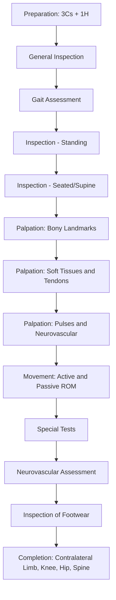

# Examination of the Foot

## Master Examination Sequence

---

## Preparation

**"Good morning, I am [Name], a medical student. May I examine your foot and ankle today? I will need to expose your legs from the knees downwards and remove your shoes and socks. Please let me know if anything is painful at any point."** [1]

- **3Cs**: Consent, Curtains, Chaperone
- **1H**: Hand hygiene — state: *"I would wash my hands before and after the examination."*
- **Positioning**: Begin with the patient **standing** (for alignment and gait), then transition to **sitting on the edge of the bed** (for palpation and ROM), and finally **supine** (for special tests and neurovascular assessment) [1][2]
- **Exposure**: Both feet and legs exposed from the knees down; shoes and socks removed and kept nearby (you will inspect them later)

> 「你好，我係醫學生[Name]，我今日想幫你檢查吓隻腳，可以嗎？我需要你除咗鞋襪，露出膝頭以下嘅位置。如果有邊度痛，請你同我講。」

---

## General Inspection

Before you touch the patient, take a step back and observe.

**Commentary:** *"On general inspection, the patient appears comfortable at rest. I note no walking aids, no wheelchair, and no orthotic devices at the bedside. There are no intravenous lines or drains. The patient appears well-nourished with no obvious distress."*

**Around the bedside:**
- Walking aids (crutches, stick, frame) — suggests mobility limitation
- Orthotics, insoles, ankle braces, orthopedic shoes
- Pressure-relieving heel protectors — suggests peripheral vascular disease or diabetic foot [3]
- Total contact cast — suggests Charcot arthropathy or diabetic ulcer management

**On the patient:**
- Body habitus: obesity (increases mechanical load on foot), cachexia
- Skin: general pallor, jaundice
- Hands: rheumatoid changes, psoriatic nail changes, tophi (gout) — these systemic clues inform foot pathology
- Tar staining — major risk factor for peripheral vascular disease [1][4]

---

## Gait Assessment

**Why:** The foot is a dynamic structure — you miss a lot if you only examine it statically. Gait reveals deformity, pain, weakness, and compensatory patterns.

**Commentary:** *"I would like to observe you walking. Please walk to the end of the room and back in your normal way."*
> 「請你正常行去嗰邊再行返嚟。」

### What to observe:
| Phase | Normal | Abnormal | Significance |
|---|---|---|---|
| **Heel strike** | Heel contacts ground first | Absent heel strike, toe-walking | Achilles contracture, equinus deformity, L4-5 weakness |
| **Foot flat / midstance** | Smooth transition, arch maintained | Excessive pronation, foot slap | Pes planus, tibialis posterior dysfunction, foot drop (L4-5/common peroneal nerve) |
| **Heel off / toe off** | Push-off from hallux | Reduced push-off, shortened stride | Hallux rigidus, 1st MTPJ pathology, metatarsalgia |
| **Swing phase** | Foot clears ground | Steppage gait (high knee lift) | Foot drop |

**Additional gait tests:**
- ***Tip-toe walking*** (S1 — gastrocnemius/soleus): *"Please walk on your tip-toes"* 「請你用腳尖行」— also assesses tibialis posterior function and hindfoot valgus correction (see below) [2]
- ***Heel walking*** (L4-5 — tibialis anterior): *"Please walk on your heels"* 「請你用腳踭行」
- **Tandem gait** if cerebellar pathology suspected

---

## Inspection

### A. Standing — Weight-bearing (viewed from front, sides, and behind)

This is the most important phase for alignment assessment. **Always look from the front, sides, and behind** — make a deliberate gesture of walking around the patient.

**Commentary:** *"I am now going to inspect your feet while you are standing. I will look from the front, from the side, and from behind."*

#### From the Front:
- ***Hallux valgus***: lateral deviation of the great toe at the 1st MTPJ [2][5]
  - Look for ***bunion*** (medial eminence/bursa overlying 1st metatarsal head) — may be red and inflamed
  - ***Pronation deformity*** of the hallux [5]
  - ***1st metatarsal varus*** (splaying of 1st ray medially) [5]
  - **Pathophysiology**: imbalance of intrinsic/extrinsic muscles, tight footwear, genetic predisposition → progressive lateral deviation of hallux with medial metatarsal head prominence
- ***Lesser toe deformities*** [5]:
  - **Hammer toe**: flexion at PIPJ, extension at DIPJ and MTPJ
  - **Claw toe**: hyperextension at MTPJ, flexion at PIPJ and DIPJ (think intrinsic muscle dysfunction — RA, diabetes, neurological)
  - **Mallet toe**: flexion at DIPJ only
  - ***2nd overriding toe***: often secondary to severe hallux valgus pushing the 2nd toe dorsally [5]
- Skin: callosities (indicate abnormal pressure distribution), ulcers (check between toes!), web-space maceration (fungal infection)

#### From the Side:
- ***Medial longitudinal arch*** [5]:
  - **Pes planus** (flat foot): loss/reduction of arch — may be physiological (flexible) or pathological (rigid, e.g. tarsal coalition, tibialis posterior dysfunction)
  - **Pes cavus**: excessively high arch — think neuromuscular (Charcot-Marie-Tooth, Friedreich ataxia, spina bifida) [6]
  - *Rocker-bottom foot*: convex sole — Charcot arthropathy or congenital vertical talus [7]
- Achilles tendon: thickening, nodularity (xanthoma in familial hypercholesterolaemia; tendinopathy)
- Equinus deformity (plantarflexed ankle)

#### From Behind:
- ***Hindfoot alignment*** [2][5]:
  - Normal: slight valgus (5-7°)
  - ***Hindfoot valgus*** (> 7°): associated with pes planus, tibialis posterior tendon dysfunction
  - ***Hindfoot varus***: associated with pes cavus
  - Assess with the "too many toes" sign: stand behind the patient — normally you see the 5th toe and a sliver of the 4th. If more toes are visible laterally, it suggests excessive hindfoot valgus/forefoot abduction (tibialis posterior dysfunction)
- Achilles tendon alignment: should be midline; deviation suggests hindfoot malalignment
- Skin: posterior heel callosities, Haglund's deformity (pump bump)

<Callout title="Too Many Toes Sign" type="idea">
When standing behind a patient with tibialis posterior tendon dysfunction, you will see more than the usual 1.5 lateral toes peeking out — this is because the forefoot is abducted relative to the hindfoot. It is a quick screening test for flatfoot deformity.
</Callout>

### B. Seated / Supine — Non-weight-bearing

With the patient sitting on the bed edge (feet dangling) or supine:

- **Sole of foot**: callosities under metatarsal heads (metatarsalgia), plantar warts, ulcers
  - ***Ulcer location is diagnostic*** [4][7]:
    - Neuropathic ulcers: over pressure areas — metatarsal heads, tips of toes, heel (painless, punched-out, surrounded by callus)
    - Ischaemic ulcers: tips of toes, between toes, dorsum of foot (painful, pale/necrotic base, no callus)
    - Venous ulcers: gaiter area (medial malleolus), not typically on the foot itself
- **Trophic changes** indicating chronic ischaemia [1][4]:
  - Hair loss over dorsum of foot/toes
  - Dry, shiny, thin skin
  - Brittle, thickened, ridged nails
  - Muscle wasting (guttering between metatarsals)
- **Colour** [1][4]:
  - White/pale: advanced ischaemia
  - Blue/cyanotic: deoxygenated blood stagnation
  - Red: reactive hyperaemia or infection
  - Black: gangrene (wet vs dry — see below)
- **Gangrene** [3]:
  - *Dry*: black, shrivelled, clear demarcation — chronic ischaemia
  - *Wet*: soft, moist, swollen, infected, no clear demarcation — surgical emergency
- **Swelling**: diffuse (oedema, infection) vs localized (bursitis, ganglion, tumour)
- **Scars**: surgical scars (bunionectomy, ORIF, arthrodesis) [5]
- ***Diabetic changes***: diabetic dermopathy (atrophic hyperpigmented papules on shin), ***Charcot foot*** (rocker-bottom deformity, bony prominences) [4][7]

---

## Palpation

**Ask about pain first!** *"Before I touch your foot, is there anywhere that is particularly painful?"*
> 「喺我掂你隻腳之前，有冇邊度特別痛？」

### A. Temperature
- Use the **dorsum of your hand** (more sensitive to temperature) [3]
- Compare both feet simultaneously, running from distal (toes) to proximal (shin)
- **Cold foot**: peripheral arterial disease
- **Warm, swollen foot**: infection, gout, acute Charcot arthropathy

**Commentary:** *"I am feeling the temperature of both feet using the dorsum of my hands, comparing both sides. The feet feel warm and symmetrical."*

### B. Capillary Refill
- Press firmly on the **pulp of the great toe** for 5 seconds, then release
- Normal: colour returns in < 2 seconds [3][4]
- Prolonged refill: inadequate perfusion (peripheral arterial disease, shock)

### C. Peripheral Pulses [1][4]
- ***Dorsalis pedis pulse***: on the dorsum of the foot, lateral to the extensor hallucis longus tendon (ask patient to point big toe upward to identify the tendon). Located approximately 1/3 of the way along a line from the midpoint between the two malleoli to the 1st web space [4]
- ***Posterior tibial pulse***: posterior and inferior to the medial malleolus, approximately 1/3 way between the medial malleolus and the heel [4]
- Grade as: absent (−), reduced (+), normal (++), exaggerated (+++) [4]
- **Always compare bilaterally**

**Commentary:** *"I am palpating the dorsalis pedis pulse bilaterally... both are palpable and of equal volume. I will now feel for the posterior tibial pulse... also present bilaterally."*

<Callout title="Absent Dorsalis Pedis" type="error">
Up to 10% of the normal population has an absent dorsalis pedis pulse — this is an anatomical variant, not necessarily pathological. Always check the posterior tibial pulse as well before concluding ischaemia. Also palpate the popliteal and femoral pulses to localise any proximal occlusion.
</Callout>

### D. Bony Landmark Palpation

**Systematic approach: proximal to distal, medial then lateral**

| Landmark | How to Find It | Pathology if Tender |
|---|---|---|
| **Medial malleolus** | Prominent bony point on medial ankle | Fracture, deltoid ligament injury |
| **Lateral malleolus** | Prominent bony point on lateral ankle (more distal and posterior than medial) | Fracture, lateral ligament injury |
| ***Anterior talofibular ligament (ATFL)*** | Anterior to lateral malleolus, running to talus neck | Most commonly injured ankle ligament in inversion sprains [2] |
| ***Calcaneofibular ligament (CFL)*** | Inferior to lateral malleolus to lateral calcaneus | 2nd most common ankle ligament injury |
| **Deltoid ligament** | Fan-shaped below medial malleolus | Eversion injury; rarely injured alone |
| ***Sinus tarsi*** | Depression anteroinferior to lateral malleolus (between talus and calcaneus laterally) | Sinus tarsi syndrome, subtalar pathology [2] |
| **Base of 5th metatarsal** | Palpable bony prominence on lateral midfoot | Avulsion fracture (peroneus brevis insertion), Jones fracture |
| ***Navicular tuberosity*** | Medial prominence of midfoot (tibialis posterior insertion) | Accessory navicular, tibialis posterior tendinopathy [2] |
| **1st MTPJ** | Big toe joint | Hallux valgus, gout, hallux rigidus |
| **Metatarsal heads** | Plantar surface | Metatarsalgia, stress fracture, Morton's neuroma |
| **Calcaneus** | Plantar surface of heel, insertion of plantar fascia | Plantar fasciitis (medial tubercle), calcaneal stress fracture |

### E. Soft Tissue / Tendon Palpation

- ***Achilles tendon***: palpate from musculotendinous junction distally to calcaneal insertion. Feel for thickening, nodularity, gaps (rupture), tenderness. Check ***retrocalcaneal bursa*** (anterior to tendon at insertion) [2]
- **Tibialis posterior tendon**: along its course posterior to the medial malleolus to the navicular tuberosity — tenderness suggests tendinopathy/dysfunction
- **Peroneal tendons**: posterior to lateral malleolus — check for subluxation (ask patient to evert against resistance and feel tendons snapping over malleolus)
- ***Plantar fascia***: palpate the medial calcaneal tubercle (origin of plantar fascia) — point tenderness suggests plantar fasciitis

**Commentary:** *"I am now palpating the bony landmarks of the foot systematically, starting from the medial malleolus... no tenderness. I am palpating the Achilles tendon for any thickening, nodularity or gap... the tendon feels normal with no gap palpable."*

### F. Special Palpation — Morton's Neuroma (Mulder's Click/Squeeze Test)

- **Technique**: Squeeze the metatarsal heads together with one hand while simultaneously pressing between the affected metatarsal heads (usually 3rd web space) with the other
- **Positive test**: a palpable click/clunk felt between the metatarsal heads, often with reproduction of the patient's shooting pain into the affected toes
- **Pathophysiology**: interdigital nerve is compressed between the metatarsal heads, causing perineural fibrosis (neuroma). Squeezing forces the swollen nerve to pop between the metatarsal heads producing the click

---

## Movement

**General principle:** Always test **active** ROM first (what the patient can do), then **passive** ROM (what you can achieve), and compare with the contralateral side. Note if pain limits movement vs true mechanical block.

### A. Ankle Joint (Talocrural Joint)

- **Dorsiflexion** (normal ~20°): *"Pull your foot up towards you"* 「將隻腳板向上翹」
- **Plantarflexion** (normal ~50°): *"Point your foot down"* 「將隻腳板向下壓」
- Stabilise the tibia with one hand, hold the calcaneus with the other
- **Reduced dorsiflexion**: Achilles/gastrocnemius contracture (common), anterior ankle impingement, ankle arthritis

### B. Subtalar Joint (Inversion / Eversion)

- **Inversion** (normal ~30°): *"Turn the sole of your foot inwards"* 「將腳板心轉向入」
- **Eversion** (normal ~20°): *"Turn the sole of your foot outwards"* 「將腳板心轉向出」
- **Stabilise the ankle** (hold the calcaneus) and rock the heel into inversion/eversion
- **Reduced subtalar motion**: subtalar arthritis, tarsal coalition (rigid flat foot in adolescents), Charcot arthropathy [6]

### C. Midtarsal Joints

- Hold the calcaneus steady and rotate the forefoot medially and laterally
- Assess forefoot adduction/abduction and supination/pronation
- Reduced motion in midtarsal arthritis, tarsal coalition

### D. 1st Metatarsophalangeal Joint (1st MTPJ)

- ***Normal dorsiflexion ~70°, plantarflexion ~30°*** [5]
- Assess ROM: *"Bend your big toe up and down"*
- **Hallux rigidus**: marked reduction in dorsiflexion (often < 30°), ± dorsal osteophyte palpable — degenerative arthritis of 1st MTPJ
- **Hallux valgus**: assess correctability (flexible vs rigid deformity)

### E. 1st Tarsometatarsal Joint (1st TMTJ) — Hypermobility

- Hold the 2nd metatarsal as a fixed reference; grasp the 1st metatarsal and translate it dorsally and plantarly
- ***Excessive sagittal plane motion (> 9mm) suggests 1st TMTJ hypermobility*** → contributes to hallux valgus pathogenesis [5]
- This is a subtle examination point — very high yield in orthopaedic OSCE stations

### F. Lesser Toe Joints

- Assess IP and MTP joint mobility — fixed vs flexible deformity
- A flexible hammer toe corrects with passive extension; a fixed one does not → determines operative approach

---

## Special Tests

### 1. ***Tip-Toe Test (Single and Double Heel Raise)*** [2][5]

- **Purpose**: Assesses tibialis posterior function and hindfoot flexibility
- **Technique**: Ask the patient to stand on tip-toes (both feet, then single leg)
  > 「請你用腳尖企起嚟」then 「而家用一隻腳企」
- **Normal**: The hindfoot should invert from its resting valgus position (the arch reconstitutes) and the patient can perform multiple single-leg heel raises
- **Abnormal / Positive**: Hindfoot remains in valgus, the arch does not reconstitute, and the patient cannot perform a single-leg heel raise → **tibialis posterior tendon dysfunction (TPTD)** — the most common cause of acquired adult flat foot
- **Pathophysiology**: Tibialis posterior is the primary dynamic stabiliser of the medial longitudinal arch. When it fails, the arch collapses under load and the hindfoot falls into valgus

### 2. ***Coleman Block Test*** [2]

- **Purpose**: Differentiates forefoot-driven hindfoot varus from fixed hindfoot varus in pes cavus
- **Technique**: Place a block (e.g. a book, ~2.5 cm thick) under the lateral border of the foot, allowing the 1st metatarsal head to hang off the edge
- **Positive (corrects)**: Hindfoot varus corrects to neutral/slight valgus when the plantarflexed 1st ray is taken out of the equation → the hindfoot is flexible, and the varus is driven by forefoot pronation
- **Negative (does not correct)**: Hindfoot varus persists → fixed hindfoot deformity requiring different surgical approach
- **Pathophysiology**: In pes cavus, often the 1st ray is plantarflexed, which forces the hindfoot into compensatory varus. The block removes the effect of the plantarflexed 1st ray

### 3. ***Silfverskiöld Test*** [2][5]

- **Purpose**: Differentiates gastrocnemius tightness from combined gastrosoleus tightness (isolated gastrocnemius contracture is the most common cause of equinus)
- **Technique**:
  1. Stabilise (***neutralise***) the subtalar joint in neutral position (important to avoid measuring midfoot dorsiflexion instead) [2]
  2. Passively dorsiflex the ankle with the **knee extended** — record the angle
  3. Repeat with the **knee flexed to 90°** — record the angle
- **Interpretation**:
  - Dorsiflexion improves significantly with knee flexion → ***positive Silfverskiöld test*** = **isolated gastrocnemius contracture** (because gastrocnemius crosses the knee joint; relaxing it by flexing the knee increases available ankle dorsiflexion)
  - Dorsiflexion remains limited with knee flexion → combined **gastrosoleus contracture** (soleus does not cross the knee)
- **Normal dorsiflexion**: ≥10° past neutral with knee extended; ≥20° with knee flexed

**Commentary:** *"I am now performing the Silfverskiöld test. I will stabilise the subtalar joint in neutral, then dorsiflex the ankle with the knee straight... I am getting approximately 5 degrees. Now with the knee bent... I am getting 15 degrees. This improvement with knee flexion suggests an isolated gastrocnemius contracture."*

### 4. ***Anterior Drawer Test of the Ankle***

- **Purpose**: Tests integrity of the ***anterior talofibular ligament (ATFL)*** — the most commonly injured ligament in ankle inversion sprains [2]
- **Technique**: Patient supine with knee flexed and ankle in slight plantarflexion. Stabilise the distal tibia with one hand; with the other hand cup the calcaneus and pull the foot anteriorly
- **Positive**: Excessive anterior translation of the talus within the mortise (compared to contralateral side) ± a soft endpoint — indicates ATFL rupture
- **Pathophysiology**: The ATFL is the primary restraint to anterior translation of the talus. When ruptured, the talus subluxes forward

### 5. ***Talar Tilt Test*** [2]

- **Purpose**: Tests the ***calcaneofibular ligament (CFL)***
- **Technique**: Patient supine, ankle in neutral. Stabilise the distal tibia; cup the calcaneus and invert the foot (tilt the talus in the mortise)
- **Positive**: Excessive inversion (> 10° more than contralateral) with a soft endpoint → CFL injury
- **Pathophysiology**: CFL is the primary restraint to inversion of the subtalar joint in neutral ankle position

### 6. ***Squeeze Test (Syndesmosis)***

- **Purpose**: Screens for syndesmotic (high ankle) injury
- **Technique**: Squeeze the fibula against the tibia at mid-calf level
- **Positive**: Reproduction of pain at the syndesmosis (anteroinferior tibiofibular ligament region) → suggests disruption of the interosseous membrane and syndesmotic ligaments
- **Pathophysiology**: Compressing the fibula against the tibia at the mid-calf separates the distal fibula from tibia, stressing the injured syndesmosis

### 7. ***Thompson / Simmonds Test*** (Achilles tendon rupture)

- **Purpose**: Tests continuity of the Achilles tendon
- **Technique**: Patient prone with feet hanging off the end of the bed, or kneeling on a chair. Squeeze the calf firmly
- **Normal**: Foot plantarflexes
- **Positive (ruptured)**: No plantarflexion of the foot → Achilles tendon rupture
- **Sensitivity**: ~96%
- **Pathophysiology**: The gastrosoleus complex transmits force via the Achilles tendon to plantarflex the foot. If the tendon is disrupted, squeezing the muscle belly fails to produce movement at the ankle

### 8. ***Jack's Test (Hubscher Manoeuvre)***

- **Purpose**: Determines if a flat foot is flexible or rigid
- **Technique**: With the patient standing, passively dorsiflex the great toe
- **Positive (flexible)**: The medial longitudinal arch reconstitutes (the windlass mechanism — the plantar fascia tightens, supinating the midfoot and elevating the arch)
- **Negative (rigid)**: Arch does not reconstitute → tarsal coalition, rigid pes planus

### 9. ***Buerger's Test*** (if vascular compromise suspected) [1][3][4]

- **Purpose**: Assesses severity of peripheral arterial disease
- **Technique**:
  1. Patient supine — elevate both legs slowly until toes become pale
  2. Note the angle at which pallor develops = ***Buerger's angle***
     - Normal: leg can be raised to 90° without pallor
     - Buerger's angle < 20°: ***severe ischaemia*** [3]
  3. Then sit the patient up and let the legs hang over the edge of the bed
  4. Look for ***dependent rubor***: foot becomes dusky red/purple — reactive hyperaemia indicating inadequate arterial supply
- **Pathophysiology**: In a critically ischaemic limb, arterial perfusion pressure is barely sufficient at rest. Elevation reduces hydrostatic pressure further, causing pallor. On dependency, maximally dilated (due to chronic ischaemia) arterioles allow blood to pool, causing the red-purple discolouration

---

## Neurovascular Assessment

### Sensory Testing [7][8]

- ***Monofilament test (10g Semmes-Weinstein)***: the gold standard screening tool for diabetic peripheral neuropathy
  - Sites: plantar aspect of 1st, 3rd, and 5th metatarsal heads, great toe pulp, midfoot, and heel
  - Positive for neuropathy: inability to feel the monofilament
- **Light touch**: cotton wool — test dermatomes (L4 medial foot, L5 dorsum of foot/1st web space, S1 lateral foot/sole)
- **Pinprick**: for spinothalamic tract — test distal to proximal in stocking distribution
- ***Vibration sense*** (128Hz tuning fork): place on bony prominences — great toe → medial malleolus → tibial tuberosity [8]
  - Lost early in diabetic peripheral neuropathy and posterior column lesions
- **Proprioception**: hold the sides of the great toe, demonstrate "up" and "down" with eyes open, then test with eyes closed [8]

> *"I am going to touch your foot with this thin wire. Please close your eyes and say 'yes' when you feel me touching."* 「我而家會用呢條幼線掂你隻腳，請你閉埋眼，感覺到嘅時候話我知。」

### Motor Testing (Key Foot Muscles)

| Movement | Muscle | Nerve Root | Peripheral Nerve |
|---|---|---|---|
| Ankle dorsiflexion | Tibialis anterior | L4 | Deep peroneal |
| Great toe extension | Extensor hallucis longus | L5 | Deep peroneal |
| Ankle eversion | Peronei | L5-S1 | Superficial peroneal |
| Ankle plantarflexion | Gastrocnemius/Soleus | S1-S2 | Tibial |
| Ankle inversion | Tibialis posterior | L4-L5 | Tibial |
| Toe flexion | FDL, FHL | S1-S2 | Tibial |

### Reflexes
- **Ankle jerk** (S1-S2): tap Achilles tendon with knee flexed and ankle in neutral dorsiflexion
  - Absent: S1 radiculopathy, peripheral neuropathy
  - Exaggerated + clonus (> 3 beats): UMN lesion [8]

### ***Medial Toe Sensation*** [5]

- **Why high yield**: The dorsomedial cutaneous nerve of the hallux (terminal branch of deep peroneal nerve, L5) can be injured in foot surgery — always test as part of the foot examination
- It is also specifically listed as a special test in the lecture slides [5]

---

## Inspection of Footwear

**Commentary:** *"I would like to inspect the patient's shoes."*

- **Asymmetric wear pattern**: lateral wear suggests supination/varus; medial wear suggests pronation/valgus
- **Insoles/orthotics**: suggests pre-existing biomechanical issues or prior podiatric intervention
- **Shoe type**: narrow/pointed shoes exacerbate hallux valgus and lesser toe deformities
- **Bulging medially**: suggests severe hallux valgus/bunion

---

## Completing the Examination

**Commentary:** *"To complete my examination, I would like to..."*

1. **Examine the contralateral foot** for comparison [1]
2. **Examine the knee and hip joints** — foot deformities can be compensatory for proximal pathology, and hip/knee problems can alter gait and foot mechanics
3. **Examine the lumbar spine** — L4-S2 radiculopathy can present with foot symptoms
4. **Perform a full peripheral vascular examination** including palpation of femoral and popliteal pulses, and ***ankle-brachial index (ABI)*** measurement if peripheral arterial disease is suspected [1][3][4]
5. **Perform a neurological examination of the lower limb** if neuropathy is suspected (power, sensation, reflexes in dermatomal/myotomal distribution) [4]
6. Check ***Beighton score*** if generalised hypermobility is suspected (contributes to flexible flat foot) [5]
7. **Request radiographs**: weight-bearing AP and lateral foot X-rays, and if ankle pathology, AP/lateral/mortise views

---

## ABI Interpretation (for Completion) [3]

| ABI | Interpretation |
|---|---|
| > 1.3 | Non-compressible/calcified vessels (especially in DM — use toe-brachial index instead) |
| 0.9–1.3 | Normal |
| 0.4–0.9 | Claudication |
| < 0.4 | ***Critical limb ischaemia*** |

---

## Expected Positive vs Important Negative Findings

### Common Conditions and Their Key Findings:

| Condition | Expected Positive Findings | Important Negatives to Document |
|---|---|---|
| **Hallux valgus** | Lateral deviation of hallux, bunion, 1st MT varus, 2nd toe overriding, pronation deformity | No skin breakdown over bunion, neurovascularly intact (DP pulse, medial toe sensation) |
| **Pes planus (acquired adult)** | Loss of arch, hindfoot valgus, too many toes sign, failed single-leg heel raise | No rigid deformity (Jack's test positive = flexible), no ankle OA |
| **Pes cavus** | High arch, claw toes, hindfoot varus, callosities under MT heads | No UMN signs, Coleman block test result (flexible vs rigid) |
| **Plantar fasciitis** | Point tenderness at medial calcaneal tubercle | No calcaneal squeeze test pain (stress fracture), no neurological deficit |
| **Achilles tendon rupture** | Palpable gap, positive Thompson test, absent active plantarflexion | No distal neurovascular deficit |
| **Ankle sprain (lateral)** | ATFL tenderness, swelling, positive anterior drawer | No bony tenderness at malleoli or base of 5th MT (Ottawa ankle rules), no syndesmotic tenderness |
| **Diabetic foot** | Neuropathy (monofilament loss), ulcers at pressure areas, Charcot deformity, absent/reduced pulses | No wet gangrene, no deep abscess, no osteomyelitis signs (probe-to-bone test) |

---

## Red-Flag Examination Findings and Escalation Triggers

- ***Acute cold, white, pulseless foot***: acute limb ischaemia — **6Ps** (Pain, Pallor, Pulselessness, Paraesthesia, Paralysis, Perishing cold) → immediate vascular surgery referral
- ***Wet gangrene***: infected necrotic tissue without clear demarcation → **surgical emergency** (debridement or amputation) [3]
- ***Open fracture***: bone visible or communicating wound → urgent orthopaedic referral, IV antibiotics
- ***Compartment syndrome of the foot***: severe pain out of proportion, pain on passive toe extension, tense swelling → urgent fasciotomy
- ***Rapidly progressive Charcot arthropathy***: acute red, hot, swollen foot in a diabetic → immobilise immediately (total contact cast) and rule out osteomyelitis/septic arthritis
- ***Cauda equina syndrome***: bilateral foot weakness, saddle anaesthesia, urinary retention → emergency MRI and neurosurgical referral

---

## Common OSCE Pitfalls

<Callout title="Common Mistakes in Foot Examination" type="error">

1. **Forgetting to examine gait** — examining the foot only statically misses dynamic deformities (especially TPTD)
2. **Not examining from behind** — hindfoot alignment is ONLY properly assessed from behind
3. **Not comparing both sides** — always bilateral comparison for pulses, temperature, ROM
4. **Not neutralising the subtalar joint during Silfverskiöld test** — you will get falsely adequate dorsiflexion through the midfoot instead of the true ankle
5. **Forgetting to inspect footwear** — this is often the free mark in an OSCE
6. **Not asking about pain before palpation** — an instant fail in many marking schemes
7. **Confusing subtalar joint motion with ankle joint motion** — inversion/eversion occurs at the subtalar joint, NOT the ankle (talocrural) joint
8. **Not checking neurovascular status** — especially in post-trauma or diabetic foot stations
9. **Failing to mention completion steps** — always offer to examine knee, hip, spine, and perform ABI

</Callout>

---

## High-Yield Interpretation Tips

- **Hallux valgus + 2nd overriding toe** = advanced deformity, likely needs surgical consideration
- **Hindfoot valgus that corrects on tip-toe** = flexible flat foot (likely physiological or early TPTD); **does not correct** = rigid (tarsal coalition, late TPTD)
- **Pes cavus in an adult** = always think neurological cause until proven otherwise (Charcot-Marie-Tooth #1)
- **Positive Silfverskiöld** = isolated gastrocnemius contracture → can be addressed with gastrocnemius release (Strayer procedure) rather than Achilles lengthening
- **Positive Coleman block** = forefoot-driven varus → address the 1st ray (dorsiflexion osteotomy) and the hindfoot should correct
- **Loss of monofilament sensation** = at-risk diabetic foot → needs aggressive preventive care (orthotics, podiatry, patient education)
- **ABI > 1.3 in a diabetic** = falsely elevated due to medial arterial calcification (Mönckeberg's) → measure ***toe-brachial pressure index*** instead [3]

---

## Model Reporting Script

> *"On examination, Mr Chan is a 55-year-old gentleman who appears comfortable at rest. There are no walking aids at the bedside. Vital signs are stable.*
>
> *On inspection, there is a hallux valgus deformity of the left foot with a prominent medial bunion and lateral deviation of the hallux of approximately 40 degrees. The 2nd toe is overriding the hallux. The 1st metatarsal is in varus. There is a pronation deformity of the hallux. No skin breakdown is seen over the bunion. No callosities or ulcers are present. The medial longitudinal arch appears mildly reduced on weight-bearing. Viewing from behind, there is mild hindfoot valgus bilaterally, which corrects on tip-toe standing.*
>
> *On palpation, the foot is warm with a capillary refill time of less than 2 seconds. The dorsalis pedis and posterior tibial pulses are palpable and symmetrical bilaterally. There is mild tenderness over the medial eminence of the 1st MTPJ on the left. No tenderness is elicited elsewhere. The Achilles tendon is non-tender with no palpable gap or nodularity.*
>
> *On movement, the left 1st MTPJ has a dorsiflexion of approximately 50 degrees and plantarflexion of 20 degrees. There is no crepitus. The hallux valgus deformity is partially correctable passively. The 1st TMTJ demonstrates no significant hypermobility. Ankle dorsiflexion is 15 degrees with the knee extended and 25 degrees with the knee flexed — a positive Silfverskiöld test suggesting isolated gastrocnemius tightness. Subtalar joint motion is preserved.*
>
> *Special tests: The tip-toe test is normal with hindfoot inversion bilaterally. The Coleman block test is not indicated. Sensation to light touch and monofilament testing is intact in all distributions. The dorsalis pedis pulse and medial toe sensation are preserved — important for surgical planning.*
>
> *In summary, this gentleman has a moderate-to-severe hallux valgus deformity of the left foot with a secondary 2nd overriding toe and isolated gastrocnemius contracture, with preserved neurovascular status. I would request weight-bearing AP and lateral foot radiographs to assess the hallux valgus angle, intermetatarsal angle, and DMAA to guide further management."*

---

<Callout title="High Yield Summary">

**Foot examination follows: Gait → Look (standing: front, side, behind) → Feel (temperature, pulses, bony landmarks, soft tissues) → Move (ankle, subtalar, midfoot, 1st MTPJ, lesser toes) → Special Tests → Neurovascular → Footwear → Completion.**

Key special tests to know cold:
- **Tip-toe test**: tibialis posterior function / flexible vs rigid flat foot
- **Coleman block test**: forefoot-driven vs fixed hindfoot varus in pes cavus
- **Silfverskiöld test**: gastrocnemius vs gastrosoleus contracture (neutralise subtalar joint!)
- **Thompson test**: Achilles tendon rupture
- **Anterior drawer / talar tilt**: ATFL / CFL integrity
- **Jack's test**: windlass mechanism — flexible vs rigid pes planus
- **Mulder's click**: Morton's neuroma
- **Buerger's test**: critical limb ischaemia

Always check: DP pulse, posterior tibial pulse, medial toe sensation, and inspect footwear.

</Callout>

---

<ActiveRecallQuiz
  title="Active Recall - Physical Exam"
  items={[
    {
      question: "What does the Silfverskiold test differentiate, and how must you position the subtalar joint when performing it?",
      markscheme: "It differentiates isolated gastrocnemius contracture from combined gastrosoleus contracture. The subtalar joint must be neutralised to prevent false dorsiflexion through the midfoot. Improved dorsiflexion with knee flexion indicates isolated gastrocnemius tightness."
    },
    {
      question: "A patient with pes planus cannot perform a single-leg heel raise and the hindfoot remains in valgus on tip-toe. What is the most likely diagnosis?",
      markscheme: "Tibialis posterior tendon dysfunction (acquired adult flat foot). The tibialis posterior is the primary dynamic stabiliser of the medial longitudinal arch; its failure causes collapse under load and persistent hindfoot valgus."
    },
    {
      question: "What is the Coleman block test and when is it used?",
      markscheme: "Used in pes cavus to determine if hindfoot varus is forefoot-driven or fixed. A block is placed under the lateral foot border allowing the 1st metatarsal to drop off. If hindfoot varus corrects, the deformity is forefoot-driven and the hindfoot is flexible."
    },
    {
      question: "Name the ankle ligament most commonly injured in an inversion sprain. How do you test its integrity?",
      markscheme: "The anterior talofibular ligament (ATFL). Tested with the anterior drawer test: stabilise the tibia, cup the calcaneus with the ankle in slight plantarflexion, and pull the foot anteriorly. Excessive anterior translation with a soft endpoint is positive."
    },
    {
      question: "In a diabetic patient, the ABI is measured at 1.4. What does this mean and what should you do instead?",
      markscheme: "ABI greater than 1.3 indicates non-compressible calcified arteries, common in diabetes (Monckeberg sclerosis). The ABI is falsely elevated and unreliable. A toe-brachial pressure index should be performed instead."
    },
    {
      question: "Describe the Thompson (Simmonds) test. What does a positive result indicate?",
      markscheme: "Patient prone or kneeling with feet hanging off the edge. Squeeze the calf firmly. Normally the foot plantarflexes. If there is no plantarflexion, the test is positive, indicating Achilles tendon rupture. Sensitivity approximately 96 percent."
    }
  ]}
/>

---

## References

[1] Senior notes: Ryan Ho Fundamentals.pdf (p8, p176, p179)
[2] Senior notes: maxim.md (section 8 — ankle/foot joints, forefoot/midfoot/hindfoot)
[3] Senior notes: felixlai.md (p132–138 — vascular examination, Buerger's test, ABI)
[4] Senior notes: Ryan Ho Cardiology.pdf (p201–204 — peripheral arterial examination)
[5] Lecture slides: GC 234. Common Foot and Ankle Conditions.pdf (p24, p27 — clinical evaluation, inspection, motion, special tests)
[6] Senior notes: Adrian Lui Pediatrics.pdf (p445 — talipes equinovarus, pes cavus, tarsal coalition)
[7] Senior notes: Ryan Ho Endocrine.pdf (p98–99 — diabetic foot, neuropathy screening, Charcot arthropathy)
[8] Senior notes: Ryan Ho Neurology.pdf (p29, p31 — lower limb neurological examination, sensory testing, plantar reflex)
