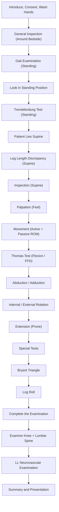

# Examination of the Hip

## Master Examination Sequence

---

## General Approach (3Cs + 1H)

Before touching the patient, you must demonstrate professionalism. This is free marks in an OSCE — don't throw them away.

1. **Introduce** yourself: *"Good morning, my name is Dr. Chan. I am a medical student/doctor."*
   - 「你好，我係陳醫生。」
2. **Consent**: *"I would like to examine your hip today. Is that okay?"*
   - 「我想檢查你嘅髖關節，可以嗎？」
3. **Confirm** comfort/pain: *"Please let me know if anything is painful at any point."*
   - 「如果有任何痛，請話我知。」
4. **Hand hygiene**: *"Before I begin, I would like to wash my hands."*

**Positioning and Exposure:**
- ***Start in standing position with only underwear on (ideally expose entire lower limb)*** [1][2].
- The patient must be adequately exposed from the waist down — you need to see the pelvis, both entire lower limbs, and the back.
- Have a chaperone if appropriate.

<Callout title="Don't Skip the Standing Phase" type="error">
A very common OSCE mistake is to jump straight to the supine position. The hip exam **begins in standing** because you need gait, Trendelenburg test, and standing inspection first. The examiner will penalise you if you miss this.
</Callout>

---

## General Inspection

Before you formally start the structured exam, take a "panoramic" look:

### Around the Bedside
- **Walking aids**: crutches, walking frame, stick (suggests chronic hip pathology / post-operative)
- **Footwear**: shoe raises (leg length discrepancy)
- **Medications**: analgesics, steroids (risk factor for AVN)
- **IV lines / drains**: post-operative hip replacement

### First Glance at the Patient
- **Body habitus**: obesity (risk for OA), thin/cachectic (malignancy, TB)
- **Distress level**: guarding the hip, reluctance to move
- **Skin changes**: bruising (fracture), erythema (infection/septic arthritis)
- **Posture**: note if the hip is ***held in flexion, abduction and external rotation*** — classic for septic arthritis or effusion [3]

> **Running commentary:** *"On general inspection, the patient is standing comfortably with a walking stick on the left side. There are no drains, IV lines, or obvious distress. I note a lateral scar over the right hip."*

---

## Systematic Examination Sequence

### 1. Gait Examination (Standing)

**Why we do this first:** Gait is the single most functional assessment of the hip. Many hip pathologies have characteristic gaits.

Ask the patient to walk normally across the room, turn around, and walk back.
- 「請你行過去，轉身再行返嚟。」

| Gait Pattern | What It Looks Like | Pathophysiology |
|:---|:---|:---|
| ***Antalgic gait*** | Shortened stance phase on affected side; patient rushes off the painful leg | Pain inhibits weight-bearing → reduced time on affected limb [1][2] |
| ***Trendelenburg gait*** | Trunk lurches **towards** the affected side with each step; contralateral pelvis drops | Weak/ineffective hip abductors (gluteus medius/minimus) cannot stabilise the pelvis → pelvis drops contralaterally → compensatory trunk lean ipsilaterally [1][2] |
| ***Short limb gait*** | Regular, even dip on the short side ± compensatory pelvic tilt, ipsilateral plantar flexion, or contralateral knee flexion | True or apparent LLD from hip pathology (e.g. DDH, OA, AVN, post-fracture) [1][2] |

> **Running commentary:** *"I would like to observe the patient's gait. The patient is walking with an antalgic gait, with a shortened stance phase on the right side. There is a positive Trendelenburg lurch to the right."*

---

### 2. Look in Standing Position

Walk around the patient (front, sides, back) while they are standing.

**What to look for:**

- ***Scars***: **laterally, posteriorly** (most common surgical approaches for hip replacement) [1][2]. Anterior scars less common.
- ***Sinuses***: draining sinus suggests **TB hip** or chronic infection [1][2]
- ***Muscle wasting***: especially **gluteals** — compare both sides from behind. Gluteal wasting suggests chronic hip disease or disuse.
- ***Deformity***: [1][2]
  - **Pelvic tilting**: one ASIS lower than the other → suggests LLD or adduction contracture
  - **Lumbar scoliosis**: compensatory for pelvic tilt
  - **Increased lumbar lordosis**: compensatory for **fixed flexion deformity (FFD)** at the hip — the patient hyperextends the lumbar spine to stand upright

> **Running commentary:** *"Looking from behind, I note wasting of the right gluteal muscles. There is a well-healed lateral scar over the right hip. The pelvis appears tilted with the right side higher. There is a compensatory lumbar scoliosis convex to the left."*

---

### 3. Trendelenburg Test (Standing)

**Why:** This tests the integrity of the hip abductor mechanism (gluteus medius, supplied by the superior gluteal nerve L5). It is arguably the most important special test for the hip.

**How to perform:** [1][2]
1. Stand facing the patient (or kneel in front).
2. Ask the patient to stand on one leg, with the other knee flexed to 90°.
   - 「請你企喺右腳，左腳提起屈曲。」
3. Observe for **30 seconds** (some advocate holding for up to 30 seconds to unmask subtle weakness).

**Three methods to assess (all acceptable):**
- **From behind**: Look for contralateral pelvis drop + ipsilateral trunk lurch [1][2]
- **From front**: Patient places outstretched palms on your hands; feel for increased pressure on the ipsilateral hand (trunk lurch) [1][2]
- ***Proper way (gold standard for OSCE)***: Kneel in front, place both hands on the ASIS to feel for contralateral pelvic tilting; let the patient rest hands on your shoulders and feel for ipsilateral increased pressure [1][2]

**Normal (negative) result:** When standing on one leg, the pelvis on the **unsupported** side rises or stays level (the hip abductors on the standing side contract to keep the pelvis level).

**Positive result:** The pelvis on the unsupported side **drops**, and the trunk lurches towards the standing (affected) side.

**Pathophysiology of a positive test:** [1][2]
- ***Gluteal weakness***: true weakness (e.g. superior gluteal nerve palsy, poliomyelitis, myopathy) **or** due to **hip pain causing reflex inhibition**
- ***Hip joint destructive pathologies***: the hip normally acts as a fulcrum for the abductor lever mechanism. If the joint is destroyed (e.g. severe OA, AVN, DDH with subluxation), the fulcrum is lost and abductors cannot function effectively.

<Callout title="Causes of a Positive Trendelenburg" type="idea">
Think of the abductor mechanism as a lever:
- **Muscle problem**: gluteal weakness (nerve injury, myopathy, pain inhibition)
- **Fulcrum problem**: joint destruction (OA, AVN, DDH, septic arthritis)
- **Lever arm problem**: shortening of the femoral neck (post-fracture, coxa vara)
Any disruption → positive Trendelenburg.
</Callout>

> **Running commentary:** *"I am now performing the Trendelenburg test. I ask the patient to stand on the right leg. I can see the left pelvis dropping below the level of the right, and the trunk is lurching to the right. This is a positive Trendelenburg test on the right side, suggesting right hip abductor insufficiency."*

---

### 4. Patient Lies Supine — Leg Length Discrepancy

Ask the patient to lie on the examination couch.
- 「請你躺喺床上面。」

#### a. Apparent Leg Length Discrepancy (LLD) [1][2]

**Why:** Accounts for causes above the pelvis (e.g. pelvic tilt, scoliosis, adduction/abduction contracture). ***More important functionally than true LLD.***

**How:**
- Ask the patient to lie comfortably. ***DO NOT square the pelvis.*** [1][2]
- Measure from a **midline** point (xiphisternum or umbilicus) to the **medial malleolus** on each side.
- Compare bilaterally.

**Abnormal finding:** Asymmetry suggests either true shortening or a pelvic tilt (adduction contracture makes the affected limb appear shorter; abduction contracture makes it appear longer).

#### b. True Leg Length Discrepancy [1][2]

**Why:** Measures actual bone length differences.

**How:**
- **Square the pelvis**: ensure both ASIS are at the same horizontal level and the patient is lying symmetrically.
- Measure from the **ASIS** to the **medial malleolus** on each side.
- Compare bilaterally.

**If true LLD is found, localise the discrepancy:**

#### c. ***Bryant Triangle*** (if femoral length discrepancy suspected) [1][2]

**How:**
- Patient supine. Place your:
  - **Thumb** over the ASIS
  - **Middle finger** over the greater trochanter
  - **Index finger** at the junction of the two perpendiculars (one vertical from ASIS, one horizontal from greater trochanter)
- Compare the distance between the middle and index fingers bilaterally.

**Findings:** [1][2]
- ***Shortened (above-trochanter segment)*** → **coxa vara** (femoral neck fracture, SCFE, Perthes disease, congenital), **AVN hip**, **OA hip**, congenital coxa vara, **DDH**
- ***Normal (below-trochanter segment)*** → femoral shaft fracture, growth disturbance (e.g. polio, physeal trauma, bone disease, infections)

> **Running commentary:** *"The apparent leg length from umbilicus to medial malleolus is 85cm on the right and 82cm on the left, suggesting apparent shortening of the left leg. The true leg length from ASIS to medial malleolus is 83cm on the right and 80cm on the left, confirming true shortening of 3cm on the left. Using Bryant's triangle, the above-trochanter segment is shortened on the left, suggesting pathology at the femoral neck level."*

---

### 5. Inspection (Supine)

Now that the patient is supine, re-inspect:

- **Resting position of the limb**: ***Externally rotated limb on supine position*** is characteristic of **OA hip** or femoral neck fracture [4]
- **Skin**: scars, sinuses, bruising, erythema, skin folds (asymmetric skin creases in infants → DDH)
- **Swelling**: anterior hip swelling (effusion, abscess, synovial thickening — the hip is deep so swelling is rarely visible; may present as groin fullness)
- **Muscle wasting**: quadriceps (compare thigh circumference 15cm above the patella bilaterally)

---

### 6. Palpation (Feel)

**Why:** Identifies the site of maximal tenderness and thereby narrows the differential.

- ***Greater trochanter tenderness***: suggests **trochanteric bursitis** (lateral hip pain, common mimicker of intrinsic hip pathology) [1][2]
- ***Proximal femur tenderness***: suggests **femoral pathology** (fracture, stress fracture, tumour) [1][2]
- ***(Hip joint tenderness)***: felt anteriorly over the **midpoint of the inguinal ligament**, deep to the femoral artery — ***generally unhelpful*** as the hip is too deep to palpate reliably, but worth a brief check [1][2]
- **Temperature**: compare with the contralateral side — warmth suggests inflammation/infection.

Ask: *"Is it tender here?"* 「呢度痛唔痛？」

> **Running commentary:** *"On palpation, there is tenderness over the greater trochanter on the right. There is no tenderness over the inguinal ligament midpoint or the proximal femoral shaft."*

---

### 7. Movement (Move)

This is the core of the hip examination. Assess **active range of motion (AROM)** first, then **passive range of motion (PROM)**. Always compare bilaterally.

Normal hip ROM (approximate):
| Movement | Normal Range |
|:---|:---|
| Flexion | 120–140° |
| Extension | 10–20° |
| Abduction | 40–50° |
| Adduction | 20–30° |
| Internal rotation | 30–40° |
| External rotation | 40–50° |

<Callout title="Internal Rotation is the First to Go" type="idea">
In OA and AVN of the hip, **internal rotation is the first movement to be lost** and is the most sensitive early sign of intra-articular hip pathology. Always test it. If IR is preserved and painless, think of an extra-articular cause for the pain.
</Callout>

#### a. Thomas Test / Flexion ROM [1][2]

**Why:** Detects **fixed flexion deformity (FFD)**, which is masked when the patient is standing (compensated by increased lumbar lordosis) or lying flat (compensated by lumbar hyperextension).

**How:**
1. Place your **left hand under the patient's lumbar spine** to feel the lumbar lordosis.
2. Ask the patient to actively flex the affected hip — comment on AROM.
   - 「請你將膝頭提上嚟盡你所能。」
3. Then passively flex the hip further with your right hand — comment on PROM.
4. Keep flexing the hip until your left hand feels **obliteration of the lumbar lordosis** (i.e. the lumbar spine flattens onto the couch and onto your hand). This locks the pelvis.
5. Now look at the **contralateral hip**: if it lifts off the bed, this indicates a **fixed flexion deformity** on that side.
6. **Press on the contralateral thigh** to see if the flexion is correctable: [1][2]
   - ***Fixed flexion deformity if not correctable***
   - ***Pain if correctable*** (suggests muscle spasm or early contracture)
7. Ask the patient (or examiner) to hold the flexed hip, then flex the other hip and compare AROM/PROM bilaterally. [1][2]
8. Release the first hip and look for flexion deformity on the opposite side. [1][2]

**Pathophysiology:** In chronic hip disease (OA, AVN, inflammatory arthritis), capsular contracture and fibrosis lead to inability to fully extend the hip. The patient compensates with lumbar lordosis. Thomas test eliminates this compensation by locking the pelvis via maximal flexion of the opposite hip.

> **Running commentary:** *"I am now performing the Thomas test. My left hand is under the lumbar lordosis. I ask the patient to flex the right hip — active range is approximately 100 degrees with some pain. I passively flex further to about 110 degrees. I can now feel obliteration of the lumbar lordosis. Looking at the left hip, it has risen off the bed by approximately 20 degrees. I press down on it — it is not correctable. This confirms a fixed flexion deformity of 20 degrees on the left."*

#### b. Abduction / Adduction [1][2]

**How:**
- Stabilise the pelvis: place one hand (and forearm/elbow) across both ASIS.
- With the other hand, passively abduct the leg, then adduct it across the midline.
- You will feel the pelvis start to tilt when true hip movement ends — stop at that point.
- 「我而家會將你隻腳向外移，然後向內移。」

**Normal:** ~45° abduction, ~25° adduction.

**Abnormal:** Reduced abduction is common in OA. An **adduction contracture** will make the affected limb appear short (apparent LLD). An **abduction contracture** makes it appear long.

#### c. Internal Rotation / External Rotation [1][2]

**How:**
- ***Test with both hip and knee flexed to 90°*** [1][2]
- Hold the knee with one hand and the ankle/foot with the other.
- Rotate the foot **laterally** → this is **internal rotation** of the hip (the foot moves laterally as the femoral head rotates medially).
- Rotate the foot **medially** → this is **external rotation** of the hip.
- 「我而家會轉你隻腳，請放鬆。」

<Callout title="Don't Get IR and ER Confused!" type="error">
A very common student error: when the knee is flexed to 90°, moving the foot **outwards** (laterally) is **internal rotation** of the hip, not external rotation. Think of where the femoral head is going, not the foot.
</Callout>

**Pathophysiology:** ***Internal rotation is the earliest and most significantly restricted movement in OA and AVN*** because the anterosuperior osteophytes or collapsed femoral head mechanically block IR first. Pain with IR (hip at 90° flexion) is highly sensitive for intra-articular hip pathology.

#### d. Extension [1][2]

**How:**
- Ask the patient to turn **prone** (lie face down).
  - 「請你反轉趴低。」
- Stabilise the pelvis and passively extend the hip by lifting the thigh off the bed.
- Normal: ~10–20°.

> **Running commentary (overall ROM):** *"Active and passive flexion of the right hip is 100/110 degrees respectively. Abduction is 30 degrees and adduction is 15 degrees. Internal rotation is markedly reduced at 10 degrees with pain, while external rotation is 30 degrees. Extension is 5 degrees. These findings are consistent with intra-articular hip pathology with global restriction, worst in internal rotation."*

---

### 8. Special Tests

#### a. Thomas Test
*(Already described above under Movement — it doubles as both a ROM assessment and a special test for FFD)*

#### b. Trendelenburg Test
*(Already described above under Standing)*

#### c. Log Roll Test

**Why:** The most sensitive test for hip joint irritability. It applies minimal force and rotates the femoral head within the acetabulum, stretching only the hip capsule without stressing surrounding muscles.

**How:**
- Patient supine, hip and knee extended.
- Gently roll the entire leg internally and externally by rolling the foot side to side.
- 「我輕輕轉你隻腳，請放鬆。」

**Positive:** Pain with log rolling suggests intra-articular pathology (effusion, synovitis, cartilage damage, fracture). Because log rolling applies minimal force, pain is highly suggestive of intrinsic joint disease.

**Pathophysiology:** Rolling the femur rotates the femoral head within the acetabulum, stretching the capsule. An inflamed/irritable hip capsule (from effusion, synovitis, infection, or fracture) will produce pain with even this gentle manoeuvre.

#### d. FABER Test (Patrick's Test)

**Why:** Differentiates hip joint pathology from sacroiliac joint (SIJ) pathology.

**How:**
- **F**lexion, **AB**duction, **E**xternal **R**otation: Place the patient's foot on the opposite knee (figure-of-4 position).
- Gently push the flexed knee towards the couch.
- 「請你將右腳放喺左邊膝頭上面。」

**Positive:**
- **Groin pain** → hip joint pathology (OA, AVN, labral tear)
- **Posterior/buttock pain** → SIJ pathology

**Pathophysiology:** This position maximally stresses both the anterior hip capsule and the SIJ. The location of reproduced pain helps differentiate between the two.

#### e. FADIR Test (Anterior Impingement Test)

**Why:** Tests for femoroacetabular impingement (FAI) or labral tear.

**How:**
- Patient supine. Passively flex the hip to 90°, then adduct and internally rotate.
- 「我而家會將你隻腳向上、向內再向入轉。」

**Positive:** Groin pain suggests anterior labral pathology or femoroacetabular impingement.

**Pathophysiology:** This position compresses the anterosuperior labrum between the femoral neck and the anterior acetabular rim. In FAI (cam or pincer type), the abnormal bony morphology causes impingement and labral damage, which is provoked by this manoeuvre.

#### f. Ober's Test

**Why:** Tests for iliotibial band (ITB) tightness, relevant in lateral hip pain / trochanteric bursitis.

**How:**
- Patient lies on the unaffected side. Examiner stands behind.
- Flex the top knee to 90° and abduct/extend the hip. Then slowly let the leg adduct (drop) towards the couch.
- **Positive:** If the leg stays abducted and does not drop to the couch → tight ITB.

---

## To Complete My Examination

***"To complete my examination, I would like to:"*** [1][2]

- **Examine the knee** — hip pathology can refer pain to the knee (obturator nerve). This is a classic OSCE pitfall: a child presenting with "knee pain" may actually have a hip problem (e.g. SCFE, Perthes disease).
- **Examine the lumbar spine** — to rule out referred pain from lumbar disc disease or spinal stenosis [1][2]
- **Examine the lower limb neurovascular system** — peripheral pulses, sensation, power (especially if considering surgical intervention or if nerve injury is suspected) [1][2]
- **Perform a contralateral hip examination** — for comparison
- **Request X-rays** — AP pelvis and lateral hip views

---

## Expected Positive Findings in Common Hip Conditions

### OA Hip [4]
- ***Externally rotated limb on supine position*** [4]
- ***Antalgic gait*** [4]
- Trendelenburg gait (end-stage) [4]
- Reduced ROM globally, **IR lost first**
- ***Fixed flexion deformity (end-stage)*** [4]
- ***Painful passive movement with reduced ROM*** [4]
- Leg length discrepancy (shortened on affected side)
- Positive Thomas test

### AVN Hip
- Similar to OA hip; note this is ***more common in Hong Kong than primary OA hip*** [1][2]
- Risk factors: steroid use, alcohol, SLE, sickle cell disease
- Pain with log roll; reduced IR

### Septic Arthritis [3]
- ***Hip held in flexion, abduction and external rotation*** [3] — this position maximises intracapsular volume and minimises pressure
- ***Hip joint irritable, resisting all passive movements*** [3]
- Erythema, warmth, systemic features (fever, tachycardia)

### DDH (Paediatric) [5]
- Neonatal: Barlow test (dislocatable), Ortolani test (reducible)
- 3mo–1yr: Limited hip abduction, LLD
- > 1yr: Trendelenburg gait, toe-walking [5]

---

## Important Negative Findings to Document

- No neurovascular deficit distally
- No spinal tenderness or signs of radiculopathy (straight leg raise negative)
- Contralateral hip has full painless ROM
- No knee pathology (no effusion, no ligament laxity)
- No skin changes suggesting infection (erythema, sinuses)

---

## Red-Flag Examination Findings and Escalation Triggers

| Red Flag | Concern | Action |
|:---|:---|:---|
| Hot, swollen joint with fever + inability to weight bear | **Septic arthritis** | Urgent joint aspiration, IV antibiotics |
| Shortened, externally rotated limb after fall (elderly) | **Femoral neck fracture** | Urgent X-ray, orthopaedic referral |
| Child with limp + hip irritability + fever | **Septic arthritis vs transient synovitis** (Kocher criteria) | Urgent investigation — joint aspiration if criteria met |
| Progressive neurological deficit in lower limbs | **Cauda equina / spinal cord compression** | Urgent MRI spine |
| New palpable mass around the hip | **Malignancy** (primary bone tumour, metastasis) | Urgent imaging and biopsy |
| Acute-onset bilateral hip pain in young patient on steroids | **Bilateral AVN** | Urgent MRI |

---

## Common OSCE Pitfalls

<Callout title="Common OSCE Pitfalls" type="error">

1. **Not starting in the standing position** — You lose marks for gait, standing inspection, and Trendelenburg.
2. **Forgetting Thomas test** — This is the highest-yield special test for the hip in OSCEs.
3. **Confusing IR/ER** — When the knee is flexed 90°, foot going lateral = internal rotation of hip.
4. **Not stabilising the pelvis** for abduction/adduction — Without fixing the ASIS, you're measuring pelvic tilting, not hip movement.
5. **Not examining the knee and lumbar spine** — Examiners always ask "what else would you examine?" The answer is ALWAYS knee + back.
6. **Squaring the pelvis when measuring apparent LLD** — Apparent LLD is measured WITHOUT squaring; true LLD is measured WITH squaring.
7. **Not holding Trendelenburg for long enough** — A subtle weakness may only manifest after 10–30 seconds.
8. **Not looking at the contralateral hip during Thomas test** — The deformity is on the opposite side to the one you are flexing.

</Callout>

---

## High-Yield Exam-Focused Interpretation Tips

- **"Why does the limb externally rotate in OA hip?"** → Anterior osteophytes block internal rotation, and the capsule contracts in ER. The patient's limb finds the position of maximal capsular volume and least pain = ER.
- **"Why is IR lost first?"** → The anterosuperior part of the femoral head-neck junction bears the most load and degenerates first. IR compresses this area against the acetabular rim.
- **"Why does the hip adopt flexion-abduction-ER in septic arthritis?"** → This position maximises the intracapsular volume, reducing pressure and pain in an effused joint.
- **"What is the significance of referred knee pain?"** → The hip joint is innervated by the obturator nerve (L2–4), which also supplies the knee. A child with "knee pain" and normal knee exam MUST have their hip examined (Perthes, SCFE).
- ***"In this locality, OA hip is uncommon → note possibility of AVN hip"*** [1][2] — In Hong Kong, secondary causes of hip arthritis (especially AVN) are disproportionately represented compared to Western populations.

---

## Model Reporting Script

> *"On examination, Mr Chan is a 65-year-old gentleman who appears comfortable at rest. He was ambulant with a walking stick. Vital signs are stable.*
>
> *On gait assessment, there is an antalgic gait with a shortened stance phase on the right. There is a Trendelenburg lurch to the right.*
>
> *On standing inspection, there is wasting of the right gluteal muscles. No scars or sinuses are visible. There is increased lumbar lordosis.*
>
> *Trendelenburg test is positive on the right with contralateral pelvic drop and ipsilateral trunk lean.*
>
> *Supine: the right limb lies in external rotation. Apparent leg length discrepancy is 2cm shorter on the right. True leg length discrepancy is 1.5cm shorter on the right, with shortening localised above the trochanter on Bryant's triangle.*
>
> *On palpation, there is no greater trochanter tenderness and no groin tenderness.*
>
> *Range of motion: right hip flexion is 90 degrees actively, 100 degrees passively. Abduction is 25 degrees, adduction is 15 degrees. Internal rotation is severely restricted at 5 degrees with pain. External rotation is 25 degrees. Thomas test reveals a fixed flexion deformity of 15 degrees on the right.*
>
> *The log roll is positive for pain on the right. FABER test reproduces groin pain on the right.*
>
> *The left hip has full painless range of motion. Knee examination is unremarkable bilaterally. Lower limb neurovascular status is intact.*
>
> *In summary, the findings are consistent with right hip osteoarthritis — or avascular necrosis — with significant restriction of ROM, fixed flexion deformity, positive Trendelenburg, and functional leg length discrepancy. I would like to confirm with AP pelvis and lateral hip radiographs."*

---

<Callout title="High Yield Summary">

**Hip examination sequence: Gait → Look (standing) → Trendelenburg → Lie supine → LLD (apparent then true, ± Bryant triangle) → Inspect → Palpate → Move (Thomas test → abduction/adduction → IR/ER → extension) → Special tests (log roll, FABER, FADIR) → Complete (knee + spine + neurovascular).**

Key points:
- Start standing — gait and Trendelenburg are non-negotiable.
- Thomas test detects hidden FFD — the most-tested special test.
- IR is the first movement lost in OA/AVN.
- In Hong Kong, think AVN as well as OA.
- Always examine the knee and lumbar spine to rule out referred pain.
- Septic hip = held in flexion/abduction/ER + resists all movement → surgical emergency.
</Callout>

---

<ActiveRecallQuiz
  title="Active Recall - Physical Exam"
  items={[
    {
      question: "What does a positive Trendelenburg test indicate, and what are the possible causes?",
      markscheme: "Positive Trendelenburg = contralateral pelvis drop + ipsilateral trunk lurch. Causes: (1) Gluteal weakness - true (nerve palsy, myopathy) or pain inhibition, (2) Hip joint destruction - loss of fulcrum (OA, AVN, DDH), (3) Shortened femoral neck - altered lever arm (coxa vara, post-fracture)."
    },
    {
      question: "Describe how you perform the Thomas test and what constitutes a positive result.",
      markscheme: "Place hand under lumbar lordosis. Flex the ipsilateral hip until lumbar lordosis is obliterated (pelvis locked). Observe the contralateral hip - if it lifts off the bed and cannot be pressed back down, there is a fixed flexion deformity on that side. The degree of lift = degree of FFD."
    },
    {
      question: "Why is internal rotation the first movement lost in OA hip?",
      markscheme: "The anterosuperior part of the femoral head-neck junction bears the greatest load and degenerates first with osteophyte formation. Internal rotation compresses this area against the anterior acetabular rim, causing mechanical block and pain earlier than other movements."
    },
    {
      question: "A 10-year-old child presents with knee pain but a normal knee exam. What must you examine and why?",
      markscheme: "Must examine the hip. The obturator nerve (L2-4) innervates both the hip joint and the knee. Hip pathology (e.g. Perthes disease, SCFE) commonly presents as referred knee pain in children. Missing this is a classic clinical and OSCE pitfall."
    },
    {
      question: "In what position is the hip held in septic arthritis, and why?",
      markscheme: "Flexion, abduction, and external rotation. This position maximises the intracapsular volume of the hip joint, thereby minimising intra-articular pressure and reducing pain from the effusion/pus."
    },
    {
      question: "How do you differentiate apparent from true leg length discrepancy in technique?",
      markscheme: "Apparent LLD: measured from midline (xiphisternum/umbilicus) to medial malleolus WITHOUT squaring the pelvis - accounts for pelvic tilt. True LLD: measured from ASIS to medial malleolus WITH the pelvis squared - measures actual bone length difference."
    }
  ]}
/>

## References

[1] Senior notes: Ryan Ho Fundamentals.pdf (p139–140, Examination of Lower Limb Joints - Hip Joint)
[2] Senior notes: Ryan Ho Rheumatology.pdf (p18–19, Examination of Lower Limb Joints - Hip Joint)
[3] Lecture slides: GC 229. Hip Arthritis (1).pdf (p49, Physical Examination - Septic Arthritis)
[4] Senior notes: maxim.md (Section 6.3, OA Hip)
[5] Senior notes: maxim.md (Section 11.1, Developmental Dysplasia of Hip)
