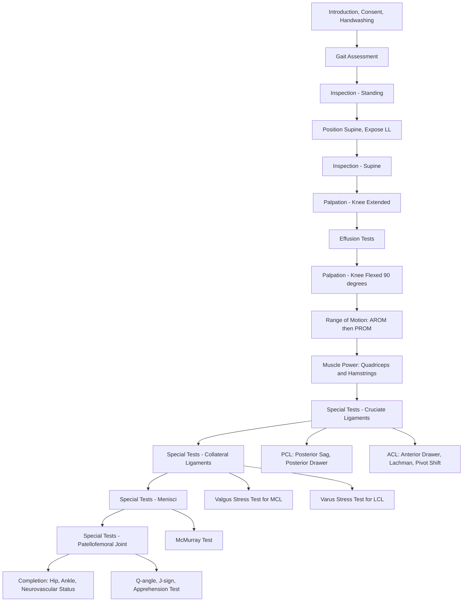

# Examination of the Knee

## Master Examination Flowchart

---

## General Approach — The 3Cs + 1H

Before you lay a finger on anyone, get through the formalities. This is easy marks on an OSCE and examiners will dock you if you skip them.

1. **Confirm identity**: "Hello, my name is Dr ___. Could you please confirm your name and date of birth?"  
   「你好，我係___醫生。可唔可以同我確認你嘅名同出生日期？」

2. **Consent**: "I would like to examine your knee today. This will involve looking at, feeling, and moving your knee. Some tests might cause mild discomfort — please let me know if anything is painful and I will stop. Is that alright?"  
   「我今日想檢查你嘅膝頭，會睇、摸同郁動你嘅膝頭。有啲測試可能會有少少唔舒服，如果痛就同我講，我會即刻停。你介唔介意？」

3. **Chaperone**: Offer one, especially if the patient needs to undress.

4. **Handwashing**: "Before I begin, I would like to wash my hands."  
   「喺開始之前，我會先洗手。」

**Positioning and Exposure**: The patient should be in **underwear only with the full lower limbs exposed up to the proximal thigh** [1][2]. Start with the patient **standing** for gait and alignment assessment, then move to **supine** for the bulk of the examination. Shoes should be off [1].

<Callout title="Golden Rule from Lecture Slides" type="error">
***Examine the normal side before the abnormal side. Examine active ROM before passive ROM. Always observe the patient's facial expression when anticipating pain or discomfort.*** [1]
</Callout>

---

## General Inspection

### Around the Bedside
Before touching the patient, pause and observe for **1–2 seconds**. Look for:

- **Walking aids**: crutches, walking stick, wheelchair (suggests significant functional impairment)
- **Braces or supports**: knee brace, elastic bandage (points to ligamentous instability or recent injury)
- **Medications**: analgesics on the bedside table
- **Body habitus**: obesity is a major risk factor for knee OA; young athletic build suggests sports injury
- **Facial expression**: grimacing, guarding behaviour — the patient is in pain

**Model commentary**: *"On initial inspection, I note the patient appears comfortable at rest. There is a walking stick at the bedside. I can see both lower limbs are exposed."*

---

## Gait Assessment

Ask the patient to walk a short distance, ideally without walking aids [1][2].

**Instruction**: "Could you please walk to the end of the room and back for me?"  
「可唔可以行去房嘅盡頭再行返嚟？」

| Gait Pattern | Description | What It Suggests | Pathophysiology |
|---|---|---|---|
| ***Antalgic gait*** | Shortened stance phase on the affected side | Painful knee (OA, meniscal tear, acute injury) | Patient offloads the painful limb as quickly as possible [1][2] |
| ***Quadriceps avoidance gait*** | Avoids full knee extension during stance phase | **ACL deficiency** | Full extension without ACL allows anterior tibial subluxation → patient avoids this by flexing [1] |
| ***Varus thrust (lateral thrust)*** | Knee thrusts laterally during stance | Advanced OA (medial compartment) or LCL laxity | Loss of medial compartment → dynamic varus during weight-bearing [2][3] |
| Stiff knee gait | Pelvis rises ipsilaterally during swing to increase clearance | Severe OA with fixed flexion deformity | Cannot flex or extend knee → uses pelvic hike to clear the ground [2] |
| Short limb gait | Regular, even dip on the short side ± lumbar scoliosis | Limb length discrepancy (post-fracture, severe OA) | Compensatory pelvic tilt or contralateral knee flexion [2] |

**Model commentary**: *"The patient walks with an antalgic gait, favouring the right lower limb. There is no obvious varus thrust. I note a mild limp but no assistive device is required."*

---

## Inspection — Standing Position

With the patient standing, heels together, toes pointing forward, and patellae facing forward [1]:

### Alignment / Deformity
- ***Normal alignment***: **5–10° of valgus** (slightly more in females: **5° males, 7° females**) [2][3]
- ***Genu varum***: "bow-legged" — convexity laterally → **medial compartment OA** (the most common pattern) [1][2]
- ***Genu valgum***: "knock-kneed" — convexity medially → think **RA knee** or lateral compartment OA [2]
- ***Genu recurvatum***: hyperextension deformity → ligamentous laxity, post-PCL injury, neuromuscular

**Why this matters**: The alignment tells you which compartment is affected and guides surgical planning (e.g. high tibial osteotomy for varus malalignment, total knee arthroplasty for multicompartmental disease).

### Swelling
- **Obliteration of the normal parapatellar hollows** → suggests effusion [1]
- **Bulging of the suprapatellar pouch** → moderate-to-large effusion [1]
- Compare both sides for asymmetry

### Quadriceps Wasting
- ***Quadriceps wasting*** occurs in virtually all chronic knee pathologies [2]
- Visually compare both thighs; offer to measure thigh circumference at a fixed point (e.g. 15 cm above the superior pole of the patella)
- **Pathophysiology**: Arthrogenic muscle inhibition — joint effusion and pain cause reflex inhibition of the quadriceps via articular mechanoreceptors

### Scars
- ***Arthroscopic portal scars***: small, anteromedial and anterolateral — in the triangle formed by patellar tendon, tibial plateau, and femoral condyle [2]
- ***Open meniscectomy scars***: transverse/oblique over anteromedial (medial) or anterolateral (lateral) aspect [2]
- ***Total knee arthroplasty scar***: midline longitudinal incision [2]

### Other Inspection Points [1]
- **Wounds and bruises**: suggests acute trauma
- **Erythema**: infection (septic arthritis), crystal arthropathy, inflammatory arthritis
- **Skin changes**: psoriatic plaques (psoriatic arthritis), tophaceous deposits (gout)

**Model commentary**: *"On standing inspection, I note a mild varus deformity of the right knee. There is visible quadriceps wasting on the right side compared to the left. I can see a midline longitudinal scar over the right knee consistent with a previous total knee arthroplasty. There is no erythema, bruising, or obvious swelling."*

---

## Inspection — Supine Position

Ask the patient to lie supine on the examination couch.  
「而家請你瞓低喺張床度。」

- Re-confirm deformity: look for **fixed flexion deformity** — a gap under the knee when lying flat
- Compare both knees side-by-side for asymmetry in contour, swelling, muscle bulk
- Look at the popliteal fossa (may need to flex the knee) for swelling suggesting **Baker's cyst**

---

## Palpation — Knee Extended

Always ask: "Please let me know if anything I do causes you pain."  
「如果有任何唔舒服就同我講。」

### Temperature
- Use the **dorsum of your hand** (some sources say palm is more sensitive [2]) to compare temperature bilaterally
- Move from mid-thigh → knee → mid-shin on both sides
- **Increased warmth** → active inflammation (septic arthritis, crystal arthropathy, RA flare, acute injury)
- **Pathophysiology**: Inflammatory mediators cause local vasodilation → increased skin temperature

**Model commentary**: *"I am now feeling for temperature over both knees using the back of my hand. The right knee feels slightly warmer than the left."*

### Effusion Tests

These are performed **with the knee in full extension** — do them before flexing the knee for palpation [2].

#### 1. Fluid Shift Test (Sweep/Wipe/Stroke Test) — for ***small effusions***

- **Technique**: With the knee extended and relaxed, use your hand to firmly sweep fluid from the **medial parapatellar gutter upwards** into the suprapatellar pouch. Then stroke down the **lateral side** of the knee. Watch the medial gutter for a fluid wave/bulge reappearing [1].
- **Positive**: A visible bulge or fluid shift reappears on the medial side
- **Pathophysiology**: Small amounts of fluid (5–15 mL) can be shifted from one compartment to another; the bulge represents fluid travelling through the communicating suprapatellar pouch
- **Normal**: No visible fluid wave

**Model commentary**: *"I am now performing the fluid shift test. I will sweep the medial gutter upwards, then stroke down the lateral side and observe the medial gutter for any fluid bulge."*

#### 2. Patellar Tap (Ballottement) Test — for ***moderate effusions*** [1][2]

- **Technique**: 
  - Left hand empties the suprapatellar pouch by sliding distally from above the patella
  - Maintain pressure with the left hand
  - Use two fingers of the right hand to push the patella sharply downward onto the femoral trochlea
- **Positive**: A distinct **"tap"** is felt as the patella strikes the trochlea through the fluid, then the patella bounces back up when you release
- **Normal**: The patella is already resting on the trochlea; no tap felt
- **Pathophysiology**: Moderate effusion lifts the patella off the trochlea; pushing it down causes it to "tap" against bone through the fluid cushion

**Model commentary**: *"I am now performing the patellar tap test. I am emptying the suprapatellar pouch with my left hand and maintaining pressure, then tapping the patella downwards… I can feel a distinct tap, which is positive for a moderate-sized effusion."*

#### 3. Cross-Fluctuation Test — for ***large effusions*** (especially in larger knees) [2]

- **Technique**: Left hand empties the suprapatellar pouch; right hand straddles the anterior knee below the patella. Squeeze each hand alternately to detect a **fluid impulse** transmitted between the two hands
- **Positive**: Fluid impulse felt between hands
- **Pathophysiology**: Large volume of intra-articular fluid allows transmission of pressure wave

<Callout title="Swelling But No Effusion?" type="idea">
If you find swelling but no effusion on testing, think ***synovitis*** — the boggy, soft swelling either side of the quadriceps tendon is thickened synovium rather than free fluid [2].
</Callout>

### Synovial Thickening
- Feel for **soft, boggy swelling** either side of the quadriceps tendon [2]
- This is distinct from fluid (non-fluctuant, doughy texture)
- Suggests RA, chronic inflammatory arthritis, or villonodular synovitis

---

## Palpation — Knee Flexed to 90°

Flex the knee to 90° (foot flat on the couch). Palpate systematically using **one thumb** [1][2]:

| Structure | Method | Abnormal Finding | Significance |
|---|---|---|---|
| ***Tibiofemoral joint lines*** | Palpate medially then laterally, anterior → posterior | **Joint line tenderness** | Meniscal tear (medial > lateral), OA, chondral injury [1] |
| ***Patellofemoral joint lines*** | Palpate medially then laterally, superior → inferior | Tenderness | Patellofemoral OA, chondromalacia patellae |
| ***Anterior structures*** | Patella → patellar tendon → tibial tuberosity | Tenderness over patellar tendon | Patellar tendinopathy; tibial tuberosity tenderness → Osgood-Schlatter |
| MCL | Palpate along the medial femoral condyle to proximal tibia | Localized tenderness along MCL | MCL sprain/tear [1] |
| LCL | Palpate from lateral femoral epicondyle to fibular head | Localized tenderness along LCL | LCL sprain/tear [1] |
| ***Popliteal fossa*** | Patient prone or knee slightly flexed; palpate posteriorly | Palpable cystic mass | **Popliteal (Baker's) cyst** — common in knee arthritis [2] |

**Model commentary**: *"I am now flexing the knee to 90 degrees and palpating the medial joint line with my thumb… there is tenderness along the medial joint line. Now moving to the lateral joint line… no tenderness. Palpating the patella, patellar tendon, and tibial tuberosity — all non-tender. Palpating the popliteal fossa — no palpable mass."*

---

## Range of Motion

***Always test AROM before PROM*** [1][2]. Feel for **crepitus** by placing your hand over the patella during movement [2].

### Extension
- **Instruction**: "Please press the back of your knee into the bed."「請將膝頭背面壓落張床度。」
  - Look for ***fixed flexion deformity (FFD)***: inability to achieve 0° extension passively → record as "lacks X° of extension" [1][2]
- Then: "Now please lift your leg straight up into the air, keeping your knee locked."「而家請你伸直隻腳舉起嚟。」
  - Look for ***extension lag***: loss of active extension that is passively correctable → indicates **quadriceps weakness** [1][2]
  - ***Extension lag of 5–10°***: related to quadriceps weakness
  - ***Extension lag > 30°***: must rule out **extensor mechanism rupture** (e.g. patellar tendon or quadriceps tendon rupture) [1]
- **Normal extension**: 0° (or up to 3–5° of hyperextension) [1]
- **Pathophysiology of FFD**: In OA, osteophytes, capsular contracture, and hamstring spasm prevent full extension; in inflammatory arthritis, joint destruction and fibrosis contribute

### Flexion
- **Instruction**: "Now please bend your knee and try to bring your heel to your buttock."「而家請你屈膝，試下將腳踭掂到pat pat。」
- **Normal flexion**: ~135–150° [1][2]
- Then test PROM for both extension and flexion, noting any difference (which is the definition of an extension lag)

### Quadriceps Power
- Test isometric quadriceps contraction against resistance in sitting or supine
- ***Commonly Grade 4 (MRC) in OA knee*** [2] — movement against gravity + against some resistance but overcome by examiner
- Also test hamstring power

**Model commentary**: *"Active extension shows a 10-degree fixed flexion deformity on the right — I cannot passively correct this fully. There is a 5-degree extension lag, suggesting some quadriceps weakness. Active flexion reaches 110 degrees on the right compared to 140 degrees on the left. I can feel crepitus over the patellofemoral joint during movement."*

### Reporting Convention for ROM [1]
Report as: **passive extension – active extension – active flexion – passive flexion**  
e.g. "0 – 0 – 135 – 140" for a normal knee  
e.g. "10 (FFD) – 20 – 100 – 110" for an OA knee with 10° FFD and extension lag

---

## Special Tests

### Cruciate Ligament Tests

<Callout title="Key Order" type="error">
***Always test the PCL FIRST*** because an unrecognised PCL injury causes a false-positive anterior drawer test (the tibia starts posteriorly subluxed and the "anterior draw" merely reduces it to neutral) [2]. Also test the **normal side first** to rule out generalised ligamentous laxity (especially in women) [2].
</Callout>

#### 1. Posterior Sag Sign (Posterior Sagging) — PCL

- **Technique**: Flex both hips and knees to 90° with feet flat on the couch. Look from the side at the profile of the tibial tuberosity relative to the patella [1][2]
- **Normal**: Tibial tuberosity should be **anterior** to the level of the patella
- **Positive**: Tibial tuberosity is **level with or posterior to** the patella — the tibia sags posteriorly under gravity
- **Pathophysiology**: Without a competent PCL, gravity pulls the tibia posteriorly
- **Why test this first**: If positive, you must reduce the tibia before doing the anterior drawer

**Model commentary**: *"I am now positioning both knees at 90 degrees to look for posterior sag. Looking from the side, the tibial tuberosity on the right appears level with the femoral condyle, suggesting a positive posterior sag sign — this raises suspicion for a PCL injury."*

#### 2. Posterior Drawer Test — PCL [1][2]

- **Technique**: Knee at 90° flexion, foot flat on couch. Sit on the patient's foot to stabilise. Grasp the proximal tibia with both hands and apply a **strong posterior push** 
  - *The body should move slightly if you are applying enough force — otherwise the test is falsely negative* [2]
- **Positive**: Posterior translation of the proximal tibia compared to the normal side
- **Grading** [1]:
  - Grade I: increased posterior translation but anterior tibial border remains anterior to femoral condyle
  - Grade II: anterior tibial border level with femoral condyle
  - Grade III: anterior tibial border posterior to femoral condyle

#### 3. Anterior Drawer Test — ACL [1][2]

- **Technique**: Identical setup to posterior drawer. Sit on the patient's foot. Grasp the proximal tibia and **pull anteriorly**
- **Check hamstring relaxation** — contracted hamstrings resist anterior translation and cause false negatives [1]
- **Positive**: Excessive anterior translation compared to the normal side
- **Grading** [2]:
  - 1 = 3–5 mm translation
  - 2 = 5–10 mm
  - 3 = > 10 mm
  - A = firm endpoint; B = soft endpoint

#### 4. ***Lachman Test — ACL (Most Sensitive)*** [1][2]

- **Technique**: 
  - Flex the knee to **20–30°** [1]
  - Left hand stabilises the **distal femur**
  - Right hand grasps the **proximal tibia** (thumb on anteromedial joint line) and applies an **anterior pulling force**
- **Positive**: ***Excessive anterior translation*** of the tibia compared to the normal side; soft or absent endpoint
- **Sensitivity**: ~85–95% — the **most sensitive clinical test for ACL injury** [2]
- **Why more sensitive than anterior drawer**: At 20–30° flexion, the hamstrings are relaxed and the secondary restraints (menisci, collateral ligaments) contribute less, isolating the ACL better. At 90° (anterior drawer), the menisci and capsule provide more secondary restraint, masking partial ACL tears.

**Model commentary**: *"I am now performing the Lachman test on the right knee. With the knee in 20 degrees of flexion, I am stabilising the femur with my left hand and pulling the tibia anteriorly with my right hand… I feel excessive anterior translation with a soft endpoint compared to the left side. The Lachman test is positive, suggesting an ACL injury."*

#### 5. Pivot Shift Test — ACL (Anterolateral Rotational Instability) [1][2]

- **Technique**:
  - Start in **full knee extension**
  - Right hand at ankle/foot holds the leg in **internal rotation**
  - Left hand at lateral knee applies a **valgus stress**
  - Slowly **flex the knee** from extension to ~30–40°
- **Positive**: A sudden **"clunk"** or "jump" as the laterally subluxed tibial plateau **reduces** at ~30° of flexion (due to the iliotibial band transitioning from an extensor to a flexor of the knee)
- **Grading** [1]:
  - Grade I: gliding movement
  - Grade II: obvious clunk
  - Grade III: locked subluxation
- **Pathophysiology**: In ACL deficiency, the lateral tibial plateau subluxes anteriorly in extension (under the influence of the IT band acting as a knee extensor). As the knee is flexed past ~30°, the IT band becomes a flexor and suddenly pulls the tibia posteriorly → the clunk of reduction
- **Note**: Often difficult to elicit in an awake patient due to guarding; more reliable under anaesthesia

---

### Collateral Ligament Tests

#### ***Valgus Stress Test — MCL*** [1][2]

- **Technique**: 
  - Tuck the patient's foot under your right arm (or hold ankle in axilla)
  - Apply a **valgus (medially-directed) stress** at the knee
  - Test at **0° extension** (posterior capsule + MCL + PCL all contribute)
  - Then at **30° flexion** (***isolates the MCL*** because the posterior capsule relaxes) [1][2]
  - Compare to the normal side
- **Positive**: Excessive medial joint space opening ("gapping") compared to normal side
- **Grading** [2]:
  - Grade I: tenderness only, no laxity
  - Grade II: mild increased laxity with a firm endpoint
  - Grade III: no endpoint (complete tear)
- **Pathophysiology**: MCL is the primary static stabiliser against valgus stress. At 30° flexion, the capsule is lax, so gapping indicates isolated MCL injury.

**Instruction**: "I'm going to push on your knee — try to relax your leg."「我而家會推下你隻膝頭，放鬆隻腳。」

#### ***Varus Stress Test — LCL*** [1][2]

- **Technique**: Same as above but apply **varus (laterally-directed) stress**
- Test at 0° and 30° flexion (30° isolates the LCL)
- **Positive**: Excessive lateral joint space opening
- **Pathophysiology**: LCL prevents varus angulation; at 30° flexion it is the primary restraint

---

### Meniscal Tests

#### ***McMurray Test*** [1][2]

- **Technique**:
  - Start with the knee in **full flexion** (opposite starting position to pivot shift) [2]
  - Left hand over the knee to apply valgus/varus stress AND palpate the joint line
  - Right hand over the foot/ankle to apply internal/external rotation
  - ***Medial meniscus***: Apply **external rotation + valgus stress** → slowly extend the knee [1][2]
  - ***Lateral meniscus***: Apply **internal rotation + varus stress** → slowly extend the knee [1][2]
- **Positive**: Patient reports **pain**, or examiner feels a **click/clunk** at the joint line during the maneuver
- **Pathophysiology**: The rotational and compressive forces "trap" a torn meniscal fragment between the femoral condyle and tibial plateau; the click is the fragment being caught and released
- **Limitations** [1]:
  - ***Nearly always positive in acute knee injury regardless of meniscal tear***
  - ***Sensitivity is low in chronic meniscal tears***

<Callout title="McMurray Test Direction Mnemonic" type="idea">
**M**edial meniscus = **E**xternal rotation + valgus (think: the forces push the medial meniscus toward the center, trapping a tear). **L**ateral meniscus = **I**nternal rotation + varus.
</Callout>

**Model commentary**: *"I am now performing the McMurray test. Starting in full flexion, I am applying external rotation and valgus stress to test the medial meniscus while slowly extending the knee… the patient reports pain at the medial joint line and I feel a click at approximately 60 degrees of flexion. McMurray test is positive for a medial meniscal tear."*

---

### Patellofemoral Joint Tests

#### ***Q-Angle*** [1]

- **Technique**: Measure the angle between:
  - Line from ASIS to centre of patella
  - Line from centre of patella to tibial tuberosity
- **Normal**: Males 14 ± 3°; Females 17 ± 3° [1]
- **Increased Q-angle** → increased risk of **patellar instability/maltracking**
- Causes of increased Q-angle: genu valgum, increased femoral anteversion, increased external tibial torsion, laterally positioned tibial tuberosity [1]

#### ***J-Sign*** [1]

- **Technique**: Patient sits with knee at 90°. Ask them to **actively extend the knee** to full extension. Observe the patellar tracking.
- **Positive**: The patella makes a sudden ***lateral deviation*** at terminal extension (the tracking path looks like an inverted "J")
- **Significance**: Indicates significant patellar maltracking and underlying **trochlear dysplasia** [1]

#### ***Apprehension Test*** [1]

- **Technique**: Patient supine, knee at **20–30° flexion**. Apply a **lateral pushing force** on the medial border of the patella to sublux it laterally. Watch the patient's face.
- **Positive**: Patient shows ***apprehension*** (pain, fear of pending dislocation), tries to stop the examiner, or grabs your hand
- **Significance**: Indicates **patellofemoral instability** — history of patellar dislocation/subluxation
- **Pathophysiology**: A lax or torn medial patellofemoral ligament (MPFL) allows lateral patellar subluxation; the patient anticipates the dislocation

---

## Completing the Examination

Always state these to the examiner [2]:

- **"I would like to examine the hip and ankle to rule out referred pain"** — hip pathology (e.g. OA hip, slipped capital femoral epiphysis in adolescents) commonly refers pain to the knee via the obturator nerve [2]
- **"I would like to assess the neurovascular status of the lower limb"** — always check **dorsalis pedis and posterior tibial pulses**, sensation, and motor function distally [2]
  - *This is essential because if neurovascular status is not assessed before total knee arthroplasty, a missed vascular injury is equivalent to amputation* [2]
- Examine the **contralateral limb** for comparison
- **Offer to examine the lumbar spine** if the presentation suggests referred pain

---

## Expected Findings by Condition

### Osteoarthritis of the Knee (Most Common OSCE Case)

**Positive findings**:
- ***Genu varum*** deformity (medial compartment OA) [1][2]
- ***Quadriceps wasting*** [2]
- Moderate effusion (positive patellar tap)
- Joint line tenderness (medial > lateral)
- **Crepitus** on movement (patellofemoral and/or tibiofemoral)
- ***Fixed flexion deformity*** [2]
- Reduced ROM (especially loss of terminal extension and full flexion)
- **Quadriceps power Grade 4** [2]
- Possible ***antalgic gait or varus thrust*** [2]
- Possible TKA scar if post-surgical

**Important negatives to document**:
- No warmth or erythema (suggests non-inflammatory / mechanical process)
- Ligaments stable (varus/valgus stress tests negative)
- McMurray negative (no acute meniscal pathology)
- Neurovascular status intact distally
- No signs of infection

### ACL Injury

**Positive**: Positive Lachman, positive anterior drawer (with soft endpoint), possible positive pivot shift, effusion (haemarthrosis acutely), quadriceps avoidance gait  
**Negative**: PCL tests negative, collateral ligaments stable (unless combined injury)

### Meniscal Tear

**Positive**: Joint line tenderness, positive McMurray, possible effusion, possible locking or giving way history  
**Negative**: Ligaments stable (unless combined injury)

---

## Red-Flag Examination Findings and Escalation Triggers

| Finding | Concern | Action |
|---|---|---|
| **Hot, red, swollen joint with fever** | ***Septic arthritis*** — orthopaedic emergency | Urgent aspiration, bloods, IV antibiotics |
| **Locked knee** (unable to extend) | **Bucket-handle meniscal tear** or loose body | Urgent orthopaedic referral |
| **Absent distal pulses** after trauma/dislocation | **Popliteal artery injury** | Emergency vascular assessment, CT angiography |
| **Foot drop** after knee dislocation/lateral injury | **Common peroneal nerve injury** | Urgent nerve assessment |
| **Massive tense effusion with excruciating pain** | **Haemarthrosis** (ACL rupture, fracture, tumour) | Aspiration, imaging |
| **Extension lag > 30°** | **Extensor mechanism rupture** (quad tendon, patella fracture, patellar tendon) | Urgent surgical referral [1] |

---

## Common OSCE Pitfalls

<Callout title="Common Mistakes" type="error">

1. **Forgetting to test the PCL first** before the ACL tests — the posterior drawer is often forgotten, leading to a false-positive anterior drawer [2]
2. **Not testing the normal side first** — you lose your baseline comparison and cannot identify generalised laxity [1][2]
3. **Testing passive ROM before active ROM** — this causes unnecessary pain and the examiner will notice [1]
4. **Forgetting to offer hip and ankle examination** — referred pain from the hip is a classic missed diagnosis, especially in adolescents (SCFE) and the elderly (OA hip) [2]
5. **Not checking neurovascular status** — mandatory before and after any knee intervention [2]
6. **Omitting effusion tests** — these are high-yield and easily forgotten when you rush to palpation
7. **Not sitting on the patient's foot during drawer tests** — the tibia is not stabilised and the test is unreliable [2]
8. **Applying insufficient force during posterior drawer** — *"the body should move a bit or else it will be falsely negative"* [2]
9. **Confusing the McMurray directions** — remember: medial meniscus = ER + valgus; lateral meniscus = IR + varus [2]
10. **Not documenting crepitus location** — use your thumb to localise it to the patellofemoral vs tibiofemoral compartment [2]

</Callout>

---

## High-Yield Exam-Focused Interpretation Tips

- **Lachman is the most sensitive test for ACL injury** — if the examiner asks "which single test would you perform?", this is the answer [2]
- **Pivot shift is the most specific for functional ACL instability** and correlates with functional disability but is hard to elicit in the awake patient
- **Valgus at 0° vs 30°**: Opening only at 30° = isolated MCL injury. Opening at 0° = MCL + posterior capsule/cruciate damage (more severe) [2]
- **If effusion is present but tests negative for fluid, think synovitis** [2]
- **Extension lag**: a subtle but crucial finding — easily missed, signifies quadriceps dysfunction which is a major determinant of functional outcome
- **Crepitus in OA**: Patellofemoral crepitus is extremely common and often asymptomatic; tibiofemoral crepitus is more clinically significant
- **Baker's cyst**: Common in knee arthritis. A ruptured Baker's cyst mimics DVT (pseudo-thrombophlebitis syndrome) — this is a classic OSCE viva question

---

## Model Reporting Script

> *"On examination, Mrs Chan is a 65-year-old lady who appears comfortable at rest. There is a walking stick at the bedside.*
>
> *On gait assessment, she walks with an antalgic gait, favouring her right lower limb. There is a mild varus thrust on the right during the stance phase.*
>
> *On inspection in the standing position, there is a varus deformity of the right knee. There is visible quadriceps wasting on the right compared to the left. I note a midline longitudinal scar over the anterior right knee.*
>
> *On palpation, the right knee is slightly warmer than the left. The patellar tap test is positive, indicating a moderate-sized effusion. There is tenderness along the medial joint line. The popliteal fossa is non-tender with no palpable mass.*
>
> *Range of motion on the right: there is a 15-degree fixed flexion deformity that is not passively correctable. Active flexion reaches 100 degrees compared to 140 on the left. There is a 5-degree extension lag. I can feel crepitus over both the patellofemoral and tibiofemoral compartments. Quadriceps power is Grade 4 on the right.*
>
> *Special tests: valgus and varus stress tests are stable at both 0 and 30 degrees. PCL tests are negative — no posterior sag and negative posterior drawer. Anterior drawer and Lachman tests are negative. McMurray test is negative bilaterally.*
>
> *Neurovascular examination distally is intact with palpable dorsalis pedis and posterior tibial pulses, normal sensation, and no motor deficit.*
>
> *In summary, the findings are consistent with right knee osteoarthritis, predominantly affecting the medial compartment, with moderate effusion, a fixed flexion deformity, and functional quadriceps weakness. There are no signs of ligamentous instability or meniscal injury."*

---

<Callout title="High Yield Summary">

**Knee examination sequence**: Gait → Inspect (standing) → Palpation (supine, extended) → Effusion tests → Palpation (flexed 90°) → ROM (AROM then PROM) → Muscle power → Special tests (PCL first, then ACL, collaterals, menisci, PFJ) → Complete (hip, ankle, neurovascular).

**Must-know special tests**:
- ***Lachman*** = most sensitive for ACL (20–30° flexion, anterior pull)
- ***Pivot shift*** = most specific for ACL functional instability (extension → flexion with IR + valgus)
- ***McMurray*** = meniscal tears (medial = ER + valgus; lateral = IR + varus)
- ***Valgus/varus stress at 0° and 30°*** = collateral ligaments (30° isolates the ligament)
- ***Posterior sag + posterior drawer*** = PCL (always test FIRST)
- ***Apprehension test*** = patellofemoral instability

**Always**: test normal side first, test PCL before ACL, test AROM before PROM, offer hip/ankle/neurovascular exam to complete.

</Callout>

---

<ActiveRecallQuiz
  title="Active Recall - Physical Exam"
  items={[
    {
      question: "Why should you test the PCL before the ACL in the knee examination?",
      markscheme: "An unrecognised PCL injury causes the tibia to sag posteriorly at rest. The anterior drawer test then merely reduces the tibia to neutral, giving a false-positive result for ACL injury. Testing the PCL first (posterior sag, posterior drawer) identifies this and allows you to set the correct starting point."
    },
    {
      question: "What is the most sensitive clinical test for ACL injury, and at what degree of knee flexion is it performed?",
      markscheme: "The Lachman test, performed at 20-30 degrees of knee flexion. It is more sensitive than the anterior drawer because at this angle the hamstrings are relaxed and secondary restraints contribute less, isolating the ACL."
    },
    {
      question: "In the McMurray test, which rotational and stress forces test the medial meniscus versus the lateral meniscus?",
      markscheme: "Medial meniscus: external rotation plus valgus stress. Lateral meniscus: internal rotation plus varus stress. The test starts in full flexion and the knee is slowly extended while applying these forces."
    },
    {
      question: "What is the difference between testing the collateral ligaments at 0 degrees versus 30 degrees of knee flexion?",
      markscheme: "At 0 degrees (full extension), the posterior capsule, cruciates, and collateral ligaments all contribute to stability. At 30 degrees of flexion, the posterior capsule relaxes, so gapping isolates the collateral ligament being tested. Opening at 30 degrees only suggests isolated collateral ligament injury; opening at 0 degrees suggests combined injury involving the capsule and possibly cruciates."
    },
    {
      question: "A patient with knee OA has an extension lag of 5 degrees. What does this signify and what finding would be more concerning?",
      markscheme: "A 5-degree extension lag indicates quadriceps weakness (arthrogenic muscle inhibition from chronic effusion and pain). The passive range is full but the patient cannot achieve it actively. An extension lag greater than 30 degrees is more concerning and mandates ruling out extensor mechanism disruption such as quadriceps tendon or patellar tendon rupture."
    },
    {
      question: "What is a Baker cyst, where is it found on examination, and what is a classic complication that mimics DVT?",
      markscheme: "A Baker (popliteal) cyst is a fluid-filled cyst in the popliteal fossa, common in knee arthritis, caused by posterior herniation of the joint capsule or communication with the gastrocnemius-semimembranosus bursa. On examination it is a palpable cystic mass in the popliteal fossa. A ruptured Baker cyst causes calf swelling, pain, and erythema that mimics a DVT — this is called pseudo-thrombophlebitis syndrome."
    }
  ]}
/>

## References

[1] Lecture slides: GC 230. Knee Sport Injuries_Part 1.pdf (Physical Examination and Signs sections, pp. 33–59)  
[2] Senior notes: Ryan Ho Fundamentals.pdf (Knee Joint examination, pp. 142–143)  
[3] Senior notes: Ryan Ho Rheumatology.pdf (Knee Joint examination, pp. 20–22)  
[4] Lecture slides: GC 230. Knee Sport Injuries_Part 2.pdf (ACL/LCL physical examination, pp. 29–56)
