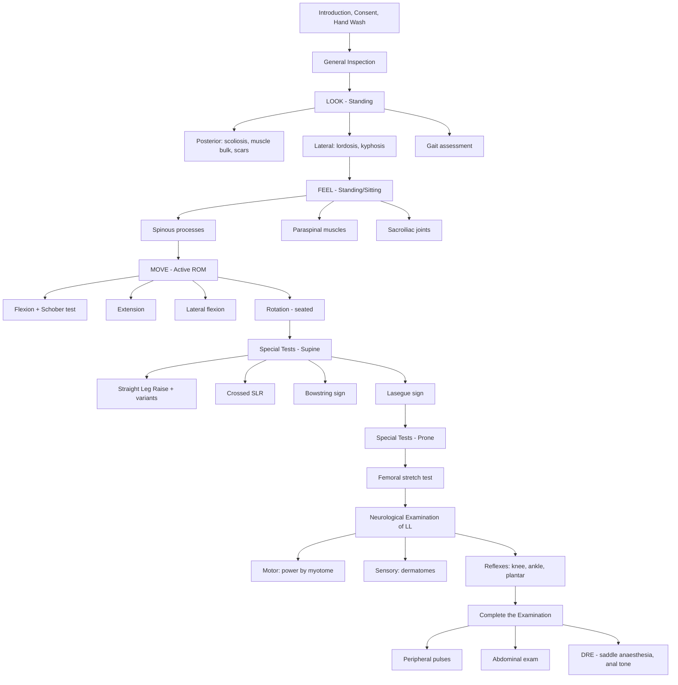

# Examination of the Lumbar Spine

## Master Examination Sequence

---

## General Approach (3Cs + 1H)

Before touching the patient, you must set the scene. This is your first mark in any OSCE and the easiest marks you'll ever get.

- **Introduce yourself**: "Good morning, my name is Dr ___, I am a medical student. May I confirm your name and date of birth?"
- **Consent**: "I would like to examine your lower back today. This will involve me looking at, touching, and moving your back. Some movements may be uncomfortable — please let me know if anything is painful and I will stop. Is that alright?" 「我想檢查你嘅腰背，會望下、㩒下同郁下你嘅腰，如果有唔舒服請話我知。」
- **Chaperone**: "Would you like a chaperone present?"
- **Hand hygiene**: "Before I begin, I would like to wash my hands." 「我先洗個手。」
- **Position & Expose**: "Could you please stand up and remove your top clothing so I can see your back? Please keep your underwear on." 「可唔可以企起身，脫咗上身衫，淨返底衫就得。」

> The patient should be **standing, clothed only in underwear** for the initial inspection [1][2].

---

## General Inspection

Before you even approach the spine, take a step back and observe from the end of the bed or from a few feet away.

**Around the bedside:**
- Walking aids (frame, crutches, wheelchair) — suggests mobility limitation
- Back brace or lumbar corset
- Medications on the bedside table (analgesics, NSAIDs, muscle relaxants)
- Urinary catheter — **critical red flag**, may indicate cauda equina compression [3]

**On the patient at first glance:**
- Body habitus (obesity increases lumbar load)
- Obvious distress or guarding
- Posture: is the patient leaning to one side? (***sciatic list***) [4][5]
- Gait pattern on walking in: antalgic gait, stooped posture

**Running commentary example:**
> *"On general inspection, the patient is standing comfortably. There is no walking aid at the bedside. I do not see a urinary catheter. The patient appears to be in no obvious distress."*

---

## LOOK (Inspection)

Inspection is performed from **three views**: posterior, lateral, and anterior. You are looking for deformity, asymmetry, and soft tissue changes [1][2].

### Posterior View

| What to look for | Normal | Abnormal | Pathophysiological basis |
|---|---|---|---|
| Spinal alignment | Midline spinous processes | Scoliosis — 'C' or 'S' shaped curve | Vertebral body disease, muscle imbalance, developmental, or compensatory to disc herniation |
| ***Sciatic list / Listing*** | Trunk centred over pelvis | ***Lateral lean TOWARDS or AWAY from the lesion*** | Depends on whether the disc prolapse is medial or lateral to the nerve root — the patient shifts away from the side that compresses the root [4][5] |
| Paravertebral muscles | Symmetrical | Unilateral spasm, wasting, or asymmetry | Reflex muscle guarding in acute disc pathology; chronic wasting from disuse |
| Skin | Normal skin | Scars (previous surgery), sinuses, hairy patch (spina bifida occulta), café-au-lait spots (neurofibromatosis) | Hairy patch/dimple over lower lumbar area suggests underlying spinal dysraphism |
| Muscle atrophy | Symmetrical gluteal and calf bulk | ***Gluteal or calf wasting*** | Denervation from chronic nerve root compression (S1 → calf; L5 → EHL/tibialis anterior) |

**How to perform:** Stand directly behind the patient. Ask them to stand with feet together, arms by their sides.

**Running commentary:**
> *"Looking from behind, the spine appears to be in the midline. I do not see any obvious scoliosis or sciatic list. The paraspinal muscles appear symmetrical with no obvious spasm. There are no scars, sinuses, or skin changes. The gluteal bulk appears symmetrical."*

### Lateral View

| What to look for | Normal | Abnormal | Pathophysiological basis |
|---|---|---|---|
| Lumbar lordosis | Gentle lordotic curve | ***Loss of lumbar lordosis*** | Paravertebral muscle spasm 'splinting' the spine in a straight position — seen in acute disc herniation and ankylosing spondylitis [1][5] |
| Thoracic kyphosis | Gentle kyphotic curve | ***Increased thoracic kyphosis*** + ***reduced lumbar lordosis*** = **'question mark' posture** | Classic finding in ankylosing spondylitis [2] |
| Hip/knee posture | Fully extended | Flexion at hips/knees | Compensatory mechanism for loss of lordosis to maintain balance |

**Running commentary:**
> *"Looking from the side, the lumbar lordosis is preserved. There is no increased thoracic kyphosis. The hips and knees are in full extension."*

### Gait Assessment

Ask the patient to walk across the room and back. 「請你行過去再行返嚟。」

| Gait pattern | What it looks like | Significance |
|---|---|---|
| ***Half-shut knife position*** | Patient leans forward with partially flexed back, short stride | Acute lumbar disc prolapse with sciatica [5] |
| Antalgic gait | Shortened stance phase on affected side | Pain avoidance |
| Foot drop / high-stepping gait | Exaggerated hip flexion, foot slapping | L4/5 nerve root compression (common peroneal nerve territory) |
| Heel walking | Unable to dorsiflex foot against gravity | L4-5 weakness |
| Toe walking | Unable to plantarflex | S1 weakness |

**Quick functional screen** — this is high-yield and tests specific myotomes [6]:
- **Walk on heels** (L4-5 dorsiflexion): 「用腳踭行。」
- **Walk on toes** (S1 plantarflexion): 「用腳尖行。」
- **Squat and stand** (L3-4 quadriceps): 「蹲低再企返起身。」

**Running commentary:**
> *"The patient walks with a normal gait pattern. They are able to walk on their heels and on their toes without difficulty, and can squat and stand, suggesting intact L4, L5, and S1 motor function."*

---

## FEEL (Palpation)

Palpation is performed with the patient **standing** (for spinous processes and paraspinal muscles) or **sitting** (for SIJ). Always **warn the patient before touching** and ask about pain throughout.

### Spinous Processes

**How:** Starting from C7 (the most prominent cervical spinous process), trace each spinous process downward using firm but gentle fingertip palpation all the way to the sacrum [1][2].

「我而家會㩒下你嘅脊骨，有痛就話我知。」

| Finding | Normal | Abnormal | Pathophysiological basis |
|---|---|---|---|
| Alignment | Midline | Step or deviation | Spondylolisthesis (step-off), scoliosis (lateral deviation) |
| Tenderness | Non-tender | Localised tenderness over specific spinous process | Fracture, infection, inflammation (discitis, osteomyelitis), metastatic disease |

### Paraspinal Muscles

**How:** Palpate the paraspinal (erector spinae) muscles bilaterally using the flat of both hands [1][2][4].

| Finding | Normal | Abnormal | Pathophysiological basis |
|---|---|---|---|
| Tone | Soft, non-tender | ***Spasm*** — involuntary contraction, 'board-like' feel | Reflex guarding to immobilise the painful segment; commonly seen in acute disc prolapse |
| Tenderness | Non-tender | Focal tenderness | Muscular strain, myofascial pain |

### Sacroiliac Joint (SIJ)

**How:** Palpate over the SIJ area (just medial and inferior to the PSIS) with the patient **sitting** to stabilise the pelvis [1][2].

「我而家會㩒你腰兩邊嘅關節，有冇痛？」

| Finding | Normal | Abnormal | Pathophysiological basis |
|---|---|---|---|
| Tenderness | Non-tender | Tenderness over SIJ | Sacroiliitis — hallmark of ankylosing spondylitis and other spondyloarthropathies |

### Percussion of the Spine

**How:** Gently tap along each spinous process with a closed fist (not a hammer — this is not a reflex test) [1][2].

| Finding | Normal | Abnormal | Pathophysiological basis |
|---|---|---|---|
| Pain on percussion | Non-tender | Localised percussion tenderness | Vertebral fracture, infection (osteomyelitis/discitis), malignancy — the jarring force transmits through diseased bone/periosteum eliciting pain |

**Running commentary:**
> *"On palpation, the spinous processes are midline and non-tender. There is no step deformity. The paraspinal muscles are soft and non-tender bilaterally with no spasm. The sacroiliac joints are non-tender. On percussion of the spine, there is no tenderness."*

---

## MOVE (Active Range of Motion)

Always test **active** movements first. If active ROM is limited, you can gently assist with passive movement. Explain each instruction clearly.

The **main movements of the lumbar spine** are: flexion, extension, lateral flexion [1][2]. Rotation is primarily a thoracic spine movement but is tested in the seated position.

### Flexion

**How:** "Please bend forward and try to touch your toes, keeping your knees straight." 「請你彎低腰，試下掂到腳趾，膝頭唔好屈。」

**Measure:**
1. **Finger-to-floor distance** — normally ≤5 cm from the floor [5]
2. ***Schober's test*** — see below (special test)

| Finding | Normal | Abnormal | Pathophysiological basis |
|---|---|---|---|
| Flexion | Smooth rhythm, fingertips near/touching floor | Reduced range, pain, loss of normal spinal rhythm | Disc pathology, muscle spasm, ankylosing spondylitis (fusion of facet joints and syndesmophytes) |

### Extension

**How:** Stand behind the patient with one hand on their pelvis for support. "Please lean back as far as you can." 「請你向後攣腰。」

- Normal: approximately 30° [5]

| Finding | Normal | Abnormal | Pathophysiological basis |
|---|---|---|---|
| Extension | ~30° without pain | ***Pain on extension*** | Facet joint arthropathy, spinal stenosis (extension narrows the canal further), spondylolisthesis |

<Callout title="Why extension matters" type="idea">
***Neurogenic claudication*** (from lumbar canal stenosis) is characteristically ***worse with extension*** (which narrows the spinal canal) and ***relieved by flexion*** (which opens the canal). This is why patients prefer the 'shopping trolley' leaning-forward posture — the 'park bench to park bench' pattern as opposed to the 'shop window to shop window' of vascular claudication [3][7].
</Callout>

### Lateral Flexion

**How:** "Please slide your hand down the outside of your leg towards your knee, without bending forward." 「請你隻手沿住大腿外面向下滑，唔好向前彎。」

- Normal: approximately 30° to each side [5]

### Rotation (Thoracolumbar)

**How:** Ask the patient to **sit down** (this fixes the pelvis and isolates spinal rotation). "Please fold your arms across your chest and turn your body to the right, then to the left." 「請你交叉雙手放喺胸前，轉身向右，再向左。」

- Normal: approximately 40° to each side [5]

**Running commentary:**
> *"On active range of movement, the patient can bend forward with a finger-to-floor distance of approximately 3 cm. Extension is to approximately 25 degrees. Lateral flexion is symmetrical at approximately 30 degrees bilaterally. Rotation is 40 degrees bilaterally. All movements are pain-free."*

---

## Special Tests

These are the bread and butter of the lumbar spine OSCE station. Each test must be performed correctly, with clear explanation of what constitutes a positive result.

### 1. ***Modified Schober Test*** — Tests lumbar spine flexion (ankylosing spondylitis screen)

**How to perform** [1][2][8]:
1. Patient stands upright
2. Locate the **midpoint between the two PSIS** (approximately at the level of S2 — the 'dimples of Venus')
3. Mark a point **5 cm below** and **10 cm above** this midpoint (total distance = 15 cm)
4. Ask the patient to bend forward maximally (keeping knees straight)
5. Measure the new distance between the two marks

**What constitutes positive:**
- Normal: distance increases by **≥5 cm** (i.e., from 15 cm to ≥20 cm)
- ***Positive (abnormal): < 5 cm excursion*** — indicates limited lumbar flexion [1][2][8]

**Pathophysiological basis:** In ankylosing spondylitis, the formation of syndesmophytes and fusion of facet joints progressively restricts spinal mobility. The Schober test specifically isolates lumbar spine motion from hip flexion.

<Callout title="Common Pitfall" type="error">
Students often forget to mark the **5 cm below** the PSIS midpoint in the *modified* Schober test, only marking 10 cm above. The modified version uses 5 cm below + 10 cm above = 15 cm baseline. The original Schober test only uses 10 cm above the midpoint. In OSCEs, always use the **modified** version unless told otherwise [2].
</Callout>

**Running commentary:**
> *"I am now performing the modified Schober test. I have marked 5 centimetres below and 10 centimetres above the midpoint of the PSIS — a total of 15 centimetres. On forward flexion, the distance increases to 21 centimetres, which is a 6-centimetre excursion. This is normal."*

### 2. ***Straight Leg Raise (SLR) Test*** — Tests L5/S1 root irritation

This is the single most important test for lumbar disc herniation with sciatica [3][5][9].

**How to perform** [5]:
1. Patient lies **supine**
2. First, **define the patient's baseline symptoms** — "Which leg is affected? What does the pain feel like and where does it go?"
3. Place one hand behind the patient's **heel** and the other hand above the **knee** (keeping the knee in full extension)
4. Slowly and passively raise the **straight leg** by flexing the hip
5. Continue until the patient reports ***reproduction of their leg symptoms*** (NOT just back pain or hamstring tightness)

「我而家會慢慢抬高你嘅腳，膝頭保持伸直。如果有任何痛或者麻痺，請即刻話我知。」

**What constitutes positive** [5]:
- ***Positive SLR: reproduction of pain or paraesthesia BELOW THE KNEE at 30-70°***
- Report: (a) the angle at which symptoms are reproduced, (b) the dermatome, (c) the nature of symptoms
- Symptoms above 70° may be due to **hamstring tightness** and are NOT a positive SLR
- Symptoms at < 30° suggest non-organic pathology or very large disc herniation

**Pathophysiological basis:** Raising the straight leg places the sciatic nerve (L4-S3) under traction. Between 30-70°, the nerve roots slide within the intervertebral foramina. If a herniated disc is compressing a root, this traction reproduces the radicular symptoms. Below 30° there is insufficient traction; above 70° the nerve is fully taut and symptoms may be from hamstrings or SIJ.

**Sensitivity/Specificity:** High sensitivity (~91%) but low specificity (~26%) for lumbar disc herniation [9].

### 3. ***Lasègue Sign*** — Confirms nerve root tension

**How to perform** [5]:
1. After a positive SLR, lower the leg by about 5°, just enough for pain to ease
2. Then **dorsiflex the ankle**

**Positive result:** Reproduction of radicular symptoms with ankle dorsiflexion

**Mechanism:** Dorsiflexion of the ankle further stretches the sciatic nerve/tibial component, confirming that symptoms are due to nerve root tension rather than hip or hamstring pathology.

### 4. ***Crossed Straight Leg Raise (Crossed SLR)*** — High specificity

**How to perform** [5]:
1. Perform SLR on the **contralateral (unaffected) leg**

**Positive result:** ***Reproduction of pain on the AFFECTED side***

**Pathophysiological basis:** Raising the opposite leg pulls the contralateral root medially across a central or large disc protrusion. This is less sensitive but **highly specific** for disc herniation (~88% specificity) [5][9].

### 5. ***Bowstring Sign*** — Confirms nerve root tension (preferred in heavy legs) [5][9]

**How to perform:**
1. Patient supine (or sitting) with hips and knees both flexed to 90°
2. Gradually extend the knee until symptoms are reproduced
3. Slightly flex the knee by ~5° (to relieve symptoms)
4. Apply firm pressure into the **popliteal fossa**

**Positive result:** ***Reproduction of radicular symptoms upon popliteal fossa pressure***

**Mechanism:** Pressing into the popliteal fossa compresses the tibial nerve (a branch of the sciatic nerve), essentially recreating the nerve tension without fully extending the knee. Particularly useful when the patient has heavy legs that are difficult to raise.

### 6. ***Femoral Stretch Test (Reverse SLR)*** — Tests L2-L4 root irritation [3][5]

**How to perform:**
1. Patient lies **prone**
2. Place one hand on the patient's **pelvis** (to feel for any compensatory movement/anterior pelvic tilt)
3. With the other hand, **passively flex the knee** as far as possible
4. Then **passively extend the hip** (lift the thigh off the bed)

「請你趴低，我會屈你隻膝頭同抬起你嘅大腿。」

**Positive result:** Reproduction of ***anterior thigh pain/paraesthesia*** (L2-4 dermatomal distribution)

**Pathophysiological basis:** This places the femoral nerve (L2-L4) on stretch. A positive test suggests upper lumbar disc herniation compressing L2, L3, or L4 nerve roots — which the SLR would miss because the SLR targets L5/S1 [3][5].

<Callout title="Don't forget the femoral stretch test!" type="error">
A common OSCE pitfall is performing only the SLR and forgetting the femoral stretch test. The SLR tests **L5/S1** roots only. If you suspect upper lumbar pathology (e.g., anterior thigh pain, weak quadriceps, reduced knee jerk), you **must** do the femoral stretch test to assess **L2-L4** [5].
</Callout>

### Summary Table of Special Tests

| Test | Root level tested | Patient position | Positive finding | Specificity |
|---|---|---|---|---|
| ***SLR*** | L5, S1 | Supine | Leg pain below knee at 30-70° | Low (~26%) |
| ***Lasègue sign*** | L5, S1 | Supine | Pain reproduced by ankle DF after lowering 5° | Moderate |
| ***Crossed SLR*** | L5, S1 | Supine | Pain on affected side from raising unaffected leg | ***High (~88%)*** |
| ***Bowstring sign*** | L5, S1 | Supine/sitting | Pain on popliteal fossa pressure | High |
| ***Femoral stretch test*** | L2, L3, L4 | Prone | Anterior thigh pain on knee flexion + hip extension | Moderate |
| ***Modified Schober*** | N/A (measures mobility) | Standing | < 5 cm excursion | N/A |

---

## Neurological Examination of the Lower Limbs

After the special tests, perform a **focused neurological examination** to identify the level of the lesion. This is not a full neuro exam — it is targeted by myotome and dermatome [3][6].

### Motor (Key Myotomes)

| Root | Muscle | Action to test | How to test |
|---|---|---|---|
| L2 | Iliopsoas | Hip flexion | Resist hip flexion in sitting position |
| L3 | Quadriceps | Knee extension | Resist knee extension |
| L4 | Tibialis anterior | Ankle dorsiflexion | "Pull your foot up towards you" 「拉高隻腳板」 |
| L5 | Extensor hallucis longus | Great toe extension | "Lift your big toe up against my finger" 「撐起隻大腳趾」 |
| S1 | Gastrocnemius/soleus | Ankle plantarflexion | "Push your foot down against my hand" 「踩落去」 |
| S1 | Peronei | Ankle eversion | "Push your foot outwards" |

### Sensory (Key Dermatomes)

Test **light touch** and **pinprick** in the following areas:

| Root | Dermatomal area |
|---|---|
| L2 | Anterior thigh (upper) |
| L3 | Medial knee |
| L4 | Medial malleolus / medial calf |
| L5 | Dorsum of foot / first web space |
| S1 | Lateral border of foot / sole |
| S2-S4 | ***Perianal / saddle area*** (critical for cauda equina) |

### Reflexes

| Reflex | Root | Normal | Abnormal |
|---|---|---|---|
| Knee jerk (patellar) | L3/4 | Brisk contraction | Absent/diminished = LMN at L3/4; exaggerated = UMN above |
| Ankle jerk (Achilles) | S1/2 | Brisk contraction | Absent/diminished = LMN at S1/2 |
| ***Babinski sign*** (plantar reflex) | UMN | Flexion of great toe | ***Extension of great toe = UMN lesion*** (myelopathy, not radiculopathy) |
| ***Ankle clonus*** | UMN | ≤3 beats | ***> 3 beats = sustained clonus*** — highly specific for UMN lesion [2] |

**Why reflexes matter:** In isolated lumbar disc herniation (radiculopathy), you expect **diminished** reflexes at the affected level (LMN pattern). If you find **brisk reflexes, clonus, or upgoing plantars**, this suggests **cord compression** (myelopathy) or a conus medullaris lesion — a fundamentally different and more urgent pathology [3][6].

---

## To Complete the Examination

After the focused lumbar spine exam, always state what else you would like to do [5]:

1. **Complete neurological examination of the lower limbs** — full power (MRC grading), sensation, coordination
2. **Peripheral pulses** — to exclude vascular claudication as a differential for leg pain (femoral, popliteal, dorsalis pedis, posterior tibial)
3. **Abdominal examination** — to exclude intra-abdominal pathology (AAA, renal pathology) mimicking back pain
4. ***Digital rectal examination (DRE)*** — assess **anal tone, anal reflex, and saddle anaesthesia** to exclude ***cauda equina syndrome*** [5]
5. **Examine the hip joint** — hip pathology (e.g., OA hip) commonly mimics lumbar radiculopathy

**Running commentary:**
> *"To complete my examination, I would like to perform a full neurological examination of the lower limbs, examine the peripheral pulses to exclude a vascular cause, examine the abdomen to exclude intra-abdominal pathology, and perform a digital rectal examination to check anal tone and perianal sensation to exclude cauda equina compression."*

---

## Expected Positive Findings vs. Important Negatives

### Common Positive Findings by Condition

| Condition | Expected positives |
|---|---|
| **Lumbar disc herniation (posterolateral)** | Sciatic list, loss of lordosis, paraspinal spasm, +ve SLR, +ve Lasègue, dermatomal sensory loss, weakness in specific myotome, reduced reflex |
| **Lumbar canal stenosis** | May have normal examination at rest; pain on extension; neurogenic claudication history; peripheral pulses present (vs. vascular claudication) [3][7] |
| **Ankylosing spondylitis** | Question mark posture, reduced Schober ( < 5 cm), reduced chest expansion ( < 2.5 cm), SIJ tenderness, increased occiput-to-wall distance [2][8] |
| **Cauda equina syndrome** | Bilateral leg pain, saddle anaesthesia, reduced anal tone, urinary retention, bilateral reduced ankle jerks |

### Important Negatives to Document

- **No urinary catheter** (i.e., no bladder dysfunction)
- **No saddle anaesthesia** (rules out cauda equina)
- **Normal anal tone** on DRE
- **Peripheral pulses present** (distinguishes from vascular claudication)
- **No upper motor neuron signs** (no clonus, Babinski negative — confirms radiculopathy rather than myelopathy/conus lesion)

---

## Red-Flag Examination Findings & Escalation Triggers

These demand **immediate investigation (urgent MRI)** and often **emergency surgical referral**:

| Red flag | What it suggests |
|---|---|
| ***Saddle anaesthesia*** | Cauda equina syndrome |
| ***Urinary retention / incontinence*** | Cauda equina syndrome |
| ***Loss of anal tone / absent anal reflex*** | Cauda equina syndrome |
| Bilateral neurological deficits | Central disc herniation / cauda equina |
| Progressive motor weakness | Evolving nerve root compression |
| ***Fever + spinal tenderness*** | Epidural abscess, discitis, osteomyelitis |
| Weight loss + bony tenderness | Metastatic spinal disease |
| UMN signs in lower limbs (clonus, upgoing plantars) | Cord compression (conus medullaris or higher) |

<Callout title="Cauda Equina Syndrome" type="error">
This is a **surgical emergency**. If you find saddle anaesthesia, urinary retention, or reduced anal tone — escalate immediately. The window for surgical decompression is narrow (ideally < 48 hours from onset of bladder symptoms). In an OSCE, always explicitly state: "I would perform a DRE and check for saddle anaesthesia to rule out cauda equina syndrome" [3][5].
</Callout>

---

## Distinguishing Neurogenic vs. Vascular Claudication

This is an extremely high-yield comparison that examiners love to ask about [3][7]:

| Feature | ***Neurogenic claudication*** | Vascular claudication |
|---|---|---|
| Cause | ***Lumbar spinal stenosis*** | Peripheral arterial disease |
| Pain radiation | Proximal to distal | Distal to proximal |
| ***Exacerbating factor*** | ***Walking downhill, extension*** | ***Walking uphill, exercise*** |
| ***Relieving factor*** | ***Bending over, sitting ("park bench to park bench")*** | ***Rest ("shop window to shop window")*** |
| Pedal pulses | ***Present*** | ***Absent or diminished*** |
| Skin changes | None | Trophic changes (hairless, pale, cool) |

---

## Common OSCE Pitfalls

1. **Forgetting to expose the patient properly** — the back must be fully visible; some students examine through the gown
2. **Not inspecting from the lateral view** — you will miss loss of lordosis and increased kyphosis
3. **Performing SLR incorrectly** — allowing the knee to bend, or interpreting back pain/hamstring tightness as a positive test (must be leg pain BELOW the knee between 30-70°) [5]
4. **Not defining symptoms before starting SLR** — you need to know the patient's baseline symptoms so you can recognise reproduction
5. **Forgetting the femoral stretch test** — only testing L5/S1 and ignoring L2-4
6. **Not testing gait** — heel walking, toe walking, and squat are quick, functional myotome tests that take 30 seconds
7. **Not mentioning DRE** — even if you can't perform it in the OSCE, you must **state** you would do it to screen for cauda equina
8. **Confusing Schober's with Modified Schober's** — always mark 5 cm below AND 10 cm above
9. **Not checking peripheral pulses** — missing the vascular claudication differential

---

## High-Yield Exam-Focused Interpretation Tips

- ***Posterolateral disc herniation*** compresses the nerve root **one level below** the disc (e.g., L4/5 disc compresses L5 root), because the root exits below via the foramen. ***Far lateral herniation*** compresses the root at the **same level** [3].
- If SLR is positive on BOTH sides (bilateral radiculopathy) + bladder symptoms → think **central disc herniation** with **cauda equina compression** [3]
- The ***crossed SLR*** is the most **specific** clinical test for disc herniation — if positive, be confident the disc is compressing the root [5][9]
- ***Neurogenic claudication*** (lumbar stenosis) can have a **completely normal neurological examination at rest** — the deficit only appears after walking. This is because the ischaemia to nerve roots occurs during exercise when metabolic demand exceeds the compromised blood supply within the stenotic canal [3][7]
- The spinal cord typically ends at L1/2 (conus medullaris). Below this level, only the **cauda equina** (nerve roots) exist. Therefore, lumbar disc herniations produce **LMN signs only**, unless there is a conus lesion.

---

## Model Reporting Script

> *"On examination, Mr Chan is a 45-year-old gentleman standing comfortably with a mild sciatic list to the left. Vitals are stable.*
>
> *On inspection from behind, there is a slight lateral lean of the trunk to the left with no obvious scoliosis. The paraspinal muscles appear symmetrical. From the lateral view, the lumbar lordosis is reduced. There are no scars or skin changes.*
>
> *On palpation, there is tenderness over the L4/5 spinous process with bilateral paraspinal muscle spasm, more prominent on the right. The sacroiliac joints are non-tender. Percussion over L4/5 reproduces local pain.*
>
> *On active range of movement, forward flexion is limited with a finger-to-floor distance of 20 cm. The modified Schober test shows 4 cm excursion, indicating reduced lumbar flexion. Extension is limited to approximately 15 degrees and reproduces right-sided buttock and leg pain. Lateral flexion is reduced to 20 degrees on the right.*
>
> *On special testing, the straight leg raise on the right is positive at 40 degrees, reproducing pain radiating from the right buttock down the posterior thigh to the lateral calf — the L5/S1 dermatomal distribution. The Lasègue sign is positive. The crossed SLR is negative. The bowstring sign is positive on the right. The femoral stretch test is negative bilaterally.*
>
> *Neurological examination of the lower limbs reveals MRC grade 4 power of right ankle dorsiflexion and great toe extension, with reduced pinprick sensation over the right L5 dermatome on the dorsum of the foot. The right ankle jerk is diminished. The left lower limb is neurologically intact. There are no upper motor neuron signs — the plantar responses are downgoing bilaterally and there is no clonus.*
>
> *Peripheral pulses are present and symmetrical. I would like to complete my assessment with a digital rectal examination and abdominal examination.*
>
> *In summary, the findings are consistent with a right L4/5 posterolateral disc herniation causing an L5 radiculopathy. There are no features of cauda equina syndrome."*

---

<Callout title="High Yield Summary">

**Lumbar spine exam in a nutshell:**

1. **3Cs + 1H**: Introduce, consent, chaperone, hand wash. Patient standing in underwear.
2. **LOOK**: Posterior (scoliosis, sciatic list, scars, muscle bulk), lateral (lordosis), gait (heel/toe walk, squat).
3. **FEEL**: Spinous processes (step, tenderness), paraspinal muscles (spasm), SIJ tenderness, percussion.
4. **MOVE**: Flexion (Schober test), extension, lateral flexion, rotation (seated).
5. **Special tests**: SLR + Lasègue + crossed SLR + bowstring (L5/S1); femoral stretch test (L2-4); Schober (AS).
6. **Neuro**: Myotomes (L2-S1), dermatomes, reflexes (knee L3/4, ankle S1/2), plantars, clonus.
7. **Complete**: Peripheral pulses, abdomen, DRE (saddle anaesthesia, anal tone), hip examination.
8. **Red flags**: Saddle anaesthesia, bladder/bowel dysfunction, bilateral neuro deficits, progressive weakness → **cauda equina = surgical emergency**.
9. **Key distinction**: Neurogenic claudication (park bench, better with flexion, pulses present) vs. vascular claudication (shop window, better with rest, pulses absent).

</Callout>

---

<ActiveRecallQuiz
  title="Active Recall - Physical Exam"
  items={[
    {
      question: "What angle range defines a positive straight leg raise test, and what symptoms must be reproduced?",
      markscheme: "Positive SLR is reproduction of pain or paraesthesia BELOW THE KNEE at 30-70 degrees of hip flexion. Pain above 70 degrees may be hamstring tightness. Must be radicular pain, not just back pain.",
    },
    {
      question: "What is the difference between a posterolateral and a far lateral lumbar disc herniation in terms of which nerve root is compressed?",
      markscheme: "Posterolateral herniation compresses the nerve root ONE LEVEL BELOW the disc (e.g., L4/5 disc compresses L5 root). Far lateral or large herniation compresses the nerve root at THE SAME LEVEL (e.g., L4/5 disc compresses L4 root).",
    },
    {
      question: "Describe how you would perform the Modified Schober test and what constitutes an abnormal result.",
      markscheme: "Mark 5cm below and 10cm above the midpoint between bilateral PSIS (total 15cm). Ask patient to bend forward maximally. Measure new distance. Less than 5cm excursion (i.e., distance does not reach 20cm) is abnormal, indicating limited lumbar flexion as in ankylosing spondylitis.",
    },
    {
      question: "How do you differentiate neurogenic claudication from vascular claudication on examination?",
      markscheme: "Neurogenic: pain worse on extension/walking downhill, relieved by flexion/sitting (park bench to park bench), peripheral pulses PRESENT. Vascular: pain worse on walking uphill/exercise, relieved by rest (shop window to shop window), pulses ABSENT or diminished, trophic skin changes may be present.",
    },
    {
      question: "What are the three key features of cauda equina syndrome that you must check for on examination?",
      markscheme: "1) Saddle anaesthesia (S2-S4 sensory loss in perianal region), 2) Urinary retention or incontinence (ask about bladder function, check for palpable bladder), 3) Reduced or absent anal tone on DRE. Also bilateral neurological deficits and loss of ankle reflexes.",
    },
    {
      question: "Why is the crossed straight leg raise test clinically important despite being less sensitive than the standard SLR?",
      markscheme: "The crossed SLR has high specificity (approximately 88%) for lumbar disc herniation. A positive test (raising the unaffected leg reproduces pain on the affected side) strongly suggests a disc protrusion large enough to irritate the contralateral root as it is pulled medially, making the diagnosis of disc herniation much more certain.",
    },
  ]}
/>

---

## References

[1] Senior notes: Ryan Ho Fundamentals.pdf (p145 — Examination of the Spine)
[2] Senior notes: Ryan Ho Rheumatology.pdf (p24-27 — Examination of the Spine, Ankylosing Spondylitis, Sciatica)
[3] Senior notes: Ryan Ho Neurology.pdf (p172-174 — Degenerative Changes of Spine, Lumbar Spondylosis)
[4] Lecture slides: GC 226. Lumbar Spine Pathology_Part B (2).pdf (p2 — Physical examination)
[5] Senior notes: Ryan Ho Rheumatology.pdf (p27 — Sciatica examination, SLR variants, femoral stretch test)
[6] Senior notes: Ryan Ho Neurology.pdf (p29 — Lower limb motor examination, quick tests)
[7] Senior notes: maxim.md (Neurogenic vs vascular claudication table)
[8] Senior notes: Ryan Ho Rheumatology.pdf (p60 — Physical signs of ankylosing spondylitis)
[9] Senior notes: maxim.md (Summary of special tests — lumbar spine)
