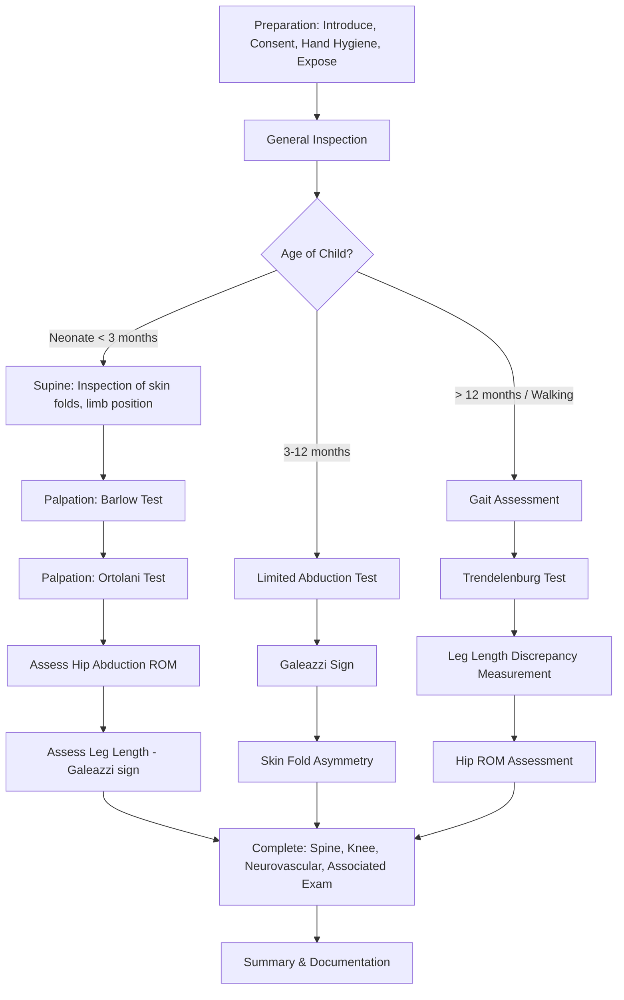

# Examination of the Pediatric Hip for Developmental Dysplasia of the Hip (DDH)

---

## Overview & Context

Developmental dysplasia of the hip (DDH) represents a **spectrum of disease from dysplasia (shallow acetabulum) → subluxation → dislocation** [1][2]. The examination varies dramatically with the child's age: neonatal screening relies on provocative tests (Barlow, Ortolani), whereas the older infant and walking child require assessment of abduction restriction, limb length discrepancy (LLD), and gait. This guide covers the full age spectrum but emphasizes the neonatal/infant examination as this is the highest-yield OSCE scenario.

---

## Master Examination Sequence

---

## General Approach (3Cs + 1H)

Before touching the child, complete the following — this is worth marks in every OSCE:

| Step | Action | Running Commentary |
|------|--------|--------------------|
| **Introduce** | Introduce yourself to the parent/carer and the child (if age-appropriate) | *"Hello, my name is Dr Chan. I am one of the doctors here today."* |
| **Consent** | Explain what you plan to do and obtain verbal consent from the parent | *"I would like to examine your baby's hips to check they are developing normally. Is that alright with you?"* 「我想檢查BB嘅髖關節，睇吓發育正唔正常，可以嗎？」 |
| **Chaperone** | Offer a chaperone (in an OSCE, state this) | *"I would normally have a chaperone present."* |
| **Hand hygiene** | State: *"I would wash my hands before and after the examination."* | Mandatory — easy mark lost if forgotten. |

<Callout title="Pediatric Examination Golden Rule" type="idea">
**Always involve the parents** and start from non-threatening areas first. Leave uncomfortable maneuvers (Barlow/Ortolani) until last. Be opportunistic — there is no strict order in pediatric examination [3]. Warm your hands before touching the baby.
</Callout>

---

## General Inspection

### Around the Bedside
- **Equipment**: Nappy/diaper in situ, any IV lines, monitoring, incubator (if neonate), Pavlik harness (suggests known DDH under treatment)
- **Growth chart**: Note if available — check centiles for weight, length

### The Child at First Glance
- **State**: Calm, settled, crying, irritable? (A crying baby tenses up, making hip examination unreliable — try to calm first)
- **Posture**: ***Frog-like posture*** may indicate hypotonia (a DDH association) [3]
- **Body habitus**: Macrosomic baby (risk factor for DDH — restricted intrauterine space)
- **Dysmorphic features**: Conditions associated with DDH (e.g., Down syndrome, Ehlers-Danlos, arthrogryposis)
- **Sex**: DDH is more common in **females** (increased ligament laxity due to circulating maternal relaxin) [1][2]

> **Running Commentary**: *"On general inspection, this is a calm female neonate lying supine in the cot. She appears well, with no obvious distress. I note no Pavlik harness or other orthopedic devices. There are no IV lines or monitoring attached."*

---

## Systematic Examination — Neonatal/Infant (< 3 months)

This is the classic OSCE scenario. The baby should be **supine on a firm, flat surface** with the **nappy removed** (expose from the waist down).

### Inspection

| What to look for | How | Normal | Abnormal | Pathophysiology |
|-----------------|-----|--------|----------|-----------------|
| **Skin fold asymmetry** | Compare thigh and gluteal skin folds bilaterally | Symmetric creases | ***Asymmetric thigh/gluteal skin folds*** — extra or deeper crease on affected side | Shortening of the femur relative to the pelvis causes soft tissue bunching. Note: asymmetric folds are common in normal neonates (low specificity), but their presence should prompt further assessment |
| **Limb position at rest** | Observe spontaneous posture | Both hips symmetrically flexed and abducted | One limb held in adduction/external rotation; apparent shortening | Dislocated femoral head sits posteriorly and superiorly |
| **Limb length** | Visual comparison | Equal length | ***Apparent limb length discrepancy (LLD)*** — one knee appears lower when hips and knees flexed (see Galeazzi sign below) | Posterior displacement of the femoral head shortens the effective femoral length |

> **Running Commentary**: *"On inspection, I note asymmetric thigh skin folds with an additional crease on the left side. The left limb appears slightly shorter at rest."*

---

### Special Tests — Neonatal

#### 1. Barlow Test (Test for Dislocatability)

- **Purpose**: Determines whether a located (in-joint) hip can be ***dislocated*** posteriorly
- **Technique** [1][2][3]:
  1. Baby supine, hips flexed to 90°, knees fully flexed
  2. Grasp the thigh with your thumb on the medial aspect (inner thigh/lesser trochanter) and your middle finger over the **greater trochanter**
  3. **Adduct** the hip gently while applying a gentle **posterior (downward) force** through the axis of the femur
  4. Feel for the femoral head **slipping posteriorly out of the acetabulum**
- **Positive finding**: A palpable ***"clunk"*** as the femoral head dislocates posteriorly over the acetabular rim
- **Normal**: No movement, hip feels stable
- **Pathophysiological basis**: A shallow or dysplastic acetabulum with lax capsular ligaments cannot constrain the femoral head when posterior force is applied. The "clunk" is the head riding over the posterior acetabular rim.
- **Mnemonic**: ***"Barlow = Bad = dislocate out (Back)"***

> **Running Commentary**: *"I am now performing the Barlow test on the left hip. I flex the hip and knee to 90 degrees, grasp the thigh with my middle finger on the greater trochanter, gently adduct the hip while applying a posterior force. I feel for a clunk indicating posterior dislocation of the femoral head. On the left side, I feel a definite clunk — this is a positive Barlow test indicating the hip is dislocatable."*

> 「而家我會檢查BB嘅髖關節，會輕輕郁佢隻腳，唔會痛㗎。」("Now I will examine the baby's hip joint, I will gently move the leg, it won't hurt.")

---

#### 2. Ortolani Test (Test for Reducibility)

- **Purpose**: Determines whether an already ***dislocated*** hip can be **reduced** back into the acetabulum
- **Technique** [1][2][3]:
  1. Same starting grip as Barlow — hip and knee flexed to 90°, middle finger on greater trochanter
  2. **Abduct** the hip gently while applying an **anterior (upward/lifting) force** through the greater trochanter
  3. Feel and listen for a palpable ***"clunk"*** as the femoral head reduces back into the acetabulum
- **Positive finding**: A palpable ***"clunk"*** of reduction — you feel the femoral head sliding anteriorly back into the acetabulum
- **Normal**: Smooth, silent abduction without any clunk
- **Pathophysiological basis**: The dislocated femoral head sits posteriorly. Abduction with anterior pressure lifts it over the acetabular rim back into the socket. The "clunk" is the head relocating.
- **Mnemonic**: ***"Ortolani = OK = reduce back in"***

> **Running Commentary**: *"I am now performing the Ortolani test. Starting with the hip flexed and adducted, I gently abduct the hip while lifting anteriorly through the greater trochanter. I feel a clunk as the femoral head reduces back into the acetabulum — this is a positive Ortolani test, confirming the hip was dislocated and is reducible."*

<Callout title="Clunk vs Click — Critical Distinction" type="error">
A **clunk** is the significant finding — it represents the femoral head moving over the acetabular rim. This is pathological. A **click** (high-pitched, no palpable movement) is usually benign and due to ligamentous/tendinous snapping. Students commonly confuse the two. ***Clicks are common and usually insignificant; clunks demand further investigation.*** [1][2]
</Callout>

---

#### 3. Galeazzi Sign (Allis Sign)

- **Purpose**: Detects limb length discrepancy due to posterior displacement of the femoral head
- **Technique**:
  1. Place baby supine with both hips and knees flexed, feet flat on the surface
  2. Look from the **foot end** of the baby: compare the **height of the knees**
- **Positive finding**: ***Unequal knee heights*** — the affected side's knee is lower
- **Normal**: Both knees at the same level
- **Pathophysiological basis**: The dislocated femoral head sits posteriorly and superiorly, effectively shortening the femur on the affected side. This corresponds to the "above trochanter" shortening pattern seen in DDH on Bryant triangle assessment [4][5].
- **Sensitivity**: Moderate — may miss bilateral DDH (both sides equally short)

> **Running Commentary**: *"With both hips and knees flexed and feet flat, I observe from the foot end. The left knee is lower than the right — this is a positive Galeazzi sign, suggesting shortening of the left femur, consistent with left hip dislocation."*

---

#### 4. Hip Abduction Assessment

- **Purpose**: Detects soft tissue contracture that develops around 3 months of age in untreated DDH
- **Technique**:
  1. Baby supine, hips flexed to 90°
  2. Gently abduct both hips simultaneously, stabilizing the pelvis
  3. Compare range of abduction bilaterally
- **Normal**: Each hip should abduct to approximately **75–80°** in a neonate
- **Abnormal**: ***Limited hip abduction < 60°***, especially if asymmetric
- **Pathophysiological basis**: In DDH, the adductor muscles and joint capsule gradually contract around the abnormal femoral head position, restricting abduction. This becomes the **dominant clinical sign after 3 months** (Barlow/Ortolani become unreliable as contracture sets in) [1][2]

> **Running Commentary**: *"I now assess hip abduction bilaterally. Both hips are flexed to 90 degrees and I gently abduct. The right hip abducts to approximately 75 degrees. The left hip is limited to approximately 45 degrees. There is significant restriction of left hip abduction."*

---

## Systematic Examination — Older Infant (3–12 months)

After approximately 3 months, the **Barlow and Ortolani tests become unreliable** because soft tissue contractures form around the dislocated hip [1]. The key findings are now:

1. ***Limited hip abduction*** — the single most important sign in this age group
2. ***Galeazzi sign*** — LLD
3. ***Asymmetric skin folds*** — low specificity but should prompt imaging
4. **Apparent limb length discrepancy** on measurement

---

## Systematic Examination — Walking Child ( > 12 months)

For children who are ambulatory, the examination framework mirrors the adult hip examination from Ryan Ho Fundamentals [4][5] but adapted for a pediatric context.

### Gait Assessment

Ask the parent to encourage the child to walk (or observe the child walking spontaneously).

| Gait pattern | Significance | Pathophysiology |
|-------------|-------------|-----------------|
| ***Trendelenburg gait*** | Hallmark of DDH in the walking child | Dislocated/subluxed hip = ineffective fulcrum for gluteus medius → ipsilateral trunk lurch and contralateral pelvic drop |
| **Waddling gait** | Bilateral DDH | Both hips affected → bilateral Trendelenburg → side-to-side waddle |
| ***Toe-walking*** on affected side | Compensating for LLD | Child plantarflexes on the short side to equalize limb lengths [1] |
| **Antalgic gait** | If hip is painful (less common in DDH itself, more suggestive of septic arthritis/Perthes) | Short stance phase on painful side |
| **Short limb gait** | Pelvic tilt with dip on short side | LLD from proximal femoral shortening [4][5] |

> 「你可唔可以行去嗰度再行返嚟？」("Can you walk over there and come back?")

> **Running Commentary**: *"On gait assessment, the child demonstrates a left-sided Trendelenburg gait with contralateral pelvic drop and ipsilateral trunk lurch. She also toe-walks on the left side."*

---

### Trendelenburg Test (Standing Child)

- **Technique** [4][5]:
  1. Child stands in front of you
  2. Ask the child to stand on the **affected leg** with the contralateral knee flexed to 90°
  3. Observe from behind **and** from the front
  4. **From behind**: Look for ***contralateral pelvic drop*** and ***ipsilateral trunk lurch***
  5. **From the front** (proper way): Kneel down, place both hands on the child's ASIS to feel for contralateral pelvic tilting; allow the child to place hands on your shoulders and feel for increased pressure on the ipsilateral side
- **Positive finding**: Contralateral pelvis drops (instead of being lifted by gluteus medius)
- **Normal (negative)**: Contralateral pelvis rises or stays level when standing on one leg
- **Pathophysiological basis**: Gluteus medius normally stabilizes the pelvis by pulling up the contralateral side. In DDH, the hip acts as an **ineffective fulcrum** (femoral head not seated in acetabulum), so gluteus medius cannot generate adequate force → pelvis drops contralaterally [4][5]
- **Positive test can be due to** [4][5]:
  - Gluteal weakness (true weakness or pain-inhibited)
  - Hip joint destructive pathologies (DDH, OA, AVN — ineffective fulcrum)

> **Running Commentary**: *"I now perform the Trendelenburg test. I ask the child to stand on the left leg. Observing from behind, I note the right pelvis drops below the level of the left ASIS, and the trunk lurches to the left. This is a positive Trendelenburg test on the left, consistent with an ineffective left hip fulcrum."*

---

### Leg Length Discrepancy Measurement (Supine)

Following Ryan Ho Fundamentals [4]:

- **Apparent LLD**: Measure from xiphisternum/umbilicus (midline point) to medial malleolus — do NOT square the pelvis
- **True LLD**: Square the pelvis, measure from ASIS to medial malleolus bilaterally
- ***Bryant triangle***: Thumb over ASIS, middle finger over greater trochanter, index finger at junction of the two perpendiculars → shortened distance (above trochanter) in DDH [4][5]

**Pathophysiological basis of LLD in DDH**: The femoral head rides superiorly and posteriorly out of the acetabulum, effectively shortening the distance from greater trochanter to ASIS (i.e., the femoral segment appears shorter because the head is displaced upward) [4][5].

---

### Hip Range of Motion (Supine)

Follow the standard hip ROM sequence [4][5]:

| Movement | Technique | Normal in child | Abnormal in DDH |
|----------|-----------|-----------------|-----------------|
| **Flexion** (Thomas' test) | Hand under lumbar lordosis, flex hip until lordosis obliterated | ~120° | May be limited; check for fixed flexion deformity |
| ***Abduction*** | Stabilize pelvis, abduct hip | ~45° (older child) | ***Limited abduction*** is the cardinal sign |
| Adduction | Stabilize pelvis | ~30° | Usually preserved |
| **IR/ER** | Hip and knee flexed to 90° | IR ~35°, ER ~45° | May be altered |
| Extension | Test prone | ~30° | Usually preserved |

---

## Palpation

- **Greater trochanter**: Palpate for position (may be displaced superiorly in DDH) and tenderness (trochanteric bursitis — more relevant in adults) [4][5]
- **Proximal femur**: Tenderness may suggest fracture
- **Telescoping test** (in infants with suspected complete dislocation):
  - With baby supine, hip flexed 90°, push and pull the femur along its long axis
  - Positive: Excessive pistoning movement — the femoral head slides up and down without constraint
  - Pathophysiology: No acetabular containment → axial force moves the head freely

---

## Completing the Examination

To complete my examination, I would like to [4][5][3]:

1. **Examine the spine**: Rule out spinal dysraphism (midline defects — dimples, tufts of hair, hemangiomas) which can cause neurogenic hip dysplasia [3]
2. **Examine the knees and feet**: Rule out referred pain and associated conditions (***talipes equinovarus is associated with DDH***) [2]
3. **Examine the contralateral hip**: DDH can be bilateral (20% of cases)
4. **Neurovascular assessment** of the lower limbs [4][5]
5. **Request imaging**:
   - **USG hip**: Birth to 4 months (femoral head is cartilaginous, not visible on XR) [1][2]
   - **XR hip**: From 4–6 months onwards (femoral head begins to ossify — can assess Shenton line, acetabular index, femoral head position) [1]

---

## Expected Findings

### Positive Findings in DDH
- **Neonate**: Positive Barlow and/or Ortolani, asymmetric skin folds, positive Galeazzi sign
- **3–12 months**: ***Limited hip abduction***, positive Galeazzi sign, asymmetric skin folds, LLD
- **Walking child**: ***Trendelenburg gait***, positive Trendelenburg test, toe-walking, LLD, limited abduction, increased lumbar lordosis (compensating for fixed flexion deformity)

### Important Negatives to Document
- No signs of septic arthritis (febrile, irritable, refuses to move hip — Kocher criteria) [2]
- No spinal abnormalities
- No neurovascular deficit
- No features of underlying syndrome (Down, Ehlers-Danlos, arthrogryposis)
- Contralateral hip normal

---

## Red-Flag Findings & Escalation Triggers

| Red Flag | Concern | Action |
|----------|---------|--------|
| Fever + refusal to move hip + irritability | **Septic arthritis** — surgical emergency | Urgent joint aspiration, blood cultures, IV antibiotics |
| Bilateral fixed dislocation in neonate | Underlying neuromuscular or syndromic cause | Detailed neurological + genetic assessment |
| Previously normal hip becoming painful/restricted | Perthes disease, SCFE, or infection | Urgent imaging |
| Hip dislocation discovered > 6 months | Delayed DDH — more complex management | Orthopaedic referral for consideration of closed/open reduction |

---

## Risk Factors to Elicit in History (Supports Examination Findings)

These are commonly asked to justify your examination findings in the viva:

- ***Female sex*** (increased ligament laxity) [1][2]
- ***Breech presentation*** [1][2]
- ***Family history*** of DDH [1][2]
- ***First-born*** (tighter uterus) [1]
- ***Oligohydramnios*** [1]

---

## Common OSCE Pitfalls

<Callout title="Common Pitfalls" type="error">

1. **Confusing Barlow and Ortolani**: Remember — **B**arlow = **B**ack out (dislocate); **O**rtolani = back **O**K (reduce)
2. **Confusing clunk with click**: Only a **clunk** (palpable movement of the femoral head) is significant. High-pitched clicks are benign.
3. **Performing Barlow/Ortolani in an infant > 3 months**: These tests become **unreliable** after soft tissue contracture forms. Focus on limited abduction instead.
4. **Forgetting to examine both hips**: DDH can be bilateral — if both are dislocated, the Galeazzi sign and skin fold asymmetry may be falsely negative.
5. **Not warming hands**: Cold hands on a baby → crying → tense muscles → unreliable examination.
6. **Not stating hand hygiene**: Easy mark lost.
7. **Forgetting to check the spine and feet**: Spinal dysraphism and clubfoot are associated with DDH.
8. **Rough handling**: Be gentle — excessive force can damage the developing hip. The Barlow test uses gentle pressure, not brute force.
9. **Not explaining which test you are doing**: Running commentary is essential — the examiner cannot assess your thought process otherwise.
</Callout>

---

## High-Yield Exam Tips

- **Why Barlow before Ortolani**: Logically, you first test whether a located hip can be dislocated (Barlow), then test whether a dislocated hip can be reduced (Ortolani). Some sources say order doesn't matter, but this sequence is more logical.
- **Bilateral DDH trap**: When both hips are equally affected, **asymmetry-based signs are negative** (symmetric skin folds, equal knee heights). Must rely on absolute abduction limitation and imaging.
- **Imaging choice**: USG < 4 months (cartilaginous head); XR > 4–6 months (ossified head) [1][2]
- **Bryant triangle** finding in DDH: Shortened distance above trochanter — this means the greater trochanter is displaced *superiorly* relative to the ASIS [4][5]
- **Trendelenburg sign physiology**: Not about gluteus medius weakness per se in DDH — it's about the hip being an **ineffective fulcrum**. The muscle is intact but has no stable pivot point [4][5].

---

## Cantonese Patient Instructions Summary

| Instruction | Cantonese | Pinyin (approx) |
|-------------|-----------|-----------------|
| "I'm going to examine the baby's hips" | 「我而家會檢查BB嘅髖關節」 | Ngo yih ga wui gim cha BB ge kwaan gwaan jit |
| "I need to take off the nappy" | 「我需要除咗片片」 | Ngo seui yiu cheui jo pin pin |
| "I will be gentle" | 「我會好輕手㗎」 | Ngo wui hou heng sau ga |
| "Can the child walk for me?" | 「佢可唔可以行幾步俾我睇吓？」 | Keui ho m ho yi haang gei bo bei ngo tai ha? |
| "Please stand on one leg" | 「請企喺一隻腳度」 | Cheng kei hai yat jek geuk dou |
| "Does this hurt?" | 「有冇痛？」 | Yau mou tung? |

---

## Model Reporting Script

> *"On examination, this is a 6-week-old female neonate who appears comfortable at rest in her mother's arms. She is appropriately grown for age. No orthopedic devices or IV lines are present.*
>
> *On inspection, I note asymmetric left thigh skin folds with an additional crease on the left side compared to the right. No obvious limb length discrepancy is visible at rest.*
>
> *On the Galeazzi test with both hips and knees flexed, the left knee sits lower than the right, suggesting left-sided femoral shortening.*
>
> *On special testing: the Barlow test is positive on the left — I feel a definite clunk as the femoral head dislocates posteriorly with gentle adduction and posterior pressure. The Ortolani test is also positive on the left — the dislocated hip reduces with a palpable clunk on abduction with anterior pressure. Both tests are negative on the right side.*
>
> *Hip abduction on the left is limited to approximately 50 degrees compared to 75 degrees on the right.*
>
> *No spinal midline defects are noted. Both feet are in normal position with no features of talipes. Neurovascular examination of both lower limbs is grossly normal.*
>
> *In summary, the findings are consistent with left-sided developmental dysplasia of the hip — specifically, a dislocatable and reducible left hip, with asymmetric skin folds, a positive Galeazzi sign, and limited left hip abduction. I would like to confirm the diagnosis with an ultrasound of both hips and refer to paediatric orthopaedics for consideration of Pavlik harness treatment. Risk factors to note include female sex and I would clarify birth presentation and family history."*

---

<Callout title="High Yield Summary">

**DDH Examination by Age:**
- **Neonate ( < 3 months)**: Barlow (dislocates) → Ortolani (reduces) → Galeazzi sign → skin fold asymmetry → hip abduction. Imaging: **USG**.
- **3–12 months**: ***Limited hip abduction*** is the cardinal sign (Barlow/Ortolani unreliable). Galeazzi sign. Imaging: **USG** (if < 4 mo) or **XR** (if > 4–6 mo).
- **Walking child ( > 12 months)**: ***Trendelenburg gait/test***, toe-walking, LLD, limited abduction, lumbar lordosis. Imaging: **XR**.

**Key Distinctions**: Clunk (pathological) ≠ click (benign). Barlow = Back out. Ortolani = OK back in.

**Risk factors**: Female, breech, first-born, FHx, oligohydramnios.

**Associations**: Talipes equinovarus, torticollis, metatarsus adductus.

**Don't forget**: Examine both hips, spine, feet, neurovascular. Bilateral DDH masks asymmetry signs.

</Callout>

---

<ActiveRecallQuiz
  title="Active Recall - Physical Exam"
  items={[
    {
      question: "What is the difference between the Barlow and Ortolani tests?",
      markscheme: "Barlow tests whether a located hip can be DISLOCATED posteriorly (adduct + posterior force). Ortolani tests whether a dislocated hip can be REDUCED (abduct + anterior force). Positive finding for both is a palpable clunk.",
    },
    {
      question: "Why do the Barlow and Ortolani tests become unreliable after approximately 3 months of age?",
      markscheme: "Soft tissue contractures form around the dislocated hip (capsule, adductor muscles), preventing the femoral head from being reduced or dislocated by manual maneuvers. Limited hip abduction becomes the key clinical sign instead.",
    },
    {
      question: "What is the pathophysiological basis of a positive Trendelenburg test in DDH?",
      markscheme: "The dislocated or subluxed hip acts as an ineffective fulcrum for the gluteus medius muscle. Although the muscle itself is intact, it cannot generate adequate force to stabilise the pelvis because the femoral head is not seated in the acetabulum. This leads to contralateral pelvic drop and ipsilateral trunk lurch.",
    },
    {
      question: "What imaging modality is used to diagnose DDH before 4 months of age, and why?",
      markscheme: "Ultrasound of the hip. The femoral head is largely cartilaginous and not yet ossified before 4-6 months, so it is not visible on plain radiograph. Ultrasound can visualise cartilaginous structures and can be used dynamically (USG-guided Barlow and Ortolani).",
    },
    {
      question: "Name three risk factors for DDH and explain their pathophysiological basis.",
      markscheme: "1) Female sex - increased ligament laxity from circulating maternal relaxin. 2) Breech presentation - mechanical forces on the hip in extension predispose to dislocation. 3) First-born - tighter uterus and abdominal wall with less room, increasing mechanical compression. Also: family history (genetic factors), oligohydramnios (reduced fetal movement space).",
    },
    {
      question: "What is the Galeazzi sign and what does it indicate?",
      markscheme: "With baby supine, hips and knees flexed, feet flat on surface - the knee on the affected side is lower than the contralateral side. It indicates limb length discrepancy due to posterior and superior displacement of the femoral head. May be falsely negative in bilateral DDH.",
    },
  ]}
/>

---

## References

[1] Senior notes: maxim.md (Section 11.1 Developmental dysplasia of hip)
[2] Senior notes: Adrian Lui Pediatrics.pdf (p27, p445, p451)
[3] Senior notes: Adrian Lui Pediatrics.pdf (p8 — Pediatric physical examination tips; p133 — 180° maneuver)
[4] Senior notes: Ryan Ho Fundamentals.pdf (p139–140 — Hip Joint Examination)
[5] Senior notes: Ryan Ho Rheumatology.pdf (p18–19 — Hip Joint Examination)
