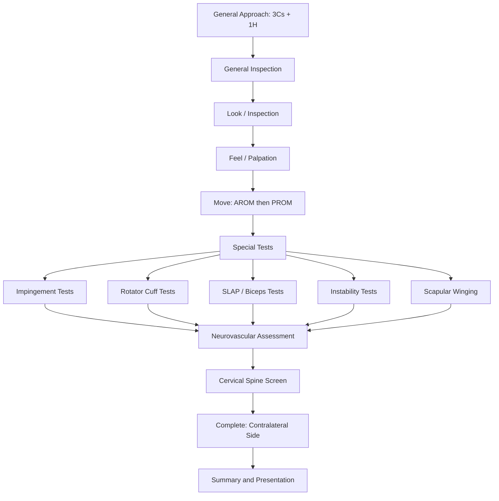

# Examination of the Shoulder

## Master Examination Flowchart

---

## 1. General Approach — The 3Cs + 1H

Every OSCE station starts here. Miss any of these and you lose easy marks before you've even touched the patient.

1. **Introduce yourself** — "Good morning, my name is Dr [X], I am one of the doctors on the orthopaedic team."
   - 「你好，我係骨科嘅醫生 [X]」
2. **Consent** — "I would like to examine your shoulder today. Is that okay?"
   - 「我想檢查你膊頭，可以嗎？」
3. **Confirm identity** — check name and date of birth on wristband.
4. **Hand hygiene** — "Before I begin, I would like to wash my hands." 「我會先洗手」

**Positioning and Exposure:**
- Patient should be **sitting on a chair or standing**, undressed from the waist up (both shoulders exposed for comparison). For female patients, offer a gown that can be opened at the back and dropped from the relevant shoulder.
  - 「可唔可以除去上衫，露出兩邊膊頭？」("Could you please take off your top and expose both shoulders?")
- Ensure adequate lighting and a private examination area.
- **Always examine the normal side first**, then the symptomatic side — this gives you a baseline and builds patient trust.

---

## 2. General Inspection (Before Touching the Patient)

Stand at the end of the bed/in front of the patient and survey the scene. This takes 10 seconds and tells you a lot.

| What to Look For | Significance |
|---|---|
| Slings, braces, arm positioning | Suggests recent injury, post-op status, or instability |
| IV lines, drains | Post-operative or inpatient context |
| Walking aids | May indicate generalized musculoskeletal disease |
| Body habitus (e.g. muscular build, obesity) | Muscular patients — think sports injuries; thin elderly — think rotator cuff degeneration |
| Facial expression / distress | Gives you a quick pain severity gauge |
| Skin: erythema, bruising, previous surgical scars | Infection, trauma, previous surgery |
| Posture: antalgic posture, guarding | Shoulder pathology often presents with arm held close to body in slight IR |

**Model commentary:**
> *"On general inspection, the patient is sitting comfortably at rest. The right arm is held in a sling. I note no IV lines or drains. There is no obvious facial distress. I will now proceed to inspect the shoulder more closely."*

---

## 3. Inspection (Look)

The mnemonic is **S-S-P**: **Skin, Shape, Position** [1][2].

### 3a. Inspect Anteriorly

| Structure | What to Look For | Abnormal Finding → Significance |
|---|---|---|
| **SCJ** (sternoclavicular joint) | Prominence | Subluxation |
| **Clavicle** | Deformity, asymmetry | Old fracture malunion |
| ***ACJ*** (acromioclavicular joint) | Step deformity, prominence | ***OA, ACJ subluxation / dislocation*** |
| **Deltoid** | ***Wasting*** | ***Shoulder disuse, axillary nerve palsy*** |
| **Pectoralis major** | Wasting | Disuse |
| Skin | Scars (arthroscopy portals are typically small and posterolateral), sinuses, erythema | Previous surgery, infection |

### 3b. Inspect Laterally
- **Anterior swelling** of the shoulder suggests infection or inflammation (effusion) of the glenohumeral joint [2].

### 3c. Inspect Posteriorly (Best Viewed from Behind)

| Structure | What to Look For | Abnormal Finding → Significance |
|---|---|---|
| **Scapula** | ***Winging*** | ***Loss of serratus anterior function (long thoracic nerve palsy)*** — exaggerated by pushing against a wall [1][2] |
| | Small and high-riding | Sprengel's shoulder, Klippel-Feil syndrome |
| ***Supra/infraspinous fossae*** | ***Muscle wasting*** | ***Rotator cuff pathology (chronic tear or suprascapular neuropathy)*** [2][3] |

### 3d. Position of the Arm
- **Arm held in ER** → think **anterior dislocation**
- **Arm held in IR** → think **posterior dislocation**
- ***Squaring of the shoulder*** (loss of normal deltoid contour) → ***glenohumeral joint dislocation*** [2]

**Pathophysiological basis:** In anterior GHJ dislocation, the humeral head sits anteroinferiorly; the deltoid drapes over the empty glenoid, creating a squared-off appearance. In posterior dislocation, the arm is internally rotated because the humeral head locks behind the glenoid rim.

**Model commentary:**
> *"On inspection, both shoulders appear symmetric with no obvious squaring. There is no scapular winging. I note mild wasting of the right supraspinous and infraspinous fossae compared to the left, suggesting possible chronic rotator cuff pathology. There are no scars, sinuses, or skin changes. The arm is held in a neutral resting position."*

---

## 4. Palpation (Feel)

**Always ask:** "Please let me know if anything is tender." 「如果有邊度痛就話我知」

Palpate systematically from **medial to lateral** (or follow the bony anatomy) [1][2].

### 4a. Temperature
- Use the dorsum of your hand to compare both shoulders.
- Warmth → inflammatory process (e.g. septic arthritis, crystal arthropathy, acute bursitis).

### 4b. Anterior Structures (Medial → Lateral)

| Structure | How to Find It | Normal vs Abnormal | Significance |
|---|---|---|---|
| **Sternum & SCJ** | Palpate at the medial end of the clavicle | Non-tender | Tenderness: SCJ dislocation, infection |
| **Clavicle** | Run fingers along its length | Smooth, non-tender | Tenderness/irregularity: fracture malunion, infection (esp TB), tumour, radionecrosis [2] |
| ***ACJ*** | Palpate at the lateral end of the clavicle, where it meets the acromion | Non-tender | ***Tenderness: recent dislocation, OA; lipping/crepitus during abduction: OA*** [2] |
| **Anterior edge of acromion** | Palpate the hard bony edge at the anterolateral shoulder | Non-tender | Tenderness: subacromial bursitis, impingement |

***Paxinos sign*** (for ACJ pathology): Approach from behind → hook contralateral thumb under posterolateral acromial margin, press anterosuperiorly + push clavicle inferiorly with index and middle fingers → **positive if pain** → indicates ***OA of ACJ*** [2].

### 4c. Subacromial Structures

**Tip:** Expose these structures by asking the patient to place their hand behind their lower back (extends the shoulder, moving the greater tuberosity anteriorly) [1][2].

| Structure | Finding | Significance |
|---|---|---|
| **Greater tuberosity** | Tenderness | ***Supraspinatus pathologies (tendinopathy, calcific tendinitis)*** |
| **Bicipital groove** | Tenderness | ***Bicipital tendinitis*** [3] |
| **Lesser tuberosity** | Tenderness (exposed by ER of arm) | Subscapularis pathology |
| **Coracoid process** (2 cm inferior and medial to clavicular tip) | May be uncomfortable even normally | Coracoid impingement (rare) |

### 4d. Glenohumeral Joint Structures

| Structure | Finding | Significance |
|---|---|---|
| **Anterior and posterior glenoid** | Diffuse tenderness | ***Acute calcific tendinitis, GHJ septic arthritis*** [2] |
| **Subacromial fossa** | Tenderness | Bursitis |
| **Head of humerus via axilla** | Bony lump | Exostoses of proximal humeral shaft [2] |

### 4e. Posterior Structures
- **Scapular spine** and **scapular angle** — less clinically significant but complete your examination [1][2].

**Model commentary:**
> *"The shoulder is warm to touch bilaterally — no increased temperature on the right. The SCJ and clavicle are non-tender. There is tenderness over the right ACJ with palpable crepitus. The greater tuberosity is mildly tender. The bicipital groove is non-tender. No tenderness over the anterior or posterior glenoid."*

---

## 5. Movement (Move)

### Key Principles [1][2]
- Can be done **standing or sitting**
- Examine **both sides** — normal side first
- Test **6 directions on 3 planes**
- **Always do AROM (active ROM) before PROM (passive ROM)** — active ROM tells you about muscle/tendon function; passive ROM tells you about the joint itself
- A key clinical distinction:
  - **Passive ROM > Active ROM** → rotator cuff pathology (muscle/tendon problem)
  - **Passive ROM = Active ROM (both reduced)** → frozen shoulder / joint pathology (capsular problem) [3]

### 5a. Apley Scratch Test (Screening)

A quick composite screen — does **not** replace formal ROM testing [1][2]:

| Movement | Instruction | Normal | Abnormal |
|---|---|---|---|
| **ER + abduction** | "Reach behind your head and touch the top of your opposite shoulder blade" 「手伸過頭後面掂對面膊頭」 | Should reach T4 spinous process | Difficulty → GHJ pathology |
| **IR + adduction** | "Reach behind your back and try to touch the bottom of your opposite shoulder blade" 「手放後面試吓掂對面膊底」 | Should reach T8 spinous process | Difficulty → rotator cuff / capsular pathology |
| **IR + adduction (cross-body)** | "Reach across your chest and touch the opposite shoulder" 「手拎去對面膊頭」 | Full cross-body reach | Difficulty → ***ACJ pathology or impingement*** |

### 5b. Formal ROM Assessment

| Movement | Normal Range | Primary Muscles | Key Observations |
|---|---|---|---|
| **Abduction** | 150–180° | Supraspinatus (initiation), Deltoid (subsequent) | See detailed notes below |
| **Adduction** | 50° | Pectoralis major, Latissimus dorsi | Cross-chest adduction test |
| **Forward flexion** | 150–180° | Anterior deltoid, Clavicular pectoralis major | Measure from the side |
| **Backward extension** | 60° | Posterior deltoid, Latissimus dorsi | Measure from the side |
| **External rotation** | 45–60° | Infraspinatus | In neutral AND in 90° abduction |
| **Internal rotation** | 45–60° | Latissimus dorsi, Pectoralis major | Record as highest vertebral level reached by thumb tip |

### Abduction — The Money Movement

Abduction is the single most information-rich movement in the shoulder exam [1][2][3]:

- **Difficulty initiating abduction** → ***major rotator cuff tear (supraspinatus)*** — because supraspinatus initiates the first 15–30° of abduction
- **Globally decreased ROM** → ***frozen shoulder (adhesive capsulitis)*** — retest by fixing the scapula angle; if pain/stiffness persists, it confirms GHJ disease
- ***Reversed scapulohumeral rhythm*** → observe **shoulder shrugging in early abduction** — this is a ***sensitive sign for glenohumeral joint pathology*** because the patient compensates for a stiff/painful GHJ by using the scapulothoracic joint early [2]
- **Painful arc:**
  - ***Mid-arc (70–120°)*** → ***impingement at the acromion*** (greater tuberosity impinges under coracoacromial arch; pain should resolve upon further elevation as the tuberosity clears the acromion) [1][2][3]
  - ***End-arc ( > 120°)*** → ***ACJ pathology or coracoacromial ligament impingement*** [2]
- ***Drop arm sign***: ask the patient to slowly lower the arm from full abduction. **Sudden dropping of the arm** → ***suggestive of a major supraspinatus tear*** — the torn muscle cannot eccentrically control the lowering phase [1][2][3]

### External and Internal Rotation — Testing Positions [1][2]

**External rotation:**
- **In neutral** (arm at side, elbow 90°, rotate forearm outward): normal ~70°
- **In 90° abduction** (arm abducted 90°, elbow 90°, rotate forearm up): normal ~100°
  - 「放鬆手臂，我幫你轉出去」("Relax your arm, I'll rotate it outward")

**Internal rotation:**
- **In neutral**: hand behind back, thumb up, reach as high as possible → record vertebral level
- **In 90° abduction** (arm abducted, elbow 90°, rotate forearm down)
- ***Limited ER in adducted arm → rotator interval pathology (frozen shoulder)*** [4]
- ***Limited ER in abducted arm → anteroinferior capsule involvement*** [4]
- ***Limited adduction and IR → posterior capsule pathology*** [4]
- ***Global stiffness → extra-articular structures involved*** [4]

**Model commentary:**
> *"On active range of motion, the patient can abduct to approximately 90 degrees on the right with a painful mid-arc between 70 and 120 degrees. There is evidence of reversed scapulohumeral rhythm with early shrugging. Passive ROM is greater than active ROM, being full at approximately 170 degrees, suggesting a muscular or tendinous problem rather than a joint problem. External rotation in neutral is approximately 50 degrees bilaterally. Internal rotation reaches T10 on the right compared to T8 on the left."*

---

## 6. Special Tests

This is where you clinch the diagnosis. Organize by category [1][2][3].

### 6a. Impingement Tests

These test for **subacromial impingement** — the rotator cuff (usually supraspinatus) and/or bursa being compressed under the coracoacromial arch during overhead movements [3].

#### Neer Impingement Sign [1][2]
- **Technique:** Stabilize the scapula with one hand. With the other hand, place the patient's arm in **internal rotation** and **passively flex** the arm overhead.
- **Positive result:** Pain at the subacromial space/acromion
- **Pathophysiology:** IR + flexion drives the ***greater tuberosity under the coracoacromial arch***, compressing an inflamed bursa/tendon
- **Performance:** ~80% sensitive, but ***not specific*** (also positive in ACJ OA, GHJ instability, SLAP lesions) [1][2]
- **Commentary:** *"I am now performing Neer's impingement sign. I am stabilizing the scapula and passively flexing the internally rotated arm. The patient reports pain at the anterolateral shoulder — this is a positive Neer's sign, consistent with subacromial impingement."*

#### Neer's Test for Impingement (Confirmatory)
- If Neer's sign is positive, repeat after injecting 10 mL 1% lignocaine into the subacromial space. **Abolishment of pain confirms impingement** [1][2].

#### Hawkins-Kennedy Test [1][2]
- **Technique:** Flex the shoulder and elbow both to **90°**. Stabilize the elbow with one hand and use the other to apply an **internal rotation** force on the forearm.
  - 「放鬆，我幫你轉一轉」
- **Positive result:** Pain at the anterolateral shoulder
- **Pathophysiology:** IR in 90° flexion pushes the supraspinatus tendon against the coracoacromial ligament
- **Performance:** ***Highly sensitive but not specific*** [1][2]

#### Painful Arc Sign [1][2]
- **Technique:** Ask the patient to slowly abduct and adduct the arm actively. Note where pain occurs.
- **Positive result:** Pain between **70–120°** (mid-arc)
- **Pathophysiology:** This is the arc where the greater tuberosity passes under the acromion
- **Performance:** ***More specific*** than Neer or Hawkins tests [1]
- **Key teaching point:** In frozen shoulder, pain persists beyond 120° and ROM is globally reduced. In impingement, pain typically resolves above 120° as the tuberosity clears the arch.

### 6b. Rotator Cuff Tests

Test each rotator cuff muscle individually. Remember **"SITS"**: Supraspinatus, Infraspinatus, Teres minor, Subscapularis [1][2][3].

#### Jobe's Test / Empty Can Test (Supraspinatus) [1][2][3]
- **Technique:** Arm at 90° abduction and 30° forward flexion ("scapular plane"), **internally rotated** so thumb points down (like emptying a beer can). Apply downward force on the arm.
  - 「手擘開，姆指指落地，唔好俾我壓低」("Arms out, thumbs down, don't let me push you down")
- **Positive result:** Pain and/or weakness → supraspinatus pathology (tendinopathy or tear)
- **Pathophysiology:** This position isolates the supraspinatus from the deltoid

#### External Rotation Strength (Infraspinatus / Teres Minor)
- **Technique:** Elbow at 90° flexion, arm at side. Ask patient to externally rotate against resistance.
- **Weakness** → infraspinatus tear

#### Hornblower's Sign (Teres Minor) [1]
- **Technique:** Arm in 90° abduction and 90° ER. Ask patient to maintain position.
- **Positive:** Cannot maintain position → teres minor tear

#### Gerber's Lift-Off Test (Subscapularis) [1][2]
- **Technique:** Patient places the dorsum of their hand on their mid-lumbar spine. Ask them to **lift the hand off the back against resistance**.
  - 「將手放喺背脊後面，試吓推我隻手開」
- **Positive result:** Inability to lift off → subscapularis weakness/tear
- **Pathophysiology:** Subscapularis is the primary internal rotator; this position tests isolated IR power

**Variants:**
- ***Belly press test***: Alternative if patient cannot reach behind back (e.g. due to impingement). Press on abdomen with palm; if the **elbow drops back** to avoid IR → subscapularis weakness [2]
- ***IR lag sign***: Passively lift arm off back then let go. Cannot maintain position → subscapularis tear [2]

<Callout title="Rotator Cuff Testing Logic" type="idea">
Think of it as: **Empty can** for supraspinatus (abduction + IR against resistance), **ER against resistance** for infraspinatus, **Hornblower** for teres minor (ER in abduction), **Lift-off / belly press** for subscapularis (IR against resistance). Each test isolates the muscle by putting it in its line of maximal pull.
</Callout>

### 6c. SLAP Lesions and Biceps Tests [1][2]

The long head of biceps attaches at the **superior glenoid labrum** and runs through the **bicipital groove** [2]. SLAP (Superior Labrum Anterior and Posterior) tears occur when the shoulder is compressively loaded in a flexed and abducted position.

#### Speed's Test [1][2]
- **Technique:** Arm at 90° shoulder flexion, full elbow extension, forearm supinated (palm up). Examiner applies **downward force** on the forearm.
  - 「手伸直，手掌向上，唔好俾我壓低」
- **Positive result:** Pain at the **bicipital groove**
- **Performance:** Sens 32%, Spec 75% [2] — limited sensitivity; a negative result does not rule out pathology
- **Pathophysiology:** Resisted flexion with supination loads the long head of biceps and stresses a torn labrum

#### Yergason's Test [1][2]
- **Technique:** Humerus in neutral, elbow 90° flexion, forearm pronated. One hand stabilizes proximal humerus at bicipital groove. Ask patient to **actively supinate and externally rotate** against resistance.
- **Positive result:**
  - Pain at bicipital groove → ***bicipital tendinitis***
  - Snapping of tendon out of groove → ***tendon subluxation***
  - Pain at superior GHJ → ***SLAP tear*** [2]
- **Pathophysiology:** Supination against resistance stresses the biceps tendon in the groove

#### Popeye Sign [2]
- **Technique:** Support patient's elbow, ask them to flex against resistance.
- **Positive:** Globular biceps muscle belly (looks like Popeye's arm) → ***complete rupture of long head of biceps*** [3]
- This is an observation rather than a provocative test — the proximal tendon is ruptured, causing the muscle belly to retract distally.

### 6d. Instability Tests [1][2][4]

Shoulder instability can be **anterior** (most common, ~95%), **posterior**, or **multidirectional**.

#### (1) Anterior Instability

##### Load and Shift Test [4]
- **Technique:** Patient seated. One hand stabilizes the scapula. The other hand grasps the humeral head and attempts to **translate it anteriorly and posteriorly** relative to the glenoid.
- **Positive:** Excessive anterior translation compared to the contralateral side
- **Pathophysiology:** Laxity of the anterior capsule/labrum (Bankart lesion) allows abnormal humeral head translation

##### Anterior Apprehension Test [1][2][4]
- **Technique:** Patient supine or seated. Arm in **90° abduction and 90° elbow flexion**. Examiner externally rotates the arm.
  - 「放鬆，我慢慢幫你轉，如果覺得唔舒服或者驚就即刻話我知」
- **Positive result:** Patient exhibits **apprehension** (fear of dislocation), not just pain → anterior instability
- **Pathophysiology:** ER + abduction replicates the position of anterior dislocation; a lax/torn anterior capsule/labrum cannot resist anterior translation of the humeral head

##### Relocation Test (Jobe's) [4]
- **Technique:** If apprehension test is positive, apply a posteriorly directed force on the humeral head while maintaining ER.
- **Positive result:** Apprehension is **relieved** → confirms anterior instability (the posterior force relocates the humeral head)

<Callout title="Apprehension vs Pain" type="error">
A common OSCE pitfall: The apprehension test is about **apprehension** (the patient feels the shoulder is about to "come out"), NOT just pain. Many conditions cause pain in this position (e.g. impingement, rotator cuff pathology). If the patient only has pain but no sense of instability, the test is **not positive** for anterior instability.
</Callout>

#### (2) Posterior Instability [1][2]

##### Posterior Drawer Test
- **Technique:** Patient supine. Shoulder 20° flexion and 90° abduction, elbow flexed, forearm supinated. Place thumb just lateral to coracoid. Use the other hand to put shoulder in IR + 80° flexion, then **press humeral head backwards** with the thumb.
- **Positive:** Posterior translation of the humeral head [2]

##### Jerk Test
- **Technique:** Shoulder over edge of couch, 90° flexion + 90° elbow flexion. Hold forearm with one hand and push elbow down with the other. Repeat with shoulder adducted + IR if negative.
- **Positive:** A **jerk or jump** is felt → posterior instability [2]

#### (3) Inferior Instability / Multidirectional Instability [1][2]

##### Sulcus Sign
- **Technique:** Patient standing. Shoulder and elbow in neutral position. Grasp the arm and **pull it downwards** (inferior traction).
  - 「放鬆手臂，我拉一拉」
- **Positive result:** Visible **sulcus (dimple)** appears between the humeral head and the acromion
- **Pathophysiology:** Inferior capsular laxity allows downward subluxation of the humeral head → ***usually indicative of multidirectional instability*** [1][2]

### 6e. ACJ Tests

#### Cross-Body Adduction Test [1]
- **Technique:** Stabilize one hand on the shoulder. With the other, bring the patient's arm (elbow flexed) across the chest.
- **Positive:** Pain localized to the ACJ
- **Pathophysiology:** Horizontal adduction compresses the ACJ surfaces together, eliciting pain in OA or instability

### 6f. Scapular Winging Test [1][2]

- **Technique:** Ask the patient to push against a wall with both hands extended.
  - 「用雙手推牆」("Push against the wall with both hands")
- **Positive:** Medial border of the scapula protrudes posteriorly
- **Pathophysiology:** Serratus anterior (innervated by the **long thoracic nerve**) normally protracts and stabilizes the scapula against the thorax. Denervation causes it to wing.

---

## 7. Completing the Examination

### 7a. Neurovascular Assessment
- **Sensation:** Test axillary nerve (regimental badge area — lateral deltoid), musculocutaneous nerve (lateral forearm)
- **Distal pulses:** Radial and ulnar pulses
- **Motor:** Deltoid power (abduction against resistance — C5, axillary nerve)

### 7b. Cervical Spine Screen
**Why?** Cervical radiculopathy is a major mimic of shoulder pathology (referred pain in C5/C6 dermatome) [3].
- Assess cervical ROM (flexion, extension, rotation, lateral flexion)
- **Spurling's test:** Extend + laterally flex + axially load the cervical spine → radiating arm pain = positive for cervical radiculopathy [1]
- Check upper limb reflexes: biceps (C5/6), triceps (C7), brachioradialis (C5/6)

### 7c. Contralateral Shoulder
- Always examine the opposite shoulder for comparison — this is both good practice and expected in OSCEs.

### 7d. Generalized Ligamentous Laxity (Beighton Score)
- Relevant in suspected multidirectional instability [4]. Check: thumb to forearm, hyperextension of MCPJs > 90°, hyperextension of elbows > 10°, hyperextension of knees > 10°, palms flat on floor with knees straight.

### 7e. Associated Assessments to Mention
- "I would also like to check the patient's blood glucose/HbA1c" → frozen shoulder is strongly associated with **diabetes mellitus** [3]
- "I would like to review the patient's X-rays and consider an MRI if rotator cuff pathology is suspected" [3]

---

## 8. Expected Findings by Condition

| Condition | Key Positive Findings | Important Negatives |
|---|---|---|
| **Rotator cuff impingement / tendinopathy** | Painful mid-arc; +ve Neer's sign, +ve Hawkins-Kennedy; passive ROM > active ROM; ER spared [3] | No instability; no global ROM loss |
| **Rotator cuff tear** | Wasting of supra/infraspinatus; drop arm sign; weakness on Jobe's/ER/lift-off; passive > active ROM [3] | No ER restriction (unlike frozen shoulder) |
| **Frozen shoulder (adhesive capsulitis)** | Global restriction of BOTH active and passive ROM; ***limited ER in adduction*** [4]; night pain; DM history | No wasting (early); no instability |
| **ACJ OA / pathology** | Tenderness localized to ACJ; +ve cross-body adduction; end-arc pain ( > 120°) | Normal passive ROM of GHJ |
| **Biceps tendinopathy** | Tenderness in bicipital groove; +ve Speed's; +ve Yergason's | No instability; no significant ROM loss |
| **Anterior instability** | +ve apprehension, +ve relocation, +ve load and shift | No impingement signs |
| **Multidirectional instability** | +ve sulcus sign; generalized laxity (Beighton score) | May have no wasting or swelling |
| **Long head of biceps rupture** | ***Popeye sign***; ecchymosis in arm | Elbow flexion and supination largely intact (brachialis + supinator compensate) [3] |

---

## 9. Red-Flag Examination Findings and Escalation Triggers

| Finding | Concern | Action |
|---|---|---|
| **Hot, swollen, red shoulder with fever** | Septic arthritis | Urgent joint aspiration, IV antibiotics, orthopaedic referral |
| **Vascular compromise** (absent distal pulses post-injury) | Axillary artery injury (associated with anterior dislocation or proximal humerus fracture) | Emergency vascular surgery referral |
| **Loss of regimental badge sensation + deltoid weakness** | Axillary nerve injury | Urgent orthopaedic assessment |
| **Shoulder mass with night pain, weight loss** | Malignancy (primary bone tumour, metastasis) | Urgent imaging, oncology referral |
| **Bilateral frozen shoulders in a young patient** | Screen for diabetes, thyroid disease, or underlying systemic condition | Metabolic workup |
| **Acute traumatic shoulder with deformity and inability to move** | Fracture-dislocation | Immobilize, X-ray, orthopaedic referral |

---

## 10. Common OSCE Pitfalls

<Callout title="Don't Lose Easy Marks" type="error">

1. **Forgetting to expose BOTH shoulders** — you cannot compare sides if one is covered.
2. **Not doing AROM before PROM** — jumping straight to passive ROM loses marks and misses the active-passive discrepancy.
3. **Confusing apprehension with pain** — the anterior apprehension test is positive for APPREHENSION, not just pain.
4. **Skipping the cervical spine** — the examiner expects you to differentiate referred cervical pain.
5. **Not testing scapulohumeral rhythm** — reversed rhythm is a sensitive sign and examiners love to ask about it.
6. **Forgetting the drop arm test** — it's quick and directly tests for supraspinatus tear.
7. **Performing special tests without knowing what they test** — examiners will grill you on the underlying pathophysiology.
8. **Rushing through palpation** — students often forget the bicipital groove and coracoid process.

</Callout>

---

## 11. High-Yield Exam Interpretation Tips

- **Passive ROM > Active ROM** = rotator cuff problem (the tendon/muscle is deficient but the joint capsule is intact). **Passive ROM = Active ROM (both reduced)** = joint/capsular problem (frozen shoulder). This single distinction is the most important clinical reasoning step in shoulder examination [3].
- **Mid-arc pain (70–120°)** = subacromial impingement. **End-arc pain ( > 120°)** = ACJ pathology. Know this cold.
- **Reversed scapulohumeral rhythm** (shrugging during early abduction) = GHJ disease — the body compensates by using the trapezius/scapulothoracic joint early because the GHJ is stiff or painful [2].
- ***Supraspinatus and infraspinatus wasting*** seen posteriorly is highly suggestive of **chronic rotator cuff tear** or **suprascapular neuropathy** [2][3].
- A positive **sulcus sign** in a young person with recurrent subluxation episodes → think **multidirectional instability**; check Beighton score [2].

---

## 12. Model Reporting Script

> *"On examination, Mr Chan is a 55-year-old right-hand dominant gentleman, sitting comfortably at rest. He is not in acute distress. There are no slings or drains.*
>
> *Vital signs are stable.*
>
> *On inspection, there is visible wasting of the right supraspinous and infraspinous fossae compared to the left. No squaring of the shoulder, no scapular winging, and no scars or sinuses. The arm is held in a neutral position.*
>
> *On palpation, the shoulder is not warm. There is tenderness over the greater tuberosity on the right. The ACJ, bicipital groove, and SCJ are non-tender. No joint effusion.*
>
> *On movement, active abduction on the right is limited to 100 degrees with a painful mid-arc between 70 and 120 degrees. Passive abduction is full at 170 degrees with pain at end-range only. There is mildly reversed scapulohumeral rhythm. External and internal rotation are preserved. The drop arm test is negative.*
>
> *On special testing, Neer's sign and Hawkins-Kennedy test are both positive. Jobe's empty can test elicits pain but no significant weakness. Speed's and Yergason's tests are negative. There is no anterior apprehension, and the sulcus sign is negative.*
>
> *Neurovascular examination of the upper limb is intact — sensation in the regimental badge area is preserved, and radial pulses are palpable bilaterally.*
>
> *Cervical spine ROM is full with a negative Spurling's test.*
>
> *In summary, the findings are consistent with right subacromial impingement syndrome with possible early rotator cuff tendinopathy. I would like to organize an X-ray of the right shoulder and consider an ultrasound or MRI to assess rotator cuff integrity."*

---

<Callout title="High Yield Summary">

**Shoulder exam sequence:** Look (Skin, Shape, Position — anterior, lateral, posterior) → Feel (medial to lateral: SCJ → clavicle → ACJ → acromion → greater tuberosity → bicipital groove → lesser tuberosity → coracoid → glenoid) → Move (Apley scratch screen → 6 directions AROM then PROM, note scapulohumeral rhythm, painful arc, drop arm sign) → Special tests (Impingement: Neer, Hawkins, painful arc | Rotator cuff: Jobe/empty can, ER strength, Hornblower, lift-off/belly press | Biceps/SLAP: Speed's, Yergason's, Popeye sign | Instability: apprehension + relocation, load and shift, posterior drawer, jerk test, sulcus sign | ACJ: cross-body adduction, Paxinos | Scapula: wall push-up for winging) → Neurovascular → Cervical spine screen → Contralateral shoulder.

**Key distinction:** Passive > Active ROM = rotator cuff problem. Passive = Active (both reduced) = capsular/joint problem (frozen shoulder).

</Callout>

---

<ActiveRecallQuiz
  title="Active Recall - Physical Exam"
  items={[
    {
      question: "A patient has a painful mid-arc between 70 and 120 degrees on abduction. What does this suggest, and why does the pain typically resolve above 120 degrees?",
      markscheme: "Mid-arc pain suggests subacromial impingement. Pain resolves above 120 degrees because the greater tuberosity clears the coracoacromial arch, relieving compression on the rotator cuff and bursa."
    },
    {
      question: "How do you differentiate between rotator cuff pathology and frozen shoulder on physical examination?",
      markscheme: "In rotator cuff pathology, passive ROM exceeds active ROM because the joint capsule is intact but the tendon or muscle is deficient. In frozen shoulder, both active and passive ROM are equally reduced because the capsule itself is stiff and contracted."
    },
    {
      question: "What is reversed scapulohumeral rhythm, and what does it indicate?",
      markscheme: "Reversed scapulohumeral rhythm is early shoulder shrugging (elevation of the scapula by trapezius) observed during the initial phase of abduction. Normally the GHJ moves first. This indicates glenohumeral joint pathology - the body compensates by using the scapulothoracic joint early because the GHJ is stiff or painful."
    },
    {
      question: "Describe the anterior apprehension test. What constitutes a truly positive result and what is a common mistake in interpretation?",
      markscheme: "Patient supine or sitting, arm in 90 degrees abduction and 90 degrees elbow flexion. Examiner externally rotates the arm. A truly positive result is the patient experiencing apprehension or a sense of impending dislocation, not just pain. A common mistake is calling the test positive when there is only pain, which is non-specific and can occur in impingement or rotator cuff pathology."
    },
    {
      question: "Name the four rotator cuff muscles and the specific test used to assess each one.",
      markscheme: "Supraspinatus - Jobe empty can test (abduction in scapular plane with IR against resistance). Infraspinatus - external rotation against resistance in neutral. Teres minor - Hornblower sign (maintain ER in 90 degrees abduction). Subscapularis - Gerber lift-off test or belly press test (IR against resistance)."
    },
    {
      question: "A patient has a positive sulcus sign. What does this indicate and what additional assessment should you perform?",
      markscheme: "A positive sulcus sign (visible gap between humeral head and acromion on inferior traction) usually indicates multidirectional instability. You should assess for generalized ligamentous laxity using the Beighton score and test for anterior and posterior instability as well."
    }
  ]}
/>

---

## References

[1] Senior notes: maxim.md (Section 1.6 Summary of special tests; Section 3.3–3.4 Shoulder pain)
[2] Senior notes: Ryan Ho Fundamentals.pdf (pp. 133–138, Shoulder examination)
[3] Senior notes: maxim.md (Sections 3.3, 3.4: Rotator cuff syndrome, Frozen shoulder, Biceps tendinopathy, Rotator cuff tear)
[4] Lecture slides: GC 236. Common Shoulder Problems [Updated in 2025].pdf (pp. 23, 91, 115)
