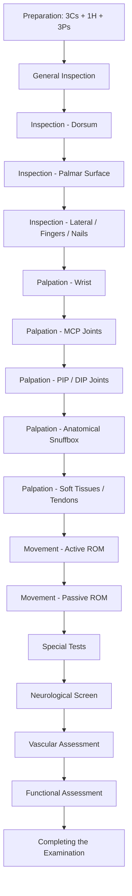

# Examination of the Wrist and Hand

## Master Examination Framework

---

## 1. Preparation

### The 3Cs + 1H + 3Ps

Every OSCE station starts the same way. Nail it and you immediately look competent [1].

| Step | What to do | Model commentary |
|---|---|---|
| **Consent** | Introduce yourself, explain the examination, obtain verbal consent | *"Hello, my name is Dr Chan. I am a medical student. I would like to examine your hands and wrists today. Is that okay with you?"* 「你好，我係陳醫生。我想檢查吓你嘅手同手腕，可以嗎？」 |
| **Curtains** | Ensure privacy | *"Let me draw the curtains for your privacy."* |
| **Chaperone** | Offer if appropriate | *"Would you like a chaperone present?"* |
| **Hand hygiene** | State and perform | *"I would like to wash my hands before we begin."* 「我先洗吓手先。」 |
| **Exposure** | Both forearms exposed to the elbows | *"Could you please roll up your sleeves to above the elbows?"* 「請你將衫袖捲到手踭以上。」 |
| **Pain** | Ask before touching | *"Before I start, do you have any pain at the moment?"* 「而家有冇邊度痛？」 |
| **Positioning** | Seated across from you, hands resting on a pillow on the lap, palms down initially | *"Please sit comfortably and rest both hands on this pillow with palms facing down."* 「請你坐好，將雙手放喺枕頭上面，手掌向下。」 |

<Callout title="OSCE Tip" type="error">
A very common OSCE pitfall is forgetting to ask about pain before touching. In HKUMed exams, this can cost easy marks.
</Callout>

---

## 2. General Inspection

Before you even touch the hands, stand back and look. You're forming your differential diagnosis here.

### Around the Bedside
- **Medical accessories**: splints, braces, wrist supports, bandages, walking aids (suggest functional impairment)
- **Medications**: NSAIDs, DMARDs, steroid creams on the bedside table
- **Other clues**: hearing aids (Alport syndrome if renal context), finger-prick scars (diabetes → carpal tunnel risk), inhalers (steroid use → osteoporosis)

### At First Glance
- **Body habitus**: cushingoid features (chronic steroid use for RA), obesity (CTS risk factor)
- **Distress level**: is the patient guarding one hand? This localizes pathology instantly
- **Obvious deformities**: ulnar deviation, swan-neck, wrist drop — visible from the doorway
- **Skin**: generalized rash (psoriasis), scleroderma facies

**Model commentary**: *"On general inspection, I note the patient is comfortable at rest. There are no splints, braces, or medications around the bedside. I do not see any obvious deformity from this position."*

---

## 3. Systematic Examination

### A. INSPECTION (Look)

This is where you gather the most information in hand examination. As Ryan Ho emphasizes, in rheumatoid hands, **"almost all features are elicited upon inspection"** [1][2].

#### i. Dorsum of Hands

Ask patient to keep palms down on the pillow. Look **systematically from proximal to distal** — wrist → MCPs → PIPs → DIPs → fingertips → nails [1].

| What to look for | Normal | Abnormal findings | Pathophysiology |
|---|---|---|---|
| **Skin changes** | Smooth, normal skin colour | Erythema, atrophy, scars, rash, tight shiny skin (sclerodactyly), Gottron's papules | Erythema = inflammation/infection; Scleroderma = fibrosis of skin; Gottron's = dermatomyositis |
| **Joint swelling** | No visible swelling | Soft boggy swelling (synovitis), hard bony swelling (osteophytes) | Synovitis = inflamed synovium in RA; Osteophytes = new bone in OA |
| ***Wrist deformity*** | Neutral alignment | Swelling, **volar subluxation, radial deviation of wrist, dorsal subluxation of ulna** | RA causes synovial proliferation → ligament destruction → deformity in 3 planes [2] |
| ***MCP deformity*** | Neutral alignment | **Ulnar deviation, volar subluxation** | RA: collateral ligament laxity + extensor tendon subluxation ulnarward [2] |
| ***PIP/DIP deformity*** | Neutral | **Swan-neck** (PIP hyperextension + DIP flexion), **Boutonnière** (PIP flexion + DIP hyperextension) | Swan-neck: lax volar plate → unopposed extensor; Boutonnière: central slip rupture [2] |
| ***Heberden's nodes*** | Absent | Hard bony swellings at **DIP** | Osteophytes in OA — characteristically DIP + 1st CMC [1] |
| ***Bouchard's nodes*** | Absent | Hard bony swellings at **PIP** | OA at PIP (less common than Heberden's) [1] |
| **Dactylitis** | Absent | ***Sausage-shaped swollen finger*** | Interphalangeal arthritis + flexor tendon sheath oedema → psoriatic arthritis or reactive arthritis [1] |
| **Arthritis mutilans** | Absent | **Shortening of fingers** ("opera-glass hand") | Severe bone resorption in psoriatic arthritis or end-stage RA [1] |
| **Intrinsic muscle wasting** | Full interosseous bulk | **Hollow ridges between metacarpals**, especially 1st dorsal webspace | Ulnar nerve palsy (T1), RA, disuse; Pancoast tumour (T1 compression) |
| ***Mallet finger*** | Active DIP extension present | **Inability to extend DIP** without passive force | DIP extensor tendon damage (rupture or avulsion) [2] |

**Model commentary**: *"Looking at the dorsum of the hands, I can see soft boggy swelling at the MCP joints bilaterally with ulnar deviation of the fingers. The wrist appears swollen. I note wasting of the first dorsal interosseous. There are no Heberden's or Bouchard's nodes. I do not see dactylitis or arthritis mutilans."*

<Callout title="Joint Involvement Pattern" type="idea">
In polyarthritis of hands:
- **DIP spared** → consider RA, SLE
- **DIP involved** → consider OA, gout, psoriatic arthritis [1]

This is a classic OSCE viva question.
</Callout>

#### ii. Nails and Fingertips

| Finding | What it looks like | Significance |
|---|---|---|
| **Nail pitting** | Small dents on nail surface | Psoriatic arthritis |
| ***Onycholysis*** | Detachment of nail plate from nail bed | Psoriatic arthritis, hyperthyroidism |
| **Subungual hyperkeratosis** | Thickened keratin under nail | Psoriatic arthritis |
| **Splinter haemorrhages** | Linear red-brown streaks in nail bed | Vasculitis (RA, SLE), infective endocarditis |
| ***Nail fold infarcts*** | Periungual dark spots | Vasculitis — RA, SLE |
| ***Periungual telangiectasia*** | Dilated capillaries at nail fold | Connective tissue disease (SLE, scleroderma, dermatomyositis) [1] |
| **Clubbing** | Loss of nail-bed angle, drumstick swelling | Respiratory (CA lung, bronchiectasis), cardiac, GI, HPO |
| **Digital ulcers / pulp atrophy** | Loss of pulp tissue, ulceration at fingertips | Systemic sclerosis (Raynaud's → ischaemia) [1] |

**Model commentary**: *"Examining the nails, I see nail pitting and onycholysis affecting several fingers — this is consistent with psoriatic nail changes. There are no splinter haemorrhages, nail fold infarcts, or clubbing."*

#### iii. Palmar Surface

Ask patient to turn hands over: 「請將手掌翻轉向上。」 *"Please turn your hands over."*

| Finding | Significance |
|---|---|
| **Palmar erythema** | RA, liver disease, pregnancy, hyperthyroidism |
| ***Dupuytren's contracture*** | Thickened palmar fascia → fixed flexion of ring/little finger. Associated with alcoholic liver disease, diabetes, phenytoin, manual labour [1] |
| **Thenar wasting** | Median nerve palsy (CTS) |
| **Hypothenar wasting** | Ulnar nerve palsy (Guyon's canal compression) |
| **Scars** | Previous surgery: carpal tunnel release, tendon repair/transfer [1] |
| ***Telangiectasia*** | Scleroderma (part of CREST syndrome) [1] |

**Model commentary**: *"On the palmar surface, I note mild thenar wasting on the right hand. There is no Dupuytren's contracture, palmar erythema, or surgical scars."*

---

### B. PALPATION (Feel)

Always **ask about pain first** and watch the patient's face throughout. Palpate warm areas last.

**Cantonese**: 「我而家會摸吓你隻手，如果痛就話我知。」 *"I'm going to feel your hands now. Please tell me if anything is painful."*

#### i. Skin Temperature
- Use the **dorsum of your hand** to compare temperature between joints and bilaterally
- **Warmth** over a joint → active synovitis, septic arthritis, gout

#### ii. Wrist Joint [1][2]

| Structure | How to palpate | Normal vs Abnormal |
|---|---|---|
| **Dorsal wrist joint line** | Place both thumbs on dorsum of wrist, feel the radiocarpal joint | No swelling/tenderness = normal; Boggy swelling = synovitis (RA); Bony irregularity = OA |
| ***Ulnar styloid*** | Palpate prominence on ulnar side | **Tenderness = RA** (ulnar styloid erosion is early sign) [1] |
| ***Radial styloid*** | Palpate radial prominence | **Tenderness = de Quervain's tenosynovitis** [1] |
| ***Anatomical snuffbox*** | Bordered by EPL (ulnar side) and EPB/APL (radial side); palpate the floor | **Tenderness = scaphoid fracture** — this is the classical sign [3] |
| **Scaphoid tubercle** | Palpate on palmar side at base of thenar eminence | ***Tenderness here also suggests scaphoid fracture*** [3] |
| **Distal ulnar head** | Palpate just distal to ulnar head | Tenderness = TFCC injury or DRUJ instability |

**Why the anatomical snuffbox matters**: The scaphoid has a **retrograde blood supply (distal to proximal)**. Missed fractures risk **avascular necrosis** of the proximal pole and non-union — this is why clinical suspicion alone warrants immobilization [3].

**Model commentary**: *"I am now palpating the wrist. I feel the dorsal joint line — there is boggy swelling consistent with synovitis. The ulnar styloid is tender. The radial styloid is non-tender. The anatomical snuffbox is non-tender."*

#### iii. MCP Joints [1]

- **Technique**: Bimanual palpation — hold the metacarpal head between your thumbs dorsally and index fingers palmarly. Flex the MCP to approximately 90° — this opens up the joint space and makes swelling easier to detect
- **Normal**: Firm, no swelling, non-tender
- **Abnormal**: Boggy swelling (synovitis), warmth, tenderness → RA
- ***Volar subluxation test***: Rock the proximal phalanx dorsally and palmarly while MCP is flexed
  - **Normal**: minimal movement
  - **Abnormal**: considerable AP movement → ligamentous laxity or subluxation (RA) [1]

#### iv. PIP and DIP Joints [1]

- **Technique**: Same bimanual squeeze between thumb and forefinger
- **Bony hard swelling at DIP** → ***Heberden's nodes*** (OA)
- **Bony hard swelling at PIP** → ***Bouchard's nodes*** (OA)
- **Soft boggy swelling at PIP** → Synovitis (RA)
- Test passive flexion and extension of each joint as you go

#### v. Tendons and Soft Tissues

- ***Palmar tendon crepitus***: Place your palmar fingers against the patient's palm while they flex/extend MCPs. Crepitus indicates **tenosynovitis** [1]
- ***Trigger finger*** (same manoeuvre): Flexion occurs freely until a **catch point** where it sticks, then overcomes with a **snap**. Caused by a nodule on the flexor tendon catching on the A1 pulley. **RA is an important cause** [1]
- ***Ganglion cysts***: Most common on **dorsal wrist (70%)** [4]. Spherical, smooth, firm (hard if small, soft if large). **Transilluminate brilliantly** [4]

**Model commentary**: *"I am systematically palpating each MCP joint — I feel boggy swelling at the 2nd and 3rd MCPs bilaterally with associated tenderness. The PIP joints show fusiform swelling. The DIP joints are spared. I am checking for palmar tendon crepitus — there is none, and no triggering."*

---

### C. MOVEMENT (Move)

Always test **active** ROM first (what the patient can do), then **passive** ROM (what the joint allows). The difference tells you about soft tissue vs structural problems [2][5].

- **↓ active ROM with preserved passive ROM** → soft tissue problem (tendon rupture, muscle weakness, pain)
- **↓ active + passive ROM** → structural (synovitis, contracture, bony block) [5]

#### i. Wrist Active ROM

Ask the patient to perform each movement. Note range and any pain.

| Movement | Normal ROM | Instruction (English / Cantonese) |
|---|---|---|
| **Dorsiflexion (extension)** | ~75° | *"Bend your wrist back as far as you can"* 「將手腕向上屈」 |
| **Palmar flexion** | ~75° | *"Bend your wrist down"* 「將手腕向下屈」 |
| **Radial deviation** | ~20° | *"Tilt your hand towards your thumb side"* 「將手向拇指嗰邊傾」 |
| **Ulnar deviation** | ~20° | *"Tilt your hand towards the little finger side"* 「將手向尾指嗰邊傾」 |
| **Pronation / Supination** | ~90° each | *"Turn your palms up, then down"* 「掌心向上，再向下」 |

#### ii. Finger and Thumb ROM (Quick Screen) [2]

Rather than test each joint individually (time-consuming in OSCE), use functional screens:

| Test | Instruction | What it screens |
|---|---|---|
| **Make a fist** | *"Make a tight fist"* 「揸實拳頭」 | MCP and IP flexion |
| **Open hand widely** | *"Spread your fingers as wide as possible"* 「盡量張開手指」 | MCP/IP extension + finger abduction (ulnar nerve) |
| **Thumb extension** | *"Point your thumb to the ceiling"* 「拇指指向天花板」 | EPL function (radial nerve / posterior interosseous nerve) |
| **Thumb abduction** | *"Move your thumb away from your palm"* 「拇指離開手掌」 | APB function (median nerve) |
| **Thumb opposition** | *"Touch the tip of your little finger with your thumb"* 「拇指掂尾指指尖」 | Opponens pollicis (median nerve) |
| **Finger abduction/adduction** | *"Spread fingers apart, now squeeze them together"* 「手指張開，再合埋」 | Interossei (ulnar nerve) |

#### iii. Passive ROM

Gently move each joint through its range while the patient relaxes. Note:
- **End-feel**: bony (hard stop = OA), boggy (soft = effusion), springy (capsular) 
- **Crepitus**: soft crepitus = synovial thickening; coarse crepitus = cartilage damage [1]
- **Pain at end range** with limited ROM → suggests capsular or inflammatory pathology

**Model commentary**: *"I am now assessing active range of movement. The patient can make a fist but with some difficulty at the PIP joints. Wrist extension is reduced to approximately 40 degrees bilaterally. Thumb opposition is intact. On passive movement, I note coarse crepitus at both wrists."*

---

### D. SPECIAL TESTS

This is where the marks are in an OSCE. Know these cold.

#### i. Tests for Carpal Tunnel Syndrome

**Carpal tunnel syndrome (CTS)** is by far the most commonly examined hand condition. It is median nerve compression within the carpal tunnel (bordered by the flexor retinaculum and the carpal bones — laterally by scaphoid and trapezium, medially by pisiform and hook of hamate) [6].

**Risk factors**: ***aging, female, DM, hypothyroid, RA, obesity, pregnancy, wrist fracture*** [6]

##### Phalen's Test [1][7]

- **Technique**: Ask the patient to **flex both wrists maximally** and press the dorsum of the hands together. Hold for **30 seconds** (or up to 60 seconds)
  - 「請將兩隻手手腕向下屈，手背對手背，保持30秒。」
- **Positive result**: Paraesthesia or numbness in the **median nerve distribution** (thumb, index, middle, and radial half of ring finger)
- **Mechanism**: Flexion of the wrist further narrows the already compressed carpal tunnel, increasing pressure on the median nerve
- **Sensitivity**: ~68%; **Specificity**: ~73%

**Model commentary**: *"I am now performing Phalen's test by asking the patient to hold both wrists in flexion for 30 seconds. The patient reports tingling in the thumb, index, and middle fingers of the right hand — this is a positive Phalen's test, consistent with carpal tunnel syndrome."*

##### Tinel's Sign [1][7]

- **Technique**: **Tap firmly** over the flexor retinaculum (over the carpal tunnel at the wrist crease) with your index finger or a tendon hammer
  - 「我而家會輕輕拍你手腕，如果有麻痹就話我知。」
- **Positive result**: Tingling/electric shock sensation radiating into the median nerve distribution
- **Mechanism**: Percussion over a demyelinated/compressed nerve elicits ectopic nerve firing
- **Less reliable than Phalen's** but still commonly tested [1]
- **Sensitivity**: ~50%; **Specificity**: ~77%

##### Durkan's Compression Test [6]

- **Technique**: Apply **direct pressure** with your thumbs over the carpal tunnel for **30 seconds**
- **Positive result**: Reproduction of median nerve symptoms
- **Mechanism**: Direct mechanical compression of median nerve
- **Sensitivity**: ~87%; **Specificity**: ~90% — actually the **most sensitive and specific** of the three provocative tests

<Callout title="CTS Examination Sequence" type="idea">
In practice, you should do all three tests for CTS in an OSCE: Durkan's → Phalen's → Tinel's. Also check for **thenar wasting** (late sign) and test **thumb abduction** (APB — solely median nerve innervated) and **thumb opposition** (opponens pollicis — median nerve). Two-point discrimination at fingertips (normal < 6mm) indicates severity [6].
</Callout>

#### ii. De Quervain's Tenosynovitis — Finkelstein's Test [6][8]

***De Quervain's tenosynovitis*** is stenosing tenosynovitis of the **first extensor compartment** (APL and EPB tendons). Common in **females aged 30–50, pregnancy, repetitive hand/wrist use** [8].

- **Technique**: Ask the patient to **tuck the thumb inside a closed fist**, then **passively deviate the wrist towards the ulnar side**
  - 「請你將拇指收入拳頭入面，然後我會將你隻手向尾指嗰邊傾。」
- **Positive result**: ***Acute pain at the radial styloid and along the EPB/APL tendons*** [8]
- **Mechanism**: Ulnar deviation stretches the inflamed tendons within the tight first extensor compartment, reproducing pain
- **DDx to consider**: 1st CMC joint OA (test with Grind test), Wartenberg's syndrome (superficial radial nerve neuritis), intersection syndrome [8]

#### iii. 1st CMC Joint OA — Grind Test [6]

- **Technique**: **Grasp the thumb metacarpal** and apply **axial compression with rotation** against the trapezium
- **Positive result**: Pain and/or crepitus at the 1st CMC joint
- **Mechanism**: Bone-on-bone grinding in a degenerate joint
- **Why it matters**: Distinguishes 1st CMC OA from de Quervain's — both cause radial-sided wrist/thumb pain

#### iv. Scaphoid Fracture Assessment [3]

- **Anatomical snuffbox tenderness**: Palpate the triangular depression bordered by EPL (ulnar) and EPB/APL (radial) — tenderness here is the ***classical sign of scaphoid fracture*** [3]
- **Scaphoid tubercle tenderness**: Palpate on the palmar side
- **Telescoping test**: Axial compression along the thumb metacarpal → pain at scaphoid
- **Why important**: Scaphoid has ***special blood supply from distal to proximal*** → missed fractures risk **non-union and AVN** [3]. If clinical suspicion exists but initial XR is negative → **immobilize and recheck XR in 10–14 days** (or MRI) [3][9]

#### v. Ulnar Nerve Tests [6]

##### Froment's Sign

- **Technique**: Ask the patient to hold a piece of paper between the **thumb and index finger** (key pinch). Try to pull the paper away
- **Positive result**: Patient **flexes the thumb IPJ** (using FPL — median nerve) to compensate for weak adductor pollicis (ulnar nerve)
- **Mechanism**: Adductor pollicis is ulnar nerve innervated. When weak, the patient unconsciously recruits FPL
- **Indicates**: Ulnar nerve palsy (distal)

##### Cross Finger Sign (Wartenberg's Sign)

- **Technique**: Ask patient to **cross index over middle finger**
- **Positive result**: Unable to perform → weak interossei
- **Indicates**: Ulnar nerve palsy

##### Claw Hand Assessment

- **Inspect**: Hyperextension of MCPs + flexion of IPJs in ring and little fingers
- **Mechanism**: Loss of ulnar-innervated lumbricals (3rd and 4th) → unopposed EDC at MCPs and FDP at IPJs
- **Ulnar paradox**: Claw is **more prominent in distal ulnar lesions** (at wrist) because FDP 4/5 is intact (innervated more proximally) → stronger IPJ flexion → worse claw

#### vi. Screening for Peripheral Nerve Integrity [6]

This is a rapid screen from Maxim's notes — extremely efficient for OSCE:

| Action | What it tests |
|---|---|
| **Palm down → wrist extension** | Radial nerve (wrist extensors) |
| **Thumb up (hitchhiker)** | Posterior interosseous nerve |
| **Palm up** | Proximal ulnar and median nerves (forearm supination) |
| **Thumb opposition** | Distal median nerve (APB, opponens) |
| **OK sign** | Anterior interosseous nerve (FPL + FDP index) |
| **Finger abduction/adduction** | Distal ulnar nerve (interossei) |

**Model commentary**: *"I would like to quickly screen the peripheral nerves. Can you extend your wrist? Good. Give me a thumbs up? Good. Turn your palms up? Now touch thumb to little finger. Make an OK sign. Now spread your fingers apart. Excellent — peripheral nerve function appears intact."*

#### vii. Trigger Finger Assessment [1]

- Already described under palpation — feel for **catching/snapping** during MCP flexion-extension
- Also inspect for a palpable **nodule** at the A1 pulley (base of finger in the palm)

#### viii. Assessing for Extensor Tendon Rupture

In RA patients:
- ***Finger drop***: Inability to extend a finger against gravity → **posterior interosseous nerve (PIN) palsy** or extensor tendon rupture
- Test: Ask patient to extend fingers individually against resistance
- RA erodes and ruptures extensor tendons (especially over dorsal wrist due to synovitis and bony spicules from distal ulna) — ring and little finger tendons go first (Vaughan-Jackson lesion)

---

### E. NEUROVASCULAR ASSESSMENT

#### Sensation

- **Median nerve**: Palmar aspect of lateral 3½ digits
- **Ulnar nerve**: Palmar aspect of medial 1½ digits + dorsal medial 1½ digits
- **Radial nerve**: Dorsal aspect of lateral 3½ digits (first dorsal web space is autonomous zone)
- Test with **light touch** and **two-point discrimination** (normal threshold: ≤ 4mm at fingertips) [6]

#### Vascular

- **Radial and ulnar pulses**: Palpate at the wrist
- **Allen's test**: Compress both radial and ulnar arteries → patient opens and closes fist → release one artery at a time → assess refill. Tests patency of palmar arch
- **Capillary refill time**: Normal < 2 seconds

---

### F. FUNCTIONAL ASSESSMENT [2]

Examiners love to see you think about **real-life impact**. Quick tests:

- **Grip strength**: Ask patient to squeeze your two fingers 「揸實我兩隻手指」
- **Pinch grip**: Hold a key between thumb and index finger (tests median + ulnar nerve)
- **Fine motor**: Pick up a coin, unbutton and rebutton a shirt, write their name
- **Power grip**: Hold a cup 「揸住呢個杯」

**Model commentary**: *"To assess function, I would ask the patient to grip my fingers, pick up a coin, and undo a button."*

---

## 4. Completing the Examination

**Model commentary**: *"To complete my examination, I would like to:"*

- **Examine the elbow**: Look for rheumatoid nodules at the olecranon, gouty tophi, psoriatic plaques, ulnar nerve subluxation, and test elbow ROM [2]
- **Examine the contralateral limb** for comparison
- **Check for extra-articular features of RA** if suspected: eyes (episcleritis, scleritis), lungs (pleural effusion, ILD), skin (rheumatoid nodules, vasculitic rash)
- **Examine the cervical spine**: Cervical myelopathy can mimic hand weakness; also RA can cause atlantoaxial subluxation
- **Request investigations**: Plain hand/wrist XR (at least 2 views [9]), scaphoid views if fracture suspected [3][9], blood tests (RF, anti-CCP, ESR/CRP, urate)

---

## 5. Expected Positive and Important Negative Findings by Condition

| Condition | Expected Positive Findings | Important Negatives to Document |
|---|---|---|
| **Rheumatoid Arthritis** | MCP/PIP synovitis, ulnar deviation, swan-neck/boutonnière deformity, wrist subluxation, ulnar styloid tenderness, positive squeeze test | DIP sparing, no Heberden's/Bouchard's nodes |
| **Osteoarthritis** | Heberden's nodes (DIP), Bouchard's nodes (PIP), 1st CMC squaring, crepitus | No synovitis at MCPs, no ulnar deviation |
| **Carpal Tunnel Syndrome** | Thenar wasting, positive Phalen's/Tinel's/Durkan's, reduced thumb abduction, altered 2-point discrimination | No hypothenar wasting, no ulnar distribution symptoms |
| **Scaphoid Fracture** | Anatomical snuffbox tenderness, scaphoid tubercle tenderness | No distal radius deformity (dinner-fork) |
| **De Quervain's** | Positive Finkelstein's, radial styloid tenderness | Negative Grind test (rules out 1st CMC OA) |
| **Ulnar Nerve Palsy** | Hypothenar wasting, interosseous wasting, claw hand, positive Froment's sign | Intact thenar bulk, intact thumb opposition |

---

## 6. Red Flag Examination Findings

These require immediate escalation:

| Finding | Concern | Action |
|---|---|---|
| **Hot, red, swollen single joint** with fever | **Septic arthritis** until proven otherwise | Urgent joint aspiration, IV antibiotics |
| **Acute hand ischaemia** (pale, pulseless, painful, cold) | Vascular emergency | Urgent vascular referral |
| **Open fracture** (bone visible or wound communicating with fracture) | Contamination, infection risk | IV antibiotics, tetanus, urgent surgical washout |
| **Compartment syndrome signs** (pain on passive stretch, tense compartments, worsening pain, paraesthesia) | Ischaemic necrosis of muscle | **Urgent fasciotomy** |
| **Acute tendon rupture** (sudden loss of finger extension/flexion after trauma) | Requires surgical repair within days | Urgent hand surgery referral |
| **Progressive bilateral hand weakness + upper motor neuron signs in legs** | Cervical myelopathy | Urgent MRI C-spine |

---

## 7. Common OSCE Pitfalls

<Callout title="Common OSCE Pitfalls" type="error">

1. **Forgetting to ask about pain before touching** — this is a universal OSCE mark
2. **Not comparing both hands** — always examine bilaterally for symmetry
3. **Skipping the palmar inspection** — students focus on the dorsum and miss thenar/hypothenar wasting, Dupuytren's, palmar erythema
4. **Testing passive ROM without doing active ROM first** — always active before passive
5. **Not checking nails** — psoriatic nail changes, clubbing, and vasculitic signs are easy marks
6. **Performing Finkelstein's test incorrectly** — it is the examiner who passively deviates the wrist (not the patient); simply making a fist over the thumb is not enough
7. **Forgetting to complete the examination** — always offer to examine the elbow, cervical spine, and extra-articular features
8. **Not performing a neurovascular check** — especially in trauma/post-operative settings
9. **Confusing Heberden's (DIP) and Bouchard's (PIP) nodes** — a classic exam trap
10. **Not including functional assessment** — examiners expect you to think about the patient's daily activities

</Callout>

---

## 8. High-Yield Interpretation Tips

- **Symmetric small joint polyarthritis sparing DIPs** = RA until proven otherwise
- **DIP involvement with nail changes** = psoriatic arthritis
- **DIP + 1st CMC involvement, hard bony swelling, no warmth** = OA
- **Thenar wasting + positive Phalen's** = CTS — always check for underlying cause (DM, hypothyroid, RA, pregnancy)
- **Anatomical snuffbox tenderness after a fall on outstretched hand (FOOSH)** = scaphoid fracture until proven otherwise — **treat even if XR normal** [3]
- **Wrist drop** = radial nerve palsy (Saturday night palsy, humeral shaft fracture)
- **Claw hand** = ulnar nerve palsy — remember the ulnar paradox (worse claw = more distal lesion)
- **Hand of benediction** (cannot flex index and middle fingers) = **high median nerve palsy** — opposite of ulnar claw

---

## 9. Model Reporting Script

> *"On examination, Mrs Wong is a 55-year-old lady who appears comfortable at rest. There are no splints, braces, or walking aids at the bedside. Vital signs are stable.*
>
> *On inspection of the hands, with palms down, I note soft boggy swelling at the wrist joints and MCP joints bilaterally. There is ulnar deviation of the fingers at the MCPs. I can see a swan-neck deformity at the right ring finger PIP joint. The DIP joints are spared. There is wasting of the first dorsal interosseous bilaterally. Examining the nails, there are no psoriatic changes, but I note small splinter haemorrhages at two nails. Turning the hands over, there is thenar wasting on the right and a scar over the right wrist consistent with previous carpal tunnel release. No Dupuytren's contracture.*
>
> *On palpation, there is warmth and boggy swelling at the MCP joints of both hands with tenderness on bimanual squeeze. The ulnar styloid is tender bilaterally. The PIP joints of the index and middle fingers show fusiform swelling. The DIP joints are non-tender with no bony swelling. There is no palmar tendon crepitus or triggering.*
>
> *Active range of movement shows reduced wrist extension bilaterally to approximately 40 degrees. The patient can make a fist but with difficulty. Thumb opposition is intact. On passive movement, I note coarse crepitus at both wrists.*
>
> *Special tests: Phalen's test is positive on the right, reproducing tingling in the thumb, index, and middle fingers at 20 seconds. Tinel's sign is also positive on the right. Finkelstein's test is negative. Peripheral nerve screening shows intact radial, median, and ulnar nerve motor function.*
>
> *Grip strength is reduced bilaterally. The patient has difficulty undoing buttons.*
>
> *I note firm subcutaneous nodules at the right olecranon consistent with rheumatoid nodules.*
>
> *In summary, this patient has signs consistent with rheumatoid arthritis with bilateral symmetric MCP and PIP synovitis, ulnar deviation, a swan-neck deformity, associated carpal tunnel syndrome on the right with evidence of previous surgical decompression, and rheumatoid nodules. I would like to examine further for extra-articular manifestations and request hand X-rays and inflammatory markers."*

---

<Callout title="High Yield Summary">

**Approach**: 3Cs + 1H → General inspection → Look (dorsum → nails → palmar) → Feel (wrist → MCPs → PIPs/DIPs → tendons) → Move (active → passive) → Special tests → Neurovascular → Functional → Complete.

**Key special tests**: Phalen's + Tinel's + Durkan's (CTS), Finkelstein's (de Quervain's), Grind test (1st CMC OA), Anatomical snuffbox tenderness (scaphoid fracture), Froment's sign (ulnar nerve palsy).

**Pattern recognition**:
- RA = symmetric, MCP/PIP, DIP-sparing, soft boggy swelling
- OA = DIP (Heberden's) + 1st CMC, hard bony swelling
- PsA = DIP + nail changes + dactylitis
- CTS = thenar wasting + positive provocative tests + median nerve sensory loss

**Never forget**: Compare both hands, check nails, inspect palms, test function, offer to examine elbow and cervical spine.

</Callout>

---

<ActiveRecallQuiz
  title="Active Recall - Physical Exam"
  items={[
    {
      question: "In polyarthritis of the hands, how does DIP involvement help differentiate between RA, OA, and psoriatic arthritis?",
      markscheme: "DIP spared in RA and SLE. DIP involved in OA (Heberden's nodes), gout, and psoriatic arthritis. Psoriatic arthritis additionally shows nail changes and dactylitis.",
    },
    {
      question: "Describe how to perform Phalen's test and what constitutes a positive result.",
      markscheme: "Ask the patient to maximally flex both wrists, pressing dorsum of hands together, and hold for 30 seconds. Positive if paraesthesia develops in the median nerve distribution (thumb, index, middle, and radial half of ring finger).",
    },
    {
      question: "What is the clinical significance of anatomical snuffbox tenderness after a fall on an outstretched hand, and why is it dangerous to miss?",
      markscheme: "Classical sign of scaphoid fracture. The scaphoid has retrograde blood supply (distal to proximal), so fractures — especially of the waist or proximal pole — risk avascular necrosis and non-union if untreated. If XR is negative, immobilize and repeat imaging in 10-14 days or obtain MRI.",
    },
    {
      question: "What is Froment's sign and what nerve lesion does it indicate?",
      markscheme: "Ask the patient to pinch a piece of paper between thumb and index finger. Positive if thumb IPJ flexes (using FPL, median nerve) to compensate for weak adductor pollicis. Indicates ulnar nerve palsy.",
    },
    {
      question: "Name three risk factors for carpal tunnel syndrome.",
      markscheme: "Aging, female sex, diabetes mellitus, hypothyroidism, rheumatoid arthritis, obesity, pregnancy, previous wrist fracture.",
    },
    {
      question: "Explain the ulnar paradox in ulnar nerve palsy.",
      markscheme: "Claw hand deformity is more prominent in distal (wrist-level) ulnar nerve lesions because FDP to ring and little fingers is intact (innervated proximal to the wrist), producing stronger IPJ flexion and a worse claw. In proximal lesions, FDP is also paralysed, so the claw is less obvious.",
    },
  ]}
/>

---

## References

[1] Senior notes: Ryan Ho Fundamentals.pdf (pp. 8, 127–128, 131)
[2] Senior notes: Ryan Ho Rheumatology.pdf (pp. 6–7, 9–10, 25, 32)
[3] Lecture slides: GC 233. Common Hand Injuries.pdf (p. 37)
[4] Senior notes: felixlai.md (Section: Ganglion cyst)
[5] Senior notes: Ryan Ho Rheumatology.pdf (p. 32)
[6] Senior notes: maxim.md (Sections: Hand and wrist anatomy, Carpal tunnel syndrome, Summary of special tests)
[7] Senior notes: Ryan Ho Urogenital.pdf (p. 6 — CTS signs)
[8] Senior notes: maxim.md (Section: De Quervain's tenosynovitis)
[9] Lecture slides: Ryan Ho Diagnostic Radiology.pdf (p. 13 — scaphoid view)
