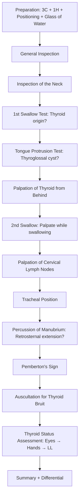

# Examination of the Thyroid Gland

## Master Examination Framework

---

## 1. Preparation

Before you touch anything, get the setup right — examiners are watching from the moment you walk in.

- **Introduce yourself**: "Good morning, my name is Dr. ___, I am a medical student. May I confirm your name please?" 「早晨，我姓___，係醫科學生，請問你貴姓？」
- **3Cs**: **C**onsent ("I would like to examine your neck today, is that alright?" 「我想幫你檢查頸部，可以嗎？」), **C**urtains (draw for privacy), **C**haperone (offer if appropriate)
- **1H**: **H**and hygiene — "I would wash my hands before starting" (state aloud in OSCE) [1]
- **Positioning**: Patient **sitting upright** on a chair, facing forward, neck comfortably neutral. The examiner must be able to move behind the patient freely.
- **Exposure**: Entire **neck**, including the **sternum and clavicles**. Ask the patient to lower or open their collar. 「可唔可以幫我解開上面幾粒鈕扣？」
- **Equipment**: Ensure a **glass of water** is available (critical for the swallow test — if one isn't provided, ask for it out loud; this shows the examiner you know what you're doing) [1][2]

<Callout title="Don't Skip the Glass of Water" type="error">
Forgetting to ask for a glass of water is one of the most common OSCE errors. The swallow test is a defining step that distinguishes thyroid from non-thyroid neck masses. Always ask for it explicitly if it's not already at the bedside.
</Callout>

---

## 2. General Inspection

Before examining the neck, stand back and take in the whole picture. This is your "end-of-the-bed" assessment.

### Bedside Environment
- IV drips, oxygen supplementation, diet restriction signs
- Medication charts (look for thyroxine, carbimazole, propylthiouracil)
- Thyroid eye disease protection equipment (e.g., eye lubricant drops)

### The Patient
| What to Look For | Why It Matters |
|---|---|
| **Dyspnoea at rest** | Retrosternal goitre causing tracheal compression |
| **Hoarseness** (listen while greeting) | Recurrent laryngeal nerve involvement — sinister sign suggesting malignancy or post-surgical injury [1][2] |
| **Palm sweating** (shake hands) | Sympathetic overactivity in hyperthyroidism |
| **Obvious eye signs** (visible from doorway) | Proptosis/lid retraction → Graves' disease |
| **Nervous/agitated appearance** | Thyrotoxicosis |
| **Body habitus** | Thin/cachectic (hyperthyroid or malignancy) vs obese/sluggish (hypothyroid) |
| Vital signs | Tachycardia, AF (hyperthyroid) vs bradycardia (hypothyroid) |

**Model Running Commentary:**
> *"The patient is sitting comfortably on a chair without any dyspnoea. On greeting the patient, there is no hoarseness. On shaking the patient's hands, there is no palm sweating. There are no obvious eye signs and the patient does not look nervous."* [1]

**Pathophysiology**: Hoarseness occurs because the **recurrent laryngeal nerve** (RLN) runs in the tracheo-oesophageal groove, intimately related to the thyroid — particularly at the ligament of Berry. Malignant thyroid tumours can directly invade the nerve, causing vocal cord paralysis. Post-thyroidectomy hoarseness indicates iatrogenic RLN injury. [2][3]

---

## 3. Inspection of the Neck

Ask the patient to **slightly extend the neck** 「請將頭微微仰後」 and inspect **from the front**.

### What to Look For

#### a) Neck Mass
- **Laterality**: Left, right, midline, or diffuse?
- **Shape**: Focal nodule vs diffuse swelling
- A visible neck mass already narrows your differential significantly

#### b) Scars
- ***Kocher's (collar) incision***: horizontal incision in a skin crease **2 finger-breadths above the suprasternal notch** — indicates previous thyroidectomy [1][2]
- Look for other scars: lateral neck dissection scars (indicating previous surgery for thyroid malignancy)

#### c) Overlying Skin Changes
- Erythema → suppurative thyroiditis or anaplastic carcinoma
- ***Post-irradiation marks*** → previous radiotherapy (risk factor for thyroid carcinoma) [2]

#### d) Signs of Thoracic Inlet Obstruction
- **Facial plethora** (reddish/congested face)
- **Distended neck veins** — suggests SVC obstruction from retrosternal goitre (rare but important) [1]

**Model Running Commentary:**
> *"On inspection, there is an obvious left-sided neck mass, without any overlying skin changes, scars, or dilated veins. There are no other neck masses."* [1]

**Localization of Neck Masses** (high-yield table from lecture) [2]:

| Location | Differential |
|---|---|
| **Midline** | Thyroid isthmus nodule, thyroglossal cyst, dermoid cyst |
| **Anterior triangle** | Thyroid nodule, branchial cyst, carotid body tumour |
| **Posterior triangle** | Lymph node (Levels II–V), schwannoma, cystic hygroma |
| **Supraclavicular** | Level V LN (NPC), Virchow's node (GI/lung/gynae malignancy) |

---

## 4. The Swallow Test (1st Swallow — Inspection)

This is the key manoeuvre that identifies a mass as thyroid in origin.

**Technique:**
1. Hand the patient a glass of water: "Please take a sip of water, hold it in your mouth, and swallow when I say so" 「請飲一啖水，含住先，我叫你吞你先吞」
2. Observe the mass closely from the front
3. On command: "Please swallow now" 「請吞嚥」
4. Watch for **upward movement** of the mass

**Normal vs Abnormal:**
- **Positive (mass moves up)**: Mass is likely **thyroid** in origin, or a thyroglossal cyst
- **Negative (mass does not move)**: Mass is NOT thyroid — consider lymph node, branchial cyst, salivary gland tumour etc.

**Pathophysiology**: The thyroid gland is enclosed within the ***pretracheal fascia*** and attached to the trachea via the ***ligament of Berry (suspensory ligament of the thyroid)***. During swallowing, the larynx and trachea elevate, pulling the thyroid (and anything attached to it) upward. [1][2]

<Callout title="Fixed Malignant Thyroid" type="idea">
In advanced thyroid malignancy, the gland may become fixed to surrounding structures and lose its upward mobility with swallowing. A thyroid mass that does NOT move with swallowing should raise red flags for locally invasive carcinoma.
</Callout>

**Model Running Commentary:**
> *"I would like a glass of water to test if the mass is thyroid in origin. The mass moves up with swallowing — it is likely to be thyroid in origin."* [1]

---

## 5. Tongue Protrusion Test (for Thyroglossal Cyst)

Only perform this if the mass is **near the hyoid level** (midline, usually slightly left of midline).

**Technique:**
1. Ask the patient to open their mouth 「請張開口」
2. Place two fingers just above the swelling
3. "Now please stick your tongue out" 「請伸出脷」
4. Feel for upward movement of the mass

**Positive Finding**: Mass moves up with tongue protrusion → ***thyroglossal cyst***

**Pathophysiology**: Thyroglossal cysts are remnants of the ***thyroglossal duct***, which descends from the foramen caecum (base of tongue) to the thyroid's final position. The duct is intimately attached to the hyoid bone. When the tongue protrudes, the hyoid is pulled upward via geniohyoid/hyoglossus, dragging the cyst upward — this is called ***positive puckering***. [1][2]

**Normal thyroid masses**: Will NOT move with tongue protrusion (only with swallowing).

---

## 6. Palpation of the Thyroid

<Callout title="Always Ask About Pain First" type="error">
***Before any palpation, ask: "Do you have any pain or tenderness in your neck?" 「你個頸有冇痛？」*** This is a safety and courtesy step that examiners specifically look for. [1][2]
</Callout>

### Technique
1. Ask the patient to **flex the chin slightly forward** to relax the anterior neck muscles (sternocleidomastoid and strap muscles) 「請將頭微微向前傾」
2. Stand **behind** the patient
3. Use **both hands** — curl your fingers around to palpate the thyroid from behind
4. Identify the thyroid cartilage → cricoid cartilage → the thyroid isthmus lies just below
5. Palpate each lobe systematically: right lobe with left hand (push gently from the left), left lobe with right hand (push gently from the right)
6. **2nd Swallow**: Ask the patient to swallow again while palpating — this helps the gland "ride up" under your fingers and is especially useful for feeling the **lower border** [1]

### What to Describe (Mass Characterization)

For a **discrete nodule or mass** [1][2]:

| Feature | What to Note | Clinical Significance |
|---|---|---|
| **Location** | Left lobe, right lobe, isthmus | Guides surgical planning |
| **Shape** | Discrete nodule vs multinodular vs diffuse | Determines clinical classification |
| **Size** | Estimate dimensions | Baseline for monitoring |
| **Consistency** | Soft / Firm / ***Hard (malignant)*** | Hard, stony consistency → malignancy |
| **Surface** | Smooth / Nodular / Multinodular | |
| **Tenderness** | Tender / Non-tender | Tender → thyroiditis, haemorrhage into cyst |
| **Mobility/Fixation** | Mobile vs ***fixed to skin or underlying structures (malignant)*** | Fixed = invasion → malignancy |
| **Lower border** | Can you feel it? | ***Cannot feel lower border → suspect retrosternal extension*** |
| **Thrills** | Palpable vibration | Increased vascularity (Graves') |

For a **diffuse enlargement** [1]:
- **Size**: Estimate weight (normal thyroid ~20g)
- **Surface**: Smooth vs presence of nodularity
- **Consistency**: Soft (simple goitre) vs firm (Hashimoto's) vs hard (malignancy)
- **Dominant nodule**: If present in MNG → needs biopsy to rule out malignancy

**Model Running Commentary:**
> *"I would now proceed to palpation of the thyroid. There is a nodular mass of the left thyroid lobe, approximately 3 × 2 cm. It is firm in consistency, non-tender, and not attached to skin or underlying structures. I can feel the lower border of the thyroid."* [1]

---

## 7. Palpation Around the Thyroid

### a) Cervical Lymph Nodes

Systematic palpation of all cervical lymph node groups: submental → submandibular → pre-auricular → post-auricular → anterior cervical chain → posterior cervical chain → supraclavicular → deep cervical (along SCM).

| LN Character | Suggests |
|---|---|
| Discrete, mobile, firm, slightly tender | Reactive lymphadenopathy |
| Isolated, tender, warm, fluctuant | Infected lymph node |
| Firm, rubbery, rapidly expanding | Lymphoma |
| ***Rock-hard, fixed, non-tender*** | ***Metastatic malignancy*** |

**Key Point**: ***Hard lymph nodes + solitary thyroid nodule or dominant nodule in MNG → strongly suggests malignancy*** [1][2][3]

### b) Tracheal Position

**Technique**: Trace the trachea with two fingers from the cricoid cartilage down to the suprasternal notch. Assess whether it is central or deviated.

**Pathophysiology**: A large goitre can push the trachea to the contralateral side. Tracheal deviation is a sign of a space-occupying lesion and should prompt assessment for retrosternal extension. [1][2]

### c) Test for Retrosternal Extension

Only indicated if the **lower border of the goitre cannot be palpated** or if clinically suspected.

**Technique**:
1. Return to the **front** of the patient
2. ***Percuss bilaterally down on the manubrium*** — from above downwards
3. Compare both sides for any dullness

**Normal**: Resonant percussion note over the sternum and manubrium
**Abnormal**: ***Dull percussion note → retrosternal goitre extension*** [1][2]

---

## 8. Percussion

As described above:
- **Percuss the manubrium** from superior to inferior
- **Normal**: Resonant
- **Abnormal**: Dull percussion note indicates ***retrosternal extension*** of the goitre [1][2]

**Why this matters**: Retrosternal goitre cannot be assessed by ultrasound alone (as the sternum blocks ultrasound waves). Clinical percussion is a simple bedside test. CT thorax is the definitive investigation for retrosternal goitre for surgical planning. [3]

---

## 9. Pemberton's Sign (Special Test)

This is a provocative test for ***retrosternal goitre*** causing thoracic inlet obstruction.

### Technique
1. Ask the patient to raise both arms vertically above their head 「請將雙手舉高過頭」
2. Hold for **60 seconds** (or until symptoms develop)
3. Observe for positive signs

### Positive Findings [1][2][4]:
- ***Distended neck veins***
- ***Facial plethora*** (flushing/congestion of face)
- ***Cyanosis***
- ***Inability to swallow***
- ***Worsening dyspnoea or inspiratory stridor***

### Pathophysiology
Raising the arms narrows the thoracic inlet by elevating the first ribs and clavicles. A retrosternal goitre is effectively "corked" into the narrowed inlet, compressing the ***internal jugular veins and SVC***. This causes venous congestion above the obstruction (facial plethora, distended neck veins) and may compress the trachea (stridor, dyspnoea). [2][4]

### Differential Diagnosis of Positive Pemberton's Sign
- Retrosternal goitre (most common cause)
- SVC syndrome (e.g., lung malignancy)
- Thoracic outlet syndrome

**Model Running Commentary:**
> *"I would now like to perform Pemberton's sign. I ask the patient to raise both arms above the head for one minute. There is no development of facial plethora, cyanosis, stridor, or distended neck veins — Pemberton's sign is negative."*

---

## 10. Auscultation

### Thyroid Bruit

**Technique**: Place the **bell** of the stethoscope over each thyroid lobe. Ask the patient to hold their breath briefly 「請暫停呼吸」 to eliminate breath sounds.

**Positive Finding**: A continuous bruit (low-pitched hum) heard over the thyroid gland

**Pathophysiology**: ***Increased blood flow*** to the thyroid due to TSH receptor antibody-mediated stimulation → hypervascular gland. ***Typically found in Graves' disease*** — virtually pathognomonic in the right clinical context. [1][2]

**Important Differentials** [1]:
- **Carotid bruit**: Louder over the carotid artery (higher, more lateral)
- **Venous hum**: Can be obliterated by applying gentle pressure to the base of the neck (compresses the jugular vein)

**Model Running Commentary:**
> *"I would now auscultate over the thyroid with the bell of my stethoscope. There is no thyroid bruit audible."*

---

## 11. Assessment of Thyroid Status

This is the critical "completion" step. In OSCEs, the examiner will usually say "Please assess the thyroid status" — this is your cue for the head-to-toe approach. [1]

### Eyes 「我而家想檢查下你對眼」

| Examination | How to Perform | What to Find | Pathophysiology |
|---|---|---|---|
| **Proptosis** | Stand behind, look from above the patient's head | Eye visible beyond supraorbital ridge | Graves' ophthalmopathy: GAG/adipose expansion of retro-orbital tissue pushes globe forward [5] |
| **Lid retraction** | Look from front: sclera visible above the iris (upper limbus) | White sclera visible between upper eyelid and upper iris | Sympathetic overactivity on Müller's muscle (levator palpebrae) — ***not specific to Graves', occurs in any hyperthyroidism*** [2][5] |
| **Exophthalmos** | Look from front: sclera visible below the iris (lower limbus) | White sclera visible between lower eyelid and lower iris | Graves' specific: retro-orbital tissue expansion |
| **Chemosis** | Look from front at conjunctiva | Oedematous, boggy conjunctiva | Orbital venous congestion from increased retro-orbital pressure [5] |
| **Lid lag** | Ask patient to follow your finger downward from upper gaze → "Follow my finger" 「請跟住我隻手指」 | Upper eyelid lags behind the globe during downgaze | Sympathetic overactivity — ***not specific to Graves'*** [2][5] |
| **Ophthalmoplegia** | Test extraocular movements in all directions (H-pattern). Fix the head first. | Restricted movement, typically ***IR > MR > SR*** | Inflammatory infiltration and fibrosis of extraocular muscles [5] |
| **Periorbital oedema** | Look from front | Puffiness around eyes | Hypothyroidism: myxoedematous infiltration of periorbital tissue |

**Model Running Commentary:**
> *"I would like to start with the eyes. Looking from above, there is no proptosis. Looking from the front, there is no lid retraction or any periorbital oedema or chemosis. Testing lid lag and extraocular movements — there is no lid lag or ophthalmoplegia."* [1]

### Hands 「我而家想睇下你雙手」

| Examination | How to Perform | Hyperthyroid Sign | Hypothyroid Sign |
|---|---|---|---|
| **Pulse** | Radial artery, 15 seconds | ***Sinus tachycardia, AF (irregularly irregular)*** | Bradycardia |
| **Palm sweating** | Feel palms | Warm, moist | Dry, cool |
| **Palmar erythema** | Inspect palms | Present | Absent |
| ***Thyroid acropachy*** | Inspect fingers — resembles clubbing | Present (***Graves' only***) | Absent |
| **Onycholysis** | Inspect nails — separation from nail bed | Present (Plummer's nails) | Absent |
| **Fine tremor** | Place a piece of paper on outstretched hands 「請伸直雙手」 | Paper trembles visibly | Absent |

**Model Running Commentary:**
> *"I would then examine the hands. There is no thyroid acropachy, palmar erythema, or sweatiness. The pulse is regular and not rapid. Testing for tremor — there is no fine hand tremor."* [1]

### Lower Limbs 「我想睇下你對腳」

| Examination | Finding | Significance |
|---|---|---|
| ***Pretibial myxoedema*** | Bilateral firm, elevated, dermal nodules/plaques over anterior shins | ***Graves' disease specific*** — mucopolysaccharide deposition |
| **Reflexes** | Brisk/hyperreflexia | Hyperthyroidism |
| | ***Slow relaxing ("hung-up") reflexes*** | ***Hypothyroidism*** |
| **Proximal myopathy** | Difficulty rising from squat or chair | Thyrotoxic myopathy |

**Model Running Commentary:**
> *"I would then examine the shins for any pretibial myxoedema — there is none."* [1]

---

## 12. Completing the Examination

Always state what else you would like to do [1]:

1. **Complete cardiovascular examination** — to look for heart failure signs (if thyrotoxic) or pericardial effusion (hypothyroid)
2. **Examine proximal muscle power and reflexes** — if not already done
3. **If cervical lymphadenopathy detected** — examine the **oral cavity** (and request ENT examination)
4. **If malignancy suspected** — request **direct laryngoscopy** for vocal cord assessment
5. **Thank the patient**, cover them, and offer to help them dress 「多謝你配合，檢查完㗎喇」

---

## Summary of Expected Positive and Negative Findings

### Expected Positive Findings (Condition-Dependent)

| Scenario | Key Positive Findings |
|---|---|
| **Graves' Disease** | Diffuse goitre, thyroid bruit, lid lag/retraction, proptosis, exophthalmos, chemosis, ophthalmoplegia, tachycardia/AF, fine tremor, warm moist palms, pretibial myxoedema, thyroid acropachy |
| **Multinodular Goitre** | Multinodular, irregular goitre, may be asymmetric, ± retrosternal extension (Pemberton's +), moves with swallowing |
| **Solitary Thyroid Nodule** | Discrete palpable nodule, mobile, firm, moves with swallowing |
| **Thyroid Carcinoma** | Hard, fixed nodule, ***fixed to underlying structures***, rock-hard cervical LN, hoarseness, tracheal deviation |
| **Hashimoto's Thyroiditis** | Diffuse firm goitre, hypothyroid features (periorbital puffiness, bradycardia, slow relaxing reflexes, dry skin) |

### Important Negatives to Document
- No hoarseness (intact RLN)
- No Kocher's scar (no prior surgery)
- No cervical lymphadenopathy
- Lower border palpable (no retrosternal extension)
- Pemberton's sign negative
- No thyroid bruit
- No eye signs
- Trachea central

---

## Red-Flag Examination Findings and Escalation Triggers

| Red Flag | Concern | Action |
|---|---|---|
| ***Hard, fixed, immobile mass*** | Locally invasive thyroid carcinoma | Urgent USS + FNAC + CT staging |
| ***Rock-hard, fixed cervical LN*** | Metastatic thyroid carcinoma | Urgent FNAC of LN |
| ***Hoarseness (new onset)*** | RLN invasion by malignancy | Direct laryngoscopy |
| ***Stridor*** | Tracheal compression/invasion | Emergency ENT + anaesthetics review |
| ***Positive Pemberton's sign with dyspnoea*** | Significant thoracic inlet obstruction | Urgent CT thorax, consider surgery |
| ***Rapidly enlarging painful mass*** | Anaplastic carcinoma or haemorrhage into cyst | Urgent referral |
| ***Compressive optic neuropathy signs*** (↓VA, RAPD, ↓colour vision) | Severe Graves' orbitopathy | Urgent ophthalmology + IV methylprednisolone [5] |

---

## Common OSCE Pitfalls

<Callout title="Avoid These Common Mistakes" type="error">

1. **Forgetting the glass of water** — the swallow test is the hallmark of thyroid examination
2. **Palpating from the front** — always palpate from behind (this is the standard technique)
3. **Not asking about pain before palpation** — safety issue
4. **Forgetting to check the lower border** — missing retrosternal extension is a classic error
5. **Not distinguishing lid retraction/lid lag from Graves'-specific eye signs** — lid retraction and lid lag are due to sympathetic overactivity and can occur in *any* hyperthyroidism, while proptosis, chemosis, and ophthalmoplegia are specific to ***Graves' ophthalmopathy*** [2][5]
6. **Auscultating for bruit routinely** — only do this when Graves' disease is suspected [1]
7. **Not asking the patient to protrude the tongue** when a midline swelling near the hyoid is present — you'll miss a thyroglossal cyst
8. **Forgetting to examine thyroid status** (eyes, hands, legs) after examining the gland itself

</Callout>

---

## High-Yield Exam-Focused Interpretation Tips

- ***Only 3 conclusions*** can be derived from clinical examination of the thyroid: **(1) Thyroid nodule, (2) Multinodular goitre, (3) Diffuse goitre** [2]. You cannot diagnose the histology — that requires FNAC.
- **A solitary palpable nodule** in the context of a multinodular goitre on USS is a "***dominant nodule in MNG***" — still needs FNAC to rule out malignancy [3].
- **Thyroid bruit** is essentially pathognomonic for ***Graves' disease*** in the right context (diffuse goitre + hyperthyroidism + eye signs) [1][2].
- **Pretibial myxoedema** and **thyroid acropachy** are ***specific to Graves' disease*** — not seen in other causes of hyperthyroidism [1].
- The differential diagnosis of a diffuse goitre depends on thyroid status: hypo → Hashimoto's; euthyroid → simple goitre, early MNG; hyper → Graves' [1].

---

## Model Reporting Script

> *"On examination, Mrs Chan is a middle-aged lady sitting comfortably on a chair without dyspnoea. There is no hoarseness on greeting. On shaking hands, the palms are warm and moist. Vital signs show a regular pulse of 96 beats per minute.*
>
> *On inspection of the neck, there is a diffuse neck swelling that is symmetrical, without overlying skin changes, scars, or dilated neck veins. The mass moves up with swallowing, consistent with thyroid origin. It does not move with tongue protrusion.*
>
> *On palpation from behind, there is a diffuse, smooth enlargement of both thyroid lobes, approximately 2–3 times normal size. The consistency is firm and non-tender. The gland is not fixed to skin or underlying structures. I can feel the lower border. There is no palpable cervical lymphadenopathy. The trachea is central.*
>
> *Percussion over the manubrium is resonant bilaterally. Pemberton's sign is negative.*
>
> *On auscultation, there is an audible thyroid bruit over both lobes.*
>
> *Assessing thyroid status: there is bilateral lid retraction with mild lid lag. There is no proptosis, chemosis, or ophthalmoplegia. The hands show fine tremor on outstretched hand testing, palmar erythema, and sinus tachycardia. There is no thyroid acropachy. The shins show no pretibial myxoedema.*
>
> *In summary, the findings are consistent with a diffuse goitre, likely Graves' disease, given the thyroid bruit, bilateral lid retraction, fine tremor, and tachycardia. I would like to confirm with thyroid function tests, TSH receptor antibodies, and thyroid ultrasound."*

---

<Callout title="High Yield Summary">

**Examination sequence**: General inspection → Neck inspection → 1st swallow test → Tongue protrusion (if midline mass) → Palpation from behind (with 2nd swallow) → Cervical LN → Trachea → Percussion of manubrium → Pemberton's sign → Auscultation with bell → Thyroid status (Eyes → Hands → Legs)

**Three clinical diagnoses** from thyroid examination: (1) Solitary thyroid nodule, (2) Multinodular goitre, (3) Diffuse goitre

**Must-not-miss red flags**: Hard fixed mass, rock-hard LN, hoarseness, stridor, positive Pemberton's sign

**Graves'-specific signs**: Proptosis, exophthalmos, chemosis, ophthalmoplegia, pretibial myxoedema, thyroid acropachy, thyroid bruit

**Non-specific hyperthyroid signs** (any cause): Lid retraction, lid lag, tachycardia, tremor, warm moist palms

</Callout>

---

<ActiveRecallQuiz
  title="Active Recall - Physical Exam"
  items={[
    {
      question: "Why does a thyroid mass move upward with swallowing?",
      markscheme: "The thyroid is enclosed in the pretracheal fascia and attached to the trachea via the ligament of Berry. When the larynx elevates during swallowing, the thyroid moves up with it.",
    },
    {
      question: "What clinical examination findings suggest a thyroid nodule is malignant?",
      markscheme: "Hard consistency, fixation to skin or underlying structures, immobility with swallowing, associated rock-hard non-tender cervical lymphadenopathy, hoarseness suggesting RLN invasion.",
    },
    {
      question: "How do you differentiate a thyroglossal cyst from a thyroid nodule on examination?",
      markscheme: "Both move up with swallowing, but a thyroglossal cyst also moves up with tongue protrusion due to its attachment to the hyoid bone via the thyroglossal duct remnant. Thyroid nodules do not move with tongue protrusion.",
    },
    {
      question: "What is Pemberton's sign, and what does a positive result indicate?",
      markscheme: "Patient raises both arms above the head for 60 seconds. Positive sign is development of facial plethora, distended neck veins, cyanosis, dyspnoea or stridor. Indicates retrosternal goitre causing thoracic inlet obstruction by compressing the IJV and SVC.",
    },
    {
      question: "Which eye signs are specific to Graves' ophthalmopathy versus non-specific hyperthyroid signs?",
      markscheme: "Graves'-specific: proptosis, exophthalmos, chemosis, ophthalmoplegia. Non-specific (any hyperthyroidism): lid retraction and lid lag, which are caused by sympathetic overactivity on Mueller's muscle.",
    },
    {
      question: "What does a thyroid bruit indicate, and how do you differentiate it from a carotid bruit or venous hum?",
      markscheme: "Thyroid bruit indicates increased blood flow, typically in Graves' disease. Carotid bruit is louder over the carotid artery (more lateral). Venous hum can be obliterated by pressure at the base of the neck.",
    },
  ]}
/>

---

## References

[1] Senior notes: Ryan Ho Fundamentals.pdf (Section 2.13.1 – Examination of the Thyroid Gland, pp. 170–173)
[2] Senior notes: felixlai.md (Neck examination – Examination of the thyroid gland, sections I.1–I.7)
[3] Senior notes: maxim.md (Approach to thyroid nodules – Physical examination)
[4] Senior notes: Ryan Ho Respiratory.pdf (Section C – Pemberton's sign, p. 15)
[5] Senior notes: Ryan Ho Opthalmology.pdf (Section 7.1 – Dysthyroid Eye Disease, pp. 128–129)
