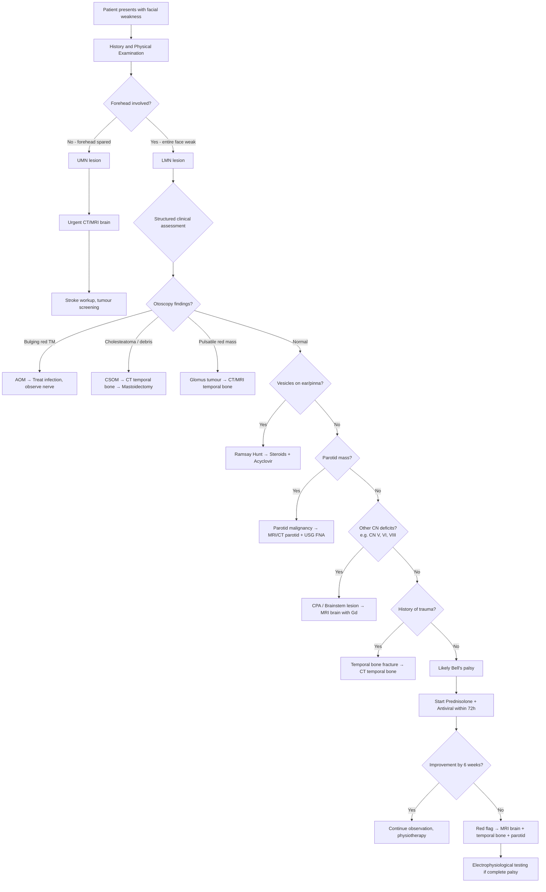
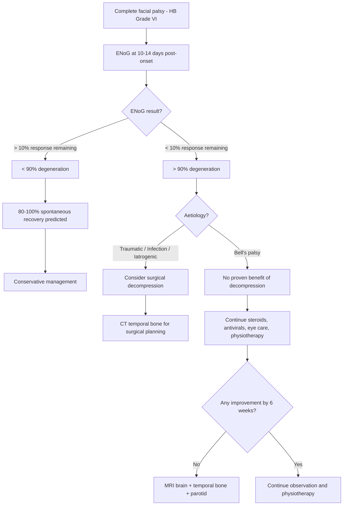

## Diagnostic Criteria, Algorithm and Investigations for Facial Nerve Palsy

### Key Principle: There Is No Single "Diagnostic Criterion" for Facial Nerve Palsy

Unlike conditions such as rheumatic fever (Jones criteria) or SLE (ACR/EULAR criteria), facial nerve palsy does not have a formal set of diagnostic criteria with sensitivity/specificity validation. The diagnosis is **clinical** — you see facial weakness, you confirm which muscles are affected, you determine UMN vs LMN, you localise the lesion, and then you either identify a cause or, by exclusion, label it Bell's palsy.

***Bell's palsy is a diagnosis by exclusion*** [1]. This means the "diagnostic criteria" for Bell's palsy are really a checklist of things you must rule out before you can apply the label.

---

### Diagnostic Criteria for Bell's Palsy (Clinical Diagnosis of Exclusion)

All of the following must be present to diagnose Bell's palsy:

| Criterion | Rationale |
|---|---|
| 1. **Acute onset** of unilateral facial weakness (over 1–2 days) | Gradual/progressive onset over weeks → think tumour. Bilateral → think GBS, sarcoidosis, Lyme. |
| 2. **LMN pattern** — upper AND lower face involved ipsilaterally | Forehead sparing → UMN → stroke, tumour. |
| 3. **No identifiable cause** on clinical examination | ***Physical exam to rule out other causes like CVA, parotid tumour, middle ear infection etc.*** [1] |
| 4. **No other cranial nerve deficits** | CN V/VI/VIII involvement → CPA lesion, brainstem pathology, skull base disease. |
| 5. **No vesicles on the ear** | Vesicles → Ramsay Hunt syndrome (VZV), not Bell's. ***Vesicles in herpes may not show up in first 2 days*** [1] — so re-examine the ear! |
| 6. **No parotid mass** | Parotid mass + facial weakness → malignant parotid tumour. |
| 7. **No history of trauma** | Recent head injury → temporal bone fracture. |
| 8. **No otological pathology on otoscopy** | Bulging TM → AOM. Retraction pocket/debris → cholesteatoma. Pulsatile red mass → glomus tumour. |
| 9. **Maximal weakness within 3 weeks** | ***May progress in the first 3 weeks — warn patient*** [1]. If still progressing beyond 3 weeks → not Bell's → investigate for tumour. |

<Callout title="The 6-Week Rule" type="error">
***Remember to consider other causes of facial nerve palsy if no improvement after 6 weeks*** [1]. Similarly, ***consider imaging if no improvement or deterioration after 6 weeks*** [1]. If a patient you've labelled as "Bell's palsy" isn't getting better by 6 weeks, you must step back and reconsider the differential — especially tumour.
</Callout>

---

### Severity Grading: House-Brackmann Classification [1][2]

This is the **standard grading system** used worldwide to document severity and track recovery. It's not a "diagnostic criterion" per se, but it's essential for clinical documentation, prognostication, and deciding on surgical intervention.

***House and Brackmann facial paralysis grading system*** [1]:

| Grade | Description | Key Landmarks | Clinical Significance |
|---|---|---|---|
| ***I*** | ***Normal facial function in all areas*** [1] | Symmetric at rest and during movement | Normal |
| ***II*** | ***Mild dysfunction*** [1] | ***Slight weakness noticeable on close inspection. Forehead: moderate-to-good function. Eye: complete closure with minimal effort. Mouth: slight asymmetry*** [1] | Good prognosis — nearly all recover fully |
| ***III*** | ***Moderate dysfunction*** [1] | ***Obvious but not disfiguring difference between the two sides. First time you can notice a difference at rest. Forehead: slight-to-moderate movement. Eye: complete closure with maximum effort. Mouth: slightly weak with maximum effort*** [1] | |
| ***IV*** | ***Moderately severe dysfunction*** [1] | ***Obvious weakness and/or disfiguring asymmetry. First time you have incomplete eye closure. No forehead movement. Forehead: no motion. Eye: incomplete closure. Mouth: asymmetric with maximum effort*** [1] | First grade with incomplete eye closure → corneal protection becomes critical |
| ***V*** | ***Severe dysfunction*** [1] | ***Only barely perceptible motion. At rest, asymmetry. Forehead: no movement. Eye: incomplete closure. Mouth: slight movement*** [1] | Poor spontaneous recovery |
| ***VI*** | ***Total paralysis*** [1][2] | ***No movement*** [1][2] | Worst prognosis. Consider electrophysiological testing to determine if surgical decompression is indicated. |

> **Why does grading matter clinically?** It determines prognosis (Grade II–III → excellent recovery; Grade V–VI → 30–40% may have permanent residual weakness), guides the urgency of eye protection (Grade IV+ need aggressive corneal care), and serves as baseline for monitoring treatment response.

---

### Diagnostic Algorithm

The approach is **stepwise and anatomy-driven**. Think of it as a funnel: start broad (UMN vs LMN), then narrow down based on clinical features, and only order investigations when clinically indicated. ***Investigations for facial nerve palsy depend on clinical findings*** [1].

---

### Investigation Modalities

The lecture is very clear: ***investigations for facial nerve palsy depend on clinical findings*** [1]. You do NOT shotgun-investigate every Bell's palsy patient. Investigations are indicated when:
- Clinical features suggest a specific cause (trauma, infection, tumour, CPA lesion)
- The presentation is atypical
- There is progression beyond 3 weeks
- There is no improvement or deterioration after 6 weeks
- Complete palsy (HB Grade VI) where electrophysiological testing guides surgical decision

Let's systematically go through each investigation.

---

#### A. Clinical Examination (The Most Important "Investigation")

***Clinical assessment of facial nerve: usually test motor function only. Test all 5 branches in a systematic manner. Examine other CNs. Examine the external ear and middle ear. Palpate the parotids and the neck.*** [1]

##### i. Motor Testing of CN VII [2]

| Branch tested | Action to request | Muscle tested |
|---|---|---|
| Temporal | "Raise your eyebrows" / "Wrinkle your forehead" | Frontalis |
| Zygomatic | "Close your eyes tightly — don't let me open them" | Orbicularis oculi |
| Buccal | "Show your teeth" / "Puff out your cheeks" | Levator anguli oris, buccinator, zygomaticus |
| Marginal mandibular | "Show your bottom teeth" / "Evert your lower lip" | Depressor anguli oris, depressor labii inferioris, mentalis |
| Cervical | "Tense your neck" | Platysma |

Why test each branch separately? Because a lesion beyond the stylomastoid foramen (e.g. parotid tumour, penetrating trauma) ***may only affect a single branch*** [1]. If only one branch is affected, the lesion is almost certainly **extratemporal**.

##### ii. UMN vs LMN Distinction [1][2]

- ***UMN: frontalis spared (bilateral innervation)*** [1] — lower face weak contralateral to lesion
- **LMN**: entire ipsilateral face weak including forehead
- **Exception**: Partial lesion at pes anserinus (parotid bifurcation) may spare temporal branch → mimics UMN [2]
- **Exception**: Brainstem lesion involving facial nucleus → LMN pattern despite "central" location [2]

##### iii. Localisation Tests [2]

***Tests that attempt to localise the site of lesion include Schirmer test for lacrimation, stapedial reflex and evaluation of taste and salivation*** [2]. The lecture organises localisation as follows [1]:

| Lesion site | Lacrimation | Taste | Stapedial reflex | Motor |
|---|---|---|---|---|
| ***Proximal to geniculate ganglion*** | ***Decreased*** [1] | ***Affected*** [1] | Absent (hyperacusis) | All ipsilateral |
| ***Between geniculate ganglion and stylomastoid foramen*** | ***Normal*** [1] | May be affected (depends on whether proximal or distal to chorda tympani) | ***Affected, hyperacusis present*** [1] | All ipsilateral |
| ***Beyond stylomastoid foramen*** | ***Normal*** [1] | Normal | ***Normal stapedial reflex*** [1] | Only motor affected (may be single branch) |

**Schirmer test**: A strip of filter paper is placed in the lower conjunctival fornix of both eyes. After 5 minutes, the length of wetting is measured. Reduced wetting on the affected side indicates reduced lacrimation → lesion proximal to geniculate ganglion (greater petrosal nerve involvement). Why does this work? Because the greater petrosal nerve carries parasympathetic fibres to the lacrimal gland. If the lesion is proximal to where this nerve branches off (at the geniculate ganglion), parasympathetic supply is lost and the gland produces less tears.

**Stapedial reflex (acoustic reflex)**: Tested with impedance audiometry/tympanometry. A loud sound is delivered, and the contraction of the stapedius muscle (which stiffens the ossicular chain) is measured as a change in middle ear compliance. If the nerve to stapedius is damaged (lesion in the mastoid segment, proximal to the nerve to stapedius branch), the reflex is absent on the affected side. Clinically, the patient may complain of **hyperacusis** — sounds perceived as uncomfortably loud because the stapedius cannot dampen stapes oscillation.

**Taste testing**: Cotton swab with sugar, salt, citric acid, or quinine is applied to the anterior 2/3 of the tongue unilaterally while the tongue is protruded. Loss of taste on the affected side indicates chorda tympani involvement → lesion proximal to chorda tympani departure (mastoid segment).

<Callout title="Practical Note on Localisation Tests">
The senior notes wisely point out that these localisation tests ***only have moderate accuracy and are of little practical benefit*** [2]. Why? Because (a) the tests have significant inter-observer variability, and (b) ***only a limited number of patients have lesions distal to the geniculate ganglion*** — most Bell's palsy lesions are at or proximal to the labyrinthine segment, so these tests won't differentiate much [2]. In practice, imaging (MRI) has largely replaced these bedside tests for precise localisation.
</Callout>

##### iv. Other Examination Components

- **Otoscopy**: Looking for AOM (bulging red TM), cholesteatoma (retraction pocket, squamous debris), glomus tumour (pulsatile red mass), vesicles (Ramsay Hunt), haemotympanum (temporal bone fracture)
- **Other CNs**: Especially CN V (corneal reflex, facial sensation), CN VI (lateral gaze), CN VIII (hearing — tuning fork tests, whispered voice). CPA lesions compress multiple nerves.
- **Parotid palpation**: Mass → urgent investigation for malignancy
- **Neck palpation**: Cervical lymphadenopathy → metastatic disease, lymphoma

---

#### B. Electrophysiological Testing

This is where the lecture dedicates significant attention. ***Investigations: electrophysiological testing and imaging*** [1].

##### i. Electroneurography (ENoG)

***Thought to be the most accurate of the electrodiagnostic tests*** [1].

***How it works*** [1]:
- ***Stimulate the facial nerve at the stylomastoid foramen*** [1]
- ***Summation potential is recorded in the nasal alar*** [1] (i.e. surface electrode over the nasalis muscle)
- ***The peak to peak amplitude is proportional to the number of intact axons*** [1]
- ***The two sides are compared as a percentage of response*** [1]

**Interpretation** [1][2]:
- The CMAP amplitude on the paralysed side is compared with the normal side
- A CMAP value of 10% of normal corresponds to a loss/degeneration of **90% of motor axons** on that side [2]
- ***90% degeneration — surgical decompression should be performed*** [1]
- ***Less than 90% degeneration within 3 weeks predicts 80–100% spontaneous recovery*** [1]

***Disadvantages: discomfort, cost, and test-retest variability*** [1]

**Why is 10 days post-onset the optimal timing?** Because Wallerian degeneration takes approximately 3–5 days to reach the distal stump after axonal injury. Before this, the distal nerve segment can still conduct (even though it's been disconnected from the cell body). Testing before 3 days post-onset may give falsely reassuring results because the distal axons haven't degenerated yet and will still conduct. By 10–14 days, all fibres that are going to degenerate have done so, giving a true picture of axonal loss [2].

<Callout title="Key Clinical Decision Point">
***ENoG < 10% response (i.e. > 90% degeneration) is the indication for considering surgical decompression*** [1]. This is a critical cut-off. If > 90% of axons are degenerated within the first 2 weeks, spontaneous recovery is poor and decompression may salvage the remaining fibres. If < 90% degeneration, the prognosis is excellent and surgery is not needed.
</Callout>

##### ii. Electromyography (EMG) [2]

A needle electrode is inserted into the facial muscles and recordings are made during rest and voluntary contraction.

**Interpretation** [2]:
| Finding | Timing | Meaning |
|---|---|---|
| Normal biphasic/triphasic motor unit potentials | Normal | Intact nerve-muscle unit |
| Fibrillation potentials | **10–21 days** post-injury | Indicates denervation — muscle fibres are spontaneously depolarising because they have lost their nerve supply. This confirms axonal loss (not just neuropraxia). |
| Polyphasic reinnervation potentials | **6–12 weeks** before clinical recovery | ***Earliest evidence of nerve recovery*** [2]. These are nascent motor units — regenerating axons are starting to re-innervate muscle fibres. Each axon innervates only a few fibres initially, hence the polyphasic morphology. |

**Why is EMG useful?** It can detect reinnervation (polyphasic potentials) **before** any clinical movement is visible — this is reassuring and means the nerve is recovering. It also helps confirm complete denervation (fibrillation only, no voluntary potentials) which has prognostic implications.

##### iii. Nerve Conduction Studies (NCS) [2]

**Technique** [2]:
- Facial nerve is supramaximally stimulated near the parotid gland
- Evoked potential (CMAP) is measured by surface electrodes over orbicularis oculi, nasalis, or lower facial muscles
- CMAP amplitude reflects the number of functioning motor axons
- Amplitude on paralysed side is compared with normal side at **10 days** post-onset

This is essentially the same principle as ENoG. In practice, ENoG and NCS are often used interchangeably, though ENoG specifically refers to the standardised protocol of stimulating at the stylomastoid foramen and recording at the nasal alar.

---

#### C. Imaging

***Investigations depend on clinical findings*** [1]. Here is when to order what:

##### i. ***MRI Brain — for suspected intracranial lesion*** [1]

| When to order | What you're looking for | Key findings |
|---|---|---|
| UMN facial palsy | Stroke, tumour, demyelination | Acute infarct on DWI (bright signal), enhancing mass, periventricular white matter plaques (MS) |
| Other CN deficits suggesting CPA/brainstem lesion | Acoustic neuroma, meningioma, pontine glioma | Enhancing CPA mass (schwannoma: heterogeneous; meningioma: homogeneous with dural tail), brainstem lesion |
| No improvement after 6 weeks (re-evaluation of Bell's palsy) | Occult tumour, inflammatory process | Enhancing lesion along facial nerve course |

MRI with **gadolinium contrast** is the gold standard for soft tissue imaging of the brain, CPA, and course of the facial nerve. In Bell's palsy, MRI may show enhancement of the facial nerve (especially at the fundus of the IAM and labyrinthine segment) — this confirms inflammation but is not routinely needed unless the diagnosis is uncertain.

***MRI: best soft tissue differentiation. Still cannot image the facial nerve or lingual nerve*** [1] — this refers specifically to **direct visualisation** of the normal thin nerve itself. However, MRI CAN detect pathological enhancement, thickening, or mass lesions along the nerve's course. The point is that a normal-appearing MRI doesn't exclude nerve pathology (e.g. early Bell's palsy).

##### ii. ***MRI/CT Temporal Bone — if middle ear pathology is suspected*** [1]

| When to order | What you're looking for | Key findings |
|---|---|---|
| Cholesteatoma | Bone erosion, soft tissue mass in middle ear/mastoid | **CT**: opacification of middle ear/mastoid, erosion of scutum, tegmen tympani, or facial canal. **MRI (DWI)**: restricted diffusion in cholesteatoma (distinguishes it from granulation tissue/fluid) |
| Facial nerve schwannoma | Expansion and enhancement along facial canal | Enhancing, fusiform mass expanding the facial canal, often at geniculate ganglion |
| Glomus tumour | Vascular mass in middle ear or jugular foramen | "Salt and pepper" enhancement on MRI; CT shows bone erosion at jugular foramen |
| AOM with complications | Extension of infection | Opacification of middle ear, possible abscess formation |

##### iii. ***CT Temporal Bone — temporal bone trauma*** [1]

| When to order | What you're looking for | Key findings |
|---|---|---|
| Head trauma + facial palsy | Fracture line involving the facial canal | **Longitudinal fracture**: parallel to long axis of petrous bone (~80% of temporal bone fractures), may involve tympanic or mastoid segment. **Transverse fracture**: perpendicular to petrous ridge (~20%), more likely to involve labyrinthine segment/geniculate ganglion → higher incidence of facial palsy and SNHL. Look for: fracture line crossing the facial canal, haemotympanum, ossicular disruption. |

Why CT and not MRI for trauma? CT is far superior for bone detail. It's fast, readily available, and exquisitely demonstrates the fine bony anatomy of the temporal bone, the fracture line, and its relationship to the facial canal. MRI is poor for bone.

##### iv. ***MRI/CT Parotid and USG FNA — if parotid lesion is suspected*** [1]

| When to order | What you're looking for | Key findings |
|---|---|---|
| Palpable parotid mass + facial weakness | Malignant parotid tumour, metastatic intraparotid node | **MRI**: defines extent of mass, relationship to facial nerve (though nerve itself may not be directly visualised), deep lobe extension. **CT**: bone involvement if advanced. **USG**: readily available, guides FNA. ***FNA cytology***: can discriminate benign from malignant tumours [2], though less specific for exact tumour subtype. |

##### v. Additional Imaging in Specific Scenarios

| Investigation | Indication | Rationale |
|---|---|---|
| **CT/MRI brain + nasopharynx** | Suspected NPC (Hong Kong endemic) | NPC at fossa of Rosenmüller can extend to skull base → multiple CN palsies |
| ***PET-CT scan*** [2] | Known malignancy, suspected metastatic disease | ***Identify primary disease or detect distant metastatic disease*** [2] |
| **CT angiography** | Glomus tumour | Vascular tumour — need to assess feeding vessels and relationship to carotid before surgery |

---

#### D. Blood Tests

Blood tests are NOT routinely indicated in straightforward Bell's palsy but are important for specific differentials:

| Test | Indication | What you're looking for |
|---|---|---|
| **FBC + ESR/CRP** | Infection (AOM, mastoiditis), inflammation | Leucocytosis, raised inflammatory markers |
| **Blood glucose / HbA1c** | All patients | Screen for diabetes mellitus (risk factor for Bell's palsy, affects prognosis) |
| **Lyme serology (anti-Borrelia IgM/IgG)** | Endemic area or travel history, bilateral palsy, erythema migrans | Positive serology confirms Lyme disease |
| **ACE level, calcium** | Suspected sarcoidosis (bilateral palsy, parotid swelling, uveitis) | Elevated ACE (non-specific), hypercalcaemia |
| **HIV serology** | Risk factors, bilateral palsy, atypical presentation | Seroconversion illness or immunosuppression |
| **VZV IgM / PCR** | Suspected Ramsay Hunt (but vesicles may be absent — "zoster sine herpete") | Confirms VZV reactivation |
| **Anti-ganglioside antibodies, CSF analysis** | Suspected GBS (bilateral palsy, ascending weakness, areflexia) | CSF: albuminocytological dissociation (raised protein, normal cells). Anti-GM1/GQ1b antibodies. |
| **CXR** | Sarcoidosis | Bilateral hilar lymphadenopathy |

---

### Putting It All Together: When to Investigate

| Scenario | Investigations needed |
|---|---|
| **Classic Bell's palsy** (acute onset, LMN, no red flags) | **None routinely**. Consider blood glucose. Start treatment empirically. |
| **No improvement or deterioration by 6 weeks** | ***Consider imaging*** [1] — **MRI brain + temporal bone + parotid** |
| **Complete palsy (HB Grade VI)** | **ENoG at 10–14 days** to assess degree of degeneration and guide surgical decision |
| **UMN pattern** | **Urgent CT/MRI brain** — stroke workup |
| **Ear pathology on otoscopy** | **CT temporal bone** (cholesteatoma, glomus) ± **MRI with DWI** |
| **Post-traumatic** | ***CT temporal bone*** [1] |
| **Parotid mass** | ***MRI/CT parotid + USG FNA*** [1] |
| **Other CN deficits** | **MRI brain with gadolinium** — CPA lesion, brainstem pathology |
| **Bilateral palsy** | Lyme serology, ACE level, CXR, HIV serology, consider LP (GBS) |
| **Recurrent palsy** | MRI temporal bone (facial nerve schwannoma), consider Melkersson-Rosenthal |
| **Progressive palsy > 3 weeks** | **MRI brain + temporal bone + parotid** — tumour until proven otherwise |

---

### Surgical Decompression: The Decision Algorithm

***Surgical decompression of nerve*** [1]:

***Indications*** [1]:
- ***Traumatic cause*** [1]
- ***Middle ear infection*** [1]
- ***Iatrogenic injury (middle ear or parotid surgery)*** [1]

***Bell's palsy — no proven benefits*** [1] (this is important — despite theoretical rationale, RCT evidence does not support routine surgical decompression for Bell's palsy)

***Earlier the better*** [1] — if decompression is indicated (e.g. traumatic cause with immediate complete palsy), do it as soon as possible before irreversible Wallerian degeneration sets in.

***Electrical testing as indication for decompression — ENoG < 10%*** [1]

***Imaging for site of decompression*** [1] — you need to know WHERE the nerve is compressed (CT temporal bone) to plan the surgical approach.

Surgical decompression ***should NOT be undertaken if facial paralysis has been present for 14 days or more since severe degeneration of facial nerve is probably irreversible after 2–3 weeks*** [2].

---

<Callout title="High Yield Summary — Diagnosis of Facial Nerve Palsy">

1. **Bell's palsy is a diagnosis of exclusion** — you must rule out stroke (UMN), trauma, infection (AOM, cholesteatoma, Ramsay Hunt), and tumour (parotid, CPA) by clinical examination before applying the label.
2. **Investigations depend on clinical findings** — do NOT shotgun-investigate uncomplicated Bell's palsy.
3. **House-Brackmann grading** (I–VI) documents severity and tracks recovery. Grade IV is the first with incomplete eye closure; Grade VI is total paralysis.
4. **ENoG is the most accurate electrodiagnostic test**: stimulate at stylomastoid foramen, record at nasal alar. > 90% degeneration (< 10% response) → consider surgical decompression. < 90% degeneration → 80–100% spontaneous recovery.
5. **Imaging**:
   - MRI brain → intracranial/CPA lesion
   - MRI/CT temporal bone → middle ear pathology
   - CT temporal bone → trauma
   - MRI/CT parotid + USG FNA → parotid mass
6. **Surgical decompression indications**: traumatic cause, middle ear infection, iatrogenic injury. NOT indicated for Bell's palsy (no proven benefit). Earlier is better. ENoG < 10% guides the decision.
7. **Red flag timeline**: progress beyond 3 weeks → investigate. No improvement by 6 weeks → image.

</Callout>

---

<ActiveRecallQuiz
  title="Active Recall - Diagnosis of Facial Nerve Palsy"
  items={[
    {
      question: "What electrodiagnostic test is considered the most accurate for facial nerve palsy, and how does it work?",
      markscheme: "Electroneurography (ENoG). Stimulate the facial nerve at the stylomastoid foramen, record the summation potential at the nasal alar. Peak-to-peak amplitude is proportional to the number of intact axons. The two sides are compared as a percentage. Performed at 10-14 days post-onset (to allow time for Wallerian degeneration to complete)."
    },
    {
      question: "What is the critical ENoG cut-off for considering surgical decompression, and what does it mean?",
      markscheme: "ENoG showing less than 10% response (i.e. greater than 90% axonal degeneration). This predicts poor spontaneous recovery. Less than 90% degeneration within 3 weeks predicts 80-100% spontaneous recovery. However, surgical decompression has no proven benefit in Bell's palsy specifically — indications are traumatic, infective, and iatrogenic causes."
    },
    {
      question: "A patient with Bell's palsy shows no improvement after 6 weeks. What should you do and why?",
      markscheme: "Consider imaging — MRI brain, temporal bone, and parotid with contrast. The diagnosis of Bell's palsy should be reconsidered because Bell's palsy should show some recovery within 6 months, and lack of any improvement by 6 weeks raises suspicion for an underlying tumour or other cause that was missed initially."
    },
    {
      question: "On EMG of facial muscles, you see fibrillation potentials at 14 days post-injury, then polyphasic reinnervation potentials at 8 weeks. Explain the significance of each.",
      markscheme: "Fibrillation potentials at 10-21 days: indicate denervation — muscle fibres are spontaneously depolarising because they have lost nerve supply, confirming axonal loss (not just neuropraxia). Polyphasic reinnervation potentials at 6-12 weeks: earliest evidence of nerve recovery — regenerating axons are starting to reinnervate muscle fibres. This is a reassuring sign of recovery even before clinical movement is visible."
    },
    {
      question: "List the imaging modality of choice for each of the following: (a) suspected CPA tumour, (b) temporal bone fracture, (c) parotid mass with facial weakness.",
      markscheme: "(a) MRI brain with gadolinium contrast — best for soft tissue, CPA masses enhance well. (b) CT temporal bone — superior bone detail, demonstrates fracture lines relative to facial canal. (c) MRI/CT parotid to define extent + USG-guided FNA for cytology to distinguish benign from malignant."
    },
    {
      question: "What are the three indications for surgical decompression of the facial nerve as per the lecture, and what is the one condition where it is NOT indicated?",
      markscheme: "Indications: (1) Traumatic cause with immediate complete palsy, (2) Middle ear infection, (3) Iatrogenic injury during middle ear or parotid surgery. NOT indicated: Bell's palsy — no proven benefits. Earlier decompression is better; should not be undertaken if paralysis has been present for more than 14 days as degeneration may be irreversible."
    }
  ]}
/>

---

## References

[1] Lecture slides: GC 217. Facial nerve palsy and salivary gland diseases.pdf (p9, p10, p11, p14, p16, p17, p18, p19, p20, p47, p81)
[2] Senior notes: felixlai.md (sections on Facial nerve palsy diagnosis pp. 206, 212–214)
