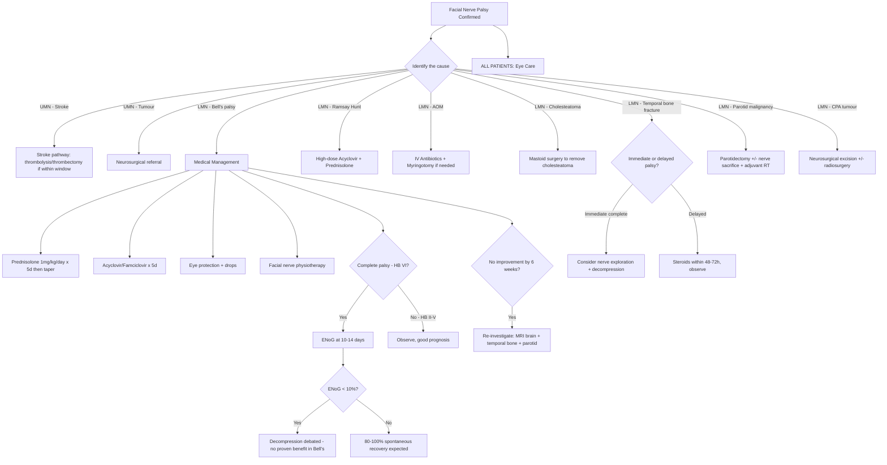

## Management of Facial Nerve Palsy

### Overarching Principle

The management of facial nerve palsy follows a simple logical hierarchy:

***Identify the cause*** [1] → ***Remove the causative agent*** [1] → Protect the eye → Rehabilitate the nerve.

The specific management depends entirely on the **aetiology**. Bell's palsy (idiopathic) is managed medically. Secondary causes are managed by treating the underlying pathology. Surgical intervention is reserved for specific indications. Let's build this from first principles.

---

### Master Management Algorithm

---

### I. Management of Bell's Palsy (The Commonest Scenario)

***Bell's palsy: Idiopathic facial nerve palsy. Commonest cause of facial nerve palsy. > 90% good recovery.*** [1]

***Management of Bell's palsy: Diagnosis by exclusion. Physical exam to rule out other causes like CVA, parotid tumour, middle ear infection etc.*** [1]

#### Step 0: Confirm the Diagnosis

Before you treat, you must be confident this IS Bell's palsy:
- ***Physical exam to rule out other causes like CVA, parotid tumour, middle ear infection etc.*** [1]
- ***Diagnosis by exclusion*** [1]
- ***May progress in the first 3 weeks — warn patient*** [1]

#### Step 1: Corticosteroids

***Reduce swelling with steroids — prednisolone 1mg/kg/day in daily dose for 5 days then taper if no contraindications*** [1]

| Parameter | Detail |
|---|---|
| Drug | **Prednisolone** (or prednisone — equivalent) |
| Dose | ***1 mg/kg/day*** [1] (typically 60 mg/day for an average adult) |
| Duration | ***5 days at full dose, then taper*** [1] over the next 5 days (total course ~10 days) |
| Timing | Must start **within 72 hours** of onset for maximum benefit. Evidence shows benefit diminishes if started after 72 hours. |
| Contraindications | Active peptic ulcer disease, uncontrolled diabetes mellitus (steroids cause hyperglycaemia — still give steroids but monitor glucose closely and adjust diabetic medications), active TB, systemic fungal infections, psychosis. **Pregnancy** — use with caution (discuss risk-benefit). |

**Why steroids?** The pathophysiology of Bell's palsy is nerve oedema within the rigid bony facial canal → compression → ischaemia. Corticosteroids are potent anti-inflammatory agents that reduce oedema, suppress the inflammatory cascade (inhibit phospholipase A2 → ↓ prostaglandins and leukotrienes), and reduce capillary permeability. By reducing swelling, you decompress the nerve pharmacologically and break the vicious cycle of oedema → ischaemia → more oedema.

**Evidence**: The landmark **Scottish Bell's Palsy Study (Sullivan et al., NEJM 2007)** demonstrated that early prednisolone significantly improved complete recovery rates at 3 and 9 months. This is Level 1 evidence and forms the basis of current guidelines worldwide.

<Callout title="High Yield">
Steroids are the **single most important** medical treatment for Bell's palsy. If you remember nothing else about Bell's palsy management, remember: **prednisolone 1 mg/kg/day for 5 days then taper, started within 72 hours**.
</Callout>

#### Step 2: Antivirals

***Antiviral — acyclovir or famciclovir for 5 days*** [1]

| Parameter | Detail |
|---|---|
| Drugs | **Acyclovir** 400 mg 5×/day for 5–7 days, OR **Famciclovir** 500 mg TDS for 5–7 days, OR **Valacyclovir** 1 g TDS for 5–7 days |
| Rationale | ***? Herpes reactivation neuritis*** [1] — if HSV-1 reactivation is the underlying cause, antivirals inhibit viral DNA polymerase and halt viral replication |
| Evidence | Antivirals **alone** do not significantly improve outcomes. **Combined** with steroids, they may provide modest additional benefit, particularly in **severe palsy** (HB Grade V–VI) [2]. The benefit is debated, but the side effect profile is very favourable, so most protocols include them. |
| Timing | Start within 72 hours of symptom onset, ideally simultaneously with steroids |
| Special note | ***Vesicles in herpes may not show up in first 2 days*** [1] — this is why we give antivirals empirically even without vesicles. If vesicles subsequently appear, the diagnosis shifts to Ramsay Hunt syndrome, and antiviral dose should be escalated. |

**Why acyclovir/famciclovir/valacyclovir?** These are all **guanosine analogues**. "Acyclovir" = "a-cyclic" guanosine → lacks the sugar ring of normal nucleosides. Once phosphorylated (first by viral thymidine kinase, then by cellular kinases), it is incorporated into the growing viral DNA chain and acts as a **chain terminator** because it lacks the 3'-OH group needed for the next nucleotide to attach. This is selective for virus-infected cells because only cells with active viral thymidine kinase can perform the first phosphorylation step. Famciclovir is a prodrug of penciclovir (similar mechanism, better oral bioavailability). Valacyclovir is a prodrug of acyclovir (better bioavailability = higher plasma levels = can use less frequent dosing).

**Contraindications**: Renal impairment (acyclovir is renally cleared and can cause crystalline nephropathy — adjust dose for eGFR). Ensure adequate hydration.

#### Step 3: Eye Protection

***Eye protection and eye drops*** [1]

This is **critical** and often underemphasised. The eye is at risk because:
1. **Orbicularis oculi weakness** → incomplete lid closure (lagophthalmos) → corneal exposure
2. **Loss of greater petrosal nerve function** (in proximal lesions) → decreased lacrimation → dry cornea
3. **Loss of corneal blink reflex** (afferent CN V is intact, but efferent CN VII is weak) → cornea is exposed to desiccation, foreign bodies, and trauma

Untreated exposure keratitis can progress to corneal ulceration → corneal scarring → permanent visual impairment. This is the **most important preventable complication** of facial nerve palsy.

| Measure | Details | When |
|---|---|---|
| **Artificial tears / lubricating eye drops** | Hypromellose or carboxymethylcellulose drops, applied frequently during the day (every 1–2 hours) | All patients with incomplete eye closure [1][2] |
| **Lubricating eye ointment** | Thicker than drops (e.g. lacrilube, chloramphenicol ointment), provides longer-lasting corneal coverage | At night (blurs vision, so not practical during the day) |
| **Protective glasses / moisture chamber glasses** | Prevents evaporation, protects from wind and debris | Outdoors, during the day |
| **Taping the eyelid shut** | Micropore tape applied to close the eye | At night to prevent nocturnal lagophthalmos |
| **Gold weight implantation into upper eyelid** [2] | A small gold weight (0.8–1.6 g) is surgically inserted into the upper eyelid → gravity assists lid closure; uses the weight of gold to enable passive closure. Reversible if nerve recovers. | Prolonged incomplete eye closure (usually considered after 3–6 months if no recovery) |
| **Tarsorrhaphy** [2] | Surgical partial closure of the palpebral fissure by suturing the lateral eyelid margins together. Effective but ***poor cosmetic outcomes*** [2]. | Last resort for corneal protection if other measures fail |

<Callout title="Never Forget the Eye" type="error">
In the acute management of facial nerve palsy, students (and doctors) often focus on steroids and antivirals while neglecting eye care. **Corneal damage from exposure is the most important acute complication** and is entirely preventable. Every patient with HB Grade III or worse needs explicit eye protection instructions. Document that you've counselled the patient.
</Callout>

#### Step 4: Physiotherapy

***Facial nerve physiotherapy — maintain muscle tone and hasten recovery*** [1]

| Modality | Rationale |
|---|---|
| **Facial exercises** (active and passive) | Maintain muscle bulk and tone; prevent disuse atrophy during the period of denervation. Includes exercises like raising eyebrows, closing eyes, puffing cheeks, smiling. |
| **Mime therapy** | Structured programme of facial expression exercises. Evidence suggests it improves outcomes and reduces synkinesis. |
| **Massage** | Improves blood flow to facial muscles, reduces stiffness |
| **Electrical stimulation** | Controversial — some evidence that neuromuscular electrical stimulation maintains muscle bulk, but may promote synkinesis if started too early. Usually reserved for complete denervation. |
| **Acupuncture** | Popular in Hong Kong. Limited evidence from RCTs, but commonly used as adjunctive therapy [2]. |

#### Step 5: Follow-Up and Reassessment

***Remember to consider other causes of facial nerve palsy if no improvement after 6 weeks*** [1]
***Consider imaging if no improvement or deterioration after 6 weeks*** [1]

| Timepoint | Action |
|---|---|
| 1–2 weeks | Review: is the palsy progressing? Re-examine ear for vesicles (Ramsay Hunt). Grade with House-Brackmann. Eye check. |
| 3 weeks | Maximal weakness should have been reached by now. If still progressing → investigate (not Bell's). |
| 6 weeks | If **no improvement** → re-image (MRI brain + temporal bone + parotid). Reconsider diagnosis. |
| 3–6 months | Most Bell's palsy patients recover by this time. If residual weakness → consider rehabilitation. |
| > 6 months | If no recovery → consider surgical reanimation (see below). |

---

### II. Management of Specific Causes

***Treatment of facial palsy: Identify the cause. Remove the causative agent e.g. mastoid surgery to remove the cholesteatoma. Consider nerve exploration and decompression in traumatic cause with immediate complete palsy.*** [1]

#### A. Ramsay Hunt Syndrome (VZV)

| Treatment | Details |
|---|---|
| **High-dose antiviral** | Acyclovir 800 mg 5×/day for 7–10 days (higher dose and longer course than Bell's palsy because confirmed VZV reactivation), OR valacyclovir 1 g TDS for 7 days |
| **Corticosteroids** | Prednisolone 1 mg/kg/day tapering over 10–14 days (same rationale as Bell's — reduce oedema) |
| **Analgesia** | Severe otalgia is common — may need neuropathic pain agents (gabapentin, pregabalin) in addition to simple analgesics |
| **Eye care** | As above |
| **Prognosis** | Worse than Bell's palsy — only ~50–70% achieve satisfactory recovery |

Why higher antiviral dose? VZV is inherently **less sensitive** to acyclovir than HSV (higher IC50), so you need higher drug concentrations to achieve adequate viral suppression. VZV also tends to cause more extensive neural destruction (geniculate ganglionitis), hence the worse prognosis.

#### B. Acute Otitis Media (AOM)

| Treatment | Details |
|---|---|
| **IV antibiotics** | Target middle ear pathogens (S. pneumoniae, H. influenzae, M. catarrhalis). IV amoxicillin-clavulanate or ceftriaxone. |
| **Myringotomy ± grommet** | Drainage of middle ear pus reduces pressure and removes the inflammatory milieu around the exposed nerve |
| **Corticosteroids** | May be given to reduce nerve oedema |
| **Prognosis** | Generally good if infection is treated promptly — facial palsy usually resolves with infection control |

Why does treating the infection help the nerve? The facial canal's tympanic segment is often dehiscent (~50% of people). Infection and pus in the middle ear directly bathe and compress the exposed nerve. Draining the infection and killing bacteria removes the inflammatory stimulus.

#### C. Cholesteatoma (Unsafe CSOM)

***Remove the causative agent e.g. mastoid surgery to remove the cholesteatoma*** [1]

| Treatment | Details |
|---|---|
| **Mastoidectomy** | Definitive surgical removal of the cholesteatoma. The eroding keratinising epithelium must be completely excised to prevent recurrence and further bone destruction. |
| **Facial nerve decompression** | If the cholesteatoma has eroded the facial canal and compressed the nerve, the surgeon will decompress the nerve at the same time as removing the cholesteatoma. |
| **Timing** | Semi-urgent — cholesteatoma is a slowly progressive but destructive process. Once facial palsy has developed, surgery should not be delayed. |

#### D. Temporal Bone Fracture

***Consider nerve exploration and decompression in traumatic cause with immediate complete palsy*** [1]

| Scenario | Management | Rationale |
|---|---|---|
| **Immediate complete palsy** | ***Nerve exploration and decompression*** [1] → consider within 2–3 weeks (before irreversible degeneration). CT temporal bone to locate fracture site. ENoG to guide decision. | Immediate onset suggests nerve transection or severe compression by bone fragment. Early surgical exploration can decompress or repair the nerve. ***Earlier the better*** [1]. |
| **Delayed palsy** (develops days after injury) | ***Steroids within 48–72 hours*** [2] → observe. ENoG if complete palsy. | Delayed onset suggests post-traumatic oedema or haematoma rather than transection. Most cases recover with conservative management. ***Failure to respond to steroids can be considered for surgical decompression of petrous portion of facial nerve*** [2]. |
| **Incomplete palsy** (any onset) | Conservative — steroids, observation | Incomplete palsy means some axons are intact → excellent prognosis |

#### E. Parotid Malignancy

| Treatment | Details |
|---|---|
| **Parotidectomy** | Complete surgical excision is the cornerstone [2]. If the nerve is encased/invaded by tumour, **nerve sacrifice** may be necessary — this is one of the few situations where the facial nerve is deliberately cut. |
| **Nerve grafting** (if nerve sacrificed) | See nerve repair section below |
| **Adjuvant radiotherapy** | For high-grade malignancy, positive margins, perineural invasion, lymph node involvement |
| **Specific examples** | ***Adenoid cystic carcinoma: complete local excision; tendency for perineural invasion → ? facial nerve sacrifice; postoperative XRT. Prognosis: local recurrence 40%, distant metastasis common (lung), indolent course — 5-year survival 75%, 20-year survival 13%*** [1] |

#### F. CPA Tumour (Acoustic Neuroma / Meningioma)

| Treatment | Details |
|---|---|
| **Surgical excision** | Microsurgical removal via translabyrinthine, retrosigmoid, or middle cranial fossa approach. Facial nerve preservation is a primary surgical goal. |
| **Stereotactic radiosurgery** (Gamma Knife) | Alternative for small tumours ( < 3 cm) or patients unfit for surgery. Controls tumour growth in ~90%. |
| **Observation + serial MRI** | For small, asymptomatic tumours (especially in elderly patients) — "watch, wait, and rescan" |

---

### III. Surgical Management — Nerve Repair and Reanimation

When the facial nerve is **irreversibly damaged** (transection, resection for malignancy, or failed recovery after > 12–18 months), surgical options exist to restore some facial function. The lecture covers this in detail [1].

#### A. Nerve Repair Techniques

***Facial nerve grafting*** [1]:

| Technique | Details | Indication |
|---|---|---|
| ***Primary anastomosis*** [1] | Direct end-to-end repair of the cut nerve stumps | ***Only if tension-free*** [1]. If you can bring both ends together without stretching, this gives the best result. Usually possible only if a very short segment is missing. |
| ***Sural nerve or great auricular nerve grafting*** [1] | A segment of a sensory nerve is harvested and used as a cable graft to bridge the gap between proximal and distal facial nerve stumps | ***Primary resection of nerve in parotid cancer. Damage of a segment of nerve in traumatic cases*** [1]. Sural nerve is from the posterior calf (purely sensory — no motor deficit from harvest). Great auricular nerve is conveniently in the same surgical field during parotidectomy. |
| ***Facial-hypoglossal anastomosis*** [1] | The distal stump of the facial nerve is anastomosed to the **hypoglossal nerve (CN XII)** | ***If grafting not feasible*** [1]. This "borrows" motor axons from CN XII to reinnervate the face. Disadvantage: sacrifice of CN XII → ipsilateral tongue weakness and atrophy. Patient needs to "think about moving their tongue" to move their face initially, but cortical plasticity eventually allows more natural movement. |
| ***Cross-facial nerve grafting*** [1] | ***Anastomosis of normal contralateral buccal branch to the defective side*** [1] | When the proximal facial nerve stump is unavailable (e.g. destroyed by tumour near brainstem). A sural nerve graft is tunnelled across the face from the functioning buccal branch on the normal side to the defective side. Provides some voluntary symmetric movement. Takes 6–12 months for axons to grow across the graft. |

**Why sural nerve for grafting?** It is long (up to 40 cm can be harvested), purely sensory (no motor deficit from loss), easily accessible at the posterior calf, and has a consistent anatomy. The great auricular nerve is an alternative — it's shorter but is already in the surgical field during parotidectomy, saving a second incision.

**Why does nerve grafting work?** After the graft is placed, the proximal axons undergo **Wallerian degeneration** of the distal graft segment first, then regenerating axons from the proximal stump grow through the graft's Schwann cell tubes (which act as scaffolding) at a rate of ~1 mm/day. The graft provides a structural conduit (the endoneurial tubes) that guides regenerating axons to the distal target muscles.

#### B. Facial Reanimation (for Long-Standing Palsy)

When nerve repair/grafting is not possible or has failed, **static and dynamic reanimation procedures** can improve aesthetics and function [1].

***Surgery for facial reanimation*** [1]:

| Technique | Details | Outcome |
|---|---|---|
| ***Fascial sling*** [1] | ***Aesthetic correction. Static sling to correct drooping of angle of mouth*** [1]. A strip of fascia lata (from the thigh) is tunnelled from the oral commissure to the zygomatic arch or temporal fascia to support the drooping mouth corner. | Restores facial symmetry at rest but does NOT provide movement. |
| ***Muscle sling — temporalis transfer*** [1] | ***Suture temporalis muscle to angle of mouth, can have voluntary movement*** [1]. The temporalis muscle (innervated by CN V3, trigeminal nerve) is detached from the coronoid process and its tendon is rerouted to the oral commissure. | Patient can achieve a smile by **clenching their jaw** (activating temporalis). Over time, cortical plasticity may allow more natural activation. |
| ***Free gracilis muscle graft with neurovascular bundle*** [1] | A segment of gracilis muscle (from the medial thigh) is transferred to the face as a **free flap** with its artery, vein, and obturator nerve. The nerve is anastomosed to either the cross-facial nerve graft or the masseteric nerve (CN V3). | Gold standard for facial reanimation in long-standing complete palsy. Provides dynamic, voluntary smile. Two-stage procedure if using cross-facial nerve graft. |

---

### IV. Summary: Management by Aetiology

| Cause | Key Management | Special Notes |
|---|---|---|
| ***Bell's palsy*** | Prednisolone 1mg/kg/day × 5d + taper. Acyclovir/famciclovir × 5d. Eye care. Physiotherapy. | ***> 90% good recovery*** [1]. ***No proven benefit of surgical decompression*** [1]. |
| **Ramsay Hunt** | High-dose acyclovir (800 mg 5×/d) × 7–10d + prednisolone. Eye care. | Worse prognosis than Bell's (~50–70% recovery). |
| **AOM** | IV antibiotics, myringotomy. Steroids. | Facial palsy usually resolves with infection control. |
| ***Cholesteatoma*** | ***Mastoid surgery to remove cholesteatoma*** [1]. Facial nerve decompression. | Semi-urgent surgical indication. |
| **Temporal bone fracture** | Immediate complete palsy → ***nerve exploration and decompression*** [1]. Delayed → steroids, observe. | ***Earlier the better*** [1]. ***ENoG < 10% → decompression*** [1]. |
| **Parotid malignancy** | Parotidectomy ± nerve sacrifice + adjuvant RT. Nerve grafting if resected. | ***Sural nerve or great auricular nerve grafting*** [1]. |
| **CPA tumour** | Microsurgical excision or stereotactic radiosurgery. | Facial nerve preservation is primary surgical goal. |
| **GBS** | IVIG or plasmapheresis. Supportive care. | Bilateral palsy; treat underlying cause. |
| **Sarcoidosis** | Systemic corticosteroids ± steroid-sparing agents. | Heerfordt syndrome: bilateral parotid + uveitis + facial palsy. |

---

### V. Complications of Parotidectomy (Relevant to Facial Nerve)

Since parotidectomy is one of the most common operations where facial nerve injury occurs, and the lecture explicitly covers this [1]:

***Parotidectomy — Complications*** [1]:

**Early** [1]:
- ***Bleeding / haematoma*** [1]
- ***Facial nerve palsy*** [1]
  - ***Transient ~5%*** [1] — due to traction, oedema, or cautery near the nerve. Usually recovers in weeks to months.
  - ***Permanent ~1%*** [1] — due to transection, excessive cautery, or entrapment. Requires nerve repair/grafting.
- ***Wound infection*** [1]
- ***Salivary fistula*** [1] — saliva leaks through the wound because residual parotid tissue continues to secrete. Usually self-limiting. Can be managed with pressure dressings and anticholinergics.

**Late** (from the senior notes) [2]:
- **Frey syndrome** (auriculotemporal syndrome / gustatory sweating) — sweating and flushing of the cheek during eating. Caused by **aberrant regeneration** of parasympathetic secretomotor fibres: after the auriculotemporal nerve is cut during parotidectomy, regenerating parasympathetic fibres (originally destined for salivary glands) grow into the severed sympathetic fibres that innervate sweat glands and cutaneous blood vessels. When the patient eats (triggering parasympathetic salivatory response), sweat glands and vessels in the parotid bed are stimulated instead → gustatory sweating and flushing. Affects ~30–50% of parotidectomy patients. Treatment: topical antiperspirant (glycopyrrolate cream), botulinum toxin injection.
- **Numbness of ear lobe** — great auricular nerve is often sacrificed during parotidectomy.

---

### VI. Surgical Decompression — Detailed Indications and Contraindications

***Surgical decompression of nerve*** [1]:

| | Details |
|---|---|
| ***Indications*** | ***Traumatic cause*** [1]; ***Middle ear infection*** [1]; ***Iatrogenic injury — middle ear or parotid surgery*** [1] |
| ***Bell's palsy*** | ***No proven benefits*** [1] — RCTs have not demonstrated significant improvement with decompression in Bell's palsy over medical therapy alone |
| ***Timing*** | ***Earlier the better*** [1]. Should NOT be undertaken if paralysis has been present for 14 days or more [2] — by this time, severe Wallerian degeneration is likely irreversible |
| ***Electrophysiological guidance*** | ***Electrical testing as indication for decompression — ENoG < 10%*** [1] |
| ***Imaging*** | ***Imaging for site of decompression*** [1] — CT temporal bone to localise the fracture line or area of compression, so the surgeon knows where to decompress |
| **Approach** | Transmastoid approach (most common) — opens the mastoid, identifies the nerve in the mastoid segment, and removes bone over the compressed segment. Middle cranial fossa approach — for labyrinthine segment decompression (more technically demanding). |
| **Contraindications** | Paralysis > 14 days (probably irreversible); patient unfit for general anaesthesia; incomplete palsy with good prognosis (doesn't need surgery) |

---

<Callout title="High Yield Summary — Management of Facial Nerve Palsy">

1. **Bell's palsy**: Prednisolone 1 mg/kg/day × 5 days then taper + acyclovir/famciclovir × 5 days + eye protection + physiotherapy. > 90% recover. Warn patient it may progress in first 3 weeks. Re-investigate if no improvement by 6 weeks.
2. **Eye care is critical** — lagophthalmos → exposure keratitis → corneal ulceration. All patients with incomplete eye closure need artificial tears (day), ointment + taping (night), and consideration of gold weight implantation if prolonged.
3. **Identify and treat the cause**: mastoid surgery for cholesteatoma, nerve exploration for traumatic immediate complete palsy, parotidectomy for malignancy.
4. **Surgical decompression** is indicated for traumatic, infective, and iatrogenic causes. NOT for Bell's palsy (no proven benefit). Earlier is better. ENoG < 10% guides the decision.
5. **Nerve repair options**: primary anastomosis (tension-free), sural/great auricular nerve grafting, facial-hypoglossal anastomosis (if grafting not feasible), cross-facial nerve grafting.
6. **Facial reanimation** for long-standing palsy: fascial sling (static), temporalis muscle transfer (dynamic), free gracilis muscle graft (gold standard for dynamic reanimation).
7. **Parotidectomy complications**: transient facial palsy ~5%, permanent ~1%, Frey syndrome (gustatory sweating from aberrant parasympathetic regeneration).

</Callout>

---

<ActiveRecallQuiz
  title="Active Recall - Management of Facial Nerve Palsy"
  items={[
    {
      question: "Outline the complete medical management of Bell's palsy, including drug names, doses, and duration.",
      markscheme: "Prednisolone 1 mg/kg/day for 5 days then taper over next 5 days (start within 72 hours). Acyclovir 400mg 5x/day OR famciclovir 500mg TDS for 5 days. Eye protection: artificial tears during the day, lubricating ointment and tape at night. Facial nerve physiotherapy to maintain muscle tone and hasten recovery. Warn patient palsy may progress in first 3 weeks. Reconsider diagnosis if no improvement by 6 weeks."
    },
    {
      question: "What are the three indications for surgical decompression of the facial nerve, and what is the one condition where decompression is NOT indicated?",
      markscheme: "Indications: (1) Traumatic cause with immediate complete palsy, (2) Middle ear infection, (3) Iatrogenic injury during middle ear or parotid surgery. NOT indicated: Bell's palsy — no proven benefits. ENoG < 10% response is used as the electrophysiological indication. Timing: earlier the better; should not be done if paralysis present > 14 days."
    },
    {
      question: "A patient has total facial paralysis after parotidectomy with nerve sacrifice for adenoid cystic carcinoma. What nerve grafting options are available?",
      markscheme: "Primary anastomosis — only if tension-free. Sural nerve graft or great auricular nerve graft — to bridge the gap between proximal and distal stumps. If proximal stump not available: facial-hypoglossal anastomosis (sacrifice CN XII; if grafting not feasible). Cross-facial nerve grafting — anastomosis of contralateral normal buccal branch to defective side via sural nerve cable graft."
    },
    {
      question: "What is Frey syndrome, what causes it, and how is it treated?",
      markscheme: "Frey syndrome (auriculotemporal syndrome / gustatory sweating): sweating and flushing of facial skin over the parotid bed during eating. Caused by aberrant regeneration of cut parasympathetic fibres after parotidectomy — secretomotor fibres destined for salivary glands grow into sympathetic fibres supplying sweat glands and cutaneous vessels. Treatment: topical glycopyrrolate cream, botulinum toxin injection."
    },
    {
      question: "A patient presents with facial palsy following a head injury. How would you distinguish between immediate and delayed onset palsy, and how does management differ?",
      markscheme: "Immediate palsy: onset at time of injury, suggests nerve transection or severe bony compression. Management: consider nerve exploration and decompression (earlier the better). CT temporal bone to localise fracture. ENoG at 10-14 days. Delayed palsy: develops days after injury, suggests post-traumatic oedema or haematoma. Management: steroids within 48-72 hours, observe. Most recover conservatively. Failure to respond to steroids may prompt consideration of surgical decompression."
    },
    {
      question: "Name three surgical options for facial reanimation in long-standing complete facial palsy and explain the principle of each.",
      markscheme: "(1) Fascial sling — static correction; fascia lata strip from commissure to zygoma suspends drooping mouth; improves symmetry at rest but no movement. (2) Temporalis muscle transfer — dynamic; temporalis muscle rerouted to oral commissure; patient smiles by clenching jaw (CN V3 innervation). (3) Free gracilis muscle graft — gold standard dynamic reanimation; gracilis muscle with obturator nerve transferred as free flap; nerve anastomosed to cross-facial nerve graft or masseteric nerve; provides voluntary smile."
    }
  ]}
/>

---

## References

[1] Lecture slides: GC 217. Facial nerve palsy and salivary gland diseases.pdf (p14, p16, p17, p18, p19, p20, p21, p24, p62, p69, p79)
[2] Senior notes: felixlai.md (sections on Facial nerve palsy treatment pp. 213–214, temporal bone fracture management p. 1124, parotidectomy complications p. 234)
