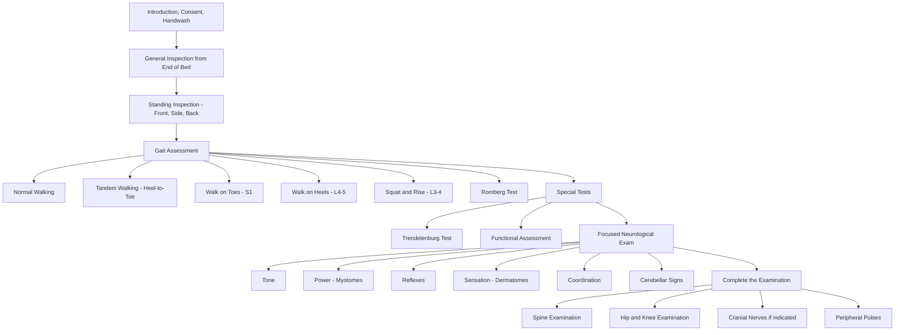

# Gait Examination

## Master Examination Flowchart

---

## General Approach (3Cs + 1H)

Before you touch the patient, set the stage properly. This is easy marks in the OSCE and students lose them by rushing.

- **Introduce yourself**: "Hello, my name is [Name], I am a medical student. May I confirm your name and date of birth?"
  - 「你好，我係醫學生[名]，可唔可以確認你嘅名同出生日期？」
- **Consent**: "I would like to examine your walking and do some tests on your legs. Is that okay?"
  - 「我想睇下你行路同埋檢查下你雙腳，可以嗎？」
- **Chaperone**: Offer a chaperone if appropriate (especially if exposure is needed).
- **Hand hygiene**: "Before I begin, I would wash my hands." (State this verbally in OSCE.)
- **Positioning**: Patient starts in **standing position** wearing only underwear or shorts, with the **entire lower limbs exposed**. Ensure adequate space for the patient to walk at least 5–10 metres. [1][2]
- **Exposure**: Ideally the full lower limbs should be visible — both legs from the hips down — along with the feet.

<Callout title="Don't Skip the Setup" type="error">
A common OSCE pitfall is not adequately exposing the patient. Gait abnormalities such as pelvic tilt, muscle wasting, and foot drop are invisible through trousers. Always ask the patient to remove trousers or roll them above the knees.
</Callout>

---

## General Inspection

Before asking the patient to walk, spend 10–15 seconds doing a **panoramic sweep** from the end of the bed/room.

### Around the Bedside / Room
- **Walking aids**: frame, stick (which side?), crutches, wheelchair
- **Orthotic devices**: ankle-foot orthosis (AFO), knee brace, shoe raises
- **Footwear**: adapted shoes, uneven wear patterns on soles (medial wear = valgus; lateral wear = varus)

### On First Glance at the Patient
- **Body habitus**: obesity (affects gait mechanics), cachexia (malignancy, neurodegeneration)
- **Distress level**: pain at rest? guarding?
- **Posture**: stooped (Parkinsonism), kyphosis (ankylosing spondylitis), listing to one side (disc herniation) [3]
- **Skin changes**: bruising, surgical scars (hip/knee replacements, spinal surgery)
- **Abnormal involuntary movements**: resting tremor (Parkinsonism), chorea, myoclonus
- **Muscle wasting**: quadriceps, gluteals, calf — visible asymmetry
- **Urinary catheter**: may indicate spinal cord pathology [4]
- **Facies**: masked facies (Parkinsonism), Cushingoid (steroid myopathy) [5]

**Model commentary:**
> "On general inspection, the patient is an elderly gentleman standing independently without walking aids. He appears comfortable at rest. I can see a midline scar over the lumbar spine and bilateral quadriceps appear symmetrical. There is no obvious tremor or involuntary movement. I do not see any walking aids, catheter, or orthotic devices at the bedside."

---

## Systematic Gait Examination Sequence

### Step 1: Standing Inspection (Before Walking)

Ask the patient to stand with heels together and toes pointing forward.

#### From the Front:
| What to look for | Normal | Abnormal | Pathophysiological Basis |
|---|---|---|---|
| Alignment | Slight genu valgum (5° M, 7° F) [2] | Genu varum / valgum | OA (varum) or RA (valgum) |
| Muscle bulk | Symmetrical quadriceps and tibialis anterior | Asymmetric wasting | Disuse, denervation (L3-4 for quads) |
| Foot posture | Medial longitudinal arch present | Pes planus / pes cavus | Pes cavus → hereditary neuropathy (CMT) |
| Pelvic level | ASIS at same height | Pelvic tilt | Leg length discrepancy or scoliosis |

#### From the Side:
- **Lumbar lordosis**: increased → fixed flexion deformity at hip; decreased → ankylosing spondylitis [6]
- **Thoracic kyphosis**: "question mark" posture in AS [6]
- **Knee position**: flexion deformity, hyperextension (genu recurvatum)

#### From Behind:
- **Gluteal wasting**: compare both sides — suggests L5/S1 radiculopathy or hip pathology
- **Spinal alignment**: scoliosis, listing (***lateral lean away*** from or ***towards*** the side of a disc prolapse) [3]
- **Calf bulk**: asymmetry → S1 denervation; pseudohypertrophy → muscular dystrophy
- **Heel alignment**: valgus heel (pes planovalgus), varus heel

**Model commentary:**
> "Looking from the front with heels together, I can see mild bilateral genu varum. The quadriceps appear symmetrical. From the side, lumbar lordosis is preserved. From behind, the gluteals appear slightly wasted on the right side. No scoliosis or listing is seen."

---

### Step 2: Normal Gait Assessment

**Instruction**: "I'd like you to walk to the end of the room and back at your normal speed. Please turn around and walk back."
- 「請你用正常速度行去嗰邊，然後轉身行返嚟。」

**What to observe systematically** [4][7]:

| Component | What to Observe | Normal | Examples of Abnormality |
|---|---|---|---|
| **Step length** | Distance between feet during stride | Symmetrical, ~70cm | Shortened in Parkinsonism, pain |
| **Base width** | Distance between feet | Narrow (~5–10cm) | Widened in cerebellar ataxia, sensory ataxia |
| **Cadence** | Rhythm and pace | Regular, smooth | Irregular in antalgic gait |
| **Arm swing** | Reciprocal arm movement | Symmetrical | ***↓ arm swing*** in Parkinsonism [8] |
| **Foot clearance** | Lifting foot off ground | Adequate toe clearance | ***High-stepping*** in foot drop (steppage gait) |
| **Heel strike** | Initial contact phase | Heel contacts first | Absent in foot drop; toe-first in equinus |
| **Stance phase** | Stability on single leg | Stable | Lurching in Trendelenburg; dipping in antalgic |
| **Swing phase** | Leg swinging forward | Smooth, adequate clearance | ***Circumduction*** in spastic hemiplegia |
| **Trunk movement** | Lateral and vertical sway | Minimal | Excessive lateral trunk lurch in hip pathology |
| **Initiation** | Starting to walk | Immediate, no hesitation | ***Difficulty initiating*** in Parkinsonism (freezing) [8] |
| **Turning** | 180° turn | Smooth pivot | ***En-bloc turning*** in Parkinsonism [8] |

**Model commentary:**
> "On walking, the patient has a symmetrical step length with a normal base width. Arm swing is present bilaterally. Heel strike is present. There is no evidence of circumduction, high-stepping, or shuffling. The patient initiates walking without difficulty and turns smoothly."

---

### Step 3: Specific Gait Patterns — Recognition and Pathophysiology

This is the money section. You need to be able to **name the gait, describe it, and link it to the underlying pathology**.

#### A. Antalgic Gait (Pain-Avoidance Gait)
- **Description**: Shortened stance phase on the affected side — the patient hurries off the painful leg
- **Pathophysiology**: Pain causes reflex shortening of weight-bearing time on the affected limb
- **Causes**: OA hip/knee, fractures, soft tissue injury, lumbar radiculopathy
- **Key feature**: Asymmetric cadence — "dip and hurry" pattern

#### B. ***Trendelenburg Gait*** (Hip Abductor Insufficiency)
- **Description**: Trunk lurches ***towards*** the affected side during stance phase (or pelvis drops on the ***contralateral*** side)
- **Pathophysiology**: Weak hip abductors (gluteus medius/minimus) cannot stabilize the pelvis when the opposite foot lifts off → pelvis drops contralaterally → compensatory ipsilateral trunk lean [1][2]
- **Causes**: OA hip, AVN hip, L5 radiculopathy (superior gluteal nerve), post-hip surgery, muscular dystrophy
- **Bilateral Trendelenburg**: waddling gait — seen in bilateral hip pathology or proximal myopathy [7]

#### C. ***Spastic Hemiplegic Gait*** (Pyramidal Gait)
- **Description**: Affected leg is stiff and ***circumducts*** in a semicircle during swing phase; arm held in flexion (flexor posture of UL, extensor posture of LL)
- **Pathophysiology**: UMN lesion → ↑ extensor tone in LL → difficulty flexing the knee and dorsiflexing the ankle during swing phase → must swing the leg outward to clear the ground [4]
- **Causes**: Stroke (most common), cerebral palsy, brain tumour

#### D. ***Spastic Paraparetic (Scissoring) Gait***
- **Description**: Both legs stiff and adducted, knees may cross over each other ("scissors")
- **Pathophysiology**: Bilateral UMN lesion → ↑ tone in adductors + extensors bilaterally [7]
- **Causes**: Cervical myelopathy, spinal cord compression, cerebral palsy, MS

#### E. ***Steppage Gait*** (High-Stepping Gait)
- **Description**: Exaggerated hip and knee flexion to lift the foot higher, with foot slapping the ground on landing
- **Pathophysiology**: Weakness of ankle dorsiflexors (tibialis anterior, L4-5) → foot drop → cannot clear the ground during swing phase → compensatory ↑ hip/knee flexion [7]
- **Causes**: Common peroneal nerve palsy, L5 radiculopathy, peripheral neuropathy (Charcot-Marie-Tooth), motor neurone disease

#### F. ***Cerebellar (Ataxic) Gait***
- **Description**: ***Wide-based***, unsteady, irregular, with lateral veering — like walking on a boat; ***cannot perform tandem gait***
- **Pathophysiology**: Cerebellar vermis dysfunction → impaired coordination of trunk and lower limb muscles → loss of balance [4]
- **Causes**: Cerebellar stroke/tumour, alcohol abuse, MS, posterior fossa lesion, phenytoin toxicity
- **Key distinguishing feature**: ***Not corrected by visual input*** (Romberg negative or falls with eyes open too)

#### G. ***Sensory Ataxic Gait***
- **Description**: Wide-based, ***stamping*** quality (feet slapped down hard), markedly worse in darkness or with eyes closed
- **Pathophysiology**: Loss of proprioception (dorsal column-medial lemniscus pathway) → brain loses position sense of feet → relies heavily on vision; when vision removed, gait deteriorates dramatically [4]
- **Causes**: Vitamin B12 deficiency (subacute combined degeneration), tabes dorsalis (neurosyphilis), peripheral neuropathy
- **Key distinguishing feature**: ***Romberg positive*** (falls with eyes closed but not with eyes open)

#### H. ***Parkinsonian (Festinating) Gait***
- **Description**: ***Small shuffling steps***, ***reduced arm swing***, stooped posture, ***difficulty initiating*** walking ("freezing"), ***en-bloc turning***, festination (involuntary acceleration as if chasing centre of gravity) [8]
- **Pathophysiology**: Loss of dopaminergic neurons in substantia nigra → basal ganglia dysfunction → ↓ automatic postural adjustments and ↓ step size
- **Causes**: Parkinson's disease, drug-induced parkinsonism, Parkinson-plus syndromes (MSA, PSP)
- **Key feature**: ***Improves with visual cues*** (lines on the floor) [8]

#### I. ***Waddling Gait*** (Myopathic Gait)
- **Description**: Bilateral pelvic drop with exaggerated lateral trunk sway — "duck-like" walk
- **Pathophysiology**: Bilateral proximal hip girdle weakness → bilateral Trendelenburg pattern [7]
- **Causes**: Muscular dystrophy, polymyositis/dermatomyositis, steroid myopathy, metabolic myopathy

#### J. ***Short Limb Gait***
- **Description**: Regular, even dip on the short side during stance phase
- **Compensatory mechanisms**: Pelvic tilt ± lumbar scoliosis, plantar flexion on short side, or knee flexion on long side [1][2]
- **Causes**: Previous fracture malunion, growth plate injury, post-hip surgery

---

### Step 4: Tandem Gait (Heel-to-Toe Walking)

**Instruction**: "Now I'd like you to walk in a straight line, placing the heel of one foot directly in front of the toes of the other, like walking on a tightrope."
- 「而家請你用腳跟接住腳趾咁行一條直線，好似行鋼線咁。」

**(a) How to perform**: Demonstrate first. Patient walks heel-to-toe in a straight line for ~10 steps.

**(b) Normal vs Abnormal**:
- **Normal**: Can maintain straight line without losing balance
- **Abnormal**: Veering, swaying, unable to maintain the line

**(c) Pathophysiological basis**: Tandem walking narrows the base of support, ***exaggerating any instability*** — particularly sensitive for cerebellar midline (vermis) lesions and mild ataxia that may be missed during normal gait [4]

**(d) Model commentary**:
> "On tandem walking, the patient is unable to maintain a straight line and veers consistently to the left, suggesting left cerebellar dysfunction."

---

### Step 5: Walking on Toes and Heels

#### Walking on Toes
**Instruction**: "Please walk on your tiptoes."「請你踮起腳趾行。」

- **Tests**: S1 myotome (gastrocnemius/soleus, tibial nerve)
- **Abnormal**: Inability to rise on toes on the affected side → S1 weakness
- **Also tests**: Plantar flexor power (quick screen)

#### Walking on Heels
**Instruction**: "Now walk on your heels."「而家請你用腳跟行。」

- **Tests**: L4-5 myotome (tibialis anterior, deep peroneal nerve)
- **Abnormal**: Foot drops, cannot maintain heel walking → L4-5 weakness or common peroneal nerve palsy
- **Key**: This is a very sensitive screening test for foot drop [4]

#### Squat and Rise
**Instruction**: "Can you squat down and stand back up?"「請你蹲低再企返起身。」

- **Tests**: L3-4 myotome (quadriceps), proximal hip girdle strength
- **Abnormal**: Cannot rise without pushing off with hands → proximal weakness (myopathy, L3-4 radiculopathy)

**Model commentary**:
> "The patient can walk on toes bilaterally with good calf bulk. On heel walking, the left foot drops, suggesting weakness of the left ankle dorsiflexors. Squat and rise is performed without difficulty."

---

### Step 6: Romberg Test

**Instruction**: "Please stand with your feet together and arms by your side. I'll stand close to you for safety. Now close your eyes."
- 「請你雙腳合埋企定，手放喺身旁。而家閉上眼。我會企喺你旁邊保護你。」

**(a) How to perform**:
- Patient stands with feet together, arms by sides
- First observe with **eyes open** (assess baseline stability)
- Then ask patient to **close eyes** for 20–30 seconds
- **Stand close by** with arms ready to support (one arm in front, one behind) — ***do not hold the patient***

**(b) Normal vs Abnormal**:
- **Negative (normal)**: Maintains balance with eyes open AND closed
- **Positive**: Maintains balance with eyes open but ***becomes unsteady or falls with eyes closed***

**(c) Pathophysiological basis**:
Balance relies on three inputs: vision, proprioception, and vestibular. In sensory (dorsal column) ataxia, proprioception is lost; visual compensation keeps the patient upright. When vision is removed by eye closure, the patient loses two of three inputs and becomes unsteady.
- **Positive Romberg** = sensory ataxia (dorsal column lesion) or vestibular lesion
- **Negative Romberg** (unsteady with eyes open AND closed) = cerebellar ataxia (vision cannot compensate because the problem is in coordination, not sensory input)

**(d) Model commentary**:
> "On Romberg testing, the patient is stable with eyes open. On eye closure, the patient becomes markedly unsteady and sways posteriorly, which I have to catch. Romberg test is positive, suggesting a sensory or vestibular cause for the ataxia."

<Callout title="Romberg: Cerebellar vs Sensory Ataxia" type="idea">
**Cerebellar ataxia** = wide-based gait, unsteady with eyes OPEN, Romberg negative (already unsteady before closing eyes). **Sensory ataxia** = stamping gait, Romberg positive (worsens with eyes closed). This distinction is frequently tested in the viva.
</Callout>

---

## Special Tests and Named Clinical Signs

### 1. Trendelenburg Test

**(a) Technique** [1][2]:
- Stand the patient up. Ask them to stand on the ***affected*** (ipsilateral) leg while flexing the contralateral knee to 90°
- **From behind**: Watch for contralateral pelvis drop and ipsilateral trunk lurch
- **From the front** (proper HKUMed way): Kneel in front of the patient, place both hands on the ASIS to feel for contralateral pelvic tilt; allow the patient to rest both hands on your shoulders and feel for ↑ pressure on the affected side [1]

**(b) Positive result**:
- Contralateral pelvis drops (rather than rising as normal)
- Ipsilateral trunk lurches to maintain centre of gravity

**(c) Mechanism**: The hip abductors (gluteus medius and minimus, supplied by the superior gluteal nerve L4-S1) normally contract during single-leg stance to keep the pelvis level. When these muscles are weak or the hip joint is destroyed (cannot function as a fulcrum), the pelvis drops on the unsupported side.

**(d) Causes of positive Trendelenburg** [1]:
- ***Gluteal weakness***: true weakness (L5 radiculopathy, superior gluteal nerve injury) or inhibited by hip pain
- ***Hip joint destructive pathologies***: OA hip, AVN, old fracture — joint cannot act as fulcrum

**(e) Model commentary**:
> "On Trendelenburg testing, when the patient stands on the right leg, I can feel the pelvis dropping on the left side and the patient's weight shifts to the right on my shoulders. Trendelenburg test is positive on the right, suggesting right hip abductor insufficiency."

---

### 2. Heel-to-Shin Test (Cerebellar Coordination)

**(a) Technique**: Patient lies supine, places the heel of one foot on the opposite knee and slides it smoothly down the shin to the ankle, then back up. Repeat several times.
- 「請你將腳跟放喺另一隻腳嘅膝頭，然後沿住小腿滑落去腳眼。」

**(b) Normal**: Smooth, accurate movement
**(c) Abnormal**: Overshooting the knee (dysmetria), wavering side to side down the shin (ataxia)
**(d) Mechanism**: Tests ipsilateral cerebellar hemisphere coordination (limb ataxia)

---

### 3. Retropulsion (Pull) Test

**(a) Technique**: Stand behind the patient. Warn them: "I'm going to pull you backwards gently. Try to keep your balance." Give a firm, brisk pull backward on the shoulders.
- 「我而家會輕輕向後拉你，請你盡量企穩。」

**(b) Normal**: Takes one or no corrective steps backward
**(c) Abnormal**: Takes > 2 steps backward or would fall without being caught (***retropulsion***) [8]
**(d) Mechanism**: Tests postural reflexes. Impaired in Parkinsonism and other extrapyramidal disorders due to loss of righting reflexes.

---

### 4. Ankle Clonus

**(a) Technique**: With patient supine, support the leg with one hand under the calf, then ***suddenly*** dorsiflex the ankle with the other hand and ***maintain*** the stretch.

**(b) Normal**: ≤ 3 beats
**(c) Abnormal**: ***> 3 beats = sustained clonus*** (highly specific for UMN lesion) [6]
**(d) Mechanism**: Hyperexcitable stretch reflex arc due to loss of descending inhibitory UMN input

---

### 5. Babinski Sign (Plantar Reflex)

**(a) Technique**: Stroke lateral border of the sole from the heel towards the little toe with a blunt object (eg. orange stick), then curve medially across the metatarsal heads.

**(b) Normal**: Flexion (downgoing) of all toes
**(c) Abnormal (Positive)**: ***Extension (upgoing) of the great toe ± fanning of other toes*** [6]
**(d) Mechanism**: Release of primitive reflex due to UMN lesion — loss of corticospinal tract inhibition of the spinal reflex

---

## Focused Neurological Examination to Complete Assessment

After the gait examination, you should perform a targeted neurological exam of the lower limbs. This helps localize the lesion causing the gait abnormality. [4]

### Motor Examination (Supine)

| Component | Method | What to Look For |
|---|---|---|
| **Inspection** | Look at both legs | Muscle wasting, fasciculations, asymmetry |
| **Tone** | Roll legs at knees; sudden leg lift from popliteal fossa | ↑ tone (spasticity = UMN), ↓ tone (LMN/cerebellar) [4] |
| **Power** (key myotomes) | Hip flexion (L1-2), knee extension (L3-4), ankle dorsiflexion (L4-5), big toe extension (L5), ankle plantarflexion (S1-2) | Weakness pattern: UMN (extensors > flexors in UL, flexors > extensors in LL), LMN (segmental), myopathic (proximal) |
| **Reflexes** | Knee jerk (L3-4), ankle jerk (S1-2), plantar reflex | ↑ reflexes + upgoing plantar = UMN; ↓/absent reflexes = LMN |

### Sensory Examination

| Modality | Pathway | Test |
|---|---|---|
| Pinprick/temperature | Spinothalamic (anterolateral) | Neurotip on dermatomes |
| Proprioception/vibration | Dorsal column-medial lemniscus | Tuning fork (128Hz) on malleoli; joint position sense at great toe |
| Light touch | Both pathways | Cotton wool |

**Why this matters**: Sensory ataxic gait → check proprioception (dorsal columns); if proprioception is lost → positive Romberg.

### Coordination

- **Heel-to-shin test** (described above)
- **Finger-nose test** if upper limb cerebellar signs also suspected [4]
- **Rapidly alternating movements** (dysdiadochokinesia) — clapping hands alternately

### Upper Limb Screening (if neurological gait detected)

- Check for **pronator drift** (UMN lesion) [4]
- **Hoffmann sign** and **finger escape sign** (myelopathy hand signs) [9]
- If spastic paraparetic gait → must examine upper limbs to determine level (cervical myelopathy vs thoracic cord compression)

---

## Associated Examinations to Complete

State these at the end of your examination:

> "To complete my examination, I would like to:
> 1. Examine the **lumbar spine** including straight leg raise [3]
> 2. Perform a full **hip examination** including Thomas test and ROM [1]
> 3. Perform a full **knee examination** [2]
> 4. Examine the **cranial nerves** if a central lesion is suspected (especially CN III, IV, VI for cerebellar pathology, and CN VII for stroke)
> 5. Check **peripheral pulses** (dorsalis pedis, posterior tibial) to exclude vascular claudication
> 6. Examine the **upper limbs** neurologically to assess for myelopathic signs [9]
> 7. Check the **spine** for tenderness, deformity, and range of motion [3]
> 8. Perform a **fundoscopy** if raised ICP is suspected (cerebellar mass lesion)
> 9. Ask about **bladder and bowel function** — sphincter involvement suggests cord pathology"

---

## Expected Positive and Negative Findings to Document

### Expected Positive Findings (by Condition)

| Condition | Gait Pattern | Key Positive Findings |
|---|---|---|
| OA Hip | Antalgic ± Trendelenburg | +ve Trendelenburg, ↓ ROM (esp IR), groin pain |
| OA Knee | Antalgic ± stiff knee ± varus thrust [2] | Crepitus, effusion, genu varum, ↓ ROM |
| Lumbar disc prolapse | Antalgic ± listing [3] | +ve SLR, dermatomal weakness/numbness |
| Stroke | Hemiplegic (circumduction) | UMN signs ipsilateral: ↑ tone, hyperreflexia, +ve Babinski, ↓ power |
| Parkinson's disease | Festinating, shuffling | ↓ arm swing, rigidity, resting tremor, +ve pull test [8] |
| Cerebellar lesion | Wide-based ataxic | Dysmetria, dysdiadochokinesia, intention tremor, -ve Romberg |
| Peripheral neuropathy | Steppage | Distal wasting, ↓/absent ankle jerks, glove-and-stocking sensory loss |
| Cervical myelopathy | Spastic paraparetic | Hyperreflexia, clonus, +ve Babinski, Hoffmann sign [6][9] |

### Important Negative Findings to Document

- "No evidence of cerebellar signs" — if ataxic gait, rules out cerebellar cause
- "Romberg test negative" — differentiates cerebellar from sensory ataxia
- "No clonus, Babinski downgoing bilaterally" — rules out UMN pathology
- "No fasciculations" — argues against motor neurone disease
- "Sphincter function intact" — important negative in cord compression / cauda equina

---

## Red-Flag Examination Findings and Escalation Triggers

<Callout title="Red Flags — Escalate Immediately" type="error">

These gait examination findings require **urgent senior review and investigation**:

1. **Acute-onset gait ataxia** with headache, vomiting, drowsiness → **cerebellar stroke/haemorrhage** (neurosurgical emergency)
2. **Bilateral leg weakness with sphincter disturbance** (urinary retention/incontinence) + saddle anaesthesia → ***cauda equina syndrome*** — emergency MRI + surgical decompression
3. **Rapidly progressive bilateral spastic paraparesis** → cord compression — emergency MRI whole spine
4. **New-onset gait disturbance + papilloedema** → raised ICP from space-occupying lesion
5. **Gait deterioration with cognitive decline + urinary incontinence** → ***normal pressure hydrocephalus (NPH)*** triad — "wet, wacky, wobbly"
6. **Acute foot drop** post-trauma/surgery → common peroneal nerve palsy — needs urgent assessment
</Callout>

---

## Common OSCE Pitfalls

| Pitfall | How to Avoid |
|---|---|
| Not exposing the lower limbs adequately | Always ask to remove trousers — you cannot see wasting/scars through clothing |
| Forgetting to look at gait from **behind** | You must observe from front, side, AND back |
| Not testing **tandem gait** | If normal gait appears normal, tandem walking can unmask mild cerebellar or sensory ataxia [4] |
| Confusing Romberg interpretation | Positive Romberg = sensory/vestibular ataxia (worse eyes closed). Cerebellar ataxia is bad with eyes open too |
| Not standing close during Romberg test | Patient safety — always be ready to catch them |
| Forgetting functional tests (toe/heel walk, squat) | These are quick myotome screens that examiners love [4] |
| Not naming the gait pattern | Simply saying "abnormal gait" scores poorly — describe AND name it |
| Forgetting to link gait to underlying pathology | Always say "This is consistent with..." in your running commentary |
| Not checking the **contralateral limb** | Always compare both sides for asymmetry |
| Performing Trendelenburg test incorrectly | The test is on the **standing** leg (ipsilateral), look for **contralateral** pelvis drop [1] |

---

## High-Yield Exam Interpretation Tips

- **"Which side is the Trendelenburg?"** → Always name the **standing** leg as the affected side (the pelvis drops on the opposite side) [1]
- **Circumduction** = the single most recognizable feature of a hemiplegic gait — it occurs because the patient cannot flex the knee/dorsiflex the ankle (UMN pattern) and must swing the whole leg out to clear the ground
- **Festination** in Parkinsonism: the patient's shuffling steps get progressively faster as if "chasing their centre of gravity" — this is because the forward-leaning posture and loss of postural reflexes create momentum that outpaces their step length
- **If you see a wide-based gait**, the next critical test is **Romberg**: positive → sensory; negative (already unsteady with eyes open) → cerebellar
- ***Varus thrust*** on walking (knee snaps laterally during stance) is characteristic of **advanced medial compartment OA knee** and indicates dynamic instability [2]
- **Waddling gait** = bilateral Trendelenburg = proximal myopathy or bilateral hip disease — ask about difficulty climbing stairs, rising from chairs [7]
- **Foot slap** (audible slap when foot hits ground) is the hallmark of steppage gait — the key localizing sign is L4-5 weakness or common peroneal nerve palsy

---

## Model Reporting Script

> "On examination, Mr Chan is an 82-year-old gentleman who appears comfortable at rest. He is using a single-point walking stick on the left side. There is no catheter, feeding tube, or wheelchair at the bedside.
>
> On inspection from behind in the standing position, I note mild right gluteal wasting. The spine is straight with no listing. There is a well-healed lateral scar over the left hip consistent with previous hip surgery.
>
> On gait assessment, the patient walks with an antalgic gait pattern, with a shortened stance phase on the right side. There is a positive Trendelenburg sign on the right — on single-leg stance on the right, the left pelvis drops and the trunk lurches to the right. Base width is normal. Arm swing is symmetrical. There is no circumduction, shuffling, or high-stepping.
>
> Tandem gait is performed without difficulty. The patient can walk on toes bilaterally but has difficulty walking on heels on the right side. Romberg test is negative. Squat and rise is limited by pain.
>
> On neurological examination of the lower limbs, tone is normal bilaterally. Power is 4/5 on right hip abduction, 5/5 elsewhere. Knee and ankle reflexes are 2+ symmetrically. Plantar responses are downgoing bilaterally. Sensation is intact to light touch and pinprick in all dermatomes. Proprioception is intact at the great toes.
>
> In summary, Mr Chan has an antalgic gait with a positive Trendelenburg on the right, right gluteal wasting, and reduced right hip abduction power, in the context of a previous left hip surgery. This is consistent with a right hip pathology — likely osteoarthritis or avascular necrosis — and I would like to complete my examination with a full right hip assessment including range of motion and Thomas test, imaging with AP pelvis X-ray, and blood tests."

---

<Callout title="High Yield Summary">

**Gait Examination Essentials for HKUMed OSCE:**

1. **Setup**: Standing, full LL exposed, adequate walking distance
2. **Inspect** from front/side/back before walking: wasting, deformity, posture, walking aids
3. **Normal gait**: Step length, base width, arm swing, foot clearance, heel strike, initiation, turning
4. **Tandem gait**: Exaggerates cerebellar and sensory ataxia
5. **Functional tests**: Toe walk (S1), heel walk (L4-5), squat (L3-4)
6. **Romberg**: Positive = sensory/vestibular ataxia; already unsteady with eyes open = cerebellar
7. **Trendelenburg**: Tests hip abductors; name the STANDING leg as affected; positive = contralateral pelvic drop
8. **Name the gait pattern**: Antalgic, Trendelenburg, hemiplegic, scissoring, steppage, cerebellar ataxic, sensory ataxic, Parkinsonian, waddling, short limb
9. **Complete with**: LL neuro exam (tone, power, reflexes, sensation, coordination), spine, hip, knee, cranial nerves if indicated
10. **Red flags**: Bilateral weakness + sphincter involvement = cauda equina; acute ataxia + headache = cerebellar stroke

</Callout>

---

<ActiveRecallQuiz
  title="Active Recall - Physical Exam"
  items={[
    {
      question: "What is the difference between a positive and negative Romberg test, and what does each indicate?",
      markscheme: "Positive Romberg = unsteady with eyes closed but stable with eyes open, indicating sensory (dorsal column) or vestibular ataxia. Negative Romberg (unsteady with eyes open AND closed) suggests cerebellar ataxia, as the problem is coordination rather than sensory input.",
    },
    {
      question: "In a Trendelenburg test, which side is considered 'positive' and what is the underlying mechanism?",
      markscheme: "The positive side is the STANDING leg. When standing on the affected leg, the contralateral pelvis drops because the ipsilateral hip abductors (gluteus medius/minimus, superior gluteal nerve L4-S1) are weak or the hip joint cannot act as a fulcrum. The trunk lurches ipsilaterally to compensate.",
    },
    {
      question: "A patient has a wide-based gait. How would you differentiate cerebellar ataxia from sensory ataxia at the bedside?",
      markscheme: "Cerebellar ataxia: wide-based, unsteady with eyes open AND closed, Romberg negative, associated cerebellar signs (dysmetria, dysdiadochokinesia, intention tremor, nystagmus). Not improved by visual cues. Sensory ataxia: stamping gait, markedly worse with eyes closed, Romberg positive, impaired proprioception and vibration sense. Improved with visual input.",
    },
    {
      question: "Describe the features of a Parkinsonian gait and name three other bedside tests you would perform to support the diagnosis.",
      markscheme: "Parkinsonian gait: small shuffling steps, reduced arm swing, stooped posture, difficulty initiating (freezing), en-bloc turning, festination. Three bedside tests: (1) Pull test/retropulsion for postural instability, (2) Cogwheel/lead-pipe rigidity at wrists, (3) Glabellar tap (Myerson sign). Also: micrographia, finger tapping for bradykinesia.",
    },
    {
      question: "What are the red flags on gait examination that require urgent escalation?",
      markscheme: "1. Bilateral LL weakness + urinary retention/incontinence + saddle anaesthesia = cauda equina syndrome (emergency MRI). 2. Acute gait ataxia + headache + vomiting = cerebellar haemorrhage/stroke. 3. Rapidly progressive spastic paraparesis = cord compression. 4. New gait disturbance + papilloedema = raised ICP. 5. Triad of gait apraxia, cognitive decline, urinary incontinence = NPH.",
    },
    {
      question: "A patient cannot walk on their heels. What is the neurological localisation and what are the common causes?",
      markscheme: "Inability to heel walk indicates weakness of ankle dorsiflexors (tibialis anterior), localising to L4-L5 myotome or deep peroneal nerve (branch of common peroneal nerve). Common causes: L5 radiculopathy (disc herniation), common peroneal nerve palsy (compression at fibular head), peripheral neuropathy (e.g. Charcot-Marie-Tooth). On gait, this manifests as steppage gait with high-stepping and foot slap.",
    },
  ]}
/>

---

## References

[1] Senior notes: Ryan Ho Fundamentals.pdf (p139, Hip Joint Examination — Gait and Trendelenburg Test)
[2] Senior notes: Ryan Ho Fundamentals.pdf (p141, Knee Joint Examination — Gait)
[3] Lecture slides: GC 226. Lumbar Spine Pathology_Part B (2).pdf (p2, Physical Examination — Gait, Listing)
[4] Senior notes: Ryan Ho Neurology.pdf (p29–32, Lower Limb Examination and Gait)
[5] Senior notes: Ryan Ho Neurology.pdf (p5–6, General Examination — Mobility and Gait)
[6] Senior notes: Ryan Ho Rheumatology.pdf (p26, Cervical Myelopathy — Gait, Clonus, Babinski)
[7] Senior notes: Adrian Lui Pediatrics.pdf (p134, Approach to Generalized Weakness — Gait Patterns)
[8] Senior notes: Ryan Ho Neurology.pdf (p119, Parkinson's Disease — Gait and Clinical Evaluation)
[9] Senior notes: maxim.md (Spine Diseases — Physical Examination, Myelopathy Signs)
