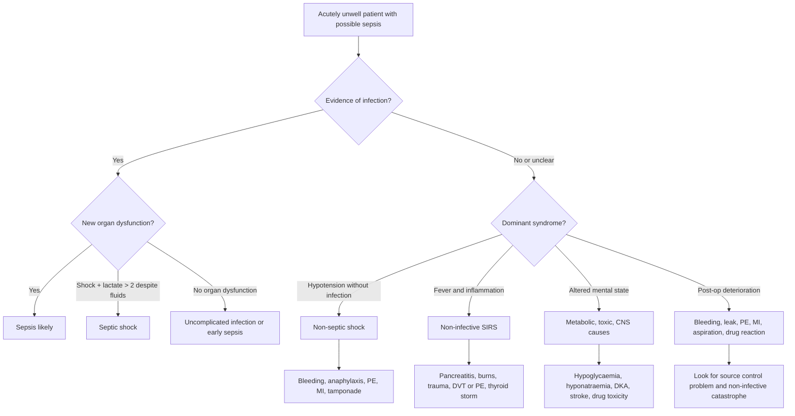

## Differential Diagnosis of Sepsis

### A. The Core Problem

Sepsis is commonly overcalled and undercalled.

- **Overcalled**: fever + tachycardia from a non-infective inflammatory condition
- **Undercalled**: elderly, immunosuppressed, post-operative, or diabetic patient with no fever but new organ dysfunction

The key diagnostic question is:

> **Is there infection causing organ dysfunction, or is another inflammatory/haemodynamic process mimicking infection?**

---

### B. Differential Diagnosis Algorithm

---

### C. Infective Conditions That Are Sepsis Until Proven Otherwise

| Syndrome | Why it becomes sepsis | Surgical relevance |
|---|---|---|
| **Peritonitis** | Large bacterial load and peritoneal cytokine activation -> capillary leak and shock | Perforated viscus, anastomotic leak |
| **Ascending cholangitis** | Obstructed infected bile duct -> high-pressure bacteraemia | Needs antibiotics plus biliary drainage |
| **Pyelonephritis / obstructed infected kidney** | Infected hydronephrosis behaves like an abscess under pressure | Needs antibiotics plus JJ stent or nephrostomy |
| **Necrotising fasciitis** | Toxin-mediated tissue necrosis and shock | Needs immediate debridement |
| **Pneumonia** | Alveolar infection -> hypoxaemia + systemic inflammation | Common post-op and aspiration source |
| **Line infection** | Direct bloodstream inoculation | Remove infected line if source |
| **Infected collection / abscess** | Antibiotics penetrate poorly into pus | Drainage is source control |

<Callout title="Surgical Rule" type="error">
Sepsis from an obstructed or walled-off source rarely resolves with antibiotics alone. Pus, infected bile, infected urine under pressure, necrotic bowel, and necrotising soft tissue need source control.
</Callout>

---

### D. Non-Infective Mimics of Sepsis

| Mimic | Why it looks like sepsis | Clues against infection |
|---|---|---|
| **Acute pancreatitis** | SIRS from enzyme injury and cytokines; fever, tachycardia, high CRP | Epigastric pain radiating to back, lipase/amylase, CT findings |
| **Major trauma / burns** | Tissue injury releases DAMPs -> sterile SIRS | Clear injury mechanism, cultures negative early |
| **Pulmonary embolism** | Tachycardia, hypoxia, hypotension, lactate | Pleuritic pain, RV strain, D-dimer/CTPA |
| **Myocardial infarction** | Shock, diaphoresis, lactate, pulmonary oedema | ECG/troponin, chest pain, echo |
| **Haemorrhage** | Tachycardia, hypotension, lactate | Falling Hb, bleeding history, FAST/CT/endoscopy |
| **Anaphylaxis** | Distributive shock, rash, wheeze, airway oedema | Trigger exposure, urticaria, rapid onset |
| **DKA / HHS** | Tachypnoea, dehydration, altered mental state, infection may coexist | Glucose, ketones, anion gap acidosis |
| **Thyroid storm** | Fever, tachycardia, delirium, diarrhoea | Goitre, tremor, TFTs, AF |
| **Malignant hyperthermia / NMS** | Hyperthermia, rigidity, acidosis, rhabdomyolysis | Anaesthetic or antipsychotic exposure, high CK |
| **Drug fever / transfusion reaction** | Fever, rigors, hypotension | Temporal relationship to drug/blood product |

---

### E. Differentiating Sepsis from SIRS

SIRS means systemic inflammation. Sepsis means infection plus organ dysfunction.

| Feature | SIRS without infection | Sepsis |
|---|---|---|
| **Trigger** | Trauma, pancreatitis, burns, surgery | Bacterial, viral, fungal, parasitic infection |
| **Cultures** | Usually negative | May be positive, but negative cultures do not exclude sepsis |
| **Source control** | Treat inflammatory trigger | Drain/debride/remove infected source |
| **Antibiotics** | Not routine unless infection suspected | Early empiric antibiotics when probable/definite sepsis |
| **Organ dysfunction** | Can occur in severe sterile inflammation | Defines sepsis when due to infection |

---

### F. High Yield DDx by Post-Operative Day

| Timing | Think of |
|---|---|
| **Immediate hours** | Bleeding, anaesthetic complication, aspiration, MI, PE, transfusion reaction |
| **Day 1-2** | Atelectasis is over-blamed; also look for pneumonia, aspiration, leak, UTI, line issue |
| **Day 3-5** | Pneumonia, UTI, wound infection, anastomotic leak beginning |
| **Day 5-7** | Anastomotic leak, intra-abdominal abscess, infected collection |
| **Any time** | PE, MI, drug fever, C. difficile after antibiotics |

<Callout title="Exam Pearl">
Post-operative fever is not automatically wound infection. In a sick post-op patient, first exclude the dangerous causes: bleeding, leak, PE, MI, aspiration pneumonia, and deep collection.
</Callout>

---

<Callout title="High Yield Summary">

**Sepsis DDx principle**: Do not diagnose sepsis from fever alone. Diagnose it from suspected infection plus new organ dysfunction.

**Main infective surgical sources**: Peritonitis, cholangitis, obstructed infected kidney, necrotising fasciitis, pneumonia, line sepsis, infected collection.

**Main mimics**: Pancreatitis, trauma, burns, PE, MI, haemorrhage, anaphylaxis, DKA, thyroid storm, malignant hyperthermia, drug fever.

**SIRS vs sepsis**: SIRS is inflammation; sepsis is infection-driven organ dysfunction.

**Source control clue**: If the infected focus is obstructed, necrotic, foreign-body-associated, or pus-filled, antibiotics alone are usually insufficient.

</Callout>

---

<ActiveRecallQuiz
  title="Active Recall - Sepsis DDx"
  items={[
    {
      question: "A post-operative patient has fever and tachycardia on day 5 after colorectal surgery. What dangerous diagnosis must be actively excluded and why?",
      markscheme: "Anastomotic leak with peritonitis or intra-abdominal collection. It causes bacterial contamination, cytokine release, capillary leak, and sepsis; antibiotics alone are insufficient if source control is needed."
    },
    {
      question: "Name four non-infective mimics of sepsis and give one clue for each.",
      markscheme: "Examples: PE with hypoxia/RV strain; MI with ECG/troponin changes; pancreatitis with epigastric pain and high lipase; haemorrhage with falling Hb; anaphylaxis with urticaria/wheeze; DKA with hyperglycaemia and ketones."
    },
    {
      question: "How is SIRS different from sepsis?",
      markscheme: "SIRS is systemic inflammation from infective or non-infective causes. Sepsis is life-threatening organ dysfunction caused by a dysregulated host response to infection."
    },
    {
      question: "Why can an intra-abdominal abscess fail to improve despite apparently appropriate antibiotics?",
      markscheme: "Pus is poorly vascularised, antibiotics penetrate poorly, bacterial burden is high, and pressure/necrotic debris perpetuate inflammation. Drainage is needed for source control."
    }
  ]}
/>

## References
