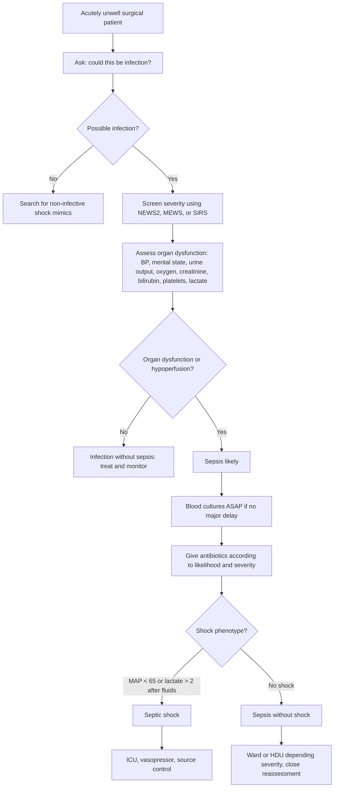

## Diagnosis of Sepsis and Septic Shock

### 1. Diagnostic Philosophy - Do Not Wait for Cultures

Sepsis is a **clinical emergency diagnosis** supported by physiology and investigations. You do not wait for the culture report because organ dysfunction progresses through cytokine injury, endothelial leak, mitochondrial dysfunction, microthrombi, and maldistributed flow long before microbiology confirms the organism.

<Callout title="The 2026 Approach">
The 2026 SSC keeps the big pillars: early recognition, lactate measurement, cultures before antibiotics where feasible, early antimicrobials when sepsis is likely, resuscitation for hypoperfusion, vasopressors for persistent shock, and source control when an anatomic source exists [1].
</Callout>

---

### 2. Diagnostic Definitions

| Entity | Practical diagnostic meaning | Why it matters |
|---|---|---|
| **Infection** | Pathogen invasion causing host inflammatory response | Antibiotics/source control may be needed, but organ dysfunction may be absent |
| **Sepsis** | Suspected/proven infection plus life-threatening organ dysfunction | Mortality rises sharply once organs fail |
| **Septic shock** | Sepsis with circulatory/metabolic failure: vasopressor required to maintain MAP at least 65 mmHg and lactate > 2 mmol/L after adequate fluids | Higher mortality phenotype; needs ICU-level haemodynamic support |

---

### 3. Recognition Algorithm

---

### 4. Screening Tools - NEWS2/MEWS/SIRS Over qSOFA

The 2026 SSC recommends **NEWS, NEWS2, MEWS, or SIRS over qSOFA as a single screening tool** for acutely ill inpatients [1].

Why?

- qSOFA is specific but insensitive; it misses early sepsis
- NEWS2 and MEWS detect physiological deterioration earlier
- SIRS is sensitive but non-specific

| Tool | Components | Use | Limitation |
|---|---|---|---|
| **NEWS2** | RR, oxygen saturation, oxygen use, temperature, SBP, HR, consciousness | Best practical ward deterioration score | Not sepsis-specific |
| **MEWS** | HR, SBP, RR, temperature, consciousness, urine output depending version | Simple ward screening | Thresholds vary |
| **SIRS** | Temperature, HR, RR/PaCO2, WBC | Sensitive infection screen | Too non-specific after surgery |
| **qSOFA** | RR at least 22, SBP at most 100, altered mentation | Risk enrichment; prompts escalation | Not recommended as sole screen |
| **SOFA** | Respiration, coagulation, liver, CVS, CNS, renal | Defines organ dysfunction | Needs labs; less immediate at bedside |

---

### 5. What Counts as Organ Dysfunction?

| Organ system | Bedside/lab clue | Pathophysiological basis |
|---|---|---|
| **CNS** | Confusion, drowsiness, agitation | Hypoperfusion, cytokines, BBB dysfunction, metabolic encephalopathy |
| **CVS** | Hypotension, vasopressor need, tachycardia | Vasodilatation, capillary leak, myocardial depression |
| **Respiratory** | Tachypnoea, hypoxaemia, ARDS | Endothelial leak and inflammatory alveolar injury |
| **Renal** | Oliguria, rising creatinine | Renal hypoperfusion, microvascular injury, venous congestion |
| **Haematological** | Thrombocytopenia, DIC | Platelet consumption, thrombin generation, endothelial injury |
| **Hepatic** | Rising bilirubin, coagulopathy | Cholestasis of sepsis, hypoperfusion, mitochondrial dysfunction |
| **Metabolic** | Elevated lactate, acidosis | Adrenergic glycolysis plus tissue hypoxia and impaired clearance |

---

### 6. Septic Shock Diagnosis

Think septic shock when all are present:

1. Suspected/proven infection
2. Persistent hypotension or need for vasopressor
3. Lactate > 2 mmol/L after adequate fluid resuscitation
4. No better explanation such as haemorrhage, MI, PE, tamponade, or anaphylaxis

<Callout title="Lactate Is Not Just Anaerobic Metabolism">
In sepsis, lactate reflects tissue hypoperfusion, adrenergic-driven glycolysis, mitochondrial dysfunction, impaired hepatic clearance, and sometimes beta-agonist therapy. It is a danger signal, not a pure oxygen-meter.
</Callout>

---

### 7. Surgical Sepsis Source Diagnosis

| Source | Diagnostic clues | Why source control matters |
|---|---|---|
| **Perforated viscus** | Sudden severe abdominal pain, peritonism, free air | Antibiotics cannot sterilise ongoing faecal contamination |
| **Appendicitis with perforation** | RIF pain, fever, abscess/phlegmon | Drain/operate depending abscess and stability |
| **Cholangitis** | Fever, jaundice, RUQ pain, hypotension/confusion | Biliary pressure prevents antibiotic penetration; ERCP drains source |
| **Necrotising fasciitis** | Pain out of proportion, shock, bullae, crepitus | Dead fascia has no blood supply; antibiotics cannot reach it |
| **Infected pancreatic necrosis** | Late sepsis, gas in collection, persistent organ failure | Step-up drainage/necrosectomy if infected |
| **Anastomotic leak** | Post-op tachycardia, ileus, fever, peritonitis, drain faeculent | Needs drainage/reoperation/diversion |
| **Catheter-related bloodstream infection** | Line sepsis, positive blood cultures, no other source | Remove infected line when indicated |

---

<Callout title="High Yield Summary">

**Sepsis** = infection plus life-threatening organ dysfunction.

**Septic shock** = sepsis with persistent circulatory/metabolic failure: vasopressor needed for MAP at least 65 mmHg and lactate > 2 mmol/L after fluids.

**2026 screening**: use NEWS/NEWS2/MEWS/SIRS over qSOFA as a single tool. qSOFA is too insensitive for early screening.

**Diagnosis is clinical**: do not wait for cultures. Use infection suspicion + organ dysfunction + lactate + source assessment.

**Surgical source control** is diagnostic and therapeutic: perforation, abscess, cholangitis, necrotising infection, anastomotic leak, infected necrosis.

</Callout>

---

<ActiveRecallQuiz
  title="Active Recall - Sepsis Diagnosis"
  items={[
    {
      question: "Define sepsis and septic shock using the current practical definitions.",
      markscheme: "Sepsis is suspected or proven infection with life-threatening organ dysfunction. Septic shock is sepsis with persistent circulatory/metabolic failure: vasopressor required to maintain MAP at least 65 mmHg and lactate > 2 mmol/L after adequate fluids.",
    },
    {
      question: "Why should NEWS2, MEWS, or SIRS be preferred over qSOFA as a single sepsis screening tool?",
      markscheme: "qSOFA is relatively specific but insensitive and may miss early sepsis. NEWS2/MEWS/SIRS detect physiological deterioration earlier, although they are not perfectly specific.",
    },
    {
      question: "List four organ dysfunction clues that support sepsis in a surgical patient.",
      markscheme: "Examples include altered mental state, hypotension/vasopressor need, hypoxaemia, oliguria or rising creatinine, thrombocytopenia/DIC, raised bilirubin, elevated lactate, or metabolic acidosis.",
    },
    {
      question: "Why does cholangitis often need ERCP rather than antibiotics alone?",
      markscheme: "Obstructed infected bile has high pressure and poor drainage, limiting antibiotic penetration and allowing ongoing bacteraemia. ERCP decompresses the biliary tree and removes the source.",
    },
  ]}
/>

## References

[1] Surviving Sepsis Campaign: International Guidelines for Management of Sepsis and Septic Shock 2026.
