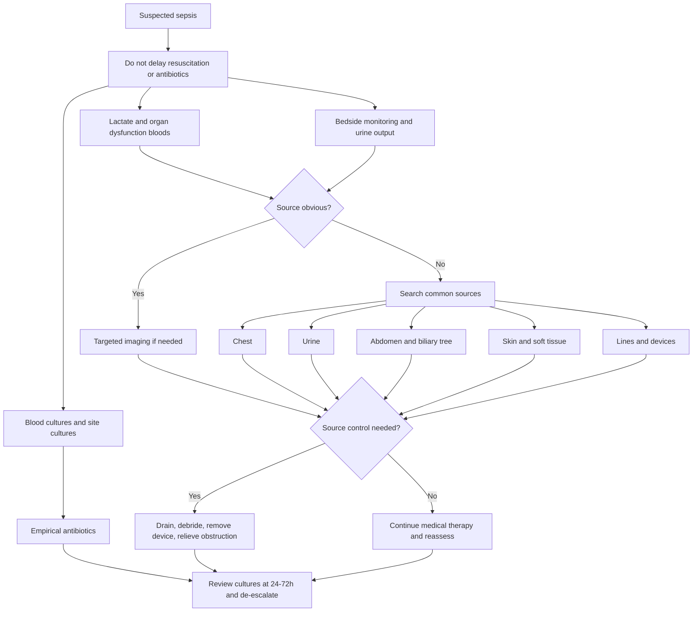

## Investigations for Sepsis

### A. Investigation Priorities

Investigations in sepsis have four purposes:

1. Confirm infection and identify the organism
2. Quantify organ dysfunction
3. Find the source requiring control
4. Monitor response to resuscitation

Do not wait for all tests before treatment. Sepsis is a clinical emergency.

---

### B. Bedside and Monitoring Investigations

| Investigation | What it tells you | Why it matters |
|---|---|---|
| Continuous HR, BP, SpO2, respiratory rate | Physiological instability | Sepsis can deteriorate quickly |
| Temperature | Fever or hypothermia | Hypothermia in sepsis often means severe physiological failure |
| Strict fluid balance | Perfusion and ongoing losses | Oliguria suggests renal hypoperfusion or AKI |
| Urinary catheter | Accurate urine output | Target at least 0.5 mL/kg/hr in adults |
| Capillary refill and mottling | Microcirculatory perfusion | 2026 SSC supports capillary refill as a resuscitation endpoint [1] |
| ECG | Arrhythmia, ischaemia, baseline QT | Sepsis triggers AF, demand ischaemia, and drug-related QT issues |

---

### C. Blood Tests

| Test | Expected finding | Interpretation |
|---|---|---|
| FBC | High or low WBC, thrombocytopenia | Leukopenia and thrombocytopenia are poor prognostic signs |
| Urea, creatinine, electrolytes | AKI, Na/K derangement | Guides fluids, drug dosing, RRT need |
| LFT | Hyperbilirubinaemia, transaminitis | Cholestasis, liver hypoperfusion, biliary source |
| Coagulation profile | Prolonged PT/APTT, low fibrinogen | DIC and hepatic dysfunction |
| ABG/VBG | Acidosis, hypoxaemia, lactate | Perfusion and respiratory failure |
| CRP | Inflammation | Useful trend, non-specific |
| Procalcitonin | Bacterial signal | Can help de-escalation; not a standalone diagnostic test [1] |
| Glucose | Hyperglycaemia or hypoglycaemia | Stress response or liver failure |

---

### D. Lactate

2026 SSC suggests measuring lactate in adults with possible, probable, or definite sepsis or septic shock [1].

Why lactate rises:

- Tissue hypoxia -> anaerobic glycolysis
- Adrenergic stimulation -> accelerated glycolysis
- Hepatic dysfunction -> reduced clearance
- Mitochondrial dysfunction -> impaired oxygen utilisation

Interpretation:

| Lactate | Meaning |
|---|---|
| Normal | Does not exclude sepsis |
| > 2 mmol/L | Increased risk; in Sepsis-3, septic shock includes lactate > 2 despite fluids with vasopressor requirement |
| > 4 mmol/L | Severe hypoperfusion signal; historically triggers aggressive resuscitation |
| Falling lactate | Response improving, but interpret with clinical perfusion |
| Persistently high lactate | Ongoing shock, inadequate source control, hypoxaemia, seizures, liver failure, drugs |

<Callout title="Lactate Is Not Just Lack of Oxygen">
Students often equate lactate with pure anaerobic metabolism. In sepsis, catecholamines, inflammation, mitochondrial dysfunction, and impaired hepatic clearance also contribute. That is why lactate must be interpreted alongside perfusion, blood pressure, capillary refill, urine output, and source control.
</Callout>

---

### E. Microbiology

| Sample | When |
|---|---|
| Blood cultures x 2 sets | As soon as possible, ideally before antibiotics [1] |
| Urine microscopy/culture | Urinary symptoms, elderly, catheter, unclear source |
| Sputum culture | Pneumonia or ventilated patient |
| Wound/pus culture | Surgical site infection, abscess |
| Drain fluid culture | Biliary, pancreatic, intra-abdominal drain sepsis |
| CSF | Meningitis suspected, after safety assessment |
| Stool tests | Severe diarrhoea, C. difficile risk |
| Viral PCR | Influenza/COVID or respiratory viral syndrome |

HK relevance:

- Use local hospital/cluster antibiograms and IMPACT guidance where available.
- Hong Kong faces important AMR pressure from MRSA, ESBL Enterobacterales, CRE/CPE, carbapenem-resistant Acinetobacter, and VRE [3].
- Cultures are what allow de-escalation; without cultures, broad-spectrum treatment stays broad for longer.

---

### F. Imaging for Source Control

| Suspected source | Imaging |
|---|---|
| Pneumonia | CXR; CT chest if unclear or complicated |
| Intra-abdominal sepsis | CT abdomen/pelvis with contrast if stable enough |
| Biliary sepsis | LFT + ultrasound; MRCP/CT/ERCP depending on obstruction |
| Urinary obstruction/pyonephrosis | USS KUB or CT KUB/urogram |
| Necrotising fasciitis | Clinical diagnosis; CT/MRI may help but must not delay surgery |
| Line infection | Line assessment, blood cultures from line and peripheral |
| Endocarditis | Echocardiography if bacteraemia, murmur, emboli, prosthetic valve |

---

### G. Mermaid Investigation Algorithm

---

<ActiveRecallQuiz
  title="Active Recall - Sepsis Investigations"
  items={[
    {
      question: "What are the four purposes of investigations in sepsis?",
      markscheme: "Confirm infection and identify organism; quantify organ dysfunction; find a source requiring control; monitor response to resuscitation."
    },
    {
      question: "Why should blood cultures be taken before antibiotics when feasible, and when should this not delay treatment?",
      markscheme: "Cultures identify pathogens and enable narrowing therapy. They should be taken as soon as possible and ideally before antibiotics, but antibiotics must not be delayed in septic shock or high-likelihood sepsis."
    },
    {
      question: "Give four mechanisms for lactate elevation in sepsis.",
      markscheme: "Anaerobic metabolism from hypoperfusion, adrenergic-driven glycolysis, impaired hepatic clearance, and mitochondrial dysfunction."
    },
    {
      question: "Name five surgical sources of sepsis where imaging/source control may be needed.",
      markscheme: "Perforated viscus, intra-abdominal abscess, cholangitis, pyonephrosis/obstructed infected kidney, necrotising fasciitis, infected prosthesis, anastomotic leak, infected line or drain."
    },
    {
      question: "Why is local Hong Kong antimicrobial resistance relevant to investigations?",
      markscheme: "HK has important MRSA, ESBL Enterobacterales, CRE/CPE, VRE, and resistant Acinetobacter pressure. Cultures and susceptibility testing allow appropriate empirical escalation and later de-escalation."
    }
  ]}
/>

## References

[1] Lecture slides: Surviving Sepsis Campaign International Guidelines for Management of Sepsis and Septic Shock 2026.

[3] Senior notes: Hong Kong IMPACT antimicrobial guideline and CHP antimicrobial resistance materials.
