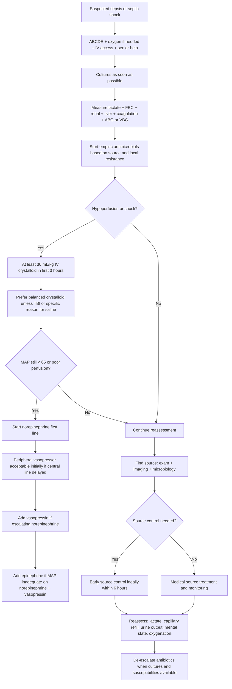

## Management of Sepsis and Septic Shock

### A. Management Principles

Sepsis management has four urgent jobs:

1. **Recognise organ dysfunction early**
2. **Give appropriate antimicrobials early**
3. **Restore perfusion**
4. **Control the source**

The 2026 Surviving Sepsis Campaign frames sepsis care around early recognition, timely treatment of infection, hemodynamic resuscitation, antimicrobial stewardship, and source control [1]. In surgery, source control is the part students must never forget: antibiotics cannot sterilise pus under pressure, dead bowel, necrotic fascia, an infected prosthesis, or an obstructed infected kidney.

<Callout title="Ward Round Rule" type="error">
In surgical sepsis, ask: **Where is the source, and does it need drainage, decompression, debridement, removal, or resection?** If yes, do not let fluids and antibiotics create false reassurance.
</Callout>

---

### B. Sepsis Management Algorithm

---

### C. First Hour Actions

| Action | Why |
|---|---|
| **ABCDE assessment** | Sepsis kills through hypoxia, shock, acidosis, and organ failure |
| **Oxygen if hypoxaemic** | Improves arterial oxygen content while perfusion is restored |
| **Two IV cannulae** | Allows antimicrobials, fluids, and vasopressors if needed |
| **Blood cultures ASAP** | 2026 SSC recommends blood cultures as soon as possible and ideally before antibiotics [1] |
| **Lactate** | Identifies occult hypoperfusion and tracks response [1] |
| **Empiric antimicrobials** | Mortality rises with delay in true septic shock |
| **Fluid if hypoperfused** | Restores venous return, preload, stroke volume, and oxygen delivery |
| **Source control plan** | Definitive treatment for drainable or obstructed infection |

---

### D. Antimicrobial Therapy

#### 1. Timing

Practical approach:

- **Septic shock or high likelihood of sepsis**: give broad-spectrum IV antibiotics immediately after cultures if this does not delay treatment.
- **Possible sepsis without shock**: assess rapidly, obtain cultures, and avoid unnecessary broad-spectrum antibiotics if infection is uncertain.

The 2026 SSC emphasises responsible antimicrobial use, proper diagnostic strategies, and de-escalation [1].

#### 2. Empiric Choice

Choose by:

1. **Likely source**
2. **Community vs hospital acquisition**
3. **Recent antibiotics**
4. **Prior cultures**
5. **Colonisation history**
6. **Local resistance pattern**
7. **Renal and hepatic function**
8. **Allergy**

Hong Kong relevance:

- The IMPACT guideline is the local reference for antimicrobial use and is designed around Hong Kong resistance epidemiology [3].
- Hong Kong AMR priorities include MRSA, ESBL-producing Enterobacterales, CRE/CPE, carbapenem-resistant Acinetobacter, and VRE resurgence [3].
- HA antimicrobial stewardship and SmartASP aim to reduce inappropriate broad-spectrum antibiotic use [3].

| Suspected surgical source | Typical empiric logic |
|---|---|
| **Intra-abdominal sepsis** | Gram-negative + anaerobic cover; escalate if healthcare-associated or ESBL risk |
| **Biliary sepsis** | Enterobacterales + anaerobes; decompress obstruction if cholangitis |
| **Urosepsis** | Enterobacterales cover; consider ESBL risk in HK if prior ESBL or healthcare exposure |
| **Necrotising fasciitis** | Broad Gram-positive, Gram-negative, anaerobic cover plus toxin suppression; urgent debridement |
| **Line infection** | Cover staphylococci including MRSA if risk factors |
| **Post-operative sepsis** | Consider leak, abscess, infected collection, pneumonia, UTI, line infection |

#### 3. Beta-Lactam Dosing

2026 SSC recommends prolonged infusion beta-lactams for maintenance after an initial loading dose [1].

Why?

- Beta-lactams are time-dependent antibiotics.
- Their effect depends on time above MIC.
- Septic patients have expanded volume of distribution and altered renal clearance.
- A loading dose rapidly reaches therapeutic concentration; prolonged infusion keeps levels above MIC.

#### 4. De-escalation

De-escalate when cultures and susceptibilities are available [1].

This is not "weakening treatment"; it is precision treatment:

- Reduces resistance pressure
- Reduces C. difficile risk
- Reduces nephrotoxicity
- Preserves carbapenems and anti-MRSA agents

<Callout title="Hong Kong Antibiotic Stewardship Point" type="idea">
In Hong Kong, broad agents such as piperacillin-tazobactam and meropenem are stewardship-sensitive. Use them when the risk justifies them, then narrow promptly when culture data returns [3].
</Callout>

---

### E. Fluids

#### 1. Initial Fluid

For adults with sepsis-induced hypoperfusion or septic shock, 2026 SSC suggests at least **30 mL/kg IV crystalloid in the first 3 hours** [1].

What counts as hypoperfusion?

- MAP < 65 mmHg
- SBP < 90 mmHg or marked relative hypotension
- Lactate elevation, especially lactate > 2 mmol/L and strongly if lactate is at least 4 mmol/L
- Oliguria
- Altered mental state
- Cool mottled skin

#### 2. Fluid Type

| Fluid | Role |
|---|---|
| **Balanced crystalloid** | Preferred over 0.9% saline for sepsis resuscitation [1] |
| **0.9% saline** | Consider when concomitant traumatic brain injury or chloride replacement need exists [1] |
| **Albumin** | Not routine; may be considered after large crystalloid volumes or selected cirrhotic/hypoalbuminaemic contexts |
| **Starches** | Avoid; 2026 SSC recommends against starches [1] |
| **Gelatin** | Avoid routine use; adverse reactions and renal concerns |

#### 3. After the Initial Bolus

Do not blindly continue fluids.

Use:

- Passive leg raise with stroke volume/cardiac output response
- Fluid challenge with objective response
- Echocardiography
- Pulse pressure variation or stroke volume variation in suitable ventilated patients
- Capillary refill time
- Lactate trend
- Urine output

The 2025 ESICM shock monitoring guideline supports dynamic variables over static preload markers and reassessing fluid responsiveness after initial resuscitation [2].

---

### F. Vasopressors and Inotropes

#### 1. Target

Initial MAP target: **65 mmHg** [1].

Why not higher for everyone?

- Higher MAP requires more catecholamine.
- More catecholamine can cause tachyarrhythmia, myocardial oxygen demand, digital ischaemia, and splanchnic vasoconstriction.
- Some chronic hypertensive patients may need higher renal perfusion pressure, but start with 65 mmHg and individualise.

#### 2. Vasopressor Sequence

| Situation | Drug |
|---|---|
| Septic shock needing vasopressor | **Norepinephrine first-line** [1] |
| Escalating norepinephrine requirement | Add **vasopressin** [1] |
| MAP inadequate despite norepinephrine + vasopressin | Add **epinephrine** [1] |
| Cardiac dysfunction with persistent hypoperfusion | Add **dobutamine** to norepinephrine or use epinephrine alone [1] |

Mechanisms:

- **Norepinephrine**: alpha-1 vasoconstriction restores SVR; beta-1 support is modest.
- **Vasopressin**: V1 receptor vasoconstriction; useful because septic shock may have relative vasopressin deficiency.
- **Epinephrine**: alpha and beta agonist; raises MAP and cardiac output but can increase lactate and arrhythmias.
- **Dobutamine**: beta-1 inotrope; improves cardiac output when myocardial depression is the limiting problem.

Peripheral norepinephrine may be started initially if central access would delay restoration of MAP, with careful site choice and monitoring [1].

---

### G. Corticosteroids

2026 SSC suggests IV corticosteroids in septic shock [1].

Typical regimen:

- Hydrocortisone 200 mg/day IV, often 50 mg Q6H or continuous infusion.

Why it helps:

- Septic shock causes dysregulated inflammatory signalling and relative adrenal insufficiency.
- Cortisol increases vascular responsiveness to catecholamines.
- It can shorten shock duration and reduce vasopressor requirement.

It is not a substitute for fluids, vasopressors, antibiotics, or source control.

---

### H. Source Control

2026 SSC suggests early source control, ideally within **6 hours** of diagnosis when source control is required [1].

Surgical source control methods:

| Source | Control |
|---|---|
| Abscess | Drainage |
| Perforated viscus | Operation or selected radiological drainage plus definitive repair |
| Anastomotic leak | Drainage, diversion, repair, resection depending on physiology |
| Necrotising fasciitis | Immediate radical debridement |
| Cholangitis | ERCP decompression |
| Obstructed infected kidney | Ureteric stent or nephrostomy |
| Infected line | Remove line |
| Infected prosthesis | Washout/removal depending on site and stability |

<Callout title="Source Control Is Physiology">
An abscess is low pH, low oxygen tension, high bacterial load, and poor antibiotic penetration. Drainage converts an uncontrolled biological reactor into a treatable infection.
</Callout>

---

### I. Supportive ICU Care

| Problem | Management |
|---|---|
| Hypoxaemia / ARDS | Lung-protective ventilation, prone positioning if severe ARDS |
| AKI | Optimise perfusion, avoid nephrotoxins, renal replacement therapy if indicated |
| Hyperglycaemia | Insulin protocol, avoid hypoglycaemia |
| Nutrition | Early enteral nutrition when feasible |
| VTE risk | Pharmacological prophylaxis unless contraindicated |
| Stress ulcer risk | Prophylaxis in high-risk ICU patients |
| Delirium and weakness | Sedation minimisation, mobilisation, rehabilitation |
| Goals of care | Early communication, time-limited trials when appropriate |

---

<Callout title="High Yield Summary">

**Sepsis is a medical and surgical emergency**: recognise, culture, lactate, antibiotics, fluids, vasopressors, source control.

**2026 SSC initial fluid**: sepsis-induced hypoperfusion or septic shock -> at least **30 mL/kg IV crystalloid in first 3 hours**.

**Fluid choice**: crystalloids first-line; balanced crystalloids preferred over NS unless specific exception such as TBI. Avoid starches.

**MAP target**: 65 mmHg initially.

**Vasopressors**: norepinephrine first-line. Add vasopressin if escalating norepinephrine. Add epinephrine if MAP inadequate despite norepinephrine + vasopressin.

**Inotrope**: dobutamine if cardiac dysfunction with persistent hypoperfusion despite fluids and adequate MAP.

**Steroids**: hydrocortisone for septic shock; helps restore catecholamine responsiveness.

**Antibiotics**: early empiric therapy, local HK IMPACT guidance, loading dose then prolonged beta-lactam infusion for maintenance, de-escalate with cultures.

**Source control**: early, ideally within 6 hours when needed.

</Callout>

---

<ActiveRecallQuiz
  title="Active Recall - Management of Sepsis"
  items={[
    {
      question: "State the key 2026 SSC initial hemodynamic steps for septic shock.",
      markscheme: "Give at least 30 mL/kg IV crystalloid within the first 3 hours for sepsis-induced hypoperfusion or septic shock, prefer balanced crystalloid, reassess dynamically, target MAP 65 mmHg, start norepinephrine first-line if hypotension persists, add vasopressin then epinephrine if needed."
    },
    {
      question: "Why is source control essential in surgical sepsis?",
      markscheme: "Because antibiotics cannot reliably sterilise pus, necrotic tissue, obstructed infected systems, infected foreign material, or perforated bowel. These have poor penetration, high bacterial load, low pH, and ongoing toxin/inflammatory stimulus. Drainage, decompression, debridement, removal, or resection removes the driver."
    },
    {
      question: "Why are prolonged beta-lactam infusions recommended after a loading dose?",
      markscheme: "Beta-lactams are time-dependent antibiotics; efficacy depends on time above MIC. Septic patients have expanded volume of distribution and altered clearance. A loading dose reaches therapeutic level rapidly; prolonged infusion maintains concentration above MIC."
    },
    {
      question: "What Hong Kong antimicrobial-resistance issues should influence empiric antibiotics?",
      markscheme: "Consider MRSA, ESBL-producing Enterobacterales, CRE/CPE, carbapenem-resistant Acinetobacter, VRE, prior colonisation/cultures, healthcare exposure, recent antibiotics, and IMPACT/cluster guidance. De-escalate once susceptibility is known."
    },
    {
      question: "When should hydrocortisone be considered in sepsis?",
      markscheme: "In septic shock, especially when vasopressor requirement persists. Hydrocortisone improves vascular responsiveness to catecholamines and may shorten shock duration; it does not replace antibiotics, fluids, vasopressors, or source control."
    }
  ]}
/>

## References

[1] Lecture slides: Surviving Sepsis Campaign International Guidelines for Management of Sepsis and Septic Shock 2026.

[2] Lecture slides: ESICM guidelines on circulatory shock and hemodynamic monitoring 2025.

[3] Senior notes: Hong Kong IMPACT antimicrobial guideline / Centre for Health Protection antimicrobial-resistance materials.
