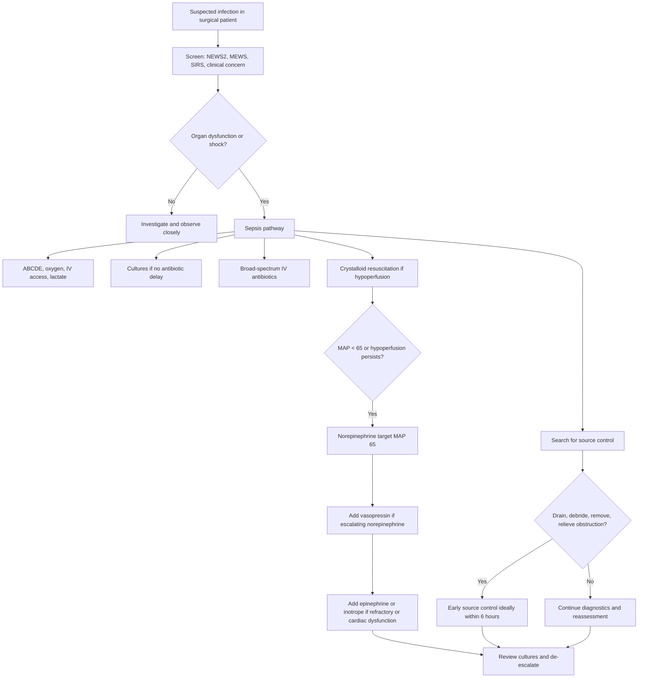

<Callout title="High Yield Summary">

**Definition**: Sepsis = life-threatening organ dysfunction caused by dysregulated host response to infection. Septic shock = sepsis with vasopressor requirement to maintain MAP at least 65 mmHg and lactate > 2 mmol/L despite adequate fluids [1].

**Pathophysiology**: PAMPs/DAMPs trigger innate immunity -> cytokines, complement, coagulation activation, endothelial leak, vasodilatation, microthrombi, mitochondrial dysfunction -> maldistributed oxygen delivery and organ failure [1].

**2026 screening**: Use NEWS, NEWS2, MEWS, or SIRS over qSOFA as a single screening tool in acutely ill inpatients. qSOFA is specific but not sensitive enough as the only screen [1].

**Diagnosis**: Suspected infection plus acute organ dysfunction. Use SOFA conceptually; in practice recognise hypotension, hypoxaemia, AKI/oliguria, thrombocytopaenia, bilirubin rise, confusion, lactate elevation.

**Initial actions**: Sepsis is a medical emergency. Measure lactate, obtain cultures promptly if this does not delay antibiotics, start antimicrobials according to severity, resuscitate hypoperfusion, and look for surgical source control [1].

**Antibiotics**: Septic shock/high likelihood sepsis -> immediate broad-spectrum IV antibiotics. Possible sepsis without shock -> rapid assessment, then antibiotics if infection likely. De-escalate when cultures and susceptibilities return [1].

**HK relevance**: Use IMPACT/local HA guidance and discuss with microbiology/ID early when ESBL, MRSA, CRE, CRAB, VRE, healthcare-associated infection, or prior broad-spectrum antibiotic exposure is relevant [3].

**Fluids**: Sepsis-induced hypoperfusion/septic shock -> at least 30 mL/kg IV crystalloid in first 3 hours. Balanced crystalloids preferred over 0.9% saline for most; 0.9% saline is preferred if concomitant TBI [1].

**Vasopressors**: Target MAP 65 mmHg. Norepinephrine first line; add vasopressin on escalating norepinephrine; add epinephrine if inadequate MAP despite norepinephrine plus vasopressin [1].

**Source control**: Drain pus, remove infected devices, debride necrosis, relieve obstruction, operate when needed. Aim as early as medically and logistically practical; 2026 SSC suggests ideally within 6 hours when source control is required [1].

**Steroids**: IV corticosteroids are suggested in septic shock, especially persistent vasopressor requirement. They shorten shock duration; they are not a substitute for source control [1].

**Complications**: Septic shock, ARDS, AKI, DIC, myocardial dysfunction, encephalopathy, cholestasis, ileus, pressure injury, line infection, antimicrobial toxicity, ICU-acquired weakness, cognitive/psychological sequelae, and recurrent infection.

</Callout>

---

### One-Page Surgical Sepsis Algorithm

---

<ActiveRecallQuiz
  title="Active Recall - Sepsis Summary"
  items={[
    {
      question: "Define sepsis and septic shock using Sepsis-3 terminology.",
      markscheme: "Sepsis is life-threatening organ dysfunction caused by a dysregulated host response to infection. Septic shock is sepsis with persistent hypotension requiring vasopressors to maintain MAP at least 65 mmHg and lactate > 2 mmol/L despite adequate fluid resuscitation."
    },
    {
      question: "What sepsis screening tools are preferred over qSOFA as a single inpatient screening tool in the 2026 SSC guideline?",
      markscheme: "NEWS, NEWS2, MEWS, or SIRS are recommended over qSOFA as a single screening tool because qSOFA is insufficiently sensitive for early screening."
    },
    {
      question: "State the 2026 initial fluid and vasopressor approach for septic shock.",
      markscheme: "Give at least 30 mL/kg IV crystalloid in the first 3 hours for sepsis-induced hypoperfusion or septic shock, preferably balanced crystalloid unless TBI. If MAP remains < 65 or hypoperfusion persists, start norepinephrine; add vasopressin on escalating norepinephrine and epinephrine if still inadequate."
    },
    {
      question: "Why is source control central in surgical sepsis?",
      markscheme: "Antibiotics cannot reliably sterilise pus, necrotic tissue, foreign material, or obstructed infected systems because penetration is poor and bacterial burden is high. Source control drains, removes, debrides, or decompresses the nidus driving ongoing inflammation."
    }
  ]}
/>

## References

[1] Lecture slides: Surviving Sepsis Campaign International Guidelines for Management of Sepsis and Septic Shock 2026.

[3] Senior notes: Hong Kong IMPACT antimicrobial guideline and CHP antimicrobial resistance materials.
