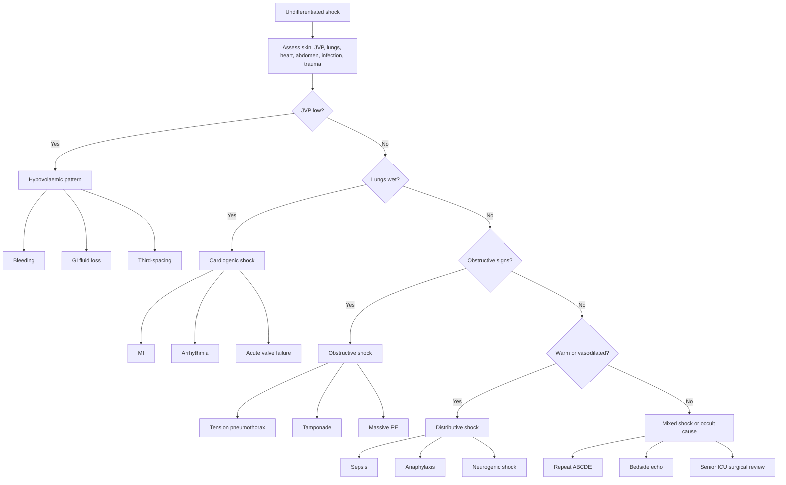

## Differential Diagnosis of Shock

### A. First Principle: Shock Is a Syndrome, Not a Diagnosis

Shock means **life-threatening circulatory failure with inadequate cellular oxygen use**. The differential diagnosis is the search for *why oxygen delivery has failed*:

1. Is there **not enough volume**? -> hypovolaemic shock
2. Is the **pump failing**? -> cardiogenic shock
3. Is the circulation **blocked**? -> obstructive shock
4. Is vascular tone **lost or maldistributed**? -> distributive shock

The dangerous trap is to label every hypotensive surgical patient as "dehydrated". A cardiogenic shock patient given litres of fluid may drown; a tension pneumothorax patient given fluids without decompression may arrest; a septic shock patient given no antibiotics may die despite good fluids.

---

### B. Rapid Bedside Pattern Recognition

| Pattern | Think | Why |
|---|---|---|
| **Cold, clammy, flat neck veins** | Hypovolaemia | Low preload -> sympathetic vasoconstriction |
| **Cold, clammy, raised JVP, crepitations** | Cardiogenic shock | Pump failure -> pulmonary congestion + low output |
| **Raised JVP + clear lungs + sudden collapse** | Obstructive shock | Venous return or ventricular filling blocked |
| **Warm peripheries early, bounding pulse, fever** | Septic distributive shock | Vasodilatation and maldistributed flow |
| **Urticaria, wheeze, facial swelling** | Anaphylaxis | Mast-cell mediator release -> vasodilatation + bronchospasm |
| **Bradycardia with hypotension after spinal injury** | Neurogenic shock | Loss of sympathetic tone, unopposed vagal tone |

<Callout title="High Yield Bedside Rule">
JVP and lungs help separate low preload from pump/obstructive problems. **Flat JVP** suggests volume loss; **raised JVP** suggests pump failure or obstruction. Always interpret with the whole patient, because ventilated patients and tamponade can confuse the exam.
</Callout>

---

### C. Differential by Shock Category

#### 1. Hypovolaemic Shock

| Cause | Clues | Pathophysiology |
|---|---|---|
| **Haemorrhage** | Trauma, GI bleed, post-op drain blood, ruptured AAA, ectopic pregnancy | Loss of RBC mass and plasma -> reduced preload and oxygen-carrying capacity |
| **Dehydration** | Poor intake, vomiting, diarrhoea, fever | Water and sodium loss -> reduced extracellular and intravascular volume |
| **Third-spacing** | Pancreatitis, peritonitis, bowel obstruction, burns | Capillary leak traps protein-rich fluid outside the vascular space |
| **High-output stoma/fistula** | Ileostomy or enterocutaneous fistula output | Sodium-rich GI fluid loss -> hypovolaemia, electrolyte derangement |

#### 2. Cardiogenic Shock

| Cause | Clues | Pathophysiology |
|---|---|---|
| **Acute MI** | Chest pain, ECG changes, troponin rise | Myocardial necrosis -> poor contractility -> low CO |
| **Arrhythmia** | AF with fast ventricular response, VT, complete heart block | Too fast or too slow -> poor filling/ejection |
| **Acute valvular failure** | New murmur, pulmonary oedema | Regurgitant flow or outflow obstruction prevents forward flow |
| **Myocarditis/cardiomyopathy** | Viral prodrome, young patient, dilated LV | Inflamed or failing myocardium cannot generate pressure |

#### 3. Obstructive Shock

| Cause | Clues | Pathophysiology |
|---|---|---|
| **Tension pneumothorax** | Unilateral absent breath sounds, tracheal deviation, hypoxia, distended neck veins | Intrathoracic pressure compresses vena cava and heart |
| **Cardiac tamponade** | Beck's triad: hypotension, raised JVP, muffled heart sounds | Pericardial pressure prevents diastolic filling |
| **Massive pulmonary embolism** | Sudden dyspnoea, pleuritic pain, hypoxia, RV strain | Pulmonary vascular obstruction -> acute RV failure |
| **Abdominal compartment syndrome** | Tense abdomen, ventilatory difficulty, oliguria | High intra-abdominal pressure reduces venous return and renal perfusion |

#### 4. Distributive Shock

| Cause | Clues | Pathophysiology |
|---|---|---|
| **Sepsis** | Infection source, fever/hypothermia, high lactate, organ dysfunction | NO-mediated vasodilatation, capillary leak, mitochondrial dysfunction |
| **Anaphylaxis** | Allergen exposure, urticaria, angioedema, wheeze | Histamine/leukotrienes -> vasodilatation + permeability + bronchospasm |
| **Neurogenic shock** | Spinal trauma, hypotension with bradycardia | Loss of sympathetic vascular tone |
| **Adrenal crisis** | Steroid withdrawal, Addison's, hyperkalaemia, hypoglycaemia | Cortisol deficiency -> poor catecholamine responsiveness |

---

### D. Mermaid Diagram - Undifferentiated Shock DDx

---

<Callout title="High Yield Summary">

**Shock DDx starts with physiology**: volume, pump, obstruction, or tone.

**Hypovolaemic**: flat JVP, cold clammy skin, dry mucosa, bleeding/GI loss/third-spacing.

**Cardiogenic**: cold clammy skin plus raised JVP, pulmonary oedema, ECG/troponin/echo abnormalities.

**Obstructive**: raised JVP with a mechanical block: tension pneumothorax, tamponade, massive PE, abdominal compartment syndrome.

**Distributive**: low SVR; sepsis is most common in wards/ICU, anaphylaxis and neurogenic shock are time-critical mimics.

**Mixed shock is common**: septic patient with cardiomyopathy, trauma patient with tension pneumothorax and bleeding, pancreatitis patient with third-spacing and sepsis.

</Callout>

---

<ActiveRecallQuiz
  title="Active Recall - Shock Differential Diagnosis"
  items={[
    {
      question: "A hypotensive patient has cold peripheries, raised JVP, and basal crepitations. Which shock type is most likely and why?",
      markscheme: "Cardiogenic shock. Raised JVP and crepitations suggest pump failure with venous congestion and pulmonary oedema, while cold peripheries reflect sympathetic vasoconstriction from low cardiac output."
    },
    {
      question: "List three immediately reversible causes of obstructive shock.",
      markscheme: "Tension pneumothorax, cardiac tamponade, massive pulmonary embolism. Abdominal compartment syndrome is another important surgical cause."
    },
    {
      question: "Why can septic shock initially have warm peripheries despite severe shock?",
      markscheme: "Inflammatory mediators such as nitric oxide cause vasodilatation and low systemic vascular resistance, so skin blood flow may be increased early despite maldistributed microcirculatory flow and cellular hypoxia."
    },
    {
      question: "A shocked trauma patient has unilateral absent breath sounds and distended neck veins. What diagnosis must be treated immediately?",
      markscheme: "Tension pneumothorax. High intrathoracic pressure reduces venous return and cardiac filling; decompression must not wait for imaging if clinically suspected."
    }
  ]}
/>

## References

[1] Lecture slides: ESICM guidelines on circulatory shock and hemodynamic monitoring 2025.
