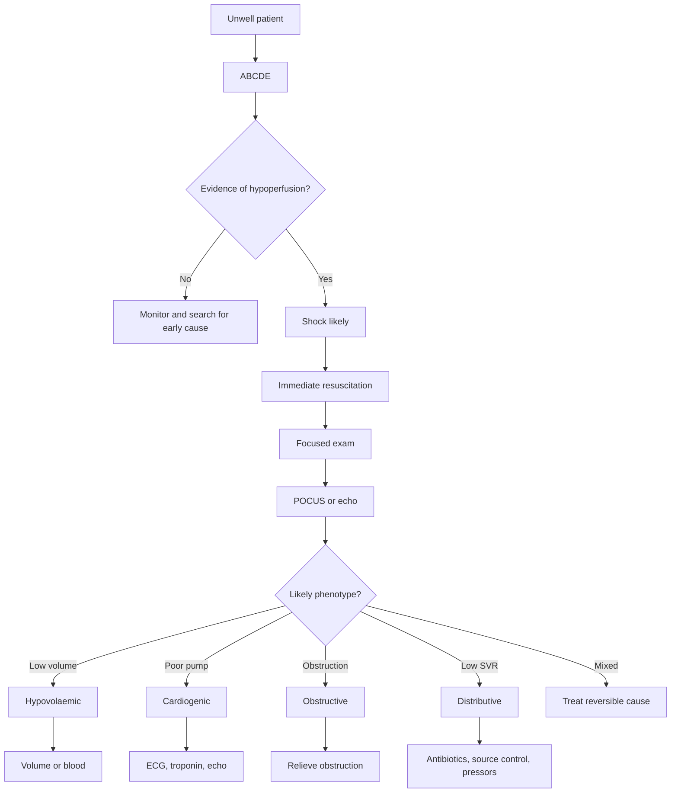

## Diagnosis of Shock

### A. Diagnostic Concept

Shock is diagnosed clinically when there is **circulatory failure causing inadequate tissue perfusion**. Hypotension helps, but it is not required early; current shock monitoring guidance emphasises perfusion markers and early haemodynamic phenotyping [1].

The key diagnostic move is:

> ***Recognise hypoperfusion first, then phenotype the shock type while resuscitation begins.***

Classic threshold:

- SBP < 90 mmHg, or
- MAP < 65 mmHg, or
- A fall in SBP > 40 mmHg from baseline

But compensated shock may have normal BP. A young trauma patient can lose a large blood volume before becoming hypotensive because catecholamines maintain vascular tone.

---

### B. Bedside Diagnostic Algorithm

---

### C. Clinical Criteria - What You Need to See

| Domain | Finding | Why it matters |
|---|---|---|
| **Circulation** | Tachycardia, hypotension, narrow pulse pressure | Compensation and then decompensation |
| **Skin** | Cool clammy skin, mottling, delayed capillary refill | Peripheral vasoconstriction and poor microcirculatory flow |
| **Kidneys** | Oliguria < 0.5 mL/kg/hr | Reduced renal perfusion pressure |
| **Brain** | Agitation, confusion, drowsiness | Poor cerebral perfusion or inflammatory encephalopathy |
| **Metabolism** | Lactate rise, base deficit, acidosis | Anaerobic metabolism and oxygen debt |

<Callout title="Blood Pressure Trap" type="error">
A normal BP does not exclude shock. BP = cardiac output x systemic vascular resistance. Early shock may preserve BP by raising SVR. Look for perfusion: mentation, urine output, capillary refill, lactate, and skin.
</Callout>

---

### D. Phenotyping at the Bedside

| Clue | Suggests | Mechanism |
|---|---|---|
| Flat neck veins, dry mucosa, bleeding, collapsible IVC | Hypovolaemic | Too little preload |
| Raised JVP, crepitations, S3, chest pain, poor LV function | Cardiogenic | Pump failure |
| Raised JVP with clear lungs, muffled heart sounds, pulsus paradoxus | Tamponade | External compression blocks filling |
| Sudden dyspnoea, hypoxia, RV strain, pleuritic pain | Massive PE | RV afterload crisis |
| Fever or hypothermia, warm peripheries early, bounding pulse | Septic distributive | Vasodilatation and capillary leak |
| Wheeze, urticaria, angioedema, sudden collapse | Anaphylactic distributive | Mast-cell mediator vasodilatation and bronchospasm |
| Bradycardia with hypotension after spinal injury | Neurogenic distributive | Loss of sympathetic tone |

### E. Shock Index

**Shock index = heart rate / systolic BP**

- Normal: about 0.5-0.7
- > 0.9 suggests significant circulatory stress
- Useful in trauma and occult bleeding

Why it works: tachycardia rises and SBP falls as compensatory reserve is consumed.

---

### F. Diagnostic Endpoints After Initial Treatment

Diagnosis is dynamic. The response to treatment gives information:

| Response | Interpretation |
|---|---|
| Improves after fluid bolus | Fluid responsive: hypovolaemia or early distributive shock likely |
| No improvement and lungs become wet | Cardiogenic shock or fluid intolerance |
| No improvement with raised JVP and clear lungs | Obstructive shock until proven otherwise |
| BP improves with noradrenaline but lactate persists | Vasoplegia improved, but tissue perfusion/source/pump may remain unresolved |

<ActiveRecallQuiz
  title="Active Recall - Shock Diagnosis"
  items={[
    {
      question: "Why does a normal blood pressure not exclude shock?",
      markscheme: "Blood pressure equals cardiac output times systemic vascular resistance. Early shock may preserve BP through sympathetic vasoconstriction despite low stroke volume and poor tissue perfusion. Look for tachycardia, oliguria, altered mentation, delayed capillary refill, mottling, lactate, and base deficit."
    },
    {
      question: "List four bedside clues that suggest obstructive shock.",
      markscheme: "Raised JVP, hypotension, clear lungs, sudden dyspnoea or hypoxia, muffled heart sounds, pulsus paradoxus, tracheal deviation or absent breath sounds in tension pneumothorax, RV strain on echo, or distended IVC."
    },
    {
      question: "What is shock index and why is it useful?",
      markscheme: "Shock index = heart rate divided by systolic BP. A value > 0.9 suggests significant circulatory stress. It captures the combination of compensatory tachycardia and falling arterial pressure, so it can flag occult bleeding or early shock."
    },
    {
      question: "A shocked patient worsens after repeated fluid boluses and develops crepitations. What does this suggest?",
      markscheme: "Fluid intolerance and possible cardiogenic shock or mixed shock. Stop blind fluids, assess with echo, consider inotropes or vasopressors, and treat the cardiac cause."
    }
  ]}
/>

## References

[1] Lecture slides: ESICM guidelines on circulatory shock and hemodynamic monitoring 2025.
