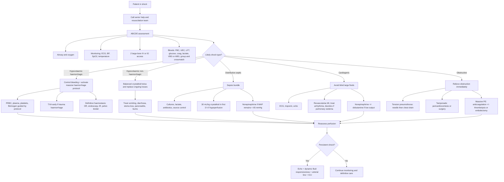

## Management of Shock

### A. Principles

Shock management has two simultaneous tracks:

1. **Generic resuscitation** - keep the patient alive now.
2. **Cause-specific reversal** - stop the physiology causing shock.

Generic resuscitation without cause control is temporary. Cause control without resuscitation may be too slow.

The ward-round sentence is:

> **ABCDE, oxygenate, monitor, get access, send bloods, give targeted fluids/blood/vasopressors, use bedside echo, and reverse the cause.**

---

### B. Management Algorithm

---

### C. Universal First 10 Minutes

| Step | Action | Why |
|---|---|---|
| **Call for help** | Senior surgeon, anaesthetist, ICU, ED, blood bank as needed | Shock deteriorates faster than one person can manage |
| **Airway** | Assess patency, GCS, aspiration risk | Shock reduces consciousness and airway reflexes |
| **Breathing** | High-flow oxygen if hypoxaemic; ventilate if tiring | Oxygen delivery = cardiac output x arterial oxygen content |
| **Circulation access** | Two large-bore IV cannulae; IO if no access | Treatment cannot happen without access |
| **Monitoring** | ECG, NIBP, SpO2, temperature, urine catheter | Shock treatment is titrated to response |
| **Bloods** | Lactate/VBG, FBC, UEC, LFT, coag, glucose, group and crossmatch, cultures if sepsis | Identifies anaemia, AKI, acidosis, coagulopathy, infection |

<Callout title="First Principle">
Do not wait for a named diagnosis before treating shock. Restore oxygen delivery while you identify the cause.
</Callout>

---

### D. Fluids, Blood, and Vasopressors

#### 1. Fluids

Use IV fluid when the physiology is **low preload** or likely fluid responsive.

| Situation | Fluid approach |
|---|---|
| Dehydration, GI loss, burns, pancreatitis | Balanced crystalloid bolus, reassess |
| Septic shock | At least 30 mL/kg crystalloid in first 3 hours if hypoperfusion; balanced crystalloid preferred where suitable [2] |
| Cardiogenic shock with pulmonary oedema | Avoid blind boluses; small test bolus only if RV infarct or underfilled |
| Obstructive shock | Small bolus may temporise preload, but definitive treatment is relieving obstruction |
| Haemorrhagic shock | Crystalloid only as bridge; blood products are definitive volume and oxygen-carrying replacement |

#### 2. Blood Products in Haemorrhagic Shock

Haemorrhage is loss of:

- Volume
- Red cells
- Clotting factors
- Platelets
- Calcium and temperature homeostasis

So treatment must replace all of them.

Principles:

- Control bleeding early
- Activate massive haemorrhage protocol
- Give balanced blood products rather than litres of crystalloid
- Keep warm
- Correct hypocalcaemia
- Check coagulation and fibrinogen

Trauma haemorrhage:

- Avoid excessive crystalloid because it causes dilutional coagulopathy, hypothermia, acidosis, and clot disruption
- Permissive hypotension may be appropriate before haemostasis if no traumatic brain injury
- In suspected significant traumatic brain injury, avoid hypotension because cerebral perfusion depends on MAP

#### 3. Vasopressors

Vasopressors are for **vascular tone failure** or persistent hypotension after appropriate preload correction.

| Drug | Main receptor action | Use |
|---|---|---|
| **Norepinephrine** | Alpha-1 vasoconstriction plus beta-1 support | First-line in septic/distributive shock and useful in cardiogenic shock with hypotension [2] |
| **Vasopressin** | V1 vasoconstriction independent of adrenergic receptors | Add-on in septic shock with escalating norepinephrine requirement [2] |
| **Epinephrine** | Beta-1/beta-2 at lower dose, alpha at higher dose | Add-on refractory septic shock; useful when bradycardic or low cardiac output [2] |
| **Dobutamine** | Beta-1 inotropy | Cardiogenic shock or septic myocardial dysfunction with persistent hypoperfusion despite adequate MAP |

<Callout title="Vasopressors Do Not Replace Volume">
Norepinephrine squeezes the vascular tree. If the tank is empty from bleeding or dehydration, squeezing alone does not restore oxygen-carrying capacity or venous return. Conversely, if the patient is vasoplegic and already fluid replete, more fluid just causes oedema.
</Callout>

---

### E. Cause-Specific Management

#### 1. Hypovolaemic Shock

**Non-haemorrhagic**

- Give balanced crystalloid bolus
- Replace ongoing measured losses
- Treat cause: stop vomiting, manage diarrhoea, replace stoma/NG losses, treat burns/pancreatitis
- Monitor urine output and electrolytes

**Haemorrhagic**

- Control bleeding: direct pressure, tourniquet, pelvic binder, endoscopy, IR embolisation, operation
- Group and crossmatch
- Activate massive haemorrhage protocol
- Warm patient and fluids
- Correct coagulopathy, platelets, fibrinogen, calcium

#### 2. Distributive Shock

**Septic shock**

- Cultures before antibiotics if this does not delay treatment
- Broad-spectrum antibiotics
- Source control
- Crystalloid resuscitation if hypoperfused
- Norepinephrine to MAP 65 mmHg if persistent hypotension
- ICU early

**Anaphylaxis**

- IM adrenaline immediately
- Airway support
- High-flow oxygen
- IV fluids
- Antihistamine and steroid as adjuncts
- Remove trigger

**Neurogenic shock**

- Immobilise spine
- Fluids cautiously
- Vasopressor with alpha activity
- Treat bradycardia
- Maintain spinal cord perfusion

#### 3. Cardiogenic Shock

Core rule: **do not flood a failing pump**.

Management depends on cause:

- Acute MI -> urgent PCI/revascularisation
- Arrhythmia -> cardioversion/pacing/antiarrhythmic
- Valvular catastrophe -> echo and surgical/cardiology intervention
- Myocarditis/cardiomyopathy -> ICU, inotrope, mechanical support if needed

Support:

- Oxygen/ventilation
- Norepinephrine if hypotensive
- Dobutamine if low output with adequate pressure
- Diuretics if pulmonary oedema
- Mechanical circulatory support in selected refractory cases

#### 4. Obstructive Shock

Obstructive shock improves only when obstruction is relieved.

| Cause | Definitive action |
|---|---|
| Tension pneumothorax | Immediate needle decompression, then chest drain |
| Cardiac tamponade | Pericardiocentesis or surgical drainage |
| Massive PE | Anticoagulation plus thrombolysis/embolectomy if unstable |
| Abdominal compartment syndrome | Decompression |

---

### F. Monitoring During Resuscitation

| Target | Practical endpoint |
|---|---|
| Perfusion | Improved mentation, warm skin, capillary refill improving |
| Blood pressure | MAP about 65 mmHg for most shock states, individualised |
| Renal perfusion | Urine output at least 0.5 mL/kg/hr |
| Metabolism | Falling lactate, improving pH/base deficit |
| Lung safety | No new pulmonary oedema or worsening oxygenation |
| Cause control | Bleeding stopped, source controlled, obstruction relieved, pump treated |

Use dynamic reassessment:

- Passive leg raise response
- Stroke volume/cardiac output change if monitored
- Pulse pressure variation where valid
- Echo assessment of ventricular function and IVC context

---

<Callout title="High Yield Summary">

**Shock management = resuscitate + reverse cause.**

**Universal first steps**: ABCDE, oxygen, monitoring, 2 large-bore IV/IO access, lactate/VBG, bloods, group and crossmatch, catheter, senior help.

**Hypovolaemic shock**: Give fluid if non-haemorrhagic; give blood products and haemorrhage control if bleeding.

**Distributive shock**: Septic = antibiotics + source control + fluids + norepinephrine. Anaphylaxis = IM adrenaline. Neurogenic = spinal immobilisation + vasopressor + bradycardia treatment.

**Cardiogenic shock**: Do not blindly give large fluids. Diagnose with ECG/troponin/echo. Treat MI, arrhythmia, valve disease, or myocarditis. Use norepinephrine +/- dobutamine if needed.

**Obstructive shock**: Relieve the obstruction: chest drain, pericardiocentesis, PE reperfusion, decompression.

**Monitoring**: Capillary refill, skin temperature/mottling, urine output, lactate trend, echo, dynamic fluid responsiveness, and arterial line if persistent shock or vasopressors.

</Callout>

---

<ActiveRecallQuiz
  title="Active Recall - Management of Shock"
  items={[
    {
      question: "What are the two simultaneous tracks in shock management?",
      markscheme: "Generic resuscitation to restore oxygen delivery now, and cause-specific reversal such as haemorrhage control, antibiotics/source control, revascularisation, chest drain, or pericardiocentesis."
    },
    {
      question: "Why is crystalloid alone inadequate for major haemorrhagic shock?",
      markscheme: "Haemorrhage loses volume, red cells, clotting factors, platelets, calcium, and heat. Crystalloid replaces only volume and can worsen dilutional coagulopathy, hypothermia, acidosis, and oedema."
    },
    {
      question: "What is the first-line vasopressor for septic shock and what MAP target is usually used?",
      markscheme: "Norepinephrine is first-line. Initial MAP target is about 65 mmHg, individualised for chronic hypertension or special circumstances."
    },
    {
      question: "List four causes of obstructive shock and the definitive treatment for each.",
      markscheme: "Tension pneumothorax: needle decompression then chest drain. Tamponade: pericardiocentesis/surgical drainage. Massive PE: anticoagulation plus thrombolysis or embolectomy if unstable. Abdominal compartment syndrome: decompression."
    },
    {
      question: "Why should persistent shock after initial fluids prompt dynamic assessment rather than endless boluses?",
      markscheme: "If the patient is no longer fluid responsive, extra fluid increases venous pressure and tissue oedema without increasing stroke volume. Dynamic measures and echo identify whether more fluid, vasopressor, inotrope, or source control is needed."
    }
  ]}
/>

## References

[1] Lecture slides: ESICM guidelines on circulatory shock and hemodynamic monitoring 2025.

[2] Lecture slides: Surviving Sepsis Campaign International Guidelines for Management of Sepsis and Septic Shock 2026.

[4] Lecture slides: Trauma haemorrhage and fluid replacement guideline update 2025.
