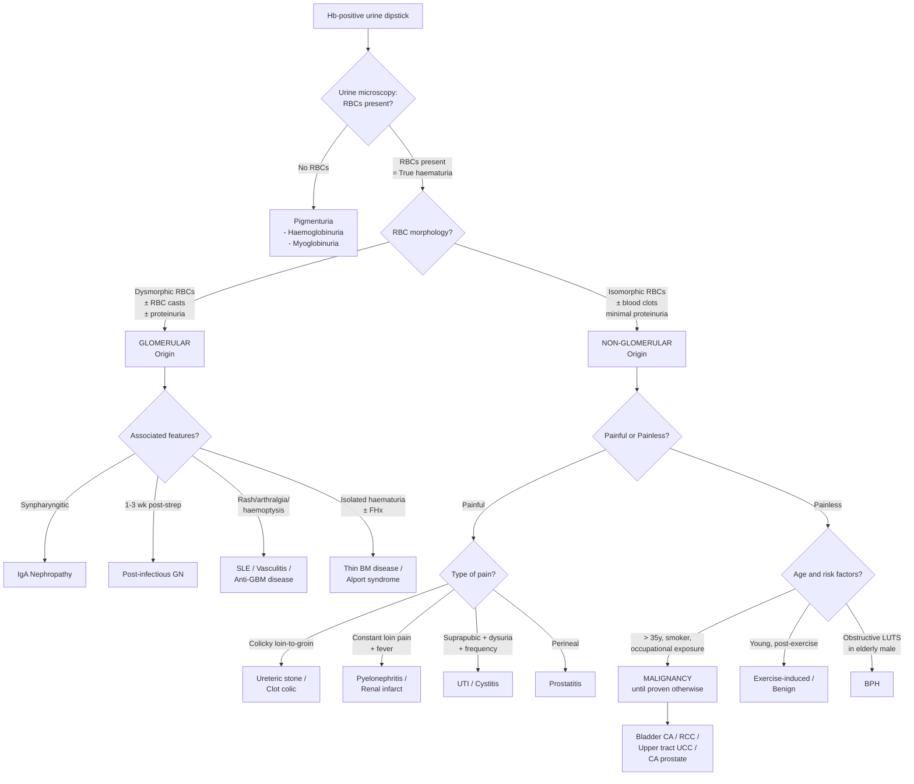

## Differential Diagnosis of Haematuria

The differential diagnosis of haematuria is one of the most commonly tested clinical scenarios. The key to approaching it logically is to remember that blood can enter the urine at **any point along the urinary tract** — from the glomerulus all the way to the urethral meatus. Your job is to figure out *where* and *why*.

The first and most critical branch point is: **Is the bleeding glomerular or non-glomerular (urological)?** This single determination narrows your differential by half and dictates the entire subsequent workup.

---

### Step 1: Glomerular vs Non-Glomerular (Urological) Haematuria

Before you even think about specific diagnoses, urine microscopy tells you which "world" you are in:

| Feature | Glomerular | Non-Glomerular (Urological) |
|---------|------------|----------------------------|
| **RBC morphology** | **Dysmorphic** (irregular membrane, acanthocytes) — because RBCs are deformed as they squeeze through damaged GBM under filtration pressure | **Isomorphic** (normal, round) — because RBCs enter urine directly without traversing GBM |
| **RBC casts** | Present (RBCs trapped in Tamm-Horsfall protein secreted by tubular cells) | Absent |
| **Blood clots** | Absent — urokinase and tPA in glomerular filtrate prevent clot formation [8][2] | May be present — blood clots indicate heavy focal bleeding with whole blood shed into urine in amounts sufficient to support clot formation [8] |
| **Proteinuria** | Usually significant (> 500 mg/day; often nephrotic-range) — GBM damage lets both protein and RBCs through | Usually absent or minimal (< 500 mg/day) |
| **Urine colour** | Smoky brown / cola-coloured — haemoglobin degrades during transit through nephron [4][9] | Bright red or pink — fresh blood mixes directly with urine |

> ***Gross haematuria with passage of clot ALWAYS indicates NON-glomerular bleeding*** [8]. This is a high-yield exam point — if there are clots, you can essentially exclude a glomerular source.

<Callout title="Why No Clots in Glomerular Bleeding?" type="idea">
Glomerular bleeding is a diffuse capillary process where minute amounts of blood are added to a relatively large volume of glomerular filtrate. Additionally, urokinase and tissue-type plasminogen activator (tPA) produced in the glomeruli and tubules actively lyse any fibrin that forms. The combination of dilution and active fibrinolysis makes clot formation essentially impossible in glomerular haematuria [8][2].
</Callout>

---

### Step 2: The Complete Differential — Organized Anatomically

The most systematic way to build your differential is to walk down the urinary tract from kidney to urethra, then consider systemic causes. This ensures you never miss a diagnosis [4][8][9].

#### A. Renal — Glomerular Causes

These present with dysmorphic RBCs, RBC casts, proteinuria, cola-coloured urine, and no clots.

| Diagnosis | Distinguishing Clinical Features | Key Pathophysiology |
|-----------|--------------------------------|---------------------|
| **IgA nephropathy** | ***Synpharyngitic haematuria*** (during/within 1–2 days of URTI); adult onset; may have flank pain + low-grade fever during episodes; slowly progressive over decades [10] | Abnormally glycosylated IgA1 → mesangial deposition → complement activation → mesangial proliferative GN |
| **Post-infectious GN** | Haematuria 1–3 weeks AFTER streptococcal pharyngitis/impetigo (latent period); nephritic features (HTN, oedema, oliguria); typically children | Immune complex (IgG + streptococcal antigen) deposition → subepithelial humps → complement activation → endocapillary proliferative GN |
| **Thin basement membrane disease** | Persistent microscopic haematuria; benign course; FHx of haematuria (AD inheritance); normal renal function and BP [11] | Uniformly thin GBM (< 250 nm vs normal ~300–400 nm) → RBCs cross more easily; 30–50% have FHx |
| **Alport syndrome** | X-linked dominant (80%); progressive sensorineural hearing loss + ocular abnormalities (anterior lenticonus, dot-and-fleck retinopathy); FHx of renal failure/deafness in male relatives; childhood onset [11] | Mutation in type IV collagen (COL4A3/4/5) → structurally abnormal GBM → progressive nephritis |
| **Lupus nephritis** | Part of SLE — malar rash, oral ulcers, arthralgia, serositis, cytopenias; isolated proteinuria/haematuria or nephrotic/nephritic syndrome [6][12] | Immune complex deposition → complement activation → variable patterns of glomerular inflammation (Class I–VI) |
| **ANCA-associated vasculitis** (GPA, MPA, EGPA) | ***Haemoptysis (pulmonary-renal syndrome)***; epistaxis/rhinorrhoea (GPA); purpuric rash; rapidly progressive renal failure [2] | Pauci-immune necrotizing/crescentic GN; ANCA activates neutrophils → endothelial damage |
| **Anti-GBM disease** (Goodpasture) | Pulmonary-renal syndrome: haemoptysis + rapidly progressive GN; young males (smoking predisposes lung involvement) | Autoantibodies against α3 chain of type IV collagen in GBM + alveolar BM → linear IgG deposition |
| **IgA vasculitis** (HSP) | Purpuric rash (buttocks/legs) + abdominal pain + arthralgia + haematuria; typically children | IgA deposition in mesangium (histologically identical to IgA nephropathy) + systemic small vessel vasculitis |
| **MPGN** | Episodic gross haematuria in children/young adults; may have low C3 | Subendothelial/intramembranous immune complex deposition → mesangial proliferation + GBM thickening |

<Callout title="IgA Nephropathy vs Post-Infectious GN: Timing is Everything">
Both present with haematuria after pharyngitis, but the **timing** is completely different. **IgA nephropathy** = synpharyngitic (haematuria *during* the URTI, because a mucosal infection triggers a surge in already-elevated IgA). **Post-infectious GN** = haematuria 1–3 weeks *after* infection (the latent period reflects the time needed to generate IgG antibodies against streptococcal antigens and form immune complexes). This is the most commonly tested distinction in exams [10][11].
</Callout>

#### B. Renal — Non-Glomerular (Tubular/Interstitial/Vascular) Causes

| Diagnosis | Distinguishing Clinical Features | Key Pathophysiology |
|-----------|--------------------------------|---------------------|
| **Renal cell carcinoma (RCC)** | Traditional triad: ***painless haematuria*** + flank pain + palpable flank mass (only ~10% have all three); constitutional symptoms; paraneoplastic features (HTN, hypercalcaemia, polycythaemia); left varicocele [4][9] | Tumour invades collecting system; neovascularization with fragile vessels |
| **Polycystic kidney disease (PKD)** | Bilateral palpable kidneys; insidious HTN; FHx (AD); associated berry aneurysms [4][9] | Cyst haemorrhage or rupture into collecting system |
| **Pyelonephritis** | High fever, vomiting, loin pain; often with LUTS [9] | Ascending infection → parenchymal inflammation → mucosal damage |
| **Renal infarction** | Sudden-onset loin pain + haematuria; source of embolism (AF, endocarditis, aortic athero) [9] | Ischaemic necrosis of renal parenchyma → haemorrhage into collecting system |
| **Renal TB** | Sterile pyuria; chronic constitutional symptoms; TB contact history [4] | Granulomatous inflammation → caseous necrosis → erosion into collecting system |
| **Papillary necrosis** | Flank pain + haematuria + passage of tissue; seen in sickle cell, analgesic nephropathy, DM, pyelonephritis [10] | Ischaemic necrosis of renal papillae (which have tenuous blood supply) → sloughing into collecting system |
| **Renal vein thrombosis** | Flank pain + haematuria; associated with nephrotic syndrome (esp. membranous nephropathy) | Venous congestion → haemorrhagic infarction of kidney |
| **Renal AVM / angiomyolipoma** | Intermittent gross haematuria, sometimes massive; angiomyolipoma associated with tuberous sclerosis [8] | Abnormal/fragile vessels rupture into collecting system |
| **Simple renal cyst** | Usually asymptomatic; rarely spontaneous rupture → haematuria + flank pain [10] | Cyst rupture or haemorrhage into collecting system |

#### C. Ureteral Causes

| Diagnosis | Distinguishing Clinical Features | Key Pathophysiology |
|-----------|--------------------------------|---------------------|
| **Ureteric stones** | Unilateral colicky loin-to-groin pain; may have passage of stones; Hx of previous stones [9] | Mechanical abrasion of urothelium by calculus at points of ureteric narrowing (PUJ, pelvic brim, VUJ) |
| **Upper tract urothelial carcinoma** | Painless haematuria; smoking/chemical exposure Hx; may have clot colic (vermiform clots from ureter) [8] | Field cancerization — same urothelium exposed to same carcinogens as bladder → neoplastic transformation |

#### D. Bladder Causes

| Diagnosis | Distinguishing Clinical Features | Key Pathophysiology |
|-----------|--------------------------------|---------------------|
| ***UTI / Cystitis*** | ***Most common cause of haematuria (~60%)*** [2]; dysuria, frequency, urgency, suprapubic pain | Bacterial infection → acute mucosal inflammation → capillary damage → bleeding |
| **Bladder cancer (urothelial carcinoma)** | ***Painless gross haematuria in elderly = malignancy until proven otherwise*** [1][4]; irritative LUTS; ***risk factors: smoking, occupation, chemicals*** [1] | Neoplastic transformation of urothelium → tumour neovascularization → friable vessels bleed into bladder lumen |
| **Bladder stones** | Irritative LUTS + terminal haematuria (stone irritates trigone/bladder neck); may have intermittent stream (stone "ball-valves" at bladder outlet) [9] | Mechanical irritation of bladder mucosa |
| **Radiation cystitis** | Delayed presentation (years after pelvic irradiation for cervical/colorectal cancer) [4][9] | Radiation → endarteritis obliterans → mucosal ischaemia → telangiectasia → bleeding |
| **Haemorrhagic cystitis** | Patient on cyclophosphamide/ifosfamide for haematological malignancy; or viral cystitis (BK virus, adenovirus) [4][9] | Acrolein (cyclophosphamide metabolite) directly toxic to urothelium; prevented with MESNA (2-mercaptoethane sulfonate, which binds acrolein in urine) |
| **Schistosomiasis** | Endemic travel history (Africa, Middle East); chronic terminal haematuria; long-term → SCC of bladder | *S. haematobium* eggs deposit in bladder wall → granulomatous inflammation → fibrosis |

#### E. Prostatic Causes (Males)

| Diagnosis | Distinguishing Clinical Features | Key Pathophysiology |
|-----------|--------------------------------|---------------------|
| **BPH** | Advanced age; obstructive LUTS (hesitancy, weak stream, straining, dribbling, incomplete emptying); diagnosis by exclusion after malignancy ruled out [4][9] | Stromal/glandular hyperplasia → increased vascularity with fragile vessels → rupture → haematuria |
| **Prostate cancer** | Usually obstructive LUTS; haematuria uncommon unless locally advanced [9] | Local invasion into prostatic urethra or bladder neck |
| **Prostatitis** | Perineal pain; dysuria; fever (if acute); tender/boggy prostate on DRE | Infection/inflammation → mucosal bleeding in prostatic urethra |

#### F. Urethral Causes

| Diagnosis | Distinguishing Clinical Features | Key Pathophysiology |
|-----------|--------------------------------|---------------------|
| **Urethritis** | Urethral discharge; dysuria; STI risk factors | Gonococcal/chlamydial infection → mucosal inflammation |
| **Urethral stricture** | History of previous infection, trauma, or instrumentation; poor stream | Chronic fibrosis → mucosal fragility → bleeding |
| **Urethral trauma** | History of straddle injury (bulbar urethra) or pelvic fracture (membranous urethra); blood at meatus; high-riding prostate [2] | Direct mucosal disruption |

#### G. Systemic / Haematological Causes

| Diagnosis | Distinguishing Clinical Features | Key Pathophysiology |
|-----------|--------------------------------|---------------------|
| **Haemophilia** | Known bleeding disorder; haemarthrosis, soft tissue haematoma; haematuria common in severe haemophilia but NOT associated with ↓ renal function [7] | Deficiency of factor VIII (A) or IX (B) → impaired coagulation → mucosal bleeding tendency |
| **Anticoagulant/antiplatelet use** | ***Drug history; does NOT cause haematuria de novo but unmasks underlying pathology*** [1][2] | Reduced haemostatic capacity → easier bleeding from pre-existing lesions |
| **Sickle cell disease/trait** | African descent; episodes of pain crisis; papillary necrosis; rare: renal medullary carcinoma | Sickling in vasa recta → medullary ischaemia → papillary necrosis |
| **DIC** | Acutely ill patient; petechiae, mucosal bleeding, oozing from IV sites | Consumption of clotting factors + fibrinolysis → widespread haemorrhagic tendency |
| **Thrombocytopenia** | Petechiae, purpura, mucosal bleeding | Insufficient platelet plug formation |

> ***Bleeding tendencies seldom cause haematuria on their own — 81% are associated with an underlying urinary cause*** [4][9]. Always investigate further.

#### H. Miscellaneous / Benign Causes

| Diagnosis | Distinguishing Clinical Features | Key Pathophysiology |
|-----------|--------------------------------|---------------------|
| **Exercise-induced haematuria** | Transiently after strenuous exercise; resolves after rest; diagnosis by exclusion [4][9] | Possibly friction abrasion of collapsed bladder walls during dehydration in runners |
| **Benign idiopathic haematuria** | May be associated with exercise, febrile illness, or vaccination; may be familial; diagnosis by exclusion [9] | Unknown; likely multifactorial including subclinical injury |
| **Endometriosis of urinary tract** | Cyclical haematuria coinciding with menstruation (rare) [8] | Ectopic endometrial tissue in bladder/ureter responds to hormonal cycle |
| **Nutcracker syndrome** | Left flank pain + haematuria; young/thin patients | Left renal vein compression between aorta and SMA → venous hypertension |
| **Loin pain haematuria syndrome** | Recurrent unilateral loin pain + haematuria; no identifiable cause; typically young women | Unknown; diagnosis of exclusion |

---

### Step 3: Clinical Reasoning Algorithm — Narrowing the Differential

The following mermaid diagram shows the systematic approach to narrowing the differential diagnosis of haematuria, starting from the dipstick result and branching through key decision points:

---

### Step 4: Key Discriminating Features — The "Red Flags"

These are the clinical features that should immediately raise your index of suspicion for specific diagnoses:

| Red Flag | Think... | Why? |
|----------|----------|------|
| ***Painless gross haematuria, age > 35*** [1][4] | ***Malignancy*** | Tumours bleed without pain (no acute obstruction/inflammation) |
| ***Blood clots in urine*** [1][8] | ***Non-glomerular cause*** (likely urological) | Urokinase prevents clots in glomerular bleeding |
| Cola-coloured urine + proteinuria + RBC casts | Glomerulonephritis | GBM damage allows RBCs + protein; Hb degrades during transit |
| Haematuria during URTI | IgA nephropathy | IgA surge during mucosal infection → mesangial deposition |
| Haematuria 1–3 weeks after pharyngitis | Post-infectious GN | Latent period for adaptive immune response |
| ***Haemoptysis + haematuria*** [2] | ***Pulmonary-renal syndrome*** (anti-GBM, ANCA vasculitis) | Shared antigen in alveolar + glomerular basement membranes |
| Colicky loin-to-groin pain | Ureteric stone | Peristalsis against obstruction |
| ***Smoking history, rubber/dye/chemical worker*** [1] | Urothelial carcinoma | Aromatic amines concentrated in urine → direct urothelial carcinogenesis |
| Bilateral flank masses + FHx | Polycystic kidney disease | Autosomal dominant; bilateral cyst expansion |
| New left varicocele (non-decompressing supine) | RCC | Tumour thrombus in left renal vein → obstructed left testicular vein drainage |
| Sterile pyuria + haematuria | Renal TB | Granulomatous infection; standard cultures negative for TB |
| Cyclical haematuria with menses | Bladder/ureteral endometriosis | Ectopic endometrial tissue responds to hormonal cycle |

---

### The "Big Three" Differentials You Must Always Consider

No matter what the presentation, always actively consider these three categories:

1. ***Malignancy*** — **the most worrying cause**; must be excluded in every patient with haematuria, especially if > 35 years old, male, smoker [1][2][4]
2. ***UTI*** — **the most common cause (~60%)**; usually obvious with dysuria/frequency but can present with isolated haematuria [2]
3. ***Stones (~10%)*** — usually obvious with colicky pain but can be painless if non-obstructing [2]

After these three are considered, broaden to:
4. **Glomerulonephritis (~5%)** — look for systemic features, proteinuria, dysmorphic RBCs [2]
5. **BPH, trauma, iatrogenic** — context-dependent [2]

<Callout title="Exam Tip: The 'Must-Not-Miss' Diagnosis" type="error">
In any exam question about haematuria — whether gross or microscopic — if the patient is over 35–40 years old, the answer for "most important diagnosis to exclude" is almost always **urological malignancy (bladder cancer, RCC, upper tract UCC)**. Even if the patient is on anticoagulants, even if there's a "likely" benign cause, you must still investigate for malignancy. Anticoagulation unmasks but does not cause haematuria [1][2].
</Callout>

---

### Special Considerations in Differential Diagnosis

#### Isolated Glomerular Haematuria [11]

When a patient (often young) presents with persistent microscopic haematuria, normal BP, normal renal function, and no systemic disease, the differential classically narrows to **three causes**:

1. **IgA nephropathy** — most common; adult onset; synpharyngitic gross haematuria episodes; may have flank pain and AKI
2. **Alport syndrome** — X-linked; childhood onset; sensorineural hearing loss + ocular abnormalities (anterior lenticonus); FHx of renal failure/deafness in males
3. **Thin basement membrane disease (TBMD)** — AD; generally benign; persistent microscopic haematuria; 30–50% have FHx of haematuria; gross haematuria unusual (< 10%)

**Distinguishing them clinically** [11]:
- Hx of gross haematuria: common in IgAN and Alport, unusual in TBMD
- FHx of CKD/deafness: Alport
- FHx of benign haematuria: TBMD
- Definitive: renal biopsy (IgA deposits in IgAN; thin/splitting GBM in Alport; uniformly thin GBM in TBMD) or genetic testing for COL4A mutations

#### Haematuria with Concurrent Haemoptysis (Pulmonary-Renal Syndrome) [2]

This is a medical emergency. The differential includes:
- **Anti-GBM disease (Goodpasture)**: linear IgG on GBM; type IV collagen autoantibodies
- **ANCA-associated vasculitis** (GPA, MPA): pauci-immune crescentic GN; c-ANCA (GPA) or p-ANCA (MPA)
- **SLE**: immune complex-mediated; multi-system involvement
- **IgA vasculitis** (HSP): rare in adults; palpable purpura

#### Drug-Related Haematuria [8][4]

Always review the drug chart:
- **Cyclophosphamide / ifosfamide** → haemorrhagic cystitis (acrolein metabolite)
- **Anticoagulants / antiplatelets** → unmask underlying lesion (not a cause per se)
- **NSAIDs** → can cause AIN, papillary necrosis
- **Radiation** → radiation cystitis (delayed by years)

---

<Callout title="High Yield Summary">

1. **First branch point**: Urine microscopy — dysmorphic RBCs/casts = glomerular; isomorphic RBCs ± clots = non-glomerular. Clots ALWAYS indicate non-glomerular bleeding.

2. **Most common cause**: UTI (~60%). **Most worrying**: Malignancy. **Others**: Stones (~10%), GN (~5%), BPH, trauma, iatrogenic.

3. **Painless gross haematuria in > 35y = malignancy until proven otherwise.**

4. **IgA nephropathy** = synpharyngitic (during URTI). **Post-infectious GN** = 1–3 weeks after strep infection. Timing distinguishes them.

5. **Isolated glomerular haematuria** in young patient = IgA nephropathy vs Alport syndrome vs thin basement membrane disease.

6. **Pulmonary-renal syndrome** (haemoptysis + haematuria) = anti-GBM disease, ANCA vasculitis, SLE.

7. **Bleeding tendencies** (haemophilia, anticoagulants) seldom cause haematuria alone — 81% have underlying urinary pathology → always investigate.

8. **Risk-stratify microscopic haematuria** using AUA criteria (age, sex, smoking pack-years, RBC/HPF count, additional risk factors) to guide investigation intensity.

9. **Anatomical walk-through** (kidney → ureter → bladder → prostate → urethra → systemic) ensures no diagnosis is missed.

10. **Don't forget pseudohaematuria**: haemoglobinuria, myoglobinuria, food/drug pigments — confirmed by microscopy showing no RBCs.
</Callout>

---

<ActiveRecallQuiz
  title="Active Recall - Differential Diagnosis of Haematuria"
  items={[
    {
      question: "Name three key urine microscopy findings that distinguish glomerular from non-glomerular haematuria, and explain the pathophysiological basis for each.",
      markscheme: "1. Dysmorphic RBCs (glomerular) vs isomorphic RBCs (non-glomerular) - RBCs deformed as they squeeze through damaged GBM. 2. RBC casts (glomerular only) - RBCs trapped in Tamm-Horsfall protein in tubules. 3. Blood clots (non-glomerular only) - urokinase and tPA in glomerular filtrate prevent clot formation. Also accept: significant proteinuria (glomerular) vs minimal (non-glomerular) due to concurrent GBM damage."
    },
    {
      question: "A 6-year-old boy presents with haematuria, purpuric rash on the buttocks and legs, abdominal pain, and arthralgia. What is the most likely diagnosis, and what is the renal histology?",
      markscheme: "IgA vasculitis (Henoch-Schonlein purpura). Renal biopsy shows mesangial IgA deposition - histologically identical to IgA nephropathy but with systemic small vessel vasculitis. The tetrad is: palpable purpura + abdominal pain + arthralgia + renal involvement (haematuria/proteinuria)."
    },
    {
      question: "List the three classic causes of isolated glomerular haematuria in a young patient. State one feature that distinguishes each from the others.",
      markscheme: "1. IgA nephropathy - synpharyngitic gross haematuria, adult onset. 2. Alport syndrome - sensorineural hearing loss plus ocular abnormalities (anterior lenticonus), X-linked with FHx of renal failure and deafness in males. 3. Thin basement membrane disease (TBMD) - benign course, AD inheritance, gross haematuria unusual (under 10%), FHx of isolated haematuria."
    },
    {
      question: "A 70-year-old male ex-smoker presents with a single episode of painless gross haematuria with blood clots. What is the most important diagnosis to exclude, and why do clots exclude a glomerular source?",
      markscheme: "Most important diagnosis: urological malignancy (bladder cancer most likely given age and smoking). Clots exclude glomerular source because urokinase and tPA in glomerular filtrate prevent fibrin clot formation. Clots indicate heavy focal bleeding where whole blood enters the urinary tract in sufficient volume to support coagulation - i.e. a non-glomerular (urological) source."
    },
    {
      question: "A patient with haematuria is found to be on warfarin for AF. Does this change the need for investigation? Why or why not?",
      markscheme: "No - anticoagulants do NOT cause haematuria de novo. They unmask underlying pathology by reducing haemostatic capacity at a pre-existing bleeding site. 81% of patients with haematuria on anticoagulants have an identifiable underlying urinary cause. Full investigation including cystoscopy and upper tract imaging is still mandatory."
    }
  ]}
/>

## References

[1] Lecture slides: GC 183. Common urological malignancies and their presentations - Nov 7.pdf (p6, p13)
[2] Senior notes: maxim.md (Section 2.1 Common urological complaints - Haematuria)
[4] Senior notes: Ryan Ho Urogenital.pdf (p130, p132, p136)
[6] Senior notes: Ryan Ho Rheumatology.pdf (p69–70 - SLE)
[7] Senior notes: Ryan Ho Haemtology.pdf (p124 - Haemophilia)
[8] Senior notes: felixlai.md (Haematuria section)
[9] Senior notes: Ryan Ho Fundamentals.pdf (p340, p342)
[10] Senior notes: Ryan Ho Urogenital.pdf (p59 - IgA Nephropathy; p94 - Analgesic Nephropathy)
[11] Senior notes: Ryan Ho Fundamentals.pdf (p358 - Isolated Glomerular Haematuria)
[12] Senior notes: Ryan Ho Rheumatology.pdf (p32 - Extra-articular features)
