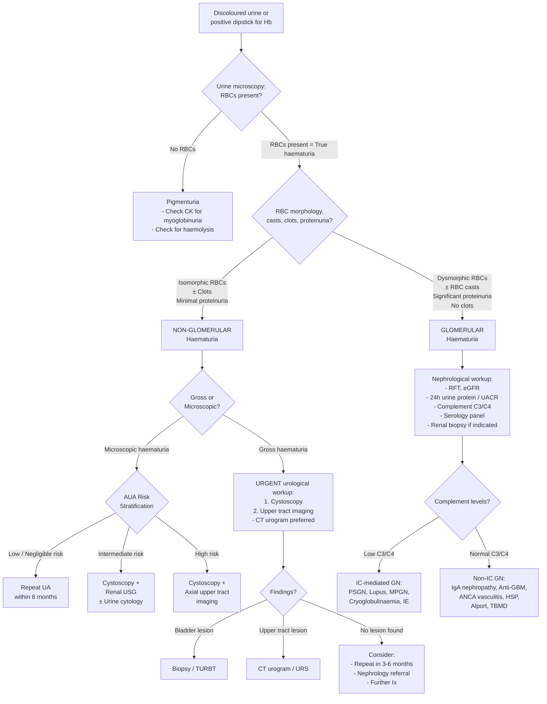

## Diagnostic Criteria, Diagnostic Algorithm, and Investigations for Haematuria

### Diagnostic Criteria: Confirming True Haematuria

There is no single "diagnostic criteria" for haematuria the way there is for, say, SLE. Instead, the diagnosis of haematuria itself is straightforward — it is a laboratory finding. The challenge is confirming it is *real* (not pseudohaematuria) and then systematically determining its *cause*. Let's build this from first principles.

#### Step 1: Confirm True Haematuria

**Urine dipstick** is the initial screening test. It detects the peroxidase activity of the haem moiety — which is present in intact RBCs (haematuria), free haemoglobin (haemoglobinuria), AND myoglobin (myoglobinuria). Therefore:

> ***All Hb-positive dipstick results should be accompanied by urine microscopy*** to differentiate true haematuria from pigmenturia [2].

| Dipstick Result | Microscopy Finding | Interpretation |
|----------------|-------------------|----------------|
| Hb positive | **RBCs present** | **True haematuria** |
| Hb positive | **No RBCs** | **Pigmenturia** — haemoglobinuria (haemolysis) or myoglobinuria (rhabdomyolysis) [3] |
| Hb negative | No RBCs | Not haematuria — consider food/drug pigments if urine is discoloured |

**Definitions for confirmed haematuria** [2][8]:
- **Gross haematuria**: Red or brown urine visible to the naked eye; confirmed by centrifugation → red sediment with clear supernatant = haematuria; red supernatant → test with dipstick (positive = haemoglobinuria/myoglobinuria; negative = drug/food pigment) [8]
- **Microscopic haematuria**: **≥3 RBC per HPF in 2 out of 3 properly collected midstream urine specimens** processed by centrifugation [2]

<Callout title="False Positives on Dipstick" type="error">
Dipstick can give false-positive results for blood in the presence of: menstrual contamination, post-ejaculation, myoglobinuria, haemoglobinuria, high-dose vitamin C (rarely causes false negatives via interference with peroxidase reaction), and concentrated/alkaline urine. Always confirm with microscopy [8][4].
</Callout>

#### Step 2: Determine Glomerular vs Non-Glomerular Origin

Once true haematuria is confirmed, the **single most important diagnostic step** is urine microscopy to determine the origin of bleeding:

| Finding | Glomerular | Non-Glomerular |
|---------|-----------|----------------|
| **RBC morphology** | ***Dysmorphic RBCs*** — irregular cell membrane, budding. ***Acanthocytes*** (ring-shaped RBCs with vesicle-shaped protrusions) are diagnostic of GN [8][13] | ***Isomorphic RBCs*** — normal round biconcave discs |
| **RBC casts** | ***Present*** — RBCs conform to the tubular shape when trapped in Tamm-Horsfall protein secreted by tubular cells → diagnostic of GN [8][13] | Absent |
| ***Blood clots*** | ***Absent*** — urokinase + tPA in glomerular filtrate prevent clot formation [8][2] | ***May be present*** — whole blood shed in sufficient volume to support coagulation |
| **Proteinuria** | Usually significant (> 500 mg/day), often with concurrent nephrotic-range features | Minimal or absent |
| **Urine colour** | Smoky brown / cola-coloured (Hb degradation during transit) [4][9] | Bright red or pink (fresh blood) |

> **High Yield**: ***Acanthocytes*** (> 5% of urinary RBCs) are considered the most specific dysmorphic RBC type for glomerular bleeding [8]. ***RBC casts are diagnostic of glomerulonephritis*** [8][13].

---

### The Diagnostic Algorithm

The workup for haematuria proceeds through a logical sequence: confirm → localize origin → identify cause → risk-stratify. The approach differs depending on whether haematuria is gross or microscopic, and glomerular or non-glomerular.

#### Master Algorithm — Mermaid Diagram

---

### Detailed Investigation Modalities

Now let's go through each investigation systematically — what it is, why we do it, what we find, and how to interpret the results.

---

#### 1. Urinalysis (Bedside — The Most Important First Test)

This is always the starting point. It encompasses dipstick, biochemistry, microscopy, microbiology, and cytology.

##### a) Urine Dipstick [4][9]

| Parameter Tested | Clinical Relevance |
|-----------------|-------------------|
| **Blood (Hb)** | Detects haem → must confirm with microscopy (true haematuria vs pigmenturia) |
| **Protein** | Concomitant proteinuria suggests glomerular origin |
| **Nitrites** | Produced by Gram-negative bacteria (e.g., *E. coli*) reducing urinary nitrates → suggests UTI |
| **Leukocyte esterase** | Enzyme released by WBCs → suggests pyuria/infection |
| **Glucose** | Glycosuria → DM (relevant because DM nephropathy causes proteinuria ± haematuria) |
| **pH** | Alkaline pH (> 7.0) → UTI with urease-producing organisms (Proteus) → struvite stones |

##### b) Urine Microscopy [2][4][8][13]

This is where the magic happens. The centrifuged urine sediment tells you almost everything:

| Finding | Significance | Mechanism |
|---------|-------------|-----------|
| **Dysmorphic RBCs** | Glomerular origin | Mechanical + osmotic trauma as RBCs pass through damaged GBM and through tubules with varying osmolality |
| ***Acanthocytes*** | ***Diagnostic of glomerulonephritis*** [8] | Ring-shaped RBCs with vesicle-shaped protrusions — most specific type of dysmorphic RBC |
| ***RBC casts*** | ***Diagnostic of glomerulonephritis*** [8][13] | RBCs trapped in Tamm-Horsfall protein (uromodulin) secreted by thick ascending limb → conform to tubular shape |
| **Isomorphic RBCs** | Non-glomerular (urological) origin | Normal RBCs entering urine directly without traversing GBM |
| **WBCs (pyuria > 5 WBC/HPF)** | UTI, interstitial nephritis, renal TB | Inflammatory response → WBCs migrate into urine |
| **WBC casts** | Pyelonephritis, interstitial nephritis | WBCs trapped in Tamm-Horsfall protein in tubules |
| **Granular casts ("muddy brown")** | Acute tubular necrosis (ATN) [13] | Degenerating tubular cells + protein matrix |
| **Epithelial casts** | ATN | Sloughed tubular epithelial cells in Tamm-Horsfall matrix |
| **Bacteria** | UTI | Direct visualisation of organisms |
| **Crystals** | Urolithiasis (depending on type) | Supersaturation → crystal formation in urine |

##### c) Urine Microbiology [4][9]

| Test | Indication | Key Findings |
|------|-----------|-------------|
| **Culture and sensitivity (C/ST)** | All patients with haematuria — to exclude UTI | Significant bacteriuria (> 10⁵ CFU/mL in midstream specimen) + sensitivity pattern guides antibiotic choice |
| ***Early morning urine (EMU) × AFB*** [4][9] | **Suspect renal TB** — sterile pyuria, constitutional symptoms, TB contact | *M. tuberculosis* on AFB culture (Sens 10–90%, Spec ~100%) or TB-PCR (Sens 87–100%, Spec 93–98%) [14] |

<Callout title="Sterile Pyuria: Always Think TB" type="idea">
If you see WBCs in the urine but standard cultures are negative ("sterile pyuria"), the differential includes: renal TB (send EMU × 3 for AFB culture + TB-PCR), partially treated UTI, interstitial nephritis, and appendicitis/diverticulitis adjacent to the ureter. In Hong Kong, always consider TB [4][14].
</Callout>

##### d) Urine Cytology [4][9]

- **What it is**: Examination of exfoliated cells in fresh urine for malignant features
- **Why we do it**: To detect urothelial carcinoma, especially high-grade tumours and carcinoma-in-situ (CIS)
- **Performance**: Overall sensitivity ~50% (poor for low-grade tumours), but ***very specific (> 98%)*** [4]
  - Sensitivity increases with tumour grade: 12% for grade 1, 26% for grade 2, 64% for grade 3 [4]
  - ***Can detect high-grade TCC before gross lesion becomes visible (i.e., CIS of bladder)*** [4][9]
- **Practical tips**:
  - Send **fresh** urine (cells degrade rapidly)
  - **Avoid first morning void** (too many degenerating epithelial cells) → ***send 2nd void on 3 consecutive days*** [4]
  - **Atypical cytology can occur in UTI** → repeat in a few weeks if UTI present [4][9]
- **Findings reported**: Normal, atypical, suspicious, malignant [9]
- **Role**: Adjunct to cystoscopy at diagnosis and for surveillance of recurrent urothelial tumours

> ***Despite advancing imaging and urine biomarkers, non-invasive tests alone CAN NEVER replace cystoscopy/TURBT for diagnosis of bladder cancer*** [4].

---

#### 2. Blood Tests

| Test | Purpose | Key Findings and Interpretation |
|------|---------|-------------------------------|
| **CBC** | Anaemia from chronic blood loss or malignancy; leukocytosis in UTI/infection [4][9] | Normocytic normochromic anaemia (chronic disease, haemolysis); microcytic hypochromic (iron deficiency from chronic blood loss); ↑WCC (infection) |
| **RFT (Cr, urea, eGFR)** | Assess renal function; renal impairment suggests intrinsic renal disease [4][9][13] | ↑Cr + ↓eGFR → renal cause. Urea >> creatinine disproportionately → pre-renal state |
| **Clotting profile (PT, APTT)** | Screen for coagulopathy; assess if on anticoagulants [8] | Prolonged PT/APTT → coagulopathy → but still investigate for underlying urological cause |
| **ESR / CRP** | Non-specific inflammatory markers | ↑ in infection, autoimmune disease, malignancy |
| **Serum albumin** | Nephrotic syndrome if low | ↓albumin → nephrotic-range proteinuria → glomerular cause |
| **Blood glucose / HbA1c** | DM (risk factor for UTI, diabetic nephropathy, papillary necrosis) | |
| **Serum calcium** | Hypercalcaemia → hyperparathyroidism → stones; paraneoplastic (RCC) | |

##### Immunological/Serological Panel (When Glomerular Origin Suspected) [4][9][15]

This panel helps narrow the glomerular differential. The logic is based on the pathogenesis of each GN:

| Test | What It Detects | Interpretation |
|------|----------------|----------------|
| ***Serum complement C3/C4*** [15] | Complement consumption by immune complexes | ***↓C3/C4 → immune complex (IC)-mediated GN***: PSGN, lupus nephritis, MPGN, cryoglobulinaemia, infective endocarditis. ***Normal C3/C4 → non-IC-mediated GN***: IgA nephropathy, anti-GBM disease, ANCA-associated vasculitis, HSP, Alport, TBMD [15] |
| **ANCA (c-ANCA, p-ANCA)** | Anti-neutrophil cytoplasmic antibodies | c-ANCA (anti-PR3) → GPA; p-ANCA (anti-MPO) → MPA, EGPA |
| **ANA, anti-dsDNA** | Antinuclear antibodies | ANA + anti-dsDNA → SLE/lupus nephritis |
| **Anti-GBM antibodies** | Antibodies against type IV collagen α3 chain | Positive → anti-GBM disease (Goodpasture) |
| **ASLO titre** | Evidence of recent streptococcal infection | ↑ASLO → PSGN (confirms recent strep, NOT diagnostic alone) |
| **HBsAg, anti-HCV** | Hepatitis B/C infection | HBV/HCV-associated MPGN or PAN |
| **Cryoglobulins (cryocrit)** | Cryoglobulinaemia | A/w HCV infection → IC-mediated GN |
| **Blood cultures** | Infective endocarditis | Persistent bacteraemia → IC deposition → GN |
| **Serum IgA** | IgA nephropathy | ↑IgA in ~50% (non-specific but supportive) |
| **SPE (serum protein electrophoresis)** | Multiple myeloma | Monoclonal spike → light chain deposition, amyloid |

<Callout title="The Complement Shortcut">
The serum complement level is one of the most useful "shortcut" tests in glomerular haematuria. If C3/C4 is low, you know the GN is immune-complex mediated (complement being consumed). If C3/C4 is normal, the GN is pauci-immune (ANCA-vasculitis, anti-GBM) or IgA-related (IgA nephropathy activates complement via the alternative pathway, but levels are usually normal clinically) [15]. This single test cuts your differential in half.
</Callout>

---

#### 3. Urine Protein Quantification

| Test | Method | Purpose |
|------|--------|---------|
| **Spot urine albumin-to-creatinine ratio (UACR)** | Single voided sample; albumin corrected for creatinine concentration | Quick screening for significant proteinuria; > 30 mg/mmol suggests glomerular pathology |
| **24-hour urine protein** | Collect all urine over 24 hours; measure total protein | Gold standard for quantifying proteinuria; > 150 mg/day abnormal; > 3.5 g/day = nephrotic range |

**Why this matters**: Significant proteinuria (> 500 mg/day) alongside haematuria strongly suggests glomerular origin and is an indication for renal biopsy [4][15].

---

#### 4. Imaging — Anatomical Assessment of the Urinary Tract

##### a) Ultrasonography (USG) of Kidneys and Bladder [4][9]

- **What it is**: Bedside, non-invasive, no radiation, no contrast
- **Why we do it**: First-line screening for renal masses, hydronephrosis, cortical thinning, large bladder lesions, prostate size
- **Advantages**:
  - Can readily detect renal masses, hydronephrosis, cortical thinning (chronic obstruction), some bladder lesions (if large), prostate size measurement [4]
  - Safe in pregnancy, children, renal impairment
- **Disadvantages**:
  - ***Difficulty in defining ureteric lesions*** (only proximal and distal ends of ureter visualised due to bowel gas obscuring mid-ureter) [4]
  - Operator-dependent; small tumours can be missed
- **Key findings**:

| Finding | Suggests |
|---------|---------|
| Hydronephrosis | Ureteric obstruction (stone, tumour, stricture) |
| Renal mass (solid, enhancing) | RCC |
| Multiple bilateral cysts | Polycystic kidney disease |
| Cortical thinning | Chronic obstruction, reflux nephropathy, CKD |
| Thickened bladder wall / mass | Bladder tumour |
| Increased post-void residual | Bladder outflow obstruction (BPH) |
| Small echogenic kidneys bilaterally | CKD (chronic irreversible damage) |

##### b) Non-Contrast CT (NCCT) [4][9]

- **What it is**: CT without IV contrast; the **standard investigation for suspected ureteric stones/renal colic**
- **Why we do it**: Stones are best visualised on NCCT (most urinary stones are radio-opaque on CT, including uric acid stones which are radiolucent on plain XR)
- **Advantages**: Allows assessment of level, size, density, and degree of obstruction of calculi [4]
- **Disadvantages**: Radiation exposure; does not assess soft tissue detail as well as contrast-enhanced CT; cannot detect small urothelial tumours
- **Key findings**:

| Finding | Suggests |
|---------|---------|
| High-density focus in ureter | Ureteric stone |
| Perinephric stranding | Acute obstruction |
| Hydronephrosis/hydroureter | Proximal obstruction |

##### c) CT Urogram (CTU) [4][8][9]

- **What it is**: Multi-phase CT with IV contrast — this is the ***preferred initial and standard imaging modality in unexplained haematuria*** [8]. It has **largely replaced IVU** [4].
- **Phases**:
  - **Non-contrast phase**: Detect stones (which can be masked by contrast)
  - **Nephrographic phase (~90–100s)**: Detect renal parenchymal lesions (masses enhanced by contrast become conspicuous)
  - **Excretory/delayed phase (~10–15 min)**: Contrast excreted into collecting system → opacifies renal pelvis, ureters, bladder → detect urothelial lesions (filling defects)
- **Why it's the gold standard**: ***Higher sensitivity and specificity than other imaging modalities for detection of renal mass, urinary tract calculi, pelvicalyceal and ureteric transitional cell carcinoma*** [8]
- **Disadvantages**: Radiation (↑↑), contrast allergy risk, contrast nephropathy risk (especially in pre-existing renal impairment or diabetes) [4]
- **Key findings**:

| Finding | Suggests |
|---------|---------|
| Enhancing renal mass | RCC |
| Filling defect in renal pelvis/ureter | Upper tract urothelial carcinoma |
| Filling defect in bladder | Bladder tumour |
| Ureteric stricture with proximal dilatation | Stone, tumour, or TB |
| Thickened/enhancing bladder wall | Bladder CA or cystitis |
| Calcified renal papillae | Papillary necrosis |

##### d) Intravenous Urogram (IVU) [16]

- **What it is**: IV injection of non-ionic contrast → excreted by kidneys → opacifies urinary system on serial radiographs. "IVU" = "intra" (within) + "venous" (vein) + "urogram" (image of urinary tract)
- **Status**: ***Gradually replaced by CT urogram*** (which provides more information in the same sitting) [4]
- **Common indications**: Haematuria, loin pain [16]
- **Procedure sequence** [16]:
  - Preliminary KUB → may already show stones
  - 0 min → nephrogram (kidneys highlighted)
  - 5 min → calyces and renal pelvis opacified
  - 10 min → ureters and bladder opacified
  - Post-micturition film → assess for urinary retention
- **Key findings** [4]:

| Finding | Suggests |
|---------|---------|
| Distortion of renal outline/calyces ± calcification | RCC |
| No contrast uptake | Obstruction or non-functioning kidney |
| Filling defect with proximal dilatation | Stone or tumour |
| Filling defect in bladder | Bladder tumour |
| ↑Residual bladder volume post-micturition | BPH or BOO |
| Horseshoe kidney configuration | Anatomical variant (risk factor for stones) |

- **Contraindications** [16]: Pregnancy (radiation), previous serious contrast reaction, diabetes with renal insufficiency (risk of contrast nephropathy)
- **Advantages**: Economical; good for upper tract lesions
- **Disadvantages**: Not sensitive for renal lesions < 3 cm; cannot provide coronal/sagittal imaging; cannot detect small bladder lesions [4]

##### e) MR Urogram (MRU) [4]

- **When to use**: ***Contraindication to CT/IVU*** — pregnancy, contrast allergy, children, renal impairment [4]
- **Advantage**: No ionising radiation
- **Disadvantage**: Image quality inferior to CT (kidneys are moving organs during respiration); expensive; longer scan time; gadolinium contrast carries risk of nephrogenic systemic fibrosis in severe CKD [4]

##### f) Plain KUB (Kidneys, Ureters, Bladder) Radiograph [4][9]

- **What it is**: Plain abdominal X-ray from superior aspect of kidneys to pubic symphysis
- **Status**: Previously relied upon; now mainly an initial screening tool
- **Key findings** [4][9]:

| Finding | Suggests |
|---------|---------|
| Radio-opaque density along ureteric course | Urinary stone (~90% of urinary stones are radio-opaque on plain XR — calcium-containing and struvite; uric acid and cystine stones are radiolucent) |
| Loss of psoas shadow | Haematoma, trauma, retroperitoneal infection |
| Renal calcification | Nephrocalcinosis, renal TB (dystrophic calcification) |

- **Trace the ureter**: Kidney → tip of transverse process → sacroiliac joint → curve around ischial spine → bladder posteriorly [4]

---

#### 5. Cystoscopy — The Gold Standard for Lower Urinary Tract [4][8][9]

- **What it is**: "Cysto" = bladder, "scopy" = to look. A scope (flexible or rigid) inserted via the urethra to directly visualise the urethra, prostate, and entire bladder mucosa.
- **Types**:
  - ***Flexible cystoscopy (16 Fr)***: Performed under local anaesthetic in clinic; standard for diagnostic purposes [4]
  - ***Rigid cystoscopy***: Performed under general/spinal anaesthesia; allows washout of clots, TURBT, and more complex procedures [2]

- **Indications**: ***Should be done in ALL patients with gross non-glomerular haematuria*** (even if a stone is found on KUB — because a concurrent malignancy could coexist) [4][9]

- **Possible findings** [4]:

| Finding | Significance |
|---------|-------------|
| ***Papillary tumour with narrow stalk*** | Low-grade non-invasive bladder CA |
| ***Large, broad-based, irregular/ulcerated, sessile or nodular mass*** | High-grade invasive bladder CA |
| ***Patchy flat velvety lesions*** | Carcinoma in situ (CIS) |
| ***Ureteric jet indicating upper tract bleeding*** | Bleeding source is in kidney/ureter (localises side) |
| Normal bladder despite positive urine cytology | Suspect upper tract urothelial CA → proceed to upper tract imaging (CTU) or ureteroscopy [4] |
| Bladder stones, inflamed mucosa | Calculi, cystitis |

- **Allows biopsy for histopathological diagnosis** [4][8]

<Callout title="Why Cystoscopy Cannot Be Replaced">
Even with excellent imaging and urine biomarkers, ***cystoscopy remains irreplaceable*** [4]. CT can miss flat CIS lesions that are only a few millimetres thick. Cystoscopy can directly visualise papillary lesions as small as 1 mm — too small for any imaging modality to detect [4][9]. It also allows simultaneous biopsy/resection. For bladder cancer diagnosis and surveillance, cystoscopy is the gold standard — full stop.
</Callout>

---

#### 6. Renal Biopsy [8][4][15]

- **What it is**: Percutaneous needle biopsy of renal cortex under ultrasound guidance
- **Why we do it**: Definitive diagnosis of glomerular disease (light microscopy, immunofluorescence, electron microscopy)
- **Indications** [8][4]:
  - Glomerular haematuria with **significant proteinuria (> 1 g/day)**
  - **Rising serum creatinine** not otherwise explained
  - **Active urinary sediment** (dysmorphic RBCs, RBC casts) with progressive renal impairment
  - Nephritic syndrome (most cases require biopsy [15])
  - Suspected lupus nephritis with proteinuria > 500 mg/day [4]
  - NOT usually done for isolated microscopic haematuria with normal renal function and minimal proteinuria (usually benign course)

- **Key immunofluorescence patterns** — this is the most helpful diagnostic feature [15]:

| Pattern | Diagnosis |
|---------|-----------|
| Mesangial IgA deposition | IgA nephropathy / HSP |
| Granular IgG + C3 ("lumpy bumpy") | Immune complex GN (PSGN, lupus, MPGN) |
| Linear IgG along GBM | Anti-GBM disease (Goodpasture) |
| Pauci-immune (scant/absent Ig) | ANCA-associated vasculitis |
| Thin GBM (electron microscopy) | Thin basement membrane disease |
| Splitting/lamellation of GBM ("basket-weave") | Alport syndrome |

- **Contraindications to percutaneous renal biopsy** [8]:
  - Bleeding diathesis (coagulopathy, anticoagulation)
  - Severe hypertension (uncontrolled)
  - Solitary functioning kidney
  - Small kidneys indicative of chronic irreversible disease (biopsy won't change management)
  - Hydronephrosis
  - Renal or perirenal infection

---

#### 7. Invasive Investigations (When Standard Workup Non-Diagnostic) [4]

| Investigation | What It Is | When Used |
|--------------|-----------|-----------|
| **Retrograde pyelogram** | Contrast injected via catheterisation of lower ureter during cystoscopy → opacifies upper tract | Undiagnosed upper tract lesion when CT urogram equivocal or contraindicated |
| **Ureteroscopy (URS)** | Scope passed up the ureter to directly visualise upper tract urothelium | Suspect upper tract TCC with positive cytology but negative imaging; allows brush cytology (90% sensitivity) and biopsy — but invasive with risk of bleeding/perforation [4] |
| **Photodynamic diagnosis (PDD)** | Fluorescence cystoscopy using intravesical 5-ALA or hexaminolevulinate → tumour cells fluoresce pink/red under blue light | Enhanced detection of papillary tumours and flat CIS lesions missed by standard white-light cystoscopy [4] |

---

#### 8. Additional Specific Tests

| Test | Indication | Interpretation |
|------|-----------|----------------|
| **Pure tone audiometry** | Suspected Alport syndrome | Bilateral sensorineural hearing loss (typically high-frequency) |
| **Molecular genetic testing for COL4A3-5** | Alport syndrome or TBMD [11][4] | Confirms mutations in type IV collagen genes |
| **PSA** | Males > 50 with LUTS + haematuria | Elevated in prostate CA (but also BPH, UTI, prostatitis — organ-specific but NOT tumour-specific) [2] |
| **Urine-based biomarkers (e.g., FISH for chromosomal aneuploidy)** | Adjunct for urothelial CA surveillance | ↑Sensitivity for early recurrence, but rarely done in HK [4] |

---

### The AUA Risk-Stratified Approach to Microscopic Haematuria (2020) [1]

This is the modern, evidence-based approach specifically for **microscopic haematuria detected on urinalysis**. It replaces the old "investigate everyone the same way" approach with a nuanced risk-stratification system:

| Risk Category | Criteria | Recommended Investigation |
|---------------|----------|--------------------------|
| ***Low/Negligible-Risk*** | ***Women < 60, Men < 40; Never smoker or < 10 pack-years; 3–10 RBC/HPF on one UA; No additional risk factors for urothelial cancer*** | ***Repeat UA within 6 months*** |
| ***Intermediate-Risk*** | ***Women ≥ 60, Men 40–59; 10–30 pack-years; 11–25 RBC/HPF on one UA; One or more additional risk factors; Previously low-risk with no prior evaluation and 3–25 RBC/HPF on repeat UA*** | ***Cystoscopy and renal ultrasound. Clinicians may offer urine cytology or validated urine biomarkers (UBTMs) to facilitate decision regarding cystoscopy. Repeat UA within 12 months if cystoscopy is not performed*** |
| ***High-Risk*** | ***Men ≥ 60; > 30 pack-years; > 25 RBC/HPF on one UA; History of gross haematuria; One or more additional risk factors for urothelial cancer plus any high-risk feature*** | ***Cystoscopy and axial upper tract imaging*** |

<Callout title="Important: Women and High-Risk Category" type="error">
The AUA guideline explicitly states that ***women should not be categorized as high-risk based on age alone*** [1]. This is because the prevalence of bladder cancer in women is lower than in men of the same age. Women need additional risk factors (e.g., heavy smoking, chemical exposure, history of gross haematuria) to be classified as high-risk.
</Callout>

**What counts as "additional risk factors for urothelial cancer"?** [1]
- ***Smoking history*** (quantified in pack-years)
- ***Occupational exposure*** (rubber, dye, chemical, petroleum industries)
- ***History of gross haematuria***
- Prior urological disease, pelvic radiation, chronic UTI, chronic indwelling catheter
- Exposure to known bladder carcinogens (e.g., cyclophosphamide, aristolochic acid)

---

### Approach to Nephritic Syndrome (Glomerular Haematuria with Renal Impairment)

When glomerular haematuria is accompanied by hypertension, oedema, oliguria, and rising creatinine (nephritic syndrome), the workup follows a specific algorithm [15]:

1. **Document**: Glomerular haematuria (dysmorphic RBCs, RBC casts), proteinuria, sterile pyuria
2. **Preliminary bloods**: CBC (NcNc anaemia, ↓Hct), RFT (degree of renal impairment), ESR (↑)
3. **Serum complement levels** — the key branch point [15]:
   - ***↓C3/C4*** → immune complex-mediated: PSGN, lupus, MPGN, cryoglobulinaemia, IE, shunt nephritis
   - ***Normal C3/C4*** → non-immune complex: IgA nephropathy, anti-GBM disease, ANCA-vasculitis, HSP
4. **Targeted serology** based on complement results (ANCA, ANA, anti-dsDNA, anti-GBM, ASLO, HBV/HCV, cryocrit, blood cultures)
5. **Other systemic investigations**: throat swab (strep), CXR/CT thorax/DLCO (pulmonary haemorrhage), echocardiogram (IE) [15]
6. **Renal biopsy**: Necessary for most cases of nephritic syndrome unless kidneys are very small on USG (indicating chronic irreversible disease where biopsy won't change management) [15]

---

### Conditions Requiring Nephrology Referral [4]

After urological investigation is complete, refer to nephrologist if:
- Urological cause excluded but haematuria persists
- Evidence of ↓GFR or chronic renal failure (eGFR < 30 mL/min)
- Significant proteinuria
- Young patient (< 40 years) with hypertension and isolated haematuria
- Visible haematuria with intercurrent URTI (suspect IgA nephropathy)
- ***If urological cancer is ruled out, treat as CKD — monitor RFT and urinalysis yearly*** [2]

---

<Callout title="High Yield Summary">

1. **Always confirm true haematuria**: Dipstick → microscopy. No RBCs = pigmenturia (haemoglobinuria or myoglobinuria), not haematuria.

2. **Glomerular vs non-glomerular** is determined by urine microscopy: dysmorphic RBCs/acanthocytes/RBC casts = glomerular. Isomorphic RBCs ± clots = non-glomerular.

3. **Key investigation for non-glomerular/urological haematuria**: Cystoscopy (gold standard for lower tract — cannot be replaced by imaging) + upper tract imaging (CT urogram preferred).

4. **Key investigation for glomerular haematuria**: Complement C3/C4 (to branch IC-mediated vs non-IC GN) → targeted serology → renal biopsy when indicated.

5. **CT urogram** is the preferred standard imaging for unexplained haematuria (higher Sens/Spec than IVU/USG for renal masses, stones, and urothelial CA). IVU is largely replaced.

6. **Cystoscopy must be done in ALL gross non-glomerular haematuria** — even if a stone is found on imaging (concurrent malignancy may coexist).

7. **Urine cytology**: Low sensitivity (~50%) but very high specificity (> 98%); best for high-grade TCC and CIS. Send fresh, 2nd void, on 3 consecutive days.

8. **AUA risk stratification** for microscopic haematuria: Low-risk → repeat UA; Intermediate → cystoscopy + USG; High-risk → cystoscopy + axial upper tract imaging.

9. **Renal biopsy indications**: Glomerular haematuria with significant proteinuria (> 1 g/day), rising creatinine, or nephritic syndrome. Immunofluorescence pattern is the most diagnostic feature.

10. **Complement C3/C4**: Low = IC-mediated GN (PSGN, lupus, MPGN). Normal = non-IC (IgAN, ANCA vasculitis, anti-GBM, HSP).
</Callout>

---

<ActiveRecallQuiz
  title="Active Recall - Diagnosis and Investigations of Haematuria"
  items={[
    {
      question: "A urine dipstick is positive for blood. What single test must you do next, and what two conditions (other than true haematuria) can produce a positive dipstick?",
      markscheme: "Urine microscopy to confirm RBCs are present (true haematuria vs pigmenturia). Two conditions that produce a positive dipstick without RBCs: (1) Haemoglobinuria from intravascular haemolysis (free Hb has peroxidase activity), (2) Myoglobinuria from rhabdomyolysis (myoglobin also has peroxidase activity)."
    },
    {
      question: "Name the gold standard investigation for detecting lower urinary tract malignancy in haematuria. Why can it NOT be replaced by CT urogram?",
      markscheme: "Cystoscopy. It cannot be replaced because: (1) it can detect flat carcinoma-in-situ (CIS) and papillary lesions as small as 1 mm that are below the resolution of CT, (2) it allows direct biopsy for histopathological diagnosis, (3) it can identify the bleeding source by visualising ureteric jets. CT may miss flat CIS and very small papillary tumours."
    },
    {
      question: "In the workup for glomerular haematuria, serum complement C3 and C4 are measured. If both are low, what category of GN is most likely? Give three specific diagnoses.",
      markscheme: "Low C3/C4 indicates immune complex-mediated GN (complement consumed by classical pathway activation). Three diagnoses: (1) Post-streptococcal GN (PSGN), (2) Lupus nephritis, (3) Membranoproliferative GN (MPGN). Also accept: cryoglobulinaemia, infective endocarditis-related GN."
    },
    {
      question: "What is the recommended investigation for a 55-year-old male non-smoker with 15 RBC/HPF on urinalysis? Classify his risk and state the workup per AUA 2020 guidelines.",
      markscheme: "Intermediate risk (male age 40-59, 11-25 RBC/HPF). Recommended workup: cystoscopy and renal ultrasound. May also offer urine cytology or validated urine-based tumour markers to facilitate decision regarding cystoscopy. If cystoscopy not performed, repeat UA within 12 months."
    },
    {
      question: "A patient with persistent microscopic haematuria has dysmorphic RBCs and proteinuria of 1.5 g/day. GFR is declining. What investigation is indicated and what are three contraindications?",
      markscheme: "Percutaneous renal biopsy is indicated (glomerular haematuria with significant proteinuria over 1 g/day and declining GFR). Three contraindications: (1) Bleeding diathesis or anticoagulation, (2) Solitary functioning kidney, (3) Small bilateral kidneys indicating chronic irreversible disease. Also accept: severe uncontrolled hypertension, hydronephrosis, renal or perirenal infection."
    },
    {
      question: "Urine cytology has sensitivity of only about 50%. For which specific bladder pathology is it most useful, and how should the urine specimen be collected to maximise yield?",
      markscheme: "Most useful for high-grade urothelial carcinoma and carcinoma-in-situ (CIS) of the bladder (specificity over 98%). Collection: use fresh urine (cells degrade), avoid first morning void (excess degenerating epithelial cells), send second void of the morning on 3 consecutive days."
    }
  ]}
/>

## References

[1] Lecture slides: GC 183. Common urological malignancies and their presentations - Nov 7.pdf (p6, p13)
[2] Senior notes: maxim.md (Section 2.1 Common urological complaints - Haematuria)
[3] Senior notes: Ryan Ho Neurology.pdf (p196 - Rhabdomyolysis)
[4] Senior notes: Ryan Ho Urogenital.pdf (p133–135, p153)
[8] Senior notes: felixlai.md (Haematuria section - Diagnosis, p767)
[9] Senior notes: Ryan Ho Fundamentals.pdf (p343–345)
[11] Senior notes: Ryan Ho Fundamentals.pdf (p358 - Isolated Glomerular Haematuria)
[13] Senior notes: Ryan Ho Critical Care.pdf (p27 - AKI workup, urinalysis)
[14] Senior notes: Ryan Ho Respiratory.pdf (p78 - Genitourinary TB)
[15] Senior notes: Ryan Ho Urogenital.pdf (p55, p57, p63 - Glomerular haematuria evaluation)
[16] Senior notes: Ryan Ho Diagnostic Radiology.pdf (p17 - IVU)
