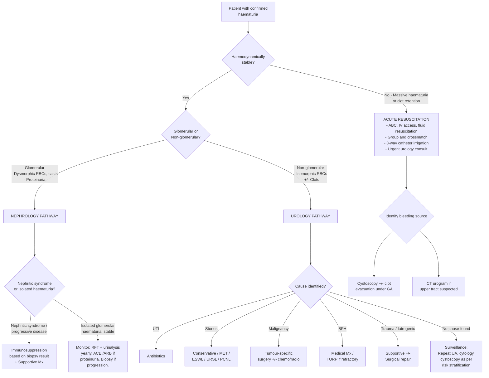

## Management of Haematuria

### Overarching Principle

Haematuria is a *sign*, not a disease. Therefore, the management of haematuria is fundamentally **management of the underlying cause**. There is no single "haematuria treatment" — you manage the UTI, the stone, the cancer, or the GN that is producing the blood.

The management divides cleanly along the same branch point we established earlier:

> ***Medical (glomerular/nephrological) causes → investigated and treated by nephrologists.***
> ***Urological (non-glomerular) causes → treated by urologists.*** [4][9]

However, there are important **acute management principles** that apply regardless of cause — especially when haematuria is massive, causing clot retention, or presenting as an emergency.

---

### Master Management Algorithm

---

### Part 1: Acute Management of Severe / Life-Threatening Haematuria

Before any aetiological treatment, if the patient presents with **massive haematuria** (profuse bleeding, haemodynamic instability, or clot retention causing acute urinary retention), the priority is resuscitation and stabilisation.

#### A. Resuscitation — ABC Approach

1. **Airway and Breathing**: Usually not compromised in haematuria (unlike haemoptysis). Ensure patient is monitored.
2. **Circulation**:
   - Establish **large-bore IV access** (at least two 16–18G cannulae)
   - Send bloods: **CBC, clotting profile, group and crossmatch (T/S), RFT, electrolytes** [13]
   - **IV fluid resuscitation** with crystalloids (normal saline or Hartmann's) if hypovolaemic
   - **Blood transfusion** if Hb < 7 g/dL or haemodynamically unstable despite fluids [17]
   - **Correct any coagulopathy**: If on warfarin → vitamin K ± PCC/FFP; if on DOACs → specific reversal agents (idarucizumab for dabigatran, andexanet alfa for factor Xa inhibitors); if thrombocytopenic → platelet transfusion [18]

<Callout title="Don't Forget Coagulopathy Reversal">
If a patient is on anticoagulants and presents with massive haematuria, **reverse the anticoagulation** while you investigate. However, remember this does not replace investigation — the anticoagulant unmasked the lesion, it didn't cause it [1][2].
</Callout>

#### B. Bladder Catheterisation and Irrigation for Clot Retention

When haematuria produces clots that obstruct the bladder outlet, the patient develops **acute retention of urine (AROU)** — they are in pain, unable to void, and the bladder is distended with clot.

**Management** [8][17]:

1. **3-way Foley catheter insertion** (large bore, typically 22–24 Fr):
   - ***3-way catheter*** has three lumina: one for balloon inflation, one for drainage, and one for irrigation
   - ***Indicated in patients with haematuria with clot formation which can lead to AROU or in patients requiring pharmacological therapy*** [8]
   - The large bore is needed because clots can block smaller catheters
   
2. **Manual bladder washout** (first step):
   - Using a 50 mL bladder syringe, flush normal saline through the catheter to manually evacuate clots
   - Repeat until irrigant runs clear

3. **Continuous bladder irrigation (CBI)**:
   - ***Saline is infused through the irrigation port and drained through the catheter*** [8]
   - Purpose: Dilute blood in the bladder to prevent further clot formation, maintain catheter patency
   - Adjust irrigation rate to keep effluent light pink/clear

4. **If catheterisation fails or clots cannot be cleared**:
   - **Cystoscopy under GA** → clot evacuation using Ellik evacuator + direct visualisation to identify and cauterise bleeding source (e.g., diathermy of a bleeding bladder tumour)

**Catheterisation contraindications and alternatives** [8][4]:

| Route | Contraindications | Alternative |
|-------|-------------------|-------------|
| **Urethral catheterisation** | Urethral injury (blood at meatus, high-riding prostate, pelvic fracture); recent radical prostatectomy; urethral reconstruction; artificial sphincter [8] | Suprapubic catheterisation |
| **Suprapubic catheterisation** | Non-distended bladder; uncorrected bleeding tendency; known/suspected urothelial cancer [8][4] | Urgent cystoscopy for clot evacuation |

#### C. Haematuria in Specific Emergencies

| Scenario | Key Action |
|----------|-----------|
| **Clot retention** | 3-way catheter, manual washout, CBI, ± cystoscopy for clot evacuation |
| **Haematuria + haemodynamic instability** | Aggressive resuscitation, urgent imaging (CT angiogram), consider embolisation or surgical exploration |
| **Haematuria post-trauma** (renal/urethral) | If urethral injury suspected (blood at meatus) → do NOT catheterise → suprapubic catheter; CT with contrast for renal trauma grading |
| **Massive haematuria from known RCC** | Selective renal artery embolisation (interventional radiology) as temporising measure before definitive surgery |

---

### Part 2: Management by Underlying Cause — Urological Pathway

#### A. Urinary Tract Infection (UTI) — The Most Common Cause (~60%)

The haematuria resolves when the infection is treated. Detailed UTI management is covered elsewhere, but in summary:

| Type | Treatment | Rationale |
|------|-----------|-----------|
| **Uncomplicated cystitis (female)** | Empirical oral antibiotics: nitrofurantoin 100 mg BD × 5 days (1st line), or fosfomycin 3 g single dose, or trimethoprim 200 mg BD × 3 days | Short courses sufficient because infection is superficial and mucosal |
| **Uncomplicated cystitis (male)** | Generally need ***longer (7 days) treatment for male cystitis*** [4] — e.g., ciprofloxacin 500 mg BD × 7 days or trimethoprim × 7 days | Males have longer urethra → infection more likely involves prostate → needs longer penetration |
| **Pyelonephritis** | Oral ciprofloxacin × 7–14 days or IV ceftriaxone if septic, then step-down orally | Need systemic drug levels to penetrate renal parenchyma |
| **Acute bacterial prostatitis** | ***Quinolone (excellent prostatic penetration) for 2–6 weeks*** [4] | Prostate has blood-prostate barrier → few antibiotics penetrate well; fluoroquinolones achieve high prostatic concentrations |

- **Repeat urinalysis after treatment** to confirm haematuria has resolved
- If haematuria persists after UTI treatment, investigate for underlying malignancy (the UTI may have been incidental)

#### B. Urolithiasis — Stones (~10%)

Management depends on stone size, location, and complications. The principle is: small stones pass spontaneously, larger stones need intervention.

##### Acute Management [4]

- **Pain control**: ***NSAIDs (1st line)*** for renal colic (e.g., diclofenac 75 mg IM/IV or ketorolac) — NSAIDs work by reducing prostaglandin-mediated ureteric smooth muscle spasm and reducing renal pelvic pressure. Opioids (morphine, tramadol) as 2nd line.
- **Alpha-blockers**: Reduce recurrent colic (tamsulosin relaxes ureteric smooth muscle)
- **Antibiotics if complicated by infection** (infected obstructing stone = urological emergency)
- ***Urgent decompression by JJ stent or percutaneous nephrostomy (PCN) if: uncontrolled sepsis, progressively worsening renal function, intractable pain*** [4]
  - PCN preferred in septic shock (quicker to place)
  - JJ stent preferred when anatomy permits (more comfortable for patient)

##### Definitive Stone Management [4][5]

| Stone Size/Location | Treatment Modality | Rationale |
|--------------------|--------------------|-----------|
| **≤ 4 mm ureteric** | ***Conservative + medical expulsion therapy (MET)*** — tamsulosin 0.4 mg QD × 4 weeks (α1-blocker relaxes distal ureter; ***1.45× more likely to pass***) [4] | 95% pass spontaneously |
| **5–10 mm ureteric** | MET first trial ± definitive intervention | Progressive ↓ chance of spontaneous passage |
| **≥ 10 mm ureteric** | ***Definitive stone removal indicated*** [4] | Unlikely to pass spontaneously |
| **Renal < 10 mm** | ESWL or RIRS > PCNL | Minimally invasive approaches preferred for small stones |
| **Renal 10–20 mm** | ESWL or RIRS or PCNL | Choice depends on stone composition and anatomy |
| **Renal > 20 mm** | ***PCNL > RIRS or ESWL*** [4] | Large stone burden needs direct access for removal |

##### Modalities Explained

| Modality | How It Works | Indications | Contraindications | Key Complications |
|----------|-------------|-------------|-------------------|-------------------|
| ***ESWL*** (Extracorporeal Shock Wave Lithotripsy) | ***High-energy shock waves produced by electrical discharge*** directed at stone under US/XR guidance → stone fragments pass naturally [5] | Renal and upper ureteric stones visible on imaging; stone < 20 mm; HU < 1000 on CT | ***Pregnancy, active UTI/urosepsis, uncontrolled bleeding diathesis, distal obstruction (stricture)*** [5][4] | Incomplete fragmentation, Steinstrasse ("stone street" — column of fragments obstructing ureter), perinephric/subcapsular haematoma, urosepsis [5] |
| **URSL** (Ureteroscopic Lithotripsy / RIRS) | Rigid or flexible ureteroscope passed through urethra → laser lithotripsy (Holmium laser) fragments stone | Ureteric stones (esp. mid and distal); renal stones up to 20 mm via flexible scope (RIRS) | Active UTI (relative); anatomical factors preventing scope passage | Ureteric perforation, stricture, bleeding, infection |
| ***PCNL*** (Percutaneous Nephrolithotomy) | ***Puncture through skin into renal collecting system*** → nephroscope inserted → direct stone visualisation and fragmentation/extraction [16] | Large renal stones (> 20 mm), staghorn calculi, stones in calyceal diverticulum, failed ESWL | ***Bleeding tendency, distorted surface anatomy, obesity*** (relative) [4] | Haemorrhage, sepsis, pneumothorax, urinoma, injury to adjacent organs |

<Callout title="ESWL Limitations" type="idea">
ESWL is minimally invasive and doesn't need anaesthesia, but it has important limitations [5][4]: 1) Skin-to-stone distance matters → poorer efficacy in obese patients. 2) NOT ideal for hard stones (cystine, calcium oxalate monohydrate, brushite — predicted by > 1000 HU on CT). 3) NOT ideal for lower pole stones (gravity retains fragments in dependent calyx). 4) NOT ideal for stones in calyceal diverticulum (narrow infundibulum traps fragments). If a patient has had multiple failed ESWL sessions, consider a calyceal diverticulum.
</Callout>

- ***Definitive treatment should be initiated ONLY when an acute episode of urosepsis (if present) has resolved*** [5] — operating on an infected obstructing system risks overwhelming sepsis.

##### Prevention of Recurrence

- Increase fluid intake (target urine output > 2.5 L/day)
- Dietary modification based on stone composition:
  - Calcium oxalate: reduce oxalate (spinach, nuts, chocolate), maintain normal calcium intake (paradoxically, low-calcium diets increase oxalate absorption → more stones) [5], reduce sodium and animal protein
  - Uric acid: alkalinise urine (potassium citrate) to pH 6.5–7.0, treat hyperuricaemia
  - Struvite (infection stones): eradicate infection, complete stone removal (fragments serve as nidus)
  - Cystine: very high fluid intake, alkalinise urine, ± tiopronin or D-penicillamine

#### C. Urological Malignancy — The Most Worrying Cause

This is the most critical branch. Management depends on the specific tumour and its stage:

##### 1. Bladder Cancer (Urothelial Carcinoma) [4][9]

| Stage | Management | Rationale |
|-------|-----------|-----------|
| ***Non-muscle invasive (Ta, T1, Tis)*** | ***TURBT (Transurethral Resection of Bladder Tumour) ± intravesical BCG*** [4][9] | TURBT provides diagnosis, staging, AND treatment for superficial tumours. BCG (Bacillus Calmette-Guérin — attenuated *M. bovis*) provokes local immune response against residual tumour cells, reducing recurrence |
| ***Muscle invasive (≥ T2)*** | ***Radical cystectomy*** (removal of entire bladder + lymph node dissection) ± neoadjuvant cisplatin-based chemotherapy [4][9] | Tumour has invaded detrusor muscle → local resection insufficient → need radical surgery |
| **Metastatic** | Systemic chemotherapy (cisplatin-based regimens, e.g., GC or MVAC) ± immunotherapy (checkpoint inhibitors: atezolizumab, pembrolizumab) | Palliation and life extension |

- **Surveillance**: Extremely important due to ***field cancerization*** and high recurrence rate (50–70% for superficial bladder CA). Protocol: cystoscopy + cytology at 3 months, then at increasing intervals (3-monthly for 2 years → 6-monthly for 3 years → annually).
- ***Despite advancing imaging/urine biomarkers, non-invasive tests alone CAN NEVER replace cystoscopy/TURBT for diagnosis of CA bladder*** [4]

##### 2. Renal Cell Carcinoma (RCC) [4][9]

| Stage | Management |
|-------|-----------|
| **Localised (T1a ≤ 4 cm)** | ***Nephron-sparing (partial) nephrectomy*** — preferred to preserve renal function |
| **Localised (T1b–T2)** | ***Radical nephrectomy*** (removal of kidney + Gerota's fascia ± adrenal ± lymph nodes) |
| **Locally advanced (T3–T4)** | Radical nephrectomy ± IVC thrombectomy (if tumour thrombus extends into renal vein/IVC) |
| **Metastatic** | Systemic therapy: targeted therapy (sunitinib, pazopanib — TKIs) or immunotherapy (nivolumab + ipilimumab — checkpoint inhibitors); cytoreductive nephrectomy in selected cases |

- RCC is **chemo-resistant and radio-resistant** — this is why targeted therapy and immunotherapy are mainstays for metastatic disease.

##### 3. Upper Tract Urothelial Carcinoma (UTUC) [4][9]

| Management |
|-----------|
| ***Nephroureterectomy*** (removal of kidney + entire ureter + bladder cuff) — standard for high-grade/invasive UTUC due to field cancerization risk [4][9] |
| Kidney-sparing approaches (ureteroscopic ablation) only for low-grade, small, unifocal tumours or solitary kidney |

##### 4. Prostate Cancer [4]

Management is guided by risk stratification (Gleason score, PSA, clinical stage):

| Risk Group | Options |
|-----------|---------|
| **Low risk** | Active surveillance (most important — avoids overtreatment) |
| **Intermediate risk** | Radical prostatectomy OR radiotherapy (external beam ± brachytherapy) |
| **High risk / locally advanced** | Radical prostatectomy + extended lymph node dissection, OR radiotherapy + androgen deprivation therapy (ADT) |
| **Metastatic** | ADT (LHRH agonists/antagonists, anti-androgens) ± chemotherapy (docetaxel) ± novel hormonal agents (abiraterone, enzalutamide) |

#### D. BPH (Benign Prostatic Hyperplasia) [4]

BPH rarely causes significant haematuria, but when it does (due to increased prostatic vascularity → fragile vessels), the haematuria usually resolves with treatment of the BPH itself:

| Approach | Treatment | Mechanism |
|----------|-----------|-----------|
| **Watchful waiting** | Lifestyle measures (avoid caffeine/alcohol, timed voiding, fluid management) | Mild symptoms, not bothersome |
| **Medical therapy** | **Alpha-blockers** (tamsulosin, alfuzosin): relax prostatic smooth muscle → improve flow. **5α-reductase inhibitors** (finasteride, dutasteride): shrink prostate over months by blocking testosterone → DHT conversion → also reduces prostatic vascularity and risk of haematuria | Target both dynamic (smooth muscle tone) and static (gland volume) components of obstruction |
| **Surgical therapy** | ***TURP (gold standard)***: transurethral resection of prostate tissue [4]. Alternatives: laser enucleation (HoLEP), photoselective vaporisation (PVP — especially useful in patients with ***bleeding tendency*** [4]) | ***Indications: refractory AROU, bladder stones, recurrent UTI, obstructive uropathy, bothersome symptoms despite medical treatment*** [4] |

<Callout title="Finasteride and Haematuria from BPH">
5α-reductase inhibitors (finasteride) can specifically reduce haematuria from BPH by shrinking the gland and reducing its vascularity. This is a recognized off-label use when recurrent haematuria is the presenting problem in BPH. The effect takes weeks to months.
</Callout>

#### E. Other Urological Causes

| Cause | Management |
|-------|-----------|
| **Radiation cystitis** | Conservative (hydration, bladder irrigation); hyperbaric oxygen therapy (promotes neoangiogenesis in ischaemic tissue); intravesical agents (alum, formalin as last resort); embolisation if refractory |
| **Haemorrhagic cystitis** (cyclophosphamide-related) | Prevention: ***MESNA*** (2-mercaptoethane sulfonate sodium — binds acrolein, the toxic metabolite, in urine) + vigorous hydration during chemotherapy. Treatment: bladder irrigation, hyperbaric oxygen, intravesical agents |
| **Trauma** | Depends on grade: renal contusion → conservative; Grade III–V lacerations → surgical exploration ± repair; urethral injury → suprapubic catheter, delayed repair |
| **Exercise-induced haematuria** | Reassurance; resolves with rest; confirm by exclusion of other causes [4][9] |

---

### Part 3: Management by Underlying Cause — Nephrology Pathway

#### A. General Principles for ALL Glomerulonephropathies [9]

Regardless of the specific GN subtype, the following supportive measures apply:

| Measure | Details | Mechanism/Rationale |
|---------|---------|---------------------|
| ***ACEI/ARB (anti-proteinuric therapy)*** | ***Indicated in ALL glomerulonephropathy*** [9]. Goal: proteinuria < 1 g/day or UPCR < 0.5–1 g/g | ***↓Intraglomerular pressure → ↓proteinuria***, which is associated with ↓rate of GFR decline. Efferent arteriole dilation reduces filtration pressure across damaged GBM → less protein leak [9] |
| **Salt restriction** | Dietary sodium ~2 g/day | Reduces fluid retention and oedema; synergistic with diuretics |
| **Diuretics** | Loop diuretics (furosemide) preferred; add thiazide/K+-sparing if inadequate | Treat oedema; monitor for hypovolaemia and hypokalaemia [9] |
| **Statins** | If hyperlipidaemia persists after treatment of underlying disease and ACEI/ARB | Nephrotic syndrome → hyperlipidaemia (liver upregulates lipoprotein synthesis due to hypoalbuminaemia) [9] |
| **Anti-thrombotic therapy** | Usually only if thromboembolic events occur; prophylactic use NOT routine unless high risk (e.g., membranous nephropathy with very low albumin) [9] | Nephrotic syndrome → loss of antithrombin III, protein C/S in urine → hypercoagulable state |
| **Pneumococcal vaccination** | ***Indicated for ALL*** patients with nephrotic syndrome [9] | Loss of immunoglobulins in urine → ↑ susceptibility to encapsulated organisms (especially pneumococcus) |

> **Note**: ***Protein restriction is NOT recommended*** despite heavy urinary protein loss — patients should have normal protein intake because ↑albumin excretion is associated with poorer outcomes [9].

#### B. Specific Immunosuppressive Therapy (Based on Renal Biopsy Result)

| Diagnosis | Treatment | Key Points |
|-----------|-----------|-----------|
| **IgA nephropathy** | Supportive Mx (ACEI/ARB) for most; immunosuppression (corticosteroids) only if high risk of progression (proteinuria > 1 g/day despite 3–6 months of optimal ACEI/ARB, declining GFR); SGLT2 inhibitors (dapagliflozin) for CKD protection | Most patients have indolent course; ~30% reach ESRD over 30 years |
| **Lupus nephritis (Class III/IV)** | ***Non-immunosuppressive therapy in ALL + immunosuppressive therapy in active disease*** [4]: Induction: IV pulse methylprednisolone → oral prednisolone + mycophenolate mofetil (MMF) or IV cyclophosphamide. Maintenance: MMF or azathioprine + low-dose prednisolone | Treatment guided by histologic subtype on biopsy — clinical presentation may not reflect severity [4] |
| **ANCA-associated vasculitis** | Induction: IV pulse methylprednisolone + rituximab (preferred) or cyclophosphamide. Maintenance: rituximab or azathioprine. Plasma exchange (PLEX) for severe renal/pulmonary involvement | Rapidly progressive → early aggressive treatment essential |
| **Anti-GBM disease (Goodpasture)** | Plasma exchange (to remove circulating anti-GBM antibodies) + cyclophosphamide + corticosteroids | Medical emergency; prognosis depends on degree of renal damage at presentation |
| **Post-streptococcal GN** | Supportive only (usually self-limiting in children); antibiotics for residual streptococcal infection; manage HTN, fluid overload | Most recover completely; immunosuppression NOT indicated |
| **Membranous nephropathy** | Supportive for 6 months (spontaneous remission in 30%); immunosuppression (rituximab or cyclophosphamide + corticosteroids) if nephrotic + poor prognostic factors [4] | Anti-PLA2R antibodies guide monitoring of disease activity |
| **Alport syndrome** | ACEI/ARB to delay progression; no specific immunosuppression (genetic, not inflammatory); ultimately may need renal transplant | Genetic counselling important |
| **Thin basement membrane disease** | Reassurance; no treatment needed; monitor annually | Benign prognosis |

#### C. Haematuria in Haemophilia

***Treat with forced diuresis if not severe*** [7]. Factor replacement is generally NOT indicated for isolated haematuria (risk of clot formation in the urinary tract if factor levels become too high). If severe, factor replacement with concurrent hydration.

- **Avoid antifibrinolytics** (e.g., tranexamic acid) in haematuria from haemophilia — these prevent clot lysis and can cause obstructive clots in the ureter/urethra [7].
- Analgesics as needed: ***COX-2 inhibitors or paracetamol → avoid NSAIDs*** (impair platelet function) [7]

<Callout title="Antifibrinolytics in Haematuria" type="error">
This is a classic exam trap: tranexamic acid is excellent for mucosal bleeding in haemophilia (oral cavity, GI) but is **CONTRAINDICATED in haematuria** because stabilising clots in the urinary tract can cause ureteric or urethral obstruction. The management of haematuria in haemophilia is forced diuresis, NOT antifibrinolytics [7].
</Callout>

---

### Part 4: Conditions Requiring Nephrology Referral [4][9]

After urological workup is complete and no urological cause is found, or if features suggest glomerular disease, refer to nephrology if:

- **Urological cause excluded** but haematuria persists
- **Evidence of ↓GFR** or chronic renal failure (eGFR < 30 mL/min)
- **Significant proteinuria** (> 500 mg/day)
- **Young patient (< 40 years) with hypertension** and isolated haematuria (without significant proteinuria)
- **Visible haematuria with intercurrent URTI** (suspect IgA nephropathy)

***If urological cancer is ruled out, treat as CKD — monitor RFT and urinalysis yearly*** [2].

---

### Part 5: Management of "No Cause Found" — Surveillance

In a substantial proportion of patients (especially those with microscopic haematuria), **no cause is identified** after complete workup. This is called "idiopathic" or "benign" haematuria. Management:

- **Reassure** but do NOT dismiss — continue surveillance
- **Repeat urinalysis** at regular intervals (every 6–12 months)
- **Re-evaluate** if haematuria worsens, becomes gross, or new risk factors emerge
- Follow AUA risk-stratification guidelines for ongoing monitoring:
  - If initially low-risk and repeat UA normal → can be discharged from follow-up
  - If initially low-risk and repeat UA still positive → reclassify as intermediate-risk → cystoscopy + USG
  - If initially high-risk with negative workup → repeat cystoscopy + imaging at 12 months (early cancers can be missed on initial evaluation)

---

### Summary: When to Refer to Which Specialist

| Finding | Refer To | Why |
|---------|----------|-----|
| Gross non-glomerular haematuria | **Urology** | Cystoscopy + upper tract imaging to exclude malignancy |
| Microscopic haematuria, intermediate/high-risk | **Urology** | Risk-stratified workup per AUA guidelines |
| Dysmorphic RBCs / RBC casts / significant proteinuria | **Nephrology** | Glomerular origin → needs serological workup ± biopsy |
| Persistent haematuria after urological workup is negative | **Nephrology** | May have occult glomerular disease |
| Haematuria + declining GFR | **Nephrology (urgent)** | Rapidly progressive GN needs prompt diagnosis and treatment |
| Haematuria + haemoptysis | **Nephrology + Respiratory + ICU** | Pulmonary-renal syndrome — medical emergency |

---

<Callout title="High Yield Summary">

1. **Haematuria is managed by treating the underlying cause** — medical (nephrology) vs urological (urology) pathway.

2. **Acute massive haematuria**: ABC → 3-way catheter with CBI → manual clot washout → cystoscopy under GA if refractory. Reverse anticoagulation if applicable.

3. **UTI (most common cause)**: Antibiotics tailored to organism and site; repeat urinalysis after treatment to confirm resolution.

4. **Stones**: Acute → NSAIDs (1st line) + alpha-blockers; ≤ 4 mm passes spontaneously (95%); definitive Mx by ESWL (small/moderate), URSL (ureteric), PCNL (large renal). Never operate during active urosepsis — decompress first.

5. **Bladder cancer**: TURBT ± intravesical BCG for non-muscle invasive; radical cystectomy for muscle invasive. Surveillance cystoscopy mandatory due to high recurrence.

6. **RCC**: Partial or radical nephrectomy; chemo/radio-resistant → targeted therapy or immunotherapy for metastatic disease.

7. **Upper tract UCC**: Nephroureterectomy (standard) due to field cancerization.

8. **Glomerulonephritis**: ACEI/ARB for ALL (anti-proteinuric); immunosuppression guided by biopsy result; complement and serology to narrow differential.

9. **Haemophilia haematuria**: Forced diuresis; AVOID antifibrinolytics (risk of obstructive clots in urinary tract); AVOID NSAIDs.

10. **No cause found**: Surveillance with repeat UA, cytology, and cystoscopy at intervals guided by risk stratification.

11. **Refer nephrology if**: Urological cause excluded, ↓GFR, significant proteinuria, young + HTN + haematuria, visible haematuria with URTI.
</Callout>

---

<ActiveRecallQuiz
  title="Active Recall - Management of Haematuria"
  items={[
    {
      question: "A 72-year-old man presents with acute urinary retention due to clot retention from gross haematuria. Describe the immediate management steps in order.",
      markscheme: "1. ABC and resuscitation: IV access, send bloods (CBC, clotting, group and crossmatch, RFT). 2. Insert large-bore 3-way Foley catheter (22-24 Fr). 3. Manual bladder washout with normal saline using bladder syringe to evacuate clots. 4. Commence continuous bladder irrigation (CBI) to prevent re-accumulation of clots. 5. If unable to clear clots or ongoing heavy bleeding, arrange cystoscopy under GA for clot evacuation and identification of bleeding source. 6. Investigate for underlying cause once stabilised."
    },
    {
      question: "A patient with superficial (non-muscle invasive) bladder cancer has undergone TURBT. What adjuvant therapy is commonly given and what is its mechanism?",
      markscheme: "Intravesical BCG (Bacillus Calmette-Guerin, attenuated Mycobacterium bovis). Mechanism: BCG provokes a local immune response by activating T cells and macrophages within the bladder wall, which attack residual tumour cells. This reduces recurrence and progression of non-muscle invasive bladder cancer. Used especially for high-risk superficial tumours and carcinoma in situ."
    },
    {
      question: "Why is tranexamic acid contraindicated in haematuria from haemophilia, despite being used for other mucosal bleeding in haemophilia?",
      markscheme: "Tranexamic acid is an antifibrinolytic that prevents clot breakdown. In the urinary tract, stabilised blood clots can cause obstruction of the ureter or urethra, leading to painful clot retention or obstructive uropathy. In haemophilia haematuria, the correct approach is forced diuresis (to dilute blood and prevent clot formation), not antifibrinolytics."
    },
    {
      question: "Name the general supportive measures indicated in ALL patients with glomerulonephropathy, and explain the mechanism of the key anti-proteinuric drug.",
      markscheme: "Supportive measures for all GN: (1) ACEI/ARB (anti-proteinuric - first-line), (2) Salt restriction to approximately 2g/day, (3) Loop diuretics for oedema, (4) Statins if persistent hyperlipidaemia, (5) Pneumococcal vaccination. ACEI/ARB mechanism: dilates efferent arteriole more than afferent, reducing intraglomerular pressure and filtration across damaged GBM, thereby reducing proteinuria. Lower proteinuria correlates with slower GFR decline."
    },
    {
      question: "A 10 mm ureteric stone is causing uncontrolled sepsis. What is the management priority and what two decompression options are available?",
      markscheme: "Priority: urgent decompression of the obstructed infected system first - do NOT attempt definitive stone removal during active urosepsis (risk of overwhelming sepsis). Two decompression options: (1) JJ ureteric stent insertion (under fluoroscopy), (2) Percutaneous nephrostomy (PCN). PCN is preferred in septic shock as it is quicker to place. IV antibiotics and resuscitation in parallel. Definitive stone removal only after sepsis has resolved."
    },
    {
      question: "After complete urological workup is negative, list the indications for referring a patient with haematuria to a nephrologist.",
      markscheme: "Refer to nephrology if: (1) Urological cause excluded but haematuria persists, (2) Evidence of reduced GFR or CKD (eGFR less than 30), (3) Significant proteinuria (over 500 mg/day), (4) Young patient (under 40) with hypertension and isolated haematuria, (5) Visible haematuria with concurrent URTI (suspect IgA nephropathy). If urological cancer is ruled out, manage as CKD and monitor RFT plus urinalysis yearly."
    }
  ]}
/>

## References

[1] Lecture slides: GC 183. Common urological malignancies and their presentations - Nov 7.pdf (p6, p13)
[2] Senior notes: maxim.md (Section 2.1 Common urological complaints - Haematuria)
[4] Senior notes: Ryan Ho Urogenital.pdf (p88, p128, p135, p140–141, p167, p176, p182)
[5] Senior notes: felixlai.md (Urinary stones - ESWL section; Urological diseases section)
[7] Senior notes: Ryan Ho Haemtology.pdf (p124, p127 - Haemophilia treatment)
[8] Senior notes: felixlai.md (Haematuria section; Catheterisation section)
[9] Senior notes: Ryan Ho Fundamentals.pdf (p345, p352, p368)
[13] Senior notes: Ryan Ho Critical Care.pdf (p26 - AKI management)
[16] Senior notes: Ryan Ho Diagnostic Radiology.pdf (p17, p83 - PCN)
[17] Senior notes: Ryan Ho Haemtology.pdf (p19 - IDA and transfusion)
[18] Senior notes: Ryan Ho Neurology.pdf (p84 - Anticoagulation reversal)
