# History Taking: HCC / Liver Tumours

---

## Master Framework

```mermaid
graph TD
    A["Patient presents with<br/>hepatomegaly / liver mass / abnormal AFP"] --> B["Presenting Complaint"]
    B --> C["Symptom Analysis<br/>(Onset, Timing, Progression,<br/>Severity, Red Flags)"]
    C --> D["Local Symptoms"]
    C --> E["Constitutional Symptoms"]
    C --> F["Paraneoplastic Features"]
    C --> G["Metastatic Symptoms"]
    
    A --> H["Risk Factor Assessment"]
    H --> I["Chronic Liver Disease<br/>(HBV, HCV, Cirrhosis,<br/>Alcohol, NAFLD)"]
    H --> J["Non-CLD Risk Factors<br/>(Aflatoxin, Obesity, DM,<br/>Smoking)"]
    
    A --> K["Background History"]
    K --> L["PMHx & Surgical Hx"]
    K --> M["Medications & Allergies"]
    K --> N["Family History"]
    K --> O["Social History<br/>(Alcohol, Smoking,<br/>Occupation, Travel)"]
    K --> P["Functional Baseline"]
    
    A --> Q["Differentiating Questions"]
    Q --> R["Primary vs Secondary<br/>Liver Tumour"]
    Q --> S["Benign vs Malignant"]
    Q --> T["HCC vs Cholangiocarcinoma"]
    Q --> U["Medical vs Surgical<br/>Jaundice"]
    
    A --> V["Red Flags / Escalation"]
    V --> W["Ruptured HCC<br/>(Acute pain + shock)"]
    V --> X["Decompensated Cirrhosis"]
    V --> Y["Portal Vein Invasion<br/>(LL oedema, PE)"]
```

---

## 1. Presenting Complaint Framework

When a patient comes in with a liver mass or suspected HCC, your job is to figure out three things simultaneously: (1) what is the mass, (2) what is the underlying liver, and (3) how far has it spread. The history drives all three.

### 1.1 Opening the Consultation

Start open-ended, then funnel down:

> *"What brought you to the hospital today?"*
> *「你今日點解嚟睇醫生？」*

If found incidentally on surveillance:
> *"I understand something was found on your scan — have you been having any symptoms at all?"*
> *「我知道你照超聲波嘅時候發現咗啲嘢，你自己有冇唔舒服？」*

<Callout title="50% of HCC is asymptomatic at diagnosis" type="idea">
In Hong Kong, a large proportion of HCC is picked up through ***AFP/USG surveillance in HBsAg carriers or cirrhotic patients*** [1][2]. Don't be surprised if the patient says "nothing" — that's actually a typical presentation. Your history then pivots to risk factors and screening context.
</Callout>

### 1.2 Symptom Analysis — Local Symptoms

| Symptom | Cantonese | Why It Matters |
|---|---|---|
| RUQ / epigastric pain | 右上腹痛 / 上腹痛 | ***Only symptomatic when tumour >8cm*** [3] — due to Glisson's capsule distension. ***No nerve fibres in the liver parenchyma itself*** [4]. Dull, vague, persistent pain suggests significant hepatomegaly. |
| Right shoulder pain | 右膊頭痛 | Referred pain from diaphragmatic irritation (phrenic nerve C3-5). Suggests large tumour or subcapsular location. |
| Abdominal distension | 肚脹 | Could be ascites (decompensated cirrhosis or peritoneal carcinomatosis) or massive hepatomegaly. Ask: *「你覺唔覺得個肚愈嚟愈脹？」* |
| Early satiety / nausea | 食少少就飽 / 作嘔 | Local mass effect from an enlarged liver (***usually when liver >15cm***) [3]. |
| Jaundice | 黃疸 / 皮膚眼白變黃 | ***Obstructive jaundice from HCC is uncommon*** [5] — occurs only when tumour invades biliary tree or compresses intrahepatic ducts. If present, consider cholangiocarcinoma or porta hepatis lymph node metastasis as alternatives. |
| Tea-coloured urine | 茶色尿 | Conjugated hyperbilirubinaemia → surgical/obstructive cause [6]. |
| Pale stools / steatorrhoea | 大便淺色 / 油膩大便 | Biliary obstruction. Ask: *「大便有冇變淺色，好似白泥咁？」* |
| Change in bowel habit | 大便習慣改變 | Think about a GI primary if liver metastasis is on the differential [1]. |

**Key questions with phrasing:**

- **Onset**: *"When did you first notice the pain / lump?"* *「你幾時開始覺得痛 / 摸到個嘢？」*
- **Timing / Progression**: *"Is it getting worse, staying the same, or getting better?"* *「有冇愈嚟愈差？」*
- **Severity**: *"On a scale of 0 to 10, how bad is the pain?"*
- **Character**: *"Is it a dull ache or a sharp, sudden pain?"* — Sudden, severe pain → think ***ruptured HCC*** [3][5].

### 1.3 Symptom Analysis — Constitutional Symptoms

***Constitutional symptoms are present in ~80% of symptomatic HCC*** [3]:

- **Loss of appetite (LOA)**: *「你食嘢有冇胃口？」*
- **Loss of weight (LOW)**: *"Have you lost weight without trying? How much, over what period?"* *「你有冇瘦咗？瘦咗幾多？幾耐？」* — Quantify: >5% in 6 months is significant.
- **Malaise / fatigue**: *「你覺唔覺得成日好攰？」*
- **Fever**: *「你有冇發燒？」* — Can be from ***central tumour necrosis*** (reactive fever) [3], liver abscess, or cholangitis. This is a key differentiating point.

### 1.4 Symptom Analysis — Paraneoplastic Syndromes

These are high-yield for OSCEs because students often forget them. ***Generally associated with poor prognosis (except erythrocytosis)*** [3]:

| Syndrome | Mechanism | What to Ask |
|---|---|---|
| **Hypoglycaemia** | ***↑ metabolic needs of tumour + IGF-II secretion*** [3][4] | *"Do you ever feel shaky, sweaty, or confused, especially when you haven't eaten?"* *「你有冇試過頭暈、出汗、手震？」* |
| **Erythrocytosis** | ***EPO secretion*** [3][5] | Usually found on bloods rather than history, but ask about plethora, headaches |
| **Hypercalcaemia** | ***PTHrP secretion*** [3][5] | "Stones, bones, moans, groans" — constipation, bone pain, confusion, thirst/polyuria |
| **Watery diarrhoea** | ***VIP / gastrin secretion*** [4] | *「你有冇肚瀉？」* — profuse watery diarrhoea |
| **Dermatomyositis** | Paraneoplastic | Proximal muscle weakness, heliotrope rash |

### 1.5 Symptom Analysis — Metastatic Symptoms

***HCC spreads via haematogenous route through portal and hepatic veins*** [2][3]:

- **Bone pain**: *「你有冇骨痛？邊度痛？」* — Lung (most common), bone, adrenals [3]
- **Dyspnoea / cough**: *「你有冇氣促或者咳？」* — Lung metastasis or PE (if tumour extends via hepatic vein → IVC → right heart) [3]
- **Lower limb oedema**: *「你隻腳有冇腫？」* — IVC obstruction from ***portal vein invasion*** [3]
- **Neurological symptoms**: Headache, confusion — brain metastasis (less common)

---

## 2. Risk Factor Assessment

This is arguably the most important part of the HCC history. In Hong Kong, ***80% of HCC patients are HBsAg positive*** [1][2].

### 2.1 Chronic Liver Disease-Related Risk Factors

| Risk Factor | Key Questions | Cantonese | Why It Matters |
|---|---|---|---|
| ***Hepatitis B*** | "Do you know if you carry hepatitis B?" "Were you vaccinated?" "Are you on any antiviral medication?" | *「你有冇乙型肝炎？有冇打過針？有冇食藥？」* | ***Direct oncogenic effect via HBxAg — HCC can occur even without cirrhosis (20%)*** [4]. HBV DNA levels and HBeAg positivity correlate with HCC risk [3]. Ask about antiviral treatment (e.g. entecavir, tenofovir) — ***↓50-60% risk of HCC*** [3]. |
| ***Hepatitis C*** | "Have you ever been told you have hepatitis C?" | *「你有冇丙型肝炎？」* | ***HCC from HCV almost always occurs on a cirrhotic liver (100%)*** [4]. Common in Japan and Western countries [1]. Ask about prior blood transfusions, IVDU. |
| ***Cirrhosis*** | "Has anyone told you that your liver is scarred or hardened?" | *「你有冇肝硬化？」* | ***1-8% per year risk of developing HCC*** [3]. Ask about known complications: varices, ascites, encephalopathy. |
| ***Alcohol*** | "How much alcohol do you drink? What type? For how many years?" | *「你飲幾多酒？飲咗幾多年？」* | Quantify in units/week. ***HCC from alcoholic liver disease occurs 100% on a cirrhotic background*** [4]. Use CAGE questionnaire if appropriate. |
| ***NAFLD / Metabolic*** | "Do you have fatty liver? Have you been told your liver enzymes are high?" | *「你有冇脂肪肝？」* | Rising cause of HCC globally. Associated with obesity and DM [3][4]. |
| ***Autoimmune*** | "Do you have any autoimmune conditions — PBC, PSC, autoimmune hepatitis?" | — | Rarer but important causes of cirrhosis → HCC [4]. |
| ***Genetic / metabolic*** | Wilson's disease, haemochromatosis, α1-antitrypsin deficiency | — | ***α1-antitrypsin deficiency rare in HK*** [3]. Haemochromatosis: ask about bronze skin, DM, joint pain. |

### 2.2 Non-CLD Risk Factors

| Risk Factor | Key Questions | Why It Matters |
|---|---|---|
| ***Aflatoxin exposure*** | "Have you lived in rural areas? Any exposure to mouldy grains/peanuts?" | ***Mycotoxin from Aspergillus flavus → p53 mutation. Risk factor in Africa and rural areas but NOT HK*** [4][1]. |
| ***Obesity / DM*** | "Do you have diabetes? What is your BMI?" *「你有冇糖尿病？」* | ***2.2× risk of HCC (may be confounded by NAFLD)*** [3]. |
| ***Smoking*** | "Do you smoke? How many per day, for how many years?" *「你有冇食煙？食幾多？食咗幾耐？」* | ***Controversial but listed as a risk factor*** [3][4]. Quantify in pack-years. |

---

## 3. Targeted Systems Review

Think of this as a focused "screening sweep" to catch things you might have missed:

| System | Questions | Rationale |
|---|---|---|
| **GI** | Any UGIB (haematemesis / melaena)? Change in bowel habit? PR bleeding? | Variceal bleeding from portal hypertension; screen for GI primary if considering liver metastasis [1] |
| **Hepatic decompensation** | Any confusion / drowsiness (encephalopathy)? Abdominal swelling (ascites)? Easy bruising (coagulopathy)? | Assess baseline liver function — critical for treatment planning [3] |
| **Respiratory** | Cough, haemoptysis, dyspnoea? | Lung metastasis (most common distant site) [3] |
| **MSK** | Bone pain? Pathological fractures? | Bone metastasis [4] |
| **Neuro** | Headache, seizures, focal weakness? | Brain metastasis (uncommon) |
| **Endocrine** | Symptoms of hypoglycaemia, hypercalcaemia? | Paraneoplastic syndromes [3] |
| **Skin** | New rashes? Proximal muscle weakness? | Dermatomyositis, Leser-Trélat sign [5] |

---

## 4. Past Medical History, Medications, Allergies

### 4.1 Past Medical History

- **Chronic liver disease**: Previous diagnosis, staging (Child-Pugh if known), complications
- **Hepatitis status**: When diagnosed, treatment history, last viral load
- **Known cirrhosis**: Cause, duration, decompensation episodes
- **Previous cancers**: Any malignancy → liver metastasis is ***20× more common than primary liver tumour*** [5]
- **Diabetes mellitus, obesity, metabolic syndrome**: NAFLD pathway
- **Autoimmune conditions**: PBC, PSC, AIH
- **Blood transfusion history**: Especially before HCV screening (pre-1992) — *「你有冇輸過血？」*

### 4.2 Past Surgical History

- Previous liver surgery or ablation
- Previous cholecystectomy (***prior gallstone disease/cholecystectomy is a risk factor*** [3])
- Previous ERCP or biliary procedures
- Previous colonic surgery (colorectal cancer → liver metastasis)

### 4.3 Medications

- **Antivirals**: Entecavir, tenofovir (for HBV) — compliance?
- **Interferon / DAAs**: For HCV treatment
- **Anticoagulants / antiplatelets**: Bleeding risk if ruptured HCC
- **NSAIDs**: Could mimic or mask symptoms
- **Traditional Chinese Medicine (TCM)**: *「你有冇食中藥？」* — some TCMs are hepatotoxic and can cause drug-induced liver injury [6]

### 4.4 Allergies

- ***Contrast allergy*** is crucial — triphasic CT is the gold standard diagnostic tool. If allergic, MRI with Primovist is the alternative [3][5].
- Drug allergies: *「你有冇藥物敏感？」*

---

## 5. Family History

- **Hepatitis B**: Vertical transmission is the most common route in Hong Kong. *「你屋企人有冇乙型肝炎？」*
- **HCC / liver cancer**: *「你屋企人有冇人生過肝癌？」* — ***Family history of hepatitis and HCC*** is specifically listed as a risk factor to ask about [6].
- **Other cancers**: Especially colorectal (liver metastasis), breast, lung — *「有冇人生過癌症？」*
- **Genetic conditions**: Wilson's disease, haemochromatosis (autosomal recessive)

---

## 6. Social History

| Domain | Questions | Cantonese | Why It Matters |
|---|---|---|---|
| **Alcohol** | Type, amount, frequency, duration. CAGE questionnaire. | *「你飲幾多酒？飲咩酒？飲咗幾多年？」* | Quantify — ***high but NOT moderate level of alcohol consumption*** increases risk [4]. Alcoholic cirrhosis → 100% HCC on cirrhotic background. |
| **Smoking** | Pack-years | *「你有冇食煙？」* | Risk factor [3][4] |
| **Occupation** | Chemical exposure, farming (aflatoxin) | *「你做咩工作？」* | Aflatoxin exposure in agricultural settings |
| **Travel** | Endemic areas for hepatitis, amoebiasis | *「你去過邊度旅行？」* | Hepatitis exposure; also consider amoebic liver abscess |
| **IVDU** | "Have you ever injected drugs?" | *「你有冇注射過毒品？」* | Hepatitis B/C transmission |
| **Sexual history** | Multiple partners, MSM | — | Hepatitis B transmission risk [6] |
| **Diet** | Mouldy grains, raw shellfish | *「你有冇食過發霉嘅嘢？」* | Aflatoxin, Hep A/E |

### 6.1 Functional Baseline

- **ECOG Performance Status**: Can they walk independently? Carry out normal activities?
  - *「你平時行得郁嗎？可唔可以自己照顧自己？」*
- ***Performance status directly impacts BCLC staging and treatment eligibility*** [3]
- **ADLs**: Washing, dressing, eating, mobility
- **Exercise tolerance**: How far can they walk on flat ground?

---

## 7. Differentiating Questions

This is where the OSCE marks are. You need to systematically distinguish:

### 7.1 Primary vs Secondary Liver Tumour

| Feature | Primary (HCC) | Secondary (Metastasis) |
|---|---|---|
| Background | HBV/HCV carrier, cirrhosis | ***Known primary elsewhere*** (colon, stomach, breast, lung) [1][7] |
| History | Chronic liver disease symptoms | GI symptoms, change in bowel habit, breast lump, cough |
| Tumour markers | AFP elevated | ***CEA, CA19-9*** elevated [1][7] |
| Imaging | ***Arterial enhancement + portal washout*** | ***Hypodense on all phases*** [5] |

**Key question**: *"Has anyone ever told you that you have cancer somewhere else?"* *「你有冇生過其他癌症？」*

### 7.2 Benign vs Malignant Liver Tumours

| Feature | Benign (Haemangioma, Adenoma, FNH) | Malignant (HCC, CC, Mets) |
|---|---|---|
| Demographics | ***Haemangioma: F > M, 30-50y*** [3]. Adenoma: young women, OCP use. | HCC: M > F, >50y, HBV carrier [1][2] |
| Symptoms | Usually asymptomatic / vague discomfort | Constitutional symptoms, weight loss |
| Growth | Slow or stable | Progressive |
| Risk factors | OCP (adenoma), none (haemangioma) | HBV, cirrhosis, alcohol |

**Key question**: *"Are you on the oral contraceptive pill?"* (for hepatic adenoma) *「你有冇食避孕藥？」*

### 7.3 HCC vs Cholangiocarcinoma

| Feature | HCC | Intrahepatic Cholangiocarcinoma |
|---|---|---|
| Risk factors | HBV, HCV, cirrhosis | PSC, RPC, liver fluke, choledochal cyst |
| Jaundice | Uncommon | More common (biliary obstruction) |
| AFP | Elevated in 70% | Usually normal |
| Imaging | Hypervascular (arterial enhancement) | ***Hypovascular, fibrotic — delayed enhancement*** [3] |

### 7.4 Medical (Pre-hepatic/Hepatic) vs Surgical (Post-hepatic) Jaundice

This framework is essential if jaundice is part of the presentation [6]:

- **Medical jaundice**: Normal-coloured urine and stool
  - Pre-hepatic (haemolysis): Palpitations, dizziness, dark urine (haemoglobinuria)
  - Hepatic: Fever, RUQ pain, N/V, drug history
- **Surgical jaundice**: ***Tea-coloured urine, pale stool, steatorrhoea*** [6]
  - Stone: Episodic, painful jaundice in younger patients
  - Tumour: ***New onset, painless, progressive jaundice in elderly*** [6]

<Callout title="Painless progressive obstructive jaundice" type="error">
***Painless progressive obstructive jaundice in the elderly is malignant biliary obstruction until proven otherwise*** [6]. This is a classic OSCE trigger — do NOT dismiss it.
</Callout>

---

## 8. Red-Flag Findings and Escalation Triggers

| Red Flag | Significance | Action |
|---|---|---|
| ***Sudden severe abdominal pain + shock*** | ***Ruptured HCC*** — occurs in 5-10% of HCC, ***mortality 25-100%*** [5] | Emergency: IV access, fluid resuscitation, urgent CT, TACE or emergency laparotomy [5] |
| Haematemesis / melaena + known cirrhosis | Variceal bleeding (portal hypertension) | Emergency endoscopy, octreotide, consider Sengstaken-Blakemore |
| Confusion + jaundice + fetor | Hepatic encephalopathy | Lactulose, rifaximin, identify precipitant |
| ***Fever + RUQ pain + jaundice*** | Cholangitis (Charcot's triad) | Urgent ERCP, IV antibiotics |
| Hypotension + confusion + fever + jaundice + RUQ pain | Reynold's pentad (severe cholangitis) | ICU, urgent biliary drainage |
| New onset lower limb oedema + dyspnoea | ***IVC obstruction from tumour thrombus or PE*** [3] | Urgent CT venogram / CTPA |
| Refractory hypoglycaemia | Paraneoplastic (IGF-II) or massive tumour load | Glucose infusion, evaluate tumour burden |

---

## 9. Common Pitfalls in History-Taking

<Callout title="Don't Fall Into These Traps" type="error">

1. **Forgetting to ask about hepatitis B status** — In HK, this is the single most important risk factor. ***80% of HCC in HK is HBsAg+*** [1][2]. If you don't ask, you miss the diagnosis.

2. **Assuming jaundice = HCC** — Jaundice in HCC is actually ***uncommon*** [5]. If jaundice is prominent, think cholangiocarcinoma, CBD stone, or pancreatic head tumour first.

3. **Not screening for a GI primary** — Liver metastasis is ***20× more common than primary liver tumour*** [5]. Always ask about change in bowel habit, PR bleeding, dysphagia, haematemesis.

4. **Forgetting paraneoplastic syndromes** — Hypoglycaemia, erythrocytosis, hypercalcaemia are high-yield OSCE questions.

5. **Not asking about functional status / performance status** — This directly determines BCLC stage and treatment eligibility [3].

6. **Ignoring the liver background** — Even if you diagnose HCC, the treatment depends entirely on the underlying liver function (Child-Pugh). Ask about ascites, encephalopathy, coagulopathy, albumin.

7. **Not asking about contrast allergy** — You'll need triphasic CT. If the patient is allergic to contrast, you need to know before ordering it.

8. **Forgetting TCM use** — Very common in Hong Kong. Can cause hepatotoxicity and confound the clinical picture.

</Callout>

---

## 10. High-Yield Exam-Focused Interpretation Tips

| Question You Ask | What the Examiner Is Looking For |
|---|---|
| "Are you a hepatitis B carrier?" | You understand that HBV is the dominant aetiology in HK — shows you know your epidemiology [1][2] |
| "Have you had any screening ultrasounds?" | You know about HCC surveillance (USG + AFP Q6 months) — demonstrates awareness of screening programmes [5] |
| "Any unexplained low blood sugars or bone pain?" | You're screening for paraneoplastic syndromes — shows depth of knowledge [3] |
| "Have you noticed a change in your bowel habit?" | You're considering liver metastasis from a GI primary — shows systematic thinking [1] |
| "Can you walk independently? Do you need help with daily activities?" | You're assessing performance status for BCLC staging — shows you think about treatment planning [3] |
| "Has the jaundice been getting progressively worse without pain?" | You know that ***painless progressive jaundice = malignancy until proven otherwise*** [6] |
| "How much alcohol do you drink?" | You're assessing for alcoholic cirrhosis as a background — shows you consider all aetiologies [4] |

---

## 11. Model Reporting Script

> Mr Chan is a 58-year-old gentleman, a known hepatitis B carrier, who was found to have a 4 cm liver lesion on routine surveillance ultrasound 2 weeks ago at Queen Mary Hospital. He was otherwise asymptomatic at the time of detection.
>
> On further history, he reports a 3-month history of vague right upper quadrant discomfort and a 5 kg unintentional weight loss over the past 2 months. He denies any jaundice, tea-coloured urine, pale stools, fever, haematemesis, melaena, or change in bowel habit. He has not experienced bone pain, dyspnoea, confusion, or episodes suggestive of hypoglycaemia. He has no symptoms of hepatic decompensation such as abdominal distension or confusion.
>
> His past medical history is significant for chronic hepatitis B diagnosed at age 25 on routine blood testing, for which he has been on entecavir for the past 8 years with good compliance. His last HBV DNA was undetectable 6 months ago. He has no known history of cirrhosis, although he has never had a FibroScan. He also has type 2 diabetes mellitus, managed with metformin 500 mg BD. He has no history of hepatitis C, autoimmune liver disease, or previous malignancy. He has no prior surgical history.
>
> His current medications are entecavir 0.5 mg daily and metformin 500 mg BD. He has no known drug allergies, including no contrast allergy.
>
> Family history is significant for a father who was also a hepatitis B carrier and died of liver cancer at age 62. His mother is well with no significant medical history.
>
> Socially, Mr Chan is a retired bus driver. He is a non-drinker and has never smoked. He denies any history of intravenous drug use or high-risk sexual behaviour. He has no significant travel history or occupational exposure to aflatoxins. He lives with his wife and is fully independent in all activities of daily living with an ECOG performance status of 0.
>
> In summary, Mr Chan is a 58-year-old hepatitis B carrier with a newly detected 4 cm liver lesion on surveillance USG, accompanied by constitutional symptoms of weight loss and vague RUQ discomfort. Given his risk factor profile, hepatocellular carcinoma is the primary concern. I would like to arrange an urgent triphasic CT scan of the abdomen, check AFP, LRFT, clotting profile, and complete hepatitis serology, and plan for multidisciplinary discussion regarding further management.

---

<Callout title="High Yield Summary">

**HCC History Taking — The Big Picture:**

1. ***80% of HCC in HK is HBsAg+*** — always ask about hepatitis B status [1][2]
2. ***Only symptomatic when tumour >8cm*** — 50% are asymptomatic at diagnosis [3]
3. ***Prognosis is VERY POOR*** due to 4 factors: late presentation, underlying cirrhosis, early venous permeation, and field cancerization [4]
4. ***Triphasic CT is the gold standard*** — arterial enhancement + portal venous washout is the classic pattern [1][3][5]
5. ***AFP >400 ng/mL is almost diagnostic*** but normal AFP does not exclude HCC (30% have normal levels) [1][2]
6. ***Liver metastasis is 20× more common*** than primary liver tumour — always screen for a GI primary [5]
7. ***Painless progressive jaundice in the elderly = malignancy until proven otherwise*** [6]
8. ***Ruptured HCC*** is a surgical emergency — sudden pain + shock → urgent CT → TACE or laparotomy [5]
9. Treatment depends on ***tumour factors + liver function (Child-Pugh) + performance status (BCLC)*** [3]
10. ***Three curative options***: hepatic resection, RFA (small tumours), liver transplantation [4]

</Callout>

---

<ActiveRecallQuiz
  title="Active Recall - History Taking"
  items={[
    {
      question: "What percentage of HCC patients in Hong Kong are HBsAg positive?",
      markscheme: "80% of HCC in HK is HBsAg positive. HBV is the dominant aetiological factor in Hong Kong, with direct oncogenic effect via HBxAg even without cirrhosis (20% of HBV-related HCC occurs on non-cirrhotic liver).",
    },
    {
      question: "Name four reasons why HCC has such a poor prognosis.",
      markscheme: "1) Late presentation (asymptomatic until tumour >8cm), 2) Underlying liver cirrhosis in 80-100% limiting resection scope, 3) Early venous permeation via portal and hepatic veins causing early metastasis, 4) Field cancerization effect — whole liver exposed to oncogenic influence leading to second primaries.",
    },
    {
      question: "What is the classic triphasic CT appearance of HCC and how does it differ from liver metastasis?",
      markscheme: "HCC: arterial phase enhancement (hypervascular, as HCC derives majority of blood supply from hepatic artery) with portal venous washout and delayed phase hypodensity with possible rim enhancement. Liver metastasis: hypodense on ALL phases (hypovascular tumour).",
    },
    {
      question: "A 65-year-old man with known HCC presents with sudden severe abdominal pain and shock. What is the most likely diagnosis and what is the initial management?",
      markscheme: "Ruptured HCC with intraperitoneal haemorrhage. Initial management: ABC resuscitation, IV access, fluid resuscitation, blood products, urgent CT scan. Definitive treatment: transarterial embolisation (TAE) if portal vein patent and reasonable LRFT. Emergency laparotomy if haemodynamically unstable.",
    },
    {
      question: "What are the three curative treatment options for HCC?",
      markscheme: "1) Hepatic resection, 2) Radiofrequency ablation (RFA) for small tumours, 3) Liver transplantation. Curative treatment is possible only in early-stage disease with adequate liver function reserve.",
    },
    {
      question: "How would you differentiate painless obstructive jaundice caused by HCC from that caused by pancreatic head carcinoma?",
      markscheme: "HCC: obstructive jaundice is uncommon; when present, usually from invasion of biliary tree or compression of intrahepatic ducts. Background of HBV/cirrhosis, elevated AFP, hypervascular lesion on CT. Pancreatic head CA: painless progressive jaundice is classic presentation, constant dull boring epigastric pain radiating to back (late), Courvoisier sign (palpable gallbladder), elevated CA19-9, hypodense pancreatic mass on CT.",
    },
  ]}
/>

---

## References

[1] Lecture slides: WCS 064 - A large liver - by Prof R Poon [20191108].doc.pdf (p2-3, p6)
[2] Lecture slides: HCC and Gallstone acute cholangitis_Prof TT Cheung.pdf
[3] Senior notes: Ryan Ho GI.pdf (p261-264) — Section 4.3.2 Hepatocellular Carcinoma
[4] Senior notes: felixlai.md — Hepatocellular carcinoma sections (p681-715)
[5] Senior notes: maxim.md — Hepatocellular carcinoma and Liver metastasis sections (p260-271)
[6] Senior notes: Ryan Ho GI.pdf (p192) and Ryan Ho Fundamentals.pdf (p295, p310) — Approach to Jaundice and Hepatomegaly
[7] Lecture slides: WCS 064 - A large liver - by Prof R Poon [20191108].doc.pdf (p6) — Metastatic Carcinoma to Liver
