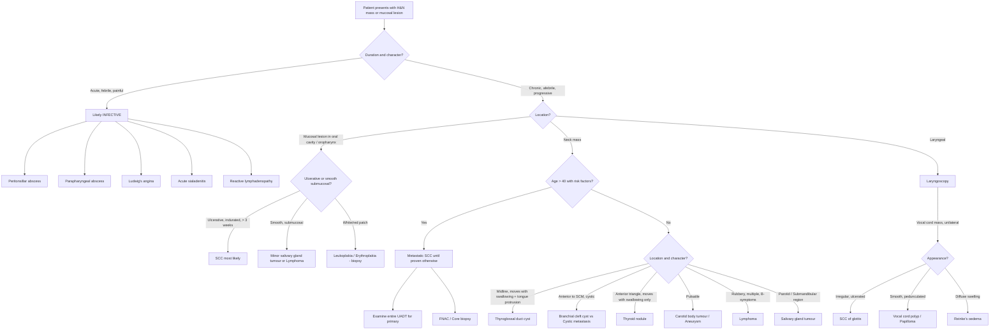

## Differential Diagnosis of Head and Neck Cancer

The differential diagnosis of a head and neck mass or mucosal lesion is broad. The critical clinical skill is distinguishing **malignant** from **benign** and **inflammatory** conditions — because the management is radically different. Let's think about this systematically, starting from first principles: *What can cause a lump or lesion in the head and neck?*

The answer falls into three fundamental categories: **Congenital/Developmental**, **Inflammatory/Infective**, and **Neoplastic**. The lecture slides give us a crucial clinical pearl for distinguishing these:

***Clinical presentations of oral cavity and oropharyngeal conditions*** [3]:
- ***Infective: acute and febrile***
- ***Neoplastic (congenital/developmental/malignant): chronic and afebrile***

This is your first-pass filter on the ward round. A patient with a 3-day history of painful throat swelling and fever almost certainly has an infection. A patient with a 3-month, painless, progressive mass is neoplastic until proven otherwise.

---

### 1. Structured Approach: DDx by Presentation

The way a H&N cancer presents determines your differential diagnosis. Let's organise this by the **presenting complaint**.

#### 1.1 DDx of an Oral/Oropharyngeal Mucosal Lesion (Ulcer or Mass)

This is the most common presentation of oral cavity and oropharyngeal cancer. You see a lesion in the mouth — what else could it be?

| Category | Differentials | Key Distinguishing Features |
|:--|:--|:--|
| **Malignant** | ***SCC*** (by far most common — ***90% of H&N malignancies*** [3]) | Indurated, non-healing ulcer > 3 weeks, contact bleeding, associated leukoplakia/erythroplakia |
| | ***Adenocarcinoma*** (minor salivary gland origin) | Smooth submucosal mass, often hard palate or tongue base [3] |
| | ***Lymphoma*** | ***Tonsils and tongue base may be the presenting site for a lymphoma*** [2]. Rubbery, non-ulcerated tonsillar enlargement; may have B-symptoms |
| | ***Minor salivary gland tumours*** | ***May present as submucosal masses in the tongue base and soft palate*** [2]. Smooth, well-circumscribed, submucosal — unlike the irregular surface of SCC |
| | Verrucous carcinoma | Exophytic, warty, well-differentiated; locally aggressive but rarely metastasizes |
| | Mucosal melanoma | Pigmented lesion, very rare in oral cavity |
| | Kaposi's sarcoma | Violaceous flat/raised lesions; associated with HIV/HHV-8 |
| **Premalignant** | ***Leukoplakia*** | White patch that cannot be scraped off [2]. Overall 3–5% malignant transformation |
| | ***Erythroplakia*** | Bright red plaque [2]. ~50% harbour dysplasia/carcinoma on biopsy |
| | ***Speckled leukoplakia*** | ***Highest rate of malignant transformation*** [2] |
| | Oral submucous fibrosis | Betel nut chewing; trismus; 7–13% transformation |
| **Benign neoplasm** | Fibroma | Most common benign oral tumour. Smooth, pedunculated, painless |
| | Papilloma | Pedunculated, finger-like projections; HPV-related |
| | Granular cell tumour | Firm submucosal nodule, often tongue |
| | Pleomorphic adenoma of minor salivary gland | Smooth, slow-growing, hard palate |
| **Infective** | Aphthous ulcer | Recurrent, painful, < 2cm, self-limiting (< 2 weeks). Not indurated. |
| | Herpetic stomatitis | Vesicles → shallow ulcers, clustered, painful, self-limiting |
| | Oral candidiasis (thrush) | White plaques that **CAN** be scraped off (unlike leukoplakia) |
| | Syphilitic chancre (primary) | Painless ulcer with raised rolled edges — can mimic SCC! Serological testing essential |
| | Tuberculous ulcer | Chronic, painful ulcer with undermined edges; granulomatous histology |
| | Deep fungal infection (histoplasmosis) | Rare; immunocompromised |
| **Inflammatory** | Traumatic ulcer | History of trauma (biting, sharp tooth, denture); resolves when cause removed |
| | Lichen planus (erosive) | Wickham's striae, bilateral, chronic; premalignant |
| | Behçet's disease | Recurrent oral + genital ulcers, uveitis |
| | Pemphigus vulgaris | Flaccid blisters → widespread ulceration, positive Nikolsky's sign |

<Callout title="The 3-Week Rule" type="error">
Any oral ulcer that does not heal within 3 weeks must be biopsied to rule out malignancy. This is a fundamental clinical rule. The lecture emphasises: ***Persistent 2–4 weeks after conservative/empirical treatment*** should trigger ***EARLY REFERRAL to ENT Surgeons when suspecting malignancy*** [3].
</Callout>

#### 1.2 DDx of a Neck Mass

A neck mass is one of the most common presentations of H&N cancer — either from the primary tumour itself (e.g., salivary gland, thyroid) or from **lymph node metastasis** (the primary is elsewhere in the UADT). The differential is organised by location and patient demographics.

**By Location** [2]:

| Location | Differentials |
|:--|:--|
| ***Midline (Central)*** | ***Thyroid nodule (isthmus), Thyroglossal duct cyst, Dermoid cyst, Ranula, Level I lymph node*** [2] |
| ***Anterior triangle*** | ***Thyroid nodule, Branchial cleft cyst, Carotid body tumour (Chemodectoma), Carotid artery aneurysm, Laryngocoele***, Lymphadenopathy (Levels I–IV) [2] |
| ***Posterior triangle*** | Lymphadenopathy (Level V), Cystic hygroma, Lipoma, Cervical rib |

**By Age Group**:

| Age | Most Likely Cause |
|:--|:--|
| **Children (< 15)** | Congenital (thyroglossal cyst, branchial cleft cyst, dermoid), Reactive lymphadenopathy, Lymphoma |
| **Young adults (15–40)** | Reactive lymphadenopathy, Branchial cleft cyst, Lymphoma, Salivary gland tumour, Thyroid nodule |
| **Adults (> 40)** | **Metastatic carcinoma** (most common cause of a neck mass in adults > 40 with risk factors), Lymphoma, Salivary gland tumour, Thyroid carcinoma |

**By Pathological Category** [2]:

| Category | Differentials | Key Features |
|:--|:--|:--|
| **Metastatic H&N carcinoma** | ***Metastatic SCC from UADT*** (most common) [2] | Hard, fixed, non-tender. ***Masses are usually asymptomatic but symptoms related to the primary site can be elicited*** [2] — e.g., hoarseness, dysphagia, otalgia → cervical LN metastasis from an underlying UADT malignancy [2] |
| **Thyroid masses** | ***Thyroid nodule/cyst/carcinoma*** [2] | Moves with swallowing. ***Confirmed with ultrasound and FNA*** [2] |
| **Salivary gland tumour** | ***80% arise in parotid gland; parotid tumours usually benign (80%); submandibular gland tumours usually malignant (50%)*** [2] | Tail of parotid or submandibular triangle location |
| **Lymphoma** | Hodgkin and Non-Hodgkin lymphoma | ***Neck involvement common in children with Hodgkin lymphoma (80%). Presents with fever, night sweats, chills and diffuse lymphadenopathy*** [2]. Rubbery, non-tender |
| **Paraganglioma** | ***Carotid body tumour (Chemodectoma)*** [2] | ***Pulsatile, bruit on auscultation, mobile side-to-side but not up-and-down (Fontaine's sign)*** [2]. Highly vascular. |
| | ***Jugulotympanic paraganglia (Glomus jugulare)*** [2] | Pulsatile tinnitus, conductive hearing loss |
| **Schwannoma** | ***Vagus nerve or sympathetic chain schwannoma*** [2] | ***Vagal schwannoma → hoarseness/aspiration; Sympathetic chain schwannoma → Horner's syndrome*** [2] |
| **Congenital** | ***Branchial cleft cyst*** (2nd most common; anterior to SCM) [2] | Presents in late childhood/early adulthood when infected. |
| | ***Thyroglossal duct cyst*** | Midline, moves with swallowing AND tongue protrusion (distinguishes from thyroid nodule which moves with swallowing only) |
| | Dermoid cyst | Midline, submental, doughy feel |
| | Cystic hygroma (lymphatic malformation) | Transilluminant, posterior triangle, infants |
| **Benign** | ***Lipoma*** [2] | ***Soft, ill-defined, slowly enlarging, any location*** [2] |
| | ***Benign skin cysts*** (epidermoid, pilomatrixoma) [2] | Superficial, mobile |
| **Vascular** | Carotid artery aneurysm | Pulsatile, expansile |

<Callout title="Cystic Neck Mass in a Young Adult — Don't Be Fooled">
A cystic Level II neck mass in a young adult (especially a non-smoker) is classically thought to be a **branchial cleft cyst**. However, **HPV-positive oropharyngeal SCC metastatic to Level II nodes** can present as a **cystic neck mass** — the metastasis undergoes cystic degeneration. Always examine the oropharynx (tonsils and tongue base) and consider biopsy/FNA for p16 and HPV testing before excising what you think is a "branchial cleft cyst" in anyone over 30.
</Callout>

#### 1.3 DDx by Subsite of H&N Cancer

Different subsites have specific differentials beyond SCC:

**Oral cavity** [3]:
- ***Histology considerations*** — ***Epithelium (ulcerative): SCC / Adenocarcinoma*** [3]
- ***Underlying structure (smooth): Lymphoma / Minor salivary gland tumours*** [3]

**Oropharynx** [3]:
- ***Histology considerations*** — ***Epithelium: SCC*** [3]
- ***Lymphoma / Minor salivary gland tumours*** [3]

**Nasopharynx**:
- Non-keratinizing carcinoma (undifferentiated, EBV-associated) — dominant histology in HK [2]
- Lymphoma — nasopharyngeal lymphoma (NK/T cell type) is particularly relevant in Asian populations
- Adenoid cystic carcinoma (rare)
- Juvenile nasopharyngeal angiofibroma — benign but locally aggressive, exclusively in adolescent males. Highly vascular — DO NOT biopsy before imaging!
- Thornwaldt's cyst — benign notochordal remnant in nasopharyngeal midline
- Rathke's pouch cyst — developmental

**Larynx**:
- SCC (most common malignancy) [2]
- Vocal cord polyp/nodule — benign, related to voice abuse; sessile or pedunculated, usually unilateral
- Papilloma — can be recurrent respiratory papillomatosis (HPV 6, 11); mainly children
- Contact granuloma — posterior glottis, related to reflux or intubation trauma
- Reinke's oedema — polypoid degeneration of vocal cords (smoking, voice abuse)
- Laryngeal cyst (retention cyst, saccular cyst)
- Chondroma / Chondrosarcoma — rare, arising from laryngeal cartilage

**Salivary glands** [2]:
- ***Differential diagnosis of parotid/salivary mass:***
  - ***Salivary cysts***
  - ***Salivary gland stones***
  - ***Sjögren's syndrome***
  - ***Metastasis from other tumours*** (scalp/facial skin SCC or melanoma)
  - ***Lymphoepithelial cysts*** (HIV-associated)
  - ***Chronic sclerosing sialadenitis (Küttner's tumour)***
  - ***Regional lymphadenopathy*** (intraparotid lymph nodes)
  - ***Sialadenosis*** — non-inflammatory, non-neoplastic hypertrophy; associated with ***anorexia/bulimia nervosa, alcoholic cirrhosis, diabetes mellitus*** [2]

---

### 2. DDx Decision Flowchart

---

### 3. Key Differentials Requiring Special Attention

#### 3.1 Lymphoma vs SCC in the Tonsil/Tongue Base

Both can present as an asymmetric tonsillar mass. How do you tell them apart?

| Feature | SCC | Lymphoma |
|:--|:--|:--|
| Surface | Ulcerated, irregular, friable | Smooth, intact mucosa (submucosal mass) |
| Consistency | Hard, indurated | Rubbery, firm |
| Unilateral vs bilateral | Usually unilateral | Can be bilateral |
| Systemic symptoms | Rare (weight loss late) | ***Fever, night sweats, chills*** [2] |
| LN involvement | Regional (Level II) | Diffuse, may be widespread |
| Definitive test | Incisional biopsy | Excisional/core biopsy (architecture needed for subtyping) |

<Callout title="Biopsy Approach Matters" type="idea">
***FNA does NOT provide material for tissue architecture or immunohistochemical analysis*** [2]. For suspected lymphoma, you need a **core needle biopsy or excisional biopsy** for tissue architecture — FNA cytology alone cannot subtype lymphoma. This is a common exam question.
</Callout>

#### 3.2 Unknown Primary with Neck Node Metastasis

This is a classic clinical scenario: a patient presents with a neck lump, FNA shows metastatic SCC, but you cannot find the primary tumour on clinical examination.

**Approach**:
1. ***Panendoscopy with biopsy*** — direct laryngoscopy + bronchoscopy + OGD + directed biopsies of likely primary sites (nasopharynx, tongue base, tonsils, pyriform sinus) [3]
2. ***Tonsillectomy or EUA + Bx*** [3] — the tonsils are the most common site of occult primary (especially HPV-positive SCC hiding within tonsillar crypts)
3. ***CT/MRI*** for anatomical delineation [3]
4. ***PET scan*** — ***PET scan is superior to both CT and MRI for detecting regional nodal metastasis as well as distant metastasis and second primary tumours*** [2]
5. FNA for **p16/HPV** testing and **EBV** (plasma EBV DNA) [2]

#### 3.3 Salivary Gland Mass — Benign vs Malignant

***Facial weakness*** in the context of a parotid mass is ***high suspicion of malignant involvement of parotid gland*** [2]. Benign parotid tumours (even large ones) almost never cause facial nerve palsy because they *displace* rather than *invade* the nerve. If CN VII is affected, the lesion is likely malignant.

Other features suggesting malignancy:
- Rapid growth
- ***Pain and paraesthesia*** [2]
- Fixation to skin or deep structures
- ***Mucosal ulceration*** [2]
- Cervical lymphadenopathy

***Parotid tumour must be distinguished from Bell's palsy*** [2] — both cause facial weakness, but Bell's palsy is acute onset, involves the entire hemifacial musculature equally (forehead included — lower motor neurone pattern), and has no palpable mass.

#### 3.4 Bilateral Parotid Swelling — Not Cancer

***Differential diagnosis of bilateral parotid gland enlargement*** [2]:
- ***Parotitis*** (viral — mumps; bacterial — ascending infection)
- ***Bruxism*** (excess teeth grinding or jaw clenching — masseter hypertrophy can mimic parotid enlargement)
- ***Masseter hypertrophy***
- ***Sialadenosis*** — non-inflammatory, non-neoplastic hypertrophy, usually bilateral and painless. Associated with ***anorexia/bulimia nervosa (self-induced vomiting), alcoholic cirrhosis, diabetes mellitus*** [2]
- ***Drug-induced*** (e.g., Phenytoin) [2]
- ***Sjögren's syndrome***

#### 3.5 Distinguishing Metastatic Neck Node from Second Primary

Due to ***field cancerization***, H&N cancer patients can develop second primaries. When a new lesion is found:
- **Metastasis**: Same histology, connected via lymphatic/haematogenous route
- **Second primary (synchronous/metachronous)**: Different histology OR different location with dysplasia-carcinoma sequence, no intervening malignant tissue
- ***10% risk of synchronous/metachronous tumour (field cancerization)*** [3] — this is why panendoscopy is mandatory

---

### 4. When to Suspect Malignancy — Red Flags

The lecture provides clear referral criteria [3]:

***EARLY REFERRAL to ENT Surgeons when suspecting malignancy*** [3]:
- ***Persistent 2–4 weeks after conservative/empirical treatment*** [3]
- ***Clinically suspicious: irregular, induration, > 2cm, associated cervical LN enlargement*** [3]

Additional red flags from history and examination [2][3]:
- Age > 40 with smoking/alcohol history and new neck mass
- ***Hoarseness, dysphagia, otalgia*** in the context of a neck mass → suggests ***cervical lymph node metastasis from an underlying upper aerodigestive tract malignancy*** [2]
- Unilateral serous otitis media in an adult (think NPC)
- Progressive dysphagia with weight loss
- Blood-stained nasal discharge/saliva/sputum
- Non-healing oral ulcer > 3 weeks
- New-onset cranial nerve palsy
- ***15–20% of oral cavity cancers have occult nodal metastasis*** — hence ***elective neck dissection*** is indicated even when the neck is clinically negative [3]

---

### 5. Oral Cavity Cancer — Histological Differentials (From Lecture)

***Oral cavity malignancy subsites*** [3]:
- ***Oral tongue (commonest)***
- ***Buccal mucosa***
- ***Floor of mouth***
- ***Upper or lower alveolus***
- ***Hard palate***
- ***Lip***

***Clinical features of oral cavity SCC*** [3]:
- ***Exophytic mass***
- ***Non-healing ulcer***
- ***Painless at first, painful when infiltrating nerve***
- ***Surrounding leukoplakia/erythroplakia***
- ***Induration or fixation***
- ***Loosened tooth +/- non-healing tooth socket***
- ***Bleeding, swallowing/speech difficulty (ankyloglossia)***
- ***15–20% of occult nodal metastasis → Elective neck dissection***

<Callout title="Ankyloglossia in Cancer Context" type="idea">
***Ankyloglossia*** literally means "anchored tongue" (from Greek *ankylos* = crooked/fused, *glossa* = tongue). In the cancer context, this refers to restricted tongue mobility due to tumour infiltration into the floor of the mouth or extrinsic tongue muscles — the tongue becomes "tethered." Not to be confused with congenital tongue-tie.
</Callout>

---

### 6. Summary: DDx Framework

| Presenting Complaint | Think First (Most Likely) | Must Not Miss | Important to Differentiate |
|:--|:--|:--|:--|
| **Non-healing oral ulcer** | SCC | Lymphoma, Syphilitic chancre | Traumatic ulcer, Aphthous |
| **Asymmetric tonsil** | SCC of tonsil | Lymphoma | Peritonsillar abscess (acute, febrile) |
| **Neck mass (> 40, smoker)** | Metastatic SCC | Lymphoma | Thyroid, Salivary gland tumour |
| **Neck mass (young adult)** | Branchial cleft cyst | Cystic metastasis from HPV+ SCC | Lymphoma, Thyroglossal cyst |
| **Parotid mass** | Pleomorphic adenoma | Malignant salivary tumour (if CN VII palsy) | Warthin's tumour, Intraparotid LN |
| **Bilateral parotid swelling** | Sialadenosis, Sjögren's | Lymphoma | Parotitis, Bruxism/masseter hypertrophy |
| **Hoarseness > 3 weeks** | Glottic SCC (if risk factors) | Laryngeal cancer, Lung apex tumour | Vocal cord polyp, Reinke's oedema, Reflux laryngitis |
| **Unilateral serous otitis media (adult)** | NPC | — | Eustachian tube dysfunction |
| **Unilateral nasal obstruction + epistaxis** | NPC, Sinonasal malignancy | Juvenile nasopharyngeal angiofibroma (adolescent male) | Nasal polyp, Inverted papilloma |

---

<Callout title="High Yield Summary">

**The Big Three DDx Categories**: Infective (acute, febrile) vs Neoplastic (chronic, afebrile) vs Congenital/Developmental.

**90% of H&N malignancies are SCC** (excluding nasopharynx and thyroid).

**Oral cavity/oropharynx histological DDx**: SCC (epithelial, ulcerative) vs Lymphoma/minor salivary gland tumour (submucosal, smooth).

**Key mimics of cancer**: Lymphoma (tonsil/tongue base), syphilitic chancre (oral ulcer), branchial cleft cyst (cystic neck mass — may be HPV+ metastasis).

**Red flags for malignancy referral**: Persistent > 2–4 weeks, irregular, indurated, > 2cm, associated cervical LN. Hoarseness/dysphagia/otalgia with a neck mass suggests metastatic UADT cancer.

**FNA limitations**: Cannot provide tissue architecture → cannot subtype lymphoma. Need core/excisional biopsy.

**Facial nerve palsy with parotid mass = malignant until proven otherwise**.

**15–20% occult nodal metastasis in oral cavity SCC → elective neck dissection**.

**Field cancerization → 10% risk synchronous/metachronous tumours → always panendoscopy**.

**Cystic Level II node in young adult: think HPV+ oropharyngeal SCC, not just branchial cleft cyst**.

</Callout>

---

<ActiveRecallQuiz
  title="Active Recall - DDx of Head and Neck Cancer"
  items={[
    {
      question: "A 55-year-old smoker presents with a hard, fixed, non-tender left Level II neck mass. What is the most likely diagnosis and what is your initial approach?",
      markscheme: "Most likely: metastatic SCC from the upper aerodigestive tract. Approach: Full H&N examination (oral cavity, oropharynx, nasopharynx, hypopharynx, larynx), USG + FNAC of neck mass, panendoscopy with biopsy (direct laryngoscopy + bronchoscopy + OGD), CT/MRI neck, PET-CT if primary not found. FNA should include HPV p16 and EBV testing.",
    },
    {
      question: "How do you distinguish lymphoma from SCC when both present as a tonsillar mass? What biopsy approach is required for each?",
      markscheme: "SCC: ulcerated, irregular surface, indurated, unilateral. Lymphoma: smooth intact mucosa (submucosal), rubbery, may be bilateral, B-symptoms (fever, night sweats). Biopsy: SCC can be diagnosed on incisional biopsy or FNA. Lymphoma REQUIRES core needle or excisional biopsy for tissue architecture and immunohistochemistry — FNA alone cannot subtype lymphoma.",
    },
    {
      question: "A 32-year-old non-smoking male presents with a cystic Level II neck mass. The most obvious diagnosis is a branchial cleft cyst. What must you also consider and why?",
      markscheme: "Must consider HPV-positive oropharyngeal SCC with cystic nodal metastasis. HPV+ oropharyngeal cancers (tonsil/tongue base) present in younger, non-smoking males and metastatic nodes can undergo cystic degeneration mimicking a branchial cleft cyst. Must examine oropharynx (tonsils, tongue base) and send FNA for p16/HPV testing.",
    },
    {
      question: "Name three clinical features that differentiate a malignant parotid tumour from a benign one.",
      markscheme: "Malignant: (1) Facial nerve palsy (CN VII) — benign tumours displace but do not invade the nerve; (2) Pain and paraesthesia — benign tumours are typically painless; (3) Rapid growth, fixation to skin or deep structures, cervical lymphadenopathy, mucosal ulceration.",
    },
    {
      question: "What are the referral criteria (red flags) that the lecture highlights for suspecting H&N malignancy in a mucosal lesion?",
      markscheme: "Persistent 2-4 weeks after conservative/empirical treatment. Clinically suspicious features: irregular border, induration, size greater than 2cm, associated cervical lymph node enlargement. Also: non-healing ulcer greater than 3 weeks, blood-stained discharge, associated cranial nerve symptoms.",
    },
  ]}
/>

---

## References

[2] Senior notes: felixlai.md (H&N cancer, CA Oropharynx, NPC, Laryngeal carcinoma, Salivary gland, Neck mass sections)
[3] Lecture slides: GC 219. Infections and tumours in pharynx and oral cavity.pdf (pp. 34, 35, 36, 40, 41, 42, 48)
