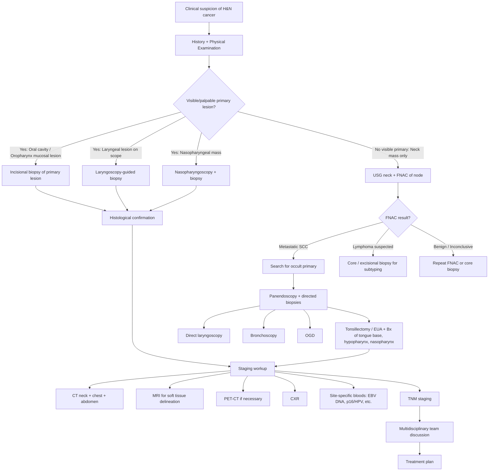

## Diagnosis of Head and Neck Cancer

The diagnosis of H&N cancer follows a logical, stepwise approach built on first principles: **find the lesion → prove it's cancer → determine how far it's spread → stage it → plan treatment**. Every investigation you order should serve one of these purposes. Let's walk through this systematically.

---

### 1. Diagnostic Principles — No Formal "Diagnostic Criteria" Like Medical Conditions

H&N cancer does not have formal diagnostic criteria in the way that, say, rheumatoid arthritis has the ACR/EULAR criteria. Instead, the diagnosis is **histopathological** — you need a tissue biopsy showing malignant cells. Everything else (history, examination, imaging) serves to:
1. **Raise clinical suspicion** (symptoms + risk factors + signs)
2. **Locate the primary tumour** (endoscopy + imaging)
3. **Obtain tissue** (biopsy or FNA)
4. **Stage the disease** (TNM staging using imaging + pathology)

The "diagnostic criteria" for H&N cancer is therefore:
- **Clinical suspicion** (red flags, risk factors) → **confirmed by histopathological demonstration of malignancy on biopsy**

<Callout title="The Diagnosis is Histological">
You cannot diagnose H&N cancer on imaging alone. A CT showing a nasopharyngeal mass is not a diagnosis of NPC — it is a finding that requires biopsy confirmation. The definitive diagnosis is ALWAYS tissue-based.
</Callout>

---

### 2. Diagnostic Algorithm

The workup follows a structured pathway. The lecture slides lay it out clearly [3]:

***Workup and Investigation*** [3]:
- ***History***
- ***Physical Examination***
- ***Panendoscopy + biopsy*** — ***10% risk of synchronous/metachronous tumour (field cancerization)***
- ***Tonsillectomy or EUA + Bx***
- ***Ultrasound neck +/- FNAC***
- ***CXR***
- ***CT/MRI***
- ***PET scan if necessary***

---

### 3. History Taking

This was covered in Part 1 (Clinical Features), but in the diagnostic context the key points are:

***History*** [3][7]:
- ***Age, Sex***
- ***Duration: Acute vs Chronic*** — acute + febrile = infection; chronic + afebrile = neoplasm
- ***Symptoms*** — systematically cover ear, nose, mouth, throat, pharynx, neck (as per Part 1)
- ***Risk factors: smoking, alcohol, family history*** [3]
- ***Functional disturbances: breathing, chewing, swallowing, phonation, articulation*** [3]
- ***Co-morbidities*** — determines fitness for surgery/chemoradiation

**Growth pattern of mass** [2]:
- ***Present for years with minimal change → likely benign neoplasm***
- ***Rapidly expanding → likely malignancy***

**Associated symptoms that suggest specific diagnoses** [2]:
- ***Fever, night sweats, weight loss → suggests lymphoma***
- ***Hoarseness, dysphagia, otalgia → suggests cervical lymph node metastasis from an underlying upper aerodigestive tract malignancy***

---

### 4. Physical Examination

#### 4.1 Oral Cavity and Oropharynx

***Physical Examination*** [3]:

***Oral cavity and Oropharynx*** [3]:
- ***Systematic to all sub-sites***
- ***Inspection and palpation (underlying mass/induration)***

Why palpation? Because inspection alone misses submucosal disease. Bimanual palpation of the floor of mouth (one finger intraoral, one finger extraoral under the chin) can detect indurated masses that look normal on the surface. Palpation of the tongue base can reveal a mass invisible to the naked eye.

***Neck*** [3]:
- ***Location (region/level)***
- ***Shape + size (measure)***
- ***Consistency***
- ***Mobility***
- ***Inflammation***

***Scalp/Skin*** [3] — don't forget: metastatic skin SCC/melanoma to parotid or cervical nodes is a recognised pathway. Always check the scalp and face.

**Mass characterization features** [2]:
- ***Rock-hard, fixed and non-tender → Malignancy***
- ***Firm, rubbery, rapidly expanding → Lymphoma***
- ***Discrete, mobile, firm, slightly tender → Reactive LN***
- ***Pulsatile with bruit → Vascular lesion***

#### 4.2 Complete H&N ENT Examination

***Other examinations*** [7]:
- ***Complete H&N ENT examination***
- ***Facial nerve examination*** — essential when salivary gland malignancy is suspected
- ***Palpation of neck lymph nodes***
- ***Endoscopy of the upper aerodigestive tract***

#### 4.3 Cranial Nerve Examination

Especially important for NPC (skull base invasion → CN III–VI in cavernous sinus; parapharyngeal space → CN IX, X, XII, sympathetic chain). Also important for salivary gland tumours (CN VII for parotid).

#### 4.4 Laryngoscopy (Flexible Fibreoptic Nasopharyngolaryngoscopy)

This is the **bedside scope** — performed in the clinic with topical anaesthesia. It allows you to visualise the nasopharynx, oropharynx, hypopharynx, and larynx in a single pass.

Key findings:
- **Nasopharyngeal mass** (especially in Fossa of Rosenmüller) → NPC
- **Asymmetric tonsil, tongue base mass** → Oropharyngeal cancer or lymphoma
- **Vocal cord mobility**: Fixed cord = invasion of recurrent laryngeal nerve or cricoarytenoid joint fixation
- **Pyriform sinus pooling** → obstruction at hypopharynx/upper oesophagus
- **Supraglottic/glottic/subglottic mass** → laryngeal cancer

---

### 5. Investigation Modalities

#### 5.1 Pathological Tests — The Core of Diagnosis

##### 5.1.1 Fine Needle Aspiration (FNA/FNAC)

***Fine needle aspiration — cytology*** [7][2]:
- **Technique**: 21–25 gauge needle, ***direct palpation or under ultrasound or CT guidance*** [2]
- **Utility**: ***Aspirate is used for cytological analysis, PCR testing for virus*** [2]:
  - ***EBV for nasopharyngeal carcinoma (NPC)*** [2]
  - ***HPV for oropharyngeal squamous cell carcinoma*** [2]
- **Limitation**: ***Does NOT provide material for tissue architecture or immunohistochemical analysis*** [2]. This means FNA can tell you "these are malignant squamous cells" but cannot subtype a lymphoma (which requires assessment of tissue architecture and immunophenotyping).
- ***USG has limited use in oropharyngeal cancer but is a useful adjunct for FNAC to ensure accurate aspiration of a deeply seated lymph node swelling*** [2]

Why FNA first? Because it is **minimally invasive**, can be done in clinic, and gives rapid results. It is the first-line tissue sampling method for a neck mass.

##### 5.1.2 Core Needle Biopsy

- Obtains a cylinder of tissue → provides **architecture** as well as cells
- Useful when FNA is non-diagnostic or when **lymphoma** is suspected (architecture needed for subtyping)
- **Risks**: bleeding, nerve injury, tumour seeding (theoretical)

##### 5.1.3 Incisional Biopsy (of Primary Mucosal Lesion)

- ***Incisional biopsy should be performed in all cases*** of oropharyngeal/oral cavity suspicious lesions [2]
- Takes a wedge of tissue from the lesion edge (include normal and abnormal tissue)
- **Gold standard** for diagnosis of mucosal H&N cancers

<Callout title="Incisional vs Excisional Biopsy — A Critical Distinction" type="error">
***Excisional biopsy of a neck node is discouraged since it can adversely affect the success of subsequent surgical resection by field contamination in certain malignancy*** [2]. However, it is ***considered in the setting when FNA or core needle biopsy is positive for lymphoma where additional tissue is required for subtyping*** [2]. In short: for SCC — do NOT excise the node first (it can seed the surgical field and compromise the definitive neck dissection). For lymphoma — you may need an excisional biopsy because architecture is essential.
</Callout>

##### 5.1.4 Tonsillectomy / EUA + Bx

***Tonsillectomy or EUA + Bx*** [3]

When the primary is occult (neck node metastasis but no visible primary), directed biopsies of likely primary sites are essential [7]:

***Surgery in searching primary malignancy*** [7]:
- ***Right tonsillectomy & frozen section***
- ***Left tonsillectomy***
- ***Pharyngoscopy biopsy of hypopharynx & tongue base***
- ***Nasopharyngoscopy & biopsy***

Why tonsillectomy? Because HPV-positive oropharyngeal cancers can hide deep within the tonsillar crypts and be invisible on surface examination. A superficial biopsy may miss them. **Ipsilateral tonsillectomy** (on the side of the neck mass) followed by contralateral tonsillectomy if negative, with frozen section, is the standard approach for unknown primary workup.

##### 5.1.5 Special Histological/Molecular Tests on Tissue

| Test | Purpose | Subsite Relevance |
|:--|:--|:--|
| **p16 immunohistochemistry** | Surrogate marker for HPV-driven tumour (p16 is overexpressed when Rb is inactivated by E7) | Oropharyngeal SCC |
| **HPV DNA PCR / in situ hybridisation** | Confirms HPV infection if p16+ | Oropharyngeal SCC |
| **EBER in situ hybridisation** | Detects EBV-encoded small RNA in tumour cells | NPC |
| **Immunohistochemistry panel** | CD20, CD3, Ki-67, etc. for lymphoma subtyping | Tonsillar/tongue base lymphoma |

#### 5.2 Blood Tests

| Test | Purpose | Interpretation |
|:--|:--|:--|
| **CBC with differentials** [2] | Baseline; leukocytosis may suggest infection; pancytopenia may suggest marrow involvement | Non-specific |
| ***Serum ALP level*** [2] | ***↑ ALP level in bone metastasis*** (from NPC or other H&N cancers with distant spread) | Elevated = investigate bones |
| ***Plasma EBV DNA level*** [2] | ***Detected by PCR. Diagnostic and staging evaluation for prognosis. Pre-treatment levels correlate with outcomes. Post-treatment levels evaluate treatment response and detection of recurrence*** | Quantitative — higher levels = larger tumour burden. Undetectable post-treatment = good response. Rising post-treatment = recurrence |
| ***EBV serology*** [2] | ***Sustained rise in IgA to both VCA and EA (↑ EBV VCA-IgA and EBV EA-IgA)*** | ***EBV-specific serological screening has low specificity for NPC*** [2]. ***Elevated titre may precede diagnosis of NPC by up to 10 years*** [2]. Used for population screening in endemic areas (HK). |
| **Inflammatory markers** (ESR, CRP) [2] | Rule out infection/inflammatory cause | Elevated in infection; also non-specifically elevated in malignancy |
| **HIV serology** [2] | Relevant if lymphoepithelial cyst, Kaposi's sarcoma, lymphoma suspected | |
| **Autoantibodies** (Anti-Ro/SSA, Anti-La/SSB) [2] | ***When Sjögren's disease is suspected as a cause of periparotid or submandibular masses*** | |

<Callout title="EBV DNA vs EBV Serology — Know the Difference">
**Plasma EBV DNA** (PCR) is quantitative, correlates with tumour burden, and is the preferred tool for **monitoring treatment response and detecting recurrence** in NPC. **EBV serology** (VCA-IgA, EA-IgA) is used for **population-level screening** in endemic areas but has low specificity (many healthy Southern Chinese have elevated EBV antibodies). In clinical practice for a known NPC patient, you follow the **plasma EBV DNA**, not the serology.
</Callout>

#### 5.3 Imaging Studies

##### 5.3.1 Ultrasound (USG) of Neck

***Ultrasound neck +/- FNAC*** [3]

- ***Non-invasive real-time assessment of mass and its relation to adjoining structures*** [2]
- ***Guide fine-needle aspiration*** [2]
- **Best for**: Evaluating cervical lymph nodes, thyroid nodules, salivary gland masses
- **Limited for**: Deep structures (skull base, parapharyngeal space, retropharyngeal nodes), mucosal primary tumours

***Investigation of malignant salivary gland tumour*** — ***Bedside USG*** [7]:
- ***Tumour vs inflammation***
- ***Location of tumour***
- ***Cervical LN***

**Sonographic features of pathological lymph nodes** [2]:
- ***Size > 1.0 cm in minimal axial diameter***
- ***Rounded-shaped*** (loss of normal oval/kidney-bean shape)
- ***Increased or heterogeneous contrast enhancement***
- ***Loss of normal fatty hilum*** (the echogenic centre disappears when replaced by tumour cells)
- ***Presence of central necrosis*** (hypoechoic/anechoic centre — tumour outgrows its blood supply)

Why these features? Normal lymph nodes are oval (long-axis/short-axis ratio > 2), have a preserved fatty hilum (echogenic centre), and are < 1cm short-axis. Metastatic nodes become rounded (tumour cells expand the cortex uniformly), lose the hilum (replaced by tumour), and develop necrosis centrally (tumour outgrows blood supply).

##### 5.3.2 CT Scan

***CT/MRI*** [3]

**Strengths of CT** [2]:
- ***CT is superior to MRI in terms of providing greater spatial resolution, faster acquisition time, and better for evaluation of bony destruction***
- ***Determine extent of tumour infiltration into deep tongue musculature and whether mandible is involved for cancer of the oral cavity*** [2]
- ***Determine local invasion or infiltration into adjacent structures for other H&N cancers that is difficult to detect on physical examination*** [2]
- ***Detection of cervical lymph node metastasis*** [2]
- ***CT thorax and abdomen to assess for distant metastasis*** [2]
- ***Useful to detect bony invasion*** [2]

**For salivary gland tumours** — ***CT scan*** [7]:
- ***Bony invasion***
- ***Cervical LN***

**CT features of pathological LNs** [2] — same as USG but on cross-sectional imaging:
- ***Size > 1.0 cm in minimal axial diameter***
- ***Rounded-shaped***
- ***Increased or heterogeneous contrast enhancement***
- ***Loss of normal fatty hilum***
- ***Presence of central necrosis***

**When to choose CT over MRI**: Bony detail needed (mandible invasion, skull base erosion pattern), fast acquisition (uncooperative patient, airway concerns), claustrophobic patient, CT chest/abdomen needed simultaneously for staging.

##### 5.3.3 MRI Scan

***MRI scan*** [2]:
- ***MRI is superior to CT in terms of soft tissue delineation, detecting bone marrow invasion or skull base erosions***
- ***Imaging modality of choice for cancer of the oral cavity and oropharynx*** [2] — because these sites require precise delineation of soft tissue extent (how far into the tongue muscles? is the pterygoid involved? is the parapharyngeal space invaded?)
- ***Provides optimal visualization of soft-tissue infiltration of the tumour*** [2]
- ***Detection of cervical lymph node metastasis*** [2]

**For salivary gland tumours** — ***MRI*** [7]:
- ***Accurate delineation of extent of invasion***
- ***May be able to see nerve invasion*** (perineural spread along CN VII in parotid cancer — T2-weighted and post-gadolinium images show nerve thickening/enhancement)

**For NPC**: ***CT or MRI of nasopharynx, skull base and neck*** — ***Assessment of locoregional disease extent*** [2]

**MRI indications for neck masses** [2]:
- ***Infiltrative soft tissue masses***
- ***Suspicious malignant perineural spread***
- ***Potential CNS origin***

**When to choose MRI over CT**: Soft tissue detail needed (tongue, palate, parapharyngeal space), skull base invasion assessment, perineural spread, no radiation exposure (younger patients).

| Feature | CT | MRI |
|:--|:--|:--|
| **Bone detail** | Superior (cortical destruction) | Better for marrow invasion |
| **Soft tissue** | Adequate | ***Superior*** |
| **Speed** | Fast (seconds) | Slow (30–60 min) |
| **Availability** | More available | Less available |
| **Perineural spread** | Limited | ***Superior*** |
| **Skull base** | Good for bony erosion | ***Superior for soft tissue/cavernous sinus*** |
| **Preferred for** | Larynx (cartilage), chest/abdomen staging, bony invasion | Oral cavity, oropharynx, nasopharynx, salivary glands |

##### 5.3.4 Panendoscopy

***Panendoscopy + biopsy*** [3] — ***10% risk of synchronous/metachronous tumour (field cancerization)*** [3]

***Panendoscopy = Direct laryngoscopy + Bronchoscopy + OGD*** [2]

This is performed under general anaesthesia. It serves **three purposes**:

1. ***Detection of synchronous primary cancer*** [2] — because of field cancerization, you must examine the entire UADT, tracheobronchial tree, and upper oesophagus.
2. ***Part of operative staging for characterization of primary tumour*** [2] — assess tumour extent directly.
3. ***Panendoscopy may identify synchronous primaries that are too small to be identified with PET scan*** [2] — a subtle mucosal lesion in the oesophagus visible on OGD with NBI may be missed on PET.

**Key areas assessed during panendoscopy for laryngeal cancer** [2]:
- ***Supraglottic tumour: Vallecula, base of tongue, ventricle, arytenoid, anterior commissure***
- ***Glottic tumours: False cord, arytenoid, anterior commissure, subglottic extension***

##### 5.3.5 PET-CT Scan

***PET scan if necessary*** [3]

***PET-CT scan*** [2]:
- ***Uses 18F-fluorodeoxyglucose (FDG) as contrast*** — cancer cells have high metabolic activity and take up more glucose (Warburg effect), so they "light up" on PET.
- ***PET scan is superior to both CT and MRI for detecting regional nodal metastasis as well as distant metastasis and second primary tumours*** [2]
- ***PET scan may identify lower aerodigestive tract tumours not seen with panendoscopy*** [2]
- ***Identify primary disease or detect distant metastatic disease*** [2]

**For salivary gland tumours** — ***PET-CT*** [7]:
- ***Workup for distant metastasis***

**For NPC** [2]:
- ***PET-CT scan — Use of 18-fluorodeoxyglucose as contrast***
- ***Superior ability to detect lymph node and bone metastasis***

**Indications for PET-CT in H&N cancer**:
1. **Unknown primary** — neck node SCC, primary not found on examination + CT/MRI → PET-CT may reveal the primary
2. **Staging of advanced disease** — looking for distant metastases
3. **Post-treatment surveillance** — detecting recurrence (especially differentiating post-radiation changes from residual/recurrent tumour)
4. **Assessment of treatment response** — serial PET-CTs

**Limitations**: Poor spatial resolution compared to CT/MRI (can miss lesions < 1cm); false positives from inflammation/infection; physiological FDG uptake in Waldeyer's ring and muscles (can confuse interpretation).

##### 5.3.6 Other Imaging

| Modality | Indication |
|:--|:--|
| ***CXR*** [3][2] | Routine staging — ***evaluate for lung metastasis***. Quick, cheap, baseline. |
| ***Bone scan*** [2] | ***Evaluate for bone metastasis*** — especially NPC (bone is most common distant metastasis site at 75%) |
| **X-ray (Panoramic/OPG)** [2] | ***Detects gross cortical invasion*** of mandible in oral cavity cancer |
| **Angiography** [7] | Vascular lesions (carotid body tumour) — preoperative planning, embolisation |

---

### 6. Staging — TNM System

Once the diagnosis is confirmed and workup complete, the tumour is staged using the **AJCC 8th Edition TNM system** (2017) [2].

#### 6.1 General Principles

***Staging for upper aerodigestive tract malignancy by AJCC follows TNM staging format*** [2]:
- ***T stage for each site varies upon the relevant anatomy*** (site-specific)
- ***N stage is uniform for all H&N cancer except for the nasopharynx*** [2]
- ***M stage is uniform for all H&N cancer*** [2]

#### 6.2 N Staging (Non-Nasopharyngeal H&N Cancer) [2]

| N Stage | Description |
|:--|:--|
| **NX** | ***Regional LN cannot be assessed*** |
| **N0** | ***No regional LN metastasis*** |
| **N1** | ***Metastasis in single ipsilateral LN < 3 cm and ENE−*** |
| **N2a** | ***Metastasis in single ipsilateral LN < 3 cm and ENE+*** OR single ipsilateral 3–6 cm and ENE− |
| **N2b** | ***Metastasis in multiple ipsilateral LN, all < 6 cm and ENE−*** |
| **N2c** | ***Metastasis in bilateral or contralateral LN, all < 6 cm and ENE−*** |
| **N3a** | ***Metastasis in LN > 6 cm and ENE−*** |
| **N3b** | ***Metastasis in any node with ENE+*** (except N2a criteria) |

**ENE** = **Extranodal extension** (previously called extracapsular spread). This is when tumour breaks through the lymph node capsule into surrounding soft tissue. It is a critical prognostic factor and **upstages** the N category [2].

Why does ENE matter? Because a tumour confined within a node capsule has a better prognosis than one that has burst through — the latter indicates more aggressive biology and higher risk of locoregional recurrence and distant metastasis.

#### 6.3 M Staging [2]

| M Stage | Description |
|:--|:--|
| **M0** | ***No distant metastasis*** |
| **M1** | ***Distant metastasis*** |

#### 6.4 NPC-Specific N Staging

NPC has its own N staging because of its unique lymphatic drainage pattern (bilateral, retropharyngeal nodes common, supraclavicular involvement has distinct prognostic significance).

#### 6.5 HPV-Positive Oropharyngeal Cancer Staging

AJCC 8th edition introduced **separate staging** for p16-positive oropharyngeal cancer. The N staging is simplified (N1 = unilateral nodes ≤ 6 cm; N2 = contralateral or bilateral nodes ≤ 6 cm; N3 = nodes > 6 cm) and overall stages are "downstaged" compared to HPV-negative tumours — reflecting the dramatically better prognosis.

---

### 7. Subsite-Specific Diagnostic Approach

| Subsite | Key Investigations | Key Findings |
|:--|:--|:--|
| **Oral cavity** | Inspection + palpation + incisional biopsy; OPG for mandible; CT (bony invasion); ***MRI (imaging modality of choice)*** [2] | SCC histology; perineural invasion; DOI (depth of invasion, critical for T staging in AJCC 8th ed) |
| **Oropharynx** | ***Panendoscopy + biopsy; USG neck +/- FNAC; CT/MRI; p16 IHC and HPV testing*** [3][2] | p16+ = HPV-driven (better prognosis, separate staging) |
| **NPC** | ***Nasopharyngoscopy + biopsy (definitive diagnosis)*** [2]; ***Plasma EBV DNA (PCR)*** [2]; ***EBV serology (VCA-IgA, EA-IgA)*** [2]; ***CT/MRI nasopharynx, skull base, neck*** [2]; ***PET-CT*** [2]; ***CXR*** [2]; ***Bone scan*** [2] | EBER+ on ISH; Non-keratinizing undifferentiated carcinoma (most common in HK); ***Incisional nodal biopsy or nodal dissection should be AVOIDED since it will negatively impact subsequent treatment*** [2] |
| **Hypopharynx** | Panendoscopy + biopsy; CT/MRI; Barium swallow (occasionally, for postcricoid lesions) | Loss of laryngeal crepitus on exam |
| **Larynx** | ***Laryngoscopy (rigid/flexible fibreoptic) — allows biopsy to confirm histology, determines extent of local spread*** [2]; ***Panendoscopy (Direct laryngoscopy + Bronchoscopy + OGD) — exclude synchronous lesion*** [2]; ***CT/MRI neck — evaluate extent of tumour invasion, extra-laryngeal spread, suspicious LN involvement, cartilage erosion or invasion, extension into pre-epiglottic or paraglottic spaces*** [2] | Vocal cord fixation; cartilage invasion; paraglottic/pre-epiglottic space involvement |
| **Salivary gland** | ***FNA cytology or core needle biopsy*** [2]; ***USG (tumour vs inflammation, location, cervical LN)*** [7]; ***CT (bony invasion, cervical LN)*** [7]; ***MRI (accurate delineation of extent of invasion, nerve invasion)*** [7]; ***PET-CT (workup for distant metastasis)*** [7]; ***Facial nerve examination*** [7] | ***FNA can usually discriminate benign from malignant but is less specific for exact tumour type*** [2]; facial nerve palsy = malignant |

<Callout title="NPC Diagnostic Pearl" type="error">
***Incisional nodal biopsy or nodal dissection should be AVOIDED in NPC since it will negatively impact subsequent treatment*** [2]. NPC is treated primarily with **radiotherapy ± chemotherapy**, NOT surgery. An open neck dissection before radiation disrupts tissue planes and worsens outcomes. The diagnosis should be made from a **nasopharyngoscopy-guided biopsy of the primary tumour**, not from the neck node.
</Callout>

---

### 8. The Unknown Primary — Special Diagnostic Scenario

When a patient presents with a **metastatic neck node (SCC on FNA) but no clinically visible primary tumour**, this triggers the "unknown primary" workup. This is a common exam scenario.

**Step-by-step approach** [7][2][3]:

1. **FNA of neck node** — confirms metastatic SCC. Send for ***HPV (p16) and EBV*** testing [2]:
   - p16+ → primary likely in **oropharynx** (tonsil or tongue base)
   - EBV+ → primary likely in **nasopharynx**
2. **Clinical examination** — thorough H&N ENT examination including flexible nasopharyngolaryngoscopy
3. **CT/MRI** — may reveal a subtle primary
4. **PET-CT** — ***PET scan may identify lower aerodigestive tract tumours not seen with panendoscopy*** [2]; ***superior to CT and MRI for detecting regional nodal metastasis, distant metastasis, and second primary tumours*** [2]
5. ***Surgery in searching primary malignancy*** [7]:
   - ***Right tonsillectomy & frozen section***
   - ***Left tonsillectomy***
   - ***Pharyngoscopy biopsy of hypopharynx & tongue base***
   - ***Nasopharyngoscopy & biopsy***

If the primary is still not found after all of this, treatment is directed at the neck (neck dissection ± radiation to likely mucosal sites).

---

### 9. Investigation Summary Table

| Investigation | What It Tells You | When to Use |
|:--|:--|:--|
| ***FNA/FNAC*** | Cytology, HPV/EBV PCR | First-line for neck mass; adjunct for deeply seated nodes |
| ***Core needle biopsy*** | Architecture + IHC | Suspected lymphoma; FNA non-diagnostic |
| ***Incisional biopsy*** | Definitive histology of primary | All oral/oropharyngeal mucosal lesions |
| ***Tonsillectomy / EUA + Bx*** | Occult primary search | Unknown primary workup |
| ***USG neck*** | Node assessment, guide FNA | All neck masses |
| ***CT*** | Bony invasion, nodal disease, chest/abdomen staging | All H&N cancers |
| ***MRI*** | Soft tissue extent, perineural spread, skull base | Oral cavity, oropharynx, NPC, salivary glands |
| ***Panendoscopy*** | Synchronous tumours, tumour extent | All UADT cancers (field cancerization — 10% risk) |
| ***PET-CT*** | Distant metastasis, unknown primary, recurrence | Advanced disease, unknown primary, post-treatment |
| ***CXR*** | Lung metastasis, second primary lung cancer | Baseline for all |
| ***Bone scan*** | Bone metastasis | NPC, symptomatic patients, elevated ALP |
| ***Plasma EBV DNA*** | Tumour burden, treatment response, recurrence | NPC (diagnostic, monitoring) |
| ***EBV serology (VCA-IgA)*** | Screening in endemic populations | Population screening; low specificity for individual diagnosis |
| ***p16 IHC + HPV PCR*** | HPV-driven oropharyngeal cancer identification | All oropharyngeal SCC |

---

<Callout title="High Yield Summary">

**Diagnosis is histological** — always need tissue (biopsy/FNA). Cannot diagnose on imaging alone.

**Workup sequence**: History + PE → Endoscopy + Biopsy → USG + FNAC → CT/MRI → PET-CT if necessary → TNM staging → MDT.

**FNA**: First-line for neck mass. Can do cytology + HPV/EBV PCR. Cannot subtype lymphoma (no architecture).

**Panendoscopy** (laryngoscopy + bronchoscopy + OGD): Mandatory for all UADT cancers — 10% synchronous/metachronous tumour risk from field cancerization.

**CT vs MRI**: CT for bone and speed; MRI for soft tissue, perineural spread, skull base. MRI is imaging of choice for oral cavity/oropharynx; CT crucial for larynx (cartilage invasion).

**PET-CT**: Superior to CT/MRI for nodal metastasis, distant metastasis, and second primaries. Used for unknown primary and post-treatment surveillance.

**NPC workup**: Nasopharyngoscopy-guided biopsy (NOT nodal biopsy/dissection); Plasma EBV DNA for monitoring; EBV serology for screening (low specificity).

**TNM staging**: T = site-specific; N = uniform (except NPC); M = uniform. ENE upstages N category. HPV+ oropharyngeal cancer has separate staging (AJCC 8th ed).

**Unknown primary**: FNA → p16/EBV testing → PET-CT → Panendoscopy + directed biopsies + bilateral tonsillectomy.

**Sonographic features of malignant LN**: Size > 1cm short-axis, rounded, loss of fatty hilum, central necrosis, heterogeneous enhancement.

</Callout>

---

<ActiveRecallQuiz
  title="Active Recall - Diagnosis of Head and Neck Cancer"
  items={[
    {
      question: "List the components of panendoscopy and explain why it is mandatory in all UADT cancer patients.",
      markscheme: "Components: direct laryngoscopy + bronchoscopy + OGD. Mandatory because of field cancerization — diffuse carcinogen exposure causes widespread mucosal changes with 10% risk of synchronous or metachronous second primary tumours. Oral/oropharynx cancers linked to oesophageal second primaries (OGD); laryngeal cancers linked to lung second primaries (bronchoscopy).",
    },
    {
      question: "Compare CT and MRI in the workup of H&N cancer. For which subsites is each preferred and why?",
      markscheme: "CT: superior spatial resolution, faster, better for bony destruction (mandible invasion, laryngeal cartilage erosion), chest/abdomen staging. Preferred for larynx. MRI: superior soft tissue delineation, detects bone marrow invasion, skull base erosion, perineural spread. Imaging of choice for oral cavity, oropharynx, NPC, and salivary glands.",
    },
    {
      question: "A patient has a Level II neck node with metastatic SCC on FNA but no visible primary on clinical examination. Outline the stepwise diagnostic approach.",
      markscheme: "1. FNA send for p16/HPV and EBV testing. 2. Thorough H&N clinical examination including flexible nasopharyngolaryngoscopy. 3. CT/MRI of H&N. 4. PET-CT (superior for detecting occult primary and distant metastasis). 5. Examination under anaesthesia: panendoscopy with directed biopsies of nasopharynx, tongue base, hypopharynx, and bilateral tonsillectomy with frozen section.",
    },
    {
      question: "Why should nodal biopsy or dissection be avoided in NPC? How should the diagnosis be obtained instead?",
      markscheme: "Nodal biopsy/dissection should be avoided because it negatively impacts subsequent treatment — NPC is treated with radiotherapy plus or minus chemotherapy, not primary surgery, and open neck surgery disrupts tissue planes worsening outcomes. Diagnosis should be obtained via nasopharyngoscopy-guided biopsy of the primary tumour in the nasopharynx.",
    },
    {
      question: "What are the sonographic features of a pathological (malignant) lymph node? Explain the pathophysiology behind each feature.",
      markscheme: "1. Size greater than 1.0 cm short axis (tumour cells expand the node). 2. Rounded shape (tumour expands cortex uniformly, losing normal oval shape). 3. Heterogeneous or increased contrast enhancement (tumour neovascularity). 4. Loss of normal fatty hilum (tumour cells replace the central fat). 5. Central necrosis (tumour outgrows its blood supply causing ischaemic necrosis centrally).",
    },
    {
      question: "Distinguish plasma EBV DNA from EBV serology in the context of NPC diagnosis and management.",
      markscheme: "Plasma EBV DNA (PCR): quantitative, correlates with tumour burden, used for diagnosis confirmation, staging, monitoring treatment response, and detecting recurrence. Post-treatment undetectable level indicates good response. EBV serology (VCA-IgA, EA-IgA): used for population-level screening in endemic areas, but has low specificity (many healthy individuals in Southern China have elevated titres). Elevated titres may precede NPC diagnosis by up to 10 years.",
    },
  ]}
/>

---

## References

[2] Senior notes: felixlai.md (H&N cancer diagnosis, TNM staging, NPC, CA Oropharynx, Laryngeal carcinoma, Neck mass, Salivary gland sections)
[3] Lecture slides: GC 219. Infections and tumours in pharynx and oral cavity.pdf (pp. 9, 35, 36, 40, 41, 42)
[7] Lecture slides: GC 218. I have a swelling in the neck Neck mass.pdf (pp. 7, 9); GC 217. Facial nerve palsy and salivary gland diseases.pdf (pp. 42, 77)
