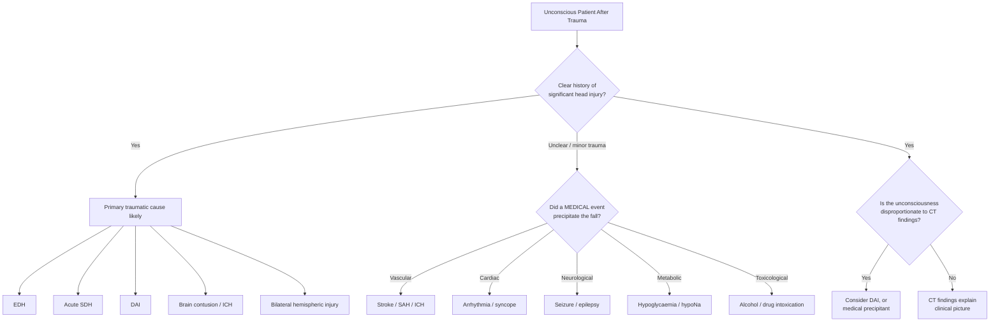
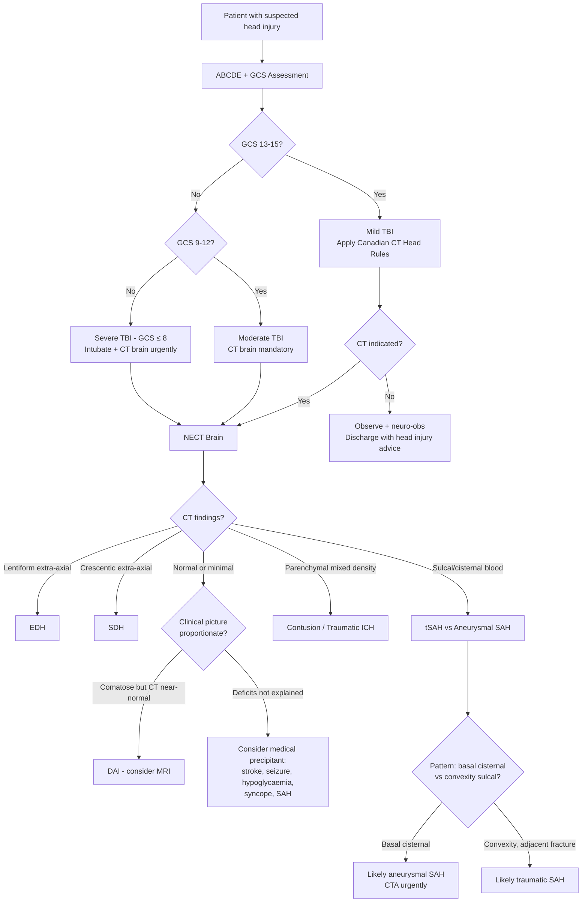

## Differential Diagnosis of Head Injury

### Why Differential Diagnosis Matters in Head Injury

When a patient presents with altered consciousness, focal neurological deficits, or signs of raised ICP after apparent trauma, the knee-jerk reaction is to attribute everything to the trauma. But here's the critical clinical reasoning: **did the head injury cause the neurological picture, or did something else cause a fall/accident that then caused the head injury?** This distinction is life-saving.

As the lecture slides emphasize: ***"BEWARE spontaneous SAH then LOC, fall & head injury"*** — always ask ***"Headache before or after LOC?"*** [7]. A patient found unconscious with a head wound may have had a stroke → fell → hit their head. Treating only the head wound while missing the stroke (or hypoglycaemia, or seizure) is a catastrophic error.

The differential diagnosis of head injury operates on **two parallel tracks**:

1. **Differentiating the type of intracranial pathology** caused by the head injury (i.e., what specific traumatic lesion does this patient have?)
2. **Differentiating traumatic from non-traumatic causes** of the clinical presentation (i.e., is this really just a head injury, or is there an underlying medical cause?)

---

### Track 1: Differential Diagnosis of Intracranial Pathology After Head Injury

Once a patient has a confirmed head injury, you need to determine **which specific pathology** is present, because each has different management urgency and surgical implications.

#### Systematic Approach by Anatomical Layer (Outside → Inside)

| Layer | Pathology | Key Differentiating Features |
|---|---|---|
| **Scalp** | Laceration, haematoma | External inspection; ***scalp haematoma alerts to underlying skull fracture — NEVER aspirate*** [2] |
| **Skull** | Linear fracture, depressed fracture, skull base fracture | CT bone windows; signs of base fracture (raccoon eyes, Battle sign, CSF leak) |
| **Epidural** | ***Epidural haematoma (EDH)*** | ***Lentiform on CT, doesn't cross sutures, lucid interval, associated skull fracture (90%)*** [2][5] |
| **Subdural** | ***Subdural haematoma (SDH)*** | ***Crescentic on CT, crosses sutures, doesn't cross midline; acute/subacute/chronic*** [5] |
| **Subarachnoid** | ***Traumatic SAH (tSAH)*** | ***Hyperdensity in sulci/cisterns; localized, adjacent fracture/contusion suggest traumatic origin*** [2] |
| **Intra-axial** | ***Brain contusion*** | ***"Salt-and-pepper" on CT; coup/contrecoup distribution; frontal/temporal poles*** [2] |
| **Intra-axial** | Traumatic intracerebral haemorrhage | Large confluent haematoma; can evolve from contusion |
| **Diffuse** | ***Diffuse axonal injury (DAI)*** | ***CT often normal or shows petechial haemorrhages at corpus callosum/dorsolateral brainstem; clinico-radiological dissociation; MRI much more sensitive*** [2] |
| **Diffuse** | Concussion | GCS 13–15; normal CT; transient symptoms |
| **Secondary** | Brain oedema, herniation | Develops hours–days after injury; diffuse swelling on CT; ***repeat CT if clinical deterioration*** [1] |

#### Distinguishing EDH vs. SDH vs. tSAH vs. Contusion vs. DAI

This is the **core clinical differential** in head injury — you see an abnormal CT, you need to know what you're looking at:

| Feature | ***EDH*** | ***Acute SDH*** | ***tSAH*** | ***Contusion*** | ***DAI*** |
|---|---|---|---|---|---|
| **Source** | ***Middle meningeal artery (85%)*** [2][6] | ***Bridging veins*** [5][6] | Small pial vessels [2] | Parenchymal microvasculature | Axonal shearing |
| **CT shape** | ***Lentiform*** [5] | ***Crescentic*** [5] | Hyperdensity in sulci/cisterns [3] | "Salt-and-pepper" mixed density [2] | Often ***normal*** or small dots [2] |
| **Suture/midline** | ***Does not cross sutures; can cross midline*** [5] | ***Crosses sutures; does not cross midline*** [5] | Fills sulci/cisterns | Parenchymal | Parenchymal |
| **Skull fracture** | ***90%*** [5] | ***Usually no*** [5] | Variable | Variable | Variable |
| **Classical presentation** | ***Lucid interval → rapid deterioration*** [2][4] | Varies by chronicity; uncal herniation [4] | Part of polytrauma; may cause hydrocephalus [3] | Focal deficits; ***may enlarge over days*** [2] | ***Profound coma but without elevated ICP; clinico-radiological dissociation*** [2] |
| **Prognosis** | ***Good if timely evacuation*** [4] | ***Poor for acute (associated parenchymal injury)***; good for chronic [2] | Good if isolated and mild TBI [2] | Must observe — can evolve [2] | ***Poor functional recovery*** [2] |

<Callout title="The Crucial CT Pattern Recognition">
Lentiform = EDH. Crescentic = SDH. Sulcal/cisternal hyperdensity = SAH. Salt-and-pepper parenchymal = contusion. Normal CT but comatose = think DAI. These are the bread-and-butter patterns you must recognize instantly.
</Callout>

---

### Track 2: Non-Traumatic Causes Mimicking or Precipitating Head Injury

This is where clinical thinking separates good doctors from dangerous ones. The question is always: ***"Is there a medical cause that precipitated the fall/accident and is being masked by the head injury?"***

#### Organized by System (Surgical Sieve Approach)

| Category | Condition | Why It Mimics/Complicates Head Injury | How to Differentiate |
|---|---|---|---|
| **Vascular** | ***Spontaneous SAH (aneurysmal)*** | ***SAH → LOC → fall → head injury. The head wound is secondary!*** [7] | ***"Headache before or after LOC?"***; thunderclap headache; CT pattern — basal cisternal > convexity; CTA for aneurysm [7] |
| **Vascular** | ***Acute ischaemic stroke*** | Stroke → hemiparesis → fall → head wound | Focal deficits not explained by trauma location; CT may show early ischaemic changes; NIHSS |
| **Vascular** | ***Intracerebral haemorrhage (hypertensive)*** | ICH → LOC → fall | Deep location (basal ganglia, thalamus, pons, cerebellum) typical of hypertensive ICH [11]; history of hypertension |
| **Vascular** | Subdural haematoma (non-traumatic) | SDH from cerebral atrophy, coagulopathy, or low CSF pressure can present without clear trauma history [2] | Chronic SDH in elderly with trivial/no trauma; check medications (anticoagulants) |
| **Cardiac** | ***Syncope (vasovagal, cardiac arrhythmia, structural)*** | LOC → fall → head strike | Prodromal symptoms (light-headedness, palpitations); ECG; Holter; echocardiography |
| **Cardiac** | ***Aortic stenosis / HOCM*** | Exertional syncope → fall | Ejection systolic murmur; echocardiography |
| **Neurological** | ***Seizure / epilepsy*** | Seizure → fall → head injury; tongue bite, incontinence | ***"A known epileptic will 'wake up later'"*** — this is a ***potential pitfall*** [1]; postictal state; witnessed tonic-clonic activity; tongue laceration |
| **Neurological** | ***Todd's paralysis (postictal paresis)*** | Transient focal weakness after seizure mimics stroke or traumatic focal deficit [6] | Resolves within 24–72h; history of seizure |
| **Metabolic** | ***Hypoglycaemia*** | Confusion/LOC → fall | ***Check capillary blood glucose immediately***; responds to IV dextrose [6] |
| **Metabolic** | Hepatic encephalopathy | Confusion → fall → head wound | History of liver disease; asterixis; elevated ammonia |
| **Metabolic** | Hyponatraemia | Confusion/seizures → fall | Check serum Na; head injury itself can cause ***SIADH or CSWS*** [8] — creating a diagnostic chicken-and-egg problem |
| **Toxicological** | ***Alcohol intoxication*** | ***"An unconscious patient is 'just drunk'"*** — ***potential pitfall*** [1]; alcohol → fall AND alcohol masks deterioration | ***Never assume altered consciousness is "just alcohol" — always get a CT if indicated***; alcohol level does not exclude concurrent TBI |
| **Toxicological** | Drug overdose / intoxication | Sedation → fall; also drugs may cause intracerebral pathology (e.g. cocaine → ICH) | Toxicology screen; pupil size pattern (opioids = pinpoint, sympathomimetics = dilated) |
| **Infectious** | ***Meningitis / encephalitis*** | Fever + confusion + neck stiffness can overlap with post-traumatic meningitis from skull base fracture | CSF analysis; if skull base fracture present, meningitis may be a **complication** rather than cause |
| **Neoplastic** | Brain tumour | Tumour → seizure → fall → head injury; OR tumour haemorrhage mimics traumatic ICH | CT shows mass with surrounding oedema, enhancement; history of progressive symptoms |
| **Neoplastic** | Dural metastasis / meningioma | Can cause SDH-like picture without trauma [6] | Contrast-enhanced imaging |
| **Degenerative** | Normal pressure hydrocephalus | Gait disturbance → falls → head injury | Classic triad: gait apraxia, urinary incontinence, dementia; dilated ventricles on CT |

<Callout title="Never Assume — The Pitfalls" type="error">
The lecture slides explicitly warn [1]:
- ***"An unconscious patient is 'just drunk'"*** — WRONG. Always exclude TBI.
- ***"A known epileptic will 'wake up later'"*** — WRONG. May have a traumatic ICH.
- ***"First CT was normal so the patient is OK"*** — WRONG. Late deterioration occurs.
- ***"A drop in GCS 'may be nothing & let's wait'"*** — WRONG. This mandates urgent repeat imaging.

These are the traps that kill patients. Never assume, always investigate.
</Callout>

---

### Differential Diagnosis of Specific Clinical Presentations After Head Injury

#### A. Differential of "Unconscious After Trauma"

#### B. Differential of "Lucid Interval Then Deterioration"

| Diagnosis | Mechanism | Timing |
|---|---|---|
| ***EDH*** (classic) | Arterial haematoma expansion | Minutes to hours [2] |
| Acute SDH | Venous haematoma expansion | Hours to days |
| Contusion expansion | Haemorrhagic progression + surrounding oedema | ***Days — often not worst until day 4–5*** [2] |
| Post-traumatic brain swelling | Vasogenic + cytotoxic oedema | Hours to days [2] |
| Delayed traumatic ICH | Coagulopathy-related; especially in patients on anticoagulants | Hours to days |
| ***Aneurysmal SAH misdiagnosed as trauma*** | Sentinel headache → re-bleed | Variable [7] |
| Post-traumatic hydrocephalus | Obstructive or communicating hydrocephalus from blood products | Days to weeks |

<Callout title="Lucid Interval ≠ Only EDH" type="idea">
While the lucid interval is classically associated with EDH, any expanding intracranial lesion can produce a similar pattern. The key principle: ***initially normal/mild CT findings do not preclude subsequent development of life-threatening mass lesions — repeat CT if clinically indicated*** [1].
</Callout>

#### C. Differential of "Focal Deficit After Head Injury"

| Cause | Mechanism | Key Clue |
|---|---|---|
| Traumatic contusion / ICH | Direct parenchymal injury | Deficit matches CT lesion location |
| SDH / EDH with mass effect | Compression of motor cortex or corticospinal tract | Deficit + extra-axial collection on CT |
| ***Kernohan's notch (falsely localizing)*** | ***Uncal herniation pushes contralateral cerebral peduncle against tentorium → ipsilateral weakness*** [2] | ***Weakness on same side as lesion — the opposite of what you expect*** |
| Pre-existing stroke | Unrelated to current trauma | Old infarct territory on CT; history |
| ***Todd's paralysis*** | Postictal deficit after seizure precipitating fall | Resolves within hours-days [6] |
| Traumatic vascular injury | ICA dissection / vertebral dissection → ischaemic stroke | ***CTA indicated for skull base fractures involving foramen lacerum or vertebral foramen*** [4] |

#### D. Differential of "CSF Leak After Head Injury"

| Source | Fracture Site | Clinical Leak | Differentiating Test |
|---|---|---|---|
| ***CSF rhinorrhoea*** | ***Anterior skull base (cribriform plate)*** [1] | Clear fluid from nose | ***Beta-2 transferrin*** (specific for CSF); ***halo test*** (blood drop on gauze — CSF forms a clear ring around blood) [4] |
| ***CSF otorrhoea*** | ***Middle skull base (petrous temporal bone)*** [1][2] | Clear fluid from ear | Same biochemical tests |
| Mucoid rhinorrhoea | No fracture; allergic/infective | Nasal discharge | Negative beta-2 transferrin |
| Epistaxis | Nasal mucosal injury | Blood from nose | No CSF component |

---

### Differential of Raised ICP in a Head Injury Patient

Not all raised ICP after head injury is from the traumatic lesion itself. Consider:

| Cause | Mechanism | Notes |
|---|---|---|
| Expanding haematoma (EDH, SDH, ICH) | Mass effect → ↑ICP | Most acute surgical cause |
| Brain oedema | Vasogenic + cytotoxic oedema [2] | Peaks at 48–72 hours post-injury |
| Post-traumatic hydrocephalus | Blood in ventricles/subarachnoid space → impaired CSF drainage [3] | ***tSAH ± IVH → obstructive hydrocephalus*** [3] |
| Venous sinus thrombosis | Traumatic thrombosis of dural venous sinuses → impaired venous drainage → ↑ICP | Consider if fracture crosses sinus groove |
| ***Hyperaemia*** | ***Impaired autoregulation → reactive hyperaemia*** [1][2] | Especially in younger patients |
| ***Venous congestion*** | Raised intrathoracic pressure (e.g. pneumothorax, haemothorax from polytrauma) → impaired venous return from brain [1] | Always check chest in polytrauma |
| ***Pre-existing lesion*** | ***Brain tumour, hydrocephalus*** [12] | CT may show incidental mass |

The ***common causes of raised ICP*** as listed in the lecture [12]:
- ***Space-occupying mass lesion (e.g. haematoma, tumour, abscess)***
- ***Hydrocephalus — communicating/non-communicating***
- ***Brain swelling — focal/diffuse***
- ***Hyperaemia***
- ***Venous congestion***

---

### Special Populations Requiring Modified Differential Thinking

| Population | Special Considerations |
|---|---|
| **Elderly** | Chronic SDH from trivial trauma (brain atrophy stretches bridging veins); always check anticoagulant use; high falls risk from polypharmacy, orthostatic hypotension; always consider stroke/syncope as precipitant |
| **Children** | ***Non-accidental injury (NAI) — be mindful of this in any SDH in a child*** [2]; birth trauma; growing skull fractures (leptomeningeal cysts) |
| **Anticoagulated patients** | Low-threshold for CT; ***high risk for delayed haematoma expansion*** [4]; even minor trauma can cause significant ICH; ***must reverse anticoagulation*** |
| **Alcoholics** | Cerebral atrophy → increased SDH risk; coagulopathy from liver disease; intoxication masks neurological assessment; ***never assume altered consciousness is "just alcohol"*** [1] |
| **Athletes** | Concussion; ***second-impact syndrome*** — brain in hypermetabolic state for up to 1 week, more susceptible to injury [6]; return-to-play protocols |

---

### Approach to the Differential — Clinical Decision Flowchart

---

> **Key Differential Diagnosis Principle**: In any patient presenting with altered consciousness or neurological deficit in the context of trauma, always ask: **(1)** What traumatic pathology is present? **(2)** Is there a medical cause that precipitated the event? **(3)** Are there injuries outside the head contributing to the neurological picture (hypotension, hypoxia from chest injury, C-spine injury)?

<Callout title="High Yield Summary — Differential Diagnosis of Head Injury">

**Two tracks of differential thinking**:
1. **What type of traumatic intracranial lesion?** → EDH (lentiform, arterial, lucid interval), SDH (crescentic, venous, elderly/atrophy), tSAH (sulcal blood), contusion (salt-and-pepper, frontal/temporal), DAI (normal CT but comatose)
2. **Did a medical event cause the fall?** → Stroke, aneurysmal SAH, seizure, syncope, hypoglycaemia, alcohol/drugs. **Always ask: "Headache before or after LOC?"**

**Critical pitfalls** (from lecture):
- Never assume unconscious = "just drunk"
- Never assume a known epileptic will "wake up later"
- Never assume a normal first CT means the patient is safe — repeat if deterioration
- Never assume a GCS drop is nothing — act immediately

**Special populations**: Elderly (chronic SDH, medical precipitants), children (NAI), anticoagulated patients (delayed expansion), alcoholics (atrophy + coagulopathy + masking)

**Raised ICP differential**: Not just haematoma — consider oedema, hydrocephalus, hyperaemia, venous congestion, pre-existing lesion

</Callout>

---

<ActiveRecallQuiz
  title="Active Recall - Differential Diagnosis of Head Injury"
  items={[
    {
      question: "A patient is found unconscious with a scalp laceration. CT brain shows SAH concentrated in the basal cisterns. What critical question must you ask, and why?",
      markscheme: "Ask whether headache occurred before or after LOC. Basal cisternal SAH pattern suggests aneurysmal (spontaneous) SAH rather than traumatic SAH (which tends to be convexity/sulcal and adjacent to fractures). The patient may have had SAH leading to LOC and fall, not the other way around. CTA is urgently needed to look for aneurysm."
    },
    {
      question: "List three potential pitfalls when assessing an unconscious patient after trauma, as highlighted in the lecture slides.",
      markscheme: "1. Assuming an unconscious patient is just drunk. 2. Assuming a known epileptic will wake up later. 3. Assuming a normal first CT means the patient is OK (late deterioration can occur). Also: assuming a GCS drop may be nothing and waiting, or sedating an uncooperative patient without airway protection."
    },
    {
      question: "A 75-year-old on warfarin presents with confusion 3 weeks after a fall. CT shows a crescent-shaped hypodense extra-axial collection crossing suture lines but not the midline. What is the diagnosis and why is this population particularly at risk?",
      markscheme: "Chronic subdural haematoma (SDH). Elderly at risk because: (1) cerebral atrophy stretches bridging veins, making them vulnerable even to trivial trauma; (2) anticoagulation (warfarin) impairs haemostasis; (3) chronic alcohol use may compound both atrophy and coagulopathy. Hypodense because blood products degrade over more than 3 weeks to CSF-like density."
    },
    {
      question: "Explain why diffuse axonal injury (DAI) presents with clinico-radiological dissociation and name the imaging modality of choice.",
      markscheme: "DAI involves shearing of axons at grey-white matter junctions from rotational forces. The axonal damage is microscopic and diffuse, so CT appears normal or shows only tiny petechial haemorrhages at corpus callosum and dorsolateral brainstem, which is disproportionate to the profound coma seen clinically. MRI with susceptibility-weighted imaging (SWI) is the modality of choice as it is much more sensitive to small haemorrhagic foci."
    },
    {
      question: "What are the five common causes of raised ICP mentioned in the lecture, and which one is specific to the post-traumatic setting in young patients?",
      markscheme: "1. Space-occupying mass lesion (haematoma, tumour, abscess). 2. Hydrocephalus (communicating/non-communicating). 3. Brain swelling (focal/diffuse). 4. Hyperaemia. 5. Venous congestion. Hyperaemia due to impaired autoregulation is particularly relevant in post-traumatic setting in younger patients."
    }
  ]}
/>

## References

[1] Lecture slides: GC 208. Unconscious after an accident Head injury.pdf
[2] Senior notes: Ryan Ho Neurology.pdf (Ch 11 — Head Injury and Related Conditions, pp. 197–205)
[3] Senior notes: Ryan Ho Radiology.pdf (pp. 10, 20)
[4] Senior notes: maxim.md (Head Injury section)
[5] Senior notes: Ryan Ho Diagnostic Radiology.pdf (p. 42)
[6] Senior notes: felixlai.md (Head Injury section)
[7] Lecture slides: GC 109. Headache and loss of consciousness Acute stroke, subarachnoid haemorrhage and vascular malformation.pdf
[8] Senior notes: Ryan Ho Chemical Path.pdf (p. 10 — CSWS)
[11] Senior notes: Ryan Ho Neurology.pdf (Ch 3.2 — Cerebrovascular Diseases, p. 74)
[12] Lecture slides: GC 111. Raised intracranial pressure and hydrocephalus.pdf
