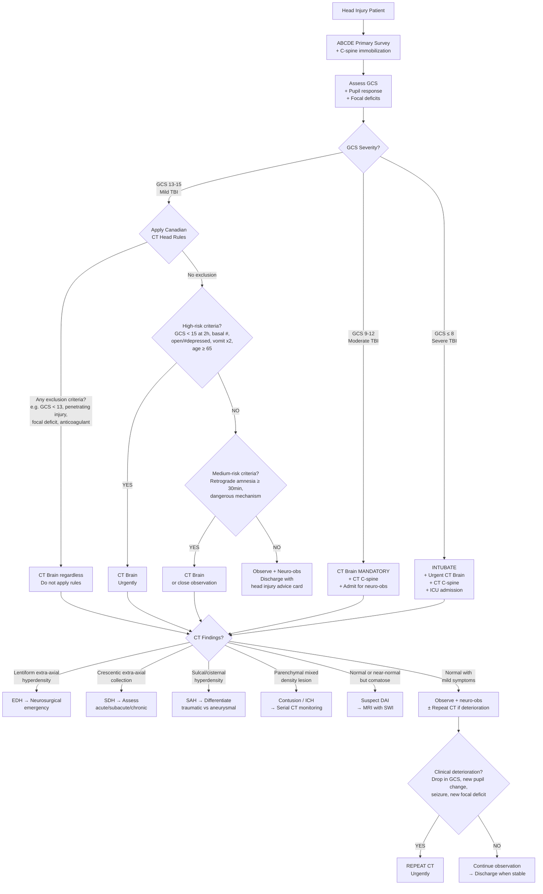

## Diagnostic Criteria, Algorithm, and Investigations for Head Injury

### Conceptual Framework: Why Diagnosis in Head Injury is Different

Head injury is not diagnosed the way you diagnose, say, rheumatoid arthritis — there is no "diagnostic criteria" checklist like the ACR/EULAR criteria. Instead, the diagnostic process in head injury is about:

1. **Classifying severity** (GCS-based) to triage the patient
2. **Deciding who needs imaging** (clinical decision rules — this is where "criteria" live)
3. **Identifying the specific intracranial pathology** on imaging (pattern recognition on CT/MRI)
4. **Monitoring for secondary deterioration** (serial neuro-observations, repeat imaging)

The entire diagnostic approach is driven by a simple principle: ***ABCDE before any neurosurgical evaluation*** [1][2], then systematic clinical assessment, then targeted imaging. Let's build this step by step.

---

## 1. Severity Classification — The GCS as the Diagnostic Backbone

The ***Glasgow Coma Scale (GCS)*** is not just a monitoring tool — it is the primary **diagnostic stratifier** in head injury [2][4]:

| Severity | GCS | Post-Traumatic Amnesia | Clinical Implication |
|---|---|---|---|
| ***Mild TBI*** | ***13–15*** | < 24 hours | Apply clinical decision rules for CT; many can be observed |
| ***Moderate TBI*** | ***9–12*** | 1–6 days | ***CT brain mandatory***; admit for observation |
| ***Severe TBI*** | ***≤ 8*** | ≥ 7 days | ***Intubation required*** (cannot protect airway); CT brain urgently; likely ICU [6] |

> **Why GCS ≤ 8 = intubate?** A patient with GCS ≤ 8 has lost sufficient consciousness to maintain airway reflexes — the gag reflex, cough reflex, and swallowing coordination are impaired. Without intubation, aspiration pneumonia and hypoxia will compound the brain injury as a **secondary insult**.

<Callout title="GCS Pitfalls — From the Lecture Slides" type="error">
The lecture explicitly warns about ***pitfalls in GCS assessment*** [12]:
- ***E — swollen/no eye post-trauma***: cannot assess eye opening → record as "NT" (not testable), do not assume E1
- ***M — spinal cord injury, limb injury, muscle relaxant***: motor response unreliable if limbs are injured or paralyzed
- ***V — language barrier, intubation/tracheostomy***: record as VT (verbal with tube), not V1
- ***Total score can mean many things***: E3V4M6 = 13 is very different from E4V5M4 = 13. Always report **component scores**
- ***Effect of shock — use post-resuscitation GCS*** [12]: a hypotensive patient will have depressed GCS from poor cerebral perfusion, not brain injury. Resuscitate first, then reassess
- ***Effect of sedative drugs***: if sedated for mechanical ventilation, GCS is unreliable
</Callout>

---

## 2. Clinical Decision Rules for CT Imaging

The critical clinical question in **mild TBI (GCS 13–15)** is: **does this patient need a CT scan?** Not every mild head injury needs imaging — but missing a surgically significant lesion is catastrophic. This is where validated clinical decision rules come in.

### 2.1 Canadian CT Head Rules (CCHR)

This is the most widely used and validated decision rule [2][6]:

**Inclusion criteria** (i.e., when to apply the rule): patients with ***minor head injury*** defined as [6]:
- ***GCS 13–15*** after injury
- ***With any one of***: witnessed LOC, amnesia, or confusion/disorientation

**Exclusion criteria** (do NOT use CCHR — just get a CT) [6]:
- ***ED GCS < 13***
- ***Obvious penetrating skull injury or depressed skull fracture***
- ***Unstable vital signs associated with major trauma***
- ***Focal neurological deficit***
- ***Seizure prior to ED assessment***
- ***Bleeding disorders or use of oral anticoagulants***

> **Why these exclusions?** These patients have such a high pre-test probability of significant intracranial pathology that applying a decision rule is pointless — they need CT regardless. A patient on anticoagulants with a head injury can develop a delayed haematoma even from minor trauma.

**High-risk criteria (for neurosurgical intervention)** — if ANY present → ***CT is recommended*** [2][6]:
1. ***GCS < 15 at 2 hours after injury***
2. ***Suspected open or depressed skull fracture***
3. ***Any sign of basal skull fracture*** (raccoon eyes, Battle sign, CSF otorrhoea/rhinorrhoea, haemotympanum)
4. ***Vomiting ≥ 2 episodes***
5. ***Age ≥ 65 years***

**Medium-risk criteria (for brain injury on CT)** — if present → ***CT may be considered*** [2][6]:
1. ***Retrograde amnesia ≥ 30 minutes before impact***
2. ***Dangerous mechanism***:
   - Pedestrian struck by motor vehicle
   - Occupant ejected from motor vehicle
   - Fall from height > 3 feet or > 5 stairs

> **Logic of high vs. medium risk**: The high-risk criteria identify patients who may need **neurosurgical intervention** (craniotomy, etc.) — these MUST get a CT. The medium-risk criteria identify patients with a significant chance of having a lesion on CT that may not need surgery but needs monitoring.

### 2.2 New Orleans Criteria (NOC) [6]

An alternative rule — CT is indicated in patients with **GCS 15/15** (i.e., fully conscious) if **any** of these 7 criteria are present:
1. ***Headache***
2. ***Vomiting***
3. ***Age > 60 years***
4. ***Drug or alcohol intoxication***
5. ***Persistent antegrade amnesia***
6. ***Seizure***
7. ***Visible trauma above the clavicle***

> **CCHR vs. NOC**: CCHR is more specific (fewer unnecessary scans) while NOC is more sensitive (catches more pathology but leads to more CTs). In practice, **CCHR is preferred** because it stratifies risk and reduces unnecessary imaging.

### 2.3 Beyond the Rules — Other Indications for CT Brain [3][13]

Even outside formal decision rules, CT brain is indicated for [3][13]:
- ***Low GCS*** (any moderate or severe TBI)
- ***Post-traumatic seizure***
- ***Focal neurological deficit***
- ***Retrograde amnesia***
- ***Suspected open, depressed, or basal skull fracture***
- ***High-energy trauma***
- ***Clotting disorder or on anticoagulation***
- ***Infants with large bruising, swelling, or laceration; suspected non-accidental injury (NAI); tense fontanelle*** [13]

<Callout title="Age Thresholds for CT" type="idea">
***↑ threshold in babies*** (more cautious about radiation, but tense fontanelle/NAI = CT), ***↓ threshold for elderly or high-risk patients*** (on anticoagulants, alcohol, atrophy — even trivial trauma can cause significant pathology) [2].
</Callout>

---

## 3. The Diagnostic Algorithm

### 3.1 Master Diagnostic Flowchart

### 3.2 The Principle of Repeat Imaging

***Initially normal/mild CT findings do not preclude the possibility of subsequent development of life-threatening mass lesion*** [1].

***Repeat CT if clinically indicated*** [1]:
- ***Drop in GCS***
- ***Pupil dilation (new or worsening)***
- ***Seizure***
- ***New focal deficit***

> **Why do lesions evolve?** Several mechanisms: (1) Contusions accumulate more blood over 24–72 hours through continued microvascular oozing + surrounding oedema. (2) Coagulopathy (traumatic or drug-induced) allows ongoing bleeding. (3) Brain swelling develops over hours to days. The lecture emphasizes that ***contusions are NOT the worst until at least Day 4–5*** [1] — this is why serial monitoring is essential.

---

## 4. Investigation Modalities — Detailed Breakdown

### 4.1 Non-Enhanced CT Brain (NECT)

***NECT brain is the single most important investigation in head injury*** [2].

**Why NECT first?**
- **Fast** (< 5 minutes acquisition time) — critical when seconds count
- **Widely available** — every ED has CT
- **Excellent sensitivity for acute blood** — fresh blood is hyperdense (40–70 HU) on CT due to the high protein content of haemoglobin
- **Detects skull fractures** — bone windows
- **Detects mass effect** — midline shift, effacement of basal cisterns, herniation
- **No contrast needed** — avoiding contrast saves time and avoids renal/allergic risks

**Limitations of NECT** [6][13]:
- ***Misses ~10–20% of abnormalities seen on MRI*** [6]
- ***Lower sensitivity*** for posterior fossa lesions (bone artefact), small contusions, DAI
- ***Subacute SDH (1–3 weeks) is isodense*** — can be very difficult to see [5]
- ***Cannot detect early ischaemic changes well*** — sensitivity < 50% in first day [14]
- ***Inappropriate as sole investigation for DAI*** — CT can be entirely normal

#### Key CT Findings — Systematic Interpretation Guide

| Pathology | CT Appearance | Key Distinguishing Features | Why It Looks That Way |
|---|---|---|---|
| ***Epidural haematoma*** | ***Biconvex/lentiform hyperdensity*** [3][5] | ***Does not cross sutures; can cross midline*** [5] | Arterial blood under pressure strips endosteum from skull in a lens shape; endosteum fixed at sutures |
| ***Acute SDH*** | ***Crescentic hyperdensity*** [5] | ***Crosses sutures; does not cross midline*** [5] | Venous blood spreads freely in subdural space (no suture attachment) but falx blocks midline crossing |
| ***Subacute SDH*** | ***Isodense*** [5] | ***Difficult to visualize*** → ***do CT ASAP or contrast CT*** [5] | Haemoglobin degradation over 1–3 weeks → density approaches brain tissue density |
| ***Chronic SDH*** | ***Hypodense*** (~CSF density) [5] | Crescent shape, often bilateral; brain atrophy | Blood products fully degraded; fluid resembles CSF density |
| ***Traumatic SAH*** | ***Hyperdensity in sulci, cisterns, Sylvian fissure*** [3] | ***Localized, adjacent to fracture/contusion*** [2]; cf. aneurysmal SAH in basal cisterns | Blood fills subarachnoid space; gravity-dependent in cisterns |
| ***Brain contusion*** | ***"Salt-and-pepper" appearance*** — mixed hyper/hypodensity [2] | ***Frontal/temporal poles***; coup/contrecoup [1] | Mix of petechial haemorrhage (hyperdense) and oedema (hypodense) in bruised parenchyma |
| ***Traumatic ICH*** | Large confluent hyperdensity within parenchyma | May evolve from contusion; mass effect | Coalescence of haemorrhagic contusion or direct vessel rupture |
| ***DAI*** | ***CT often normal*** ± ***small haemorrhagic foci at corpus callosum and cerebral peduncle*** [2] | ***Clinico-radiological dissociation*** [2] — comatose patient, near-normal CT | Axonal shearing is microscopic; only haemorrhagic components (minority of DAI lesions) visible on CT |
| ***Skull fracture*** | Linear lucency ± displaced fragment on bone window | D/dx: vessel grooves, sutures [2] | Discontinuity in cortical bone |
| ***Depressed fracture*** | Inwardly displaced bone fragment | Must assess for underlying dural tear, brain injury | Focal impact drives bone inward |
| ***Pneumocephalus*** | Intracranial air (very hypodense, < −1000 HU) | Suggests open fracture or skull base fracture communicating with sinuses | Air enters through breach in skull/dura |
| ***Cerebral oedema*** | Diffuse loss of grey-white differentiation, effaced sulci, compressed ventricles | Bilateral; developing hours–days after injury | Water accumulation (vasogenic + cytotoxic) reduces density contrast between grey and white matter |
| ***Midline shift*** | Septum pellucidum displaced from midline | > 5 mm is concerning for herniation | Unilateral mass effect pushes midline structures contralaterally |
| ***Effaced basal cisterns*** | Loss of normal CSF spaces around brainstem | Ominous sign of impending herniation | ↑ICP compresses CSF spaces → brain pushed downward |

#### CT Density of Blood Over Time

This is critical for interpreting the age of a haematoma [4][5]:

| Time | CT Density | MRI T1 | MRI T2 |
|---|---|---|---|
| ***Acute (< 72h)*** | ***Hyperdense*** | Grey | Black |
| ***Subacute (1–3 weeks)*** | ***Isodense*** | White | White |
| ***Chronic (> 3 weeks)*** | ***Hypodense*** | Black | Black |

> **Why does blood change density on CT?** Fresh blood contains intact haemoglobin molecules with high protein concentration → high X-ray attenuation (hyperdense). As haemoglobin degrades (oxyHb → deoxyHb → metHb → haemosiderin), the protein concentration decreases and water content increases → density decreases through isodense (matching brain) to hypodense (matching CSF).

> **MRI mnemonics** [4]: T1 = ***"George Washington Bridge"*** (Grey-White-Black over time); T2 = ***"Oreo"*** (Black-White-Black)

#### CT Windowing [14]

When interpreting CT for head injury, you must look at **multiple windows**:
- ***Brain window*** (level ~40 HU, width ~80 HU): parenchymal lesions, haematomas, oedema
- ***Bone window*** (level ~400 HU, width ~2000 HU): skull fractures, pneumocephalus
- ***Subdural window*** (narrow window): helps detect isodense subacute SDH

> **Why windowing?** The human eye can only distinguish ~11 shades of grey, but CT attenuation ranges from −1000 to +1000 HU (2000 values). Windowing selects which range of HU values are displayed, optimizing contrast for specific tissues [14].

### 4.2 CT Cervical Spine

***All significant head injuries should have CT cervical spine*** — ***always assume C-spine injury until cleared*** [4].

Why? Because:
- High-energy mechanisms that cause head injury also cause cervical spine injury
- A cervical spine fracture with cord injury can mimic or compound neurological deficits from the head injury
- Failing to immobilize an unstable C-spine can convert a stable injury into paraplegia/quadriplegia

### 4.3 CT Angiography (CTA)

**CTA Circle of Willis** [4]:
- ***Indicated for skull base fractures involving foramen lacerum*** — risk of traumatic ICA injury (dissection, pseudoaneurysm)
- Also indicated when SAH pattern suggests aneurysmal rather than traumatic origin

**CTA Vertebral arteries** [4]:
- ***Indicated for C-spine injury involving vertebral foramen*** — risk of vertebral artery dissection

**CTA generally** [14]:
- Uses rapid injection of IV contrast bolus → opacifies vessels → reconstructed 3D images
- Can identify: vessel occlusion, dissection, pseudoaneurysm, active extravasation
- ***Can be used in place of more invasive conventional angiography*** [14]

### 4.4 MRI Brain

***MRI is inappropriate as first-line study for head trauma*** [13] — too slow (20+ minutes), not widely available in emergency settings, and motion artefact from uncooperative/confused patients is a major problem.

However, MRI is **superior to CT** for specific indications [6][13]:

| Indication | Why MRI is Better |
|---|---|
| ***Diffuse axonal injury (DAI)*** | ***SWI (susceptibility-weighted imaging) detects microhaemorrhages invisible on CT*** [2][13] |
| ***Brainstem contusion*** | ***Better soft tissue resolution in posterior fossa*** (no bone artefact) [13] |
| ***Subacute/chronic pathology*** | ***Greater sensitivity in subacute and chronic settings*** [6] |
| ***Basal ganglia / thalamic lesions*** | ***Better at imaging deep grey matter structures*** [6] |
| ***Spinal cord injury*** | ***Spinal epidural haematoma, cord contusions, ligamentous injury*** [4] |
| ***Hypoxic-ischaemic encephalopathy*** | Detects DWI changes early [13] |

> **When to get MRI?** Generally ***48–72 hours after injury*** when the acute situation is stabilized [6]. It serves as a **problem-solving tool** rather than a first-line investigation.

#### MRI vs CT — Summary Comparison [6][14][15]

| Feature | CT | MRI |
|---|---|---|
| **Radiation** | Yes | No |
| **Exam time** | ~1 minute | ~20 minutes |
| **Availability** | Good | Fair |
| ***Sensitivity for acute haemorrhage*** | ***Good*** | ***Good*** (SWI/GRE) |
| ***Sensitivity for infarct*** | ***Poor*** (< 50% day 1) | ***Good*** (DWI: minutes) |
| ***Sensitivity for DAI*** | ***Poor*** | ***Excellent*** |
| **Sensitivity for skull fracture** | Good (bone window) | Poor |
| **Use in acute trauma** | First line | Problem-solving only |

### 4.5 Skull X-Ray (SXR)

***SXR has very limited use in head injury*** [13]:
- Can detect skull fractures but ***normal SXR cannot exclude intracranial pathologies*** (e.g. haemorrhage)
- ***Main current use: excluding metallic foreign bodies before MRI*** [13]
- Largely replaced by CT, which detects fractures AND intracranial lesions simultaneously
- ***Do NOT rely on a normal SXR to clear a head injury patient***

### 4.6 Laboratory Investigations

While imaging is the cornerstone, blood tests are essential for identifying systemic contributors to secondary brain injury and guiding management:

| Investigation | Rationale | Key Findings |
|---|---|---|
| **Full blood count (FBC)** | Haemoglobin (anaemia worsens cerebral ischaemia), platelets (thrombocytopaenia → ongoing bleeding risk) | Low Hb = needs transfusion; low platelets = bleeding risk |
| **Coagulation profile (PT/aPTT/INR)** | Detect coagulopathy (especially if on warfarin/DOACs); TBI itself can cause DIC | Prolonged PT/INR → needs reversal [10] |
| **Group & save / crossmatch** | In case of surgical intervention or significant blood loss (scalp lacerations can bleed profusely) | — |
| **Renal function (Cr, urea)** | Baseline before mannitol/contrast; electrolyte monitoring | — |
| ***Electrolytes (Na, K)*** | ***Post-TBI hyponatraemia: SIADH vs CSWS*** [8] | ***SIADH: euvolaemic hypoNa with urine Na > 20, urine osm > 200; CSWS: hypovolaemic hypoNa*** [8] |
| **Blood glucose** | Hypoglycaemia as precipitant of LOC/fall; hyperglycaemia worsens TBI outcome | ***Always check capillary glucose in any unconscious patient*** |
| **Arterial blood gas (ABG)** | Ventilation status (PaCO2 critical for ICP management); acid-base; lactate | Hypoxia (PaO2 < 60) and hypotension are the two biggest secondary insults |
| **Blood alcohol level** | Common co-factor; masks assessment | Does NOT exclude concurrent TBI |
| **Toxicology screen** | Drug intoxication as precipitant or confounder | — |
| **Liver function tests** | If chronic alcoholism suspected (coagulopathy risk) | — |
| **Serum osmolality** | Baseline; monitoring during osmotherapy (mannitol/hypertonic saline) | — |

### 4.7 CSF Analysis (Beta-2 Transferrin / Halo Test)

When CSF rhinorrhoea or otorrhoea is suspected [4]:
- ***Beta-2 transferrin***: a protein **specific to CSF** (not found in blood, nasal secretions, or tears) — considered the gold standard for confirming CSF leak
- ***Halo test (ring sign)***: drop the fluid onto gauze — if it contains CSF mixed with blood, CSF migrates outward forming a **clear ring (halo)** around the central blood spot. Simple bedside test but less specific.
- ***Glucose testing***: CSF contains glucose (≈60% of serum); nasal secretions do not. Can be done with a glucometer at bedside — if positive, suggestive but not definitive.

### 4.8 ICP Monitoring [12]

***Indications for ICP monitoring*** [12]:
- ***No reliable GCS (e.g. sedation, muscle paralysis)***
- ***GCS ≤ 8 (requires intubation)***
- ***Evolving disease conditions***

***Relative contraindications*** [12]:
- ***Awake patients*** (clinical exam is more reliable)
- ***Bleeding tendency*** (procedure involves placing a catheter into the ventricle or brain parenchyma)

**Methods**:
- ***External Ventricular Drain (EVD)*** [12]: gold standard
  - ***Manometric principle for monitoring intracranial CSF pressure***
  - ***Therapeutic — can drain CSF for decompression***
  - ***Risks: infection, iatrogenic trauma***
- **Intraparenchymal probe** (e.g. Codman): measures pressure directly in brain tissue; cannot drain CSF
- ***LP is contraindicated if raised ICP*** (risk of tonsillar herniation — removing CSF from below a pressure gradient can cause the brain to herniate downward through the foramen magnum) [12]

### 4.9 Cerebral Perfusion Study (Nuclear Medicine) [14]

- ***Head injury may result in fatal cerebral oedema or haemorrhage → impede cerebral blood flow***
- ***↓Cerebral perfusion can be detected by cerebral perfusion study*** [14]
- Also used for ***confirmation of brain death***: ***"empty light bulb" sign*** — absence of perfusion to the brain [14]
- ***Causes of coma must be excluded before making diagnosis of brain death*** [14]:
  1. Primary hypothermia
  2. Hypoglycaemia
  3. Electrolytes or endocrine disturbance
  4. Muscle relaxant
  5. Barbiturate overdose
  6. Alcohol intoxication
  7. Sedative overdose

### 4.10 Other Imaging Considerations

- ***CXR***: in polytrauma — pneumothorax, haemothorax, rib fractures (contribute to hypoxia → secondary brain injury)
- **Pelvic XR / CT**: if major trauma with haemodynamic instability
- **Abdominal imaging**: if polytrauma suspected

---

## 5. The Marshall CT Classification of TBI

This classification system grades TBI severity based on CT findings and is used for **prognostication** and **research** [4]:

| Grade | CT Findings |
|---|---|
| ***I*** | ***Normal CT*** |
| ***II*** | ***Midline shift ≤ 5 mm, no high/mixed density lesion > 25 mL*** |
| ***III*** | ***Midline shift > 5 mm, no high/mixed density lesion > 25 mL*** (i.e. swelling without large focal lesion) |
| ***IV*** | ***Midline shift > 5 mm, high/mixed density lesion > 25 mL*** |
| **V (Evacuated)** | Any lesion surgically evacuated |
| **VI (Non-evacuated)** | High/mixed density lesion > 25 mL, not surgically evacuated |

> Higher Marshall grade correlates with worse prognosis. The CRASH prognostic model [4] incorporates CT findings including: ***petechial haemorrhages, obliteration of third ventricle or basal cisterns, subarachnoid bleeding, midline shift, and non-evacuated haematoma***.

---

## 6. Distinguishing Traumatic vs Aneurysmal SAH on CT

This is a critical diagnostic distinction [2][3][7]:

| Feature | ***Traumatic SAH*** | ***Aneurysmal SAH*** |
|---|---|---|
| **History** | Clear trauma history | Thunderclap headache; may have secondary fall |
| **CT pattern** | ***Localized bleeding in superficial sulci; adjacent skull fracture; cerebral contusion*** [2] | Diffuse blood concentrated in ***basal cisterns, suprasellar cistern, Sylvian fissure*** [3] |
| **Associated findings** | External injuries, fractures, contusions | Often no external injury; may have intraventricular extension |
| **Key question** | — | ***"Headache before or after LOC?"*** [7] |
| **Next step if suspicious** | Manage as TBI | ***CTA urgently to identify aneurysm*** |

<Callout title="The SAH Diagnostic Trap" type="error">
***A patient presents with head injury AND SAH on CT. Maybe SAH first then LOC then TBI. Maybe LOC/TBI first then traumatic SAH.*** [7]. The CT pattern and history are your guides. Basal cisternal blood = aneurysmal until proven otherwise. Get CTA.
</Callout>

---

## 7. Neuro-Observation Protocol

***Close neuro-observation*** is a diagnostic tool in itself — it detects secondary deterioration before it becomes irreversible [2]:

| Parameter | Frequency | What You're Looking For |
|---|---|---|
| **GCS** | Every 15–30 min initially, then hourly | ***Drop of ≥ 2 points = urgent reassessment + repeat CT*** |
| **Pupil size and reactivity** | Same frequency | New anisocoria or fixed/dilated pupil = impending herniation |
| **Limb power** | Same frequency | New weakness = expanding lesion or secondary ischaemia |
| **Vital signs** | Same frequency | ***Cushing reflex*** (↑BP, ↓HR, irregular RR) = critically raised ICP |
| **Consciousness level** | Continuous | Any new confusion, agitation, drowsiness |

---

<Callout title="High Yield Summary — Diagnosis and Investigations">

**Severity classification**: GCS 13–15 = mild, 9–12 = moderate, ≤ 8 = severe (intubate). Always report component scores.

**Canadian CT Head Rules** (for mild TBI, GCS 13–15): High-risk criteria (GCS < 15 at 2h, basal skull fracture signs, open/depressed fracture, vomiting ≥ 2, age ≥ 65) → CT mandatory. Medium-risk (amnesia ≥ 30 min, dangerous mechanism) → CT recommended. Do NOT apply rules if GCS < 13, penetrating injury, focal deficit, seizure, or on anticoagulants.

**NECT brain** = single most important investigation. Detects acute blood, fractures, mass effect. CT density of blood: acute = hyperdense, subacute = isodense (tricky!), chronic = hypodense.

**Key CT patterns**: EDH = lentiform, doesn't cross sutures. SDH = crescentic, crosses sutures, not midline. SAH = sulcal/cisternal blood. Contusion = salt-and-pepper. DAI = normal CT (→ MRI with SWI).

**MRI**: Not first-line. Use 48–72h later for DAI, brainstem contusion, posterior fossa, spinal cord.

**Repeat CT** if: drop in GCS, new pupil change, seizure, new focal deficit. Contusions are NOT worst until day 4–5.

**ICP monitoring**: EVD is gold standard; indicated when GCS ≤ 8 or unreliable clinical exam. LP contraindicated if raised ICP.

**Labs**: coagulation (reverse anticoagulation), electrolytes (SIADH vs CSWS), glucose (exclude as precipitant), ABG (monitor PaCO2).

</Callout>

---

<ActiveRecallQuiz
  title="Active Recall - Diagnosis and Investigations in Head Injury"
  items={[
    {
      question: "List the 5 high-risk criteria in the Canadian CT Head Rules and state what they predict.",
      markscheme: "High-risk for neurosurgical intervention: (1) GCS < 15 at 2 hours post-injury, (2) suspected open or depressed skull fracture, (3) any sign of basal skull fracture (raccoon eyes, Battle sign, CSF leak, haemotympanum), (4) vomiting >= 2 episodes, (5) age >= 65 years."
    },
    {
      question: "A patient had a head injury 2 weeks ago and now presents with confusion. CT brain shows a crescent-shaped extra-axial collection that is isodense to brain tissue. What is the diagnosis, why is it isodense, and what alternative imaging approach could help?",
      markscheme: "Subacute subdural haematoma (1-3 weeks old). It is isodense because haemoglobin is degrading from oxy/deoxyhaemoglobin to methaemoglobin, reducing protein concentration until it matches brain tissue density. Contrast CT can help by opacifying cortical vessels, making the non-enhancing subdural collection stand out. MRI is also superior for subacute blood."
    },
    {
      question: "State three indications for ICP monitoring in head injury and explain why LP is contraindicated when ICP is raised.",
      markscheme: "Indications: (1) No reliable GCS (e.g. sedation, muscle paralysis), (2) GCS <= 8 requiring intubation, (3) Evolving disease conditions. LP contraindicated because removing CSF from the lumbar cistern below a raised supratentorial pressure creates a pressure gradient that can pull brain tissue downward through the foramen magnum, causing fatal tonsillar herniation."
    },
    {
      question: "A severely head-injured patient has a normal CT brain but remains in deep coma. What is the most likely diagnosis, what is the pathophysiology, and what is the investigation of choice?",
      markscheme: "Diffuse axonal injury (DAI). Caused by rotational forces shearing axons at grey-white matter junctions leading to impaired axonal transport, axonal swelling, and Wallerian degeneration. CT shows clinico-radiological dissociation (normal or near-normal CT despite coma). MRI with susceptibility-weighted imaging (SWI) is the investigation of choice, detecting microhaemorrhages at corpus callosum and dorsolateral brainstem."
    },
    {
      question: "Name three GCS assessment pitfalls specifically highlighted in the lecture and explain why each is problematic.",
      markscheme: "(1) Swollen/absent eye post-trauma: cannot assess Eye opening, may falsely score E1 instead of recording as not testable. (2) Spinal cord or limb injury: Motor score unreliable as limb weakness may be from spinal cord injury not brain injury. (3) Effect of shock: low BP reduces cerebral perfusion and depresses consciousness; must use post-resuscitation GCS for accurate severity assessment."
    },
    {
      question: "What is the 'empty light bulb' sign and what conditions must be excluded before the diagnosis it supports can be made?",
      markscheme: "The empty light bulb sign on cerebral perfusion study (nuclear medicine) indicates absence of cerebral perfusion, supporting a diagnosis of brain death. Must exclude: (1) primary hypothermia, (2) hypoglycaemia, (3) electrolyte/endocrine disturbance, (4) muscle relaxant, (5) barbiturate overdose, (6) alcohol intoxication, (7) sedative overdose - all of which can mimic brain death."
    }
  ]}
/>

## References

[1] Lecture slides: GC 208. Unconscious after an accident Head injury.pdf
[2] Senior notes: Ryan Ho Neurology.pdf (Ch 11 — Head Injury and Related Conditions, pp. 197–205)
[3] Senior notes: Ryan Ho Radiology.pdf (pp. 17, 20)
[4] Senior notes: maxim.md (Head Injury section)
[5] Senior notes: Ryan Ho Diagnostic Radiology.pdf (pp. 39–43)
[6] Senior notes: felixlai.md (Head Injury — Neuroimaging section)
[7] Lecture slides: GC 109. Headache and loss of consciousness Acute stroke, subarachnoid haemorrhage and vascular malformation.pdf
[8] Senior notes: Ryan Ho Chemical Path.pdf (p. 10 — CSWS/SIADH)
[10] Senior notes: Ryan Ho Haemtology.pdf (p. 137 — DIC)
[12] Lecture slides: GC 111. Raised intracranial pressure and hydrocephalus.pdf
[13] Senior notes: Ryan Ho Radiology.pdf (p. 17 — Choice of modality)
[14] Senior notes: Ryan Ho Diagnostic Radiology.pdf (pp. 39, 43, 50, 70)
[15] Senior notes: Ryan Ho Diagnostic Radiology.pdf (p. 50 — MRI in acute stroke, CT vs MRI comparison)
