# History Taking: Head Injury

```mermaid
graph TD
    A["🧠 Head Injury History Taking Framework"] --> B["1. Scene & Safety"]
    A --> C["2. Mechanism of Injury"]
    A --> D["3. Neurological Assessment"]
    A --> E["4. Timeline & Progression"]
    A --> F["5. Associated Injuries"]
    A --> G["6. Risk Factor Screen"]
    A --> H["7. Background History"]

    B --> B1["Who, what, where, when?"]
    B --> B2["Collateral history from witnesses/paramedics"]

    C --> C1["RTA / Fall / Assault / Sports"]
    C --> C2["High-energy vs Low-energy"]
    C --> C3["Blunt vs Penetrating"]

    D --> D1["GCS: E + V + M"]
    D --> D2["LOC: duration"]
    D --> D3["Amnesia: retrograde & post-traumatic"]
    D --> D4["Seizures"]
    D --> D5["Focal deficits"]

    E --> E1["Lucid interval?"]
    E --> E2["Deterioration pattern"]
    E --> E3["Symptoms of ↑ICP"]

    F --> F1["C-spine injury"]
    F --> F2["Basal skull fracture signs"]
    F --> F3["Polytrauma screen"]

    G --> G1["Anticoagulants / Antiplatelets"]
    G --> G2["Alcohol / Drugs"]
    G --> G3["Age extremes"]
    G --> G4["Bleeding disorders"]

    H --> H1["PMHx / PSHx"]
    H --> H2["Medications & Allergies"]
    H --> H3["Family & Social Hx"]
    H --> H4["Pre-morbid function"]
```

---

## 1. Setting the Scene

Before you ask a single clinical question, you need to ground yourself. Head injury is the **_most common neurosurgical emergency_** [1][2]. It ranges from trivial scalp lacerations to life-threatening intracranial haemorrhage. Your job in history taking is to:

1. **Grade severity** (mild / moderate / severe) using GCS and post-traumatic amnesia duration [1][3]
2. **Identify the mechanism** to anticipate the injury pattern
3. **Spot red flags** that demand urgent CT and/or neurosurgical intervention
4. **Screen for precipitants** — did something _cause_ the patient to fall/crash? (e.g., syncope, seizure, stroke, intoxication)

<Callout title="Golden Rule" type="idea">
  Always obtain **collateral history** (目擊者提供嘅資料 muk6 gik1 ze2 tai4
  gung1 ge3 zi1 liu2). Patients with significant head injuries are often
  confused, amnestic, or unconscious. Paramedics, bystanders, and family are
  your best friends here.
</Callout>

---

## 2. Presenting Complaint & HPI Framework

### 2A. The Injury Event Itself

| Question                                              | Why It Matters                                                                                                                                                                                                                                                                             | Cantonese Phrasing                                                                                       |
| ----------------------------------------------------- | ------------------------------------------------------------------------------------------------------------------------------------------------------------------------------------------------------------------------------------------------------------------------------------------ | -------------------------------------------------------------------------------------------------------- |
| **What happened?** (Open question)                    | Let the patient/witness describe freely first                                                                                                                                                                                                                                              | 發生咗咩事？(faat3 sang1 zo2 me1 si6?)                                                                   |
| **Mechanism of injury** — RTA, fall, assault, sports? | **_Causes: RTA, falls, assaults, occupational injury, sports-related_** [1][2]. Different mechanisms → different injury patterns. High-energy mechanisms (e.g., pedestrian struck by vehicle, fall from height >3ft/5 stairs) are _medium-risk criteria_ on the Canadian CT Head Rules [2] | 你係點受傷㗎？跌低？車禍？俾人打？(nei5 hai6 dim2 sau6 soeng1 gaa3? dit3 dai1? ce1 wo6? bei2 jan4 daa2?) |
| **High-energy vs low-energy?**                        | High-energy = higher risk of intracranial pathology and polytrauma. **_RTA only accounts for 25% of all head injuries but contributes to 60% of mortality_** [1][2]                                                                                                                        | 跌咗幾高？架車行緊幾快？(dit3 zo2 gei2 gou1? gaa3 ce1 haang4 gan2 gei2 faai3?)                           |
| **Blunt vs penetrating?**                             | Broadly classified into **_closed/blunt head injury vs open/penetrating head injury_** [3]. Penetrating injuries require different surgical approaches and have higher infection risk                                                                                                      | 有冇嘢插入頭？(jau5 mou5 je5 caap3 jap6 tau4?)                                                           |
| **Where on the head was the impact?**                 | Temporal region → higher risk of epidural haematoma (middle meningeal artery territory) [4]                                                                                                                                                                                                | 邊度撞到？(bin1 dou6 zong6 dou2?)                                                                        |
| **Use of helmet / seatbelt?**                         | Protective factors; absence in high-energy mechanism = ↑risk                                                                                                                                                                                                                               | 有冇戴頭盔？有冇扣安全帶？(jau5 mou5 daai3 tau4 kwai1? jau5 mou5 kau3 on1 cyun4 daai3?)                  |

### 2B. Precipitating Factors (What caused the trauma?)

This is crucial and often missed. The head injury may be secondary to a medical event.

| Question                                                                  | Why It Matters                                                                                                                              | Cantonese                                                                                  |
| ------------------------------------------------------------------------- | ------------------------------------------------------------------------------------------------------------------------------------------- | ------------------------------------------------------------------------------------------ |
| **What were you doing just before?**                                      | Context: was the patient simply walking, or did they have a syncopal prodrome? **_Precipitating factors: convulsion, syncope, stroke_** [3] | 受傷之前你做緊咩？(sau6 soeng1 zi1 cin4 nei5 zou6 gan2 me1?)                               |
| **Any dizziness / palpitations / chest pain / weakness before the fall?** | Screens for cardiac syncope, arrhythmia, stroke precipitating the fall                                                                      | 跌低之前有冇頭暈、心跳快、胸口痛、手腳冇力？                                               |
| **Any seizure / limb jerking witnessed?**                                 | Post-ictal state → fall → head injury vs head injury → seizure. Chronology matters.                                                         | 有冇人見到你手腳抽搐？(jau5 mou5 jan4 gin3 dou2 nei5 sau2 goek3 cau1 cuk1?)                |
| **Were you drinking alcohol or taking drugs?**                            | **_Alcohol_** use is both a precipitant AND a risk factor for worse outcomes [3]. Alcohol also confounds GCS assessment.                    | 受傷之前有冇飲酒或者食藥？(sau6 soeng1 zi1 cin4 jau5 mou5 jam2 zau2 waak6 ze2 sik6 joek6?) |

<Callout title="The SAH Trap" type="error">
  ***BEWARE spontaneous SAH then LOC, fall & head injury*** [6]. Always ask:
  **"Did the headache come before or after you fell/lost consciousness?"**
  (頭痛係跌低之前定之後先嚟？tau4 tung3 hai6 dit3 dai1 zi1 cin4 ding6 zi1 hau6
  sin1 lai4?). A thunderclap headache *preceding* loss of consciousness suggests
  SAH with secondary trauma, not a simple fall [6].
</Callout>

### 2C. Neurological Symptoms & LOC Timeline

This is where you build the temporal profile that distinguishes concussion from expanding haematoma.

| Question                                       | Why It Matters                                                                                                                                                                                                                                              | Cantonese                                                               |
| ---------------------------------------------- | ----------------------------------------------------------------------------------------------------------------------------------------------------------------------------------------------------------------------------------------------------------- | ----------------------------------------------------------------------- |
| **Did you lose consciousness?**                | **_LOC and duration: associated with severity of diffuse brain damage_** [1][2]. Absence of LOC does NOT rule out significant intracranial injury.                                                                                                          | 你有冇暈低／失去知覺？(nei5 jau5 mou5 wan4 dai1 / sat1 heoi3 zi1 gok3?) |
| **How long were you unconscious?**             | Duration helps grade severity. Seconds = likely concussion; prolonged = more severe diffuse injury.                                                                                                                                                         | 暈咗幾耐？(wan4 zo2 gei2 noi6?)                                         |
| **Was there a lucid interval?**                | Classic for **_epidural haematoma_** — patient is initially well (or briefly LOC), then has a period of apparent normality, then rapid deterioration from expanding haematoma [3][4]. **_Lucid interval_** is listed as a high-risk prognostic feature [3]. | 佢有冇清醒過一陣然後再差返？                                            |
| **Can you remember the event?**                | **_Amnesia: post-traumatic vs retrograde and duration_** [1][2]. Duration of post-traumatic amnesia (PTA) correlates with severity: < 24h = mild, 1-6 days = moderate, ≥7 days = severe [1]                                                                 | 你記唔記得發生咩事？(nei5 gei3 m4 gei3 dak1 faat3 sang1 me1 si6?)       |
| **What's the last thing you remember before?** | Retrograde amnesia. **_Amnesia before impact >30min_** is a medium-risk criterion on Canadian CT Head Rules [2]                                                                                                                                             | 受傷之前你記得最後嘅嘢係咩？                                            |
| **What's the first thing you remember after?** | Defines duration of PTA; longer = worse prognosis                                                                                                                                                                                                           | 受傷之後你最先記得嘅嘢係咩？                                            |

### 2D. Symptoms of Raised ICP

| Question                                               | Why It Matters                                                                                                                                                            | Cantonese                                                                             |
| ------------------------------------------------------ | ------------------------------------------------------------------------------------------------------------------------------------------------------------------------- | ------------------------------------------------------------------------------------- |
| **Headache?** (Onset, severity, location, progression) | **_S/S of ↑ICP: headache, vomiting_** [1][2]. Worsening headache after trauma is a red flag for expanding haematoma.                                                      | 有冇頭痛？幾痛？越嚟越痛？(jau5 mou5 tau4 tung3? gei2 tung3? jyut6 lai4 jyut6 tung3?) |
| **Vomiting?** (How many times?)                        | **_Vomiting ≥2 episodes_** is a high-risk criterion on Canadian CT Head Rules requiring imaging [2]                                                                       | 有冇嘔？嘔咗幾多次？(jau5 mou5 au2? au2 zo2 gei2 do1 ci3?)                            |
| **Drowsiness / confusion?**                            | Progressive drowsiness = ↓GCS = potential herniation. **_Clinical manifestations include drowsiness/confusion_** [4]                                                      | 有冇越嚟越眼瞓？或者講嘢唔清楚？(jau5 mou5 jyut6 lai4 jyut6 ngaan5 fan3?)             |
| **Visual changes?** (Blurred/double vision)            | May indicate CN III/VI palsy from raised ICP or herniation                                                                                                                | 有冇睇嘢矇咗或者重影？                                                                |
| **Any seizure after the injury?**                      | **_S/S of neurological deficits and seizures (indicates cortical damage)_** [1][2]. Post-traumatic seizures are an indication for CT.                                     | 受傷之後有冇抽筋？(sau6 soeng1 zi1 hau6 jau5 mou5 cau1 gan1?)                         |
| **Any weakness in arms or legs?**                      | **_Hemiparesis_** — contralateral = direct compression; ipsilateral = **_false localizing sign_** from Kernohan's notch [4][1]                                            | 手腳有冇冇力？(sau2 goek3 jau5 mou5 mou5 lik6?)                                       |
| **Any clear fluid from nose or ear?**                  | **_S/S of skull base fractures: CSF leakage, racoon eyes, Battle sign_** [1][2]. CSF rhinorrhoea/otorrhoea indicate anterior/middle fossa fractures → risk of meningitis. | 鼻或者耳仔有冇流清嘅水？(bei6 waak6 ze2 ji5 zai2 jau5 mou5 lau4 cing1 ge3 seoi2?)     |

---

## 3. Targeted Systems Review

Beyond the core neurological symptoms, you need a brief but focused systems screen:

| System               | What to Ask                                                 | Why                                                                                                                                                            |
| -------------------- | ----------------------------------------------------------- | -------------------------------------------------------------------------------------------------------------------------------------------------------------- |
| **Cervical spine**   | Neck pain? Tingling in hands/feet? Difficulty moving limbs? | **_Spinal cord injury: sensory level, motor deficits, anal tone_** [3]. C-spine injury must be assumed until cleared in any significant head injury mechanism. |
| **Cardiovascular**   | Chest pain? Palpitations before the event?                  | Rule out cardiac syncope as precipitant                                                                                                                        |
| **ENT**              | Hearing changes? Tinnitus? Blood from ears?                 | Haemotympanum = basal skull fracture sign [2]                                                                                                                  |
| **Ophthalmological** | Visual acuity changes?                                      | CN II/III/IV/VI injury; orbital fracture                                                                                                                       |
| **Abdominal/Chest**  | Any other pain? Breathing difficulty?                       | Polytrauma screen — don't get tunnel vision on the head                                                                                                        |
| **Psychiatric**      | Was this intentional? (Sensitive)                           | Deliberate self-harm presenting as "fall" — must be assessed [5]                                                                                               |

<Callout title="Don't Forget the Neck" type="error">
  A common OSCE pitfall: focusing entirely on the head while missing cervical
  spine injury. In any significant mechanism, ask about neck pain and limb
  neurology. The patient may have an unstable C-spine fracture that could cause
  devastating cord injury if not immobilized.
</Callout>

---

## 4. Risk Factors, Medications & Background

### 4A. Risk Factors & Comorbidities

| Factor                                   | Why It Matters                                                                                                                                                                                                                                                                       |
| ---------------------------------------- | ------------------------------------------------------------------------------------------------------------------------------------------------------------------------------------------------------------------------------------------------------------------------------------ |
| **_Age ≥65_**                            | High-risk criterion on Canadian CT Head Rules [2]. Elderly have brain atrophy → stretched bridging veins → higher risk of subdural haematoma even from trivial trauma [4]. Also more prone to falls.                                                                                 |
| **_Anticoagulants / Antiplatelets_**     | Warfarin, DOACs, aspirin, clopidogrel — **_On anticoagulants / antiplatelets / alcohol_** is a high-risk prognostic feature [3]. These patients can have significant intracranial bleeding from minor trauma and delayed haematoma expansion. Always check INR/coagulation urgently. |
| **Bleeding disorders**                   | Haemophilia, thrombocytopenia, liver disease → impaired clotting                                                                                                                                                                                                                     |
| **Previous neurosurgery / VP shunt**     | Altered intracranial anatomy; shunt malfunction risk                                                                                                                                                                                                                                 |
| **Epilepsy**                             | Was the fall precipitated by a seizure?                                                                                                                                                                                                                                              |
| **Alcohol excess**                       | Chronic alcoholism → cerebral atrophy → higher SDH risk; also confounds assessment [3]                                                                                                                                                                                               |
| **Previous head injuries / concussions** | Repeat concussion = cumulative risk; second impact syndrome in sports                                                                                                                                                                                                                |

### 4B. Medications & Allergies

- **Current medications** — especially anticoagulants (warfarin, rivaroxaban, apixaban, dabigatran), antiplatelets (aspirin, clopidogrel), antihypertensives, antiepileptics
- **Drug allergies** — standard OSCE requirement (你有冇對任何藥物敏感？nei5 jau5 mou5 deoi3 jam6 ho4 joek6 mat6 man5 gam2?)
- Use the **_AMPLE_** framework: **A**llergy, **M**edications, **P**ast health, **L**ast meal, **E**vents related to injury [7]

### 4C. Family History

- Any bleeding disorders in the family?
- Family history of aneurysms or subarachnoid haemorrhage? (**_Predisposing factors for aneurysm include family history_** [6])
- Any connective tissue disorders? (**_Ehlers-Danlos, AD polycystic kidney disease, Marfan syndrome_** [6])

### 4D. Social History

| Domain                 | Question                                  | Why                                                                                                               |
| ---------------------- | ----------------------------------------- | ----------------------------------------------------------------------------------------------------------------- |
| **Occupation**         | What do you do for work?                  | Risk of occupational head injury; also affects return-to-work planning                                            |
| **Alcohol**            | How much do you drink? How often?         | Precipitant + risk factor + confounds GCS + chronic effects [3]                                                   |
| **Smoking**            | Do you smoke?                             | Risk factor for aneurysm; general surgical risk [6]                                                               |
| **Recreational drugs** | Any drug use? (Cocaine, amphetamines)     | Cocaine is a cause of SAH [6]; stimulants → hypertensive crisis                                                   |
| **Living situation**   | Who do you live with? Any stairs at home? | For discharge planning and falls risk; also screen for safeguarding (domestic violence, elder abuse, child abuse) |
| **Driving**            | Do you drive?                             | Medico-legal: head injury / seizures have DVLA implications                                                       |

### 4E. Pre-morbid Functioning & Baseline

- **_Pre-morbid functioning_** [3] — what was the patient's baseline cognitive and physical state?
  - "Before this happened, were you independent in daily activities?" (受傷之前你日常生活可以自己照顧自己嗎？)
  - Any pre-existing dementia, neurological conditions?
  - This is essential for determining if current deficits are new vs old.

---

## 5. Glasgow Coma Scale — Grading Severity

The **_GCS_** is the **_most important_** assessment tool in head injury [1][2]. While it is formally part of the physical examination, you must document what GCS was recorded by paramedics/in ED and what it is now, because the _trend_ matters as much as the absolute number.

| Severity                           | GCS         | Post-Traumatic Amnesia |
| ---------------------------------- | ----------- | ---------------------- |
| **_Mild_**                         | **_13–15_** | **_< 24 hours_**       |
| **_Moderate_**                     | **_9–12_**  | **_1–6 days_**         |
| **_Severe (intubation required)_** | **_3–8_**   | **_≥ 7 days_**         |

[1][3]

<Callout title="GCS Pitfall" type="error">
  **Always record best response and break down the components (E, V, M)** — a
  GCS of "8" is meaningless without knowing if it's E2V2M4 or E1V1M6. The
  **motor component is the most prognostically important**. Also remember: GCS
  can be confounded by intubation (V score cannot be assessed), sedation,
  alcohol, and orbital/facial swelling (E score unreliable).
</Callout>

---

## 6. Canadian CT Head Rules — When to Image

For **_minor head injury_** (witnessed LOC or disorientation, definite amnesia, GCS 13–15), the Canadian CT Head Rules help decide who needs a CT brain [2]:

**High-risk criteria (for neurosurgical intervention):**

- **_GCS < 15 at 2 hours after injury_**
- **_Suspected open or depressed skull fracture_**
- **_Any sign of basal skull fracture_** (haemotympanum, racoon eyes, CSF otorrhoea/rhinorrhoea, Battle's sign)
- **_Vomiting ≥2 episodes_**
- **_Age ≥65 years_**

**Medium-risk criteria (for brain injury on CT):**

- **_Amnesia before impact >30 minutes_**
- **_Dangerous mechanism_** (pedestrian struck by vehicle, occupant ejected from vehicle, fall from height >3ft or >5 stairs)

[2]

---

## 7. Key Differentiating Questions

### Epidural Haematoma vs Subdural Haematoma

| Feature             | EDH                                                        | SDH                                                                      |
| ------------------- | ---------------------------------------------------------- | ------------------------------------------------------------------------ |
| **Source**          | **_Arteries (85%)_** — usually middle meningeal artery [4] | **_Bridging veins_** [4]                                                 |
| **Classic history** | **_Lucid interval_** → rapid deterioration [3][4]          | Gradual progressive decline, often in elderly or anticoagulated patients |
| **Mechanism**       | Temporal bone fracture (90% have associated fracture)      | Acceleration/deceleration, even minor in elderly                         |
| **CT appearance**   | **_Lentiform_**, doesn't cross sutures [8][9]              | **_Crescentic_**, crosses sutures but not midline [8][9]                 |

**Key question:** "After the injury, was there a period where you (or the patient) seemed completely fine before getting worse?" → Lucid interval = think EDH.

### Concussion vs More Severe Injury

| Feature | Concussion                  | Structural Injury                         |
| ------- | --------------------------- | ----------------------------------------- |
| LOC     | Usually brief or absent [2] | Prolonged or worsening                    |
| GCS     | 13–15, improving            | ≤12 or deteriorating                      |
| Amnesia | Brief PTA                   | Prolonged PTA                             |
| CT      | Normal                      | Abnormal (haematoma, contusion, fracture) |

### Head Injury as Precipitant vs Consequence

- **"Did the headache come before or after you fell?"** → SAH [6]
- **"Did you feel dizzy or faint before falling?"** → Cardiac syncope
- **"Did anyone see your limbs jerk?"** → Seizure → fall

---

## 8. Red-Flag Findings & Escalation Triggers

The following demand **immediate escalation** to a senior/neurosurgical team:

| Red Flag                                                                    | What It Suggests                                                                          |
| --------------------------------------------------------------------------- | ----------------------------------------------------------------------------------------- |
| **_GCS ≤8_**                                                                | Severe TBI — secure airway, intubate [1]                                                  |
| **_Deteriorating GCS_** (drop ≥2 points)                                    | Expanding haematoma → urgent CT → neurosurgery                                            |
| **_Unilateral dilated pupil (anisocoria)_**                                 | **_Uncal herniation with CN III compression_** [4][1] — this is a neurosurgical emergency |
| **_Cushing's reflex_** (hypertension + bradycardia + irregular respiration) | **_Raised ICP with brainstem compression_** [4] — imminent brainstem herniation           |
| **_Lucid interval then rapid decline_**                                     | **_Epidural haematoma_** until proven otherwise [3][4]                                    |
| **_CSF rhinorrhoea / otorrhoea_**                                           | **_Basal skull fracture_** → risk of meningitis [1][2]                                    |
| **_Post-traumatic seizure_**                                                | Cortical damage; needs CT and observation [1]                                             |
| **_Focal neurological deficit_**                                            | Intracranial pathology requiring imaging                                                  |
| **_Coagulopathy / anticoagulant use + any head injury_**                    | Even "minor" trauma can cause significant bleeding → lower threshold for CT [3]           |

---

## 9. Common Pitfalls in History Taking

<Callout title="Common OSCE Mistakes" type="error">

1. **Forgetting collateral history** — the patient with GCS 14 may be confused and give unreliable history. Always ask witnesses.
2. **Not asking about precipitants** — missing the seizure or syncope that caused the fall means missing a crucial diagnosis.
3. **Ignoring the cervical spine** — head injury + neck pain = C-spine injury until proven otherwise.
4. **Confusing chronology of SAH vs trauma** — **_"Headache before or after LOC?"_** [6] is the single most important differentiating question.
5. **Not asking about anticoagulants/antiplatelets** — the elderly patient on warfarin who "just bumped their head" can die from a slow subdural bleed.
6. **Reporting GCS as a single number without breakdown** — always state E_V_M.
7. **Not screening for non-accidental injury** — in children (suspect child abuse) and elderly (suspect elder abuse). In adults, consider domestic violence.
8. **Anchoring on the head and missing polytrauma** — particularly in high-energy mechanisms.

</Callout>

---

## 10. High-Yield Exam Tips

- **Why ask about mechanism?** → Determines energy transfer, predicts injury pattern, and feeds into Canadian CT Head Rules (dangerous mechanism = medium-risk criterion) [2].
- **Why ask about LOC duration and PTA?** → These are the two main parameters that grade TBI severity (mild/moderate/severe) alongside GCS [1][3].
- **Why ask about the lucid interval?** → The classic "talk and deteriorate" pattern is pathognomonic for **_epidural haematoma_** [4]. Missing this means missing a surgical emergency.
- **Why ask about vomiting specifically?** → ≥2 episodes = high-risk Canadian CT criterion [2]. It's also a sign of raised ICP.
- **Why is age ≥65 a high-risk criterion?** → Cerebral atrophy in the elderly stretches bridging veins, making them vulnerable to even trivial trauma → subdural haematoma [4]. Also, elderly have less "reserve" for brain swelling.
- **Why ask about anticoagulants?** → Bleeding continues and expands; may need reversal agents (e.g., vitamin K, PCC for warfarin; idarucizumab for dabigatran). CT may need to be repeated even if initially normal.
- **Cerebral salt wasting vs SIADH** — both can follow head injury. **_CSWS → hypovolaemic hyponatraemia; SIADH → euvolaemic hyponatraemia_** [10]. Different treatment: CSWS needs fluids, SIADH needs fluid restriction. This is a common exam question in the post-injury management phase.

---

## 11. Model Reporting Script

> Mr. Chan is a 72-year-old gentleman, known to have atrial fibrillation on warfarin and hypertension, who presented today to Queen Mary Hospital Emergency Department following a fall from standing height at home approximately 3 hours ago. He tripped over a rug and struck the right temporal region of his head on the floor.
>
> There was no preceding dizziness, chest pain, palpitations, or seizure activity, suggesting the fall was mechanical. His wife witnessed the event and reports a brief loss of consciousness lasting approximately 30 seconds. He regained consciousness and appeared well initially but over the past hour has become progressively drowsy and confused. He has vomited three times. He denies any preceding headache, confirming the headache began after the fall. He has no neck pain or limb weakness reported.
>
> He has no retrograde amnesia but cannot recall events for approximately 1 hour after the fall, consistent with post-traumatic amnesia.
>
> He has no CSF leak from the nose or ears, and no seizure activity was witnessed post-injury.
>
> His past medical history includes atrial fibrillation diagnosed 5 years ago and hypertension for 10 years. He had an appendicectomy 40 years ago with no other surgical history.
>
> His current medications are warfarin 3mg daily, amlodipine 5mg daily, and metoprolol 25mg BD. His last INR was 2.8 two weeks ago. He has no known drug allergies.
>
> There is no family history of bleeding disorders, aneurysms, or connective tissue disease.
>
> Socially, Mr. Chan is a retired teacher. He lives with his wife in a flat with a lift. He is a non-smoker and drinks one glass of wine on weekends. He is independently mobile and cognitively intact at baseline.
>
> In summary, this is a 72-year-old anticoagulated gentleman with a witnessed mechanical fall and temporal head impact, an initial lucid interval followed by progressive drowsiness and repeated vomiting. He meets multiple high-risk Canadian CT Head Rule criteria including age ≥65, GCS likely below 15, and vomiting ≥2 episodes. I am concerned about an expanding intracranial haematoma — most likely epidural given the temporal impact and lucid interval, though subdural is also high on the differential given his age and anticoagulation. I would like to arrange an urgent CT brain, check his INR and coagulation, and request an urgent neurosurgical review.

---

<Callout title="High Yield Summary">

**Head Injury History Taking — The Essentials:**

1. **ABCDE first** — always. GCS is the most important initial assessment tool. Break it down into E_V_M.
2. **Mechanism** → determines energy, predicts injury, feeds into Canadian CT Head Rules.
3. **Precipitants** → seizure, syncope, stroke, SAH, alcohol. Ask: "Headache before or after the fall?"
4. **Timeline** → LOC duration, PTA duration (grades severity), lucid interval (think EDH).
5. **↑ICP symptoms** → headache, vomiting (≥2 = high-risk), drowsiness, visual changes.
6. **Basal skull fracture signs** → CSF leak, raccoon eyes, Battle's sign, haemotympanum.
7. **Medications** → anticoagulants and antiplatelets dramatically change risk and management.
8. **Canadian CT Head Rules** → know the 5 high-risk and 2 medium-risk criteria.
9. **C-spine** → always assess in significant mechanism.
10. **Collateral history** → essential; the patient may be unreliable.

</Callout>

---

<ActiveRecallQuiz
  title="Active Recall - History Taking"
  items={[
    {
      question:
        "What are the 5 high-risk criteria in the Canadian CT Head Rules that indicate need for neurosurgical intervention?",
      markscheme:
        "GCS less than 15 at 2 hours post-injury, suspected open or depressed skull fracture, any sign of basal skull fracture, vomiting 2 or more episodes, and age 65 years or older.",
    },
    {
      question:
        "How is head injury severity classified using GCS and post-traumatic amnesia?",
      markscheme:
        "Mild: GCS 13-15, PTA less than 24 hours. Moderate: GCS 9-12, PTA 1-6 days. Severe: GCS 3-8, PTA 7 days or more.",
    },
    {
      question:
        "A patient has a head injury followed by a lucid interval and then rapid neurological deterioration. What is the most likely diagnosis and underlying pathology?",
      markscheme:
        "Epidural haematoma, most commonly from tearing of the middle meningeal artery, usually associated with temporal bone fracture.",
    },
    {
      question:
        "Why is it critical to ask whether the headache came before or after the loss of consciousness in a patient presenting with head injury?",
      markscheme:
        "A thunderclap headache preceding LOC and fall suggests spontaneous SAH with secondary head trauma, not primary traumatic injury. SAH is aneurysmal until proven otherwise and requires different urgent management.",
    },
    {
      question:
        "What are the clinical signs of a basal skull fracture that should be specifically asked about in the history?",
      markscheme:
        "CSF rhinorrhoea (anterior fossa), CSF otorrhoea (middle fossa), raccoon eyes (anterior fossa), Battle sign behind the ear (middle fossa, may take 24-48 hours to develop), and haemotympanum.",
    },
    {
      question:
        "Why is anticoagulant use a critical piece of history in a patient with head injury, even if the mechanism seems trivial?",
      markscheme:
        "Anticoagulated patients can develop significant intracranial haemorrhage from minor trauma, with ongoing haematoma expansion. They require a lower threshold for CT imaging, urgent coagulation profile, and may need reversal agents. Even a normal initial CT may need repeating.",
    },
  ]}
/>

---

## References

[1] Senior notes: Ryan Ho Neurology.pdf (Section 11.1 — Approach to Head Injuries, p.197)
[2] Senior notes: Ryan Ho Fundamentals.pdf (Section 3.4.11 — Head Injuries, p.337; Canadian CT Head Rules)
[3] Senior notes: maxim.md (Head Injury — Assessment, History taking pearls, Prognosis)
[4] Senior notes: felixlai.md (Head Injury — Overview, Pathogenesis, Clinical Manifestation)
[5] Senior notes: Ryan Ho Psychiatry.pdf (p.28 — Risk assessment, past head injury)
[6] Lecture slides: GC 109. Headache and loss of consciousness Acute stroke, subarachnoid haemorrhage and vascular malformation.pdf (p.14 — Causes of SAH, Cerebral Aneurysm)
[7] Senior notes: maxim.md (AMPLE history)
[8] Senior notes: Ryan Ho Diagnostic Radiology.pdf (p.42 — EDH vs SDH comparison table)
[9] Senior notes: Ryan Ho Radiology.pdf (p.19–20 — Intracranial Haemorrhage CT appearances)
[10] Senior notes: Ryan Ho Chemical Path.pdf (p.10 — SIADH vs Cerebral Salt Wasting Syndrome)
