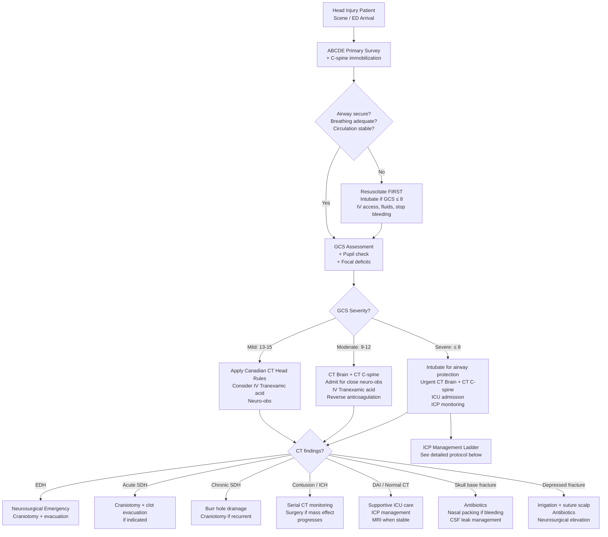

## Management of Head Injury

### The Central Philosophy of TBI Management

Before diving into specifics, let's anchor the entire management framework to a single concept from the lecture slides:

> ***"Protect uninjured brain. Salvage injured brain. Treat underlying cause. ALWAYS resuscitate first. Clinical/ICP monitoring. Control ICP & maintain cerebral perfusion. Neuroprotective therapies."*** [12]

***Primary brain injury is fixed at the time of trauma — it is not amenable to treatment*** [2]. Therefore, the **entire focus of TBI management is preventing, detecting, and treating secondary brain injury**. Every single intervention below serves this goal.

---

## 1. Master Management Algorithm

---

## 2. Immediate Resuscitation — ***ABC Before ICP!*** [12]

This is the **non-negotiable first step**. The lecture slides are emphatic:

> ***"Airway. Breathing (protect C-spine). Circulation (not CT scan!). Disability. Exposure/Environment. ABC before ICP!!"*** [12]

> ***"ALWAYS resuscitate first"*** [12]

**Why ABC before anything else?** Because **hypotension and hypoxia are the two most devastating secondary insults** in TBI. A single episode of systolic BP < 90 mmHg doubles mortality in severe TBI. A PaO2 < 60 mmHg causes cerebral ischaemia. If you rush to CT without stabilizing the patient, you are killing brain cells while the scanner spins.

### 2.1 Airway + Cervical Spine

- ***Assume C-spine injury*** in all significant head injuries → maintain **in-line immobilization** with hard collar [2][4]
- ***Jaw thrust*** (not head-tilt chin-lift) when C-spine injury is a concern [16]
- **Indications for intubation** [2][4]:
  - ***GCS ≤ 8*** — cannot protect airway (lost gag/cough reflexes)
  - Loss of protective laryngeal reflexes
  - Respiratory insufficiency (PaO2 < 60, PaCO2 > 45)
  - Need for controlled ventilation (ICP management)
- **Rapid Sequence Induction (RSI)**: IV induction (e.g. propofol or ketamine) + fast-acting neuromuscular blocker (e.g. suxamethonium or rocuronium) → intubate without prior bag-valve-mask ventilation (to avoid aspiration in unfasted trauma patient) [16]
- ***Early tracheostomy*** may be considered in severe TBI for better bronchial toileting [4]

### 2.2 Breathing

- ***Target: SpO2 > 97%, PaO2 > 9 kPa*** [4]
- Supplemental O2 to maintain oxygenation
- Avoid hyperventilation initially (see ICP section below)
- Check for associated chest injuries (pneumothorax, haemothorax, flail chest) — these cause hypoxia → secondary brain injury

### 2.3 Circulation

- ***Avoid hypotension at all costs*** — SBP < 90 mmHg is catastrophic
- **Two large-bore IV cannulae**, aggressive fluid resuscitation
- ***Scalp wound: MUST suture to stop bleeding!*** [4] — scalp lacerations can cause haemorrhagic shock
  - Management: ***haemostasis first → direct compression → wound irrigation ± debridement → primary closure with big stitches through aponeurosis*** [2]
- Identify and treat extracranial sources of blood loss (chest, abdomen, pelvis, long bones)
- **Blood products** as needed (crossmatch, MTP if massive haemorrhage)

<Callout title="Imaging Timing — A Critical Point">
***"Only when vital signs stabilised. Continuous vital signs monitoring crucial. If vital signs unstable, skip CT and go straight to theatre (e.g., laparotomy)."*** [1]

The CT scanner is sometimes called ***"The Donut of Death"*** [1] — because an unstable patient can arrest and die inside the scanner with no one able to resuscitate them. **Stabilize first, scan second.**
</Callout>

---

## 3. General Medical Management ("By Any Doctor") [12]

The lecture slides clearly separate what ***any doctor*** can do from what requires ***neurosurgical/ICU*** expertise [12]:

### 3.1 Positioning — Enhanced Cerebral Venous Drainage

- ***Head elevation ~30°*** [2][4][12]
- ***Avoid neck rotation*** [12] — rotation compresses internal jugular veins → impairs venous drainage → ↑ICP
- ***Remove neck collar if not indicated*** [12] — collar can compress jugular veins. Once C-spine is cleared, remove it
- ***Maintain vascular volume & BP*** [12]

> **Why head elevation?** Elevating the head uses gravity to promote venous drainage from the brain back to the heart via the internal jugular veins. This reduces intracranial venous blood volume → reduces ICP (Monro-Kellie doctrine: reduce blood component → ICP falls). But you must maintain MAP — if the patient is hypovolaemic, head elevation can drop MAP and worsen CPP.

### 3.2 Tranexamic Acid (TXA)

- ***IV Tranexamic acid 1g: within 3 hours if mild-moderate TBI + reactive pupils*** [4] — based on the ***CRASH-3 trial*** [4]
- Dosing: ***loading dose 1g IV, then maintenance 500 mg Q8H IV*** [2]
- ***Effect: ↓haemorrhage, might ↓oedema and ischaemic lesions*** [2]

> **Mechanism of TXA**: Tranexamic acid ("trans" = across, "amine" = amino group, "ex" = from, "amic" = related to amino acid) is an **antifibrinolytic** — it inhibits plasminogen activation → prevents fibrin clot breakdown → stabilizes clots and reduces bleeding. In TBI, ongoing microvascular bleeding worsens contusions and haematomas. TXA helps stop this.

<Callout title="The CRASH-3 Trial — Key Details">
- TXA given **within 3 hours** of injury in mild-moderate TBI (GCS ≥ 9) with **reactive pupils** reduced head injury-related death
- **No benefit if given > 3 hours** after injury
- **No benefit in severe TBI with bilateral fixed dilated pupils** (brain already too damaged)
- This is why the lecture says ***"Give Transamin"*** as a "DO" [1]
</Callout>

### 3.3 Reversal of Anticoagulation

***Reverse bleeding tendency*** [1][2]:

| Anticoagulant/Antiplatelet | Reversal Agent | Notes |
|---|---|---|
| ***Warfarin*** | ***Vitamin K + FFP or 4-factor PCC*** (prothrombin complex concentrate) | PCC faster onset than FFP; vitamin K takes 6–12h for full effect |
| ***Dabigatran*** (direct thrombin inhibitor) | ***Idarucizumab*** (specific monoclonal antibody reversal agent) | "Ida" = the name, "rucizumab" = monoclonal antibody |
| ***Rivaroxaban / Apixaban*** (Factor Xa inhibitors) | Andexanet alfa (if available); otherwise PCC | Less well-established reversal |
| ***Antiplatelets*** (aspirin, clopidogrel) | ***Platelet transfusion*** | Consider desmopressin (DDAVP) for aspirin effect |
| ***Heparin*** | Protamine sulphate | 1 mg protamine per 100 units heparin |

### 3.4 Osmotherapy

- ***Maintain MAP*** and ***osmotherapy*** for raised ICP [12]

#### Mannitol

- ***Mannitol: onset 15 min, duration of action 6h, bolus 0.25–1 g/kg*** [2]
- ***Must put in Foley catheter*** [2] — mannitol causes an osmotic diuresis; without a catheter, the bladder can overdistend or fluid balance becomes impossible to monitor
- **Mechanism**: Mannitol is an osmotic agent — IV mannitol creates a **hyperosmolar gradient** across the intact blood-brain barrier (BBB), drawing water out of brain parenchyma into the intravascular space → reduces brain volume → reduces ICP. It also reduces blood viscosity → improves CBF.

**Contraindications** [2]:
- ***Avoid if hypernatraemia (serum Na > 145) or serum osmolality > 340 mOsm/kg*** — further osmotic shift risks renal failure
- ***Avoid if hypovolaemic*** — mannitol causes diuresis → worsens hypovolaemia → drops MAP → drops CPP → the opposite of what you want
- ***Avoid in heart failure*** — initial intravascular volume expansion can precipitate pulmonary oedema

> ***"Do NOT give mannitol if shocked"*** [1][2]

#### Hypertonic Saline (3% NaCl)

- Alternative to mannitol for osmotherapy
- Same osmotic principle but has the advantage of **volume expansion** (unlike mannitol which causes diuresis)
- Target serum Na ~145–155 mEq/L
- Particularly useful when patient is also hypovolaemic

### 3.5 Sedation

- ***Sedation*** reduces cerebral metabolic rate → reduces cerebral blood flow → reduces ICP [12]
- Also reduces agitation (which increases ICP via Valsalva, fighting the ventilator)
- Common agents: propofol (short-acting, titratable), midazolam, fentanyl
- ***Use barbiturates or propofol only in ICU*** [1][2] — these can cause profound hypotension

### 3.6 Optimise Electrolytes and Glucose [12]

- ***Avoid hypoglycaemia*** — glucose is the brain's primary fuel; hypoglycaemia directly causes neuronal death
- ***Target serum Na > 140*** [4] — mild hypernatraemia is protective in TBI (reduces cerebral oedema)
- Monitor for post-TBI hyponatraemia: ***SIADH vs CSWS*** [8] — different volume status → different treatment

### 3.7 Seizure Prevention and Control

- ***Seizure prophylaxis for 1 week*** [2][4] — only for **early post-traumatic seizures** (within 7 days)
- Common agents: levetiracetam (Keppra), phenytoin
- ***No need for prophylaxis if patient is already sedated*** [4]
- ***No evidence that prophylaxis prevents LATE seizures*** (> 7 days) — therefore do NOT continue beyond 1 week unless seizures occur
- **Why prevent seizures?** ***Seizures cause hyperaemia and exacerbate ↑ICP*** [2]. Seizure activity massively increases cerebral metabolic demand → increases CBF → increases intracranial blood volume → raises ICP. Additionally, prolonged seizures cause excitotoxic neuronal death.

### 3.8 Prevent Pyrexia [12]

- Fever increases cerebral metabolic rate (~8% per °C) → increases CBF → increases ICP
- ***Target temperature < 37°C*** [4]
- Identify and treat infectious sources (UTI, pneumonia, line infections)
- Antipyretics (paracetamol), active cooling if needed

### 3.9 Optimise Ventilation [12]

- ***Target: PaCO2 4.5–5 kPa*** (34–38 mmHg) in routine management [4]
- Avoid hypoxia (PaO2 > 9 kPa)
- See hyperventilation section below for ICP emergencies

### 3.10 Nutrition

- ***Feeding at least by Day 5*** [4] — early nutrition improves outcomes
- Route: enteral (NG/NJ tube) preferred over parenteral

### 3.11 DVT Prophylaxis

- ***Graded compression stockings*** [4]
- Pharmacological prophylaxis (LMWH) when intracranial haemorrhage is stable (typically 48–72h post-injury) — balance bleeding risk vs. VTE risk
- Intermittent pneumatic compression devices

### 3.12 Stress Ulcer Prophylaxis

- ***H2 blockers*** (ranitidine) or PPIs [2]
- TBI patients are at high risk of stress (Cushing) ulcers — the hypothalamic-pituitary axis is disrupted, causing vagal hyperactivation → increased gastric acid secretion

---

## 4. ICP Management — The Escalation Ladder

The lecture separates ICP management into what ***any doctor*** can do and what requires ***neurosurgical/ICU expertise*** [12]:

### The Treatment Targets [4]

| Parameter | Target | Rationale |
|---|---|---|
| ***ICP*** | ***< 22 mmHg*** (or < 20 cmH2O) | ICP > 20 is definitely abnormal [12]; elevated ICP → ↓CPP → ischaemia |
| ***CPP*** | ***60–70 mmHg*** | CPP = MAP − ICP; below 60 → risk of ischaemia; above 70 → risk of ARDS with aggressive vasopressors |
| ***SpO2*** | ***> 97%*** | Hypoxia → secondary brain injury |
| ***PaO2*** | ***> 9 kPa*** | — |
| ***PaCO2*** | ***4.5–5 kPa*** | See hyperventilation section |
| ***Temperature*** | ***< 37°C*** | Fever ↑ metabolic demand |
| ***Serum Na*** | ***> 140*** | Mild hypernatraemia reduces cerebral oedema |
| ***Glucose*** | ***Avoid hypoglycaemia*** | Brain fuel |

### Tiered Approach to ICP Management

***If ICP targets not met, first consider: repeat CT brain / recalibrate probes / check catheter position*** [4] — don't escalate treatment blindly if the reading is artefactual.

#### Tier 1 — "By Any Doctor" [12]

| Intervention | Mechanism | Notes |
|---|---|---|
| ***Head elevation ~30°*** | Gravity-assisted cerebral venous drainage | Avoid neck rotation; loosen collar |
| ***Optimise ventilation*** | Maintain PaO2, controlled PaCO2 | Avoid both hypoxia and hypocapnia |
| ***Maintain MAP*** | Ensure CPP ≥ 60–70 | IV fluids, vasopressors if needed |
| ***Osmotherapy*** | Draw water out of brain via osmotic gradient | ***Mannitol 0.25–1 g/kg bolus*** or hypertonic saline |
| ***Sedation*** | ↓ Cerebral metabolic rate → ↓ CBF → ↓ ICP | Propofol, midazolam, fentanyl |
| ***Optimise electrolytes/glucose*** | Prevent metabolic derangement | Na > 140, normoglycaemia |
| ***Prevent/control seizure*** | Seizures → hyperaemia → ↑ICP | Levetiracetam or phenytoin |
| ***Prevent pyrexia*** | Fever → ↑metabolic demand → ↑ICP | Paracetamol, active cooling |

#### Tier 2 — "By Neurosurgeon/ICU" [12]

| Intervention | Mechanism | Notes |
|---|---|---|
| ***ICP monitoring + CSF drainage via EVD*** | Directly measures ICP; draining CSF reduces volume component | ***EVD is gold standard*** [12]; risk of infection, iatrogenic trauma |
| ***Controlled hyperventilation*** | ↓PaCO2 → cerebral vasoconstriction → ↓cerebral blood volume → ↓ICP | ***Keep PaCO2 30–35 mmHg; short-term measure with rapid onset (1 min); but NOT for first 24h of head injury*** [2] |
| ***Barbiturate coma*** | Profoundly ↓metabolic rate → ↓CBF → ↓ICP | ***Risk of ↓BP, infection, electrolyte problems*** [2]; ***use only in ICU*** [1] |
| ***Surgical removal of space-occupying lesion (SOL)*** | Directly removes mass → ↓volume → ↓ICP | Craniotomy for haematoma/tumour [12] |
| ***Decompressive craniectomy*** | Removes part of skull → allows brain to swell outward instead of herniating inward | ***↓Mortality but poor quality of survival; not recommended in all guidelines but still done a lot*** [2] |

### Hyperventilation — Why and When

> ***"Do NOT blindly hyperventilate"*** [1]

**The physiology**: CO2 is a potent cerebral vasodilator. Lowering PaCO2 (by hyperventilating) causes cerebral vasoconstriction → reduces cerebral blood volume → reduces ICP. This works fast (onset ~1 minute).

**The danger**: Excessive vasoconstriction can cause cerebral **ischaemia** — you're trading ICP reduction for blood flow reduction. In the first 24 hours after TBI, CBF is already low, so hyperventilation during this period is particularly dangerous.

**Guidelines** [2]:
- ***Target PaCO2 30–35 mmHg*** (moderate hyperventilation)
- ***Short-term measure only*** — for acute ICP crises (e.g. impending herniation with dilating pupil)
- ***Not for first 24 hours*** of head injury (CBF already reduced)
- Must have **PaCO2 monitoring** (ABG or end-tidal CO2)

### Barbiturate Coma

- Last-resort medical measure for **refractory raised ICP**
- ***Risks: hypotension (barbiturates are vasodilators), infection (immunosuppression), electrolyte derangement*** [2]
- ***Never use outside ICU*** [1][2] — requires invasive haemodynamic monitoring (arterial line, CVP) and vasopressor support
- Common agent: thiopentone infusion with EEG monitoring (titrate to burst suppression)

---

## 5. The "DO" and "DO NOT" Lists — From the Lecture [1]

This is an absolute exam favourite. The lecture explicitly provides these two lists:

| ***DO*** | ***DO NOT*** |
|---|---|
| ***ABC first*** | ***Give steroids*** |
| ***Give Transamin*** (tranexamic acid) | ***Blindly hyperventilate*** |
| ***Reverse bleeding tendency*** | ***Blindly lower BP*** |
| ***Anticipate/Manage deterioration*** | ***Give mannitol when shocked*** |
| ***Prevent seizure/fever*** | ***Use barbiturates or Propofol outside ICU*** |
| ***Avoid extreme anything*** | |

<Callout title="Why NO Steroids?" type="error">
***Corticosteroids are NOT indicated and should be avoided following head injury — associated with increased acute mortality*** [6]. This was definitively shown in the ***CRASH trial*** (not CRASH-3 — the original CRASH trial from 2004). High-dose methylprednisolone in TBI increased 2-week mortality by 18%. The mechanism is unclear but may relate to hyperglycaemia, infection risk, and impaired wound healing.

***"Role of steroids: high-dose MP is contra-indicated"*** [4]

This is different from spinal cord injury (where steroids were previously used but are now also falling out of favour) and from brain tumour oedema (where dexamethasone IS indicated — vasogenic oedema around tumours responds to steroids, but cytotoxic oedema in TBI does not).
</Callout>

<Callout title="Why Not Blindly Lower BP?">
In TBI, cerebral autoregulation is impaired (pressure-passive system). Aggressively lowering BP → drops MAP → drops CPP → cerebral ischaemia. You MUST maintain adequate MAP to perfuse the injured brain. The exception: if there is concurrent hypertensive ICH, cautious BP lowering to SBP < 140–150 may be appropriate, but **never** in the context of shock or impending herniation.
</Callout>

---

## 6. Surgical Management — Specific Pathologies

### 6.1 Terminology [6]

Understanding surgical terms is essential:
- ***Craniotomy*** = a bone flap is raised and ***replaced*** after the procedure [6][12]
- ***Craniectomy*** = a bone segment is removed and ***NOT replaced*** → allows brain to swell outward [6]
- ***Burr hole*** = a small hole drilled through skull for drainage [6][12]
- ***Cranioplasty*** = secondary procedure to replace the skull defect (usually months later, using titanium mesh or stored bone)

### 6.2 Epidural Haematoma (EDH) — Neurosurgical Emergency [2]

- ***Craniotomy + haematoma evacuation*** [1][2]
- ***Good outcome if timely evacuation*** [4] — because the underlying brain parenchyma is often intact (the problem is the expanding haematoma, not diffuse brain damage)
- Open craniotomy allows complete visualization and haemostasis of the middle meningeal artery

**Conservative management of EDH** — only if ALL of the following are met [6]:
- ***Haematoma clot volume < 30 cm³***
- ***Maximum thickness < 1.5 cm***
- ***GCS score > 8***
- No focal neurological deficits
- Serial CT monitoring with low threshold for surgery if any expansion

### 6.3 Subdural Haematoma (SDH)

**Acute SDH** [1][2]:
- ***Craniotomy for clot evacuation*** [1] — clotted blood cannot be drained through a small hole
- ***High mortality*** [1] — because acute SDH is usually associated with significant underlying ***brain laceration and contusion*** [1]
- ***Poor functional prognosis*** [1]
- ***Only consider craniotomy in those who are young with good premorbid status*** [2] — in elderly with severe brain injury, surgery may not improve meaningful outcome

**Subacute/Chronic SDH** [2]:
- ***Burr hole + drainage*** [2][4][12] — the blood has liquefied over weeks and can be drained through a burr hole
- ***Good outcome with drainage*** [4]
- ***Craniotomy if recurrent*** [4]
- Late presentation means most damage is from secondary injury; initial injury was likely mild → ***good prognosis*** [2]

### 6.4 Brain Contusion [1][2]

- ***May enlarge with time — NOT the worst until at least Day 4–5*** [1][2] → ***MUST observe patients + repeat scans even if first scan only shows small haematoma*** [2]
- **Surgical evacuation indicated in** [2]:
  - ***Posterior fossa*** when there is evidence of significant mass effect
  - ***Hemispheric only when very large (> 50 cm³)*** or ***GCS 6–8 + frontotemporal ICH > 20 cm³ + midline shift ≥ 5 mm or cisternal compression on CT scan*** [2]

### 6.5 Diffuse Axonal Injury (DAI) [2]

- ***No surgical management possible*** — the injury is microscopic and diffuse
- Supportive ICU care: ICP management, prevent secondary insults
- ***Late sequelae: brain swelling, prolonged coma, poor functional recovery*** [2]

### 6.6 Decompressive Craniectomy [2][12]

- ***Surgical removal of a large portion of skull*** (unilateral or bilateral) ***without replacing it*** → allows brain to expand outward
- Indicated for **refractory raised ICP** with diffuse swelling not responding to medical therapy
- ***↓Mortality but poor quality of survival*** [2] — survivors may have severe disability
- ***Not recommended in all guidelines but still done a lot*** [2]
- A secondary **cranioplasty** is performed months later to restore skull integrity

### 6.7 Skull Fracture Management

**Linear vault fractures** [2]:
- ***Conservative management unless associated with other lesions*** (e.g. EDH)
- CT to rule out underlying intracranial pathology

***Depressed vault fractures*** [1][6]:
- ***Irrigation and suture scalp*** [1]
- ***Do not finger-explore*** [1]
- ***Antibiotics*** [1]
- ***Call neurosurgeons*** [1]
- ***Craniotomy if depression greater than cranial thickness*** [6] — elevate fracture, debridement of fragments and devitalized tissue, repair dural disruption, haemostasis

***Skull base fractures*** [4]:
- ***Nasal packing*** if bleeding [4]
- ***Antibiotics*** if open/skull base fractures [4]
- ***Discuss for embolization*** if life-threatening haemorrhage [4]
- ***CSF fistula: usually heals spontaneously; may require surgical repair if persistent/delayed*** [4]
  - Elevation of head of bed ± lumbar drain to reduce hydrostatic pressure across the defect
  - ***Incidence of bacterial meningitis rises substantially if leak persists for 7 days*** [6]
  - ***No proven efficacy of prophylactic antibiotics for preventing meningitis in CSF leaks*** [6] — but antibiotics are often given in practice

### 6.8 Penetrating Injuries [6]

- ***IV Antibiotics*** — decreases chance of meningitis or abscess formation
- ***Operative exploration***: remove objects extending out of cranium, debridement, irrigation, haemostasis, definitive closure
- ***Cerebral angiography*** must be considered if object passes near a major artery or dural venous sinus

### 6.9 EVD — External Ventricular Drain [12]

- ***Release CSF with or without overt hydrocephalus*** [12]
- ***Also for ICP monitoring*** [12]
- ***Gold standard*** for ICP measurement [12]
- ***Manometric principle*** for monitoring intracranial CSF pressure [12]
- ***Therapeutic*** by draining CSF for decompression [12]
- ***Risk of infection, iatrogenic trauma*** [12]
- ***LP contraindicated if raised ICP*** [12] — risk of tonsillar herniation

---

## 7. Therapeutic Hypothermia [12]

- ***Early cooling to 32–34°C*** [12]
- ***Neuroprotection by: ↓brain metabolic rate, ↓ATP consumption & ↓O2 demand, ↓cell death cascades*** [12]
- ***Established therapy for post-cardiac-arrest brain injury*** [12]
- ***Controversial in stroke & trauma*** [12]
- ***Side effects: pneumonia, coagulopathy*** [12]
- ***Not recommended in adults*** (no benefit in RCTs) [2], but less certain in children
- Additional risks: ***cardiac arrest, ischaemia, bleeding tendency*** [2]

---

## 8. Management by Scenario — Comprehensive Summary

### Mild TBI (GCS 13–15)

| Step | Action |
|---|---|
| 1 | ABCDE, GCS, neuro exam |
| 2 | Apply Canadian CT Head Rules → CT if indicated |
| 3 | ***IV Tranexamic acid 1g within 3h if reactive pupils*** [4] |
| 4 | If CT normal → observe with neuro-obs for 4–24h → discharge with **head injury advice card** |
| 5 | If CT abnormal → manage according to specific pathology |
| 6 | ***Repeat CT if any deterioration*** [1] |

### Moderate TBI (GCS 9–12)

| Step | Action |
|---|---|
| 1 | ABCDE, GCS, neuro exam |
| 2 | CT brain + CT C-spine mandatory |
| 3 | Admit for close neuro-obs (GCS, pupils, limb power q15–30 min) |
| 4 | IV TXA, reverse anticoagulation, supportive care |
| 5 | Neurosurgical consultation if intracranial pathology |
| 6 | Serial CT as clinically indicated |

### Severe TBI (GCS ≤ 8) [4]

| Step | Action |
|---|---|
| 1 | ***ABCDE — intubate for airway protection*** |
| 2 | Urgent CT brain + CT C-spine |
| 3 | ***ICU admission*** |
| 4 | ***Invasive ICP monitoring with EVD*** [4][12] |
| 5 | ***Head elevation 30°, loosen neck constraints*** [4][12] |
| 6 | ***Consider sedation & paralysis*** [4] |
| 7 | ICP management ladder (Tier 1 → Tier 2) |
| 8 | ***Nutrition: feeding at least by Day 5*** [4] |
| 9 | ***DVT prophylaxis: graded compression stockings*** [4] |
| 10 | ***Seizure prophylaxis for 1 week only*** [4] |
| 11 | ***Antibiotics if open / skull base fractures*** [4] |
| 12 | Neurosurgical intervention as indicated by CT findings |

---

## 9. Potential Pitfalls — From the Lecture [1]

The lecture explicitly warns against these clinical errors:

> ***"An unconscious patient is 'just drunk'"*** [1] — WRONG

> ***"A known epileptic will 'wake up later'"*** [1] — WRONG

> ***"A drop in GCS 'may be nothing & let's wait'"*** [1] — WRONG

> ***"Sedate an uncooperative/noisy patient without airway protection and monitoring"*** [1] — WRONG

> ***"First CT was normal so the patient is OK"*** [1] — WRONG

These are the traps that get doctors into medico-legal trouble and kill patients.

---

## 10. Prognosis and Outcome Tools

### CRASH Score [4]

- ***Predicts risk of 14-day mortality and unfavourable outcome at 6 months***
- Variables: ***country, age, GCS, pupil reactivity, major extracranial injury, CT findings*** (petechial haemorrhages, obliteration of third ventricle/basal cisterns, SAH, midline shift, non-evacuated haematoma)
- Used for clinical decision-making and prognostication, NOT as a treatment threshold

---

<Callout title="High Yield Summary — Management of Head Injury">

**Philosophy**: Primary injury is fixed. ALL management aims to prevent secondary injury.

**Resuscitation**: ***ABC before ICP! ALWAYS resuscitate first.*** Intubate if GCS ≤ 8. Avoid hypotension (SBP > 90) and hypoxia (SpO2 > 97%).

**General measures** (any doctor): Head up 30°, avoid neck rotation, IV TXA within 3h (CRASH-3), reverse anticoagulation, osmotherapy (mannitol or hypertonic saline), sedation, seizure prophylaxis x1 week, prevent pyrexia, optimise electrolytes/glucose.

**ICP targets**: ICP < 22 mmHg, CPP 60–70 mmHg.

**ICP ladder**: Tier 1 (positioning, osmotherapy, sedation) → Tier 2 (EVD + CSF drainage, controlled hyperventilation PaCO2 30–35 but not first 24h, barbiturate coma ICU only, surgical SOL removal, decompressive craniectomy).

**DO NOT**: Give steroids (CRASH trial — increased mortality). Blindly hyperventilate. Blindly lower BP. Give mannitol when shocked. Use barbiturates/propofol outside ICU.

**Surgery**: EDH → craniotomy (good outcome). Acute SDH → craniotomy (poor outcome). Chronic SDH → burr hole (good outcome). Contusion → observe, surgery if large + mass effect. DAI → no surgery. Decompressive craniectomy for refractory ICP (↓mortality but poor quality survival).

**EVD**: Gold standard ICP monitor + therapeutic CSF drainage. LP contraindicated if raised ICP.

</Callout>

---

<ActiveRecallQuiz
  title="Active Recall - Management of Head Injury"
  items={[
    {
      question: "List the 'DO' and 'DO NOT' lists from the head injury lecture. Why is each 'DO NOT' item dangerous?",
      markscheme: "DO: ABC first, give tranexamic acid, reverse bleeding tendency, anticipate/manage deterioration, prevent seizure/fever, avoid extreme anything. DO NOT: (1) Give steroids - CRASH trial showed increased mortality. (2) Blindly hyperventilate - causes vasoconstriction and may worsen ischaemia. (3) Blindly lower BP - drops CPP in pressure-passive brain. (4) Give mannitol when shocked - osmotic diuresis worsens hypovolaemia and drops CPP further. (5) Use barbiturates/propofol outside ICU - causes profound hypotension requiring invasive monitoring."
    },
    {
      question: "Describe the tiered approach to ICP management, listing at least 3 Tier 1 and 3 Tier 2 interventions.",
      markscheme: "Tier 1 (any doctor): (1) Head elevation 30 degrees in neutral position, (2) Osmotherapy (mannitol 0.25-1 g/kg or hypertonic saline), (3) Sedation, (4) Optimise ventilation/electrolytes/glucose, (5) Seizure prevention/control, (6) Prevent pyrexia. Tier 2 (neurosurgeon/ICU): (1) ICP monitoring + CSF drainage via EVD, (2) Controlled hyperventilation to PaCO2 30-35 mmHg (not in first 24h), (3) Barbiturate coma, (4) Surgical removal of SOL, (5) Decompressive craniectomy."
    },
    {
      question: "A 55-year-old man on warfarin for AF has a head injury with GCS E2M4V2 and BP 65/20 mmHg. The ED team wants to give IV mannitol. Explain why this is wrong and what should be done instead.",
      markscheme: "Mannitol is contraindicated in shock/hypovolaemia because it causes osmotic diuresis, worsening hypovolaemia and further dropping MAP/CPP. With BP 65/20 (shocked), the priority is: (1) ABC - intubate (GCS 8), (2) aggressive fluid resuscitation and blood products to restore BP, (3) reverse warfarin with IV vitamin K + 4-factor PCC or FFP, (4) give IV tranexamic acid, (5) CT brain only when vitals stabilised, (6) neurosurgical intervention based on CT findings."
    },
    {
      question: "Compare the surgical management of acute SDH versus chronic SDH. Why is the prognosis different?",
      markscheme: "Acute SDH: craniotomy + clot evacuation (clotted blood cannot pass through burr hole). Poor prognosis because acute SDH is usually associated with underlying brain laceration and contusion (significant primary brain injury). Chronic SDH: burr hole + drainage (blood has liquefied). Good prognosis because late presentation means initial injury was mild, and most damage is from treatable secondary effects. Craniotomy reserved for recurrence."
    },
    {
      question: "Explain the mechanism and evidence for tranexamic acid in TBI. When should it be given and to whom?",
      markscheme: "Mechanism: antifibrinolytic - inhibits plasminogen activation, preventing fibrin clot breakdown, thereby stabilising clots and reducing ongoing microvascular bleeding. Evidence: CRASH-3 trial showed reduced head-injury-related death when given within 3 hours. Indication: IV 1g loading dose within 3 hours of injury in mild-moderate TBI (GCS >= 9) with reactive pupils. No benefit if given after 3 hours or in severe TBI with bilateral fixed dilated pupils."
    },
    {
      question: "Why is hyperventilation both useful and dangerous in TBI? State the target PaCO2 and the time restriction.",
      markscheme: "Useful: lowering PaCO2 causes cerebral vasoconstriction, reducing cerebral blood volume and thus ICP. Rapid onset (1 minute). Dangerous: excessive vasoconstriction reduces cerebral blood flow, risking ischaemia, especially in the first 24 hours when CBF is already low. Target PaCO2: 30-35 mmHg. Time restriction: short-term measure only, NOT in the first 24 hours of head injury. Requires PaCO2 monitoring."
    }
  ]}
/>

## References

[1] Lecture slides: GC 208. Unconscious after an accident Head injury.pdf
[2] Senior notes: Ryan Ho Neurology.pdf (Ch 11 — Head Injury and Related Conditions, pp. 197–205)
[4] Senior notes: maxim.md (Head Injury / Management sections)
[6] Senior notes: felixlai.md (Head Injury — Treatment section)
[8] Senior notes: Ryan Ho Chemical Path.pdf (p. 10 — CSWS/SIADH)
[12] Lecture slides: GC 111. Raised intracranial pressure and hydrocephalus.pdf
[16] Senior notes: Ryan Ho Critical Care.pdf (pp. 7–9 — Airway Management)
