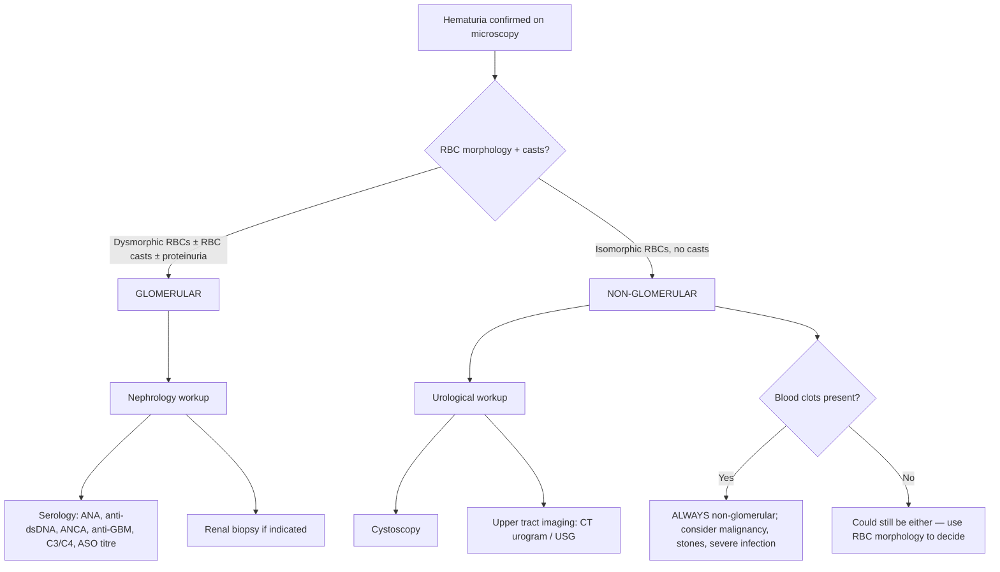
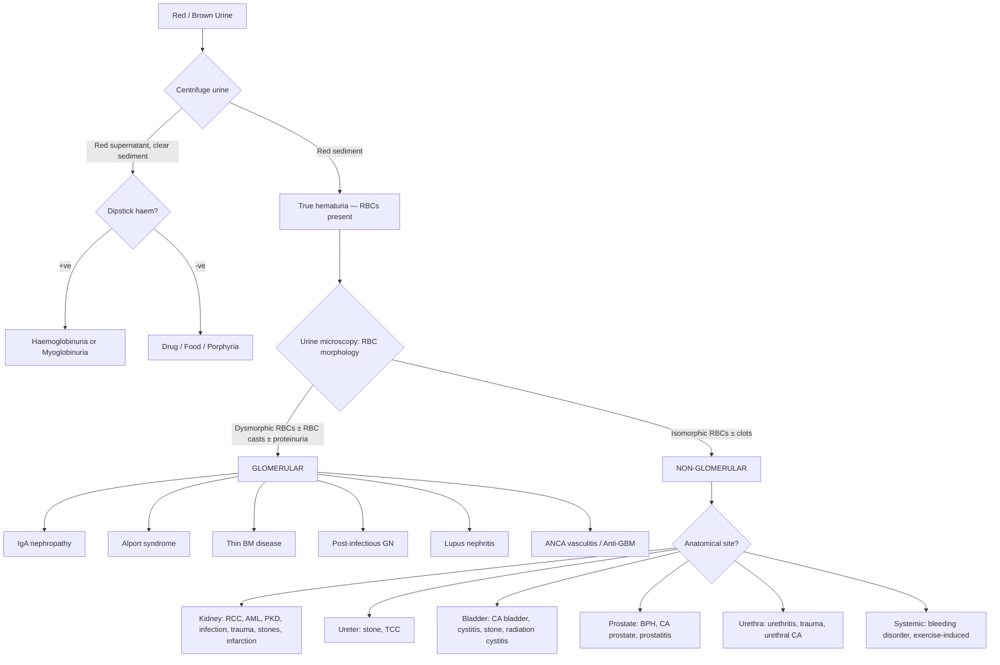

## Differential Diagnosis of Hematuria

The differential diagnosis of hematuria is best approached **systematically by anatomical site** — you mentally walk along the urinary tract from the glomerulus to the urethral meatus and ask: "Could the blood be coming from here?" At each level you consider benign vs malignant, medical vs surgical. Overlaid on this anatomical framework is the **glomerular vs non-glomerular** distinction, which is the single most important initial branch point because it determines whether the patient needs a nephrologist or a urologist.

---

### 1. The Master Framework: Glomerular vs Non-Glomerular

Before diving into individual causes, let's revisit **why** this distinction matters from first principles:

- **Glomerular bleeding** → blood leaks across a damaged glomerular basement membrane (GBM). RBCs are forced through tiny rents under filtration pressure → they become **dysmorphic** (distorted, with blebs and irregular membranes). They then travel the full length of the nephron, getting exposed to varying osmolalities and urokinase/tPA → **no clots form**. The blood mixes with a large volume of filtrate → urine appears **brown/cola-coloured** (haemoglobin oxidises to methaemoglobin). Proteinuria is usually co-present because the same barrier that blocks protein is disrupted [3][5].

- **Non-glomerular (urological) bleeding** → blood enters the urinary tract downstream of the glomerulus (renal pelvis, ureter, bladder, prostate, urethra). RBCs are shed directly into urine as **whole blood** → they retain their normal **isomorphic** shape. If bleeding is brisk, there is enough fibrinogen and minimal fibrinolytic activity → **clots can form**. Urine is typically **bright red or pink** [2][3].

---

### 2. Comprehensive Differential Diagnosis by Anatomical Site

The table below integrates the ***lecture slide classification [1]*** with the expanded framework from senior notes [3][5][7]. Each cause includes its **distinguishing clinical features** so you can narrow the differential at the bedside.

#### 2.1 Upper Urinary Tract — Kidney

##### A. Glomerular Causes

| Cause | Key Distinguishing Features | Why It Causes Hematuria |
|---|---|---|
| **IgA nephropathy** (commonest GN worldwide; commonest cause of isolated glomerular hematuria) | ***Synpharyngitic hematuria*** — gross hematuria concurrent with or 1–3 days after URTI (cf. post-streptococcal GN = 2–3 weeks later); usually adult onset; may have flank pain + AKI during episodes [7][8] | IgA immune complexes deposit in mesangium → mesangial proliferation + complement activation → GBM damage → RBCs leak through |
| **Thin basement membrane disease** (benign familial hematuria) | Persistent microscopic hematuria; **AD** inheritance (COL4A3/4 mutations); **benign** course with normal renal function; FHx of hematuria in 30–50%; gross hematuria unusual ( < 10%) [8] | GBM is uniformly thin ( < 250 nm vs normal 300–400 nm) → mechanically weaker → allows RBC passage under normal filtration pressures |
| **Alport syndrome** | X-linked dominant (80%); progressive hematuria + **sensorineural hearing loss** + **anterior lenticonus** + dot-and-fleck retinopathy; progressive CKD especially in males; FHx of renal failure/deafness in male relatives [8] | Defective type IV collagen (α3/α4/α5 chains) → GBM progressively splits, lamellates ("basket-weave" on EM) → structural failure → hematuria + proteinuria |
| **Post-infectious GN** (post-streptococcal) | Nephritic syndrome (HTN, oedema, oliguria, hematuria) 2–3 weeks after Group A Strep pharyngitis or 3–6 weeks after skin infection; ↓C3, ↑ASO titre; **children > adults** | Subepithelial immune complex "humps" → complement activation → endocapillary proliferation → GBM damage |
| **Lupus nephritis** | Multisystem disease: malar rash, arthralgia, serositis, oral ulcers; young F >> M; ↑ANA, ↑anti-dsDNA, ↓C3/C4 | Anti-dsDNA immune complexes deposit in glomeruli → proliferative or membranous GN → GBM disruption |
| **ANCA-associated vasculitis** (GPA, MPA, EGPA) | ***Pulmonary-renal syndrome*** (haemoptysis + RPGN); GPA → saddle nose, nasal crusting, epistaxis; constitutional symptoms; ↑c-ANCA (PR3) in GPA, ↑p-ANCA (MPO) in MPA [2] | Pauci-immune necrotising crescentic GN → fibrinoid necrosis of glomerular capillaries → hematuria |
| **Anti-GBM disease** (Goodpasture syndrome) | Pulmonary haemorrhage + RPGN; young male smokers; anti-GBM Ab +ve; linear IgG on IF | AutoAb against α3 chain of type IV collagen in GBM → complement-mediated destruction → crescentic GN |
| **HSP/IgA vasculitis** | Children: palpable purpura (lower limbs/buttocks) + arthralgia + abdominal pain + GN; essentially systemic IgA nephropathy | IgA deposition in mesangium (same mechanism as IgA nephropathy) + small vessel vasculitis |
| **Mesangiocapillary GN (MPGN)** | Nephritic/nephrotic overlap; may be secondary to HCV, cryoglobulinaemia; persistently ↓C3 | Immune complex or complement-mediated thickening + splitting of GBM ("tram-track" on LM) |

##### B. Tubular, Interstitial and Vascular Renal Causes (Non-Glomerular but Renal)

| Cause | Key Distinguishing Features | Why It Causes Hematuria |
|---|---|---|
| ***Renal cell carcinoma (RCC)*** [1] | Traditional triad: painless hematuria + flank pain + palpable mass (only ~10%); constitutional symptoms; paraneoplastic: HTN (renin), hypercalcaemia (PTHrP), polycythaemia (EPO); ***left-sided varicocele*** (L renal vein obstruction); most now found incidentally on imaging [5] | Tumour invades renal collecting system → erodes into vascular channels → whole blood enters urine |
| ***Polycystic kidney disease (ADPKD)*** [1] | Bilateral ballotable kidneys; insidious HTN; FHx (AD); associated liver cysts; berry aneurysms | Cyst rupture into collecting system; cyst haemorrhage; also predisposes to stones |
| ***Angiomyolipoma (AML)*** [1] | Often associated with **tuberous sclerosis** (bilateral, multiple) or sporadic (unilateral); fat-containing mass on CT; risk of spontaneous haemorrhage if > 4 cm | Abnormal blood vessels within tumour lack elastic lamina → aneurysm formation → spontaneous rupture |
| ***Infection — pyelonephritis*** [1] | High fever, rigors, vomiting, loin pain, tenderness at renal angle; WBC casts on microscopy | Intense inflammation of renal parenchyma → mucosal hyperaemia, capillary disruption → blood enters collecting system |
| **Renal abscess** | Similar to pyelonephritis but more indolent; swinging fever; may follow bacteraemia (S. aureus) | Suppurative destruction of renal tissue → erosion into collecting system |
| ***Renal TB*** | Sterile pyuria (WBCs on microscopy but negative routine culture); constitutional symptoms; calcified "putty kidney"; exposure history | Caseous necrosis destroys renal parenchyma → cavities communicate with collecting system |
| ***Trauma*** [1] | History of blunt/penetrating injury or iatrogenic (biopsy, lithotripsy) | Direct mechanical disruption of renal parenchyma/vessels |
| **Renal artery embolism / infarction** [3] | Acute flank pain; ↑LDH; AF or endocarditis as embolic source | Tissue necrosis → haemorrhagic infarction → blood enters collecting system |
| **Renal vein thrombosis** [3] | Flank pain; proteinuria; a/w nephrotic syndrome (esp. membranous nephropathy) | Venous congestion → haemorrhagic infarction |
| **AV malformation** [3] | Recurrent gross hematuria; may have renal bruit; can cause high-output cardiac failure if large | Abnormal high-pressure arteriovenous communication → rupture into collecting system |
| **Papillary necrosis** | Risk factors: DM, NSAIDs, sickle cell, analgesic nephropathy; colicky pain as sloughed papillae pass | Ischaemic necrosis of renal papillae → necrotic tissue + blood shed into calyceal system |
| **Acute interstitial nephritis (AIN)** | Drug rash + eosinophilia + AKI; common culprits: penicillins, cephalosporins, NSAIDs, PPIs | Inflammatory infiltrate (eosinophils, lymphocytes) in interstitium → disruption of peritubular capillaries → hematuria; eosinophiluria is characteristic |
| **Medullary sponge kidney** | Often incidental; recurrent stones + hematuria; characteristic "paintbrush" appearance on IVU | Dilated collecting ducts → stasis → stone formation + mucosal erosion |
| **Sickle cell disease/trait** | Known sickle cell status; can cause painless gross hematuria even in carriers (trait) | Sickling in vasa recta of hypertonic renal medulla → papillary necrosis + microvascular occlusion |

#### 2.2 Upper Urinary Tract — Ureter

| Cause | Key Distinguishing Features | Why It Causes Hematuria |
|---|---|---|
| ***Stone*** [1] | Acute colicky loin-to-groin pain (ureteric colic); N/V; restlessness (patients can't keep still); stones lodge at PUJ, pelvic brim, VUJ [4] | Stone mechanically abrades urothelial lining as it passes or impacts → mucosal injury → hematuria |
| ***Urothelial carcinoma (TCC)*** [1] | ***Field cancerization*** → may be multifocal; risk factors same as bladder CA (smoking, chemicals, aristolochic acid); often painless hematuria or clot colic if bleeding produces vermiform clots [3] | Malignant urothelium is friable + highly vascular → bleeds readily |

#### 2.3 Lower Urinary Tract — Bladder

| Cause | Key Distinguishing Features | Why It Causes Hematuria |
|---|---|---|
| ***Bladder cancer*** [1] | ***Most common malignancy of the urinary system***; M:F = 3:1; median age 70; ***painless gross hematuria*** is the hallmark; irritative LUTS (frequency, urgency) especially with CIS; ***field cancerization concept — multifocal occurrence is characteristic*** [3] | Malignant urothelium is friable and richly vascularised → bleeds easily, often intermittently |
| ***Infection (cystitis)*** [1] | Dysuria, frequency, urgency, suprapubic pain; turbid/foul-smelling urine; +ve urine C/ST | Inflammation of bladder mucosa → mucosal hyperaemia and erosion |
| ***Bladder stone*** [1] | Often secondary to BOO (BPH, neurogenic bladder); suprapubic pain worse at end of micturition; interruption of stream (stone rolls over bladder neck) | Mechanical abrasion of bladder mucosa by stone |
| ***Irradiation cystitis*** [1] | ***Usually delayed for a few years*** after pelvic irradiation (cervical CA, colorectal CA) [5] | Radiation-induced obliterative endarteritis → mucosal ischaemia → telangiectasia → bleeding |
| **Haemorrhagic cystitis** | Haematological malignancy patients on chemo; **cyclophosphamide / ifosfamide**; **BK virus** in immunocompromised [5] | Acrolein metabolite (cyclophosphamide) is directly toxic to urothelium; BK virus causes viral cytopathic effect in urothelium |
| **Schistosomiasis** (rare in HK, but consider in travellers) | Travel to endemic area (Africa, Middle East); terminal hematuria; calcified bladder on AXR | S. haematobium eggs deposit in bladder wall → chronic granulomatous inflammation → squamous metaplasia → SCC of bladder |
| **Interstitial cystitis / bladder pain syndrome** | Chronic suprapubic pain, frequency, urgency; sterile urine; diagnosis of exclusion | Defective urothelial glycosaminoglycan layer → increased permeability → inflammation → submucosal petechiae (glomerulations) |

#### 2.4 Prostate

| Cause | Key Distinguishing Features | Why It Causes Hematuria |
|---|---|---|
| ***BPH*** [1] | ***Advanced age***; obstructive LUTS (hesitancy, weak stream, straining, terminal dribbling, incomplete emptying); smooth enlarged prostate on DRE; hematuria is usually diagnosis by exclusion [5] | Hyperplastic tissue has ↑vascularity (especially periurethral submucosal veins); venous congestion → fragile vessels bleed; terminal hematuria |
| ***Prostate cancer*** [1] | Obstructive LUTS; hard, nodular, irregular prostate on DRE; ↑PSA; bone pain if metastatic | Locally advanced tumour invades bladder neck/urethra → vascular erosion |
| **Prostatitis** | Perineal pain; dysuria; fever (acute bacterial); tender boggy prostate on DRE | Prostatic inflammation → mucosal hyperaemia → hematuria (usually microscopic) |

#### 2.5 Urethra

| Cause | Key Distinguishing Features | Why It Causes Hematuria |
|---|---|---|
| ***Infection (urethritis)*** [1] | Urethral discharge; dysuria; initial-stream hematuria; STI history (gonorrhoea, chlamydia) [9] | Mucosal inflammation and erosion of urethral epithelium |
| ***Urethral cancer*** (rare) [1] | Palpable urethral mass; bloody urethral discharge; obstructive symptoms | Malignant erosion of urethral mucosa |
| **Urethral trauma** | History of pelvic fracture (membranous urethra) or straddle injury (bulbar urethra); blood at urethral meatus; high-riding prostate | Direct mechanical disruption of urethral wall |
| **Urethral stricture** | History of prior urethral trauma, instrumentation, or STI; progressive obstructive LUTS | Strictured mucosa is friable + associated with chronic inflammation |

#### 2.6 Systemic / Haematological Causes

| Cause | Key Distinguishing Features | Why It Causes Hematuria |
|---|---|---|
| **Bleeding disorders** (haemophilia, thrombocytopenia, DIC) | Other bleeding manifestations (bruising, GI bleed, gum bleeding); ***seldom causes hematuria on its own — 81% associated with underlying urinary cause*** [5] | Deficient coagulation → spontaneous mucosal bleeding in urinary tract |
| ***Anticoagulants / antiplatelets*** | ***NOT a satisfactory explanation for hematuria except in warfarin OD*** — these drugs unmask underlying lesions [2] | Lower threshold for an existing lesion to bleed, not a primary cause |

#### 2.7 Miscellaneous / Functional Causes

| Cause | Key Distinguishing Features | Why It Causes Hematuria |
|---|---|---|
| ***Exercise-induced hematuria*** | ***Follows strenuous exercise; resolves after rest; diagnosis by exclusion*** [5] | Friction abrasion of collapsed bladder during running with dehydration; also renal vasoconstriction during exercise |
| **Benign idiopathic hematuria** | May be a/w exercise, febrile illness, vaccination; may be familial; ***diagnosis by exclusion*** [5] | Unknown; possibly transient glomerular or tubular capillary leak during physiological stress |
| **Nutcracker syndrome** | Left flank pain + hematuria in thin young adults; diagnosed by Doppler USG or CT angiography | Left renal vein compressed between aorta and SMA → venous hypertension → thin-walled collaterals rupture into collecting system |
| **Loin pain-hematuria syndrome** | Recurrent severe flank pain + hematuria; normal renal function; diagnosis of exclusion | Poorly understood; possibly renal microvascular — arteriolar C3 deposition or renal vein varicosities |
| **Endometriosis of urinary tract** | Cyclical hematuria coinciding with menses | Ectopic endometrial tissue on bladder/ureter bleeds under hormonal influence |
| **Factitious / Munchausen** | Inconsistent history; recurrent unexplained episodes; no pathology found | Self-induced bleeding or contamination of sample |

---

### 3. The "Most Common" and "Most Worrying" — Exam Favourites

***The senior notes [2] summarise this perfectly:***

> - ***Most common cause of hematuria: UTI (~60%)***
> - ***Most worrying cause: malignancy (until proven otherwise)***
> - ***Others: stone (~10%), GN (~5%), BPH, trauma, iatrogenic (e.g. post-TURP, post-FC)***

<Callout title="Red Flags in the UTI Setting" type="error">
***The UTI lecture slide [10] highlights three critical "red flags":***

1. ***"Recurrent" UTI with gross hematuria or persistent microscopic hematuria → formal urologist referral required to rule out malignancy (requires cystoscopic assessment)***
2. ***Recurrent bacterial persistence, especially with urease-producing organisms → may indicate underlying urolithiasis***
3. ***Recurrent UTI with pyuria but no growth → needs early morning urine for TB; rule out stone formation; consider ketamine cystitis***

Don't be lulled into complacency by a "simple UTI" — if hematuria persists after treating the infection, or if the pattern is atypical, there may be an underlying structural or malignant cause hiding behind the infection.
</Callout>

---

### 4. Differential Diagnosis by Clinical Presentation Pattern

This is how it works in practice. When you see a patient with hematuria, certain **clinical patterns** immediately narrow the list:

| Clinical Pattern | Most Likely Differentials | Key Discriminators |
|---|---|---|
| **Painless gross hematuria in an older adult ( > 35–40 y)** | ***Bladder cancer***, RCC, upper tract TCC, prostate cancer | ***Must exclude malignancy first***; smoking/occupational hx; cystoscopy + CT urogram mandatory [1][5] |
| **Painful hematuria + flank colic** | Ureteric stone, clot colic (from upper tract bleed), renal infarction | CT KUB for stones; restless patient (cf. peritonitis = still) |
| **Hematuria + dysuria + frequency + fever** | UTI (cystitis → pyelonephritis), prostatitis | Urine C/ST; treat, then re-check — if hematuria persists, investigate further [10] |
| **Hematuria + HTN + oedema + proteinuria** | Glomerulonephritis (nephritic syndrome) | Dysmorphic RBCs, RBC casts; serology panel; renal biopsy |
| **Hematuria + haemoptysis** | ***Pulmonary-renal syndrome***: anti-GBM disease, ANCA vasculitis (GPA, MPA), SLE | Urgent — can be life-threatening; ANCA, anti-GBM, ANA; urgent renal biopsy [2] |
| **Hematuria + obstructive LUTS in elderly male** | BPH, prostate cancer | DRE; PSA; BPH is diagnosis by exclusion after malignancy ruled out |
| **Hematuria + bilateral flank masses + FHx** | ADPKD | USG: bilateral enlarged kidneys with multiple cysts |
| **Hematuria + sensorineural deafness** | Alport syndrome | FHx of renal failure in males; COL4A5 mutation; renal biopsy shows basket-weave GBM on EM |
| **Hematuria + purpura + arthralgia** | IgA vasculitis (HSP), SLE, ANCA vasculitis | Age (children → HSP; young women → SLE; older adults → ANCA vasculitis) |
| **Hematuria after strenuous exercise** | Exercise-induced hematuria | Resolves with rest; diagnosis of exclusion — still needs baseline workup |
| **Hematuria + sterile pyuria** | Renal TB, interstitial cystitis, ketamine cystitis | EMU for TB culture/PCR; consider drug history (ketamine) [10] |
| **Cyclical hematuria with menses** | Urinary tract endometriosis | Laparoscopy + cystoscopy |

---

### 5. Age-Based Differential Emphasis

The **pre-test probability** of each diagnosis shifts dramatically with age:

| Age Group | Most Likely Causes | Reasoning |
|---|---|---|
| **Children** | UTI, IgA vasculitis (HSP), post-infectious GN, congenital anomalies (VUR, Wilms' tumour), Alport syndrome, thin BM disease | Malignancy rare (except Wilms'); GN relatively more common |
| **Young adults (18–35)** | UTI, IgA nephropathy, thin BM disease, urolithiasis, exercise-induced, nutcracker syndrome | Malignancy uncommon but not impossible |
| **Adults (35–60)** | Urolithiasis, UTI, ***bladder cancer***, RCC, IgA nephropathy, BPH (men > 50) | Malignancy risk ↑↑ — must be actively excluded |
| **Elderly ( > 60)** | ***Bladder cancer***, prostate cancer, BPH, RCC, UTI, anticoagulant-unmasked lesions | ***Malignancy most likely*** until proven otherwise; BPH is diagnosis of exclusion [3][5] |

---

### 6. Pseudohematuria — "Not All Red Urine is Hematuria"

Always exclude these **before** launching into an expensive workup [3]:

| Cause | Mechanism | Dipstick | Microscopy |
|---|---|---|---|
| **Haemoglobinuria** | Intravascular haemolysis → free Hb filtered by kidney | +ve (haem) | **No RBCs** |
| **Myoglobinuria** | Rhabdomyolysis → myoglobin filtered | +ve (haem) | **No RBCs** |
| **Drugs** — rifampicin, phenazopyridine, phenytoin, nitrofurantoin | Pigmented metabolites excreted in urine | **-ve** | **No RBCs** |
| **Foods** — beetroot, blackberries | Anthocyanin pigments | **-ve** | **No RBCs** |
| **Porphyria** (acute intermittent) | Excess porphobilinogen → darkens on standing to port-wine | **-ve** | **No RBCs** |
| **Menstrual contamination** | Vaginal blood mixes with urine during collection | +ve (haem) | RBCs present (but not from urinary tract) |

<Callout title="Exam Tip" type="idea">
The dipstick peroxidase reaction detects the haem moiety — it cannot distinguish between intact RBCs (true hematuria), free haemoglobin (haemoglobinuria), and myoglobin (myoglobinuria). The key discriminator is **urine microscopy**: true hematuria has RBCs; haemoglobinuria and myoglobinuria do not. If dipstick is negative but urine is red, think drugs, food, or porphyria [3].
</Callout>

---

### 7. Summary Mermaid Diagram — Structured Differential Approach

---

<Callout title="High Yield Summary">

**Framework:** Always start with Glomerular vs Non-Glomerular → then sub-classify by anatomical site.

**Glomerular DDx (dysmorphic RBCs, RBC casts, proteinuria):** IgA nephropathy (most common), thin BM disease, Alport syndrome, post-infectious GN, lupus nephritis, ANCA vasculitis, anti-GBM disease.

**Non-glomerular DDx by site (isomorphic RBCs ± clots):**
- **Kidney:** RCC, AML, polycystic kidney, pyelonephritis, TB, renal infarction, papillary necrosis, trauma
- **Ureter:** Stone, TCC (field cancerization)
- **Bladder:** CA bladder (most common urinary malignancy), cystitis, stone, irradiation cystitis, haemorrhagic cystitis
- **Prostate:** BPH, CA prostate, prostatitis
- **Urethra:** Urethritis, trauma, urethral CA

**Most common cause:** UTI (~60%). **Most worrying:** Malignancy — painless gross hematuria in > 35 y/o = urothelial cancer until proven otherwise.

**Red flags in "recurrent UTI":** Persistent hematuria after treatment → must exclude malignancy with cystoscopy. Sterile pyuria → TB, ketamine cystitis. Recurrent urease-producing organisms → underlying stone.

**Bleeding disorders/anticoagulants:** NOT a satisfactory explanation — 81% have underlying urinary pathology. Always investigate.

**Pseudohematuria:** Haemoglobinuria, myoglobinuria (dipstick +ve, no RBCs), drugs/food (dipstick -ve, no RBCs).

</Callout>

---

<ActiveRecallQuiz
  title="Active Recall - Differential Diagnosis of Hematuria"
  items={[
    {
      question: "A 72-year-old male ex-smoker presents with painless gross hematuria and blood clots. Name the three most important diagnoses to consider and explain why clots point you towards a non-glomerular source.",
      markscheme: "Top 3: Bladder cancer (most common urological malignancy, painless gross hematuria is hallmark), RCC, upper tract TCC. Clots indicate non-glomerular bleeding because glomerular bleeding is a diffuse capillary process — minute blood is added to large filtrate volume, and urokinase/tPA in glomeruli actively lyse any nascent clots. Clots require focal heavy bleeding with sufficient fibrinogen."
    },
    {
      question: "List 3 causes of the pulmonary-renal syndrome (haemoptysis plus rapidly progressive glomerulonephritis) and the key serological test for each.",
      markscheme: "1) GPA (Granulomatosis with polyangiitis) — c-ANCA/PR3. 2) MPA (Microscopic polyangiitis) — p-ANCA/MPO. 3) Anti-GBM disease (Goodpasture syndrome) — anti-GBM antibody. All cause pauci-immune (ANCA) or linear IgG (anti-GBM) crescentic GN plus pulmonary capillaritis/haemorrhage."
    },
    {
      question: "A patient has recurrent UTIs with persistent microscopic hematuria after treatment. What is the key concern and what investigation is mandatory? Name two other red flags in recurrent UTI with hematuria.",
      markscheme: "Key concern: underlying malignancy (especially bladder cancer). Mandatory investigation: cystoscopy. Other red flags: (1) Recurrent UTI with urease-producing organisms — may indicate underlying urolithiasis. (2) Recurrent UTI with pyuria but no growth — needs EMU for TB, rule out stone, consider ketamine cystitis."
    },
    {
      question: "Distinguish IgA nephropathy from post-infectious GN in terms of timing of hematuria relative to upper respiratory tract infection.",
      markscheme: "IgA nephropathy: synpharyngitic — hematuria occurs concurrently with or within 1-3 days of URTI (preformed IgA complexes deposit immediately). Post-infectious GN: latent period of 2-3 weeks after streptococcal pharyngitis (or 3-6 weeks after skin infection) — time needed for immune complex formation and complement activation."
    },
    {
      question: "What are the three key urine microscopy findings that indicate glomerular origin of hematuria? Explain the mechanism behind dysmorphic RBCs.",
      markscheme: "1) Dysmorphic RBCs (acanthocytes). 2) RBC casts (pathognomonic). 3) Significant proteinuria (>500 mg/day). Dysmorphic RBCs form because RBCs are forced through small rents in the damaged GBM under filtration pressure — they are mechanically deformed (blebs, budding) and then exposed to varying osmolalities as they traverse the nephron, causing further shape distortion."
    },
    {
      question: "Name 5 causes of pseudohematuria (red urine without true hematuria) and state how you would differentiate them from true hematuria using simple bedside tests.",
      markscheme: "1) Haemoglobinuria (intravascular haemolysis). 2) Myoglobinuria (rhabdomyolysis). 3) Drug-induced (rifampicin, phenazopyridine). 4) Food (beetroot). 5) Porphyria (AIP). Differentiation: centrifuge urine — true hematuria has red sediment with RBCs on microscopy. Haemoglobinuria/myoglobinuria have red supernatant with dipstick +ve but NO RBCs. Drugs/food/porphyria have red supernatant with dipstick -ve and no RBCs."
    }
  ]}
/>

---

## References

[1] Lecture slides: GC 183. Common urological malignancies and their presentations - Nov 7.pdf (p5, p6)
[2] Senior notes: maxim.md (Section 2.1 — Haematuria)
[3] Senior notes: felixlai.md (Section: Hematuria — Definition and DDx)
[4] Senior notes: felixlai.md (Section: Urinary stones — Pathogenesis)
[5] Senior notes: Ryan Ho Urogenital.pdf (p130, p136)
[7] Senior notes: Ryan Ho Fundamentals.pdf (p340)
[8] Senior notes: Ryan Ho Fundamentals.pdf (p358 — Isolated Glomerular Haematuria)
[9] Senior notes: Ryan Ho Urogenital.pdf (p248 — Urethritis)
[10] Lecture slides: GC 210. Urinary tract infection.pdf (p69 — Red flags)
