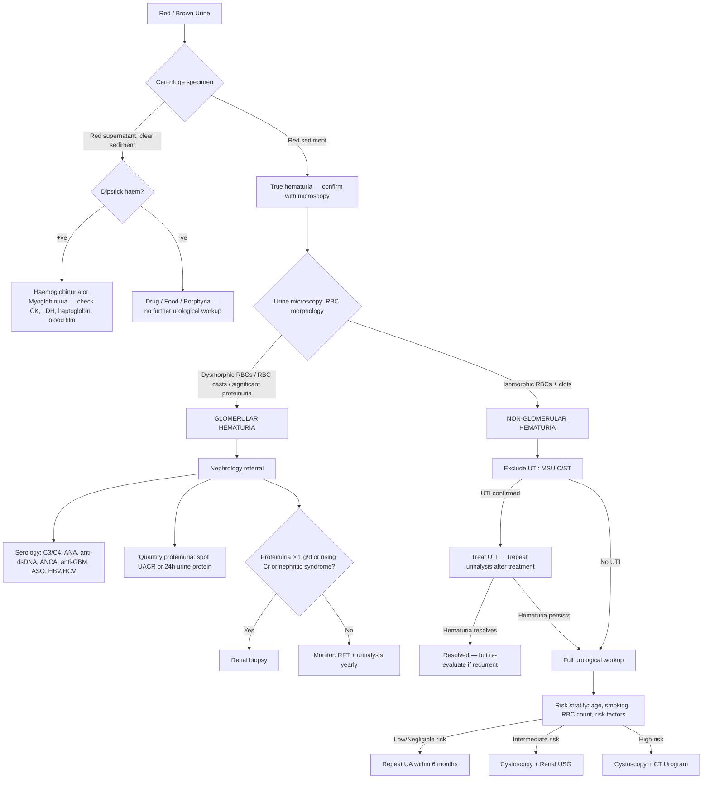
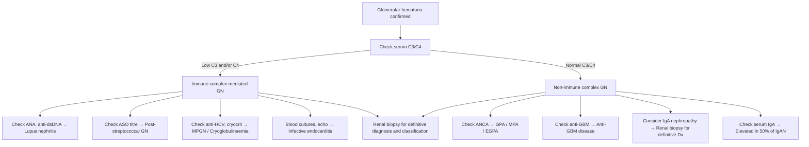

## Diagnostic Criteria, Diagnostic Algorithm and Investigation Modalities for Hematuria

### 1. Confirming True Hematuria — The Starting Point

Before launching any expensive investigation, you must first answer: **"Is this actually blood in the urine?"** This sounds obvious, but it is the critical first step that prevents unnecessary workups for pseudohematuria.

#### 1.1 Diagnostic Criteria for Hematuria

| Type | Diagnostic Criterion | Notes |
|---|---|---|
| ***Gross (visible) hematuria*** | ***Red, pink, or brown urine visible to naked eye*** confirmed by **centrifugation** (red sediment = RBCs present) [1] | ***Painless gross hematuria = MALIGNANCY UNTIL PROVEN OTHERWISE*** [1] |
| **Microscopic (non-visible) hematuria** | **≥ 3 RBC per HPF** in a centrifuged, properly collected urine specimen (freshly voided, clean-catch, midstream) [2][3] | Some guidelines require positivity on **2 out of 3** specimens to exclude transient causes [2] |

**Why centrifuge the urine?** Centrifugation separates formed elements (RBCs, WBCs, casts, crystals) from the liquid supernatant. If the **sediment** is red → RBCs are present → true hematuria. If the **supernatant** is red but sediment is clear → no intact RBCs → the colour is from dissolved pigment (haemoglobin, myoglobin, drugs). This simple step immediately separates true hematuria from pigmenturia [3].

#### 1.2 Confirming and Characterising Hematuria — The Dipstick-Microscopy-Morphology Triad

| Step | Test | What It Tells You | Key Findings |
|---|---|---|---|
| **Step 1** | **Urine dipstick** | Screening — detects the peroxidase activity of the haem moiety | +ve for "blood" (but cannot distinguish RBCs vs free Hb vs myoglobin) |
| **Step 2** | **Urine microscopy** (centrifuged specimen) | ***Confirms true hematuria*** and begins to localise source | ***≥ 3 RBC/HPF*** confirms hematuria; pyuria ( > 5 WBC/HPF) suggests infection [5] |
| **Step 3** | **RBC morphology assessment** (phase-contrast microscopy) | ***Glomerular vs non-glomerular*** — the most important branch point | ***Dysmorphic RBCs / acanthocytes / RBC casts → glomerular; Isomorphic RBCs ± clots → non-glomerular*** [3][5] |

<Callout title="Why Dysmorphic RBCs Indicate Glomerular Bleeding">
RBCs forced through small rents in a damaged GBM undergo **mechanical trauma** (deformed by the narrow passage) and then **osmotic trauma** as they travel through nephron segments with widely varying tonicity (from ~300 mOsm/kg in the proximal tubule to ~1200 mOsm/kg in the inner medulla and back). This dual insult produces characteristic **acanthocytes** — ring-shaped cells with vesicle-shaped protrusions (blebs). Finding > 5% acanthocytes among urinary RBCs has ~80% specificity for glomerular bleeding [3].

**RBC casts** are even more specific — they form when RBCs are trapped within Tamm-Horsfall protein (uromodulin) secreted by thick ascending limb cells. The cast takes the cylindrical shape of the tubular lumen. ***RBC casts are diagnostic of glomerulonephritis*** [3].
</Callout>

---

### 2. Key Urine Microscopy Findings and Their Interpretation

| Finding | Interpretation | Pathophysiology |
|---|---|---|
| ***Dysmorphic RBCs (acanthocytes)*** | ***Glomerular haematuria*** | Mechanical + osmotic trauma through damaged GBM and nephron [3] |
| ***RBC casts*** | ***Diagnostic of glomerulonephritis*** — pathognomonic for glomerular bleeding | RBCs trapped in Tamm-Horsfall protein within tubules [3] |
| ***Blood clots*** | ***ALWAYS non-glomerular*** | Heavy focal bleeding with sufficient fibrinogen; urokinase/tPA in glomeruli prevent clotting [3] |
| ***Isomorphic RBCs*** | ***Non-glomerular (urological) bleeding*** | RBCs shed directly into urinary tract without traversing GBM → retain normal shape [2][5] |
| **WBCs / pyuria ( > 5 WBC/HPF)** | Infection or inflammation | Neutrophil migration into urine in response to bacterial or inflammatory stimuli |
| **WBC casts** | Pyelonephritis or tubulointerstitial nephritis | WBCs trapped in tubular casts indicate intrarenal inflammation |
| **Granular / muddy brown casts** | Acute tubular necrosis (ATN) | Sloughed tubular epithelial cells degenerate within casts |
| **Sterile pyuria (WBCs but -ve culture)** | Renal TB, interstitial nephritis, partially treated UTI, ketamine cystitis | Inflammatory process without conventional bacterial growth on routine media [10] |
| **Crystals** | Urolithiasis (type depends on crystal morphology) | Supersaturation of specific solutes in urine |
| **Proteinuria (dipstick ≥ 1+ or UACR > 30 mg/mmol)** | Co-existent glomerular disease; quantify with spot UACR or 24h collection | GBM damage allows protein filtration alongside RBCs |

---

### 3. The Complete Investigation Panel

Once true hematuria is confirmed and characterised as glomerular vs non-glomerular, specific investigations are deployed.

#### 3.1 Urine Investigations

| Investigation | Purpose | Key Points & Interpretation |
|---|---|---|
| **Repeat dipstick** | Confirm persistence (transient hematuria is common — triggered by fever, exercise, infection, vaccination) [5] | If negative on repeat → resolved; but if risk factors for malignancy present, still consider workup |
| **Midstream urine (MSU) culture & sensitivity** | ***Exclude UTI*** — ALL patients should have culture before evaluation of hematuria [3] | +ve culture → treat, then re-evaluate; ***persistent hematuria after treating UTI requires further investigation*** [10] |
| **Early morning urine (EMU) × AFB** | ***Exclude urinary tract TB*** [5] | EMU has highest yield (concentrated, large volume); send on 3 consecutive mornings; indicated when sterile pyuria found [10] |
| ***Urine cytology*** | ***Detect malignant urothelial cells, especially high-grade TCC and carcinoma in situ (CIS)*** | ***Overall sensitivity ~50% (low for low-grade, ~64% for high-grade); very specific ( > 98%)*** [3][5]; ***requires fresh urine (cells degrade), as much volume as possible; avoid first-void EMU (↑epithelial cells — use 2nd void on 3 consecutive days)*** [5]; Interpretation: ***normal / atypical / suspicious / malignant*** [3][5]; ***atypical cytology can occur in UTI → repeat in a few weeks*** [5] |
| **Urine protein quantification** (spot UACR or 24h urine protein) | Quantify proteinuria — supports glomerular origin if significant ( > 1 g/day) | Guides need for nephrology referral and renal biopsy [8] |
| **Urine-based biomarkers** (e.g. FISH for aneuploidy 3, 7, 17 and 9p21 deletion) | ↑Sensitivity for early recurrence of urothelial CA | ***Rarely done in HK*** [5]; may complement cytology in intermediate-risk patients |

<Callout title="Urine Cytology — What It Can and Can't Do" type="idea">
***Urine cytology is ONLY useful for detecting high-grade TCC and CIS*** — it picks up abnormal cells floating off a poorly differentiated tumour surface. Low-grade papillary tumours shed cells that look almost normal → cytology misses them. This is why ***cytology can NEVER replace cystoscopy*** for diagnosing bladder cancer [5]. Think of cytology as a "surveillance net" that catches the most aggressive fish but lets the smaller ones through.
</Callout>

#### 3.2 Blood Investigations

| Investigation | Purpose | Key Findings |
|---|---|---|
| **CBC with differential** | Anaemia (chronic blood loss or malignancy); leukocytosis (infection); thrombocytopenia (bleeding disorder) [5] | NcNc anaemia → chronic disease/malignancy; microcytic → iron deficiency from chronic blood loss |
| **Clotting profile (PT/APTT)** | Screen for bleeding diathesis; pre-operative baseline [3] | Prolonged APTT → haemophilia; prolonged PT → liver disease or warfarin |
| **RFT (urea, creatinine, eGFR, electrolytes)** | Assess renal function; detect renal impairment; U:Cr ratio guides pre-renal vs intrinsic | ↑Cr with U:Cr ratio > 100:1 suggests pre-renal; ↑Cr suggests parenchymal disease or post-renal obstruction [5] |
| **Serum calcium and phosphate** | Hypercalcaemia → hyperparathyroidism (stone disease), RCC (PTHrP), myeloma | Raised calcium + low phosphate → primary hyperPTH; raised calcium + raised ALP → bone metastasis |
| **Serum uric acid** | Hyperuricaemia → uric acid stones, gout, myeloproliferative disorders | > 0.45 mmol/L in males suggests hyperuricaemia |
| **Serum PSA** (males > 50, or if prostatic symptoms/nodule) | ***Prostate-specific but NOT prostate-cancer specific*** [3] | ***PSA < 4 ng/mL = normal; PSA 4–10 = 20% chance cancer; PSA ≥ 10 = 50% chance cancer*** [3]; also raised in prostatitis, BPH, post-biopsy |
| **ESR / CRP** | Non-specific markers of inflammation | ↑ESR in GN, vasculitis, malignancy; CRP usually NOT elevated in active SLE (unless infection, serositis, or arthritis) [8] |

##### Serology Panel (If Glomerular Hematuria Suspected)

This is the "nephrological battery" — each test targets a specific disease mechanism [5][8]:

| Test | Target Disease | Interpretation |
|---|---|---|
| ***Serum complement (C3/C4)*** | ***↓C3/C4 → immune complex-mediated GN*** (MPGN, PSGN, lupus nephritis, cryoglobulinaemia, infective endocarditis); ***Normal C3/C4 → non-IC GN*** (IgAN, Goodpasture, ANCA vasculitis, PAN) [5][8] | C3/C4 is **the first branch point** in the nephrological workup |
| **ANA** | Screening for SLE | Highly sensitive but low specificity; proceed to anti-dsDNA if +ve |
| **Anti-dsDNA** | Lupus nephritis (active disease) | Titre correlates with disease activity; ↑anti-dsDNA + ↓C3/C4 = active lupus nephritis [8] |
| **ANCA (c-ANCA / PR3, p-ANCA / MPO)** | ANCA-associated vasculitis | c-ANCA/PR3 → GPA; p-ANCA/MPO → MPA or EGPA [5][8] |
| **Anti-GBM antibody** | Anti-GBM disease (Goodpasture syndrome) | +ve = diagnostic; linear IgG on renal IF confirms |
| **ASO titre (anti-streptolysin O)** | Post-streptococcal GN | ↑titre confirms recent streptococcal infection [5][8] |
| **Anti-HCV, HBsAg/HBV DNA** | HBV/HCV-associated MPGN, PAN | Guide treatment (antivirals + immunosuppression) [5][8] |
| **Cryoglobulins (cryocrit)** | Cryoglobulinaemia (often HCV-associated) | Indicated when HCV +ve or clinical features suggestive |
| **Blood cultures** | Infective endocarditis (immune complex GN) | Indicated when persistent fever + new murmur + hematuria |
| **Serum/urine protein electrophoresis** | Multiple myeloma, amyloidosis | Paraprotein band on SPE; light chains in urine |

#### 3.3 Imaging — Upper Urinary Tract

***The lecture slide [1] states that the hematuria workup for suspected upper tract pathology comprises: CTU + Flexible cystoscopy*** [1].

| Modality | What It Detects | Advantages | Disadvantages | When to Use |
|---|---|---|---|---|
| ***CT Urogram (CTU)*** — the gold standard for upper tract imaging [3][5] | ***Renal masses, urinary tract calculi, pelvicalyceal and ureteric TCC*** | ***Higher sensitivity and specificity than any other modality***; 3 phases capture all pathology [3] | Radiation; contrast nephrotoxicity; contrast allergy | ***Standard upper tract imaging in hematuria workup*** [3][5]; ***AUA high-risk group*** [1] |
| **Non-contrast CT (NCCT)** | Urinary stones (level, size, density, degree of obstruction) | No contrast needed; fast; highly sensitive for stones (~95%) [5] | Misses soft tissue lesions; radiation | When clinical suspicion is predominantly for ureteric stones (flank colic) |
| **USG kidneys** | Hydronephrosis, renal masses, cysts, bladder lesions (if large), prostate size | Non-invasive; no radiation; bedside; cheap; safe in pregnancy [3][5] | ***Cannot visualise the whole ureter*** (only proximal and distal ends); misses small urothelial lesions [2][5] | ***AUA intermediate-risk group***; pregnancy; children; screening |
| **MR Urogram (MRU)** | Upper tract anatomy; soft tissue characterisation | ***No radiation*** → safe for pregnancy, children, contrast allergy [5] | ***Less able to detect smaller urothelial lesions and non-obstructing stones***; expensive; motion artefact (kidney is a moving organ) [3][5] | ***C/I to iodinated contrast*** (allergy, renal impairment); pregnancy |
| **IV Urogram (IVU)** | Upper tract anatomy (filling defects, hydronephrosis, renal outline) | Economic; good for detecting upper tract lesions | ***Largely replaced by CTU***; insensitive for renal lesions < 3 cm; cannot detect small bladder lesions [3][5] | Limited role: trauma (5-min IVU) or when CT unavailable |
| **Retrograde pyelogram** | Ureteric and pelvicalyceal anatomy when contrast cannot be excreted | Direct contrast injection via cystoscopy → independent of renal function [3][5] | Invasive; requires cystoscopy; risk of infection | Insufficient renal function for CTU; persistent filling defect needing clarification |
| **KUB (plain AXR)** | Radio-opaque stones; kidney shadow; psoas shadow loss | Quick; cheap; no contrast | ***NOT commonly performed*** now; misses radiolucent stones (uric acid, xanthine); low sensitivity overall [3][5] | Initial screening only; follow-up of known radio-opaque stones |

##### CT Urogram (CTU) — Three Phases Explained

***CTU has three phases***, each designed to detect a specific category of pathology [5]:

| Phase | Timing | What It Detects | Why |
|---|---|---|---|
| **Non-contrast phase** | Before contrast injection | ***Urinary stones*** | Stones are high-density structures that are best seen without contrast (contrast can obscure them) |
| **Nephrographic (parenchymal) phase** | ~100 seconds post-contrast | ***Renal masses (RCC, AML)*** | Contrast enhances the renal parenchyma — tumours enhance differently from normal tissue (RCC classically enhances then washes out) |
| **Excretory (delayed) phase** | 5–15 minutes post-contrast | ***Urothelial lesions (TCC of renal pelvis, ureter)*** | Contrast is excreted into the collecting system → fills pelvicalyceal system and ureters → filling defects indicate tumour or blood clot |

#### 3.4 Imaging — Lower Urinary Tract (Cystoscopy)

***Cystoscopy is the investigation of choice for the lower urinary tract*** [5]. It is the **only** modality that allows direct visualisation of the urethra, prostate, and the **entire bladder** for malignancy and identification of the bleeding source [3].

| Feature | Details |
|---|---|
| **Types** | ***Flexible cystoscopy*** (16 Fr; under LA in outpatient setting); ***Rigid cystoscopy*** (under GA; allows washout, biopsy, TURBT) [2][5] |
| **Indication** | ***Should be done in ALL patients with gross non-glomerular hematuria*** — even if a stone is already found on KUB (because malignancy may coexist) [5] |
| **What it can detect** | ***Papillary TCC as small as 1 mm (missed by CT)***; CIS (flat velvety lesions); bladder stones; trabeculation (BOO); ureteric jet indicating upper tract bleeding source [5] |
| **Biopsy** | Allows tissue sampling for histopathology during the same procedure |
| **Ureteric jets** | Observing bloody efflux from one ureteric orifice → localises bleeding to that side's upper tract |
| **Limitations** | Cannot evaluate upper tract; requires patient cooperation (or GA for rigid scope) |

<Callout title="Key Principle" type="error">
***Despite advancing imaging and urine biomarkers, non-invasive tests alone CAN NEVER replace cystoscopy/TURBT for diagnosis of CA bladder*** [5]. A normal CT urogram does NOT exclude bladder cancer — small flat lesions (CIS) and tiny papillary tumours are invisible on cross-sectional imaging but readily seen at cystoscopy.
</Callout>

#### 3.5 Renal Biopsy (For Glomerular Hematuria)

| Feature | Details |
|---|---|
| **Indication** | Glomerular hematuria with risk factors for progressive disease: ***proteinuria > 1 g/day, rising serum creatinine, active sediment with persistent hematuria*** [3][5][8] |
| **What it provides** | Light microscopy (LM), immunofluorescence (IF), electron microscopy (EM) — the "triple stain" that gives definitive diagnosis |
| **Most common biopsy findings** in isolated glomerular hematuria | ***IgA nephropathy, Alport syndrome (hereditary nephritis), thin BM disease, non-specific GN*** [3] |
| **IF patterns** | Mesangial IgA (IgAN); linear IgG (anti-GBM); granular IgG/C3 ("lumpy-bumpy" = post-infectious GN, lupus); pauci-immune (ANCA vasculitis) |
| **Contraindications** | ***Bleeding diathesis, severe uncontrolled HTN, solitary kidney, small kidneys (chronic irreversible disease), hydronephrosis, renal/perirenal infection*** [3] |
| **When NOT needed** | Very small kidneys on USG (indicates end-stage scarring — biopsy won't change management); high clinical probability of a specific subtype (e.g. ↓↓C3/C4 + recurrent glomerular hematuria → treat empirically as proliferative lupus nephritis) [5] |

---

### 4. The Diagnostic Algorithm

The following algorithm integrates the ***AUA risk-stratified approach from the lecture slides [1]*** with the glomerular vs non-glomerular framework from the senior notes [2][5].

#### 4.1 Master Diagnostic Algorithm

#### 4.2 AUA Risk-Stratified Approach for Microscopic Hematuria

***Directly from the lecture slides [1]:***

| ***Risk Category*** | ***Criteria*** | ***Workup*** |
|---|---|---|
| ***Low/Negligible-Risk*** (ALL of the following) | ***Women < 60, Men < 40; Never smoker or < 10 pack-years; 3–10 RBC/HPF on one UA; No additional risk factors for urothelial cancer*** | ***Repeat UA within 6 months*** |
| ***Intermediate-Risk*** (ONE or more) | ***Women ≥ 60, Men 40–59; 10–30 pack-years; 11–25 RBC/HPF on one UA; ≥ 1 additional risk factor for urothelial cancer; Previously low/negligible-risk with no prior evaluation and 3–25 RBC/HPF on repeat UA*** | ***Cystoscopy and renal ultrasound; Clinicians may offer urine cytology or validated urine-based tumour markers (UBTMs) to facilitate decision regarding cystoscopy; Repeat UA within 12 months if cystoscopy not performed*** |
| ***High-Risk*** (ONE or more) | ***Men ≥ 60; > 30 pack-years; > 25 RBC/HPF on one UA; History of gross hematuria; ≥ 1 additional risk factor for urothelial cancer plus any high-risk feature*** | ***Cystoscopy and axial upper tract imaging (CT urogram)*** |

> ***Note from the lecture slide: Women should not be categorised as high-risk based on age alone*** [1]. This reflects the lower baseline incidence of bladder cancer in women.

#### 4.3 Gross Hematuria — Immediate Workup

***All patients with gross hematuria*** require urgent evaluation regardless of risk factors:
- ***Cystoscopy*** (mandatory — even if stone found on imaging) [5]
- ***Upper tract imaging*** — CTU is standard [1][3]
- ***Urine cytology × 3*** [5]
- ***If cystoscopy negative but cytology positive → suspect upper tract TCC → CT urogram or ureteroscopy*** [5]

***For upper tract TCC specifically, the lecture slide [1] states: "Hematuria work up: CTU + Flexible cystoscopy; Ureteroscopy + biopsy"*** [1].

#### 4.4 When to Refer to Nephrology vs Urology

***The following conditions warrant nephrology referral*** [5]:

| Referral to Nephrology | Reason |
|---|---|
| Urological cause excluded by cystoscopy + imaging | Glomerular origin likely |
| Evidence of ↓GFR or CKD (eGFR < 30 mL/min) | Renal parenchymal disease requires nephrological management |
| Significant proteinuria (UACR > 30 mg/mmol or > 500 mg/day) | Suggests glomerular pathology |
| Young patient ( < 40 y) with HTN and isolated hematuria | May indicate early glomerular disease requiring biopsy |
| Visible hematuria with intercurrent URTI | Suggests IgA nephropathy |

***If urological cancer is ruled out and no glomerular features → treat as CKD: monitor RFT and urinalysis yearly*** [2].

---

### 5. Approach to Glomerulonephritis Workup — The Complement-Serology Framework

When glomerular hematuria is confirmed, the ***complement level is the key initial branch point*** [5][8]:

| Complement Level | Differential Diagnoses | Key Serological Tests |
|---|---|---|
| ***↓C3/C4*** | ***MPGN, PSGN, lupus nephritis, cryoglobulinaemia, infective endocarditis, shunt nephritis*** [5][8] | ANA, anti-dsDNA, ASO titre, anti-HCV/HBV, cryocrit, blood cultures |
| ***Normal C3/C4*** | ***IgA nephropathy, Goodpasture (anti-GBM), HSP/IgA vasculitis, ANCA-associated vasculitis (GPA, MPA, EGPA), PAN*** [5][8] | ANCA (c-ANCA/PR3, p-ANCA/MPO), anti-GBM antibody |

---

### 6. Summary of Investigation Findings by Diagnosis

| Diagnosis | Urine Microscopy | Urine Culture | Cytology | Key Blood Test | Key Imaging | Gold Standard |
|---|---|---|---|---|---|---|
| **UTI** | WBCs, bacteria, ± RBCs | +ve (specific organism) | Not indicated | CBC (↑WBC) | Not usually needed (USG if complicated) | Urine C/ST |
| **Bladder cancer** | Isomorphic RBCs ± clots | -ve | ***Suspicious/Malignant (esp. high-grade/CIS)*** | — | CTU (filling defect) | ***Cystoscopy + TURBT + biopsy*** [5] |
| **RCC** | Isomorphic RBCs | -ve | May show malignant cells | ↑Ca, ↑EPO, ↑LDH | ***CTU (enhancing renal mass)*** | CT-guided biopsy or surgical excision |
| **Upper tract TCC** | Isomorphic RBCs | -ve | May show malignant cells | — | ***CTU (filling defect in ureter/pelvis)*** | ***Ureteroscopy + biopsy*** [1] |
| **Ureteric stone** | RBCs ± crystals | -ve | Not indicated | ↑Ca, ↑urate | ***NCCT (hyperdense focus with proximal dilatation)*** | NCCT |
| **IgA nephropathy** | Dysmorphic RBCs, RBC casts | -ve | Not indicated | ↑serum IgA (50%), normal C3/C4 | USG kidneys (usually normal) | ***Renal biopsy (mesangial IgA on IF)*** |
| **Lupus nephritis** | Dysmorphic RBCs, RBC casts | -ve | Not indicated | ↑ANA, ↑anti-dsDNA, ↓C3/C4 | USG kidneys | ***Renal biopsy (ISN/RPS classification)*** |
| **ANCA vasculitis** | Dysmorphic RBCs, RBC casts | -ve | Not indicated | +ve ANCA (PR3 or MPO) | CXR/CT thorax (pulmonary infiltrates) | ***Renal biopsy (pauci-immune crescentic GN)*** |
| **BPH** | RBCs (usually few) | -ve | -ve | PSA > 1.5 (predictor of volume) | USG (prostate volume, PVR) | ***Diagnosis of exclusion*** after malignancy ruled out |
| **Renal TB** | WBCs (sterile pyuria), RBCs | ***-ve on routine culture, +ve on AFB/BACTEC*** | — | — | Calcified "putty kidney" on imaging | ***EMU × AFB culture (gold standard)*** |

---

<Callout title="High Yield Summary">

**Step 1 — Confirm true hematuria:** Centrifuge → red sediment = true hematuria; red supernatant + dipstick +ve = haemoglobinuria/myoglobinuria; red supernatant + dipstick -ve = drug/food/porphyria.

**Step 2 — Characterise:** Urine microscopy → dysmorphic RBCs / RBC casts = glomerular → nephrology. Isomorphic RBCs ± clots = non-glomerular → urology.

**Step 3 — Exclude UTI first** (MSU C/ST). If hematuria persists after treating UTI → full workup.

**Step 4 — Risk stratify** (AUA 2020 for microscopic hematuria): Low → repeat UA in 6 months; Intermediate → cystoscopy + renal USG; High → cystoscopy + CT urogram.

**Gross hematuria:** Always gets full workup — cystoscopy + CTU ± urine cytology × 3.

**CTU has 3 phases:** Non-contrast (stones), nephrographic (renal masses), excretory (urothelial lesions).

**Cystoscopy:** Only modality that can detect papillary TCC as small as 1 mm and CIS. Non-invasive tests CANNOT replace cystoscopy for bladder CA diagnosis.

**Urine cytology:** High specificity ( > 98%) but low sensitivity (~50% overall); best for high-grade TCC and CIS; send fresh, 2nd void, 3 consecutive days.

**Glomerular workup:** Complement (C3/C4) is the branch point → ↓complement = IC-mediated GN (lupus, PSGN, MPGN); normal complement = non-IC GN (IgAN, ANCA vasculitis, anti-GBM). Renal biopsy for definitive diagnosis.

**Renal biopsy indications:** Proteinuria > 1 g/day, rising creatinine, active sediment with persistent hematuria.

**Refer to nephrology when:** Urological cause excluded, ↓GFR, significant proteinuria, young + HTN + isolated hematuria, visible hematuria with URTI.

</Callout>

---

<ActiveRecallQuiz
  title="Active Recall - Diagnosis and Investigation of Hematuria"
  items={[
    {
      question: "A patient has a positive urine dipstick for blood. After centrifugation, the supernatant is red but the sediment is clear. What are the two main diagnostic possibilities and how do you distinguish between them?",
      markscheme: "Possibilities: haemoglobinuria (intravascular haemolysis) or myoglobinuria (rhabdomyolysis). Both have positive dipstick haem because the haem moiety reacts with the peroxidase on the dipstick strip. No intact RBCs are present — hence clear sediment. Distinguish by checking serum CK (markedly elevated in rhabdomyolysis), serum haptoglobin (decreased in haemolysis), LDH (elevated in both but more so in haemolysis), blood film (fragmented RBCs in intravascular haemolysis)."
    },
    {
      question: "Name the three phases of CT urogram and state what each phase is designed to detect.",
      markscheme: "1) Non-contrast phase: detects urinary stones (high density structures best seen without contrast). 2) Nephrographic/parenchymal phase (~100 seconds post-contrast): detects renal parenchymal masses (RCC, AML — tumours enhance differently from normal tissue). 3) Excretory/delayed phase (5-15 min post-contrast): detects urothelial lesions (TCC of renal pelvis/ureter — contrast fills collecting system revealing filling defects)."
    },
    {
      question: "Why must cystoscopy be performed in ALL patients with gross non-glomerular hematuria even if a stone is already found on imaging?",
      markscheme: "Because malignancy may coexist with a stone. A stone does not exclude bladder cancer. Cystoscopy is the only modality that can detect small papillary TCC (as small as 1 mm — missed by CT) and flat CIS lesions. Non-invasive tests can NEVER replace cystoscopy for diagnosis of bladder cancer."
    },
    {
      question: "In the workup of glomerular hematuria, what is the significance of serum complement (C3/C4) levels? Give 3 examples of low-complement and 3 examples of normal-complement glomerulonephritis.",
      markscheme: "Complement level is the key initial branch point. Low C3/C4 indicates immune complex-mediated GN: (1) post-streptococcal GN, (2) lupus nephritis, (3) MPGN/cryoglobulinaemia. Normal C3/C4 indicates non-immune complex GN: (1) IgA nephropathy, (2) ANCA-associated vasculitis (GPA/MPA), (3) anti-GBM disease (Goodpasture). Low complement means the classical or alternative complement pathway is being consumed by immune complex deposition."
    },
    {
      question: "List the AUA risk stratification categories for microscopic hematuria with the recommended workup for each.",
      markscheme: "Low/Negligible risk (women <60, men <40, never/<10 pack-years, 3-10 RBC/HPF, no risk factors): repeat UA in 6 months. Intermediate risk (women >=60, men 40-59, 10-30 pack-years, 11-25 RBC/HPF, >=1 risk factor): cystoscopy + renal ultrasound, may offer urine cytology or UBTMs. High risk (men >=60, >30 pack-years, >25 RBC/HPF, history of gross hematuria, risk factors + high-risk feature): cystoscopy + axial upper tract imaging (CT urogram)."
    },
    {
      question: "A patient with hematuria has sterile pyuria on urine microscopy. What three diagnoses must you consider and what specific investigation is needed for each?",
      markscheme: "1) Renal/urinary tract TB: send early morning urine (EMU) x3 for AFB smear and culture. 2) Urolithiasis (especially with urease-producing organisms): NCCT for stones. 3) Ketamine cystitis: drug history for ketamine use; cystoscopy may show contracted bladder. Also consider partially treated UTI (repeat culture), interstitial nephritis (drug history, eosinophiluria), and interstitial cystitis (diagnosis of exclusion)."
    }
  ]}
/>

---

## References

[1] Lecture slides: GC 183. Common urological malignancies and their presentations - Nov 7.pdf (p3, p6, p13, p27)
[2] Senior notes: maxim.md (Section 2.1 — Haematuria)
[3] Senior notes: felixlai.md (Section: Hematuria — Diagnosis)
[5] Senior notes: Ryan Ho Urogenital.pdf (p133, p134, p135, p153)
[7] Senior notes: Ryan Ho Fundamentals.pdf (p343, p344, p345)
[8] Senior notes: Ryan Ho Fundamentals.pdf (p360); Ryan Ho Urogenital.pdf (p55, p63, p88)
[10] Lecture slides: GC 210. Urinary tract infection.pdf (p69 — Red flags)
