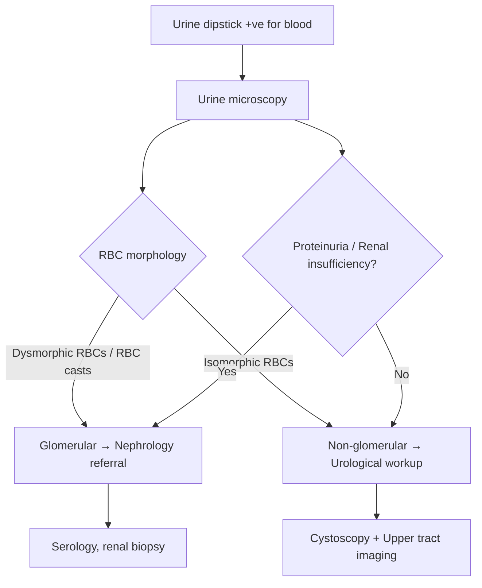

# Hematuria

## 1. Definition

**Hematuria** — from Greek *haima* (blood) + *ouron* (urine) — literally means "blood in the urine." It is not a diagnosis in itself but a **sign** that demands systematic evaluation to identify the underlying cause. Think of it as an alarm bell: sometimes it's a false alarm (pseudohematuria), sometimes a house fire (malignancy).

### 1.1 Gross (Macroscopic) Hematuria

- **Visible** red, pink, or brown discolouration of urine detectable by the naked eye [1][2]
- ***Painless gross hematuria in an adult should be regarded as a symptom of malignancy until proven otherwise*** and demands immediate urological examination [1][2]
  - ***Most common cause of gross hematuria in patients ≥ 50 is bladder cancer*** [1]
- **Gross hematuria with passage of blood clots ALWAYS indicates NON-glomerular (i.e. urological) bleeding** [1]
  - **Why?** Blood clots require heavy, focal bleeding where whole blood is shed into urine in amounts sufficient to support clot formation. Glomerular bleeding is a diffuse capillary process — minute quantities of blood are added to a relatively large volume of glomerular filtrate. Additionally, urokinase and tissue-type plasminogen activator (tPA) present in glomeruli and tubules actively lyse any nascent clots [1][2]

> **Key point:** Red/brown urine does NOT automatically mean hematuria. It could be pigmenturia. After centrifugation:
> - **Red sediment** → confirms true hematuria (RBCs pellet down)
> - **Red supernatant** → test with dipstick haem:
>   - **Positive** → haemoglobinuria (intravascular haemolysis) or myoglobinuria (rhabdomyolysis)
>   - **Negative** → drug-induced discolouration (e.g. rifampicin, phenazopyridine/pyridium, phenytoin, beetroot) or acute intermittent porphyria [1]

### 1.2 Microscopic Hematuria

- **Not visible** to the naked eye; detected on urine sediment examination or dipstick
- Defined as **≥ 3 RBC per high-power field (HPF)** in a properly collected, centrifuged urine specimen [1][2]
  - Some guidelines require this finding in **2 out of 3** properly collected specimens (freshly voided, clean-catch, midstream) [2]
- **Dipstick haem** can detect as few as 1–2 RBC/HPF → as sensitive as microscopy but prone to **false positives** [1]:
  - Myoglobinuria (rhabdomyolysis — myoglobin has a haem moiety that reacts with the dipstick peroxidase)
  - Haemoglobinuria (intravascular haemolysis)
  - Post-menstrual contamination
  - Post-ejaculation
  - Concentrated/alkaline urine, oxidising agents (e.g. povidone-iodine)
- ***All haem-positive dipstick results should be confirmed with microscopic examination*** [1][2]

<Callout title="Common Exam Pitfall" type="error">
Students often equate "positive urine dipstick for blood" with "hematuria." This is wrong. Dipstick detects the peroxidase-like activity of haemoglobin — it cannot distinguish between intact RBCs (true hematuria), free haemoglobin (haemoglobinuria), and myoglobin (myoglobinuria). Always confirm with urine microscopy.
</Callout>

---

## 2. Epidemiology

### 2.1 Prevalence
- **Microscopic hematuria** is extremely common — prevalence ranges from 0.2% to 31% in the general population depending on the population studied and the threshold used [5]
- **Gross hematuria** is less common but carries a higher probability of significant pathology (up to 20–25% harbour a urological malignancy) [3]
- In asymptomatic young adults, isolated microscopic hematuria often has no identifiable cause — **only ~1.9% have significant urological pathology** [5]

### 2.2 Age and Sex Distribution
- ***Men and older patients (especially > 35–40 years)*** have a significantly higher risk that hematuria represents malignancy [3][5]
- In younger women, the most common cause is UTI; in older men, BPH, stones, and malignancy dominate
- ***Presence of otherwise unexplained hematuria indicates urothelial cancer in individuals over age 40 until proven otherwise*** [3]

### 2.3 Hong Kong Context
- **Bladder cancer:** incidence ~5–6 per 100,000; male predominance (M:F ≈ 3:1), median age at diagnosis ~70 years [3]
- **Renal cell carcinoma:** incidence 4.8 per 100,000, mortality 1.6 per 100,000 in HK; M > F = 1.5:1 [5]
- **Prostate cancer:** incidence 56.6 per 100,000 males in HK (3rd most common male cancer); increasing due to ageing population and westernised lifestyle [5]
- **Urinary stones:** affect ~10% of the population; M:F = 3:1; recurrence rate ~10% per year [2][4]
- **UTI** remains the single most common cause of hematuria overall (~60%) [2]
- Relevant Hong Kong-specific exposures: **aristolochic acid** in traditional Chinese medicine (TCM) → urothelial carcinoma of upper tract [3][5]

---

## 3. Risk Factors

Understanding risk factors is crucial because they guide the urgency and extent of workup.

### 3.1 Risk Factors for Urological Malignancy (the "can't-miss" diagnosis)
| Risk Factor | Mechanism / Explanation |
|---|---|
| ***Smoking*** (strongest modifiable RF) | Aromatic amines and polycyclic aromatic hydrocarbons are filtered by the kidney and concentrated in urine → prolonged contact with urothelium [3][5] |
| ***Occupational chemical exposure*** — rubber, dye, textile, plastics, petroleum, organic solvents, hairdressing | Same aromatic amine carcinogens (e.g. 2-naphthylamine, benzidine) [2][3] |
| ***Age > 35–40 years*** | Cumulative DNA damage; cancer incidence rises exponentially with age |
| ***Male sex*** | Hormonal factors (androgen receptor in urothelium), higher smoking rates historically [3] |
| ***Aristolochic acid exposure (TCM)*** | Causes DNA adducts → characteristic TP53 mutations → upper tract urothelial carcinoma (particularly relevant in HK/Taiwan) [5] |
| ***Cyclophosphamide / ifosfamide exposure*** | Acrolein metabolite is directly toxic to urothelium → haemorrhagic cystitis → ↑risk of bladder cancer [5] |
| ***Prior pelvic irradiation*** | Radiation-induced DNA damage in urothelium; latency period of several years [5] |
| ***Chronic UTI / chronic indwelling catheter*** | Chronic inflammation → squamous metaplasia → SCC of bladder (classically associated with schistosomiasis in endemic areas) |
| ***Analgesic abuse (phenacetin)*** | Renal papillary necrosis + urothelial carcinoma |
| ***FHx of RCC*** (but NOT urothelial CA) | Hereditary syndromes: VHL, hereditary papillary RCC, tuberous sclerosis [5] |

### 3.2 Risk Factors for Non-Malignant Causes
| Risk Factor | Associated Condition |
|---|---|
| ***FHx of kidney disease*** | Polycystic kidney disease, Alport syndrome, thin basement membrane disease |
| Dehydration, high protein/oxalate/sodium diet, low calcium diet | Urinary stones [4] |
| Recent URTI (1–3 days prior) | IgA nephropathy ("synpharyngitic hematuria") |
| ***Antiplatelet / anticoagulant use*** | ***Not a satisfactory explanation for hematuria (except in warfarin overdose)*** — these drugs unmask an underlying lesion rather than cause bleeding de novo [2] |
| Strenuous exercise | Exercise-induced hematuria (marathon runners, contact sports) [5] |
| TB exposure | Renal/urinary TB → sterile pyuria + hematuria |

<Callout title="Important" type="error">
***Antiplatelet or anticoagulant use is NOT a satisfactory explanation for hematuria, except in the setting of warfarin overdose (supratherapeutic INR).*** These drugs do not cause bleeding from a normal urinary tract — they simply lower the threshold for an existing lesion to bleed. A full workup is still required [2].
</Callout>

---

## 4. Anatomy and Function — The Urinary Tract as a "Map" for Hematuria

Understanding the anatomy is essential because the **location of bleeding** determines the differential diagnosis, clinical features, and investigation strategy.

### 4.1 Upper Urinary Tract
| Structure | Function | Relevance to Hematuria |
|---|---|---|
| **Kidney parenchyma** — glomeruli, tubules, interstitium | Filtration, reabsorption, secretion | Glomerulonephritis → dysmorphic RBCs (squeezed through damaged GBM); RCC → invasion of collecting system; AML → rupture of abnormal vessels |
| **Renal pelvis** — lined by urothelium (transitional epithelium) | Collects urine from calyces | Urothelial carcinoma (TCC); stones impacting at PUJ |
| **Ureter** — 25–30 cm, lined by urothelium | Transports urine via peristalsis | Stones lodge at 3 anatomical narrowings: ***PUJ (pelvi-ureteric junction), pelvic brim (crossing common iliac artery), VUJ (vesico-ureteric junction)*** [4]; ureteric TCC |

### 4.2 Lower Urinary Tract
| Structure | Function | Relevance to Hematuria |
|---|---|---|
| **Bladder** — lined by urothelium | Stores urine (capacity ~400–500 mL) | ***Bladder cancer*** (most common urinary malignancy); cystitis (bacterial, viral, radiation, chemical); bladder stones |
| **Prostate** (males) — surrounds prostatic urethra | Secretory gland | ***BPH*** (prostatic veins become congested and bleed); prostate cancer |
| **Urethra** — prostatic, membranous, bulbar, penile (males); short in females | Conducts urine to exterior | UTI; urethritis; trauma; urethral cancer (rare) |

### 4.3 The Glomerulus — Why It Matters

The glomerular capillary wall consists of three layers:
1. **Fenestrated endothelium** — large pores (70–100 nm)
2. **Glomerular basement membrane (GBM)** — the main filtration barrier (negatively charged, ~300 nm thick)
3. **Podocyte foot processes** with slit diaphragms

When the GBM is damaged (e.g. IgA nephropathy, Alport syndrome), RBCs are forced through small defects under the pressure gradient (ΔP ~10 mmHg). As they squeeze through, they become **dysmorphic** — losing their normal biconcave shape and developing blebs, budding, and irregular contours. This is the basis for using **phase-contrast microscopy** to distinguish **glomerular (dysmorphic RBCs, RBC casts)** from **non-glomerular (isomorphic/normal RBCs)** hematuria [2][5].

> **RBC casts** form when RBCs become trapped in Tamm-Horsfall protein (uromodulin) casts within the renal tubules. Their presence is **pathognomonic for glomerular bleeding**.

---

## 5. Etiology (Focus on Hong Kong)

The causes of hematuria can be systematically organised by anatomical location along the urinary tract. This mirrors how you should think on a ward round: "Where is the blood coming from?"

### 5.1 Anatomical Classification of Causes

***The lecture slide [1] provides the definitive framework:***

| ***Site*** | ***Benign Causes*** | ***Malignant Causes*** |
|---|---|---|
| ***Kidney*** | ***Stone, AML, infection, trauma, polycystic kidney, nephrological/medical causes*** | ***Renal cell carcinoma*** |
| ***Ureter*** | ***Stone*** | ***TCC (urothelial carcinoma)*** |
| ***Bladder*** | ***Infection, stone, irradiation cystitis*** | ***Bladder cancer*** |
| ***Prostate*** | ***BPH*** | ***Prostate cancer*** |
| ***Urethra*** | ***Infection*** | ***Urethral cancer*** |

### 5.2 Expanded Etiology with Pathophysiology

#### A. Glomerular Causes (Medical/Nephrological)
These produce hematuria because the glomerular filtration barrier is damaged.

| Cause | Pathophysiology | Key Features |
|---|---|---|
| **IgA nephropathy** (most common GN worldwide) | Mesangial IgA deposition → complement activation → mesangial proliferation → GBM damage | "Synpharyngitic" hematuria (occurs 1–3 days after URTI, cf. post-streptococcal GN which has 2–3 week latency); episodic gross hematuria in young adults |
| **Thin basement membrane disease** (benign familial hematuria) | Uniformly thin GBM (< 250 nm vs normal ~300–400 nm); autosomal dominant COL4A3/4 mutations | Persistent microscopic hematuria, normal renal function, excellent prognosis |
| **Alport syndrome** | Defective type IV collagen (X-linked COL4A5 most common) → progressive GBM splitting and thickening | Hematuria + sensorineural deafness + anterior lenticonus; progressive CKD in males |
| **Post-infectious GN** | Immune complex deposition (subepithelial "humps") 2–3 weeks after Group A Streptococcus → complement activation | Nephritic syndrome: hematuria, HTN, oedema, ↓C3 |
| **Lupus nephritis** | Anti-dsDNA immune complexes deposit in glomeruli → complement activation → proliferative/membranous GN | Part of systemic SLE; proteinuria + hematuria + active sediment |
| **ANCA-associated vasculitis** (GPA, MPA, EGPA) | Pauci-immune necrotising GN → crescentic GN | Rapidly progressive GN; **pulmonary-renal syndrome** (haemoptysis + hematuria) |
| **Anti-GBM disease** (Goodpasture syndrome) | Autoantibodies against type IV collagen α3 chain in GBM → linear IgG deposition → crescentic GN | Pulmonary haemorrhage + rapidly progressive renal failure |

#### B. Non-Glomerular Renal Causes

| Cause | Pathophysiology |
|---|---|
| **Renal cell carcinoma** | Tumour invades renal collecting system → direct vascular erosion → hematuria (classically painless gross hematuria; now often incidental on imaging) [5] |
| **Polycystic kidney disease (ADPKD)** | Cyst rupture into the collecting system; cyst haemorrhage; associated renal stones |
| **Renal AML (angiomyolipoma)** | Abnormal blood vessels within the tumour lack elastic lamina → prone to aneurysm formation and spontaneous rupture → haemorrhage |
| **Renal infarction** | Embolism (e.g. AF, endocarditis) to renal artery → tissue necrosis → hematuria + acute flank pain |
| **Papillary necrosis** | Ischaemic necrosis of renal papillae (diabetes, NSAIDs, sickle cell, analgesic nephropathy) → sloughed papillae pass into collecting system |
| **Renal vein thrombosis** | Venous congestion → haemorrhagic infarction of kidney → hematuria + flank pain (associated with nephrotic syndrome, especially membranous nephropathy) |
| **Renal TB** | Caseous necrosis destroys renal parenchyma → cavitation communicates with collecting system → hematuria + **sterile pyuria** |

#### C. Ureteric Causes

| Cause | Pathophysiology |
|---|---|
| **Ureteric stones** | Stone abrades the urothelium as it passes → mucosal injury → hematuria; stones lodge at the 3 narrowings (PUJ, pelvic brim, VUJ) [4] |
| **Urothelial carcinoma of ureter** | Malignant urothelium invades submucosal vessels; ***field cancerization concept*** — multifocal occurrence is characteristic [3] |

#### D. Bladder Causes

| Cause | Pathophysiology |
|---|---|
| ***Bladder cancer*** (most common urinary malignancy) | Malignant urothelium is friable and highly vascularised → bleeds easily; typically ***painless gross hematuria*** [1][3] |
| **Bacterial cystitis** | Inflammation of bladder mucosa → mucosal hyperaemia and erosion → hematuria (usually with dysuria, frequency, urgency) |
| **Bladder stones** | Mechanical irritation of bladder mucosa → mucosal abrasion; often associated with BOO (BPH, neurogenic bladder) |
| ***Irradiation cystitis*** | ***Usually delayed for a few years after irradiation for pelvic malignancies*** (cervical CA, colorectal CA); radiation-induced endothelial damage → obliterative endarteritis → mucosal ischaemia and telangiectasia → bleeding [5] |
| ***Haemorrhagic cystitis*** | ***Viral cystitis (BK virus in immunocompromised), drug-related (cyclophosphamide, ifosfamide)*** → acrolein metabolite is directly toxic to urothelium [5] |

#### E. Prostatic Causes

| Cause | Pathophysiology |
|---|---|
| ***BPH*** | Hyperplastic prostatic tissue has increased vascularity (especially periurethral submucosal veins); venous congestion → fragile vessels bleed → hematuria (typically terminal) [1] |
| ***Prostate cancer*** | Locally advanced tumour invades bladder neck/urethra → vascular erosion → hematuria |
| **Prostatitis** | Inflammation and infection → mucosal hyperaemia → hematuria (associated with perineal pain, dysuria) |

#### F. Urethral Causes

| Cause | Pathophysiology |
|---|---|
| **Urethritis** (gonococcal, chlamydial) | Mucosal inflammation → initial-stream hematuria |
| **Urethral trauma** | Direct injury → blood at urethral meatus (classically with pelvic fracture → membranous urethral injury) |
| ***Urethral cancer*** (rare) | Malignant erosion of urethral mucosa [1] |

#### G. Systemic / Other Causes

| Cause | Pathophysiology |
|---|---|
| **Haemophilia / coagulation disorders** | Deficient clotting factors → spontaneous bleeding into urinary tract (hematuria is common in severe haemophilia but not associated with ↓renal function) [6] |
| **Sickle cell disease / trait** | Sickling in vasa recta of renal medulla → papillary necrosis + renal medullary carcinoma |
| **Exercise-induced hematuria** | ***Follows strenuous exercise and resolves after rest; cause unknown — may be friction abrasion of collapsed bladder with dehydration during running*** [5] |
| **Endometriosis of urinary tract** | Ectopic endometrial tissue on bladder/ureter → cyclical hematuria coinciding with menses |
| **Loin pain-hematuria syndrome** | Poorly understood; likely renal vascular — recurrent flank pain + hematuria, diagnosis of exclusion |
| **Nutcracker syndrome** | Left renal vein compression between aorta and SMA → venous hypertension → rupture of thin-walled veins into collecting system → hematuria |
| **Arteriovenous malformations** | Abnormal high-pressure arteriovenous communications in kidney → rupture → gross hematuria |

### 5.3 "Pseudohematuria" — Conditions That Mimic Hematuria

| Cause | Mechanism | How to Differentiate |
|---|---|---|
| Haemoglobinuria | Intravascular haemolysis releases free Hb into plasma → exceeds haptoglobin binding capacity → filtered by glomeruli | Dipstick +ve for haem, but **no RBCs** on microscopy; red supernatant after centrifugation |
| Myoglobinuria | Rhabdomyolysis releases myoglobin → filtered by glomeruli | Same as above; check CK, LDH |
| Drug-induced red urine | Rifampicin, phenazopyridine, nitrofurantoin, metronidazole, beetroot, blackberries | Dipstick **negative** for haem; no RBCs on microscopy |
| Acute intermittent porphyria | Excess porphobilinogen in urine → darkens on standing | Port-wine colour; Watson-Schwartz test positive |
| Menstrual contamination | Vaginal blood contaminates urine sample | Repeat midstream specimen away from menses |

---

## 6. Classification

### 6.1 By Visibility
| Type | Definition |
|---|---|
| **Gross (macroscopic)** | Visible to naked eye |
| **Microscopic** | ≥ 3 RBC/HPF on urine microscopy; not visible |

### 6.2 By Source — Glomerular vs Non-Glomerular (Urological)

This is the single most important initial classification because it determines whether the patient is referred to **nephrology** or **urology**.

| Feature | Glomerular | Non-Glomerular (Urological) |
|---|---|---|
| **RBC morphology** | ***Dysmorphic RBCs*** (acanthocytes — "Mickey Mouse ears") | ***Isomorphic (normal) RBCs*** |
| **RBC casts** | Present (pathognomonic) | Absent |
| **Blood clots** | Absent (urokinase/tPA in glomeruli lyse clots) | May be present |
| **Colour** | Brown/cola/tea-coloured ("smoky") | Bright red or pink |
| **Proteinuria** | Often present (> 500 mg/day or albumin-predominant) | Usually absent or mild |
| **Timing in stream** | Throughout | May be initial, terminal, or throughout |
| **Pain** | Usually painless (except rapidly progressive GN) | Variable (stones = painful; malignancy = painless) |

### 6.3 By Timing in Urinary Stream

***The lecture slide [1] notes this is "unreliable in predicting location"*** but remains a useful guide:

| Timing | Likely Source | Rationale |
|---|---|---|
| ***Initial stream*** | ***Anterior urethra (distal to urogenital diaphragm)*** [5] | Blood is flushed out at the start before bladder urine dilutes it |
| ***Terminal stream*** | ***Bladder neck or posterior urethra*** [5] | Detrusor contraction at the end of micturition squeezes blood from the bladder base/prostatic urethra |
| ***Throughout*** | ***Bladder and upper urinary tract*** [5] | Blood is mixed uniformly with stored urine |

### 6.4 Risk Stratification for Microscopic Hematuria (AUA 2020 Guidelines)

***The lecture slide [1] presents the AUA risk-stratified approach for macroscopic hematuria evaluation:***

| ***Risk Category*** | ***Criteria (all must be met for low/negligible)*** | ***Recommended Evaluation*** |
|---|---|---|
| ***Low/Negligible-Risk*** | ***Women < 60, Men < 40; Never smoker or < 10 pack-years; 3–10 RBC/HPF on one UA; No additional risk factors for urothelial cancer*** | ***Repeat UA within 6 months*** |
| ***Intermediate-Risk*** | ***Women ≥ 60, Men 40–59; 10–30 pack-years; 11–25 RBC/HPF on one UA; ≥1 additional risk factor for urothelial cancer; Previously low-risk with no prior evaluation and 3–25 RBC/HPF on repeat UA*** | ***Cystoscopy and renal ultrasound; Clinicians may offer urine cytology or validated UBTMs; Repeat UA within 12 months if cystoscopy not performed*** |
| ***High-Risk*** | ***Men ≥ 60; > 30 pack-years; > 25 RBC/HPF on one UA; History of gross hematuria; ≥1 additional risk factor for urothelial cancer plus any high-risk feature*** | ***Cystoscopy and axial upper tract imaging (CT urogram)*** |

### 6.5 By Aetiology
- **Urological** (surgical): stones, tumours, BPH, infection, trauma
- **Nephrological** (medical): glomerulonephritis, tubulointerstitial nephritis, vascular

---

## 7. Clinical Features

The clinical approach to hematuria centres on a thorough history and physical examination to localise the source and narrow the differential. ***The lecture slide [1] emphasises:***
- ***Painless vs painful***
- ***Exclude conditions that mimic hematuria***
- ***Timing (early/whole/end stream — unreliable in predicting location)***
- ***Presence of blood clot (severe bleeding, clot retention)***
- ***Associated symptoms: loin pain / fever / stone passage / constitutional symptoms***
- ***Risk factors of malignancies: smoking / occupation / exposure to chemicals / family history***
- ***Drugs: antiplatelets / anticoagulants***

### 7.1 Symptoms

#### A. Hematuria Characteristics

| Symptom | Pathophysiological Basis | Points Towards |
|---|---|---|
| **Painless gross hematuria** | Malignant tissue is friable and richly vascular → bleeds without causing pain (no capsular stretch, no ureteric obstruction initially) | ***Malignancy*** (bladder CA, RCC, prostate CA) — "painless gross hematuria in > 35 y/o = malignancy until proven otherwise" [2][5] |
| **Painful hematuria** | Pain arises from capsular distension (pyelonephritis, renal infarction), ureteric obstruction (stone), or bladder inflammation (cystitis) | Stones, infection, renal infarction |
| **Brown/cola/tea-coloured urine** | Haemoglobin is oxidised to methaemoglobin as it traverses the nephron → dark brown colour | Glomerular hematuria |
| **Bright red urine** | Fresh blood has not been altered by passage through the nephron → retains its red colour | Non-glomerular (urological) hematuria |
| ***Blood clots*** | ***Indicates severe bleeding; risk of clot retention (clots obstruct bladder outlet → acute urinary retention)*** [1] | Always urological; never glomerular |
| **Worm-like/vermiform clots** | Clots form in the shape of the ureter as blood passes down | Upper tract bleeding (renal/ureteric) |

#### B. Associated Urinary Symptoms

| Symptom | Pathophysiological Basis | Points Towards |
|---|---|---|
| ***Irritative LUTS: frequency, urgency, nocturia, urge incontinence*** | ***Storage problem*** — bladder mucosa irritation by inflammation, tumour, or stone triggers afferent nerve firing → detrusor overactivity | ***Cystitis, bladder stone, CA bladder*** [5] |
| ***Obstructive LUTS: hesitancy, weak stream ± straining, terminal dribbling, incomplete emptying*** | ***Voiding problem*** — mechanical obstruction of bladder outlet compresses the urethra | ***BPH, CA prostate, urethral strictures*** [5] |
| ***Dysuria*** (painful urination) | ***Indicates ongoing infection or inflammation*** — inflamed urethral/bladder mucosa is stimulated during urine flow | ***UTI*** [5] |
| **Frothy/foamy urine** | Proteinuria → protein acts as a surfactant, reducing surface tension of urine → froth | Glomerulonephritis (nephrotic component) [2] |

#### C. Associated Pain

| Pain Pattern | Pathophysiological Basis | Points Towards |
|---|---|---|
| ***Loin pain (constant)*** | Renal capsular distension from inflammation, infarction, or tumour expansion | ***Pyelonephritis, renal infarct, RCC, GN*** [5] |
| ***Loin-to-groin colicky pain (ureteric colic)*** | Acute ureteric obstruction → proximal ureteric dilation → spasmodic peristalsis against the obstruction → intense, intermittent pain radiating from loin to groin/testicle/labia | ***Ureteric stone*** or ***clot colic*** (upper tract bleeding) [5] |
| ***Suprapubic pain*** | Bladder wall inflammation → visceral pain referred to suprapubic region (T10–L1 dermatome) | ***Cystitis*** [5] |
| ***Perineal pain*** | Prostate inflammation → pain referred to perineum (S2–S4 pudendal nerve territory) | ***Prostatitis*** [5] |

#### D. Systemic and Extra-Urinary Symptoms

| Symptom | Pathophysiological Basis | Points Towards |
|---|---|---|
| **Fever** | Pyrogens released from infection or inflammation | UTI (cystitis, pyelonephritis), renal abscess |
| ***Constitutional symptoms: weight loss, anorexia, fatigue*** | Malignancy → catabolic state mediated by cytokines (TNF-α, IL-6) | ***Urological malignancy*** (RCC, bladder CA, prostate CA) [1] |
| **Passage of stones/gravel** | Crystallisation of supersaturated urine → stones form and pass | Urolithiasis |
| ***Recent URTI (1–3 days)*** | IgA immune complexes deposit in mesangium → synpharyngitic hematuria | ***IgA nephropathy*** [2] |
| **Skin rash** | Vasculitic processes affecting skin + kidney | ***Purpuric rash*** → HSP/IgA vasculitis, GPA; ***Malar rash*** → SLE [2] |
| **Joint pain (arthralgia)** | Immune complex deposition in joints | SLE, HSP, vasculitis |
| ***Epistaxis, rhinorrhoea*** | Upper airway necrotising granulomatous inflammation | ***GPA (Granulomatosis with polyangiitis)*** [2] |
| ***Haemoptysis*** | Pulmonary capillaritis / alveolar haemorrhage | ***Pulmonary-renal syndrome*** — think GPA, MPA, anti-GBM (Goodpasture) [2] |
| **SOB, pleuritic chest pain** | Serositis (SLE), pulmonary haemorrhage (vasculitis), or volume overload (nephrotic/nephritic syndrome) | SLE, vasculitis |
| **Bleeding tendency** (bruising, gum bleeding) | Coagulation disorder → spontaneous mucosal bleeding including urinary tract | Haemophilia, thrombocytopenia, anticoagulant use |

#### E. Drug and Exposure History

| History Point | Relevance |
|---|---|
| ***Antiplatelet / anticoagulant use*** | ***Does NOT explain hematuria*** (except warfarin OD) → still needs full workup [1][2] |
| ***Smoking history (pack-years)*** | Strongest modifiable RF for urothelial carcinoma; quantify for risk stratification [1] |
| ***Occupational exposure*** — ***hairdresser, rubber industry, dye, petroleum, organic solvents*** | Aromatic amine carcinogens → urothelial CA [1][2] |
| **Cyclophosphamide / ifosfamide** | Haemorrhagic cystitis + ↑risk bladder CA |
| **TCM (aristolochic acid)** | Upper tract urothelial carcinoma [5] |
| **NSAIDs** | Papillary necrosis; interstitial nephritis |
| **Antibiotics** (penicillins, cephalosporins, ciprofloxacin, rifampicin) | Acute interstitial nephritis → hematuria + eosinophiluria + drug rash |

### 7.2 Signs

#### A. General Examination

| Sign | Pathophysiological Basis | Points Towards |
|---|---|---|
| **Pallor** | Chronic blood loss → iron deficiency anaemia; or anaemia of chronic disease (malignancy) | Chronic hematuria, malignancy |
| **Pyrexia** | Systemic inflammatory response to infection | UTI, pyelonephritis, renal abscess, infected stone |
| ***Hypertension*** | Fluid retention in nephritic syndrome (↓GFR → Na+/H₂O retention); or renin-mediated from renal artery involvement | ***Glomerulonephritis***, renal artery stenosis, RCC (renin-secreting) |
| **Peripheral oedema** | Hypoalbuminaemia (nephrotic syndrome) → ↓oncotic pressure; or Na+/H₂O retention (nephritic syndrome) | Glomerular disease |
| **Skin findings** | Immune-mediated vascular inflammation affecting dermal vessels | Purpura → vasculitis (HSP, GPA); malar rash → SLE; livedo reticularis → PAN; palpable purpura → small vessel vasculitis |
| **Cachexia/wasting** | Advanced malignancy → catabolic state | RCC, advanced bladder CA, prostate CA |

#### B. Abdominal Examination

| Sign | Pathophysiological Basis | Points Towards |
|---|---|---|
| ***Loin/renal angle tenderness*** | Renal capsular inflammation/distension stimulates somatic pain fibres | Pyelonephritis, renal infarction, obstructing stone with hydronephrosis [2] |
| ***Ballotable kidneys*** | Massively enlarged kidneys can be bimanually palpated (kidneys are normally impalpable) | ***ADPKD*** (bilateral); ***RCC*** (unilateral mass — classically left-sided because of later presentation due to larger left renal fossa) [2] |
| ***Suprapubic mass/tenderness*** | Distended bladder (clot retention, BOO) or bladder tumour | Clot retention; advanced bladder cancer; BPH-related urinary retention |
| **Hepatomegaly** | Metastatic deposits in liver | RCC (liver is a common metastatic site), advanced bladder/prostate CA |

#### C. Scrotal Examination

| Sign | Pathophysiological Basis | Points Towards |
|---|---|---|
| ***Left-sided varicocele (non-reducing when supine)*** | ***Left renal vein drains the left gonadal vein. RCC extending into the left renal vein → obstructs left gonadal venous drainage → varicocele*** | ***Renal cell carcinoma*** (a classic exam favourite!) [2] |

#### D. Digital Rectal Examination (DRE)

| Sign | Pathophysiological Basis | Points Towards |
|---|---|---|
| ***Smooth, symmetrically enlarged prostate*** | Hyperplasia of stromal and epithelial elements in the transitional zone → symmetrical enlargement | ***BPH*** [2] |
| ***Hard, nodular, irregular prostate*** | Malignant infiltration → desmoplastic reaction → hard, irregular mass | ***Prostate cancer*** (70% arise from peripheral zone → palpable on DRE) [5] |
| **Tender, boggy prostate** | Inflammation and oedema of prostatic tissue | **Acute prostatitis** |

#### E. Other Relevant Signs

| Sign | Pathophysiological Basis | Points Towards |
|---|---|---|
| **Fundoscopic changes** (HTN retinopathy) | Chronic hypertension → arteriolar changes → AV nipping, cotton wool spots, flame haemorrhages | Chronic glomerular disease with HTN |
| **Saddle-nose deformity, nasal crusting** | Nasal cartilage destruction from granulomatous inflammation | GPA |
| **Oral ulcers** | Mucosal involvement in systemic autoimmune disease | SLE, Behçet disease |
| **Hearing loss** | Defective type IV collagen in cochlea (same COL4 mutations as GBM) | Alport syndrome |
| **Anterior lenticonus** | Defective type IV collagen in lens capsule | Alport syndrome |
| **Signs of chronic liver disease** | If hepatorenal involvement or HBV-associated PAN | Hepatorenal syndrome, HBV-associated GN/PAN |

<Callout title="Classical Triads to Remember">
- **RCC classical triad** (only present in ~10%): flank pain + gross hematuria + palpable abdominal mass
- **Nephritic syndrome**: hematuria + hypertension + oedema + oliguria + proteinuria (< 3.5 g/day)
- **Pulmonary-renal syndrome**: haemoptysis + rapidly progressive glomerulonephritis → think anti-GBM, ANCA vasculitis
</Callout>

---

## 8. Key Investigations Overview (Preview — Full Diagnostic Algorithm in Next Section)

This is a brief preview of the investigation approach. The full diagnostic criteria and algorithm will follow.

### 8.1 Urine Tests
- ***Dipstick*** → screening; ***must be confirmed by microscopy*** [1][2]
- ***Urine microscopy*** → RBC morphology (dysmorphic vs isomorphic), casts (RBC casts = glomerular; granular casts = ATN), WBCs [2]
- **Urine C/ST** → rule out UTI
- ***Urine cytology × 3*** → if malignant cells found → ***cystoscopy*** [2]

### 8.2 Imaging
- ***Upper tract imaging:***
  - ***CT urogram (recommended)***: non-contrast phase (stones), parenchymal phase (tumours), excretory phase (urothelial lesions) [2]
  - ***USG***: non-invasive but cannot visualise the whole ureter [2]
  - Plain KUB X-ray: limited role
- ***Lower tract imaging: Cystoscopy***
  - ***Flexible cystoscopy*** under LA (outpatient) [2]
  - ***Rigid cystoscopy*** for persistent hematuria — allows washout of clots [2]

### 8.3 Decision Pathway (Simplified)

***If urological cancer is ruled out, treat as CKD — monitor RFT and urinalysis yearly*** [2].

---

<Callout title="High Yield Summary">

**Definition:** Gross hematuria = visible blood in urine; Microscopic = ≥ 3 RBC/HPF. Always confirm dipstick with microscopy.

**Most important cause to exclude:** ***Malignancy*** — painless gross hematuria in any adult > 35 years is urothelial cancer until proven otherwise.

**Blood clots = ALWAYS non-glomerular** (urokinase/tPA in glomeruli prevent clotting).

**Glomerular vs Non-glomerular:** Dysmorphic RBCs/RBC casts = glomerular → nephrology. Isomorphic RBCs = urological → cystoscopy + imaging.

**Key risk factors for urological malignancy (must ask):** Smoking (pack-years), age > 35, male sex, occupational chemical exposure (rubber, dye, petroleum), aristolochic acid (TCM), cyclophosphamide, prior pelvic radiation, chronic UTI.

**Anticoagulants/antiplatelets do NOT explain hematuria** (except warfarin OD) — always investigate.

**Timing in stream:** Initial = anterior urethra; Terminal = bladder neck/posterior urethra; Throughout = bladder/upper tract (but unreliable).

**Causes by site (from the lecture slide):**
- Kidney: stone, AML, infection, trauma, polycystic kidney, medical causes, RCC
- Ureter: stone, TCC
- Bladder: infection, stone, irradiation cystitis, bladder cancer
- Prostate: BPH, prostate cancer
- Urethra: infection, urethral cancer

**Risk stratification (AUA):** Low risk → repeat UA in 6 months; Intermediate → cystoscopy + renal USS; High risk → cystoscopy + CT urogram.

</Callout>

---

<ActiveRecallQuiz
  title="Active Recall - Hematuria (Definition, Epidemiology, Etiology, Classification, Clinical Features)"
  items={[
    {
      question: "A 65-year-old male smoker presents with painless gross hematuria with blood clots. What is the most likely source of bleeding (glomerular vs non-glomerular)? Why can you be sure? What is the most important diagnosis to exclude?",
      markscheme: "Non-glomerular (urological). Blood clots ALWAYS indicate non-glomerular bleeding because urokinase and tPA in glomeruli/tubules prevent clot formation and glomerular bleeding is a diffuse capillary process with small amounts of blood diluted in large filtrate volumes. Must exclude bladder cancer (most common cause of gross hematuria in patients over 50)."
    },
    {
      question: "How do you differentiate glomerular from non-glomerular hematuria on urine microscopy? List 4 distinguishing features.",
      markscheme: "1) Dysmorphic RBCs (acanthocytes) vs isomorphic RBCs. 2) RBC casts present (pathognomonic for glomerular) vs absent. 3) Blood clots absent in glomerular vs may be present in urological. 4) Proteinuria more prominent in glomerular. Also: brown/cola colour (glomerular) vs bright red (urological)."
    },
    {
      question: "Why is anticoagulant use NOT a satisfactory explanation for hematuria (except in one specific circumstance)? What should you do?",
      markscheme: "Anticoagulants/antiplatelets do not cause bleeding from a normal urinary tract - they unmask an underlying lesion by lowering the bleeding threshold. The only exception is supratherapeutic INR in warfarin overdose. A full urological workup is still required."
    },
    {
      question: "Name 5 key risk factors for urothelial (bladder/upper tract) carcinoma that must be asked in the history of a patient with hematuria.",
      markscheme: "1) Smoking (strongest modifiable RF, quantify pack-years). 2) Occupational chemical exposure (rubber, dye, petroleum, hairdressing). 3) Age over 35-40. 4) Male sex. 5) Aristolochic acid exposure in TCM. Also accept: cyclophosphamide/ifosfamide, prior pelvic irradiation, chronic UTI/indwelling catheter, analgesic abuse."
    },
    {
      question: "A patient with hematuria has initial-stream bleeding only. Where is the most likely source? What about terminal-stream bleeding? And throughout?",
      markscheme: "Initial stream: anterior urethra (distal to urogenital diaphragm). Terminal stream: bladder neck or posterior urethra. Throughout: bladder or upper urinary tract. Note: lecture slides state timing is unreliable in predicting location."
    },
    {
      question: "List the causes of hematuria by anatomical site as presented in the urological malignancies lecture, covering kidney, ureter, bladder, prostate, and urethra (benign and malignant for each).",
      markscheme: "Kidney - Benign: stone, AML, infection, trauma, polycystic kidney, nephrological/medical causes; Malignant: RCC. Ureter - Benign: stone; Malignant: TCC. Bladder - Benign: infection, stone, irradiation cystitis; Malignant: bladder cancer. Prostate - Benign: BPH; Malignant: prostate cancer. Urethra - Benign: infection; Malignant: urethral cancer."
    }
  ]}
/>

---

## References

[1] Lecture slides: GC 183. Common urological malignancies and their presentations - Nov 7.pdf (p5, p6, p13)
[2] Senior notes: maxim.md (Section 2.1 — Haematuria)
[3] Senior notes: felixlai.md (Section: Urothelial bladder cancer)
[4] Senior notes: felixlai.md (Section: Urinary stones)
[5] Senior notes: Ryan Ho Urogenital.pdf (p132, p136, p145, p180)
[6] Senior notes: Ryan Ho Haemtology.pdf (p124 — Haemophilia)
