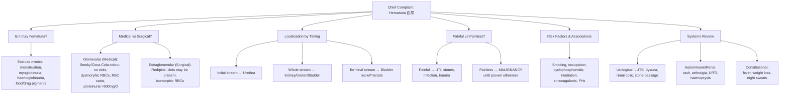

# History Taking: Hematuria (血尿)

---

## 1. Presenting Complaint Framework

The structured approach to hematuria essentially asks four key questions sequentially. Get these right and you've framed the entire case.

### Step 1: Is It Truly Hematuria?

This is the first thing to establish. Not all red urine is bloody urine. [1][2][3]

- **Ask about dipstick and microscopy results** if available
  - _"Have you had any urine tests done already? What did they show?"_
  - (你有冇驗過小便？結果係點？)
- **Exclude mimics** [1][3]:
  - **_Menstrual blood contamination_** (月經污染) — ask females about timing relative to period [2]
  - **_Myoglobinuria / haemoglobinuria_** (肌紅蛋白尿 / 血紅蛋白尿) — ask about strenuous exercise, dark urine after exertion, muscle pain [1]
  - **Food pigments**: beetroot (紅菜頭) [1][3]
  - **Drug-induced**: rifampicin (橙色), levodopa (深色), senna, pyridium, phenytoin [1][2][3]
  - **Diseases**: porphyria, alkaptonuria, bilirubinuria [1]

> **Why this matters**: A student who dives into the differential without first confirming it's actual hematuria will lose easy marks. The dipstick detects heme (peroxidase activity), so it can be false-positive with myoglobin or haemoglobin. Always confirm with microscopy. [1]

### Step 2: Is It Medical (Glomerular) or Surgical (Extraglomerular)?

This is the single most important branch point. Ask about colour, clots, and frothy urine. [1][2]

| Feature                   | Extraglomerular (Surgical)                   | Glomerular (Medical)                                                     |
| ------------------------- | -------------------------------------------- | ------------------------------------------------------------------------ |
| **Colour**                | Red or pink (紅色/粉紅色)                    | Smoky brown, 'Coca-Cola' (茶色/可樂色)                                   |
| **Clots** (血塊)          | May be present; may be vermiform (worm-like) | **_Absent_** (urokinase/tPA in glomeruli prevents clot formation) [1][2] |
| **Proteinuria**           | < 500 mg/d                                   | May be >500 mg/d, >2+ on dipstick                                        |
| **Urine microscopy**      | Isomorphic (smooth, round RBCs)              | **_Dysmorphic RBCs_**, RBC casts [1][2]                                  |
| **Frothy urine** (泡沫尿) | Absent                                       | May be present (nephrotic-range proteinuria) [2]                         |

- _"What colour was the blood in your urine — bright red, pink, or more like dark tea/Coca-Cola?"_
  - (你尿入面嘅血係咩色？鮮紅色、粉紅色、定係好似茶色/可樂色？)
- _"Did you see any blood clots?"_
  - (你有冇見到血塊？)
- _"Was your urine foamy/frothy?"_
  - (你嘅小便有冇好多泡？)

> **Why this matters**: **_Gross hematuria with passage of clots ALWAYS indicates NON-glomerular bleeding_** [2]. Conversely, the characteristic **_absence of blood clots in glomerular bleeding_** is due to the diffuse capillary process plus urokinase and tPA in glomeruli and tubules. [2]

<Callout title="Key Principle" type="error">
  Students commonly forget to ask about clots and urine colour. These two
  questions alone can dichotomize your differential into medical vs surgical
  causes — this is the highest-yield branch point in hematuria history-taking.
</Callout>

### Step 3: Localisation — Timing of Hematuria Relative to Stream

The classic teaching (though acknowledged as **_unreliable in predicting location_** per lecture slides [3]) still gets asked in OSCEs: [2][3]

| Timing                        | Suggested Source                            |
| ----------------------------- | ------------------------------------------- |
| **Initial stream** (開始時)   | Urethra (membranous and spongy urethra)     |
| **Whole stream** (成條尿都有) | Kidney / Ureter / Bladder                   |
| **Terminal stream** (尾段)    | Bladder neck / Prostate (prostatic urethra) |

- _"When in the stream do you see the blood — right at the start, throughout, or just at the end?"_
  - (你見到血係喺開始、成條尿都有、定係尾段先有？)

> **Why this matters**: Although the lecture slides note this is **_unreliable_** [3], examiners still expect you to ask it. It demonstrates structured thinking about anatomical localization.

### Step 4: Painful vs Painless?

This is critically important and is a favourite OSCE discriminator. [3][4]

- **_Painless gross hematuria: MALIGNANCY UNTIL PROVEN OTHERWISE_** [3][4]
  - _"Is the blood associated with any pain at all?"_
  - (有血嗰陣有冇痛？)
- **Painful hematuria** → suggests **_infection_** [3], stones, or trauma

<Callout title="Golden Rule">
  ***Painless gross hematuria in an adult should be regarded as a symptom of
  malignancy until proven otherwise and demands immediate urological
  examination.*** The most common cause of gross hematuria in patients ≥50 is CA
  bladder. [2][3]
</Callout>

---

## 2. Detailed Symptom Analysis (SOCRATES + Associations)

Once the four framework questions are answered, systematically flesh out the HPI:

### Character and Severity

- _"How much blood are we talking about — the whole toilet bowl, just a tinge, or was it just found on testing?"_
  - (有幾多血？成個廁所都係血、定係少少粉紅色？)
- _"How many episodes have you had?"_
  - (發生咗幾多次？)

### Onset and Progression

- _"When did you first notice it?"_ (幾時開始？)
- _"Has it been getting worse, staying the same, or come and go?"_
  - (有冇越嚟越嚴重？定係時有時冇？)
- _"Was there anything that triggered it — trauma, exercise, a new medication?"_
  - (有冇咩嘢令到佢出現？撞親？做運動？食新藥？)

### Associated Symptoms — Systematic Questioning

**Urological symptoms** (泌尿系統症狀):

- **Dysuria** (排尿痛): _"Does it burn or sting when you pass urine?"_ (排尿嗰陣有冇痛/㗎？) → UTI [3][5]
- **Fever** (發燒): → UTI / pyelonephritis / urosepsis [2][3]
- **Loin/flank pain** (腰痛):
  - Colicky, radiating to groin → renal/ureteric calculi [2]
  - Constant → infection / tumour / IgA nephropathy [2]
- **Stone passage** (排石): _"Did you notice any gritty particles in the urine?"_ (有冇喺尿入面見到碎石？)
- **_LUTS — Storage and Voiding symptoms_** [2][6]:
  - **Hesitancy** (排尿遲緩), **weak/intermittent stream** (尿流弱/斷斷續續), **dribbling** (滴尿), **incomplete emptying** (排唔清) → **_BPH or CA prostate_** [2]
  - **Frequency** (尿頻), **urgency** (尿急), **nocturia** (夜尿) → irritative symptoms of UTI or CIS (carcinoma in situ) of bladder [2]
- **_Hematospermia_** (血精): → CA prostate [2]

**Autoimmune/Glomerular red flags** [4]:

- **_Recent URTI_** (最近有冇傷風感冒？): IgA nephropathy (synpharyngitic hematuria — occurs _during_ URTI, not 2-3 weeks after) or post-infectious GN (2-3 weeks after) [2][4]
- **Rash**: **_purpuric rash_** → HSP / GPA; **_malar rash_** → SLE [4]
- **Arthralgia / myalgia** (關節痛/肌肉痛): → SLE, vasculitis [4]
- **_Epistaxis, rhinorrhoea_** (流鼻血/鼻水): → GPA (Granulomatosis with Polyangiitis) [4]
- **_Haemoptysis_** (咳血): → pulmonary-renal syndrome (Goodpasture's, GPA) [4]

**Constitutional symptoms** (全身症狀):

- **Weight loss** (體重下降), **anorexia** (食慾不振), **night sweats** (夜間盜汗) → malignancy, TB [2]
- **Bleeding tendency** (容易瘀/流血): → bleeding diathesis [2][4]

> **Why ask about URTI?**: IgA nephropathy classically presents with _gross hematuria during or within days of an URTI_ (synpharyngitic), while post-streptococcal GN presents _2-3 weeks after_. This is a common viva differentiator.

---

## 3. Past Medical History (病歷)

| Condition to Ask About                          | Why It Matters                                                    |
| ----------------------------------------------- | ----------------------------------------------------------------- |
| **TB** (肺結核)                                 | Renal TB can cause sterile pyuria and hematuria [2]               |
| **CKD / Hypertension** (慢性腎病/高血壓)        | Pre-existing renal parenchymal disease [2]                        |
| **Previous malignancy**                         | Recurrence or treatment-related (cyclophosphamide, radiation) [2] |
| **Bleeding disorders**                          | Explains hematuria but does NOT exclude underlying pathology [4]  |
| **Diabetes mellitus**                           | Diabetic nephropathy, increased UTI risk [5]                      |
| **PKD/Hereditary nephritis**                    | Inherited causes of hematuria [2]                                 |
| **Connective tissue disease** (SLE, vasculitis) | Glomerular causes [4]                                             |
| **Recent procedures** (尿管/活檢)               | Iatrogenic — catheterisation, biopsy, TURP [2]                    |

### Past Surgical History (手術歷史)

- Any urological surgery (e.g. TURP, nephrectomy, lithotripsy)
- Pelvic surgery or radiation (e.g. for CA rectum, CA cervix → **_irradiation cystitis_**) [2]
- Gastric bypass / bowel resection (increased oxalate stones) [2]

---

## 4. Drug History (藥物歷史)

This is a frequently tested area:

| Drug                                                                                          | Relevance                                                                                                                                                |
| --------------------------------------------------------------------------------------------- | -------------------------------------------------------------------------------------------------------------------------------------------------------- |
| **_Anticoagulants_** (e.g. warfarin, DOACs) / **_Antiplatelets_** (e.g. aspirin, clopidogrel) | Can unmask underlying pathology; **_antiplatelet/anticoagulant use is NOT a satisfactory explanation for hematuria_** except in warfarin overdose [4][3] |
| **_Cyclophosphamide / Ifosfamide_**                                                           | **_Haemorrhagic cystitis_** [2]                                                                                                                          |
| **Ketamine** (氯胺酮/K仔)                                                                     | Ketamine cystitis — important in HK context [5]                                                                                                          |
| **NSAIDs**                                                                                    | Interstitial nephritis, papillary necrosis                                                                                                               |
| **Rifampicin**                                                                                | Orange/red discolouration — not true hematuria [1][3]                                                                                                    |

<Callout title="Common Pitfall" type="error">
  ***Antiplatelet / anticoagulant use is NOT a satisfactory explanation for
  hematuria***, except in the context of warfarin overdose with supratherapeutic
  INR. [4] Always investigate further — these drugs may unmask an underlying
  malignancy. Students who dismiss hematuria as "just from the blood thinners"
  will lose marks.
</Callout>

### Allergies (藥物敏感)

- _"Do you have any known drug allergies?"_ (你有冇藥物敏感？)
- Document specific reaction type (anaphylaxis vs intolerance)

---

## 5. Family History (家族病史)

- **_Polycystic kidney disease_** (多囊腎) — autosomal dominant [2]
- **_Hereditary nephritis_** (Alport syndrome) — X-linked or autosomal [2]
- **Urinary stones** (尿路結石) — familial tendency [2]
- **_Vesicoureteral reflux_** (膀胱輸尿管反流) — relevant in paediatric cases [2]
- **Malignancy** — particularly urological cancers [3]
- **Sickle cell disease** — relevant in certain populations (papillary necrosis)

---

## 6. Social History (社交史)

### Smoking (吸煙)

- **_Smoking is the single most important risk factor for bladder cancer_** [2][3][7]
  - _"Do you smoke? How many cigarettes per day, and for how many years?"_
  - (你有冇食煙？每日幾多支？食咗幾多年？)
  - Calculate **pack-years** (pack-years = packs per day × years smoked)
  - Risk correlates with extent of exposure [2]

### Occupation (職業)

- **_Occupational exposure to chemicals or dyes (benzenes / aromatic amines)_** [2][3][7]:
  - Printers, painters, hairdressers, rubber industry workers, chemical plant workers
  - _"What is your job? Have you ever worked with chemicals, dyes, or in the rubber industry?"_
  - (你做咩工作？有冇接觸過化學品、染料、或者喺橡膠工廠做過嘢？)

### Other Social Factors

- **Ketamine / recreational drug use** (K仔/毒品) — important in HK [5]
  - _"Do you use any recreational drugs, including ketamine?"_
  - (你有冇用過消閒藥物，例如K仔？)
- **Exercise** — vigorous exercise can cause **_exercise-induced hematuria_** [2]
  - _"Were you doing any heavy exercise before this happened?"_
  - (之前有冇做劇烈運動？)
- **Sexual history** (性生活) — STIs, urethritis [2]
- **Travel history** — schistosomiasis (endemic areas in Africa/Middle East)
- **Alcohol** (飲酒) — liver disease → coagulopathy

### Functional Baseline

- _"Before this, were you managing day-to-day activities independently?"_
  - (之前你日常生活可唔可以自己搞掂？)
- Mobility, ADLs, continence baseline

---

## 7. Menstrual History (月經歷史) — For Female Patients

- **_Contamination with menstrual blood should be ruled out by repeating urinalysis after menstruation has ceased_** [2]
- **_Cyclic hematuria during and shortly after menstruation suggests endometriosis of the urinary tract_** [2]
- _"When was your last period? Could the blood be from your period?"_
  - (你上次月經幾時？有冇可能係月經嘅血污染咗？)

---

## 8. Focused Differentiating Questions

Here's a high-yield quick-fire list organized by diagnosis:

| Suspected Diagnosis                 | Key Differentiating Questions                                                                          |
| ----------------------------------- | ------------------------------------------------------------------------------------------------------ |
| **Bladder cancer**                  | Painless gross hematuria? Age >40? Smoker? Occupational exposure? Irritative LUTS? [3][7]              |
| **Renal cell carcinoma**            | Flank mass? Weight loss? Haemoglobin drop? **_Left-sided varicocele_** (L renal vein obstruction)? [4] |
| **Urothelial cancer (upper tract)** | Painless? Smoker? Aromatic amine exposure? Previous bladder TCC? [7]                                   |
| **Prostate cancer**                 | Obstructive LUTS? Hematospermia? Bone pain? Age? PSA history? [2]                                      |
| **BPH**                             | Obstructive LUTS? Nocturia? Age? No weight loss? [2][6]                                                |
| **UTI / Pyelonephritis**            | Dysuria? Fever? Frequency? Urgency? Suprapubic pain? Loin pain? [3][5]                                 |
| **Urolithiasis**                    | Severe colicky loin-to-groin pain? Restlessness? Stone passage? Prior stones? [2]                      |
| **IgA nephropathy**                 | Synpharyngitic gross hematuria (during URTI)? Young patient? [2][4]                                    |
| **Post-infectious GN**              | Gross hematuria 2-3 weeks after pharyngitis/impetigo? Oedema? [2]                                      |
| **ADPKD**                           | Family history? Flank pain? Hypertension? Bilateral palpable kidneys? [2]                              |
| **Haemorrhagic cystitis**           | Cyclophosphamide? Ifosfamide? Pelvic irradiation? [2]                                                  |
| **Ketamine cystitis**               | Ketamine use? Severe frequency/urgency? Small-capacity bladder? [5]                                    |
| **GPA**                             | Epistaxis? Sinusitis? Haemoptysis? Renal impairment? [4]                                               |

---

## 9. Risk Factors for Malignancy in Asymptomatic Microscopic Hematuria

This is a commonly tested list [2][7]:

- **_Age >35 years_** (some guidelines say >40)
- **_Smoking history_** — risk correlates with extent of exposure
- **_Occupational exposure to chemicals or dyes_** (benzenes or aromatic amines)
- **_History of gross hematuria_**
- **_History of chronic cystitis or irritative voiding symptoms_**
- **_History of pelvic irradiation_**
- **_History of exposure to cyclophosphamide_**
- **_History of chronic indwelling foreign body_**
- **_History of exposure to aristolochic acid_**
- **_History of analgesic abuse_** (increased incidence of carcinoma of the kidney)

---

## 10. Red-Flag Findings and Escalation Triggers

| Red Flag                                                                    | Action                                                   |
| --------------------------------------------------------------------------- | -------------------------------------------------------- |
| **_Painless gross hematuria in adult_**                                     | Urgent urology referral + cystoscopy + CT urogram [2][3] |
| **Clot retention** (unable to void, suprapubic pain, distended bladder)     | Emergency — 3-way catheter irrigation [3]                |
| **Haemodynamic instability** (tachycardia, hypotension) from heavy bleeding | Resuscitation → emergency urology consult                |
| **Signs of urosepsis** (fever, rigors, tachycardia + hematuria)             | Sepsis 6, IV antibiotics, blood cultures                 |
| **Pulmonary-renal syndrome** (haemoptysis + hematuria + renal impairment)   | Urgent nephrology/ICU — consider Goodpasture's/GPA       |
| **New renal impairment** with hematuria and proteinuria                     | Nephrology referral for possible renal biopsy            |
| **Unexplained hematuria in patient >40**                                    | Must exclude malignancy with full workup [2][3][7]       |

---

## 11. Common Pitfalls in History-Taking for Hematuria

<Callout title="Common Mistakes" type="error">

1. **Not confirming it's truly hematuria** — jumping straight to differentials without excluding menstruation, food, drugs, or pigmenturia.
2. **Dismissing hematuria in patients on anticoagulants/antiplatelets** — these medications do NOT adequately explain hematuria and should NOT prevent full investigation. [4]
3. **Forgetting to ask about clots** — this single question separates glomerular from non-glomerular bleeding.
4. **Not asking about smoking and occupation** — these are the most important modifiable risk factors for urothelial cancer.
5. **Missing the synpharyngitic pattern** — failing to ask about concurrent URTI (IgA nephropathy) vs 2-3 week lag (post-streptococcal GN).
6. **Not asking about ketamine** in Hong Kong patients — ketamine cystitis is a real and locally relevant diagnosis.
7. **Forgetting menstrual history** in female patients.
8. **Not asking about exercise** — exercise-induced hematuria is benign but must be considered.

</Callout>

---

## 12. High-Yield Exam Interpretation Tips

<Callout title="Exam Tips" type="idea">

- **"Painless gross hematuria = malignancy until proven otherwise"** — this phrase must appear in your answer. It is the single most important concept. [2][3]
- If the examiner gives you a **smoky brown/Coca-Cola** coloured urine with **no clots** → think glomerular. If **bright red with clots** → think surgical/urological. [1]
- **Clots = non-glomerular**. Full stop. The examiner may try to trick you — glomerular bleeding does NOT produce clots. [1][2]
- If a patient has hematuria + **haemoptysis** → pulmonary-renal syndrome (Goodpasture's or GPA). This is a classic OSCE viva question.
- **IgA nephropathy** = hematuria _during_ URTI. **Post-streptococcal GN** = hematuria _2-3 weeks after_ pharyngitis. Know the timing difference.
- **_Field cancerization_** — bladder TCC can be multifocal and the entire urothelium is at risk, which is why upper tract imaging is needed alongside cystoscopy. [7]
- **Left-sided varicocele** in a male with hematuria → think left RCC obstructing the left renal vein. [4]

</Callout>

---

## 13. Model Reporting Script

> **"Mr Chan is a 65-year-old retired painter and current smoker of 40 pack-years who presented 3 days ago to Queen Mary Hospital with a 2-week history of painless gross hematuria. He describes bright red urine throughout the stream with occasional small blood clots, but no dysuria, fever, flank pain, or stone passage. He reports no frothy urine. He has associated 3 kg unintentional weight loss over the past 2 months but denies night sweats, bone pain, or haemoptysis. He has no lower urinary tract symptoms of obstruction or irritation.**
>
> **His past medical history includes hypertension controlled on amlodipine 5 mg daily and hyperlipidaemia on atorvastatin 20 mg. He has no history of diabetes, TB, renal disease, or previous malignancy. He has no past surgical history. He takes no anticoagulants or antiplatelets. He has no known drug allergies.**
>
> **There is no family history of polycystic kidney disease, hereditary nephritis, or urological malignancies.**
>
> **Socially, he is a 40 pack-year smoker with occupational exposure to chemical dyes for over 20 years as a painter. He drinks alcohol socially and denies any recreational drug use including ketamine. He is independent in activities of daily living.**
>
> **In summary, this is a 65-year-old gentleman with significant risk factors for urothelial malignancy — including age, heavy smoking history, and occupational chemical exposure — presenting with painless gross hematuria with clots and constitutional symptoms. The leading differential is urological malignancy, most likely bladder cancer, and he warrants urgent cystoscopy with CT urogram. I would also send urine for microscopy, culture and sensitivity, cytology, and check his renal function and full blood count."**

---

<ActiveRecallQuiz
  title="Active Recall - History Taking"
  items={[
    {
      question:
        "What is the clinical significance of painless gross hematuria in an adult?",
      markscheme:
        "Painless gross hematuria should be considered a symptom of malignancy until proven otherwise. The most common cause in patients aged 50 or above is bladder cancer. It demands immediate urological evaluation with cystoscopy and upper tract imaging.",
    },
    {
      question:
        "How do you differentiate glomerular from non-glomerular (extraglomerular) hematuria based on history and urine findings?",
      markscheme:
        "Glomerular: smoky brown or Coca-Cola coloured urine, absence of blood clots (due to urokinase and tPA in glomeruli), dysmorphic RBCs and RBC casts on microscopy, proteinuria more than 500mg per day, may have frothy urine. Extraglomerular: red or pink urine, blood clots may be present, isomorphic RBCs, proteinuria less than 500mg per day.",
    },
    {
      question:
        "A patient presents with gross hematuria occurring simultaneously with an upper respiratory tract infection. What is the most likely diagnosis and how does the timing differ from post-infectious glomerulonephritis?",
      markscheme:
        "IgA nephropathy presents with synpharyngitic hematuria occurring during or within days of the URTI. Post-infectious or post-streptococcal glomerulonephritis presents 2 to 3 weeks after a pharyngeal or skin infection. The timing is the key differentiator.",
    },
    {
      question:
        "Why does the presence of blood clots in urine always indicate non-glomerular bleeding?",
      markscheme:
        "Glomerular bleeding is a diffuse capillary process where minute amounts of blood are added to a relatively large volume of glomerular filtrate. Additionally, urokinase and tissue-type plasminogen activator present in glomeruli and tubules prevent clot formation. Blood clots indicate heavy focal bleeding sufficient to support clot formation, which occurs only in non-glomerular or urological sources.",
    },
    {
      question:
        "A patient on warfarin presents with hematuria. Should the anticoagulant be accepted as the cause?",
      markscheme:
        "No. Antiplatelet or anticoagulant use is NOT a satisfactory explanation for hematuria except in the context of warfarin overdose with supratherapeutic INR. These medications may unmask an underlying pathology such as malignancy, and full investigation including cystoscopy and imaging should still be pursued.",
    },
    {
      question:
        "List at least five risk factors for malignancy in a patient with asymptomatic microscopic hematuria.",
      markscheme:
        "Age over 35 years, smoking history with risk correlating to exposure, occupational exposure to chemicals or aromatic amines such as in painters or hairdressers, history of gross hematuria, history of pelvic irradiation, exposure to cyclophosphamide, chronic cystitis or irritative voiding symptoms, chronic indwelling foreign body, exposure to aristolochic acid, and history of analgesic abuse.",
    },
  ]}
/>

---

## References

[1] Senior notes: Ryan Ho Urogenital.pdf (p131) / Ryan Ho Fundamentals.pdf (p341)
[2] Senior notes: felixlai.md (Hematuria sections, pp. 764–769; BPH/ADPKD sections)
[3] Lecture slides: GC 183. Common urological malignancies and their presentations - Nov 7.pdf (pp. 3–6, 13)
[4] Senior notes: maxim.md (Urology — Haematuria section, pp. 308–309)
[5] Lecture slides: GC 210. Urinary tract infection.pdf (p23)
[6] Senior notes: felixlai.md (BPH and LUTS/IPSS sections)
[7] Lecture slides: GC 183. Common urological malignancies and their presentations - Nov 7.pdf (pp. 5, 13); Senior notes: felixlai.md (Urothelial bladder cancer section, pp. 816–817)

---

<Callout title="High Yield Summary">

**Hematuria is ALWAYS a red flag** — considered malignancy until proven otherwise, especially painless gross hematuria in adults ≥40.

**Four-step framework**: (1) Confirm it's real hematuria → (2) Medical vs surgical → (3) Localise by stream timing → (4) Painful vs painless.

**Clots = non-glomerular**. **No clots + Coca-Cola urine + dysmorphic RBCs = glomerular**.

**Never dismiss hematuria** because a patient is on anticoagulants — investigate fully.

**Must-ask risk factors**: Smoking (pack-years), occupation (chemical/dye exposure), cyclophosphamide/radiation history, ketamine use (HK-specific).

**Key timing distinction**: IgA nephropathy = hematuria _during_ URTI; Post-streptococcal GN = hematuria _2-3 weeks after_.

**Workup**: Cystoscopy (lower tract) + CT urogram (upper tract) for all unexplained hematuria. Urine microscopy, culture, and cytology. Check renal function.

</Callout>
