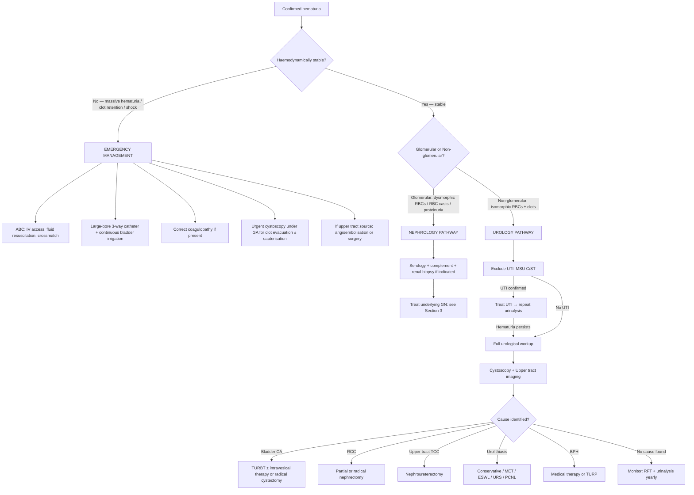

## Management of Hematuria

### Guiding Principle — "Hematuria is a Symptom, Not a Diagnosis"

The management of hematuria is fundamentally about **finding and treating the underlying cause**. There is no single "treatment for hematuria" — instead, the management algorithm branches based on:

1. **Is this an emergency?** (massive hematuria with clot retention, haemodynamic compromise)
2. **Glomerular or non-glomerular?** (determines nephrology vs urology pathway)
3. **What is the specific underlying diagnosis?** (determines definitive treatment)

Think of it like this: hematuria is the smoke alarm. Your job is to find and extinguish the fire, not just silence the alarm.

---

### 1. Master Management Algorithm

---

### 2. Emergency Management of Severe / Massive Hematuria

Massive hematuria is a **urological emergency** — not because of blood loss per se (it takes a lot of urinary bleeding to cause hypovolaemic shock), but because **blood clots obstruct the bladder outlet → clot retention → painful bladder distension → acute urinary retention (AROU)** [3][11].

#### 2.1 Immediate Resuscitation

| Step | Action | Rationale |
|---|---|---|
| **A — Airway / B — Breathing** | Ensure patent airway; oxygen if hypoxic | Standard resuscitation |
| **C — Circulation** | Two large-bore IV cannulae; send blood for **CBC, clotting profile, group & crossmatch, RFT** | Assess degree of blood loss; prepare for transfusion if Hb drops significantly |
| **Fluid resuscitation** | Crystalloid (NS or Hartmann's); transfuse PRBCs if Hb < 70 g/L (or < 80 g/L if symptomatic/cardiac disease) | Restore intravascular volume |
| **Correct coagulopathy** | Vitamin K if on warfarin + supratherapeutic INR; FFP if actively bleeding with coagulopathy; hold anticoagulants/antiplatelets if safe to do so | Coagulopathy worsens and perpetuates bleeding |

#### 2.2 Bladder Decompression and Irrigation

| Intervention | Details | Why |
|---|---|---|
| ***3-way (triple-lumen) catheter*** | ***Additional irrigation channel for bladder irrigation; indicated in hematuria with clot formation which can lead to AROU or in patients requiring pharmacological therapy*** [11] | Two-way catheter only drains urine — a 3-way catheter allows **simultaneous irrigation** (fluid in through irrigation port, drains out through catheter) to prevent clot accumulation |
| **Manual clot evacuation** | Use a bladder syringe (Toomey syringe) via the catheter to aspirate and irrigate clots | Remove existing clots that are obstructing the outflow |
| **Continuous bladder irrigation (CBI)** | NS irrigation through the 3-way catheter; titrate flow rate to keep outflow clear (light pink or straw-coloured) | Continuous dilution prevents clot formation; keeps catheter patent |
| **Catheter size** | Use a **large-bore catheter** (20–24 Fr) — larger lumen allows clots to pass through | Small catheters block easily with clots |

<Callout title="Why Not Distilled Water for Irrigation?">
Normal saline (0.9% NaCl) is the standard irrigant for bladder washout. Distilled water is **hypotonic** — it can be absorbed through the bladder mucosa (especially if damaged or post-TURP) causing **dilutional hyponatraemia** (the same mechanism as TUR syndrome). NS is isotonic and safe for bladder irrigation in the setting of hematuria [3].
</Callout>

#### 2.3 Urgent Cystoscopy

If CBI fails to clear the bladder or bleeding continues:
- **Rigid cystoscopy under GA** → allows:
  - Evacuation of organized clots that a catheter cannot remove
  - Identification and **cauterisation** of the bleeding source (e.g. bleeding vessel on a tumour surface, prostatic vein)
  - Biopsy of suspicious lesions
- If bleeding source is from the **upper tract** (identified by bloody ureteric jet at cystoscopy):
  - **Angiographic embolisation** of the bleeding renal artery branch (interventional radiology)
  - **Emergency nephrectomy** if life-threatening and uncontrollable (rare, last resort)

---

### 3. Definitive Management by Underlying Cause

***The core principle*** [5]: **Medical causes → investigated and treated by nephrologists. Urological causes → treated by urologists.**

#### 3.1 Nephrology Pathway — Glomerular Causes

##### A. General Measures for ALL Glomerulonephropathy [7][12]

| Measure | Details | Rationale |
|---|---|---|
| ***Anti-proteinuric therapy: ACEI or ARB*** | ***Indicated in ALL glomerulonephropathy; goal: proteinuria < 1 g/day or UPCR < 0.5–1 g/g*** [7] | ***↓Intraglomerular pressure by dilating efferent arteriole → ↓filtration pressure → ↓proteinuria → ↓rate of GFR decline***. Proteinuria itself is nephrotoxic (tubular protein overload → tubulointerstitial inflammation → fibrosis) — so reducing it is renoprotective [7] |
| **Blood pressure control** | Target < 130/80 mmHg (KDIGO 2021) | HTN accelerates glomerular damage; the RAAS blockade with ACEI/ARB achieves dual goals (BP control + antiproteinuric effect) |
| **Dietary sodium restriction** | ***~2 g/day*** [7] | ↓Na intake enhances the antiproteinuric effect of ACEI/ARB and reduces oedema |
| **Anti-oedema therapy** | ***Loop diuretics preferred (frusemide); can add thiazide/K+-sparing if inadequate; monitor for hypovolaemia and hypokalaemia*** [7] | Nephrotic patients retain Na+/H₂O → oedema; diuretics offload excess volume |
| **Lipid-lowering: statins** | ***Consider if hyperlipidaemia persists after treatment of underlying disorder*** [7] | Nephrotic syndrome → ↑hepatic lipoprotein synthesis (compensatory for albumin loss) → hyperlipidaemia → accelerated atherosclerosis |
| **Anti-thrombotic therapy** | ***Usually only if thromboembolic event occurs; prophylactic use NOT routinely indicated unless high risk (e.g. membranous nephropathy, very low albumin)*** [7] | Nephrotic syndrome → loss of antithrombin III in urine + ↑hepatic synthesis of procoagulants → hypercoagulable state |
| **Protein intake** | ***Normal protein intake — protein restriction NOT recommended*** [7] | ***↑Albumin excretion is associated with poorer outcomes; restricting protein worsens malnutrition without clear benefit*** |
| **Vaccinations** | ***Pneumococcal vaccination for ALL nephrotic patients*** [7] | Pneumococcal infection is common due to urinary loss of IgG and complement |

##### B. Specific Treatment by Glomerular Disease

| Disease | Treatment | Key Points |
|---|---|---|
| **IgA nephropathy** | ACEI/ARB (all); corticosteroids if proteinuria > 1 g/day despite 3–6 months of optimised supportive therapy; consider MMF or cyclophosphamide for crescentic disease | TESTING study (2022) and NEFIGAN trial support targeted-release budesonide (Nefecon) for proteinuric IgA nephropathy — emerging first-in-class treatment |
| **Thin basement membrane disease** | Reassurance + monitoring; ACEI/ARB if proteinuria develops | Benign course; no specific treatment usually needed |
| **Alport syndrome** | ACEI/ARB (early, even in childhood); genetic counselling; renal transplant for ESRD (no recurrence in graft as native type IV collagen is absent) | Early RAAS blockade delays ESRD by years |
| **Post-streptococcal GN** | Supportive (usually self-limiting in children); control HTN + oedema; antibiotics to eradicate residual strep only (penicillin) | Immunosuppression NOT indicated — disease is self-resolving; complement normalises in 6–8 weeks |
| ***Lupus nephritis*** | ***HCQ/CQ for all SLE patients unless C/I*** [13]; ***mild lupus → HCQ ± NSAIDs ± low-dose steroids***; ***moderate → HCQ + induction (steroids) + maintenance (prefer MMF)***; ***severe (renal/CNS) → HCQ + IV pulse methylprednisolone (0.5–1 g/day × 3 days) + maintenance (MMF or cyclophosphamide induction → azathioprine/MMF maintenance)*** [13] | ***Treatment modality guided by histologic subtype on renal biopsy — clinical presentation may not accurately reflect severity*** [5]; Class I–II: supportive only; Class III–IV: aggressive immunosuppression; Class V: ACEI/ARB ± immunosuppression |
| **ANCA-associated vasculitis (GPA/MPA)** | Induction: cyclophosphamide (IV pulse) or rituximab + high-dose corticosteroids; Maintenance: azathioprine or rituximab; Plasma exchange if severe (anti-GBM overlap or pulmonary haemorrhage) | Rituximab is increasingly preferred over cyclophosphamide for induction (RAVE and RITUXVAS trials) |
| **Anti-GBM disease (Goodpasture)** | Plasma exchange (to remove circulating anti-GBM antibodies) + cyclophosphamide + corticosteroids | Medical emergency — delay worsens prognosis; dialysis-dependent at presentation → unlikely to recover renal function |

##### C. Conditions Requiring Nephrology Referral [5]

| Condition | Rationale |
|---|---|
| ***Urological cause excluded*** by cystoscopy + imaging | Remaining causes are nephrological |
| ***eGFR < 30 mL/min*** (evidence of CKD) | Needs renal specialist management to slow progression |
| ***Significant proteinuria*** | Glomerular origin; may need biopsy |
| ***Young patient ( < 40 y) with HTN and isolated hematuria*** | May have occult GN requiring early intervention |
| ***Visible hematuria with intercurrent URTI*** | Strongly suggests IgA nephropathy |

#### 3.2 Urology Pathway — Non-Glomerular Causes

##### A. Urinary Tract Infection (UTI)

| Principle | Details |
|---|---|
| **Treat the UTI first** | Appropriate antibiotics based on C/ST; complicated UTI (pyelonephritis) may require IV antibiotics and admission |
| **Re-check urinalysis after treatment** | Hematuria should resolve with successful treatment of UTI |
| ***If hematuria persists after UTI treatment → full urological workup*** | ***"Recurrent UTI with gross hematuria or persistent microscopic hematuria → formal urologist referral required to rule out malignancy"*** [10] |

##### B. Bladder Cancer

***Bladder cancer is the most common malignancy of the urinary system*** [3]. Management depends on staging:

| Stage | Treatment | Rationale |
|---|---|---|
| ***Non-muscle invasive (Ta, Tis, T1)*** | ***TURBT (transurethral resection of bladder tumour)*** — gold standard for diagnosis AND initial treatment; ***± intravesical therapy (BCG or mitomycin C)*** [5] | TURBT resects the visible tumour for histology and can be curative for superficial disease. Intravesical BCG (Bacillus Calmette-Guérin) stimulates a local immune response against residual tumour cells — especially important for CIS and high-risk Ta/T1 |
| ***Muscle invasive (≥ T2)*** | ***Radical cystectomy*** with urinary diversion ± neoadjuvant cisplatin-based chemotherapy | Tumour has invaded the detrusor muscle → TURBT alone cannot achieve clear margins; neoadjuvant chemo improves survival by ~5% |
| **Metastatic** | Cisplatin-based combination chemotherapy (gemcitabine + cisplatin) ± immune checkpoint inhibitors (pembrolizumab, atezolizumab) | Palliation and survival prolongation |

> ***Note: non-invasive tests alone CAN NEVER replace cystoscopy/TURBT for diagnosis of CA bladder*** [5]. Even if CTU shows a bladder mass, cystoscopy + TURBT is still mandatory for tissue diagnosis and staging.

##### C. Renal Cell Carcinoma (RCC)

Management depends on stage and the IMDC (International Metastatic RCC Database Consortium) risk score for metastatic disease [5]:

| Stage | Treatment | Key Points |
|---|---|---|
| ***T1 ( < 7 cm)*** | ***Partial (nephron-sparing) nephrectomy as standard***; ***local ablation (RFA, cryoablation) or active surveillance for elderly/comorbid with small masses*** [5] | Partial nephrectomy preserves renal function → limits long-term metabolic/CVS disorders. ***Non-inferior overall survival in T1 disease*** [5] |
| ***T2 ( > 7 cm)*** | ***Laparoscopic radical nephrectomy as standard*** [5] | Larger tumours make partial nephrectomy technically difficult; entire kidney removed with perinephric fat |
| ***T3–4 (locally advanced)*** | ***Open radical nephrectomy ± adrenalectomy (only if adrenal metastasis) ± LN dissection ± IVC tumour thrombectomy*** [5] | IVC tumour thrombus extension is characteristic of RCC — must be addressed surgically |
| **Metastatic** | Cytoreductive nephrectomy (if favourable/intermediate risk) + systemic therapy: ***1st line for poor/intermediate risk ccRCC: ipilimumab + nivolumab; favourable risk: sunitinib or pazopanib*** [5] | RCC is classically resistant to conventional chemotherapy; targeted therapy (anti-VEGF TKIs) and immunotherapy are the mainstays |

**Contraindications to partial nephrectomy** [5]: insufficient remaining parenchyma, renal vein thrombosis, unfavourable tumour location (e.g. central hilar tumour).

**Important caveat**: ***warn patients that up to 20% of resected renal masses are benign*** (e.g. oncocytoma, AML) [5].

##### D. Upper Tract TCC (Urothelial Carcinoma of Renal Pelvis/Ureter)

***The lecture slide states: "Hematuria work up: CTU + Flexible cystoscopy; Ureteroscopy + biopsy"*** [1].

| Treatment | Details |
|---|---|
| ***Standard: Radical nephroureterectomy*** with excision of a bladder cuff (because of field cancerisation — the urothelium from renal pelvis to bladder cuff is at risk) [5] | Removes entire ipsilateral urothelial tract |
| **Organ-sparing options** (select cases) | Ureteroscopic ablation or segmental ureterectomy for low-grade, small, unifocal tumours in patients with solitary kidney or renal impairment |
| **Adjuvant** | Intravesical instillation post-nephroureterectomy to reduce bladder recurrence (POUT trial supports gemcitabine) |

##### E. Urolithiasis

Management follows a stepwise approach: acute pain control → assess need for urgent decompression → conservative vs medical vs surgical definitive treatment [2][5][14].

**Acute Management:**

| Step | Treatment | Details |
|---|---|---|
| **Pain control** | ***NSAIDs (1st line)*** — e.g. indomethacin, ketorolac, diclofenac [2][14] | ***NSAIDs have the advantage of decreasing ureteral smooth muscle tone → directly treat the mechanism (ureteral spasm) by which pain occurs*** [3]; require RFT check first; opioids (morphine, tramadol) if RFT deranged or NSAID contraindicated |
| **Rule out / treat urosepsis** | Blood cultures, IV antibiotics if febrile | Infected obstructed kidney = urological emergency |
| ***Urgent decompression*** | ***JJ ureteric stent (under fluoroscopy) or percutaneous nephrostomy (PCN)*** | ***Indications: uncontrolled sepsis, progressively worsening renal function, intractable pain*** [5]; ***PCN preferred in septic shock (quicker); JJ stent more comfortable but not possible if BPH, stone impaction*** [5] |

**Conservative and Medical Expulsive Therapy (MET):**

| Approach | Indications | Details |
|---|---|---|
| **Conservative** (watchful waiting) | Stones ≤ 4 mm: **95% pass spontaneously** [5] | Adequate hydration (2–3 L/day); strain urine to catch passed stones for analysis; follow-up in 4 weeks with KUB or NCCT |
| ***Medical expulsive therapy (MET)*** | ***Stones 5–10 mm, especially distal ureteric*** [5] | ***α-blocker tamsulosin 0.4 mg QD × 4 weeks (off-label)*** — ***distal ureter has large numbers of α1-adrenergic receptors; α-blockers relax ureteral smooth muscle → ↑stone passage by 1.45×*** [5]; ***FU 4 weeks with imaging*** |
| **Oral chemolysis** | **Uric acid stones** (radiolucent) | Alkalinisation of urine with potassium citrate or sodium bicarbonate → uric acid solubility ↑ → stones dissolve [2] |

**Surgical Definitive Treatment — The "7 S's" Indications** [5]:

> 1. **S**ymptomatic (persistent pain unresolved with conservative Mx)
> 2. **S**ize too large to pass spontaneously
> 3. **S**epsis (infected obstructed system)
> 4. **S**olitary kidney with obstruction
> 5. **S**ignificant obstruction (bilateral or causing AKI)
> 6. **S**ocial reasons (e.g. pilot who needs to be stone-free)
> 7. **S**tagnation — failure to pass after 4–6 weeks

**Choice of Surgical Modality (by site and size)** [2][5]:

| Site | Size / Scenario | Modality of Choice |
|---|---|---|
| **Kidney** | < 10 mm | ESWL or RIRS > PCNL |
| **Kidney** | 10–20 mm (non-lower pole) | ESWL or RIRS or PCNL |
| **Kidney** | > 20 mm | ***PCNL > RIRS or ESWL*** |
| **Kidney** | Lower pole 10–20 mm with unfavourable factors | RIRS or PCNL > ESWL |
| **Proximal ureter** | < 10 mm | ESWL or URS |
| **Proximal ureter** | > 10 mm | URS or ESWL (+ JJ stent) |
| **Mid/Distal ureter** | Any | ***URS (ureteroscopy)*** |
| **Bladder** | Any | ***Cystolithotripsy*** + treat outflow obstruction (e.g. BPH) |

**Key Surgical Modalities Explained:**

| Modality | How It Works | Pros | Cons / C/I |
|---|---|---|---|
| **ESWL** (extracorporeal shock wave lithotripsy) — "eswl" = "external + shock + wave + litho(stone) + tripsy(crushing)" | ***US/XR-guided shock waves aimed at stone → crystalline stones disintegrate under impact*** [5] | Minimally invasive; no anaesthesia needed; repeatable | ***C/I: pregnancy, active urosepsis, bleeding diathesis, distal obstruction***; less effective for: hard stones (cystine, brushite, CaOx monohydrate — ***CT > 1000 HU predicts ESWL failure***), lower pole stones (gravity retains fragments), obese patients (↑skin-to-stone distance) [3][5] |
| **URS** (ureteroscopy + laser lithotripsy) — "uretero" + "scopy" = looking into the ureter | Semi-rigid or flexible ureteroscope inserted retrogradely through urethra → bladder → ureter; laser (Holmium:YAG) fragments the stone | Direct; high stone-free rate for ureteric stones; can treat stones ESWL can't reach | Requires anaesthesia; risk of ureteric perforation, stricture; needs JJ stent post-procedure |
| ***PCNL*** (percutaneous nephrolithotomy) — "percutaneous" = through skin, "nephro" = kidney, "litho" = stone | ***Tract created through skin into renal pelvis under fluoroscopic/US guidance; nephroscope inserted → direct stone fragmentation + extraction*** | Best for large renal stones ( > 20 mm), staghorn calculi | Invasive; requires GA; ***C/I: bleeding tendency, distorted surface anatomy, obesity***; complications: bleeding, sepsis, pneumothorax [14] |
| **RIRS** (retrograde intrarenal surgery) | Flexible ureteroscope passed retrogradely into the kidney; laser lithotripsy | Less invasive than PCNL for medium-sized renal stones | Requires ureteral access sheath; less effective for very large stones |

***Important: definitive treatment should be initiated ONLY when an acute episode of urosepsis (if present) has resolved*** [3].

##### F. BPH

Management follows a stepwise approach: watchful waiting → medical therapy → surgical intervention [3][15].

| Approach | When | Details |
|---|---|---|
| **Watchful waiting** | Mild symptoms (IPSS < 8); not bothered by LUTS | Annual review; lifestyle modifications (fluid management, timed voiding) |
| **Medical therapy** | Moderate symptoms (IPSS 8–19) | ***α-blockers*** (tamsulosin, alfuzosin) — relax prostatic smooth muscle → ↓outlet obstruction; ***5α-reductase inhibitors*** (finasteride, dutasteride) — ↓DHT → ↓prostate volume (takes 3–6 months for effect; best for large prostates > 40 g); combination therapy for large prostates with moderate-severe LUTS |
| ***Surgical: TURP (gold standard)*** | ***Absolute indications (complications of BPH): refractory AROU (failed TWOC), recurrent UTI, recurrent hematuria, renal insufficiency secondary to BPH, bladder stones*** [3]; ***relative: bothersome LUTS refractory to / cannot tolerate medical treatment*** [3] | ***Monopolar TURP: uses non-conductive glycine irrigation (saline CANNOT be used for monopolar — it conducts electricity, diffuses power, prevents cutting/cauterisation)***; ***Bipolar TURP: uses NS irrigation → eliminates risk of TUR syndrome*** [3]; complications: bleeding (hematuria), urethral stricture, urinary incontinence, retrograde ejaculation, TUR syndrome (hyponatraemia from glycine absorption — monopolar only) [3] |
| **Alternative surgical techniques** | Large prostates or high bleeding risk | ***Laser enucleation (HoLEP, ThuLEP)***: enucleate BPH adenoma with laser → morcellate; ***ablative techniques (PVP, RFA)***: less bleeding, but no histological specimen obtained + ↓durability vs TURP [5] |

<Callout title="TUR Syndrome (Post-Prostatectomy Syndrome)" type="error">
***TUR syndrome occurs due to systemic absorption of hypotonic glycine irrigating fluid used in monopolar TURP → dilutional hyponatraemia + fluid overload***. Symptoms: confusion, visual disturbance (glycine is an inhibitory neurotransmitter), nausea, seizures, hypertension then cardiovascular collapse. Prevention: use bipolar TURP (NS irrigation), limit resection time ( < 60 min), experienced surgeon. Treatment: stop procedure, hypertonic saline if severe hyponatraemia [3].
</Callout>

##### G. Prostate Cancer

| Stage | Treatment | Key Points |
|---|---|---|
| **Localised (T1–T2)** | Active surveillance (low-risk Gleason ≤ 6); radical prostatectomy or radical radiotherapy (curative intent) | PSA monitoring; repeat biopsy; treat if reclassification |
| **Locally advanced (T3–T4)** | Radical radiotherapy + androgen deprivation therapy (ADT) | ADT: LHRH agonists (goserelin) or antagonists (degarelix); anti-androgens (bicalutamide) |
| **Metastatic** | ADT ± docetaxel (upfront) ± abiraterone/enzalutamide; palliative radiotherapy for bone metastases | Bone metastases → pathological fracture, cord compression; bisphosphonates/denosumab for skeletal protection |

##### H. Other Non-Glomerular Causes

| Cause | Management |
|---|---|
| ***Irradiation cystitis*** | ***Difficult to manage***; may require cystoscopic fulguration of telangiectasias, intravesical agents (hyaluronic acid, formalin instillation for severe cases), hyperbaric oxygen therapy; ***must rule out secondary bladder CA*** [5] |
| ***Haemorrhagic cystitis (cyclophosphamide-related)*** | Prevention: IV mesna (binds acrolein metabolite in urine, neutralising its toxicity) + aggressive hydration; Treatment: CBI, intravesical agents (aminocaproic acid, alum), cystoscopic clot evacuation [5] |
| **Exercise-induced hematuria** | Reassurance after excluding significant pathology; adequate hydration before exercise; avoid exercising with empty bladder [5] |
| **Renal trauma** | Grades I–III: conservative (bed rest, monitoring, serial Hb); Grade IV–V: angioembolisation or surgical exploration |

---

### 4. Management of Specific Complications of Hematuria

#### 4.1 Clot Retention

| Complication | Mechanism | Management |
|---|---|---|
| **Acute urinary retention from clots** | Blood clots obstruct the bladder neck/urethra → inability to void → painful bladder distension | ***3-way catheter (large bore, 22–24 Fr) + manual clot evacuation with bladder syringe + CBI with NS***; if fails → urgent rigid cystoscopy under GA for clot evacuation ± cauterisation [11] |

#### 4.2 Anaemia from Chronic Hematuria

| Complication | Management |
|---|---|
| Iron deficiency anaemia | Oral iron supplementation (ferrous sulphate 200 mg TDS); IV iron if oral intolerance or severe; transfuse PRBCs if symptomatic or Hb < 70 g/L |

#### 4.3 Obstructive Uropathy from Ureteric Clots

| Complication | Management |
|---|---|
| Ureteric obstruction from vermiform clots | Similar to ureteric stone management: analgesia + JJ stent or PCN for decompression if AKI or sepsis develops |

---

### 5. Catheterisation — Choosing the Right Catheter for Hematuria

| Type | Indication | Key Details |
|---|---|---|
| ***2-way Foley catheter*** | Standard bladder drainage; mild hematuria without significant clots | ***Males: 14–18 Fr; Females: 12–16 Fr***; ***latex for short-term ( < 2 weeks); silicone for long-term ( < 4 weeks)*** [11] |
| ***3-way catheter*** | ***Hematuria with clot formation → CBI; pharmacological intravesical therapy*** [11] | Third lumen allows irrigation fluid to enter while urine/irrigation drains through the main lumen |
| ***Suprapubic catheter*** | ***Failed urethral catheterisation; contraindication to urethral route (urethral injury, recent prostatectomy); long-term drainage > 3 weeks*** [11] | ***Advantages: prevents urethral trauma/stricture, reduces CAUTI, allows voiding assessment before removal***; ***C/I: non-distended bladder, uncorrected bleeding tendency, known/suspected urothelial cancer*** [11] |

**Absolute contraindication to urethral catheterisation**: ***urethral injury*** (signs: blood at meatus, high-riding prostate, history of pelvic trauma) [11].

---

### 6. When Hematuria Workup is Negative — Follow-Up

***If urological cancer is ruled out and no glomerular features*** [2]:
- **Treat as CKD**: monitor **RFT and urinalysis yearly**
- **Re-investigate** if: new gross hematuria develops, persistent/worsening microscopic hematuria, new proteinuria or renal impairment, new risk factors for malignancy

---

### 7. Summary of Management Approach by Diagnosis

| Diagnosis | 1st Line | 2nd Line | Surgical/Definitive |
|---|---|---|---|
| **UTI** | Antibiotics per C/ST | Re-evaluate hematuria post-treatment | Investigate if hematuria persists |
| **Bladder CA (NMIBC)** | TURBT | Intravesical BCG or mitomycin C | Radical cystectomy if recurrent/progression |
| **Bladder CA (MIBC)** | Neoadjuvant chemo + radical cystectomy | Chemoradiation (bladder-sparing) | — |
| **RCC T1** | Partial nephrectomy | Active surveillance / RFA / cryo | — |
| **RCC T2+** | Radical nephrectomy | Systemic therapy (TKI/immunotherapy) if metastatic | — |
| **Upper tract TCC** | Nephroureterectomy + bladder cuff | Ureteroscopic ablation (select cases) | — |
| **Ureteric stone** | NSAID + MET (tamsulosin) | ESWL (proximal) or URS (distal) | PCNL (if renal + large) |
| **BPH** | α-blocker ± 5ARI | TURP | Laser enucleation (large prostate) |
| **Prostate CA** | Active surveillance (low-risk) | Radical prostatectomy / RT | ADT ± chemo (metastatic) |
| **IgA nephropathy** | ACEI/ARB | Corticosteroids / targeted budesonide | Transplant if ESRD |
| **Lupus nephritis** | HCQ + ACEI/ARB | Immunosuppression (steroid + MMF/CYC) | Transplant if ESRD |
| **ANCA vasculitis** | CYC or rituximab + steroids | AZA or rituximab maintenance | Plasma exchange if severe |
| **Hematuria with clots** | 3-way catheter + CBI | Rigid cystoscopy + clot evacuation | Angioembolisation / surgery if refractory |

---

<Callout title="High Yield Summary">

**Emergency hematuria:** ABC → large-bore 3-way catheter → manual clot evacuation → CBI with NS → urgent rigid cystoscopy if fails → angioembolisation for upper tract bleeding.

**Management principle:** Hematuria is a symptom — find and treat the cause. Medical causes → nephrologist; Urological causes → urologist.

**Glomerular pathway:** ACEI/ARB for ALL GN (↓intraglomerular pressure → ↓proteinuria → renoprotective). Specific immunosuppression guided by renal biopsy histology. Lupus nephritis treatment is determined by ISN/RPS class, not just clinical presentation.

**Bladder cancer:** TURBT for NMIBC ± intravesical BCG; radical cystectomy ± neoadjuvant chemo for MIBC. Cystoscopy/TURBT can NEVER be replaced by non-invasive tests.

**RCC:** Partial nephrectomy for T1 (preserves renal function); radical nephrectomy for T2+; immunotherapy (ipilimumab + nivolumab) for metastatic poor/intermediate risk.

**Urolithiasis:** NSAIDs first-line for pain (also ↓ureteral spasm); MET with tamsulosin for 5–10 mm distal ureteric stones; urgent decompression (PCN or JJ stent) if sepsis/AKI; surgical choice depends on stone site and size (ESWL for small renal/upper ureteric, URS for ureteric, PCNL for large renal).

**BPH:** Surgical indications = complications (refractory AROU, recurrent UTI, recurrent hematuria, renal insufficiency, bladder stones). TURP gold standard. Monopolar uses glycine (risk of TUR syndrome); bipolar uses NS (safer).

**3-way catheter:** For hematuria with clot formation → allows CBI. Suprapubic catheter if urethral catheterisation contraindicated/failed.

**Negative workup:** Monitor RFT + urinalysis yearly; re-investigate if new symptoms or risk factors emerge.

</Callout>

---

<ActiveRecallQuiz
  title="Active Recall - Management of Hematuria"
  items={[
    {
      question: "A patient presents with massive gross hematuria, clot retention, and is unable to void. Describe the step-by-step emergency management.",
      markscheme: "1) ABC: IV access, send blood for CBC/clotting/crossmatch, fluid resuscitation. 2) Insert large-bore (22-24 Fr) 3-way catheter. 3) Manual clot evacuation with bladder syringe (Toomey). 4) Commence continuous bladder irrigation (CBI) with normal saline, titrate to keep effluent clear. 5) Correct coagulopathy if present (vitamin K for warfarin, FFP if needed). 6) If CBI fails: urgent rigid cystoscopy under GA for clot evacuation and cauterisation of bleeding source. 7) If upper tract source: angiographic embolisation or emergency nephrectomy as last resort."
    },
    {
      question: "What are the absolute indications for surgical treatment (TURP) in BPH? List 5.",
      markscheme: "1) Refractory acute retention of urine (failed TWOC). 2) Recurrent UTI. 3) Recurrent hematuria. 4) Renal insufficiency secondary to BPH (obstructive uropathy). 5) Bladder stones. Also accept: bothersome LUTS refractory to medical treatment (relative indication)."
    },
    {
      question: "Explain why NSAIDs are the first-line analgesic for ureteric colic rather than opioids, and name one important contraindication to NSAIDs in this setting.",
      markscheme: "NSAIDs have a dual mechanism: they provide analgesia AND decrease ureteral smooth muscle tone (by inhibiting prostaglandin synthesis), thereby directly treating the mechanism by which pain occurs (ureteral spasm). Opioids only provide analgesia without addressing the spasm. Important contraindication: deranged renal function (NSAIDs inhibit prostaglandin-mediated afferent arteriolar vasodilation, further reducing GFR in an already obstructed/compromised kidney)."
    },
    {
      question: "A patient has glomerular hematuria with proteinuria of 2 g/day. What general management measures should be instituted for ALL glomerulonephropathy? Name 4.",
      markscheme: "1) ACEI or ARB (anti-proteinuric therapy - reduces intraglomerular pressure, goal proteinuria < 1 g/day). 2) Dietary sodium restriction (~2 g/day). 3) Loop diuretics for oedema (frusemide first-line). 4) Statin for persistent hyperlipidaemia. Also accept: normal protein intake (restriction NOT recommended), pneumococcal vaccination, anti-thrombotic therapy if thromboembolic event occurs."
    },
    {
      question: "What is TUR syndrome? Explain its pathophysiology and how bipolar TURP prevents it.",
      markscheme: "TUR syndrome (post-prostatectomy syndrome) occurs due to systemic absorption of hypotonic glycine irrigating fluid used in monopolar TURP through exposed venous sinuses in the prostatic bed. This causes dilutional hyponatraemia and fluid overload. Symptoms: confusion, visual disturbance (glycine is an inhibitory neurotransmitter), nausea, seizures, cardiovascular collapse. Bipolar TURP prevents this by using normal saline (isotonic) as the irrigant instead of glycine, eliminating the risk of hyponatraemia. Saline can be used in bipolar because the current passes between two poles on the instrument tip (not through the patient's body), so conductivity of the irrigant does not matter."
    },
    {
      question: "For a 4 cm renal stone, what is the surgical modality of choice and why? What are its contraindications?",
      markscheme: "PCNL (percutaneous nephrolithotomy) is the modality of choice for renal stones >20 mm. It allows direct access to the stone via a percutaneous tract into the renal pelvis for fragmentation and extraction under direct vision. ESWL is less effective for large stones (incomplete fragmentation, need for multiple sessions, risk of steinstrasse). Contraindications to PCNL: bleeding tendency/uncorrected coagulopathy, active urosepsis (treat first), distorted surface anatomy, morbid obesity."
    }
  ]}
/>

---

## References

[1] Lecture slides: GC 183. Common urological malignancies and their presentations - Nov 7.pdf (p3, p6, p27)
[2] Senior notes: maxim.md (Section 2.1 — Haematuria; Section 2.3 — Urinary stones management)
[3] Senior notes: felixlai.md (Section: Hematuria — Diagnosis; Section: Urinary stones — Treatment; Section: BPH — TURP)
[5] Senior notes: Ryan Ho Urogenital.pdf (p135 — Management principle; p140–141 — Urolithiasis; p148 — RCC; p153 — CA bladder; p176 — BPH surgery)
[7] Senior notes: Ryan Ho Fundamentals.pdf (p368 — General approach to GN management)
[10] Lecture slides: GC 210. Urinary tract infection.pdf (p69 — Red flags)
[11] Senior notes: felixlai.md (Section: Urinary catheterisation)
[12] Senior notes: Ryan Ho Urogenital.pdf (p88 — Lupus nephritis management; p98 — AKI management principles)
[13] Senior notes: Ryan Ho Rheumatology.pdf (p76 — SLE management)
[14] Senior notes: Ryan Ho Diagnostic Radiology.pdf (p83 — PCN)
[15] Senior notes: Ryan Ho Fundamentals.pdf (p352 — Urinary retention management)
