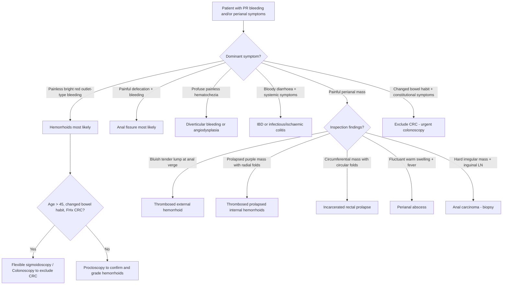

## Differential Diagnosis of Hemorrhoids

The differential diagnosis of hemorrhoids must be considered in two distinct clinical scenarios:

1. **The patient presenting with per-rectal (PR) bleeding** — the most common hemorrhoid symptom, but shared with many other conditions.
2. **The patient presenting with a painful perianal mass** — the acute presentation.

The golden rule, stated in the previous section and worth repeating:

<Callout title="Never Assume It's Just Hemorrhoids" type="error">
***ALWAYS exclude other possible sources of PR bleeding*** [3][4]. Hemorrhoids are a diagnosis of exclusion for sinister pathology. Attributing rectal bleeding to hemorrhoids without investigation — especially in patients > 45 years, with changed bowel habits, family history of CRC, or constitutional symptoms — is a dangerous clinical error.
</Callout>

The approach to the differential diagnosis is best organized by the **presenting symptom** and then by **anatomical location** (working proximally from the anal verge).

---

### A. Differential Diagnosis of PR Bleeding (Fresh Blood Per Rectum)

This is the clinical scenario where hemorrhoids most commonly enter the differential. The lecture slides list the ***common symptoms of anal pathology as: bleeding (usually fresh blood), anal pain, discharge (blood or purulent), prolapse, perianal mass, pruritus ani, incontinence*** [1].

Before diving into individual diagnoses, recall the localizing principle from history-taking [5][6]:

| Pattern of Bleeding | Likely Source | Why |
|:--|:--|:--|
| ***Melena*** (black, tarry) | Upper GIT (proximal to ligament of Treitz) | Blood exposed to gastric acid → haematin (black). Requires > 50–100 mL blood and > 14 hours transit time |
| ***Blood mixed with stool*** | LGIT proximal to sigmoid colon | Blood has time to mix with formed stool during transit through the colon |
| ***Blood separate from stool (outlet-type)*** | Anorectal source | Blood applied to the outside of stool or drips separately because the source is at the very end of the GI tract, distal to where stool is formed |
| ***Blood on its own (hematochezia without stool)*** | Diverticular disease, angiodysplasia, IBD, bleeding cancer | Brisk bleeding that is not associated with defecation |
| ***Cyclic bleeding*** | GI endometriosis | Ectopic endometrial tissue in bowel wall bleeds in sync with menstrual cycle |

[5][6]

Now let's work through each differential systematically.

---

#### 1. Colorectal Carcinoma (CRC)

This is the **most important diagnosis to exclude** — it is the reason we never just label PR bleeding as "hemorrhoids" without investigation.

- **Why it mimics hemorrhoids:** CRC can present with bright red PR bleeding, especially left-sided or rectal tumours. Patients may dismiss it as "just piles."
- **How to differentiate:** Look for ***constitutional symptoms (weight loss, anorexia, fatigue), change in bowel habits (e.g., alternating diarrhoea and constipation), change in stool calibre, tenesmus, intestinal obstruction (IO) symptoms, metastatic symptoms (e.g., jaundice, SOB, bone pain), family history, previous colonoscopy/FOBT results*** [5][6].
- **Pathophysiology of bleeding:** Tumour grows into the bowel lumen → ***overlying mucosal erosion or ulceration*** → bleeding. Bleeding may be occult (iron deficiency anaemia, FOBT positive) or overt (hematochezia, rarely melena from right-sided lesions) [6].
- **Key point:** Bleeding from CRC is typically ***mixed with stool*** (proximal lesions) or may coat the stool (rectal lesions), unlike the pure outlet-type dripping seen with hemorrhoids.

<Callout title="Red Flags Mandating Colonoscopy">
***Flexible sigmoidoscopy ± colonoscopy if risk of malignancy*** [2]:
- ***PR bleeding at age > 45 years***
- ***Change in bowel habit / tenesmus***
- ***Family history of CRC***
- Anemia or iron deficiency
- Constitutional symptoms
- ***Previous colonoscopy / FOBT history***, diet, smoking [5]
</Callout>

---

#### 2. Diverticular Disease (Diverticular Bleeding)

- **Epidemiology:** ***Most common cause of lower GI bleeding overall (15–55%)*** [6][7]. However, hemorrhoids remain the ***most common cause in patients < 50 years*** [7].
- **Pathophysiology:** Colonic diverticula are sac-like protrusions of the mucosa and submucosa through the muscular wall at points of nutrient artery penetration. The ***penetrating vessels (vasa recta) are draped over the dome of the diverticulum*** and are separated from the bowel lumen only by mucosa — this makes them vulnerable to ***rupture into the bowel lumen*** [7].
- **How it presents:** ***Painless profuse hematochezia*** [5][6] — classically large-volume, sudden-onset, bright red or maroon blood, often without preceding symptoms. This is typically much more profuse than hemorrhoidal bleeding.
- **How to differentiate from hemorrhoids:** Volume and pattern. Diverticular bleeding is usually **abrupt, profuse, and self-limiting** (80% stops spontaneously). Hemorrhoidal bleeding is **smaller volume, outlet-type (on paper, dripping, coating stool), and recurrent with defecation**.
- **Hong Kong relevance:** ***Right-sided diverticula are common in Asians*** (compared to left-sided predominance in Western populations) ***and have a higher risk of hemorrhage*** [7].
- **Important:** ***Diverticular bleeding typically occurs in the absence of diverticulitis*** — bleeding and inflammation are separate complications of diverticular disease [7].
- **Risk factors:** Advanced age, obesity, hypertension, hyperlipidaemia, IHD, chronic renal insufficiency, use of aspirin or NSAIDs [7].

---

#### 3. Angiodysplasia (Arteriovenous Malformation)

- **Epidemiology:** ***Most common cause of lower GI bleeding in patients > 65 years*** [7][8].
- **Pathophysiology:** ***Dilated, tortuous submucosal vessels*** whose walls are composed of ***endothelial cells lacking smooth muscle*** — these are acquired degenerative lesions where chronic peristaltic contraction causes intermittent obstruction of submucosal veins → loss of pre-capillary sphincter competence → formation of small AVMs [7][8].
- **Location:** Most commonly ***right-sided (caecum, ascending colon)*** [8].
- **How it presents:** Bleeding is usually ***occult*** (FOBT-positive stools, iron deficiency anaemia) but can be ***overt with hematochezia or melena***. Bleeding is ***venous in origin and tends to be less massive than diverticular bleeding*** [7].
- **How to differentiate from hemorrhoids:** Angiodysplasia bleeding is not outlet-type, often presents as occult bleeding with anaemia rather than bright red blood on paper, and typically occurs in elderly patients.
- **Associations:** ***ESRD, von Willebrand disease, aortic stenosis*** (Heyde syndrome — acquired Type 2A vWD from high shear stress across stenotic valve) [8].
- **Colonoscopy:** ***Cherry red spots*** [8]. Angiography: ***"mother-in-law phenomenon" (early filling, delayed emptying)*** [8].

---

#### 4. Inflammatory Bowel Disease (IBD)

- **Types:** Crohn's disease and ulcerative colitis.
- **How it presents:** ***Bloody diarrhoea, abdominal pain (cramping), urgency, tenesmus, mucus in stool, constitutional symptoms (fever, weight loss, fatigue)***.
- **How to differentiate from hemorrhoids:** IBD bleeding is typically ***mixed with stool*** and accompanied by diarrhoea, mucus, systemic symptoms, and often extraintestinal manifestations (joints, eyes, skin, liver). Hemorrhoidal bleeding is painless outlet-type bleeding without systemic features.
- **Important caveat:** ***Crohn's disease and ulcerative colitis should not be misdiagnosed as infectious or ischaemic colitis since therapy is different*** [7].

---

#### 5. Anal Fissure (Fissure-in-Ano)

This is a very common differential for hemorrhoids — both cause bright red PR bleeding and perianal symptoms, but the clinical picture is quite different.

- **Definition:** ***A tear in the mucosal lining below the dentate line*** [9].
- **Pathophysiology:** ***Local trauma (constipation, vaginal delivery) → pain → internal anal sphincter (IAS) spasm → impaired healing → vicious cycle*** [9]. The posterior midline (6 o'clock position) is ***the least perfused*** area of the anal canal, explaining why ***most fissures occur at 6 o'clock (posterior midline)*** [9]. About 10% occur at 12 o'clock (anterior), typically after vaginal delivery.
- **Clinical features from lecture slides:** ***Pain on defecation, fresh rectal bleeding. Diagnosis is by spreading the buttock to reveal the fissure. Rectal examination and proctoscopy are painful and not indicated*** [1][9].
- **How to differentiate from hemorrhoids:** The **key distinguishing feature is pain**. Anal fissure causes ***severe, tearing pain during and after defecation*** — this creates a vicious cycle (pain → avoidance of defecation → harder stools → more trauma). Hemorrhoidal bleeding is **painless** (unless complicated). The bleeding in fissure is also ***limited to a small amount on toilet paper or surface of stool*** [9], similar to hemorrhoids but always accompanied by significant pain.
- **Chronic fissure triad:** ***Fissure + sentinel pile (skin tag at distal end) + hypertrophied anal papillae (at proximal end)*** [9].

<Callout title="Atypical Fissure = Think Secondary Cause" type="idea">
***Always suspect perianal Crohn's disease if: non-midline, recurring, multiple, unusually deep or wide, perianal hypertrophic skin tags*** [9]. Other secondary causes: HIV, TB, STDs.
</Callout>

---

#### 6. Anorectal Abscess

- **Definition:** ***Acute phase manifestation of a collection of purulent material arising from glandular crypts in the anus or rectum*** [10]. The chronic phase of the same suppurative process is an ***anorectal fistula*** [10].
- **Pathophysiology:** Usually ***cryptoglandular infection*** — anal glands at the dentate line become blocked → infection → abscess formation, which can spread through tissue planes [10].
- **Clinical features from lecture slides:** ***Pain, swelling, drainage, constipation, urinary difficulties*** [1][10]. The pain is ***constant and not necessarily associated with bowel movements*** — unlike fissure (pain on defecation) or hemorrhoids (painless unless complicated) [10]. Associated with ***fever and malaise*** [10].
- **How to differentiate from hemorrhoids:** Abscess presents with a ***tender, fluctuant, warm perianal swelling*** with systemic signs (fever). Hemorrhoids are soft, compressible, and not associated with fever or purulent discharge.
- **Sites:** ***Perianal (20%), intersphincteric (18%), ischiorectal (60%), supralevator (2%)*** [10].

---

#### 7. Fistula-in-Ano (Anorectal Fistula)

- **Definition:** Abnormal communication between the anal canal (usually at the dentate line where the infected crypt was) and the perianal skin. It is the ***chronic phase of anorectal sepsis*** [10].
- **Clinical features from lecture slides:** ***Drainage, pain, bleeding, swelling, decrease in pain with drainage, external opening visible, PR examination reveals induration with a cord-like structure*** [1].
- **How to differentiate from hemorrhoids:** The ***chronic intermittent purulent discharge*** and the palpable ***cord-like tract*** on DRE are pathognomonic. Hemorrhoids do not drain pus and do not have external openings.

---

#### 8. Rectal Prolapse (Rectal Procidentia)

- **Definition:** ***Protrusion of all layers of the rectum through the anus*** (complete) or ***protrusion of mucosa only*** (partial/mucosal prolapse) [11].
- **How it mimics hemorrhoids:** Both present as a **prolapsing mass** through the anus. This is a classic clinical and exam question — differentiating prolapsed hemorrhoids from rectal prolapse.
- **Key differentiating feature on inspection:**
  - ***Rectal prolapse: concentric CIRCULAR mucosal folds*** (full-thickness wall with its circumferential mucosal pattern)
  - ***Prolapsed hemorrhoids: RADIAL mucosal folds*** (individual cushions protrude at 3, 7, 11 o'clock with normal intervening skin/mucosa)
- **Epidemiology:** ***Majority affects elderly women*** [11].
- **Associated symptoms:** ***Faecal incontinence (75%), constipation (15–65%), mucus/stool discharge, incomplete evacuation*** [11].

<Callout title="Circular vs Radial Folds — The Inspection Distinction">
This is commonly tested. When you see a prolapsing anal mass:
- **Concentric circular folds** = rectal prolapse (full-thickness rectal wall)
- **Radial folds with separate cushions** = prolapsed hemorrhoids

If unsure, ask the patient to strain while in the left lateral position and observe.
</Callout>

---

#### 9. Colitis (Infectious / Ischaemic / Radiation)

- **Infectious colitis:** Dysentery-type illness with bloody diarrhoea, fever, cramping — usually acute onset, travel history, sick contacts.
- **Ischaemic colitis:** Typically in elderly patients with vascular risk factors. Sudden crampy left-sided abdominal pain followed by bloody diarrhoea. Watershed areas (splenic flexure) most vulnerable.
- ***Radiation telangiectasia and proctitis:*** ***Radiation therapy for abdominal/pelvic cancers (e.g., cervical, prostate) can lead to lower GI bleeding. Acute radiation injury often occurs within 6 weeks of therapy*** [7]. Chronic radiation proctitis may present months to years later.

---

#### 10. Other Anorectal Disorders

These are less common but important to keep in the differential [7]:

| Condition | Key Features |
|:--|:--|
| **Rectal varices** | ***Associated with portal hypertension*** [7]. Dilated submucosal veins — different from hemorrhoids (see callout in prior section). Occur in patients with cirrhosis. |
| **Solitary rectal ulcer** | Straining-related ischaemic ulceration of the anterior rectal wall. Associated with rectal prolapse and paradoxical puborectalis contraction. Pale, shallow ulcer on sigmoidoscopy. |
| **Anal carcinoma** | ***Painful PR bleeding, pruritus, palpable mass***. ***Squamous cell carcinoma below dentate line (80%), adenocarcinoma above dentate line (10%)***. Risk factors: ***HPV (esp. 16 and 18), HIV, smoking, immunocompromised, Crohn's disease*** [12]. |
| **Rectal ulcers** | Various causes including NSAID, stercoral (faecal impaction), trauma |
| **Dieulafoy's lesion** | Aberrant submucosal artery that erodes through the mucosa without an ulcer. Rare in the rectum but described. |
| **Post-polypectomy / biopsy bleeding** | ***Iatrogenic — bleeding following recent endoscopic intervention*** [7] |

---

#### 11. Anal Carcinoma (Expanded)

Worth expanding because it can masquerade as chronic hemorrhoids:

- ***Pathology: SCC below dentate line (80%), adenocarcinoma above dentate line (10%), others include melanoma*** [12].
- ***Risk factors: HPV infection (90%, especially HPV-16 and 18), HIV, smoking, immunocompromised, Crohn's disease*** [12].
- ***Clinical features: painful PR bleeding, pruritus, palpable mass. Examine for inguinal lymph nodes (superficial inguinal LN if tumour below dentate line)*** [12].
- **Why it mimics hemorrhoids:** Both can cause PR bleeding, pruritus, and a perianal mass. Any non-healing perianal lesion, especially with pain and lymphadenopathy, must be biopsied.

---

### B. Differential Diagnosis of Acute Painful Anal/Perianal Mass

This is the second major clinical scenario. The lecture slides list the ***common symptoms: bleeding, anal pain, discharge, prolapse, perianal mass, pruritus ani, incontinence*** [1].

| Condition | Key Differentiating Features |
|:--|:--|
| ***Thrombosed prolapsed internal hemorrhoids*** | Multiple prolapsed cushions from within the anal canal; acute pain due to strangulation; visible engorged, purple/necrotic tissue |
| ***Thrombosed external hemorrhoids (perianal haematoma)*** | ***Painful bluish mass at the anal verge; forms skin tag after 48 hours*** [2]. Single, well-defined, subcutaneous bluish lump. Maximal pain in first 48–72 hours. |
| ***Incarcerated rectal prolapse*** | ***Circular folds visible*** (concentric rings of full-thickness rectal wall protruding circumferentially) [2]. Distinguished from hemorrhoids by fold pattern. |
| **Perianal abscess** | Tender, fluctuant, warm, erythematous swelling. May have systemic signs (fever, malaise). ***Pain, swelling, drainage, constipation, urinary difficulties*** [1]. |
| **Anal fissure** | Severe tearing pain on defecation, visible linear tear on inspection (usually posterior midline). ***Diagnosis by spreading buttocks to reveal fissure; DRE and proctoscopy are painful and not indicated*** [1]. |
| **Perianal Crohn's disease** | Multiple, non-midline fissures; fistulae; hypertrophic skin tags; deep ulceration. History of IBD symptoms. |
| **Pilonidal abscess** | Located in the ***natal cleft (sacrococcygeal region)***, ***does not continue into the anal canal*** (unlike anal fistula) [12]. More common in Caucasian males with coarse dark body hair. |
| ***Anal carcinoma*** | Hard, irregular mass. Painful PR bleeding. Inguinal lymphadenopathy. Must biopsy. |
| **Proctalgia fugax** | ***Brief attacks of rectal pain at night, unrelated to defecation, in young anxious men. Benign and self-limiting*** [12]. No visible mass. |

---

### C. Differential Diagnosis Decision Algorithm

---

### D. Summary Table: Key Differentiating Features

| Condition | Bleeding | Pain | Mass | Key Distinguishing Feature |
|:--|:--|:--|:--|:--|
| **Internal hemorrhoids** | Bright red, painless, outlet-type | Only if complicated | Prolapsing at 3/7/11 o'clock, radial folds | Outlet-type bleeding, painless, radial prolapse pattern |
| **External hemorrhoids** | Minimal | Severe if thrombosed | Bluish perianal lump | Painful bluish mass at anal verge |
| **Anal fissure** | Small amount, on paper | Severe tearing on defecation | Sentinel pile if chronic | Pain is the dominant symptom; visible tear posterior midline |
| **CRC** | Mixed with stool or occult | Late feature | May be palpable on DRE | Changed bowel habit, constitutional symptoms, iron deficiency |
| **Diverticular bleeding** | Profuse, painless | Mild cramping only | None | Sudden profuse painless hematochezia; self-limiting |
| **Angiodysplasia** | Often occult; can be overt | Painless | None | Elderly; right-sided; cherry red spots on colonoscopy |
| **IBD** | Bloody diarrhoea | Crampy abdominal pain | None typically | Systemic features; extraintestinal manifestations |
| **Perianal abscess** | Minimal | Constant, not related to defecation | Fluctuant, warm | Fever, purulent discharge |
| **Fistula-in-ano** | Minimal | With drainage | Cord-like tract, external opening | Chronic intermittent purulent discharge |
| **Rectal prolapse** | Present | Variable | Circumferential with circular folds | Circular folds (not radial); faecal incontinence |
| **Anal carcinoma** | Painful bleeding | Yes | Hard, irregular | HPV association; inguinal LN; must biopsy |

---

<Callout title="High Yield Summary">

**Two main DDx scenarios for hemorrhoids:**

1. **PR bleeding DDx (most important to exclude CRC):**
   - Hemorrhoids (most common < 50y), diverticular disease (most common overall), angiodysplasia (most common > 65y), CRC, IBD, anal fissure, colitis (infectious/ischaemic/radiation), anorectal disorders (rectal varices, ulcers, Dieulafoy's), post-procedural, anal carcinoma.

2. **Acute painful perianal mass DDx:**
   - Thrombosed external hemorrhoids (bluish mass, skin tag after 48h), thrombosed prolapsed internal hemorrhoids (radial folds), incarcerated rectal prolapse (circular folds), perianal abscess (fluctuant, warm, fever), anal fissure (tearing pain, posterior midline tear), anal carcinoma (hard, inguinal LN).

**Critical rules:**
- Always exclude CRC: colonoscopy if age > 45, changed bowel habit, FHx CRC, constitutional symptoms, iron deficiency.
- Rectal prolapse vs prolapsed hemorrhoids: circular folds (prolapse) vs radial folds (hemorrhoids).
- Anal fissure: pain is dominant; hemorrhoids: painless unless complicated.
- Diverticular bleeding: profuse; hemorrhoidal bleeding: small-volume outlet-type.

</Callout>

---

<ActiveRecallQuiz
  title="Active Recall - Differential Diagnosis of Hemorrhoids"
  items={[
    {
      question: "A 55-year-old man presents with bright red per-rectal bleeding. What are the red flag features that mandate colonoscopy rather than simply attributing the bleeding to hemorrhoids?",
      markscheme: "Age > 45 with PR bleeding, change in bowel habit or tenesmus, family history of CRC, constitutional symptoms (weight loss, anorexia, fatigue), iron deficiency anaemia, change in stool calibre, previous polyp history. Must exclude colorectal carcinoma."
    },
    {
      question: "How do you differentiate prolapsed hemorrhoids from rectal prolapse on inspection?",
      markscheme: "Prolapsed hemorrhoids show RADIAL mucosal folds with separate cushions at 3, 7, 11 o'clock positions with normal intervening skin. Rectal prolapse shows concentric CIRCULAR mucosal folds representing full-thickness rectal wall circumferential protrusion."
    },
    {
      question: "Name three common causes of lower GI bleeding and their typical age predominance.",
      markscheme: "Diverticular disease: most common cause overall (15-55% of LGIB). Hemorrhoids: most common in age < 50. Angiodysplasia: most common in age > 65."
    },
    {
      question: "A patient presents with a painful perianal mass. List four differential diagnoses and one key distinguishing feature for each.",
      markscheme: "(1) Thrombosed external hemorrhoid - painful bluish mass at anal verge, forms skin tag after 48h. (2) Thrombosed prolapsed internal hemorrhoids - prolapsed engorged mass with radial folds. (3) Perianal abscess - fluctuant, warm, tender swelling with fever and purulent discharge. (4) Incarcerated rectal prolapse - circumferential mass with circular folds. Others acceptable: anal fissure (tearing pain on defecation, visible tear posterior midline), anal carcinoma (hard irregular mass, inguinal LN)."
    },
    {
      question: "How does the bleeding pattern of hemorrhoids differ from diverticular bleeding and from colorectal carcinoma?",
      markscheme: "Hemorrhoids: small-volume, bright red, painless, outlet-type bleeding (on paper, dripping, coating surface of stool, separate from stool). Diverticular bleeding: profuse, sudden-onset, painless hematochezia, typically self-limiting. CRC: blood mixed with stool (proximal lesions), or coating stool (distal), often occult causing iron deficiency anaemia; associated with changed bowel habits and constitutional symptoms."
    }
  ]}
/>

## References

[1] Lecture slides: GC 179. Anal pain perianal lesions and sepsis.pdf (p3, p27, p46, p50, p56)
[2] Senior notes: maxim.md (Haemorrhoids section — Acute painful anal mass, pp. 110–111)
[3] Senior notes: felixlai.md (Hemorrhoids section, pp. 745–750)
[4] Senior notes: felixlai.md (Hemorrhoids — Clinical manifestation, p. 745)
[5] Senior notes: maxim.md (LGIB section — DDx table, p. 158)
[6] Lecture slides: GC 186. Lower and diffuse abdominal pain fresh blood in stool.pdf
[7] Senior notes: felixlai.md (Lower GI bleeding — DDx, pp. 342–343)
[8] Senior notes: maxim.md (Angiodysplasia section, p. 197)
[9] Senior notes: maxim.md (Anal fissure section, pp. 111–112)
[10] Senior notes: felixlai.md (Anorectal abscess, pp. 754–755)
[11] Senior notes: felixlai.md (Rectal prolapse, pp. 761–762)
[12] Senior notes: maxim.md (Anal carcinoma and Pilonidal sinus, p. 116)
