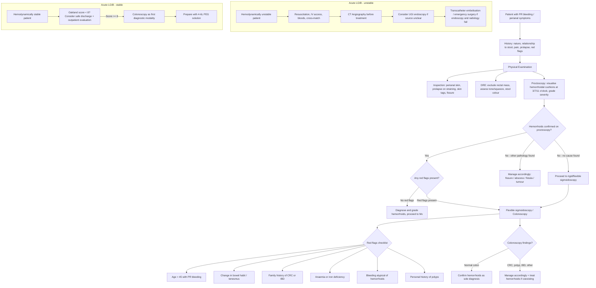

## Diagnosis of Hemorrhoids — Diagnostic Criteria, Algorithm and Investigations

### A. Diagnostic Criteria

Hemorrhoids do **not** have formal standardized diagnostic criteria like, say, the Rome IV criteria for functional GI disorders. Instead, the diagnosis is made clinically through a combination of:

1. **Compatible history** (symptom pattern)
2. **Physical examination** (inspection, DRE)
3. **Endoscopic visualization** (proctoscopy — the definitive diagnostic tool)
4. **Exclusion of sinister pathology** (the most important step)

Let me walk through each of these from first principles.

---

### B. Step 1 — History Taking (Clinical Diagnosis)

The history alone will often point strongly toward hemorrhoids, but **never** allows you to stop there. The approach to anorectal disease from the lecture slides is structured as follows:

***History: present illness (anorectal symptoms: pain, bleeding, mass, prolapse), past health (medical diseases, previous surgery), family history, sexual history*** [1].

#### Key History Points for Hemorrhoids

| History Domain | What to Ask | Why |
|:--|:--|:--|
| **Nature of bleeding** | Bright red? On paper, dripping, or mixed with stool? | Outlet-type (on paper, dripping, coating stool surface) points to anorectal source. Blood mixed with stool suggests more proximal colonic pathology |
| **Relationship to defecation** | Does blood appear during/after defecation? Separate from stool? | Hemorrhoidal bleeding is characteristically ***separate from stool*** [5] — because the bleeding occurs at the very end of the GI tract, after the stool has already formed |
| **Pain** | Painless? Pain only with complications? Tearing pain on defecation? | Uncomplicated internal hemorrhoids are **painless** (visceral innervation). Pain suggests thrombosis, strangulation, or a different diagnosis (fissure, abscess). ***Pain on defecation*** = think anal fissure [1] |
| **Prolapse** | Mass that comes out during straining? Does it go back on its own? Need to push it back? Permanently out? | Determines Goligher grade (I–IV). Spontaneous reduction = Grade II; manual reduction = Grade III; irreducible = Grade IV |
| **Mucus/discharge** | Any mucus soiling of underwear? | Prolapsed columnar mucosa secretes mucus → perianal soiling and irritation |
| **Pruritus** | Itching around anus? | Due to chronic moisture from mucus discharge |
| **Bowel habit changes** | Any change in bowel habit, stool calibre, tenesmus? | Red flags for CRC — must be specifically asked |
| **Constitutional symptoms** | Weight loss, anorexia, fatigue? | Red flags for malignancy |
| **Risk factors** | Constipation, straining, pregnancy, diet, family history of hemorrhoids or CRC? | Risk stratification for hemorrhoids vs. malignancy |
| **Drug history** | ***NSAIDs, antiplatelet agents, anticoagulants*** [6] | Affect bleeding risk; influence choice of intervention (e.g., RBL contraindicated on anticoagulants) |

The lecture slides on LGIB assessment emphasize a systematic bleeding severity assessment: ***"When did the bleeding start? First episode? Hematochezia? Melena? Recent endoscopy?"*** [6].

---

### C. Step 2 — Physical Examination

The lecture slide on assessment of hemorrhoids states:

***"Digital rectal examination (to exclude other rectal lesions). Proctoscopy: for diagnosis and assessment of severity. Rigid or flexible sigmoidoscopy to exclude proximal bowel lesion"*** [1].

Let me break each component down:

#### C1. Inspection

- Patient positioned in **left lateral (Sims) position** or **lithotomy** position.
- Look at the perianal skin and anal verge:
  - **Skin tags** — residual from previous thrombosed external hemorrhoids
  - **Prolapsed hemorrhoids** — engorged, purple-red, soft tissue protruding from the anus with **radial mucosal folds** (as opposed to circular folds of rectal prolapse)
  - **Thrombosed external hemorrhoid** — bluish, firm, tender subcutaneous lump at the anal verge
  - **Fissure** — linear tear, usually at posterior midline (6 o'clock)
  - **External openings of fistula-in-ano** — discharge, granulation tissue
  - **Condylomata** — warty lesions (HPV)
  - **Excoriation** — from chronic mucus discharge and scratching
- Ask the patient to **bear down / strain** — this may provoke prolapse of internal hemorrhoids, allowing you to grade them.

#### C2. Digital Rectal Examination (DRE)

***DRE is performed to exclude other rectal lesions*** [1][3][4]:

- **What DRE can assess:**
  - ***Anal tone*** (reflects IAS function) and ***squeeze pressure*** (reflects EAS function — ask the patient to squeeze your finger) [2]
  - Presence of **rectal masses** (palpable tumour, polyp)
  - **Induration, tenderness** (abscess, fissure, carcinoma)
  - **Prostate** (males) or **rectovaginal septum** (females)
  - **Stool colour** — important in GI bleeding assessment

<Callout title="Critical Limitation of DRE" type="error">
***1st and 2nd degree internal hemorrhoids are usually NOT palpable on DRE*** [2]. They are soft, compressible submucosal swellings that cannot be reliably felt by finger. DRE is essential to **exclude other pathology** but is not sufficient to diagnose or grade internal hemorrhoids. ***Proctoscopy is required.***
</Callout>

#### C3. Proctoscopy (The Key Diagnostic Tool)

***Proctoscopy*** is the single most important investigation for **diagnosis and assessment of severity** of internal hemorrhoids [1][2]:

- **Why proctoscopy?** Internal hemorrhoids originate above the dentate line in the anal canal — a rigid proctoscope provides direct visualization of this area. The hemorrhoidal cushions at 3, 7, and 11 o'clock can be directly inspected for engorgement, prolapse, and active bleeding.
- **How it works:** A rigid tubular instrument with an obturator is inserted into the anal canal. The obturator is removed and the proctoscope is slowly withdrawn — the hemorrhoidal tissue prolapses into the lumen of the scope, allowing direct visualization.
- **What to look for:**
  - Engorged vascular cushions at 3, 7, 11 o'clock positions
  - Degree of prolapse (for Goligher grading)
  - Active bleeding or stigmata of recent hemorrhage
  - Other pathology (fissures, polyps, tumours)
- **Also used therapeutically:** Rubber band ligation, injection sclerotherapy, and infrared coagulation are all performed through a proctoscope.

<Callout title="Exam Pearl">
When asked "How do you diagnose hemorrhoids?" the answer sequence is: **History → Inspection → DRE → Proctoscopy**. Proctoscopy is the definitive diagnostic step. DRE alone is insufficient.
</Callout>

---

### D. Step 3 — Excluding Proximal Bowel Pathology (The "Must Not Miss" Step)

This is where the diagnostic approach transitions from "confirming hemorrhoids" to "ruling out cancer and other serious pathology." The lecture slides are emphatic:

***"Common anorectal conditions are mostly benign. Colorectal neoplasm needs to be excluded. Diagnosis can usually be made by careful history and examination. Treatment is mainly for symptomatic control"*** [1].

***"Do not assume all the symptoms are attributable to hemorrhoids"*** [3].

#### D1. Rigid or Flexible Sigmoidoscopy

***Rigid or flexible sigmoidoscopy*** is used ***to exclude proximal bowel lesion*** [1][3].

- **Rigid sigmoidoscopy:** Allows direct visualization of the rectum and distal sigmoid (up to ~25 cm). Quick, usually done without sedation. Can identify rectal tumours, proctitis, rectal varices, and solitary rectal ulcer.
- **Flexible sigmoidoscopy:** Reaches the splenic flexure (~60 cm). Better visualization and can biopsy suspicious lesions. However, does not examine the entire colon.

#### D2. Colonoscopy

***Referral for colonoscopy*** is indicated when there are **red flag features suggesting pathology beyond hemorrhoids** [2][3]:

| Indication for Colonoscopy | Rationale |
|:--|:--|
| ***PR bleeding in age > 45 years*** [2] | Increased risk of CRC with age; symptoms may overlap |
| ***Change in bowel habit / tenesmus*** [2] | Cardinal symptom of colorectal carcinoma |
| ***Family history of CRC*** [2] | Increased genetic risk of neoplasia |
| ***Anaemia*** [3] | Occult blood loss from proximal colonic lesion (e.g., right-sided CRC causing iron deficiency anaemia) |
| ***Bleeding atypical of hemorrhoids*** [3] | e.g., blood mixed with stool, dark/altered blood, large volume |
| ***Concomitant change in bowel habits*** [3] | Raises concern for malignancy |
| ***Personal history of colorectal polyps*** [3] | Risk of metachronous neoplasia |
| ***Family history of IBD or CRC in first-degree relative*** [3] | Higher risk population requiring full colonic assessment |

The lecture slides on intermittent/episodic PR bleeding state:

***"Colonoscopy — current gold standard in detecting colonic neoplasm. Needs diet and bowel preparation ± sedation. Chance of perforation ≤ 0.1%. Therapeutic modalities (clipping, electrocoagulation, laser, argon plasma coagulation, sclerotherapy)"*** [6].

---

### E. Step 4 — Laboratory Investigations

Hemorrhoids themselves do not require specific laboratory tests for diagnosis. However, investigations are essential for **assessing the impact of bleeding** and **excluding other pathology**:

The lecture slides state investigations should include: ***"Blood tests — haemoglobin and haematocrit, liver and renal function test, coagulation profile, type and screen"*** [6].

| Investigation | What It Shows | Why It Matters |
|:--|:--|:--|
| ***FBC (Full Blood Count)*** [6] | ***Haemoglobin*** — may reveal iron deficiency anaemia from chronic occult or overt blood loss | Chronic hemorrhoidal bleeding can rarely cause significant anaemia; if anaemia is present, must exclude more proximal GI lesion |
| **Iron studies** (ferritin, serum iron, TIBC) | Iron deficiency pattern (low ferritin, low serum iron, high TIBC) | Confirms iron deficiency anaemia — raises concern for CRC if out of proportion to visible hemorrhoidal bleeding |
| ***Coagulation profile*** [6] | ***INR***, ***PT***, ***APTT***, ***platelet count*** | Important if considering procedural intervention (RBL, surgery). Coagulopathy increases bleeding risk. Also important in patients on anticoagulants |
| ***Renal and liver function*** [6] | Liver disease may suggest portal hypertension; renal impairment affects fluid management | Cirrhotic patients may have rectal varices (not hemorrhoids) and coagulopathy; renal disease associated with angiodysplasia |
| ***Type and screen / cross-match*** [6] | Blood group and antibody screen | Required if patient has significant bleeding or is being prepared for surgery |
| ***CEA (Carcinoembryonic Antigen)*** [6] | Tumour marker | ***Low sensitivity (~30%) for colorectal cancer*** [6] — not a screening test, but useful as a baseline if CRC is later diagnosed. Not useful for diagnosing hemorrhoids |

<Callout title="CEA is Not a Screening Tool" type="error">
The lecture slide specifically notes: ***"CEA — low sensitivity ~30% for colorectal cancer"*** [6]. A normal CEA does **not** exclude CRC. Do not rely on CEA to "rule out" cancer. Colonoscopy is the gold standard.
</Callout>

---

### F. Additional Investigation Modalities (For Complex or Unclear Cases)

These are not routinely used for straightforward hemorrhoid diagnosis, but become relevant when the clinical picture is atypical or when acute LGIB requires localization:

| Investigation | Indication | Key Findings |
|:--|:--|:--|
| **CT Angiography (CTA)** | ***Hemodynamically unstable patient with acute LGIB*** [6] — when colonoscopy is not feasible due to ongoing bleeding | Active contrast extravasation identifies the bleeding site. ***CTA before any treatment*** in unstable patients [6] |
| **Mesenteric angiography** | Active bleeding not localizable by endoscopy | Can identify and embolize bleeding vessels. Requires active bleeding rate of > 0.5 mL/min to detect |
| **Upper GI endoscopy (OGD)** | ***Consider UGI endoscopy unless CTA has already located the site of bleeding*** [6] — to rule out upper GI source presenting as hematochezia | Up to 10–15% of patients presenting with apparent LGIB (hematochezia) actually have a brisk upper GI source |
| **Endoanal ultrasound (EAUS)** | Assessment of anal sphincter integrity | Useful pre-operatively if concerned about sphincter damage, or in patients with incontinence. Not routine for hemorrhoids |
| **MRI pelvis** | Suspected anal carcinoma, complex fistula, or rectal prolapse | Excellent soft tissue delineation; staging of anal/rectal malignancy |
| **Defecating proctography** | Suspected rectal prolapse or obstructed defecation syndrome | Dynamic imaging showing prolapse during straining |
| **Anorectal manometry** | Suspected sphincter dysfunction, incontinence, or pre-operative assessment | Measures resting anal pressure (IAS) and squeeze pressure (EAS). Hemorrhoid patients may show elevated resting tone |

---

### G. Approach to Acute LGIB (When Hemorrhoids Are Part of the DDx)

For patients presenting with **acute lower GI bleeding** where hemorrhoids are one of several possible diagnoses, the lecture slide provides a comprehensive algorithm [6]. Let me integrate this:

#### Acute LGIB — Severity Assessment

The lecture slide framework: ***"History (When did the bleeding start? First episode? Hematochezia? Melena? Recent endoscopy?), Physical examination (vital signs, cardiopulmonary and abdominal examinations, including DRE — tachycardia? hypotension? syncope? gross blood on DRE? recurrent/ongoing hematochezia?), Laboratory tests (FBC, serum electrolytes, coagulation tests, type and cross match — Hb? Albumin? INR? PLT? Creatinine?), Co-morbidities (older age? need for RBC transfusion?), Concomitant medications (NSAIDs? antiplatelet agents? anticoagulants?)"*** [6].

#### Transfusion Targets (From Lecture Slides)

- ***If Hb < 7 g/dL, transfuse: target Hb 7–9 g/dL post-transfusion if no CVD*** [6]
- ***If Hb ≥ 8 g/dL and CVD present, transfuse: target Hb ≥ 10 g/dL*** [6]

#### Oakland Score

***"Consider safe hospital discharge and outpatient evaluation if Oakland score < 8"*** [6]. The Oakland score predicts the probability of safe discharge in patients with acute LGIB based on age, sex, previous LGIB, DRE findings, heart rate, systolic BP, and haemoglobin.

---

### H. Diagnostic Algorithm — Complete Flowchart

---

### I. Summary of Investigation Hierarchy for Hemorrhoids

The investigations can be thought of in three tiers:

| Tier | Investigation | Purpose |
|:--|:--|:--|
| **Tier 1 — Always** | ***Inspection + DRE + Proctoscopy*** [1] | Diagnose hemorrhoids, grade severity, exclude other anal pathology |
| **Tier 2 — If red flags** | ***Rigid/flexible sigmoidoscopy ± colonoscopy*** [1][3] | Exclude proximal bowel lesion (CRC, IBD, diverticular disease, angiodysplasia) |
| **Tier 3 — Adjunct / acute bleeding** | Bloods (FBC, coagulation, LFT, RFT, T&S), CT angiography, mesenteric angiography, OGD | Assess bleeding severity, locate bleeding source, exclude upper GI source, pre-operative workup |

<Callout title="The Three-Tool Diagnostic Standard for Hemorrhoids" type="idea">
Think of hemorrhoid diagnosis as a **three-legged stool**:
1. **DRE** — to exclude other rectal lesions
2. **Proctoscopy** — to diagnose and grade hemorrhoids
3. **Sigmoidoscopy/Colonoscopy** — to exclude proximal pathology (if indicated)

You cannot make a safe diagnosis of hemorrhoids without all three legs being considered, even if not all three are performed in every patient.
</Callout>

---

### J. Interpretation of Key Findings

| Finding | Interpretation |
|:--|:--|
| **Engorged cushions at 3, 7, 11 o'clock on proctoscopy** | Classic internal hemorrhoids — corresponds to the three terminal branches of the superior rectal artery |
| **Prolapse on straining with radial mucosal folds** | Internal hemorrhoids (Grade II–IV depending on reducibility). Radial folds differentiate from rectal prolapse (circular folds) |
| **Bluish firm tender mass at anal verge** | Thrombosed external hemorrhoid |
| **Normal proctoscopy with positive FOBT/iron deficiency anaemia** | Must proceed to colonoscopy — hemorrhoids are unlikely to cause significant anaemia alone; exclude CRC |
| **Mass palpable on DRE** | Not typical of hemorrhoids (which are soft and compressible). Consider rectal carcinoma, polyp, or submucosal lesion — biopsy indicated |
| **Elevated resting anal tone on DRE** | May be seen with hemorrhoids (especially with associated fissure or incarceration). Elevated tone contributes to venous congestion |

---

<Callout title="High Yield Summary">

**Hemorrhoid diagnosis is clinical + endoscopic:**
- No formal diagnostic criteria — diagnosis based on compatible history + proctoscopic visualization.

**Assessment sequence (from lecture slides):**
1. ***DRE — exclude other rectal lesions***
2. ***Proctoscopy — diagnosis and assessment of severity***
3. ***Rigid or flexible sigmoidoscopy — exclude proximal bowel lesion***

**Proctoscopy is the definitive diagnostic tool** — Grade I/II hemorrhoids are often not palpable on DRE.

**Colonoscopy indications (must know):** Age > 45 with PR bleeding, changed bowel habit/tenesmus, FHx CRC/IBD, anaemia, bleeding atypical of hemorrhoids, history of polyps.

**For acute LGIB:** Severity assessment (history, examination, labs), hemodynamic stability determines pathway. Unstable → CTA → embolisation. Stable → colonoscopy as first modality.

**Key lab investigations:** FBC (Hb for anaemia), coagulation (pre-procedure), T&S (if bleeding). CEA has low sensitivity (~30%) — not a screening tool.

**Lecture slide summary: "Common anorectal conditions are mostly benign. Colorectal neoplasm needs to be excluded. Diagnosis can usually be made by careful history and examination."**

</Callout>

---

<ActiveRecallQuiz
  title="Active Recall - Diagnosis of Hemorrhoids"
  items={[
    {
      question: "What are the three key components of the assessment sequence for hemorrhoids as stated in the lecture slides?",
      markscheme: "(1) Digital rectal examination - to exclude other rectal lesions. (2) Proctoscopy - for diagnosis and assessment of severity. (3) Rigid or flexible sigmoidoscopy - to exclude proximal bowel lesion."
    },
    {
      question: "Why is proctoscopy essential for diagnosing hemorrhoids rather than relying on DRE alone?",
      markscheme: "Grade I and II internal hemorrhoids are soft submucosal swellings that are usually not palpable on DRE. Proctoscopy provides direct visualization of the hemorrhoidal cushions at 3, 7, and 11 o'clock positions, allowing accurate diagnosis and Goligher grading. DRE is important to exclude other rectal lesions but insufficient for hemorrhoid diagnosis."
    },
    {
      question: "List five indications for referral for colonoscopy in a patient with suspected hemorrhoids.",
      markscheme: "Any five of: (1) PR bleeding at age > 45, (2) change in bowel habit or tenesmus, (3) family history of CRC or IBD in first-degree relative, (4) anaemia or iron deficiency, (5) bleeding atypical of hemorrhoids (e.g., mixed with stool, dark, large volume), (6) personal history of colorectal polyps, (7) constitutional symptoms."
    },
    {
      question: "In acute LGIB, what determines whether you perform CT angiography or colonoscopy first?",
      markscheme: "Hemodynamic stability. Hemodynamically UNSTABLE patients: CT angiography before any treatment, consider UGI endoscopy if source unclear, transcatheter embolisation or emergency surgery if endoscopy/radiology fail. Hemodynamically STABLE patients: colonoscopy as first diagnostic modality (prepare with 4-6L PEG solution). Consider safe discharge if Oakland score < 8."
    },
    {
      question: "What is the sensitivity of CEA for colorectal cancer and what is its role in the workup of PR bleeding?",
      markscheme: "CEA has low sensitivity of approximately 30% for colorectal cancer. It is NOT a screening tool and should not be used to rule out CRC. A normal CEA does not exclude malignancy. Its main use is as a baseline tumour marker if CRC is subsequently diagnosed, and for monitoring recurrence post-treatment. Colonoscopy remains the gold standard for detecting colonic neoplasm."
    }
  ]}
/>

## References

[1] Lecture slides: GC 179. Anal pain perianal lesions and sepsis.pdf (p4, p13, p28, p77)
[2] Senior notes: maxim.md (Haemorrhoids section — Examination, pp. 109–110)
[3] Senior notes: felixlai.md (Hemorrhoids — Diagnosis, pp. 745–746)
[4] Senior notes: felixlai.md (Hemorrhoids — Clinical manifestation and diagnosis, p. 745)
[5] Senior notes: maxim.md (LGIB section — History taking, p. 158)
[6] Lecture slides: GC 186. Lower and diffuse abdominal pain fresh blood in stool.pdf (p6, p20, p22, p38)
