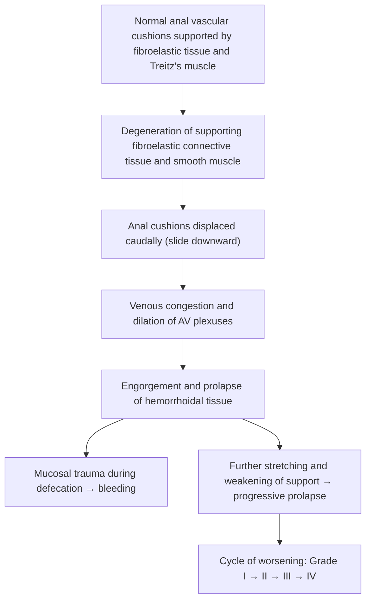
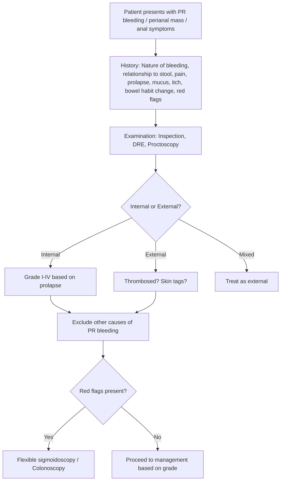

# Hemorrhoids

## 1. Definition

***Hemorrhoids*** (also known as "piles") are **abnormal engorgement, distension, and distal displacement (prolapse) of the anal vascular cushions** [1][2].

Let's break that down from first principles:

- **Anal vascular cushions** are normal anatomical structures present in every human being. They are clusters of **vascular tissue (arteriovenous sinusoids), smooth muscle (Treitz's muscle), and connective tissue (fibroelastic supporting tissue)**, lined by mucosa [1][2].
- Their **components** include: ***branches of the superior rectal artery, superior rectal veins***, and a **mucosal covering** [2].
- Their normal **function** is twofold [1][2]:
  1. ***Aid in maintaining continence*** — they act as a "vascular plug" that swells to seal the anal canal at rest, contributing ~15–20% of resting anal canal pressure.
  2. ***Protect the sphincters and anus from the trauma of defecation*** — they cushion the anal canal during the passage of stool.

- These cushions are ***found in 3, 7, and 11 o'clock positions*** (with the patient in the **lithotomy position**, where 12 o'clock is suprapubic) — this corresponds to the three anatomical columns of submucosal arteriovenous plexus [3].

So hemorrhoids are NOT "new" growths — they are **pre-existing normal structures that become pathological** when the supporting fibroelastic connective tissue and smooth muscle degenerate, leading to caudal displacement, engorgement, and prolapse of the vascular cushions [2].

<Callout title="Key Concept">
Everyone has anal vascular cushions. "Hemorrhoids" as a disease refers to when these cushions become symptomatic — engorged, prolapsed, bleeding, or thrombosed. The pathology is in the supporting tissue, not the vessels themselves.
</Callout>

---

## 2. Epidemiology

- ***Prevalence: 4.4% of the US population are seen by physicians for symptomatic hemorrhoids*** [1].
- ***49 per 100,000 US population undergo hemorrhoidectomy annually*** [1].
- Peak incidence is between ages **45–65 years** [3].
- Equally affects males and females, though men are more likely to seek treatment [3].
- In **Hong Kong**, hemorrhoids are extremely common — the high-fibre traditional Chinese diet is increasingly replaced by Western-style low-fibre diets, and prolonged sitting (especially on the toilet with smartphone use) is culturally prevalent, contributing to high rates.
- The true prevalence is likely much higher than reported, as many patients self-manage with over-the-counter preparations and never present to a physician.

---

## 3. Risk Factors

Understanding risk factors requires understanding the **two key pathological mechanisms**: (a) degeneration of supporting tissue, and (b) increased venous pressure/engorgement.

| Risk Factor | Mechanism |
|:--|:--|
| ***Constipation and straining*** [1][4] | Straining increases intra-abdominal pressure → transmitted to hemorrhoidal venous plexus → venous engorgement. Chronic straining also causes repetitive shearing force on the fibroelastic supporting tissue → degeneration and caudal displacement |
| ***Low fibre diet*** [1][4] | Low fibre → hard stools → more straining needed → same mechanism as above |
| ***Pregnancy*** [1][4] | (1) Gravid uterus compresses IVC and pelvic veins → impaired venous return → venous engorgement; (2) Hormonal effects (progesterone) relax smooth muscle and connective tissue → weakened support; (3) Straining during delivery |
| ***Family history*** [1][4] | Genetic predisposition — likely relates to inherent connective tissue weakness or collagen composition |
| ***Aging*** [2] | Progressive degeneration of fibroelastic supporting tissue and smooth muscle (Treitz's muscle) with age |
| ***Sitting on the toilet for long periods*** [2] | The unsupported perineum allows gravity-dependent venous pooling in the hemorrhoidal plexus |
| ***Increased intra-abdominal pressure*** [2][4] | Chronic cough, ascites, obesity, heavy lifting → sustained pressure on hemorrhoidal venous plexus |
| ***Genetic predisposition*** [2] | Intrinsic weakness in connective tissue support |

<Callout title="Exam High Yield — Etiology" type="idea">
The lecture slide lists five key etiological factors: ***constipation, straining, pregnancy, low fibre diet, family history*** [1]. Know these cold.
</Callout>

---

## 4. Anatomy and Function of the Anal Canal

This is fundamental — you **cannot** understand hemorrhoids (or any perianal pathology) without mastering anal canal anatomy.

### 4.1 Basic Structure

- ***The anal canal measures approximately 4 cm long from the anal verge*** [3][4].
- The ***dentate (pectinate) line*** is the key landmark — it divides the ***upper 2/3*** from the ***lower 1/3*** of the anal canal [3][4].
- The dentate line represents the embryological junction between the **hindgut endoderm** (above) and the **proctodeum ectoderm** (below).

### 4.2 The Dentate Line — A Clinical Watershed

Everything changes at the dentate line. This is one of the most important tables in surgery:

| Feature | ***Above Dentate Line*** | ***Below Dentate Line*** |
|:--|:--|:--|
| **Embryology** | ***Endoderm*** | ***Ectoderm*** |
| **Epithelium** | ***Columnar epithelium*** (→ adenocarcinoma) | ***Stratified squamous epithelium*** (→ SCC) |
| **Nerve supply** | ***Autonomic nervous system (Inferior hypogastric plexus)*** — **visceral innervation, therefore insensitive to pain** | ***Somatic nervous system (Inferior rectal nerve ← pudendal nerve)*** — **somatic innervation, therefore very pain-sensitive** |
| **Venous drainage** | ***Portal venous system (Superior rectal veins → IMV → portal vein)*** | ***Systemic/IVC (Middle and inferior rectal veins → internal iliac vein → IVC)*** |
| **Lymphatic drainage** | ***Internal iliac and inferior mesenteric lymph nodes*** (abdominal) | ***Superficial inguinal lymph nodes*** |

[3][4]

<Callout title="Why This Matters Clinically">
- **Internal hemorrhoids** (above dentate line) are covered by columnar epithelium with **visceral/autonomic innervation** → they are **painless** unless complicated (strangulated/thrombosed). This is why ***office-based procedures like rubber band ligation can be performed on internal hemorrhoids with minimal or no anesthesia*** [3].
- **External hemorrhoids** (below dentate line) have **somatic innervation** → they are ***exquisitely painful***, especially when thrombosed. ***Surgical procedures on external hemorrhoids generally require anesthesia*** [3].
- The venous drainage explains why internal hemorrhoids can present with **portal hypertension** in liver cirrhosis (portal → systemic collateral), and why anorectal varices (not the same as hemorrhoids!) occur in portal hypertension.
</Callout>

### 4.3 Anal Sphincter Complex

- **Internal anal sphincter (IAS):** Involuntary smooth muscle, continuation of the circular muscle layer of the rectum. Responsible for ~70–85% of resting anal tone. Controlled by autonomic innervation.
- **External anal sphincter (EAS):** Voluntary striated muscle (skeletal muscle). Innervated by the inferior rectal nerve (branch of pudendal nerve, S2–S4). Responsible for voluntary squeeze pressure and continence during coughing/straining.
- **Puborectalis muscle:** Part of levator ani; wraps around the anorectal junction creating the anorectal angle (~80–90°), critical for continence.

### 4.4 Arterial Supply

- The ***superior rectal artery*** (terminal branch of IMA) is the primary arterial supply to the hemorrhoidal cushions — its three terminal branches correspond to the ***3, 7, and 11 o'clock*** positions of the hemorrhoidal cushions.
- **Middle rectal artery** (from internal iliac artery) — supplies the mid-anal canal.
- **Inferior rectal artery** (from internal pudendal artery) — supplies the lower anal canal.

### 4.5 Venous Drainage

- **Internal hemorrhoidal (rectal) plexus** — above the dentate line, drains via **superior rectal veins → inferior mesenteric vein → portal vein**.
- **External hemorrhoidal (rectal) plexus** — below the dentate line, drains via **middle and inferior rectal veins → internal iliac vein → IVC**.
- These two plexuses are connected — they form an important **portosystemic anastomosis**.

<Callout title="Hemorrhoids vs. Rectal Varices" type="error">
A common exam mistake: **hemorrhoids are NOT the same as rectal/anorectal varices**. Hemorrhoids arise from the hemorrhoidal vascular cushions (submucosal AV sinusoids) and are primarily a **connective tissue support problem**. Rectal varices arise from portosystemic collaterals in portal hypertension — they are dilated submucosal veins, analogous to esophageal varices. The two may coexist but have different pathophysiology and management.
</Callout>

---

## 5. Pathophysiology

The traditional "varicose vein" theory (hemorrhoids = varicose veins of the rectum) is **outdated and incorrect**. The modern understanding is the **"sliding anal cushion" theory** [2][3]:

### The Sliding Anal Cushion Theory

**Step-by-step:**

1. **Degeneration of supporting fibroelastic tissue and smooth muscle (Treitz's muscle)** → the scaffolding that holds the anal cushions in place weakens [2].
2. **Anal cushions are displaced caudally** (slide downward toward and beyond the anal verge) [2].
3. **Dilation and engorgement of the arteriovenous plexuses** → the sinusoidal channels within the cushion become congested because their venous outflow is impaired by the displaced tissue [2].
4. **Mucosal trauma** during passage of stool → fragile engorged mucosa bleeds (bright red arterial blood from the AV sinusoids).
5. **Progressive prolapse** → stretching of the already weakened fibromuscular support → worsening grade.

Contributing factors amplifying this cycle:
- **Straining** → shearing force on cushions + venous engorgement
- **Hard stools** → mechanical trauma to engorged mucosa
- ***Acute thrombosis:*** venous stasis within the engorged plexus → clot formation → ***painful large, swollen, irreducible mass with marked anal sphincter contraction*** [2]

<Callout title="Why is hemorrhoidal bleeding bright red?">
Despite being "venous" cushions, the hemorrhoidal plexus is actually an **arteriovenous** communication (sinusoidal). The blood within is oxygenated arterial blood from the superior rectal artery. That's why hemorrhoidal bleeding is characteristically **bright red**, not dark venous blood. The blood pH of hemorrhoidal blood has been shown to be arterial.
</Callout>

---

## 6. Classification

### 6.1 By Location (Relative to the Dentate Line)

| Type | ***Internal Hemorrhoids*** | ***External Hemorrhoids*** |
|:--|:--|:--|
| **Origin** | ***Endoderm (columnar epithelium, i.e., anal mucosa)*** | ***Ectoderm (squamous epithelium, i.e., skin)*** |
| **Location** | ***Above (proximal to) the dentate line*** | ***Below (distal to) the dentate line*** |
| **Innervation** | ***Autonomic (inf. hypogastric plexus) — visceral — no somatic pain sensation*** | ***Somatic (inf. rectal nerve ← pudendal nerve) — very pain-sensitive*** |
| **Venous drainage** | ***Superior rectal vein → portal venous system*** | ***Inferior rectal vein → IVC*** |
| **Clinical features** | ***Painless bright red per-rectal bleeding (outlet-type); prolapse; anal itching; mucus discharge. Acute pain if incarcerated/strangulated*** | ***Pain after defecation → severe perianal pain if thrombosed; perianal swelling/skin tags*** |

[1][2][3]

**Mixed type:** Both internal and external components; ***usually found in pregnancy; treated as external*** [2].

### 6.2 Goligher Grading of Internal Hemorrhoids

This is the most widely used classification. ***You need to know this!*** [2]

| Grade | Description | Management |
|:--|:--|:--|
| ***Grade I*** | ***Palpable, non-prolapsing, and bleeding*** (hemorrhoidal cushions project into the lumen but do not prolapse below the dentate line) | ***Lifestyle, medical*** |
| ***Grade II*** | ***Prolapse with straining and defecation, spontaneous reduction*** (prolapse beyond the anal verge on straining but reduce spontaneously afterwards) | ***Lifestyle, medical, RBL*** |
| ***Grade III*** | ***Prolapse requiring manual reduction*** (prolapse beyond the anal verge and must be manually reduced) | ***Lifestyle, medical, RBL + surgery*** |
| ***Grade IV*** | ***Chronic prolapse that is irreducible*** ± strangulated (permanently prolapsed, cannot be manually reduced) | ***Surgery*** |

[2][3][4]

<Callout title="Exam High Yield — Goligher Grading">
The key differentiator between grades:
- Grade I = **bleeds only, no prolapse**
- Grade II = prolapse that **goes back on its own** (spontaneous reduction)
- Grade III = prolapse that you have to **push back** (manual reduction)
- Grade IV = **stuck out permanently** (irreducible) ± strangulated

This grading determines management — learn it with the corresponding treatment ladder.
</Callout>

---

## 7. Clinical Features

### 7.1 Symptoms

| Symptom | Pathophysiological Basis |
|:--|:--|
| ***Bleeding*** [1][4] | The most common and often earliest symptom. Passage of stool traumatizes the engorged, displaced, and fragile mucosa overlying the distended AV sinusoids → **bright red, painless, outlet-type bleeding**. The blood is characteristically **on the toilet paper, dripping into the bowl, or coating the surface of stool** (NOT mixed with stool — outlet-type). The bright red colour reflects the arterial nature of the AV sinusoidal blood supply. |
| ***Prolapse (mass)*** [1][4] | Progressive degeneration of the fibroelastic tissue and smooth muscle support → the hemorrhoidal cushion slides caudally → protrudes through the anal canal as a soft, reducible mass, especially with straining. Patients may notice a "lump" at the anus during or after defecation. |
| ***Mucus discharge*** [1][4] | Prolapsed internal hemorrhoids expose the columnar mucosa (normally intra-anal) to the external environment → the exposed mucosa secretes mucus → perianal mucus soiling. This is most prominent with Grade III/IV hemorrhoids. |
| ***Pruritus (itching)*** [1][4] | Chronic mucus discharge from prolapsed mucosa → perianal skin maceration and irritation → itch. Also, prolapsed tissue traps moisture, creating a warm, damp environment conducive to irritation and secondary dermatitis. |
| ***Pain*** [1][4] | ***Pain occurs only when complications are present (thrombosis, prolapse/strangulation)***. Uncomplicated internal hemorrhoids are **painless** because they are above the dentate line (visceral innervation). Pain indicates: (1) thrombosis (venous stasis → clot → acute swelling and tension), (2) strangulation of prolapsed hemorrhoid (sphincter spasm traps the prolapsed tissue, cutting off venous/arterial supply), or (3) associated pathology (fissure, abscess). External hemorrhoids are inherently pain-sensitive (somatic innervation) and become acutely painful when thrombosed. |

<Callout title="Critical Clinical Pearl" type="error">
***ALWAYS exclude other possible sources of per-rectal (PR) bleeding*** [3]. Hemorrhoids are the most common cause of bright red PR bleeding, but attributing rectal bleeding to hemorrhoids without investigation may miss colorectal cancer. A colonoscopy or flexible sigmoidoscopy should be performed in patients with:
- ***PR bleeding at age > 45 years*** [2]
- ***Change in bowel habit or tenesmus*** [2]
- ***Family history of colorectal cancer (CRC)*** [2]
- Constitutional symptoms (weight loss, anorexia, fatigue)
- Iron deficiency anemia
</Callout>

### 7.2 Signs

| Sign | Pathophysiological Basis |
|:--|:--|
| **Perianal skin tags** | Residual fibrotic skin folds that develop after resolution of a thrombosed external hemorrhoid or chronic prolapse of external hemorrhoids. The acute edema and thrombus stretch the perianal skin; once the inflammation resolves, the stretched skin remains as a tag. |
| **Prolapsed hemorrhoidal mass** | Visible protrusion of engorged vascular cushion tissue beyond the anal verge; appears as a soft, purple-red mass. In strangulated hemorrhoids, the mass is tense, swollen, dark purple/black (ischemic). |
| **Perianal excoriation and dermatitis** | Secondary to chronic mucus discharge and moisture trapping by prolapsed tissue → skin maceration and irritation. |
| **Thrombosed external hemorrhoid** | ***Painful bluish perianal mass*** — a subcutaneous clot in the external hemorrhoidal plexus, palpable as a firm, tender, blue-purple lump at the anal verge. ***Forms a skin tag after 48 hours*** [2]. |
| **Anal tone and squeeze pressure** (on DRE) | Important to assess: increased IAS tone may suggest fissure or strangulation; decreased tone may indicate chronic prolapse with sphincter damage. |

### 7.3 Characteristics of Bleeding by Type

| Feature | Internal Hemorrhoids | External Hemorrhoids |
|:--|:--|:--|
| Bleeding type | ***Painless bright red PR bleeding (outlet-type)*** | Rarely bleed unless thrombosed (then associated with pain) |
| Blood relation to stool | Separate from stool — on paper, dripping into bowl, on surface | Minimal bleeding, usually from skin breakdown |
| Blood colour | Bright red (arterial AV sinusoidal blood) | Dark (venous) if any |

### 7.4 External Hemorrhoids — Special Note

External hemorrhoids are described as a ***"5-day, painful, self-curing lesion"*** [3]:
- **Acute thrombosis** → peak pain in first 48–72 hours
- **Spontaneous resolution** over ~5 days as the clot organizes and is reabsorbed
- Leaves behind a **residual skin tag**

### 7.5 Relationship of Blood with Stool (Localizing Bleeding Source)

This is a high-yield concept from the LGIB approach [5]:

| Pattern | Likely Source |
|:--|:--|
| ***Melena*** (black, tarry stool) | Upper GIT (proximal to ligament of Treitz) |
| ***Blood mixed with stool*** | Lower GIT proximal to sigmoid colon (e.g., CRC, IBD, diverticular) |
| ***Blood separate from stool (outlet-type)*** | Anorectal source (e.g., hemorrhoids, fissure) |
| Blood immediately after stool | Anorectal pathology |
| Blood on its own (hematochezia without stool) | Diverticular disease, angiodysplasia, IBD, bleeding cancer |
| Cyclic bleeding | GI endometriosis |

---

## 8. Examination Findings

### 8.1 PR (Per Rectal) Examination

***Digital rectal examination (DRE)*** is essential [2][3]:

- **Inspection:** Look for ***prolapsed piles, associated skin tags, perianal excoriation***, fissures, thrombosed hemorrhoids, condylomata, sinuses, or scars [2].
- **Palpation:** Assess ***pain, induration, any mass or lesion, anal tone*** (reflects IAS) and ***squeeze pressure*** (reflects EAS — ask patient to squeeze your finger) [2]. Also palpate the **prostate (males)** or **rectovaginal septum (females)**.

<Callout title="Important Exam Point" type="error">
***First and second degree hemorrhoids may not be palpable on DRE*** — they are soft submucosal swellings that are not easily felt by finger. ***Proctoscopy is essential*** to visualize them [2].
</Callout>

### 8.2 Proctoscopy

- ***Proctoscopy*** is the key investigation for diagnosing internal hemorrhoids, especially Grade I and II [2].
- Allows direct visualization of the hemorrhoidal cushions at the 3, 7, and 11 o'clock positions.
- Can assess degree of prolapse and bleeding.
- Also useful for performing office-based procedures (rubber band ligation, sclerotherapy).

### 8.3 Flexible Sigmoidoscopy ± Colonoscopy

***Required if risk of malignancy*** [2]:
- ***PR bleeding in age > 45 years***
- ***Change in bowel habit / tenesmus***
- ***Family history of CRC***

---

## 9. Differentiating Hemorrhoids from Look-Alikes

### 9.1 Acute Painful Anal Mass — Differential Diagnosis

This is a common clinical scenario and exam question [2]:

| Condition | Key Differentiating Features |
|:--|:--|
| ***Thrombosed prolapsed internal hemorrhoids*** | Prolapsed mass from within the anal canal; multiple cushions visible; acute pain; may see strangulation (purple/necrotic) |
| ***Thrombosed external hemorrhoids (perianal hematoma)*** | ***Painful bluish mass at anal verge; forms skin tag after 48 hours*** [2] |
| ***Incarcerated rectal prolapse*** | ***Circular folds visible*** (full-thickness rectal wall prolapse — concentric mucosal rings vs. radial folds in prolapsed hemorrhoids) [2] |
| **Perianal abscess** | Tender, fluctuant, warm swelling; may have systemic signs (fever) |
| **Anal fissure** | Severe pain on defecation; visible linear tear (usually posterior midline) |

<Callout title="Rectal Prolapse vs. Prolapsed Hemorrhoids" type="idea">
- **Rectal prolapse**: concentric **circular** mucosal folds (full thickness of rectal wall protrudes)
- **Prolapsed hemorrhoids**: **radial** mucosal folds (individual cushions protrude in the 3, 7, 11 o'clock positions with normal skin/mucosa between them)

This distinction is critical on inspection and commonly tested.
</Callout>

---

## 10. Summary of the Clinical Approach (Pre-Diagnosis/Management)

---

<Callout title="High Yield Summary">

**Definition:** Hemorrhoids = abnormal engorgement and prolapse of anal vascular cushions (clusters of AV sinusoidal tissue, smooth muscle, and connective tissue at 3, 7, 11 o'clock).

**Pathophysiology:** Degeneration of fibroelastic support → caudal displacement → venous engorgement → prolapse → mucosal trauma → bleeding. NOT varicose veins.

**Risk factors (lecture slides):** ***Constipation, straining, pregnancy, low fibre diet, family history***.

**Anatomy:** Dentate line divides upper 2/3 (endoderm, columnar, autonomic, portal, abdominal LN) from lower 1/3 (ectoderm, squamous, somatic, IVC, inguinal LN).

**Internal hemorrhoids:** Above dentate line; painless bright red outlet-type bleeding; Goligher Grade I–IV.

**External hemorrhoids:** Below dentate line; painful when thrombosed ("5-day, painful, self-curing lesion"); somatic innervation.

**Key symptoms (lecture slides):** ***Bleeding, prolapse (mass), mucus discharge, pruritus. Pain occurs only with complications (thrombosis, prolapse).***

**Always rule out CRC** in patients with PR bleeding > 45y, changed bowel habit, family history of CRC.

**Goligher grading:** I = bleeds only; II = prolapse, spontaneous reduction; III = prolapse, manual reduction; IV = irreducible ± strangulated.

</Callout>

---

<ActiveRecallQuiz
  title="Active Recall - Hemorrhoids (Definition, Epidemiology, Risk Factors, Anatomy, Pathophysiology, Classification, Clinical Features)"
  items={[
    {
      question: "What are hemorrhoids? What are the three components of anal vascular cushions and what two functions do they serve?",
      markscheme: "Abnormal engorgement and prolapse of anal vascular cushions. Components: (1) vascular tissue (AV sinusoids from superior rectal artery/veins), (2) smooth muscle (Treitz's muscle), (3) connective tissue (fibroelastic). Functions: (1) aid in continence (act as plug contributing to resting anal pressure), (2) protect sphincters from trauma of defecation."
    },
    {
      question: "Describe the five key differences between structures above and below the dentate line (embryology, epithelium, nerve supply, venous drainage, lymphatic drainage).",
      markscheme: "Above: endoderm, columnar epithelium, autonomic (inf. hypogastric plexus), portal venous system (superior rectal vein), internal iliac and inferior mesenteric LN. Below: ectoderm, stratified squamous epithelium, somatic (inf. rectal nerve from pudendal), IVC (middle and inferior rectal veins), superficial inguinal LN."
    },
    {
      question: "Explain the pathophysiology of hemorrhoids using the sliding anal cushion theory.",
      markscheme: "Degeneration of fibroelastic connective tissue and smooth muscle (Treitz's muscle) supporting anal cushions -> cushions displaced caudally -> venous congestion and dilation of AV plexuses -> engorgement and prolapse -> mucosal trauma during defecation -> bleeding. Progressive stretching worsens prolapse (Grade I to IV). NOT a varicose vein problem."
    },
    {
      question: "Describe the Goligher grading system for internal hemorrhoids and the corresponding management approach for each grade.",
      markscheme: "Grade I: non-prolapsing, bleeding only -> lifestyle and medical. Grade II: prolapse with straining, spontaneous reduction -> lifestyle, medical, RBL. Grade III: prolapse requiring manual reduction -> lifestyle, medical, RBL and surgery. Grade IV: irreducible chronic prolapse +/- strangulated -> surgery."
    },
    {
      question: "Why are uncomplicated internal hemorrhoids painless? When does pain occur with hemorrhoids?",
      markscheme: "Internal hemorrhoids are above the dentate line with autonomic (visceral) innervation from the inferior hypogastric plexus, which lacks somatic pain sensation. Pain occurs only with complications: thrombosis (venous stasis -> clot -> swelling/tension), strangulation (sphincter spasm traps prolapsed tissue, cutting off blood supply), or associated pathology (fissure, abscess). External hemorrhoids have somatic innervation (inferior rectal nerve) and are inherently pain-sensitive."
    },
    {
      question: "A 50-year-old presents with bright red per-rectal bleeding. Why must you not simply attribute this to hemorrhoids? What investigations are indicated?",
      markscheme: "Must always exclude other sources of PR bleeding, especially colorectal cancer. Indications for flexible sigmoidoscopy or colonoscopy: age > 45 with PR bleeding, change in bowel habit or tenesmus, family history of CRC, constitutional symptoms, or iron deficiency anemia. Hemorrhoids are a diagnosis of exclusion for sinister pathology, not a reason to avoid further investigation."
    }
  ]}
/>

## References

[1] Lecture slides: GC 179. Anal pain perianal lesions and sepsis.pdf (p22–27)
[2] Senior notes: maxim.md (Haemorrhoids section, pp. 109–111)
[3] Senior notes: felixlai.md (Hemorrhoids section, pp. 745–750)
[4] Senior notes: felixlai.md (Anatomy and Risk Factors, pp. 745–746)
[5] Senior notes: maxim.md (LGIB section, p. 158); Lecture slides: GC 186. Lower and diffuse abdominal pain fresh blood in stool.pdf
