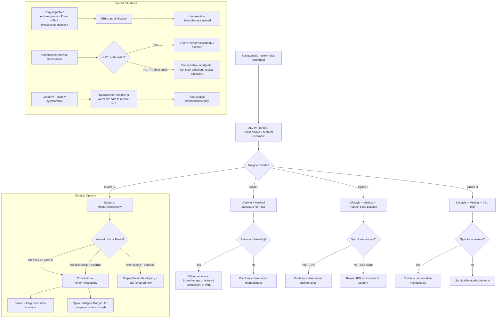
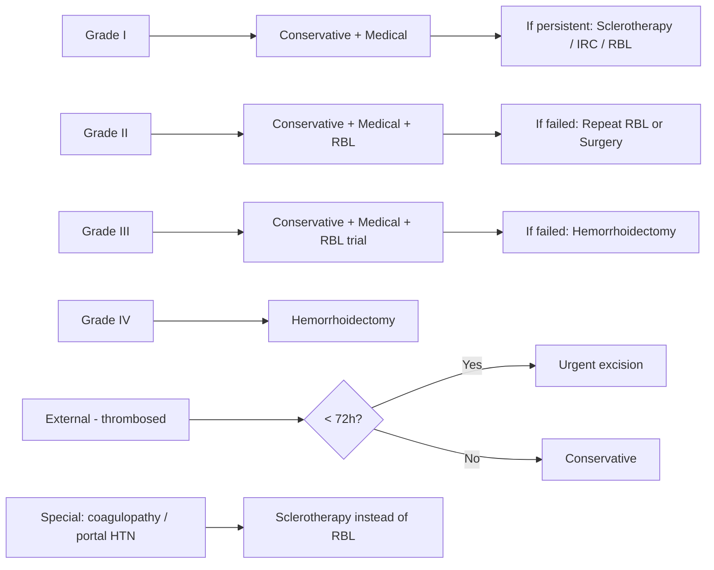

## Management of Hemorrhoids — Algorithm and Treatment Modalities

### A. Overarching Principles

Before diving into specific treatments, understand three governing principles that frame the entire management approach:

**Principle 1:** ***Conservative treatment for ALL patients*** [3]. Every hemorrhoid patient — regardless of grade — starts with lifestyle and dietary modification. Many will improve with conservative measures alone and never need procedural intervention.

**Principle 2:** ***Treatment is mainly for symptomatic control*** [1]. Remember, hemorrhoidal cushions are normal anatomy. We are not trying to eliminate them — we are trying to relieve symptoms (bleeding, prolapse, pain, pruritus). Asymptomatic hemorrhoids found incidentally do not require treatment.

**Principle 3:** Management is **stepped** — escalate only when the current level fails. The treatment ladder roughly follows the Goligher grading:

> Grade I → Conservative + Medical ± Office procedures
> Grade II → Conservative + Medical + Office procedures (RBL)
> Grade III → Conservative + Medical + RBL ± Surgery
> Grade IV → Surgery

---

### B. Management Algorithm — Overview

The treatment approach from the lecture slides [1] and senior notes [2][3] can be summarized in a grade-based escalation framework:

| Grade | ***Treatment Options from Lecture Slides*** [1] |
|:--|:--|
| ***1st degree*** | ***Sclerotherapy, infrared*** [1] (+ lifestyle/medical) |
| ***2nd degree*** | ***Sclerotherapy, infrared*** [1] (+ lifestyle/medical + RBL) |
| ***3rd degree*** | ***Sclerotherapy, surgery*** [1] (+ lifestyle/medical + RBL) |
| ***4th degree*** | ***Hemorrhoidectomy*** [1] |

The senior notes provide a more detailed breakdown [3]:

| Degree | Dietary modification | Rubber band ligation | Injection sclerotherapy | Infrared coagulation | Hemorrhoidectomy |
|:--|:--|:--|:--|:--|:--|
| 1st | ✓ | ✓ | ✓ | ✓ | ✗ |
| 2nd | ✓ | ✓ | ✓ | ✗ | ✗ |
| 3rd | ✓ | ✓ | ✗ | ✗ | ✓ |
| 4th | ✗ | ✗ | ✗ | ✗ | ✓ |

[3]

And the Goligher grading–management correlation from Maxim's notes [2]:

| Grade | Description | ***Management*** |
|:--|:--|:--|
| ***I*** | ***Palpable, non-prolapsing and bleeding*** | ***Lifestyle, medical*** |
| ***II*** | ***Prolapse with straining, spontaneous reduction*** | ***Lifestyle, medical, RBL*** |
| ***III*** | ***Prolapse requiring manual reduction*** | ***Lifestyle, medical, RBL + surgery*** |
| ***IV*** | ***Chronic prolapse, irreducible ± strangulated*** | ***Surgery*** |

[2]

---

### C. Management Algorithm — Mermaid Diagram

---

### D. Treatment Modalities — Detailed Breakdown

---

#### D1. Conservative Management (All Grades)

This is the foundation of hemorrhoid treatment. The lecture slide states: ***"Non-operative: diet modification: high fibre diet; sitz bath: for prolapsed haemorrhoids; ointments and suppositories: may help but some contain steroid"*** [1].

##### D1a. Lifestyle Modification

| Modification | Mechanism | Details |
|:--|:--|:--|
| ***High-fibre diet*** [1][2] | Increases stool bulk → softer stools → reduced straining → less shearing force on hemorrhoidal cushions → reduced venous engorgement | Aim for 25–30 g fibre/day. Sources: fruits, vegetables, whole grains, legumes |
| ***Increase fluid intake*** [2] | Works synergistically with fibre — without adequate fluid, fibre can actually worsen constipation | At least 6–8 glasses of water/day |
| ***Avoid spicy food*** [2] | Spicy foods may worsen perianal irritation and mucus discharge (though evidence is debated) | Practical advice for symptom relief |
| ***Avoid prolonged sitting on toilet*** [2] | Unsupported perineum allows gravity-dependent venous pooling in hemorrhoidal plexus → worsens engorgement | Common contributor in the smartphone era — counsel patients specifically |
| ***Avoid prolonged straining*** [2] | Straining increases intra-abdominal pressure → transmitted to hemorrhoidal venous plexus → engorgement and mechanical shearing of support tissue | Evacuate only when natural urge arises [3] |
| ***Exercise and weight loss*** [2] | Reduces chronic intra-abdominal pressure; improves bowel motility and reduces constipation | General health measure |
| **Adopt optimal defecatory position** [3] | Squatting position straightens the anorectal angle (relaxes puborectalis) → easier evacuation with less straining | Use of a footstool to elevate knees while on toilet |

##### D1b. Sitz Baths

***Sitz bath: for prolapsed haemorrhoids*** [1].

- **What it is:** Sitting in warm water covering the buttocks and hips (typically 10–15 minutes, 2–3 times daily and after bowel movements).
- **Mechanism:** Warm water **relaxes the anal sphincter muscles** and relieves sphincter spasm [3]. Patients with significant hemorrhoids tend to have elevated resting anal sphincter tone — relaxing this reduces venous congestion. Also relieves irritation, pruritus, and reduces inflammation and oedema [3].
- ***KMnO₄ (potassium permanganate) sitz bath*** [2] — acts as a topical antiseptic. Used as a very dilute solution (1:10,000) to keep the perianal area clean.

---

#### D2. Medical Treatment

##### D2a. Laxatives / Stool Softeners

The aim is to produce soft, well-formed stools that pass easily without straining — thereby breaking the pathological cycle of straining → venous engorgement → mucosal trauma → bleeding.

| Class | Examples | Mechanism | Side Effects |
|:--|:--|:--|:--|
| ***Osmotic laxatives*** | ***Lactulose*** (乳果糖) | Draws water into the bowel lumen osmotically → increases water content of stool → softer stool. Lactulose is a synthetic disaccharide that is not absorbed — it reaches the colon intact and is metabolized by bacteria | ***Abdominal distension, flatulence*** (lactulose is broken down into gases by colonic bacteria) [3] |
| ***Bulk laxatives*** | ***Psyllium / Metamucil®*** (橙粉), ***Methylcellulose*** | Absorbs water and increases faecal mass → stimulates mechanoreceptor nerve endings in the gut wall → increases peristalsis | ***Abdominal distension, flatulence*** (methylcellulose is broken down into gases by bacteria) [3] |
| ***Stimulant laxatives*** | ***Bisacodyl***, ***Senna / Senokot®*** (草餅) | Bisacodyl: hydrolysed by bacteria into anthraquinones that stimulate the myenteric plexus → increased peristalsis. Senna: directly stimulates nerve endings in the gut wall | ***Diarrhoea*** (gut contracts too quickly), ***abdominal cramps*** (contracts too strongly) [3]. Not for long-term use due to risk of dependency and myenteric plexus damage |

[3]

<Callout title="Practical Prescribing" type="idea">
For hemorrhoid patients, **bulk laxatives** (Metamucil) are first-line because they address the root cause (inadequate fibre → hard stools → straining). **Osmotic laxatives** (lactulose) are a good second choice. **Stimulant laxatives** should be reserved for short-term use only — chronic use can lead to cathartic colon.
</Callout>

##### D2b. Topical Agents

| Agent | Mechanism | Notes |
|:--|:--|:--|
| ***Topical analgesics (lidocaine/hydrocortisone cream)*** [1][3] | Lidocaine: local anaesthetic — blocks sodium channels → inhibits nerve impulse propagation → pain relief. Hydrocortisone: reduces inflammation | Effective for acute pain. Side effect: ***contact dermatitis*** [3]. ***Ointments and suppositories: may help but some contain steroid*** [1] |
| ***Hydrocortisone suppositories*** [3] | Reduces inflammation → shrinks engorged hemorrhoidal tissue and relieves pruritus | ***Should not be used for longer than 1 week*** — prolonged use causes ***mucosal atrophy*** [3] |
| ***Topical antiseptic (KMnO₄ sitz bath)*** [2] | Antiseptic and astringent properties — keeps perianal area clean and reduces bacterial load | Potassium permanganate — very dilute solution |
| ***Topical haemostatic (e.g., Faktu)*** [2] | Contains policresulen (haemostatic) + cinchocaine (local anaesthetic) — promotes haemostasis and relieves pain | Used for bleeding hemorrhoids |
| ***Topical astringent (e.g., Anusol)*** [2] | Contains bismuth subgallate, zinc oxide, balsam of Peru — creates a protective film over the mucosa, reduces swelling and irritation | Soothes inflammation, reduces mucus discharge |

##### D2c. Venoactive Agents (Phlebotonics)

- **Class:** Heterogeneous class of plant extracts, primarily ***flavonoids*** [3].
- **Example:** ***Daflon*** (micronized purified flavonoid fraction — 90% diosmin + 10% hesperidin) [3].
- **Mechanism:** ***Improves venous tone, reduces microvascular permeability, enhances lymphatic activity, and improves microcirculatory nutritive flow*** [3].
- **Indication:** Primarily used to treat ***acutely inflamed and bleeding hemorrhoids*** [3]. Can reduce bleeding episodes and symptom severity.
- **Classification:** Categorized as a **medical food**, not as a drug [3]. Has good safety profile.
- **Evidence:** Meta-analyses show that phlebotonics significantly reduce bleeding, pruritus, discharge, and overall symptom scores in hemorrhoidal disease.

---

#### D3. Office-Based Procedures

These are interventional procedures performed in the outpatient/office setting, typically without general anaesthesia. They work because internal hemorrhoids have **visceral innervation (no somatic pain sensation)** — so procedures applied **above the dentate line** are tolerable without anaesthesia [3].

##### D3a. Rubber Band Ligation (RBL) — The Most Important Office Procedure

***Rubber band ligation (RBL)*** is the most commonly performed office-based procedure [2][3][4]:

- **How it works:** ***Apply rubber bands to strangulate the pile by Barron's bander → ischaemic necrosis of the piles → slough off within 10 days*** [2]. The necrosed tissue and band fall off, leaving an ulcer that heals with fibrosis, fixing the residual tissue in place and preventing re-prolapse.
- **Administration:** ***Up to 3 bandings at ≥ 1 cm above the dentate line*** [2]. Why above the dentate line? Because the area above the dentate line has visceral innervation — placing bands here is tolerable. Banding below the dentate line would cause excruciating pain (somatic innervation).
- ***Efficacy: 70% resolve, 30% recur*** [2].
- **Indications:** ***Symptomatic Grade II/III internal hemorrhoids*** [2]. Also used for Grade I hemorrhoids with persistent bleeding despite conservative treatment [3][4].
- **Advantages:** Inexpensive, easy to perform, rarely causes serious complications. ***Compared with sclerotherapy and infrared coagulation, RBL is more effective and requires fewer treatment sessions*** [4].
- ***NOT recommended for Grade IV hemorrhoids*** — surgery is the best treatment for these [4].
- **Only for internal hemorrhoids — external hemorrhoids are NOT amenable to banding** [4] (somatic innervation → too painful; also, banding external tissue risks full-thickness skin necrosis).

**Contraindications for RBL:**

| Contraindication | Reason |
|:--|:--|
| ***Coagulopathies*** [4] | High risk of delayed haemorrhage when the eschar sloughs off (day 7–10) |
| ***Cirrhosis with portal hypertension*** [4] | Same reason — engorged portal venous plexus increases haemorrhage risk |
| ***Anticoagulant / antiplatelet use*** [2][4] | Impaired clotting → delayed bleeding risk |
| ***Immunocompromised*** [2][4] | Risk of post-banding sepsis (rare but potentially fatal necrotizing fasciitis) |
| **Grade IV hemorrhoids** [4] | Tissue too bulky and irreducible; surgery needed |
| **External hemorrhoids** [4] | Somatic innervation makes banding intolerable; risk of skin necrosis |

**Complications of RBL:**

- ***Pain*** — most frequent, occurring in ~8% [4]. Usually mild and self-limiting. Indicates the band may have been placed too close to the dentate line.
- ***Bleeding*** — ***7–10 days post-banding due to sloughing of ligated haemorrhoids*** [2]. Usually minor, but can be significant in coagulopathic patients.
- **Delayed haemorrhage** [4]
- ***Post-banding sepsis*** [2] — rare but potentially fatal. Presents with fever, perineal pain, and urinary retention 3–7 days post-procedure. Requires urgent IV antibiotics and debridement.
- **Urinary retention** [4]
- **Haemorrhoidal thrombosis** [4]

**Practical notes on RBL:**

- Usually only one haemorrhoidal column should be treated at a time to minimize excessive tissue necrosis [4]. Multiple columns can be banded if tolerated.
- If multiple sessions are needed, ***repeat banding should be performed at 3–4 week intervals*** to allow swelling and ulcerations to subside [4].
- If ineffective after repeated attempts → proceed to surgery [4].

##### D3b. Injection Sclerotherapy

- **Method:** Injection of ***sclerosants such as phenol (5%) in vegetable oil*** (or almond oil) ***submucosally*** into the hemorrhoidal tissue [2][4].
- **Mechanism:** Causes an ***intense inflammatory reaction → destroys redundant submucosal tissue*** → fibrosis → obliterates vascular channels and **fixes the position** of the hemorrhoidal cushion (prevents prolapse) [2][4].
- **Indications:** ***Grade I and II hemorrhoids***. **Critically, indicated in patients with coagulopathies, on antiplatelets or anticoagulants, immunocompromised, or with portal hypertension*** — where ***RBL is contraindicated due to high risk of delayed bleeding*** [4]. ***Sclerotherapy is better studied than infrared coagulation in the literature for these groups*** [4].
- **Status:** ***Largely abandoned now*** in routine practice — ***risk of allergy to nuts and intraprostatic injection*** [2]. However, still used in special populations where RBL is contraindicated.

##### D3c. Infrared Coagulation

- **Method:** ***Direct application of infrared light waves to haemorrhoidal tissues*** [4].
- **Mechanism:** Infrared energy causes coagulation necrosis of the tissue → subsequent fibrosis → fixes the hemorrhoidal cushion.
- **Indications:** ***Grade I and II hemorrhoids*** [4]. Candidates include patients who cannot tolerate RBL or as an alternative.
- **Compared to RBL:** Less effective and requires more treatment sessions. Used less frequently.

##### D3d. Haemorrhoidal Artery Ligation Operation (HALO)

***May be Doppler-guided (DG-HALO) to identify feeding vessels*** [2]:

- **Method:** A Doppler ultrasound probe is used to identify the terminal branches of the superior rectal artery supplying the hemorrhoidal cushions. These arteries are then ligated with sutures through a specially designed proctoscope.
- **Mechanism:** Reduces arterial inflow to the hemorrhoidal cushion → decompression → shrinkage. May be combined with **mucopexy** (stitching the prolapsed mucosa back into position).
- **Indications:** ***Mainly for bleeding symptoms, indicated for Grade II/III haemorrhoids*** [2].
- ***Lowest post-operative complications, but highest recurrence rate*** [2]. This makes it suitable for patients who prioritize minimal invasiveness and accept a higher chance of needing re-treatment.

---

#### D4. Surgical Treatment

***Indications for surgical hemorrhoidectomy*** from the lecture slides [1]:

> ***Severe haemorrhoids (3rd or 4th degree), mixed internal and external haemorrhoids, failure of other treatments, patient preference, in conjunction with another procedure*** [1]

From the senior notes, additional indications [3]:
- ***2nd degree hemorrhoids that failed non-operative treatments***
- ***Fibrosed hemorrhoids***
- ***Hemorrhoidal bleeding leading to anaemia***

##### D4a. Conventional Excisional Hemorrhoidectomy

This is the gold standard surgical treatment with the highest cure rate.

- ***Efficacy: 95% resolve*** [2].
- ***Pre-op preparation: stool softener, enema*** [2].
- ***Position: prone jackknife or lithotomy*** [2].
- ***Anaesthesia: perianal / spinal / general anaesthesia*** [2].

**Approach:** ***3-leaf clover excision*** — excise the three main hemorrhoidal cushions (at 3, 7, 11 o'clock) leaving adequate mucocutaneous bridges between excision sites. ***Avoid circumferential excision — prone to stenosis*** [2].

Two main techniques:

| Technique | ***Closed (Ferguson)*** | ***Open (Milligan-Morgan)*** |
|:--|:--|:--|
| **Wound closure** | ***Close wound by continuous suture*** | ***Open wound, heal by secondary intention*** |
| **Usage** | ***More commonly used*** [2] | ***Preferred for acute gangrenous haemorrhoids*** [2] |
| **Rationale** | Closed wound → faster healing, less post-op pain | Open wound in gangrenous tissue ***prevents further tissue oedema and necrosis*** [2] — closing an infected/necrotic wound would trap infection |

**Indications for conventional hemorrhoidectomy:** ***Internal ≥ Grade III or external*** [2]. Also for ***symptomatic internal/external haemorrhoids refractory to other treatments*** [2].

##### D4b. Stapled Hemorrhoidopexy (Stapled Hemorrhoidectomy / PPH)

***"Using the stapling device to remove a ring of rectal mucosa and submucosa with the creation of a mucosal anastomosis above the dentate line. Haemorrhoids are not excised. Haemorrhoidal tissues pulled back into the anal canal from the prolapsed position. Interruption of blood supply to the haemorrhoids"*** [1].

Let me break this down from first principles:

- **How it works:** A circular stapler is introduced through the anal canal. It excises a circumferential ring (doughnut) of rectal mucosa and submucosa **above** the hemorrhoidal cushions. The stapler simultaneously creates an anastomosis. This achieves two things:
  1. **Repositions** the prolapsed hemorrhoidal tissue back into the anal canal (hemorrhoidopexy — "pexy" = fixation)
  2. **Interrupts the blood supply** to the hemorrhoidal cushions (the excised doughnut contains the feeding vessels)
- The hemorrhoids **are not excised** — they shrink in situ as their blood supply is cut off and they are pulled back into anatomical position.
- **Indication:** ***Internal hemorrhoids only*** [2].
- ***Less favoured now*** due to ***poorer long-term outcomes*** [2].

| Feature | Stapled Hemorrhoidopexy | Conventional Hemorrhoidectomy |
|:--|:--|:--|
| **Advantages** [3] | ***Less pain and analgesic requirement; quicker recovery and shorter hospital stay; less post-operative bleeding and wound complications; higher patient satisfaction*** | Gold standard; highest cure rate |
| **Disadvantages** [3] | ***Higher recurrence rate; serious complications can occur including rectal perforation, rectovaginal fistula, and pelvic sepsis*** | More painful; longer recovery |

<Callout title="Exam Note on Stapled Hemorrhoidopexy" type="error">
Stapled hemorrhoidopexy is ***for internal hemorrhoids only*** — it cannot treat external hemorrhoids because the staple line is above the dentate line. It is ***less favoured now*** due to higher recurrence and risk of rare but catastrophic complications (rectal perforation, pelvic sepsis). Know both the advantages and disadvantages for exams.
</Callout>

---

#### D5. Management of Acute / Emergency Presentations

##### D5a. Symptomatic Grade IV Internal Hemorrhoids (Acutely Prolapsed)

***Hyperosmolar solution (gauze with lignocaine + cold water + dextrose) or warm water sitz bath to reduce size of haemorrhoids before surgery*** [2].

- **Why hyperosmolar solution?** The high osmolarity of the dextrose solution draws fluid out of the oedematous, engorged hemorrhoidal tissue by osmosis → reduces swelling → makes the tissue more amenable to reduction or subsequent surgical excision.
- **Why lignocaine?** Provides local anaesthesia for pain relief.
- Once adequately reduced → proceed to **elective surgical hemorrhoidectomy**.

##### D5b. Thrombosed External Hemorrhoids

***Thrombosed (external) haemorrhoids*** [2]:

| Timing | Management |
|:--|:--|
| ***Early ( < 72h) + painful*** | ***Urgent haemorrhoidectomy*** [2] — excision of the thrombosed external hemorrhoid under local anaesthesia. The clot and overlying skin are removed. Incision and drainage alone (just expressing the clot) has a higher recurrence rate than formal excision |
| ***Late ( > 72h) or small thrombosis*** | ***Conservative: analgesia, ice pack, stool softeners, topical nifedipine to induce IAS relaxation*** [2]. By 72 hours the acute pain is already subsiding (the "5-day, self-curing lesion"). Surgery at this point offers little benefit as the clot is already organizing and symptoms are improving |

- **Why topical nifedipine?** Nifedipine is a calcium channel blocker → relaxes the internal anal sphincter smooth muscle → reduces sphincter spasm → relieves pain and improves venous drainage.

---

### E. Post-Operative Complications

***Post-operative complications*** [3][2]:

| Timing | Complication | Mechanism / Notes |
|:--|:--|:--|
| **Early** | ***Pain*** | ***~100% due to IAS spasm*** [2]. Managed with analgesics, sitz baths, topical GTN/nifedipine. The most limiting post-operative symptom |
| **Early** | ***Urinary retention*** | ***Causes: pain and anal spasm, fluid overload, rectal packing, drugs (narcotics, anticholinergics), pre-existing outflow tract obstruction*** [2]. Reflex bladder inhibition from anal pain. ***Mx: leave urinary catheter in situ for 24 hours*** [2] |
| **Early** | ***Reactionary haemorrhage*** | Bleeding within 24 hours — usually from a slipped ligature or inadequate haemostasis |
| **Late** | ***Secondary haemorrhage*** | Bleeding at 7–14 days — typically due to infection of the wound bed causing erosion of a vessel |
| **Late** | ***Faecal incontinence*** [2] | Injury to the anal sphincter (IAS or EAS) during excision. Risk higher with aggressive or circumferential excision |
| **Late** | ***Anal stenosis*** [2] | Excessive tissue removal → circumferential scarring → narrowing of the anal canal. This is why the ***3-leaf clover excision pattern*** is used — preserving mucocutaneous bridges between excision sites prevents circumferential scarring |
| **Late** | ***Anal fissure*** [2] | Hard stool passing through a healing wound → tearing |

---

### F. Summary: Treatment Ladder at a Glance

---

<Callout title="High Yield Summary">

**Management Principles:**
- ***Conservative treatment for ALL patients*** — lifestyle + medical is always first-line
- Treatment is for ***symptomatic control***, not eradication of hemorrhoids
- Escalation based on Goligher grade

**Conservative:** High-fibre diet, increased fluids, avoid straining/prolonged sitting, sitz baths, exercise/weight loss

**Medical:** Bulk laxatives (Metamucil — first-line), osmotic laxatives (lactulose), topical analgesics (lidocaine/hydrocortisone — max 1 week for steroids), venoactive agents (Daflon)

**Office-Based Procedures:**
- ***RBL***: Most commonly performed; Grade I–III internal hemorrhoids; 70% success; C/I in coagulopathy, portal HTN, immunocompromised, anticoagulants. Place ≥ 1 cm above dentate line. Complications: pain, delayed bleeding (day 7–10), sepsis.
- ***Sclerotherapy***: For coagulopathic/anticoagulated/immunocompromised patients where RBL is contraindicated. Largely abandoned otherwise.
- ***IRC***: Grade I–II only. Less effective than RBL.
- ***HALO***: Lowest complications but highest recurrence. Grade II/III.

**Surgery (lecture slide indications):** ***Severe haemorrhoids (3rd/4th degree), mixed internal/external, failure of other treatments, patient preference, in conjunction with another procedure.***
- Conventional: ***Ferguson (closed, more common)*** vs ***Milligan-Morgan (open, for gangrenous)***. 3-leaf clover pattern. 95% efficacy.
- Stapled hemorrhoidopexy: ***Internal only, less favoured now*** — less pain but higher recurrence and risk of serious complications.

**Acute Presentations:**
- ***Grade IV acute: hyperosmolar solution / sitz bath → then surgery***
- ***Thrombosed external < 72h: urgent excision; > 72h: conservative***

</Callout>

---

<ActiveRecallQuiz
  title="Active Recall - Management of Hemorrhoids"
  items={[
    {
      question: "What is the fundamental principle of hemorrhoid management that applies to ALL patients regardless of grade?",
      markscheme: "Conservative treatment for ALL patients. Every patient starts with lifestyle modification (high-fibre diet, increased fluid intake, avoid straining and prolonged sitting, exercise, weight loss) and medical treatment (stool softeners, topical agents). Treatment is mainly for symptomatic control, not eradication of hemorrhoids."
    },
    {
      question: "Describe the mechanism of rubber band ligation and state its indications, contraindications, and major complications.",
      markscheme: "Mechanism: Rubber bands applied via Barron's bander at least 1 cm above dentate line to strangulate the hemorrhoidal cushion -> ischaemic necrosis -> tissue sloughs off in 10 days -> heals with fibrosis fixing tissue in place. Indications: symptomatic Grade I-III internal hemorrhoids. Contraindications: coagulopathies, portal hypertension/cirrhosis, anticoagulant/antiplatelet use, immunocompromised, Grade IV hemorrhoids, external hemorrhoids. Complications: pain (most common, 8%), delayed bleeding (day 7-10 from sloughing), post-banding sepsis, urinary retention, hemorrhoidal thrombosis."
    },
    {
      question: "A patient on warfarin presents with Grade II internal hemorrhoids with persistent bleeding. Why is RBL contraindicated and what alternative office-based procedure should be used?",
      markscheme: "RBL is contraindicated because when the ligated tissue sloughs off at 7-10 days, the resulting ulcer can bleed significantly. In a patient on anticoagulants, this delayed bleeding risk is dangerously amplified. Instead, use injection sclerotherapy (5% phenol in vegetable oil) which creates fibrosis and is safer in coagulopathic patients. Sclerotherapy is better studied than infrared coagulation for this population."
    },
    {
      question: "Compare and contrast the two conventional hemorrhoidectomy techniques: Ferguson and Milligan-Morgan. When would you prefer one over the other?",
      markscheme: "Ferguson (closed): wound closed by continuous suture; faster healing, less post-op pain; more commonly used for routine cases. Milligan-Morgan (open): wound left open to heal by secondary intention; preferred for acute gangrenous hemorrhoids because closing a necrotic/infected wound would trap infection and worsen tissue oedema and necrosis. Both use 3-leaf clover excision pattern to avoid circumferential excision (which causes anal stenosis)."
    },
    {
      question: "How do you manage a thrombosed external hemorrhoid presenting within 48 hours versus one presenting at day 5?",
      markscheme: "Within 48-72 hours + painful: urgent hemorrhoidectomy/excision under local anaesthesia (formal excision preferred over simple incision and drainage due to lower recurrence). After 72 hours or small thrombosis: conservative management with analgesia, ice packs, stool softeners, and topical nifedipine (relaxes IAS smooth muscle). By 72 hours the acute pain is subsiding as the clot organizes; the condition is a '5-day, self-curing lesion' that will resolve spontaneously leaving a skin tag."
    },
    {
      question: "State the indications for surgical hemorrhoidectomy as listed in the lecture slides.",
      markscheme: "Severe haemorrhoids (3rd or 4th degree), mixed internal and external haemorrhoids, failure of other treatments, patient preference, in conjunction with another procedure. Additional indications from notes: 2nd degree hemorrhoids that failed non-operative treatment, fibrosed hemorrhoids, hemorrhoidal bleeding leading to anaemia."
    }
  ]}
/>

## References

[1] Lecture slides: GC 179. Anal pain perianal lesions and sepsis.pdf (p29, p30, p31, p33, p36, p77)
[2] Senior notes: maxim.md (Haemorrhoids management section, pp. 109–111)
[3] Senior notes: felixlai.md (Hemorrhoids — Treatment, pp. 746–750)
[4] Senior notes: felixlai.md (Hemorrhoids — Office-based procedures, pp. 748–749)
