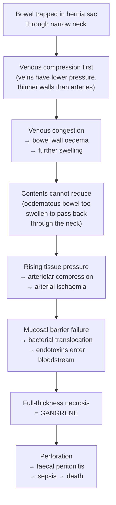

## Complications of Hernia

Complications of hernia fall into two broad categories: **(A) complications of the hernia itself** (the disease process) and **(B) complications of hernia repair** (the surgical treatment). Both are high-yield and must be understood from first principles.

---

### Part A — Complications of the Hernia (Disease Complications)

These are the complications that arise from an untreated or under-treated hernia progressing along the pathophysiological sequence we established in earlier sections: reducible → irreducible → incarcerated → obstructed → strangulated → infarcted.

#### A1. Irreducibility

- **Definition**: bowel becomes trapped and unable to return to the main peritoneal cavity because adhesions have formed between contents and sac wall, or the defect is too small relative to the contents that have entered [3]
- **Why it happens**: repeated episodes of herniation cause chronic friction between the sac lining and its contents (omentum or bowel serosa) → fibrinous adhesions develop → contents become fixed within the sac
- **Significance**: an irreducible hernia is at **constant risk** of progressing to incarceration and strangulation — it cannot decompress itself

#### A2. ***Intestinal Obstruction*** [3]

***A loop of bowel is trapped in the hernia sac such that the bowel lumen (but not its blood supply) is obstructed*** [3].

| Feature | Pathophysiological Basis |
|---|---|
| ***Abdominal pain*** (colicky) | Bowel proximal to the obstruction undergoes vigorous peristalsis trying to overcome the block → intermittent smooth muscle contraction → visceral pain |
| ***Distension*** | Proximal bowel fills with swallowed air and secretions that cannot pass distally; bacterial fermentation produces additional gas |
| ***Nausea and vomiting*** | Proximal distension triggers vagal afferents → emesis; in high SBO, vomiting is early and bilious; in distal SBO, vomiting is late and faeculent |
| ***Constipation*** (absolute — no flatus or stool) | Distal bowel is decompressed as its contents have been evacuated; nothing new reaches it from above |

This is a **closed-loop obstruction** when both the afferent and efferent limbs of the bowel loop are trapped at the hernia neck. Closed-loop obstruction is particularly dangerous because:
1. The trapped loop cannot decompress in either direction
2. Intraluminal pressure rises rapidly → compromises venous return in the bowel wall
3. Rapid progression to strangulation

> **Hernia is the 2nd most common cause of small bowel obstruction (after adhesions)** — accounting for approximately 10% of all SBO cases [2].

#### A3. ***Strangulation — The Most Serious Complication*** [3]

***Bowel necrosis as a result of strangulation is the most serious complication*** [3].

**The pathophysiological cascade** — understanding this from first principles:

**Strangulation risk by hernia type** [2]:
> ***Incidence of strangulation: femoral > indirect inguinal > direct inguinal*** [2]

Why? The risk is inversely proportional to the neck diameter:
- **Femoral ring** — smallest and most rigid (bounded by ligaments and the femoral vein) → highest strangulation risk
- **Deep inguinal ring** (indirect) — relatively narrow muscular ring → moderate risk
- **Hesselbach's triangle** (direct) — broad-based defect → rarely strangulates

**Clinical features suggestive of strangulation** [3]:

| Category | Features |
|---|---|
| ***Clinical signs*** | ***Fever, tachycardia, peritoneal signs*** (guarding, rigidity, rebound tenderness) [3] |
| ***Clinical symptoms*** | ***Continuous or worsening abdominal pain*** (transition from colicky to constant is ominous — it means the bowel muscle is no longer contracting because it is necrotic) [3] |
| ***Biochemical*** | ***Leucocytosis, metabolic acidosis*** (raised lactate from tissue ischaemia) [3] |
| ***Radiological*** | ***Pneumoperitoneum*** (free air from perforation), ***pneumatosis intestinalis*** (gas within the bowel wall from necrosis), ***portal venous gas*** (gas in the portal system — a late and ominous sign of extensive bowel necrosis) [3] |

**Prognosis**: ***morbidity and mortality are dependent on the duration of ischaemia and its extent. Any length of ischaemic bowel can cause significant systemic effects secondary to sepsis and dehydration*** [3].

<Callout title="Strangulation in Special Hernia Types" type="error">
- ***Richter's hernia***: only one sidewall of the bowel is trapped → the bowel may necrose and perforate *without* causing complete intestinal obstruction → **delayed diagnosis** because the classic obstruction symptoms are absent
- ***Maydl's hernia***: two loops enter the sac but the *intervening intra-abdominal* loop is the first to strangulate → ischaemic segment is INSIDE the abdomen, easily missed at operation if the surgeon only inspects the herniated loops
- ***Reduction-en-masse***: the sac and contents are pushed together behind the fascia → the constriction at the neck is maintained → the bowel remains strangulated despite apparently being "reduced"
</Callout>

#### A4. ***Incarceration — Specific Organ Damage*** [3]

***Incarceration of inguinal hernia*** causes organ-specific complications depending on the patient's sex [3]:
- ***Males***: ***compromise of blood supply to the testes resulting in ischaemic necrosis and atrophy, as well as injury to the vas deferens*** — the spermatic cord structures are compressed at the hernia neck alongside the bowel
- ***Females***: ***torsion rather than direct compression compromises blood supply to the ovaries*** — in girls and women, the ovary (± fallopian tube) may herniate and undergo torsion within the sac

***Paediatric***: ***bowel strangulation is a potential complication*** of inguinal hernia in neonates and infants [5]. The incarceration rate is highest in the first 6 months of life (~30%) because:
- The hernia neck (deep ring) in infants is relatively small compared to the bowel volume that can enter
- Infants cannot communicate symptoms effectively → delayed presentation

---

### Part B — Complications of Hernia Repair (Post-Operative Complications)

These are classified by timing into ***immediate, early, and late*** [2][3].

#### B1. ***Immediate Complications*** (Intra-operative / first 24 hours)

| Complication | Pathophysiological Basis | Details |
|---|---|---|
| ***Acute retention of urine (AROU)*** | Spinal/epidural anaesthesia blocks sacral parasympathetic fibres (S2–S4) that innervate the detrusor muscle → detrusor cannot contract → urinary retention. Pain and opioid analgesia also inhibit micturition reflex. Post-operative tissue oedema around the bladder base can contribute. | More common after spinal anaesthesia; usually self-limiting; managed with temporary urinary catheterisation [3] |
| ***Bladder injury*** | ***Bladder can be damaged during trocar insertion*** in laparoscopic repair [3]. The bladder dome lies close to the midline pre-peritoneal space, especially if distended. In direct hernias, the bladder may form part of the hernia sac (sliding hernia variant). | Prevention: ensure bladder is emptied (catheterised) before port placement; careful dissection in the pre-peritoneal space |
| ***Damage to vas deferens*** | The vas deferens runs within the spermatic cord and can be directly injured during dissection of an indirect hernia sac from the cord structures [2]. It is a thin, cord-like structure that can be inadvertently transected or cauterised. | Bilateral injury → obstructive infertility. Always identify and preserve the vas during cord dissection. |
| ***Ilioinguinal nerve injury*** | The ilioinguinal nerve runs on the surface of the spermatic cord within the inguinal canal. It can be directly cut, cauterised, or stretched during open anterior dissection [2]. | Causes immediate numbness/paraesthesia over the inguinal region, medial thigh, and ipsilateral scrotum/labium |
| ***Injury to surrounding organs during pneumoperitoneum*** | Laparoscopic port insertion (Veress needle or trocar) can injure ***bladder, bowels, or blood vessels*** (especially inferior epigastric artery/vein, external iliac vessels) [2] | Recognised by gas leak, bleeding, or bile/faecal contamination; may require conversion to open |
| ***Femoral nerve blockade (LA repair)*** | Local anaesthetic infiltrated near the inguinal ligament can track to the femoral nerve → ***unilateral lower limb weakness*** [2] | ***Usually resolves within ~12 hours*** [2]; patient should be warned pre-operatively and advised not to drive |

#### B2. ***Early Complications*** (Days to weeks post-operatively)

| Complication | Pathophysiological Basis | Management |
|---|---|---|
| ***Wound or mesh infection*** | ***Occurs within the first few weeks after surgery or months later*** [3]. Bacteria colonise the mesh (prosthetic foreign body acts as a nidus for biofilm formation). Risk factors: emergency surgery, contaminated field, poor sterile technique, diabetes, immunosuppression. ***Presents with fever, chills or malaise; physical examination shows pain, erythema, warmth, swelling, or a draining fistula*** [3]. | ***Initially start empirical broad-spectrum antibiotics; localised fluid collections can be treated with percutaneous drainage; surgical debridement of infected or necrotic tissues with mesh removal is required if patient presents with systemic signs and symptoms of sepsis*** [3] |
| ***Mesh complications*** | ***Infection, migration, erosion, shrinkage*** [2]. Migration: mesh plug (inlay) can migrate through tissues. Erosion: mesh can erode into adjacent structures (bladder, bowel, spermatic cord). Shrinkage: all synthetic meshes shrink ~20–30% over time → if mesh was not oversized during placement, the repair may fail. | Mesh removal may be necessary for chronic mesh-related complications; biological mesh avoids some of these issues |
| ***Seroma*** | ***Collection of fluid in the dead space that remains once a hernia sac is reduced*** [3]. ***Excessive inflammatory response to mesh/sutures → serous fluid collection*** [2]. The body mounts an inflammatory response to the mesh as a foreign body, producing exudate that accumulates in the space where the sac used to be. | ***Fluid collection mostly resolves without treatment and should NOT be aspirated in the absence of features of infection*** (aspiration risks introducing bacteria into a sterile site) [3]. Only aspirate if signs of secondary infection develop. |
| ***Haematoma / Bruising*** | ***Vascular injury to the epigastric artery or vein, external iliac artery or vein can cause bleeding and haematoma formation*** [3]. Scrotal bruising/haematoma is common after inguinoscrotal hernia repair due to blood tracking along tissue planes into the scrotum. | Most are self-limiting; observation. Large or expanding haematomas may require surgical evacuation or embolisation. |
| ***Testicular infarction*** | ***Damage to the testicular artery*** during dissection of the spermatic cord, especially when separating an indirect hernia sac from the cord structures [2]. The testicular artery is an end-artery (although the cremasteric and vasal arteries provide some collateral). | Presents with acute scrotal pain and swelling; Doppler USS shows absent testicular blood flow; may require orchidectomy if complete infarction |

<Callout title="Do NOT Aspirate a Seroma" type="error">
Students (and junior doctors) often feel compelled to aspirate a post-hernia-repair seroma because it looks like a recurrent hernia or an abscess. ***Unless there are signs of infection (fever, erythema, fluctuance with warmth), leave it alone.*** Aspirating a sterile seroma introduces a needle into a space containing a prosthetic mesh → risk of mesh infection, which is a far worse complication than the seroma itself [3].
</Callout>

#### B3. ***Late Complications*** (Weeks to months to years post-operatively)

| Complication | Pathophysiological Basis | Details |
|---|---|---|
| ***Chronic postoperative inguinal pain (CPIP) / Post-herniorrhaphy neuralgia*** | The most important late complication. ***Affects 10–12% of inguinal hernia repair patients*** [1]. ***Defined as bothersome moderate pain impacting daily activities lasting at least 3 months postoperatively*** [1]. | See detailed section below |
| ***Hernia recurrence*** | Failure of the repair due to: mesh displacement, mesh shrinkage, inadequate mesh overlap, tissue repair under tension, technical error, or persistent predisposing factors (chronic cough, constipation, obesity, smoking) | Recurrence rates: tissue repair ~5–15%; mesh repair ~1–4%. Managed by re-operation using the **opposite approach** (anterior → posterior, or vice versa) to avoid scar tissue |
| ***Ischaemic orchitis / Testicular atrophy*** | ***Interference with blood supply to the testes typically resulting from dissection of indirect hernia from cord structures*** [3]. ***Pampiniform plexus thrombosis*** [2] → venous congestion → testicular oedema → arterial compromise → atrophy. Direct injury to or extrinsic compression of the testicular artery or pampiniform plexus. | Presents days to weeks post-op with painful, swollen testis → may progress to painless atrophy over months. Documented in ~0.5–1% of primary repairs, higher in recurrent repairs. |
| ***Sexual dysfunction*** | Damage to the genital branch of the genitofemoral nerve (motor to cremaster, sensory to scrotum) or ilioinguinal nerve (sensory to inguinal region and genitalia) → dysejaculation (painful ejaculation), chronic genital pain, numbness affecting sexual function [2] | More common after open repair than laparoscopic (open approach is closer to these nerves) |
| ***Adhesions / Internal herniation through peritoneal defect*** | ***Specific to laparoscopic TAPP*** [2] — the peritoneum is incised during TAPP and then closed over the mesh. If the peritoneal closure is inadequate, bowel can herniate through the defect and become incarcerated between the mesh and the peritoneum → **internal hernia** causing bowel obstruction. Adhesions to the mesh can also occur if peritoneal closure is incomplete. | Meticulous peritoneal closure during TAPP is essential. TEP avoids this risk entirely because the peritoneum is not breached. |

---

### Chronic Postoperative Inguinal Pain (CPIP) — Deep Dive

This deserves special attention because the lecture slides dedicate a separate section to it [1]:

***CPIP*** [1]:
- ***Affects 10–12% of inguinal hernia repair patients***
- ***Defined as bothersome moderate pain impacting daily activities lasting at least 3 months postoperatively***
- ***Risk factors: young age, female gender, high preoperative pain, early high postoperative pain, recurrent hernia, and open repair***

**Pathophysiology**: Three mechanisms of nerve injury cause CPIP:

| Mechanism | Explanation |
|---|---|
| **Direct nerve transection** | The ilioinguinal, iliohypogastric, or genital branch of the genitofemoral nerve is inadvertently cut during dissection → formation of a traumatic neuroma at the cut end → chronic neuropathic pain |
| **Nerve entrapment** | A nerve is caught in a suture or staple during mesh fixation, or trapped within scar tissue as it forms around the mesh → chronic compression → neuropathic pain |
| **Inflammatory neuropathy** | Chronic foreign body reaction to the mesh → perineural inflammation → nerve sensitisation → pain |

***The three key nerves at risk*** [2]:
1. ***Ilioinguinal nerve*** — runs on the spermatic cord surface within the inguinal canal; sensory to the inguinal region, upper medial thigh, and root of penis/scrotum (or mons pubis/labium majus)
2. ***Iliohypogastric nerve*** — runs between internal oblique and transversus abdominis; sensory to the suprapubic region
3. ***Genital branch of the genitofemoral nerve*** — runs through the deep ring alongside the spermatic cord; motor to cremaster, sensory to the anterolateral scrotum/labium
4. ***Lateral femoral cutaneous nerve of the thigh*** — can be injured during laparoscopic dissection in the pre-peritoneal space (runs lateral to the external iliac artery on the iliopsoas) → meralgia paraesthetica (numbness/burning over the anterolateral thigh)

**Management of CPIP:**
- **Prevention** (most important): ***minimised by avoiding manipulation of nerves during dissection and repair, or by selective neurectomy*** [3]
  - If a nerve is directly in the surgical field and cannot be safely preserved → prophylactic neurectomy is better than leaving a damaged nerve in situ
  - Laparoscopic repair has ***less chronic pain*** because it is ***performed at a deeper level away from the 3 nerves*** [2]
- **Treatment of established CPIP**:
  - Conservative: neuropathic pain medications (gabapentin, pregabalin, amitriptyline), local nerve blocks, physiotherapy
  - Interventional: ultrasound-guided nerve blocks (diagnostic and therapeutic)
  - ***Neurectomy is selected for cases involving inadvertent trauma to a nerve or when the location of the nerve would make entrapment with sutures during mesh fixation*** [3] — can be performed as a primary procedure if nerve injury is recognised intraoperatively, or as a secondary procedure for refractory CPIP
  - Mesh removal: if the pain is thought to be mesh-related (meshoma, mesh erosion, chronic inflammatory response)

<Callout title="CPIP Risk Factors — Exam Favourite">
***Risk factors for CPIP: young age, female gender, high preoperative pain, early high postoperative pain, recurrent hernia, and open repair*** [1]. Young patients have more active nerve responses; females have lower pain thresholds and higher nerve density in the inguinal region; high preoperative pain suggests central sensitisation that persists postoperatively; open repair places dissection closer to the vulnerable nerves.
</Callout>

---

### Complications of Incisional Hernia [2]

Incisional hernias carry their own specific set of complications:
- ***Intermittent obstruction*** — bowel enters and exits the sac, causing episodic obstructive symptoms
- ***Incarceration / strangulation*** — same pathophysiology as groin hernias
- ***Enterocutaneous fistula*** — if bowel adheres to the sac wall and erodes through the skin → faecal discharge through the skin → ***skin excoriation*** [2]
- ***Loss of domain*** — in very large incisional hernias, so much abdominal content has herniated into the sac that the abdominal cavity has "shrunk" and can no longer accommodate the contents if they were reduced. This creates a massive surgical challenge (reducing the hernia contents raises intra-abdominal pressure → abdominal compartment syndrome)

---

### Complications of Hiatus Hernia [6]

For completeness:
- ***Gastric volvulus*** (***only in rolling type / Type 2–4***) — the herniated stomach rotates → obstruction → ischaemia. Borchardt's triad: retching without vomiting, epigastric distension, inability to pass NG tube. This is a ***surgical emergency*** [6].
- ***Strangulation*** of the herniated stomach
- ***Gastric perforation*** → mediastinitis
- ***Gangrene*** of the herniated stomach wall
- Management of complications: ***NG tube decompression + emergency operation (EOT)*** [6]

---

### Summary — Master Table of Complications

| Timing | Complication | Key Mechanism | Management |
|---|---|---|---|
| **Disease** | Irreducibility | Adhesions within sac | Elective repair before further deterioration |
| **Disease** | ***Intestinal obstruction*** | Closed-loop obstruction at hernia neck | Resuscitate → emergency surgery |
| **Disease** | ***Strangulation*** | Venous → arterial compromise → necrosis | Emergency exploration → assess viability → resect if gangrenous |
| **Disease** | Gonadal damage | Males: testicular ischaemia; Females: ovarian torsion | Early repair prevents this; emergency reduction if incarcerated |
| **Immediate** | ***AROU*** | Anaesthetic effect on detrusor | Catheterisation |
| **Immediate** | ***Bladder injury*** | Trocar insertion (laparoscopic) | Ensure bladder is empty pre-op; repair if identified |
| **Immediate** | ***Vas deferens / nerve injury*** | Dissection of cord structures | Meticulous surgical technique; neurectomy if nerve damaged |
| **Early** | ***Wound / mesh infection*** | Bacterial colonisation of foreign body | Antibiotics → drainage → debridement + mesh removal if septic |
| **Early** | ***Seroma / Haematoma*** | Dead space fluid collection; vascular injury | Observe (do NOT aspirate unless infected) |
| **Early** | ***Testicular infarction*** | Testicular artery damage | Doppler USS; orchidectomy if complete infarction |
| **Late** | ***CPIP (chronic pain > 3 months)*** | Nerve injury / entrapment / meshoma | Prevention (nerve-sparing technique); neuropathic medications; neurectomy |
| **Late** | ***Hernia recurrence*** | Repair failure; persistent risk factors | Re-operation via opposite approach |
| **Late** | ***Ischaemic orchitis / testicular atrophy*** | Pampiniform plexus thrombosis | Supportive; atrophy is irreversible |
| **Late** | ***Adhesions / internal herniation*** | Peritoneal defect post-TAPP | Meticulous peritoneal closure |

---

<Callout title="High Yield Summary">

1. ***Strangulation is the most serious complication of hernia*** — bowel necrosis from venous then arterial compromise [3].
2. ***Strangulation risk***: ***femoral > indirect inguinal > direct inguinal*** (inversely proportional to neck diameter) [2].
3. ***Features of strangulation***: fever, tachycardia, peritoneal signs, continuous pain, leucocytosis, metabolic acidosis, pneumoperitoneum, pneumatosis intestinalis, portal venous gas [3].
4. ***Intestinal obstruction from hernia***: closed-loop obstruction → rapid progression to strangulation; hernia is the 2nd commonest cause of SBO.
5. ***Paediatric incarceration***: highest risk < 6 months of age; can compromise testicular blood supply (males) or cause ovarian torsion (females) [3][5].
6. ***Post-operative complications by timing***: Immediate (AROU, bladder injury, nerve/vas injury); Early (wound/mesh infection, seroma, haematoma, testicular infarction); Late (CPIP, recurrence, ischaemic orchitis, adhesions).
7. ***CPIP affects 10–12% of patients***: defined as pain > 3 months impacting daily activities; risk factors = young age, female, high preoperative pain, recurrent hernia, open repair [1].
8. ***Three nerves at risk***: ilioinguinal, iliohypogastric, genital branch of genitofemoral [2][3].
9. ***Seroma should NOT be aspirated*** unless infected — aspiration risks introducing infection to a sterile space containing mesh [3].
10. ***Mesh infection requiring systemic signs → debridement + mesh removal***; localised collections → antibiotics ± percutaneous drainage [3].
11. ***Incisional hernia specific***: intermittent obstruction, incarceration/strangulation, enterocutaneous fistula, loss of domain [2].

</Callout>

---

<ActiveRecallQuiz
  title="Active Recall - Complications of Hernia"
  items={[
    {
      question: "Describe the pathophysiological sequence from incarceration to gangrene in a strangulated hernia. Why are veins affected before arteries?",
      markscheme: "Narrow hernia neck compresses thin-walled veins first (lower intraluminal pressure than arteries) causing venous congestion. Congestion causes bowel wall oedema, which further increases tissue pressure. Rising pressure eventually occludes thicker-walled arterioles causing arterial ischaemia. Mucosal barrier fails allowing bacterial translocation. Full-thickness necrosis (gangrene) ensues, leading to perforation, faecal peritonitis, sepsis and death if untreated."
    },
    {
      question: "What is CPIP? State its incidence, definition, and risk factors as per the lecture slides.",
      markscheme: "Chronic Postoperative Inguinal Pain. Incidence: 10-12% of inguinal hernia repair patients. Definition: bothersome moderate pain impacting daily activities lasting at least 3 months postoperatively. Risk factors: young age, female gender, high preoperative pain, early high postoperative pain, recurrent hernia, and open repair."
    },
    {
      question: "Name the three nerves most at risk during inguinal hernia repair and explain why laparoscopic repair causes less chronic pain.",
      markscheme: "Ilioinguinal nerve, iliohypogastric nerve, and genital branch of the genitofemoral nerve. Laparoscopic repair is performed from the posterior/pre-peritoneal approach at a deeper level away from these three nerves (which lie in the anterior inguinal canal), hence less risk of nerve injury and less chronic pain."
    },
    {
      question: "A patient develops a painless fluctuant swelling at the hernia repair site 2 weeks post-operatively with no fever or skin changes. What is the most likely diagnosis and how should it be managed?",
      markscheme: "Seroma — collection of serous fluid in the dead space remaining after hernia sac reduction, due to inflammatory response to mesh/sutures. Management: reassurance and observation. Do NOT aspirate unless there are signs of secondary infection (fever, erythema, warmth), as aspiration risks introducing bacteria into a sterile space containing prosthetic mesh."
    },
    {
      question: "Why is Richter's hernia a particularly dangerous complication, and with which hernia type is it classically associated?",
      markscheme: "Richter's hernia involves only one sidewall of the bowel, so it causes ischaemia and potential necrosis/perforation WITHOUT causing complete intestinal obstruction. The absence of classic obstruction symptoms (vomiting, distension, constipation) delays diagnosis. It is classically associated with femoral hernias because the small, tight femoral ring catches just a knuckle of bowel wall."
    },
    {
      question: "List the clinical, biochemical, and radiological features that suggest bowel strangulation in a patient with an incarcerated hernia.",
      markscheme: "Clinical signs: fever, tachycardia, peritoneal signs (guarding, rigidity, rebound). Clinical symptoms: continuous or worsening abdominal pain (transition from colicky to constant). Biochemical: leucocytosis, metabolic acidosis (raised lactate). Radiological: pneumoperitoneum (perforation), pneumatosis intestinalis (gas in bowel wall from necrosis), portal venous gas (extensive bowel necrosis)."
    }
  ]}
/>

## References

[1] Lecture slides: GC 193. Inguinal and scrotal swelling different types of hernia.pdf (p19, p61)
[2] Senior notes: maxim.md (Chapter 6 — Hernia: Specific complications, Incisional hernia complications, Definitions)
[3] Senior notes: felixlai.md (Complications of hernia, Post-operative complications, Descriptive terminology)
[5] Lecture slides: GC 203. The child needs an operation Common emergencies and surgery in childhood.pdf (p6)
[6] Senior notes: maxim.md (Hiatus hernia — Complications)
