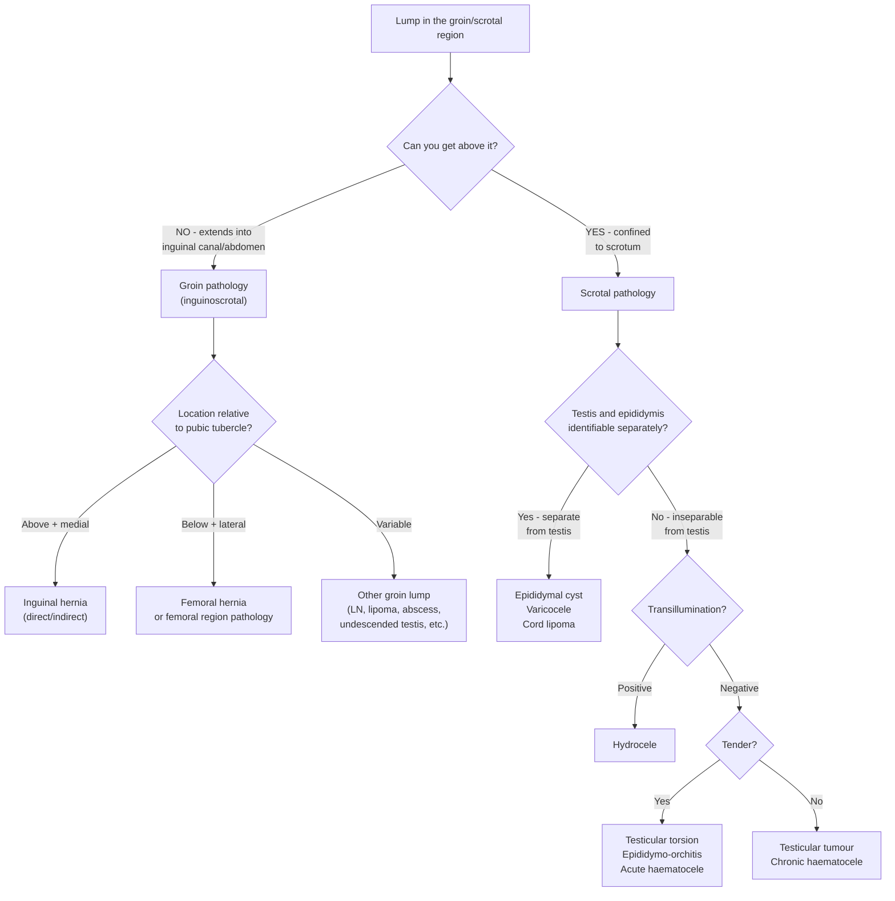

## Differential Diagnosis of Hernia

The differential diagnosis of hernia is fundamentally a question of **anatomical location**. You are not just asking "is this a hernia?" — you are asking "what else could produce a lump or pain in this region?" The approach differs depending on whether the presentation is a **groin lump**, a **scrotal swelling**, or **abdominal pain** where a hernia might be mimicked or missed.

Let's work through this systematically.

---

### 1. Clinical Approach to Differential Diagnosis

The very first question when confronted with any lump in the inguinal or scrotal region is to determine its **anatomical compartment**. This dictates your entire differential:

<Callout title="The Golden Question">
***"Can you get above it?"*** — If you **cannot** get above the swelling (i.e., your fingers cannot pass between the swelling and the superficial inguinal ring), the mass is extending from the abdomen/inguinal canal → think **inguinoscrotal hernia** or **communicating hydrocele**. If you **can** get above it, the pathology is **confined to the scrotum** [2][3].
</Callout>

---

### 2. Differential Diagnosis of a Groin Lump

This is the primary differential when hernia is suspected. The lecture slides categorise groin lumps into ***painful*** and ***painless*** presentations [1]:

#### 2.1 ***Painful Groin Lumps*** [1]

| Differential | Key Distinguishing Features | Why It Hurts |
|---|---|---|
| ***Tender lymph nodes*** | Multiple, discrete, firm, non-reducible, no cough impulse; look for a source of infection in the drainage territory (lower limb, perineum, genitalia); may have overlying erythema | Inflammatory infiltrate stretches the lymph node capsule → nociceptor activation |
| ***Strangulated inguinal hernia*** | Previously reducible groin lump now irreducible; tender, warm, erythematous; features of intestinal obstruction (vomiting, distension, constipation); above and medial to pubic tubercle | Narrow hernia neck → venous congestion → ischaemia of trapped contents → peritoneal irritation |
| ***Strangulated femoral hernia*** | Small, firm, below and lateral to pubic tubercle; ***commonly no cough impulse***; often elderly female; systemic signs of sepsis if gangrenous | Same mechanism as above but through the tight femoral ring — even higher strangulation risk than inguinal hernia |

#### 2.2 ***Painless Groin Lumps*** [1]

| Differential | Key Distinguishing Features | Pathophysiological Basis |
|---|---|---|
| ***Skin swelling*** (sebaceous cyst, lipoma) | Superficial, moves with skin, no cough impulse, no change with Valsalva; can get above it | Benign proliferation of subcutaneous tissue; no communication with peritoneal cavity |
| ***Non-tender lymph nodes*** | Multiple, discrete, firm, non-reducible, no cough impulse; may be matted (malignancy, TB); search for cause (infection, lymphoma, metastatic disease from lower limb/pelvic/genital malignancy) | Reactive hyperplasia or neoplastic infiltration without acute inflammation |
| ***Inguinal hernia (uncomplicated)*** | Reducible, cough impulse present, above and medial to pubic tubercle; may extend into scrotum (indirect); deep ring occlusion test differentiates direct vs indirect | Abdominal contents pushed through defect by IAP; reducible because no adhesions/tight neck |
| ***Femoral hernia (uncomplicated)*** | Below and lateral to pubic tubercle, small, firm, ***often no cough impulse*** | Contents pushed through femoral ring; tight neck often traps omentum early making it irreducible even when uncomplicated |
| ***Undescended testis (ectopic/cryptorchid)*** | Absent testis in the ipsilateral hemiscrotum; firm, oval, mobile mass in the groin; non-transilluminant; no cough impulse | Testis arrested along its normal descent path or deviated to an ectopic site |
| ***Femoral artery aneurysm*** | ***Expansile*** and pulsatile (expands in all directions synchronous with pulse); below inguinal ligament over the femoral artery; non-reducible | Degenerative weakening of arterial wall → localised dilatation; distinguishable from transmitted pulsation because it is *expansile* |
| ***Saphena varix*** | At the saphenofemoral junction (below and lateral to pubic tubercle); bluish tinge; disappears completely on lying down; fluid thrill on cough (not a true cough impulse); positive Trendelenburg test | Incompetent saphenofemoral valve → dilatation of the terminal great saphenous vein; empties with gravity when supine |

<Callout title="Saphena Varix vs Femoral Hernia" type="error">
Both are below the inguinal ligament. Students often confuse these. Key differentiators: saphena varix has a **bluish colour**, gives a **fluid thrill** on coughing (not an expansile impulse), **disappears completely on lying down**, and the great saphenous vein distribution may show varicosities. A femoral hernia is skin-coloured, may be irreducible even when supine, and does not have a fluid thrill. ***Never attempt to "reduce" a femoral artery aneurysm!***
</Callout>

#### 2.3 Full DDx of Groin Mass — ***L SHAPE*** Mnemonic [2]

| Letter | Differential | Notes |
|---|---|---|
| **L** | ***Lymph nodes*** | Reactive, infective, metastatic, lymphoma |
| **S** | ***Saphenous varix*** | Bluish, fluid thrill, disappears on lying down |
| **H** | ***Hernia (inguinal / femoral)*** | Most common cause of groin lump |
| **A** | ***Aneurysm (femoral artery)*** | Expansile, pulsatile |
| **P** | ***Psoas abscess*** | Fluctuant, below inguinal ligament; points in the femoral triangle; associated with spinal TB (Pott's disease) or retroperitoneal infection; patient holds hip in flexion (stretching psoas causes pain) |
| **E** | ***Ectopic / undescended testis*** | Absent ipsilateral testis in scrotum |
| + | ***Lipoma / sebaceous cyst*** | Superficial, moves with skin |
| + | ***Transplanted kidney*** | In renal transplant patients — firm mass in iliac fossa/groin; important to recognise and not mistake for hernia |

---

### 3. Differential Diagnosis of Scrotal Swelling

When the presentation is primarily a scrotal mass, the differential overlaps with hernia (because indirect inguinal hernias can descend into the scrotum). The lecture slides provide a clear division [1]:

#### 3.1 ***Painful Scrotal Lumps*** [1]

| Differential | Key Features | Why It Hurts |
|---|---|---|
| ***Testicular torsion*** | Sudden onset severe pain; high-riding testis with horizontal lie; absent cremasteric reflex; negative Prehn's sign (pain NOT relieved by elevation); bimodal age — perinatal and young teens | Twisting of spermatic cord → occlusion of testicular venous drainage first, then arterial supply → ischaemia → intense nociceptor activation |
| ***Torsion of testicular/epididymal appendage*** | Gradual onset; ***"blue dot sign"*** (ischaemic appendage visible through scrotal skin); cremasteric reflex intact; typically ~11 years old | Ischaemia of the vestigial appendage (hydatid of Morgagni) → localised inflammation |
| ***Epididymo-orchitis*** | Gradual onset; swollen, tender epididymis ± testis; positive Prehn's sign (pain relieved by elevation); may have urethral discharge, dysuria; fever | Ascending infection (STI in young men — Chlamydia/GC; UTI organisms in older men — E. coli) → inflammatory oedema stretches tunica |
| ***Strangulated inguinal hernia*** | ***Cannot get above it***; tender, irreducible groin/scrotal mass; features of intestinal obstruction | Bowel ischaemia within hernia sac → pain radiating to scrotum |
| ***Haematocele / haematoma*** | History of trauma; tender, swollen, non-transilluminant scrotum | Blood within tunica vaginalis → capsular distension |

#### 3.2 ***Painless Scrotal Lumps*** [1]

| Differential | Key Features | Pathophysiological Basis |
|---|---|---|
| ***Inguinal hernia (uncomplicated)*** | Cannot get above it; cough impulse; reducible; bowel sounds may be heard | Indirect hernia follows spermatic cord into scrotum |
| ***Hydrocele*** | Cannot separate from testis; can get above it (unless communicating); ***transillumination positive***; fluctuant | Fluid within tunica vaginalis; communicating type = patent processus vaginalis (changes size with crying/position); non-communicating = idiopathic or reactive |
| ***Epididymal cyst / spermatocele*** | Separate from testis; can get above it; ***transillumination positive***; cystic; located at head of epididymis | Cystic dilatation of efferent ductules or epididymal tubules; contains clear fluid or non-viable sperm |
| ***Varicocele*** | Separate from testis; can get above it; ***"bag of worms"*** texture; enlarges on Valsalva; ***90% left-sided***; disappears on lying down | Defective venous drainage → dilated pampiniform plexus; left-sided predominance because left testicular vein drains into left renal vein at 90° (vs. right testicular vein drains directly into IVC at an acute angle) |
| ***Testicular tumour*** | Hard, non-tender, irregular mass inseparable from testis; does NOT transilluminate; heavy sensation | Uncontrolled cellular proliferation (germ cell tumours — seminoma/NSGCT); often in young men 20–40 |

#### 3.3 Summary Comparison Table for Scrotal Lumps [3][4]

| Feature | Inguinoscrotal Hernia | Hydrocele | Varicocele | Epididymal Cyst |
|---|---|---|---|---|
| Separable from testis | Yes (beside cord) | No (surrounds testis) | Yes | Yes |
| Can get above it | ***No*** | Yes (non-communicating) / No (communicating) | Yes | Yes |
| Transillumination | Negative (opaque bowel/omentum) | ***Positive*** | Negative | ***Positive*** |
| Character | Reducible, cough impulse | Cystic, fluctuant | ***Bag of worms*** | Cystic |
| Changes with position | Reduces on lying down | Communicating: empties on lying; Non-communicating: unchanged | Disappears on lying | Unchanged |

***Typical history clues from the lecture slides*** [1]:
- ***"Reducible groin mass" → Hernia***
- ***"Painful scrotal swelling" → Epididymo-orchitis / Torsion***
- ***"Painless scrotal enlargement" → Hydrocele / Testicular tumour***
- ***"Fullness / bag of worms" → Varicocele***

---

### 4. Differential Diagnosis of Abdominal Pain Where Hernia is in the Differential

Hernias (inguinal and femoral) frequently appear in the differential diagnosis of **lower abdominal pain** because a strangulated or obstructed hernia can present as an acute abdomen. The lecture slides emphasise this [5][6]:

#### 4.1 ***Right Lower Quadrant (RLQ) Pain*** [5]

***Inguinal/femoral hernia*** must be considered alongside:
- ***Acute appendicitis*** (the most common surgical emergency)
- ***Caecal diverticulitis***
- ***Ureteric colic***
- ***Ruptured ectopic pregnancy***
- ***Mesenteric adenitis***
- ***Torsion of ovarian cyst***
- ***Ileitis (Crohn's, Yersinia)***
- ***Meckel's diverticulitis***
- ***Caecal ischaemia***
- ***Cancer of caecum***
- ***Testicular pathology (torsion, epididymo-orchitis)***
- ***Perforated peptic ulcer (referred)***
- ***Acute cholecystitis (referred)***

#### 4.2 ***Left Lower Quadrant (LLQ) Pain*** [6]

***Inguinal/femoral hernia*** must also be considered here:
- ***Sigmoid diverticulitis***
- ***Cancer of sigmoid colon***
- ***Torsion of ovarian cyst***
- ***Ruptured ectopic pregnancy***
- ***Ureteric colic***
- ***Testicular pathology***

#### 4.3 ***Diffuse / Non-specific Abdominal Pain*** [5]

In the lecture slide titled ***"Have You Forgotten?"***, hernias are specifically listed as a commonly **overlooked** diagnosis [5]:

> ***"Hernia, inguinal or femoral"*** — Always examine the groin in any patient with abdominal pain, vomiting, or intestinal obstruction. A strangulated femoral hernia in an elderly woman can easily be missed if the groin is not examined.

<Callout title="Never Forget the Groin!" type="error">
***Every patient presenting with intestinal obstruction or acute abdominal pain MUST have their groins examined.*** A strangulated femoral hernia — small, below the inguinal ligament, in an obese elderly female — is one of the most commonly missed surgical emergencies. The slide explicitly warns: ***"Have you forgotten? Hernia, inguinal or femoral"*** [5].
</Callout>

---

### 5. Differential Diagnosis Specific to Hernia Type

When you have already established that the patient likely has a hernia, the next step is determining **what type** and differentiating between them:

#### 5.1 Inguinal vs Femoral Hernia

| Feature | Inguinal Hernia | Femoral Hernia |
|---|---|---|
| Location relative to pubic tubercle | Above and medial | Below and lateral |
| Location relative to inguinal ligament | Above | Below |
| Cough impulse | Usually present | ***Commonly absent*** |
| Typical patient | Male, any age | ***Elderly female (obese)*** |
| Extends to scrotum | Indirect type: yes | Never |
| Strangulation risk | Indirect > direct | ***Highest of all groin hernias*** |
| Content | Small bowel (MC), omentum | ***Omentum, knuckle of small bowel (Richter's hernia)*** |

#### 5.2 Direct vs Indirect Inguinal Hernia

| Feature | Direct | Indirect |
|---|---|---|
| Relation to inferior epigastric vessels | Medial | Lateral |
| Deep ring occlusion test | ***Not controlled*** | ***Controlled*** |
| Descends into scrotum | Rarely | Yes |
| Bilateral | Common | Less common |
| Age | Older | Younger (congenital) or older (acquired) |
| Strangulation | Less (wide neck) | More (narrow deep ring) |

#### 5.3 Inguinal Hernia vs Communicating Hydrocele (Paediatric) [7]

This is a critical paediatric differential — both arise from a **patent processus vaginalis**:

| Feature | Indirect Inguinal Hernia | Communicating Hydrocele |
|---|---|---|
| Processus vaginalis | Patent (wide enough for bowel) | Patent (narrow — only peritoneal fluid passes) |
| Contents | Bowel / omentum | Peritoneal fluid only |
| Transillumination | Negative (opaque bowel) | ***Positive*** (fluid) |
| Cough impulse | Present | Absent |
| Change with position | Reduces with lying down | ***Gradually empties*** over time when supine; ***enlarges during the day*** |
| Risk of incarceration | Yes | No (no bowel in sac) |
| Testis palpable? | Yes (separate from hernia) | ***Testis not palpable*** (surrounded by fluid) |

<Callout title="Communicating Hydrocele = Potential Hernia">
A communicating hydrocele and an indirect inguinal hernia are on a **spectrum** — both involve a patent processus vaginalis. The difference is only the calibre of the opening. A communicating hydrocele can progress to an indirect hernia if the PV widens. This is why ***communicating hydroceles in children are repaired the same way as hernias (herniotomy — high ligation of the PV)*** [7].
</Callout>

---

### 6. Comprehensive DDx by Anatomical Region — Master Table [1][2][3][5][6]

The lecture slides provide detailed region-by-region lists [1]:

| Anatomical Region | Possible Pathologies |
|---|---|
| ***Inguinal*** | Inguinal hernia; lymph nodes |
| ***Inguinoscrotal*** | Inguinal hernia (indirect, extending into scrotum); ***encysted hydrocele of the cord***; ***infantile hydrocele***; ***hydrocele of the hernia sac*** |
| ***Femoral*** | Femoral hernia; lymph nodes; ***distended psoas bursa***; ***saphena varix***; ***effusion in the hip joint***; undescended/ectopic testis |
| ***Inguinofemoral*** | Inguinal lymph nodes; ***skin lesions (boils, sebaceous cyst, papillomas, warts)*** |
| ***Scrotal — subcutaneous*** | ***Lymph scrotum (filariasis)*** |
| ***Scrotal — tunica vaginalis*** | ***Hydrocele, pyocele, haematocele, chylocele*** |
| ***Scrotal — spermatic cord*** | ***Varicocele, funiculitis, lymph varix, diffuse lipoma of the cord*** |
| ***Scrotal — testis*** | ***Orchitis (acute/chronic), neoplasms, undescended/ectopic testis*** |
| ***Scrotal — epididymis*** | ***Epididymal cysts, acute/chronic infections*** |
| ***In females*** | ***Round ligament varicosities***; hydrocele of the canal of Nuck |

---

### 7. Paediatric-Specific Differentials [7]

In infants and children presenting with an inguinal/scrotal swelling, the differential is slightly different:

| Differential | Key Features |
|---|---|
| ***Indirect inguinal hernia (patent PV)*** | Intermittent swelling with crying/straining; cannot get above it; ***erythema, pain, irritability, vomiting, cyanosis of mass*** if incarcerated |
| ***Communicating hydrocele*** | Fluctuates in size (larger during day, smaller after rest); transilluminates; emptiable |
| ***Non-communicating hydrocele*** | Does not change size; transilluminates; appears at birth; usually resolves by 12–18 months |
| ***Encysted hydrocele of the cord*** | Discrete, transilluminant lump along spermatic cord; moves downward with traction on testis |
| ***Undescended testis*** | Absent ipsilateral testis in scrotum; palpable mass in inguinal canal |
| ***Retractile testis*** | Testis intermittently in canal due to active cremasteric reflex; can be milked down into scrotum; normal |
| ***Inguinal lymphadenopathy*** | Multiple small nodes; look for source (nappy rash, lower limb infection) |
| ***Intussusception*** | Only relevant when hernia presents with obstruction — important DDx of colicky abdominal pain + vomiting in 6 month–2 year olds |

---

<Callout title="High Yield Summary">

1. **Approach any groin/scrotal lump** with three questions: (a) Can you get above it? (b) Is it above or below the inguinal ligament/pubic tubercle? (c) Does it transilluminate?
2. ***DDx of groin lump — L SHAPE***: Lymph nodes, Saphena varix, Hernia, Aneurysm, Psoas abscess, Ectopic testis (+ Lipoma, transplanted kidney) [2].
3. ***Painful groin lumps***: tender LN, strangulated inguinal hernia, strangulated femoral hernia [1].
4. ***Painless groin lumps***: skin swelling, non-tender LN, inguinal hernia, femoral hernia, undescended testis, femoral artery aneurysm, saphena varix [1].
5. ***Scrotal painful***: testicular torsion, torsion of appendage, epididymo-orchitis, strangulated hernia, haematocele [1].
6. ***Scrotal painless***: inguinal hernia, hydrocele, epididymal cyst, varicocele, testicular tumour [1].
7. ***Typical histories***: reducible groin mass → hernia; painful scrotal swelling → epididymo-orchitis/torsion; painless scrotal enlargement → hydrocele/tumour; bag of worms → varicocele [1].
8. **Always examine the groin** in acute abdomen / intestinal obstruction — ***"Have you forgotten? Hernia, inguinal or femoral"*** [5].
9. In children, ***communicating hydrocele and indirect inguinal hernia are on a spectrum*** (both = patent PV); repair is the same (herniotomy).
10. ***Saphena varix*** vs femoral hernia: varix has bluish colour, fluid thrill, disappears completely supine. ***Femoral aneurysm*** vs femoral hernia: aneurysm is *expansile* and pulsatile.

</Callout>

---

<ActiveRecallQuiz
  title="Active Recall - Differential Diagnosis of Hernia"
  items={[
    {
      question: "A 75-year-old woman presents with a small, firm, non-reducible lump below and lateral to the pubic tubercle with no cough impulse. She is vomiting and has not passed flatus for 12 hours. What is the most likely diagnosis and why is it dangerous?",
      markscheme: "Strangulated femoral hernia. Dangerous because the femoral ring is small and rigid (bounded by ligaments and femoral vein), giving a very tight neck that rapidly compresses venous return then arterial supply, leading to bowel ischaemia and gangrene. Often presents as Richter's hernia (only sidewall of bowel caught)."
    },
    {
      question: "Name the L SHAPE mnemonic for the differential diagnosis of a groin lump and provide one distinguishing feature for each.",
      markscheme: "L = Lymph nodes (multiple, discrete, non-reducible, no cough impulse). S = Saphena varix (bluish, fluid thrill on cough, disappears on lying). H = Hernia (cough impulse, reducible). A = Aneurysm of femoral artery (expansile pulsation). P = Psoas abscess (fluctuant, hip held in flexion, associated with spinal TB). E = Ectopic/undescended testis (absent ipsilateral scrotal testis)."
    },
    {
      question: "How do you differentiate between an indirect inguinal hernia and a communicating hydrocele in a child? What is their common embryological basis?",
      markscheme: "Both arise from a patent processus vaginalis. Hernia: contains bowel/omentum, does NOT transilluminate, has cough impulse, reduces quickly. Communicating hydrocele: contains only peritoneal fluid, transilluminates, no cough impulse, gradually empties when supine and enlarges over the day. Both are repaired by herniotomy (high ligation of PV)."
    },
    {
      question: "List the typical history clues for each of the following scrotal pathologies as highlighted in the lecture slides: hernia, epididymo-orchitis/torsion, hydrocele/testicular tumour, varicocele.",
      markscheme: "Reducible groin mass = hernia. Painful scrotal swelling = epididymo-orchitis or torsion. Painless scrotal enlargement = hydrocele or testicular tumour. Fullness or bag of worms = varicocele."
    },
    {
      question: "Why must you always examine the groin in a patient with acute abdominal pain or intestinal obstruction?",
      markscheme: "A strangulated femoral or inguinal hernia can present as intestinal obstruction or acute abdomen. Femoral hernias in particular (small, below inguinal ligament, in obese elderly women) are easily missed if groins are not examined. The lecture slide explicitly warns: Have you forgotten? Hernia, inguinal or femoral."
    }
  ]}
/>

## References

[1] Lecture slides: GC 193. Inguinal and scrotal swelling different types of hernia.pdf (p6, p7, p8, p25)
[2] Senior notes: maxim.md (Chapter 6 — Hernia; DDx of groin lump — L SHAPE)
[3] Senior notes: felixlai.md (Hernia — DDx of groin mass; Scrotal swelling tables)
[4] Senior notes: felixlai.md (Comparison between hydrocele, varicocele and spermatocele)
[5] Lecture slides: GC 195. Lower and diffuse abdominal pain RLQ problems; pelvic inflammatory disease; peritonitis and abdominal emergencies.pdf (p5, p44)
[6] Lecture slides: GC 195. Lower and diffuse abdominal pain RLQ problems; pelvic inflammatory disease; peritonitis and abdominal emergencies.pdf (p6)
[7] Lecture slides: GC 203. The child needs an operation Common emergencies and surgery in childhood.pdf
