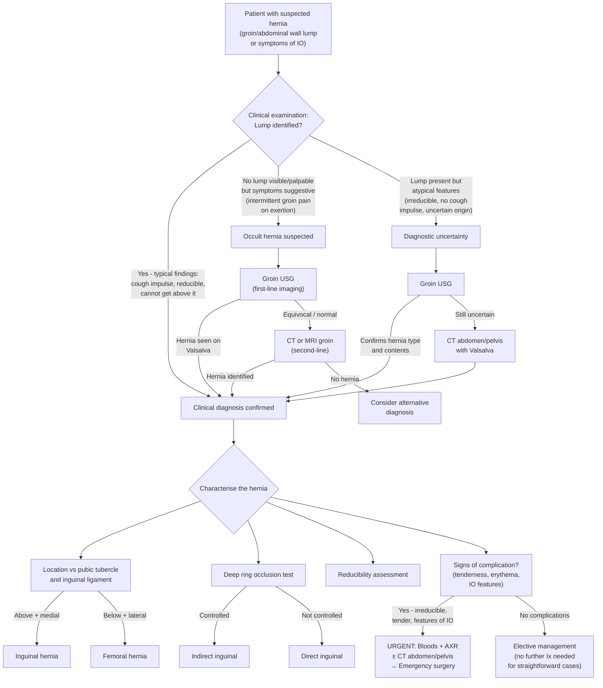

## Diagnostic Criteria, Algorithm & Investigations for Hernia

---

### 1. Diagnostic Criteria — Is It a Hernia?

Hernia is fundamentally a ***clinical diagnosis*** [1][2]. There are no formal "diagnostic criteria" in the way that, say, rheumatic fever has the Jones criteria. Instead, the diagnosis rests on recognising a constellation of clinical findings during a systematic physical examination. Think of it as a **checklist of positive physical signs** that, taken together, confirm the diagnosis and characterise the hernia.

#### 1.1 The Clinical Diagnostic Triad

For a groin lump to be confidently called a hernia, you need to demonstrate:

1. **An inguinoscrotal or groin lump that you cannot get above** — this means the lump originates from, or extends into, the abdominal cavity/inguinal canal rather than being a purely scrotal or subcutaneous pathology
2. **Cough impulse** — an expansile impulse felt or seen on coughing, confirming communication between the lump and the peritoneal cavity via the defect (although ***femoral hernias commonly do NOT exhibit cough impulse*** due to the tight neck [3][4])
3. **Reducibility** — the ability to return contents into the abdomen (present in uncomplicated hernias; absent in irreducible/incarcerated/strangulated hernias)

When all three are present, the clinical diagnosis is essentially certain. When they are equivocal (e.g., intermittent symptoms with no demonstrable lump, or a small irreducible lump without cough impulse), imaging is needed.

#### 1.2 Characterising the Hernia — Physical Examination Approach

Once you've established that a hernia exists, the physical examination classifies it:

**Step 1 — Standing Inspection** [3]:
- ***Position the patient standing with full exposure from upper abdomen to thigh***
- Look for scars, lumps/swellings bilaterally, scrotal swelling, skin changes (oedema, erythema → strangulation)
- ***Ask the patient to cough*** and look for a **visible expansile cough impulse**
- ***Ask the patient to look down at toes*** to tense abdominal muscles (accentuates ventral/incisional hernias)
- ***Ask the patient to reduce the hernia*** or reduce by gentle pressure in the direction of the inguinal canal

**Step 2 — Palpation (standing)** [3]:
- Assess size, border, surface, consistency, temperature, tenderness
- ***Try to get above the hernia*** — cannot get above = hernia; can get above = think hydrocele/scrotal pathology
- ***Feel for palpable cough impulse*** (reduce first, then cough)
- Check for inguinal lymphadenopathy

**Step 3 — Supine Examination** [3]:
- ***Determine relationship to pubic tubercle and inguinal ligament***:
  - ***Medial + above pubic tubercle → inguinal hernia***
  - ***Below + lateral to pubic tubercle → femoral hernia***
- ***Perform the deep ring occlusion test***:
  - Place finger over the ***deep inguinal ring (2 cm above the midpoint of the inguinal ligament)***
  - Ask the patient to stand and cough
  - ***Direct hernia: hernia reappears medial to the deep ring (not controlled)***
  - ***Indirect hernia: hernia is controlled with pressure on the deep ring***
  - ***Pantaloon hernia: hernia appears slightly on coughing, and appears more fully after removal of compression***
- Remove finger and observe the direction of reappearance:
  - ***Direct hernia: projects forward*** (straight through Hesselbach's triangle)
  - ***Indirect hernia: slides obliquely*** (along the inguinal canal)

**Step 4 — Completion** [3]:
- ***Genital examination*** — check for scrotal extension, undescended testis, baseline testicular volume
- ***Contralateral groin*** — bilateral hernias are common
- ***Per rectal (PR) examination*** — check for BPH (straining as precipitant); lower anal canal drains to superficial inguinal LN
- ***Per vagina (PV) examination*** — lower vagina drains to superficial inguinal LN
- ***Examine abdomen*** — ascites, organomegaly
- ***Examine chest*** — COPD signs (chronic cough as precipitant)

<Callout title="Occlusion Test Accuracy" type="idea">
The lecture slides highlight that the ***occlusion test has an accuracy of only 35% for direct inguinal hernia*** but ***86% for indirect inguinal hernia*** [1]. This means the test is much better at confirming an indirect hernia (when controlled) than at ruling one out. In practice, the definitive distinction between direct and indirect is made **intraoperatively** — the relationship of the sac to the inferior epigastric vessels is visualised directly. Preoperative classification does not change the operative approach for most surgeons using mesh repair.
</Callout>

---

### 2. Classification Systems

Classification systems exist to standardise communication and guide surgical approach. Two are highlighted in the lecture slides:

#### 2.1 ***Nyhus Classification*** [1]

***Designed for the posterior approach based on the size of the internal ring and the integrity of the posterior wall*** [1]:

| Type | Description |
|---|---|
| ***Type 1*** | ***Indirect hernia with a normal internal ring*** — paediatric type; sac is small, ring is not dilated |
| ***Type 2*** | ***Indirect hernia with an enlarged internal ring*** — adult indirect; ring is dilated but posterior wall (Hesselbach's floor) is intact |
| ***Type 3a*** | ***Direct inguinal hernia*** — defect in the posterior wall/transversalis fascia |
| ***Type 3b*** | ***Indirect hernia causing posterior wall weakness*** — large indirect that has eroded/weakened the floor; includes pantaloon and sliding hernias |
| ***Type 3c*** | ***Femoral hernia*** |
| ***Type 4*** | ***All recurrent hernias*** |

> **Why does this matter?** The Nyhus system is particularly useful for laparoscopic surgeons operating from the posterior/pre-peritoneal approach (TEP/TAPP), where you are looking at the myopectineal orifice from behind and can assess the internal ring size and posterior wall integrity directly.

#### 2.2 ***EHS (European Hernia Society) Groin Hernia Classification*** [1]

A simpler, more practical classification used widely in modern practice:

| Category | Location Code | Size (by finger-breadths of defect) |
|---|---|---|
| ***Primary or Recurrent*** | ***L = Lateral (Indirect)*** | ***1 = ≤ 1 finger*** |
| | ***M = Medial (Direct)*** | ***2 = 1–2 fingers*** |
| | ***F = Femoral*** | ***3 = ≥ 3 fingers*** |
| | | ***x = not investigated*** |

**Example**: ***Primary L2*** = a primary indirect inguinal hernia with a defect of 1–2 finger-breadths [1].

> **Why EHS is preferred clinically**: It is quick to apply, directly describes the hernia you see, and the size grading correlates with recurrence risk and choice of repair technique. It can be applied both clinically and intraoperatively.

---

### 3. Diagnostic Algorithm

<Callout title="Key Principle">
***Most hernias are diagnosed by physical examination alone*** [1][2]. Imaging is reserved for: (1) diagnostic uncertainty (cannot differentiate hernia from other groin pathology), (2) occult hernia (symptoms present but no demonstrable lump), (3) suspected complications (need to assess bowel viability and plan surgery), and (4) post-operative evaluation (haematoma, recurrence) [2].
</Callout>

---

### 4. Investigation Modalities

The lecture slides explicitly state the diagnostic hierarchy [1]:

> ***Diagnosis: (1) Physical examination alone; (2) Ultrasound; (3) CT; (4) Less commonly still MRI, herniography***

Let us work through each modality from first principles, understanding **when** to use it, **what** you are looking for, and **why**.

#### 4.1 No Investigation Required — Clinical Diagnosis

For the vast majority of straightforward, reducible, uncomplicated inguinal or femoral hernias, **no investigation is needed** [1][2]. The physical examination findings are sufficient to make the diagnosis and plan surgery.

- ***Clinical diagnosis*** is the standard for inguinal hernia [2]
- Investigations are only needed when clinical findings are **equivocal** or when **complications** are suspected

#### 4.2 Abdominal X-ray (AXR)

| Feature | Details |
|---|---|
| **When to order** | ***NOT routinely indicated unless intestinal obstruction is suspected*** in cases of incarceration and strangulation [3] |
| **What to look for** | Dilated loops of small bowel ( > 3 cm) or large bowel ( > 6 cm, caecum > 9 cm); air-fluid levels on erect film; absent gas in distal bowel/rectum; gas shadow within the hernia sac on groin view |
| **Why it helps** | Confirms the presence and level of intestinal obstruction, which changes the urgency of management from elective to emergency |
| **Limitations** | Cannot characterise the hernia itself; cannot assess bowel viability; may be normal early in obstruction or in Richter's hernia (partial wall involvement → no complete obstruction) |

**Key findings and interpretation:**

| AXR Finding | Interpretation |
|---|---|
| Multiple dilated SB loops with air-fluid levels, absent distal gas | Small bowel obstruction — if a groin hernia is palpable, the hernia is the likely cause |
| Gas shadow visible in the groin/inguinal region | Bowel within the hernia sac — confirms hernia contains bowel |
| Single dilated loop with no gas elsewhere | Closed-loop obstruction — high suspicion for strangulation |
| Normal AXR despite clinical suspicion of obstruction | Does not exclude obstruction (early stage or Richter's hernia); proceed to CT |

#### 4.3 Ultrasound (USG) — ***First-Line Imaging*** [1][2][3]

***USG groin is the imaging modality of choice*** [3]. It is the most practical, accessible, and cost-effective imaging tool for hernia assessment.

| Feature | Details |
|---|---|
| **When to order** | ***Diagnosis uncertain (esp. irreducible hernia)***; to differentiate inguinal from femoral hernia; occult hernia (symptoms without palpable lump); ***post-operative evaluation for haematoma*** [2]; to ***differentiate from inguinal hernia in femoral hernia*** (since conservative management may be an option for inguinal but NOT for femoral) [4] |
| **Technique** | High-frequency linear probe (7.5–12 MHz) placed over the inguinal region; dynamic examination with **Valsalva manoeuvre** is essential (hernia contents protrude on straining) |
| **What to look for** | Real-time protrusion of abdominal contents through the fascial defect on Valsalva; identify the defect location relative to the inferior epigastric vessels; characterise contents (bowel — peristalsis visible; omentum — hyperechoic; fluid) |
| **Sensitivity / Specificity** | Sensitivity 86–97%, specificity 77–95% for groin hernias; ***high sensitivity and specificity*** [3] |
| **Limitations** | Operator-dependent; limited in obese patients; may miss very small hernias or Spigelian hernias (deep, interparietal); cannot assess bowel viability in strangulation |

**Key USG findings and interpretation:**

| USG Finding | Interpretation |
|---|---|
| Fascial defect with herniation of contents lateral to inferior epigastric vessels, through the deep ring | ***Indirect inguinal hernia*** |
| Fascial defect with herniation medial to inferior epigastric vessels, through Hesselbach's triangle | ***Direct inguinal hernia*** |
| Herniation below the inguinal ligament, through the femoral canal | ***Femoral hernia*** |
| Peristalsis visible within the sac contents | Bowel within the hernia sac |
| Hyperechoic, non-peristaltic contents | Omentum within the sac |
| Thickened bowel wall, absence of peristalsis, free fluid around the sac | Strangulation with bowel compromise — **urgent** |
| Contents protrude only on Valsalva, reduce spontaneously | Reducible hernia |
| Contents persist despite relaxation; lack of change with Valsalva | Irreducible / incarcerated hernia |

<Callout title="Dynamic Examination Is Essential" type="error">
A **static** ultrasound may miss a reducible hernia entirely — the contents may be within the abdomen at rest. Always perform the scan with the patient in both **supine** and **standing** positions, and always include a ***Valsalva manoeuvre*** (or ask the patient to cough during the scan). A hernia that is only visible on straining will be missed on a static, relaxed scan.
</Callout>

#### 4.4 CT Scan (CT Abdomen/Pelvis)

***CT is indicated when physical examination cannot definitively identify the hernia*** [3], or when complications are suspected and surgical planning requires detailed cross-sectional anatomy.

| Feature | Details |
|---|---|
| **When to order** | (1) Cannot differentiate inguinal from femoral hernia clinically; (2) Suspected complications (strangulation, perforation, peritonitis) — need to assess bowel viability and plan surgery; (3) Occult/unusual hernias (obturator, Spigelian, internal hernias); (4) Recurrent hernia with unclear anatomy post-previous repair |
| **Technique** | IV contrast (to assess bowel wall enhancement and vascular compromise); oral contrast optional; Valsalva CT technique can be used for occult hernias |
| **What to look for** | Fascial defect with herniation of contents; relationship to inferior epigastric vessels and inguinal ligament; bowel wall thickening, mural non-enhancement, mesenteric fat stranding (strangulation); free fluid; pneumoperitoneum (perforation) |

**Key CT findings and interpretation:**

| CT Finding | Interpretation |
|---|---|
| Defect in anterior abdominal wall with sac containing bowel/omentum | Confirmed hernia — location determines type |
| ***Hernia sac contents lateral to inferior epigastric vessels entering deep inguinal ring*** | Indirect inguinal hernia |
| ***Hernia sac medial to inferior epigastric vessels in Hesselbach's triangle*** | Direct inguinal hernia |
| ***Hernia sac below inguinal ligament in femoral canal*** | Femoral hernia |
| ***Hernia through obturator foramen*** | Obturator hernia — look for **Howship-Romberg sign** clinically |
| Bowel wall thickening ( > 3 mm) with mural non-enhancement (lack of contrast uptake) | Bowel ischaemia/strangulation — **surgical emergency** |
| Target sign / concentric rings in bowel wall | Intramural oedema from venous congestion |
| Mesenteric haziness / fat stranding around the hernia neck | Inflammation from incarceration or early strangulation |
| Free fluid in the sac or peritoneal cavity | Transudation from congested bowel; if large volume → suspect perforation |
| Pneumoperitoneum | Bowel perforation — **immediate surgery** |
| Closed-loop configuration (C-shaped or U-shaped bowel) | Closed-loop obstruction with two points fixed at the hernia neck — very high strangulation risk |

<Callout title="CT Signs of Strangulation — Must Know">
The key CT findings that differentiate **simple incarceration** from **strangulation** are: (1) bowel wall thickening with **non-enhancement** (lack of contrast uptake = no blood supply), (2) **mesenteric haziness/fat stranding**, (3) **free fluid** within the sac or peritoneum, and (4) **pneumatosis intestinalis** (gas in the bowel wall = necrosis). These findings mandate emergency surgery without delay.
</Callout>

#### 4.5 MRI

| Feature | Details |
|---|---|
| **When to order** | ***Less commonly used*** [1]; reserved for cases where USG and CT are inconclusive; particularly useful for occult hernias in patients with chronic groin pain (e.g., sportsman's hernia/athletic pubalgia where there is no clear hernia but a posterior wall deficiency); useful in young patients to avoid radiation |
| **Advantages** | Excellent soft tissue contrast; can differentiate types of hernia with high accuracy; no ionising radiation; dynamic MRI with Valsalva can demonstrate occult hernias |
| **Limitations** | Expensive; time-consuming; not widely available in emergency settings; cannot be used in patients with certain metallic implants |
| **Key findings** | Same anatomical features as CT but with superior soft tissue resolution; can detect subtle posterior wall weakness (sports hernia) without frank herniation |

#### 4.6 Herniography

***Less commonly used*** [1] — largely historical but worth knowing:

- Involves injection of water-soluble contrast into the peritoneal cavity, followed by fluoroscopy or X-ray
- The contrast outlines the peritoneal sac if a hernia is present
- Was used for **occult hernias** when ultrasound and CT were not as advanced
- Largely superseded by dynamic USG and MRI in modern practice
- Risks: contrast allergy, bowel perforation during injection, peritonitis

#### 4.7 Blood Investigations (for Complicated Hernias)

When a hernia presents with features of complications (incarceration, obstruction, strangulation), blood tests are needed not to diagnose the hernia itself but to **assess the patient's physiological status** and **plan for emergency surgery**:

| Investigation | Purpose / Key Findings |
|---|---|
| **Full blood count (FBC)** | Leucocytosis (WBC > 11 × 10⁹/L) suggests inflammation/infection/strangulation; raised haematocrit suggests dehydration from vomiting |
| **Renal function (U&E)** | Dehydration from vomiting → raised urea and creatinine; hypokalaemia and metabolic alkalosis from loss of gastric acid in proximal SBO; hypochloraemia |
| **Lactate** | Elevated serum lactate ( > 2 mmol/L) suggests tissue ischaemia — high sensitivity for bowel strangulation; a rising lactate is ominous |
| **CRP** | Non-specific marker of inflammation; markedly elevated in strangulation with sepsis |
| **Venous blood gas (VBG)** | Metabolic acidosis (low pH, low bicarbonate, raised lactate) in strangulation/sepsis; metabolic alkalosis if prolonged vomiting |
| **Group and screen / crossmatch** | Preparation for emergency surgery — may need bowel resection with potential blood loss |
| **Amylase / lipase** | To exclude pancreatitis as an alternative cause of abdominal pain (in cases presenting with diffuse pain rather than a clear groin lump) |
| **Coagulation profile** | Pre-operative assessment, especially in elderly patients on anticoagulants |

---

### 5. Special Diagnostic Scenarios

#### 5.1 Occult Inguinal Hernia

Some patients present with **groin pain on exertion** but no demonstrable lump on examination. This is the "occult hernia" or early hernia with intermittent protrusion.

- **First-line**: Dynamic groin USG with Valsalva — may show transient herniation through the deep ring or Hesselbach's triangle
- **Second-line**: Dynamic MRI with Valsalva — more sensitive for subtle posterior wall bulging
- **Consider differential**: sportsman's hernia (athletic pubalgia) — there is inguinal canal posterior wall weakness but no true hernial sac; hip pathology (labral tear, FAI); adductor tendinopathy; iliopsoas bursitis

#### 5.2 Incisional Hernia

- ***Physical examination: define the fascial defect by tilting head up to look at toes*** (this tenses the rectus, making the fascial defect and hernia bulge more obvious) [2]
- ***Percuss for content*** — dull = omentum; resonant = bowel [2]
- Imaging: CT abdomen/pelvis is the gold standard for incisional hernias — it maps the exact size and location of the defect, identifies contents, and reveals any additional defects (important for surgical planning, especially large/complex incisional hernias)

#### 5.3 Obturator Hernia

- Often **no external lump visible** (hernia is deep within the pelvis)
- Diagnosed on **CT scan** showing bowel herniating through the obturator foramen
- Clinical clue: ***Howship-Romberg sign*** (pain along the medial thigh on internal rotation of the hip — obturator nerve compression)
- Typically in ***thin elderly females*** ("little old lady hernia") [2]

#### 5.4 Paediatric Inguinal Hernia [5]

- ***Clinical diagnosis*** in children — history of intermittent inguinal/scrotal swelling during crying or straining is often sufficient
- **"Silk glove sign"** — thickened spermatic cord palpated at the external ring, feeling like rubbing two layers of silk together — suggests a patent processus vaginalis
- ***USG*** can be helpful if the hernia is not demonstrable at the time of consultation, but a convincing history from the parents is sufficient for surgical referral in paediatric practice
- Differentiate from ***communicating hydrocele***: hydrocele transilluminates, varies in size over the day, and empties gradually when supine

---

### 6. Summary of Investigation Algorithm by Clinical Scenario

| Clinical Scenario | Investigations Needed |
|---|---|
| **Uncomplicated, reducible inguinal hernia, clear clinical diagnosis** | ***None — clinical diagnosis sufficient*** [1][2] |
| **Diagnosis uncertain / cannot differentiate inguinal from femoral** | ***Groin USG (first-line)*** [1][3][4]; CT if USG inconclusive [3] |
| **Occult hernia (symptoms without palpable lump)** | ***Groin USG with dynamic Valsalva (first-line)*** [3]; MRI if USG negative |
| **Irreducible hernia, uncertain if incarcerated** | ***USG (first-line)*** [2] — assess contents and viability |
| **Suspected strangulation / obstruction** | ***AXR*** (assess for IO) + ***Bloods*** (FBC, U&E, lactate, VBG, G&S) + ***CT abdomen/pelvis with IV contrast*** (assess bowel viability, plan surgery) [3] |
| **Incisional hernia pre-operative planning** | ***CT abdomen/pelvis*** — map defect size, location, contents |
| **Post-operative evaluation (haematoma, recurrence)** | ***USG*** [2] |
| **Suspected obturator / internal / unusual hernia** | ***CT abdomen/pelvis*** [3] |

---

<Callout title="High Yield Summary">

1. ***Hernia is a clinical diagnosis*** — the majority of cases require no investigations [1][2].
2. ***Physical examination is the gold standard***: standing inspection → palpation with cough impulse → supine examination with deep ring occlusion test → completion (genitals, contralateral groin, PR, abdomen, chest) [3].
3. ***Occlusion test accuracy***: 86% for indirect hernia (controlled), only 35% for direct hernia (not controlled) — definitive direct/indirect distinction is made intraoperatively [1].
4. ***Imaging hierarchy***: Physical examination alone → Ultrasound → CT → MRI / Herniography (rarely) [1].
5. ***USG is the first-line imaging modality***: non-invasive, inexpensive, high sensitivity/specificity; must be performed dynamically with Valsalva [3].
6. ***CT is indicated when***: clinical examination is inconclusive, complications are suspected (strangulation/obstruction), or unusual hernias are considered (obturator, Spigelian, internal) [3].
7. ***CT signs of strangulation***: bowel wall thickening with non-enhancement, mesenteric fat stranding, free fluid, pneumatosis intestinalis — these mandate emergency surgery.
8. ***AXR is NOT routine*** — only indicated when intestinal obstruction is suspected [3].
9. ***Bloods for complicated hernias***: FBC, U&E, lactate, VBG, CRP, G&S — lactate is the most sensitive marker for bowel ischaemia.
10. ***Classification systems***: Nyhus (Types 1–4, based on internal ring size and posterior wall integrity) and EHS (L/M/F with size 1/2/3) [1].

</Callout>

---

<ActiveRecallQuiz
  title="Active Recall - Diagnosis of Hernia"
  items={[
    {
      question: "What is the investigation hierarchy for hernia as stated in the lecture slides?",
      markscheme: "(1) Physical examination alone, (2) Ultrasound, (3) CT, (4) Less commonly MRI or herniography. Most hernias are diagnosed clinically without any imaging."
    },
    {
      question: "Describe the deep ring occlusion test: how is it performed, what does it differentiate, and what is its accuracy?",
      markscheme: "Reduce hernia, place finger over deep inguinal ring (2 cm above midpoint of inguinal ligament). Patient stands and coughs. Controlled (hernia does not reappear) = indirect (accuracy 86%). Not controlled (reappears medially) = direct (accuracy only 35%). Definitive classification is made intraoperatively."
    },
    {
      question: "List the Nyhus classification types 1 through 4 for groin hernias.",
      markscheme: "Type 1: indirect hernia with normal internal ring. Type 2: indirect hernia with enlarged internal ring. Type 3a: direct inguinal hernia. Type 3b: indirect hernia causing posterior wall weakness (includes pantaloon and sliding). Type 3c: femoral hernia. Type 4: all recurrent hernias."
    },
    {
      question: "When should an AXR be ordered in the context of hernia? What key findings would you look for?",
      markscheme: "AXR is NOT routine. Indicated only when intestinal obstruction is suspected (incarcerated/strangulated hernia). Key findings: dilated SB loops (> 3 cm) with air-fluid levels on erect film, absent distal gas, gas shadow within hernia sac in groin. A normal AXR does not exclude obstruction (early stage or Richter's hernia)."
    },
    {
      question: "What are the CT signs that differentiate simple incarceration from strangulation in a hernia?",
      markscheme: "Strangulation signs: (1) bowel wall thickening with non-enhancement (no contrast uptake = loss of blood supply), (2) mesenteric fat stranding, (3) free fluid in sac or peritoneum, (4) pneumatosis intestinalis (gas in bowel wall = necrosis). These mandate emergency surgery."
    },
    {
      question: "Explain the EHS groin hernia classification system. How would you classify a primary indirect inguinal hernia with a defect of 1-2 finger-breadths?",
      markscheme: "EHS uses: Primary/Recurrent, Location (L = Lateral/Indirect, M = Medial/Direct, F = Femoral), Size (1 = 1 finger or less, 2 = 1-2 fingers, 3 = 3 or more fingers, x = not investigated). The described hernia would be classified as Primary L2."
    }
  ]}
/>

## References

[1] Lecture slides: GC 193. Inguinal and scrotal swelling different types of hernia.pdf (p27, p39, p58, p59)
[2] Senior notes: maxim.md (Chapter 6 — Hernia: Investigations, Incisional hernia, Femoral hernia)
[3] Senior notes: felixlai.md (Physical examination, Radiological tests sections)
[4] Senior notes: maxim.md (Chapter 6.6 — Femoral hernia: Investigations)
[5] Lecture slides: GC 203. The child needs an operation Common emergencies and surgery in childhood.pdf
