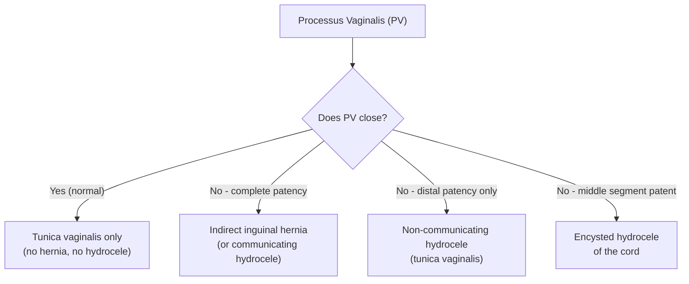
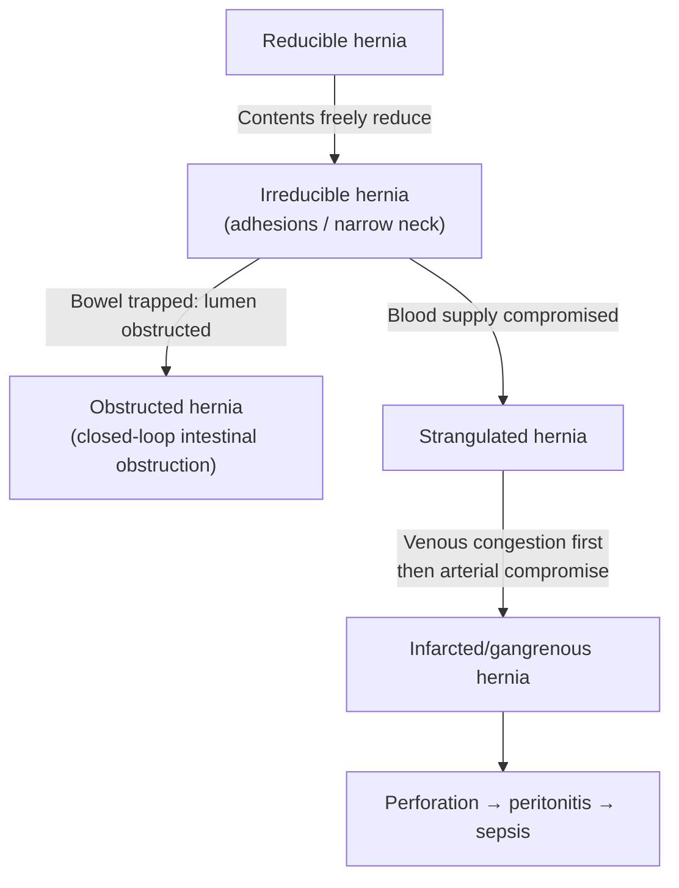

## 1. Definition

***Hernia: the protrusion of an organ (or part of an organ) through the wall of its containing cavity*** [1][2][3].

Break down the word: "hernia" derives from Latin *hernios* = rupture/protrusion. The concept is simple — something that should stay inside pushes through a weak spot in the wall that normally contains it. Think of it like an inner tube bulging through a weak spot in a tyre.

Three essential components of every hernia:
1. **Hernia sac** — the outpouching of peritoneum (or its equivalent) that lines the defect
2. **Hernia contents** — the organ/tissue that enters the sac (omentum, small bowel, colon, bladder, etc.)
3. **Hernia neck/ring** — the aperture through which the sac protrudes; its diameter determines the risk of complications (narrow neck → higher strangulation risk)

<Callout title="Key Concept">
The *neck* of the hernia is the single most important determinant of complications. A narrow neck (e.g., femoral hernia, indirect inguinal hernia at the deep ring) impedes venous return first → oedema → arterial compromise → ischaemia → gangrene. A wide neck (e.g., direct inguinal hernia) rarely strangulates.
</Callout>

---

## 2. Epidemiology

### 2.1 Frequency & Distribution

- ***Inguinal hernias are the most common type, accounting for ~78% of all abdominal wall hernias*** [2][3].
- ***Incisional hernias*** are the second most common type overall [2].
- ***Femoral hernias account for only 2–8% of all adult groin hernias*** [1].
- ***Indirect inguinal hernia is the MOST common groin hernia in both sexes*** [3][4].

| Hernia Type | Approximate Proportion |
|---|---|
| Inguinal (indirect + direct) | ~78% |
| Incisional | ~10–13% |
| Femoral | ~2–8% |
| Umbilical / Paraumbilical | ~3–5% |
| Others (epigastric, Spigelian, lumbar, obturator, etc.) | ~1–3% |

### 2.2 Age Distribution

- Median age of diagnosis in males: **50–69 years** [4]
- Median age of diagnosis in females: **60–79 years** [4]
- Inguinal hernias have a bimodal distribution:
  - **Peak 1** — Infancy/early childhood (congenital indirect inguinal hernia from patent processus vaginalis)
  - **Peak 2** — Middle-aged to elderly adults (acquired weakness of transversalis fascia)
- ***Femoral hernia occurs later in life than inguinal hernia*** [4]

### 2.3 Sex Distribution

- ***Hernias are generally more common in males*** [4]
  - Male-to-female ratio for inguinal hernias is approximately **8–10 : 1**
  - Why? — The deep inguinal ring is wider in males (to accommodate the spermatic cord) compared to the smaller opening for the round ligament in females
  - ***Deep inguinal ring is narrower in women, hence a lower incidence of indirect inguinal hernia*** [4]
- ***Femoral hernia is more common in females*** [1][4]
  - Related to the ***wider pelvis*** (wider femoral canal) and ***comparatively less muscle bulk / weakening of musculature from childbirth*** [2][4]
  - However, even in females, **inguinal hernia is still more common than femoral hernia** [4]

### 2.4 Laterality

- ***Right-sided inguinal hernias are more common*** [4]
  - Why? — ***Related to later descent of the right testicle and later obliteration of the processus vaginalis*** on the right [4]

### 2.5 Complication Rates

- ***Femoral hernias present with more complications such as incarceration and strangulation than inguinal hernias*** [4]
  - Strangulation risk: **Femoral > Indirect inguinal > Direct inguinal** [2]
  - This directly correlates with neck width: femoral ring is the tightest → highest strangulation risk

<Callout title="Exam Pearl" type="idea">
When you see a groin lump in an elderly female — always consider femoral hernia first and have a low threshold for surgical referral, because strangulation risk is high and the hernia may not exhibit cough impulse (contents are tightly trapped).
</Callout>

---

## 3. Risk Factors

Risk factors can be understood through one unifying framework: **hernia = (defect in wall integrity) + (forces pushing contents through)**. Thus, anything that weakens the wall or increases intra-abdominal pressure (IAP) predisposes.

### 3.1 Non-Modifiable (Intrinsic) Risk Factors [1][3][4]

| Factor | Mechanism |
|---|---|
| ***Family history*** | Genetic predisposition to abnormal collagen metabolism (types I/III collagen ratio alterations → weaker connective tissue) |
| ***Previous contralateral hernia*** | Indicates underlying connective tissue weakness; bilateral patent processus vaginalis |
| ***Gender (male)*** | Wider deep inguinal ring, passage of spermatic cord, and the testicular descent pathway creates a natural weak point |
| ***Age*** | Degenerative weakness of muscles and fibrous tissue; loss of collagen cross-linking, sarcopenia |
| ***Abnormal collagen metabolism*** | Conditions like Ehlers-Danlos syndrome, Marfan syndrome; increased MMP activity degrades extracellular matrix |
| Race (Caucasian) | Higher prevalence of inguinal hernia; related to body habitus and collagen composition [4] |
| Pregnancy | Hormonal-induced laxity of pelvic ligaments (relaxin, progesterone); increased IAP from gravid uterus [4] |

### 3.2 Modifiable (Acquired) Risk Factors [1][3][4]

| Factor | Mechanism |
|---|---|
| ***Obesity*** | Chronically elevated IAP; fatty infiltration weakens abdominal musculature |
| ***Chronic constipation / straining*** | Repeated Valsalva manoeuvre raises IAP |
| ***Pulmonary disease / chronic cough*** (e.g., COPD) | Repetitive increases in IAP with each cough |
| ***Prostatectomy*** | Disruption of the pre-peritoneal space and pelvic floor support |
| Smoking | Impairs collagen synthesis and promotes extracellular matrix degradation (↑MMPs); also causes chronic cough |
| Heavy lifting | Repeated spikes in IAP |
| BPH / straining to urinate | Repeated Valsalva |
| Ascites | Chronically raised IAP |
| Abdominal wall injury / trauma | Direct disruption of fascial integrity |

<Callout title="Slide High Yield" type="idea">
***Intrinsic risk factors for inguinal hernia: (1) Family history, (2) Previous contralateral hernia, (3) Gender, (4) Age, (5) Abnormal collagen metabolism. Acquired risk factors: (1) Prostatectomy, (2) Obesity, (3) Chronic constipation, (4) Pulmonary disease.*** [1]
</Callout>

---

## 4. Anatomy

Understanding hernia anatomy from first principles is non-negotiable — the anatomy determines the type of hernia, the surgical approach, and the risk of complications.

### 4.1 Layers of the Anterior Abdominal Wall (Superficial → Deep) [2][3]

1. **Skin**
2. **Camper's fascia** (superficial fatty layer of superficial fascia)
3. **Scarpa's fascia** (deep membranous layer of superficial fascia) — continuous with Colles' fascia in the perineum and dartos fascia in the scrotum
4. **External oblique (EO) muscle** and its aponeurosis
5. **Internal oblique (IO) muscle** and its aponeurosis
6. **Transversus abdominis (TA) muscle** and its aponeurosis
7. **Transversalis fascia** — the critical layer; weakness here allows direct inguinal hernias
8. **Extra-peritoneal (pre-peritoneal) fat**
9. **Parietal peritoneum**

### 4.2 Rectus Sheath [2]

The rectus sheath is formed by the interlacing aponeuroses of EO, IO, and TA:

- **Above the arcuate line** (approximately 5 cm below umbilicus, at one-third the distance from umbilicus to pubic crest):
  - Anterior sheath: EO aponeurosis + anterior leaf of IO aponeurosis
  - Posterior sheath: posterior leaf of IO aponeurosis + TA aponeurosis
  - Rectus abdominis is fully enclosed
- **Below the arcuate line**:
  - Anterior sheath: ALL three aponeuroses pass anteriorly
  - Posterior: only **transversalis fascia** (and peritoneum) — no muscular/aponeurotic posterior sheath
  - This is why the lower abdomen is relatively weaker and why Spigelian hernias and incisional hernias of lower midline incisions are common here

Contents of rectus sheath: rectus abdominis, pyramidalis, superior and inferior epigastric vessels, thoraco-abdominal nerves (T7–T11), subcostal nerve (T12) [2].

### 4.3 The Inguinal Canal [1][2][3]

The inguinal canal is an oblique passage (~4 cm long) through the lower anterior abdominal wall, running inferomedially from the deep inguinal ring to the superficial inguinal ring.

**Contents:**
- Male: ***spermatic cord*** + ***ilioinguinal nerve***
- Female: ***round ligament of the uterus*** + ilioinguinal nerve

**Walls of the Inguinal Canal** [2]:

| Wall | Structure |
|---|---|
| ***Anterior*** | ***External oblique aponeurosis*** (full length); internal oblique contributes laterally |
| ***Posterior*** | ***Lateral 1/3: transversalis fascia***; ***Medially: conjoint tendon*** (fused aponeuroses of IO + TA inserting into the pubic crest) |
| ***Roof (superior)*** | ***Arching fibres of internal oblique and transversus abdominis (conjoint tendon centrally)*** |
| ***Floor (inferior)*** | ***Inguinal ligament*** (rolled-under inferior edge of EO aponeurosis); ***laterally: iliopubic tract***; ***medially: lacunar ligament*** |

**Deep Inguinal Ring** [2]:
- An opening in the **transversalis fascia**
- Located ***1 cm above the midpoint of the inguinal ligament*** (midpoint between ASIS and pubic tubercle)
- ***Lateral to the inferior epigastric vessels*** — this is the key landmark distinguishing indirect from direct hernias

**Superficial Inguinal Ring** [2]:
- A triangular defect in the **external oblique aponeurosis**
- Located ***just superolateral to the pubic tubercle***

> **Landmark tip**: 
> - *Mid-point of inguinal ligament* (PT to ASIS) → deep inguinal ring is 1 cm above
> - *Mid-inguinal point* (pubic symphysis to ASIS) → femoral artery pulse

### 4.4 ***Myopectineal Orifice of Fruchaud (MPO)*** [1]

***First described by Dr. Henri Fruchaud in 1956*** [1]. This is the conceptual unifying anatomical framework for all groin hernias.

- ***An area of weakness in the pelvic region*** [1]
- ***Normal congenital/anatomical gaps occur in this area*** [1]
- ***Not reinforced by muscle layers like the rest of the abdominal wall*** [1]
- ***More prone to repetitive increases in intra-abdominal pressure leading to progressive bulging, weakness, and hernia formation*** [1]
- The MPO is a single large orifice divided by the inguinal ligament into:
  - **Superior compartment** → inguinal hernias (direct and indirect)
  - **Inferior compartment** → femoral hernias
- Bounded by: rectus abdominis (medially), iliopsoas (laterally), pubic bone/Cooper's ligament (inferiorly), and the conjoined aponeurotic arch (superiorly)

<Callout title="Why MPO Matters Surgically">
Laparoscopic repairs (TEP/TAPP) place a large mesh covering the *entire* MPO from the posterior/pre-peritoneal approach — this addresses direct, indirect, AND femoral hernias simultaneously with a single mesh. This is why the concept of MPO is surgically important.
</Callout>

### 4.5 Hesselbach's Triangle [2][3][4]

The anatomical region through which **direct inguinal hernias** protrude:

| Boundary | Structure |
|---|---|
| ***Inferior*** | ***Inguinal ligament*** |
| ***Lateral*** | ***Inferior epigastric vessels*** |
| ***Medial*** | ***Lateral border of the rectus sheath (linea semilunaris)*** |

The floor of Hesselbach's triangle is the **transversalis fascia** covered by the **external oblique aponeurosis**. Direct hernias push through the weakened transversalis fascia in this region.

### 4.6 The Spermatic Cord [2]

The spermatic cord runs from the deep inguinal ring to the testis. Its **three fascial coverings** are derived from the layers of the abdominal wall that the processus vaginalis traverses during testicular descent:

| Fascial Layer | Derived From | Mnemonic |
|---|---|---|
| ***External spermatic fascia*** | ***External oblique (EO)*** | "E from E" |
| ***Cremasteric fascia and muscle*** | ***Internal oblique (IO)*** | "C from I" |
| ***Internal spermatic fascia*** | ***Transversalis fascia (TF)*** | "I from T" |

> Note: ***Transversus abdominis (TA) does NOT contribute*** a fascial layer to the spermatic cord [2].

**Contents of the Spermatic Cord** — "3-3-3 rule" [2]:

| Category | Structures |
|---|---|
| **3 Arteries** | Testicular artery (from aorta), artery to vas deferens (from inferior vesical artery), cremasteric artery (from inferior epigastric artery) |
| **3 Veins** | Pampiniform plexus (→ testicular vein), cremasteric vein, vein of vas deferens |
| **3 Others** | Vas deferens, genital branch of genitofemoral nerve (motor to cremaster), lymphatics (drain the testis to para-aortic lymph nodes — NOT inguinal nodes, because testis is retroperitoneal in origin) |

<Callout title="Exam Trap" type="error">
Testicular lymphatic drainage goes to ***para-aortic lymph nodes*** (not inguinal), because the testis developed retroperitoneally and descended. The scrotal skin, however, drains to superficial inguinal nodes. This distinction matters for testicular cancer staging.
</Callout>

### 4.7 Anatomy of the Femoral Canal [1][2]

The femoral canal is the medial-most compartment of the femoral sheath. ***Femoral hernias protrude through the femoral ring into the femoral canal*** [3][4].

**Femoral Triangle** (boundaries) [2]:
- Superior: inguinal ligament
- Medial: adductor longus
- Lateral: sartorius
- Contents: ***NAVEL*** — Femoral **N**erve, Femoral **A**rtery, Femoral **V**ein, **E**mpty space (femoral canal), **L**ymph nodes

**Femoral Canal Boundaries** (posterior/internal view) [2][3][4]:

| Boundary | Structure |
|---|---|
| ***Anterior*** | ***Inguinal ligament*** |
| ***Posterior*** | ***Pectineal (Cooper's/Ileopectineal) ligament*** |
| ***Medial*** | ***Lacunar ligament*** |
| ***Lateral*** | ***Femoral vein*** |

- The femoral canal contains the **deep inguinal lymph node of Cloquet** which drains the penis/clitoris [2]
- The femoral ring is small and rigid (surrounded by ligaments and the femoral vein) — this is why ***femoral hernias have a high risk of strangulation*** [1][3]

### 4.8 Processus Vaginalis — The Embryological Foundation [3][4]

Understanding the processus vaginalis (PV) is essential because it explains indirect inguinal hernias, hydroceles, and encysted hydroceles of the cord.

**Developmental Sequence:**
1. During fetal development (months 7–9), the testes descend from the retroperitoneum through the inguinal canal into the scrotum, guided by the **gubernaculum**
2. A finger-like evagination of peritoneum — the **processus vaginalis** — precedes the testis through the inguinal canal
3. The PV normally **obliterates** (closes) after birth
4. The distal remnant becomes the **tunica vaginalis** surrounding the testis

**In females**: The equivalent structure is the **canal of Nuck**, which accompanies the round ligament through the inguinal canal. If it persists, it produces a **hydrocele of the canal of Nuck** or an indirect inguinal hernia.

**Timing of closure** [4]:
- Within 2 months: closes in **~40%** of neonates
- Within 2 years: additional **~20%** close
- Of the remaining **~40%** with a patent PV, approximately **half** (i.e., ~20% overall) develop a clinical hernia

---

## 5. Etiology & Pathophysiology

### 5.1 Natural Causes of Hernia [4]

Hernias occur at sites of pre-existing anatomical weakness:

**A. Natural weakness:**
- Lumbar triangles (superior triangle of Grynfeltt-Lesshaft, inferior triangle of Petit)
- Posterior wall of the inguinal canal (Hesselbach's triangle — transversalis fascia)
- Umbilicus (where the abdominal wall never fully muscularises)

**B. Weakness due to structures entering and leaving the abdomen:**
- Oesophagus through diaphragm → **hiatus hernia**
- Femoral vessels through femoral ring → **femoral hernia**
- Spermatic cord/round ligament through inguinal canal → **inguinal hernia**
- Obturator nerve through obturator foramen → **obturator hernia**
- Sciatic nerve through sciatic foramen → **sciatic hernia**

### 5.2 Congenital Hernia [3][4]

***Congenital hernia is due to failure of processus vaginalis to close (patent processus vaginalis)*** [4].

**Pathophysiology:**
- A patent PV acts as a pre-formed sac
- Increases in IAP (crying, straining) force abdominal contents (usually bowel or omentum) into this sac
- In males: hernia descends alongside the spermatic cord, potentially reaching the scrotum (complete indirect inguinal hernia)
- In females: hernia descends along the round ligament through the canal of Nuck
- Congenital inguinal hernias are almost always **indirect**

**Why are they more common on the right?** — Because the right testis descends later in fetal development, and therefore the right processus vaginalis obliterates later, providing a longer window of vulnerability [4].

### 5.3 Acquired Hernia [3][4]

***Defect develops as a result of weakening or disruption of fibromuscular tissues of the abdominal wall*** [4].

Two broad mechanisms:

**A. Primary tissue degeneration (for direct inguinal and other abdominal wall hernias):**
- Ageing → loss of collagen cross-linking, sarcopenia → transversalis fascia stretches and attenuates
- Abnormal collagen metabolism → altered type I:III collagen ratio (type III is mechanically weaker); elevated matrix metalloproteinase (MMP) activity
- Smoking → reduces prolyl hydroxylase activity (needed for collagen synthesis) and increases serine protease activity → net collagen degradation

**B. Disruption of wall integrity (for incisional hernias):**
- Surgical incision disrupts fascial continuity
- Impaired wound healing (infection, malnutrition, immunosuppression, obesity, smoking, excessive wound tension, use of steroids/chemotherapy) → the scar never regains full strength
- Emergency surgery and prolonged operative time increase risk

**C. Raised IAP as a precipitant:**
- Chronic cough (COPD), chronic constipation, BPH (straining to void), heavy lifting, obesity, pregnancy, ascites
- Acts on a pre-existing weakness to force peritoneum and contents through

### 5.4 Pathophysiology of Hernia Complications

The sequential pathophysiology of a hernia that progresses from reducible to gangrenous:

**Step-by-step mechanism of strangulation:**
1. Bowel enters a tight hernia sac through a narrow neck
2. The narrow neck compresses the **thin-walled veins** first (venous return is impeded before arterial inflow because venous pressure is lower)
3. Venous congestion → oedema of bowel wall → bowel swells further → now cannot reduce
4. Rising tissue pressure eventually occludes **arterioles** → ischaemia
5. Mucosal barrier fails → bacterial translocation → toxins enter the peritoneum and bloodstream
6. Full-thickness necrosis (gangrene) → perforation → faecal peritonitis → sepsis → death if untreated

<Callout title="Important Concept">
Strangulation is a **venous event first, then arterial**. This is why the strangulated bowel initially appears dark purple/congested (venous) before becoming black/gangrenous (arterial ischaemia). The same principle applies to ovarian torsion and testicular torsion.
</Callout>

---

## 6. Classification

### 6.1 By Region [3][4]

| Region | Types |
|---|---|
| ***Groin*** | ***Inguinal (direct / indirect / pantaloon)***; ***Femoral*** |
| ***Ventral*** | ***Epigastric; Umbilical; Paraumbilical; Spigelian; Incisional; Parastomal*** |
| ***Pelvic*** | ***Obturator; Sciatic*** |
| ***Flank*** | ***Lumbar (superior triangle of Grynfeltt, inferior triangle of Petit)*** |
| ***Diaphragmatic*** | ***Hiatus hernia (sliding / rolling / mixed / giant); Congenital diaphragmatic hernia (Bochdalek, Morgagni)*** |
| ***Internal*** | Paraduodenal, foramen of Winslow, transmesenteric, etc. |

### 6.2 By Etiology [4]

- **Congenital** — defect present from birth (patent PV → indirect inguinal hernia; umbilical ring defect)
- **Acquired** — develops from weakening/disruption (direct inguinal, incisional, femoral in adults)

### 6.3 By Reducibility (Descriptive Terminology) [2][3][4]

| Term | Definition | Pathophysiology |
|---|---|---|
| ***Reducible*** | Contents can move freely in and out of the sac back to the peritoneal cavity | Sac of peritoneum allows bowel/omentum to pass through; no adhesions; defect is large enough |
| ***Irreducible*** | Contents cannot be returned to the peritoneal cavity | Adhesions form between contents and sac wall, or defect is small relative to contents |
| ***Incarcerated*** | Irreducible hernia that is "imprisoned" — swollen/fixed within sac, developing towards strangulation | Bowel trapped; may develop lumen obstruction (closed-loop) and/or vascular compromise |
| ***Obstructed*** | Loop of bowel trapped such that **lumen** (but not blood supply) is obstructed | Closed-loop intestinal obstruction; bowel proximal to obstruction distends |
| ***Strangulated*** | Blood supply to the herniated contents is compromised → ischaemia/impending gangrene | Narrow neck → venous congestion → oedema → arterial compromise → ischaemia |
| ***Infarcted*** | Contents are gangrenous | Full-thickness necrosis; high mortality |

### 6.4 Special Types [1][2][3]

| Type | Description |
|---|---|
| ***Pantaloon hernia*** | ***Presence of both direct and indirect inguinal hernia*** — straddles the inferior epigastric vessels |
| ***Sliding hernia*** | ***An internal organ forms part of the hernia wall*** (not just the contents) — ***usually sigmoid colon*** (left) or caecum (right). The bowel "slides" down with the sac. Also called *hernie en glissade*. |
| ***Richter's hernia*** | ***Incarcerated hernia involving only one sidewall of the bowel*** → causes ischaemia but **not** complete luminal obstruction. Patient may not have features of intestinal obstruction, which delays diagnosis. |
| ***Maydl's hernia*** | Two adjacent loops of bowel enter the sac; the **intervening loop remaining intra-abdominally** is the first to suffer strangulation (because it is the centre of the "W" loop). The strangulated segment is *intra-abdominal* — easily missed at operation! |
| ***Littre's hernia*** | Hernia containing a Meckel's diverticulum |
| ***Amyand's hernia*** | Hernia containing the appendix (in an inguinal hernia sac) |
| ***De Garengeot's hernia*** | Appendix within a femoral hernia sac |
| ***Reduction-en-masse*** | ***Apparently "reducing" the sac but the contents were not actually pushed out of the sac*** — sac and contents are pushed together behind the abdominal wall → still strangulated. A dangerous false reassurance. |

<Callout title="Richter's Hernia — The Trap" type="error">
Because only one sidewall of the bowel is caught, the lumen remains partially patent → patient may NOT present with classic intestinal obstruction symptoms. Instead, they present with a tender irreducible groin lump and may develop bowel wall necrosis and perforation before obstruction is recognized. This is why Richter's hernia is classically associated with femoral hernias (small, tight femoral ring catches just a knuckle of bowel wall).
</Callout>

### 6.5 Inguinal Hernia Sub-classification [1][2][3][4]

| Feature | ***Direct Inguinal*** | ***Indirect Inguinal*** |
|---|---|---|
| Relation to inferior epigastric vessels | ***Medial*** | ***Lateral*** |
| Anatomical site of defect | ***Hesselbach's triangle (transversalis fascia)*** | ***Deep inguinal ring (patent processus vaginalis)*** |
| Mechanism | ***Insufficient transversalis fascia*** (acquired weakness) | ***Recanalisation of obliterated processus vaginalis*** (congenital) or peritoneum pushed through deep ring (acquired in elderly) |
| Typical age | Elderly (acquired) | Young (congenital) or elderly (acquired) |
| Laterality | ***Usually bilateral*** | ***Usually unilateral*** |
| Descend into scrotum? | ***NO (rarely)*** | ***YES (can follow spermatic cord into scrotum)*** |
| Relationship to spermatic cord | ***Not within spermatic cord*** | ***Within spermatic cord coverings*** |
| Deep ring pressure test | ***NOT controlled*** by pressure over the deep ring | ***Controlled*** by pressure over the deep ring |
| Strangulation risk | ***Less common (broad base/wide neck)*** | ***More common (narrow deep ring or superficial ring)*** |

> **Deep Ring Occlusion Test**: After reducing the hernia, place your thumb over the deep inguinal ring (1 cm above the midpoint of the inguinal ligament). Ask the patient to cough:
> - If the hernia is **controlled** (does not reappear) → **indirect** (you have blocked its route through the deep ring)
> - If the hernia is **not controlled** (reappears medially) → **direct** (it enters through Hesselbach's triangle, not the deep ring)

### 6.6 Different Types of Ventral Hernia [2][3][4]

**Umbilical vs. Paraumbilical Hernia:**

| Feature | Umbilical Hernia | Paraumbilical Hernia |
|---|---|---|
| Location | Through the umbilical scar itself | Around (adjacent to) the umbilical scar |
| Shape | Round | Crescent-shaped |
| Age group | Congenital (infants) | Adults (acquired) |
| Natural history (paediatric) | Most close spontaneously by age 3–5 | N/A |

- **Pathophysiology**: occurs due to ***stretching and thinning of the linea alba*** [4]
- Acquired causes: increased IAP (obesity, pregnancy, chronic cough, constipation, ascites)
- Small hernias contain extraperitoneal fat/omentum; large hernias may contain small or large bowel with ***high risk of incarceration and strangulation*** [4]

***Epigastric hernia***: defects in the ***midline between umbilicus and xiphoid process*** through the linea alba aponeurotic intersections; usually contain only **pre-peritoneal fat** (not bowel); occur in ***middle-aged men after lifting*** [2][3]

***Spigelian hernia***: passes through the ***semilunar line*** (lateral border of rectus sheath), which is the ***caudal-most extent of the posterior rectus sheath***; often interparietal (between muscle layers) and difficult to diagnose clinically [3]

***Diastasis recti*** (divarication of recti): ***linea alba stretches laterally due to overweight or pregnancy***; ***exacerbated by looking at toes*** (head raise); this is NOT a true hernia (no fascial defect, no hernia sac) — simply a widening of the gap between the two rectus muscles. No risk of incarceration. No surgical repair needed unless symptomatic/cosmetic [2].

<Callout title="Diastasis Recti vs True Hernia" type="error">
Students commonly confuse diastasis recti with a ventral hernia. Diastasis recti has **no fascial defect** — the linea alba is stretched but intact. There is no hernia sac, and there is **no risk of strangulation**. Do not refer for emergency surgery!
</Callout>

***Incisional hernia*** [2][3][4]:
- Hernia developing at sites where an incision has been made = ***partial wound dehiscence (skin remains intact)***
- Essentially an **extrusion of abdominal content through a weak scar**
- Risk factors: patient factors (***age, obesity, immunocompromised***), local factors (***infection, haematoma, chemo/RT***), surgeon factors (***poor surgical technique with tension***, placing drains through wounds, emergency/prolonged OT) [2]
- Physical examination: ***define fascial defect by tilting head up to look at toes*** (contracts rectus, accentuates defect) [2]
- Complications: intermittent obstruction, incarceration/strangulation, enterocutaneous fistula (skin excoriation)

***Parastomal hernia***: a subtype of incisional hernia occurring adjacent to a stoma site (very common, up to 50% of colostomies)

**Lumbar hernia** [3]:
- Occurs in the region bounded: superiorly by **12th rib**, inferiorly by **iliac crest**, medially by **erector spinae**, laterally by **internal oblique**
- Through either the superior (Grynfeltt-Lesshaft) or inferior (Petit) lumbar triangle

**Obturator hernia** [3]:
- Passes through the **obturator foramen** alongside the obturator nerve
- Classic presentation: elderly thin woman with intestinal obstruction and positive **Howship-Romberg sign** (pain along the medial thigh on internal rotation of the hip — due to obturator nerve compression)

**Sciatic hernia** [3]:
- Extremely rare; passes through greater or lesser sciatic foramen

---

## 7. Clinical Features

### 7.1 Symptoms

| Symptom | Pathophysiological Basis |
|---|---|
| ***Groin/abdominal lump that appears on standing, straining, or coughing and reduces on lying down*** | IAP increases with upright posture and Valsalva → forces contents through defect; gravity and relaxation allow reduction when supine |
| Dragging/aching sensation in the groin or lump site | Traction on the parietal peritoneum and mesentery by the herniated contents; intermittent stretching of the hernia neck |
| Asymptomatic lump discovered incidentally | Many small hernias with wide necks (e.g., small direct inguinal) cause minimal symptoms |
| ***Acute pain, tenderness, swelling that cannot be reduced*** | Incarceration → tissue oedema, peritoneal irritation; if strangulated → ischaemic pain (constant, severe) |
| Nausea, vomiting, abdominal distension, absolute constipation | Obstructed hernia → closed-loop intestinal obstruction → proximal bowel distension, failed peristalsis |
| Fever, tachycardia, systemic toxicity | Strangulation → bowel necrosis → bacterial translocation → systemic inflammatory response / sepsis |
| ***Erythema/skin changes over the lump*** | Underlying strangulated bowel → inflammation of the sac → transmitted to overlying skin |

**In paediatric patients (neonates/infants)** [5][6]:
- ***Intermittent groin swelling during crying or straining*** is the classical presentation
- Parents may notice a bulge that comes and goes
- Irritability, poor feeding, and inconsolable crying may signal incarceration
- ***Incarcerated inguinal hernia is a surgical emergency in children*** — higher risk of gonadal compromise (testicular ischaemia in boys, ovarian torsion in girls)

### 7.2 Signs

**General Examination of a Groin Lump:**

| Sign | How to Elicit | Significance / Pathophysiology |
|---|---|---|
| ***Location relative to pubic tubercle*** | Palpate the pubic tubercle; determine if lump is above and medial (inguinal) vs. below and lateral (femoral) | Inguinal hernia originates above the inguinal ligament; femoral hernia exits below it through the femoral canal |
| ***Cough impulse*** | Ask patient to cough while palpating the lump | A palpable expansile impulse confirms communication with the peritoneal cavity. ***Femoral hernias commonly do NOT exhibit cough impulse*** due to tight neck trapping contents [3][4] |
| ***Reducibility*** | With patient supine, gently attempt to push contents back | Reducible → contents slide back; irreducible → suspect adhesions or incarceration |
| ***Deep ring occlusion test*** | Reduce hernia, apply pressure over deep ring (midpoint of inguinal lig.), ask patient to cough | Controlled = indirect; not controlled = direct |
| ***"Can you get above it?"*** | Palpate the superior aspect of the lump | If you **cannot** get above the lump → it is coming from the abdomen (true hernia) or inguinal canal. If you **can** get above it → think scrotal pathology (hydrocele, epididymal cyst, etc.) |
| Transilluminance | Shine pen torch behind the swelling | Hydroceles transilluminate brilliantly (fluid-filled); hernias do NOT (contain bowel/omentum which are opaque). Exception: infants — thin-walled hernia may partially transilluminate |
| ***Lump descending into the scrotum*** | Observe whether the groin lump extends into the scrotum | Only **indirect inguinal hernias** descend into the scrotum (following the spermatic cord). Direct hernias rarely do. Femoral hernias never do. |
| Percussion | Percuss over the lump | Resonant = gas-filled bowel (hernia). Dull = omentum, fluid (hydrocele), or solid mass |
| Auscultation | Listen for bowel sounds over the lump | Bowel sounds heard = herniated bowel within the sac |
| ***Tenderness, warmth, erythema*** | Palpation | Suggests incarceration/strangulation → urgent surgical exploration |

**Distinguishing Features — Inguinal vs. Femoral Hernia (Physical Examination):**

| Feature | Inguinal Hernia | Femoral Hernia |
|---|---|---|
| Relation to inguinal ligament | Above and medial to pubic tubercle | Below and lateral to pubic tubercle |
| Shape | Often oval/elongated along inguinal canal | Usually small, firm, round |
| Scrotal extension | Indirect type can extend into scrotum | Never |
| Cough impulse | Usually present | ***Commonly absent*** (tight neck) |
| Strangulation risk | Indirect > direct | ***Highest*** |
| Sex predominance | Male >> female | Female > male (but inguinal still more common even in females) |

**Examination of Associated Features** [2]:
Always examine for underlying causes and contributing factors:
- **Abdomen**: ascites, organomegaly, abdominal masses (e.g., ovarian mass raising IAP)
- **Chest**: signs of COPD (barrel chest, hyperresonance) — chronic cough as precipitant
- **Digital rectal examination**: prostatic enlargement (BPH → straining to void)
- **Contralateral groin**: bilateral hernias are common, especially in direct type
- **Both testes**: check for undescended testis (differential), testicular atrophy (post-previous repair)

### 7.3 Clinical Features Specific to Hernia Complications

| Stage | Symptoms | Signs |
|---|---|---|
| **Reducible** | Intermittent lump; mild ache | Visible/palpable lump that reduces; cough impulse positive; non-tender |
| **Irreducible** | Constant lump; discomfort | Lump does not reduce but non-tender, no skin changes |
| **Incarcerated** | ***Painful, cannot reduce; may have nausea*** | ***Tender, firm, irreducible lump; may have erythema*** |
| **Obstructed** | ***Colicky abdominal pain; vomiting; abdominal distension; absolute constipation*** | ***Distended abdomen; tinkling bowel sounds; irreducible tender groin lump*** |
| **Strangulated** | ***Severe constant pain (changes from colicky to constant = ominous); systemic symptoms (fever, tachycardia)*** | ***Exquisitely tender, warm, erythematous, tense lump; peritonism; signs of sepsis*** |

<Callout title="When Does Colicky Pain Become Constant?">
Colicky (intermittent, cramping) pain = the bowel is obstructed but viable — it is still contracting trying to overcome the obstruction. When the pain changes to **constant**, it means the bowel wall itself is ischaemic/necrotic — the muscle can no longer contract. This transition is an ominous sign of strangulation.
</Callout>

### 7.4 Paediatric Specific Clinical Features [5][6]

***Inguinal hernia in children:***
- Almost exclusively **indirect** (patent processus vaginalis)
- ***More common in premature infants*** (PV has had less time to obliterate)
- ***Male:Female ratio approximately 6:1***
- ***60% right-sided, 30% left-sided, 10% bilateral***
- Presents as ***intermittent inguinal/scrotal swelling during crying, straining, or Valsalva***
- ***Incarceration rate is highest in the first year of life*** (~30% in infants < 6 months)
- In girls, the **ovary** (± fallopian tube) may herniate — palpable as a firm, non-tender, mobile nodule in the labia/groin (ovary in the sac)

***Umbilical hernia in children:***
- Defect in the umbilical ring present from birth
- ***Very common in African descent infants (up to 25–30%)***
- ***Most close spontaneously by age 3–5 years*** — therefore observation is appropriate
- ***Surgery indicated if: (1) persists beyond age 4–5, (2) defect > 1.5–2 cm (unlikely to close), (3) symptomatic, (4) incarceration (rare in children)***
- Rarely strangulates in children (the neck is usually broad)

---

## 8. Differential Diagnosis of a Groin Mass [4]

| Category | Differentials |
|---|---|
| **Hernia** | Inguinal hernia (direct/indirect); Femoral hernia |
| **Vascular** | Femoral artery aneurysm (expansile, pulsatile); Saphena varix (disappears on lying down, bluish, "thrill" on coughing) |
| **Lymphatic** | Inguinal lymphadenopathy (infective/reactive/malignant); Lymphoma |
| **Nerve** | Neuroma |
| **Soft tissue / Bone** | Lipoma; Abscess (psoas abscess — fluctuant, points below inguinal ligament); Sebaceous cyst |
| **Genitourinary (males)** | Undescended/ectopic testis; Communicating hydrocele; Hydrocele of the spermatic cord (encysted) |
| **Genitourinary (females)** | Hydrocele of the canal of Nuck |

<Callout title="Key Differentiators">

**Saphena varix** vs. **femoral hernia**: both are below the inguinal ligament. Saphena varix has a bluish tinge, has a fluid thrill on cough (not expansile impulse), and disappears completely on lying down. It is at the saphenofemoral junction.

**Femoral aneurysm** vs. **femoral hernia**: aneurysm is **expansile and pulsatile** (expands in all directions synchronous with the pulse). A hernia may be pulsatile (transmitted) but is not expansile. Never try to reduce a suspected aneurysm!

**Lymph node** vs. **femoral hernia**: lymph nodes are usually multiple, discrete, firm, non-reducible, no cough impulse, and the overlying skin may be inflamed if infective. Always check the drainage area (lower limb, perineum, genitalia).
</Callout>

---

## 9. Key Anatomical and Clinical Differences — Summary Table

| Feature | Indirect Inguinal | Direct Inguinal | Femoral |
|---|---|---|---|
| Exit through | Deep inguinal ring | Hesselbach's triangle | Femoral ring/canal |
| Relation to inf. epigastric vessels | Lateral | Medial | Below inguinal ligament |
| Relation to pubic tubercle | Above + medial | Above + medial | Below + lateral |
| Relation to inguinal ligament | Above | Above | Below |
| Enters scrotum? | Yes (can) | No (rarely) | Never |
| Cough impulse | Yes | Yes | Often absent |
| Deep ring test | Controlled | Not controlled | N/A |
| Strangulation risk | Moderate | Low | ***High*** |
| Common demographics | Young males; elderly | Elderly males | ***Elderly females*** |
| Aetiology | Patent PV (congenital); acquired | Weak transversalis fascia (acquired) | Weak femoral ring |
| Content (MC) | Small bowel, omentum | Small bowel, omentum | Omentum, knuckle of small bowel (Richter's) |

---

<Callout title="High Yield Summary">

1. ***Hernia = protrusion of an organ through the wall of its containing cavity*** [1][2].
2. **Inguinal hernia is the most common type (~78%)**; indirect is more common than direct in both sexes.
3. ***Femoral hernias: 2–8% of groin hernias, more common in females, highest strangulation risk*** — all should be surgically repaired [1].
4. **Key landmark**: inferior epigastric vessels — indirect is lateral, direct is medial.
5. **Deep ring occlusion test**: controlled = indirect; not controlled = direct.
6. **Hesselbach's triangle** (direct hernia): inguinal ligament (inferior), inferior epigastric vessels (lateral), lateral border of rectus sheath (medial).
7. **Femoral canal boundaries**: inguinal ligament (anterior), Cooper's ligament (posterior), lacunar ligament (medial), femoral vein (lateral).
8. ***Myopectineal orifice of Fruchaud*** — the unifying weak area; divided by the inguinal ligament into inguinal (above) and femoral (below) compartments [1].
9. **Strangulation risk**: femoral > indirect inguinal > direct inguinal (inversely proportional to neck width).
10. **Richter's hernia**: only sidewall of bowel caught → ischaemia without complete obstruction → delayed diagnosis.
11. **Reduction-en-masse**: sac and contents pushed together behind wall → still strangulated.
12. **Strangulation sequence**: venous compromise → oedema → arterial compromise → ischaemia → gangrene → perforation.
13. ***Paediatric inguinal hernia***: almost always indirect (patent PV); high incarceration rate in infants < 6 months; ***right-sided predominance***.
14. ***Risk factors (intrinsic)***: family history, previous contralateral hernia, gender, age, abnormal collagen metabolism. ***(Acquired)***: prostatectomy, obesity, chronic constipation, pulmonary disease [1].
15. **Diastasis recti is NOT a true hernia** — no fascial defect, no risk of strangulation.
</Callout>

---

<ActiveRecallQuiz
  title="Active Recall - Hernia (Definition to Clinical Features)"
  items={[
    {
      question: "What are the boundaries of Hesselbach's triangle, and which type of inguinal hernia passes through it?",
      markscheme: "Inferior: inguinal ligament. Lateral: inferior epigastric vessels. Medial: lateral border of rectus sheath. Direct inguinal hernia protrudes through this triangle due to weak transversalis fascia."
    },
    {
      question: "Name the boundaries of the femoral canal (ring). Why do femoral hernias have a high strangulation risk?",
      markscheme: "Anterior: inguinal ligament. Posterior: pectineal (Cooper's) ligament. Medial: lacunar ligament. Lateral: femoral vein. The ring is small and rigid (bound by ligaments/vein) so contents are easily trapped."
    },
    {
      question: "What is a Richter's hernia and why is it dangerous?",
      markscheme: "Incarcerated hernia involving only one sidewall of the bowel. Causes ischaemia and potential perforation without causing complete intestinal obstruction, delaying diagnosis. Classically associated with femoral hernias."
    },
    {
      question: "Explain the deep ring occlusion test. How does it differentiate indirect from direct inguinal hernia?",
      markscheme: "After reducing the hernia, apply digital pressure over the deep inguinal ring (1 cm above midpoint of inguinal ligament). If hernia is controlled (does not reappear on coughing) it is indirect (enters via deep ring). If not controlled (reappears medially) it is direct (enters through Hesselbach's triangle)."
    },
    {
      question: "List the intrinsic and acquired risk factors for inguinal hernia as per the lecture slides.",
      markscheme: "Intrinsic: (1) family history, (2) previous contralateral hernia, (3) gender (male), (4) age, (5) abnormal collagen metabolism. Acquired: (1) prostatectomy, (2) obesity, (3) chronic constipation, (4) pulmonary disease."
    },
    {
      question: "Describe the pathophysiological sequence from incarceration to gangrene in a strangulated hernia.",
      markscheme: "Narrow neck traps bowel, compresses thin-walled veins first (lower pressure), venous congestion leads to oedema, bowel swells and becomes further trapped, rising tissue pressure occludes arterioles, ischaemia ensues, mucosal barrier fails, bacterial translocation occurs, full-thickness necrosis (gangrene), perforation, peritonitis and sepsis."
    }
  ]}
/>

---

## References

[1] Lecture slides: GC 193. Inguinal and scrotal swelling different types of hernia.pdf
[2] Senior notes: maxim.md (Chapter 6 — Hernia)
[3] Senior notes: felixlai.md (Hernia section)
[4] Senior notes: felixlai.md (Epidemiology, Etiology, Pathophysiology sections)
[5] Lecture slides: GC 203. The child needs an operation Common emergencies and surgery in childhood.pdf
[6] Lecture slides: Neonatal Surgery.pdf
