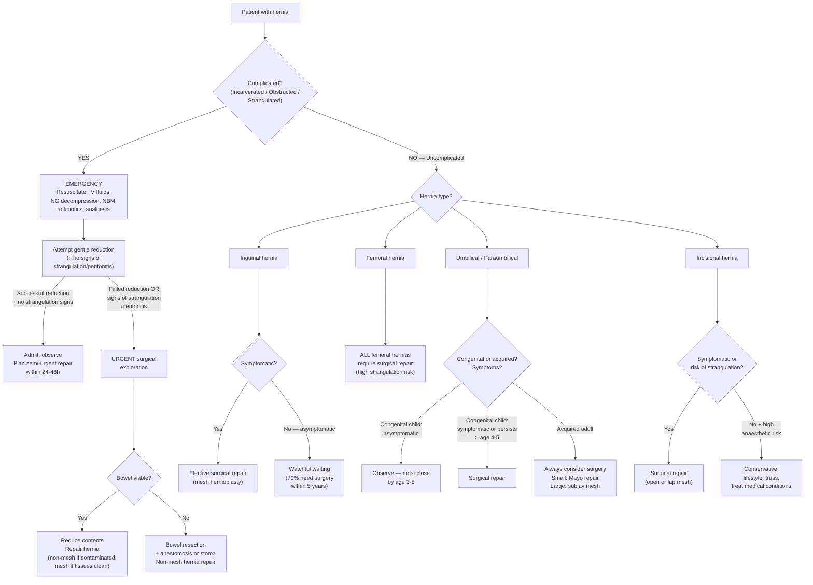

## Management of Hernia

---

### 1. Overview — Management Principles

The fundamental management decision for any hernia is simple: **operate or observe?** The answer depends on the hernia type, symptoms, complication risk, and patient fitness.

The core management principles for all hernia repairs are [2]:
1. **Reduction of hernia contents** ± removal of non-viable tissues and repair of bowel
2. **Excision and closure of the peritoneal sac**
3. **Re-approximate the walls of the neck of the hernia**
4. **Reinforce the abdominal wall defect** with sutures or mesh

Before diving into the details, let's define the surgical terminology clearly as stated in the lecture slides [1]:

> ***Herniotomy***: ***Excision of the hernia sac after reduction of contents*** — no reinforcement of the posterior wall. ***Only used in children*** (because the abdominal wall tissues in children are healthy and do not need reinforcement — the problem is purely the patent processus vaginalis, not tissue weakness) [1][2].

> ***Herniorrhaphy***: ***Herniotomy + strengthening of the posterior wall without mesh*** — a tissue-based repair using sutures to re-approximate native tissue layers [1].

> ***Hernioplasty***: ***Herniotomy + strengthening of the posterior wall with mesh*** — the modern standard; ***"tension-free" repair*** where mesh covers the defect, avoiding muscle fibre distortion that increases tension [1][2].

<Callout title="Why Mesh?">
***Mesh has a lower recurrence rate, reduces post-operative groin pain, and allows faster recovery*** compared to tissue-only repairs [2][3]. The concept is simple: suturing native tissues under tension leads to ischaemia at the suture line → tissue necrosis → repair failure → recurrence. Mesh distributes the load across a broader area without tension. Macroporous polypropylene mesh has large pores that allow permeation of new blood vessels and inflammatory cells such as fibroblasts — this is essential for creating a strong repair through tissue ingrowth [2].
</Callout>

---

### 2. Management Algorithm

---

### 3. Conservative Management

***Conservative management (watchful waiting)*** is an option for ***asymptomatic inguinal hernia*** or patients ***not fit for surgery*** [2][3].

#### 3.1 Indications for Watchful Waiting [1][2]

- ***Asymptomatic inguinal hernia*** — the lecture slides state that ***70% will become symptomatic and require surgery within 5 years*** [1], but the risk of acute incarceration is low (~1–3% per year for inguinal hernias), so observation is safe in the short term
- Patients unfit for surgery (high anaesthetic risk, concurrent medical problems)
- ***Pregnancy*** — ***pregnant women should not have elective surgical repair of inguinal or femoral hernia until at least 4 weeks after delivery***; urgent repair can still be performed if complications arise [3]

<Callout title="Watchful Waiting — NOT for Femoral Hernias" type="error">
***All femoral hernias should be treated surgically*** regardless of symptoms [2][4]. The strangulation risk is too high to justify observation. This is a critical distinction from inguinal hernias where watchful waiting is an option.
</Callout>

#### 3.2 Components of Conservative Management [2][3]

| Component | Rationale |
|---|---|
| ***Lifestyle modification*** | ***Weight reduction*** (reduces chronic IAP), ***change job nature*** (avoid heavy lifting), ***quit smoking*** (improve collagen synthesis, reduce chronic cough) |
| ***Manage underlying medical conditions*** | Treat COPD (chronic cough), BPH (straining to void), chronic constipation (laxatives) — all reduce episodes of raised IAP that worsen the hernia |
| ***Abdominal truss*** | An external pressure device applied over the hernia to keep it reduced. ***Not effective*** in the long term [2] — it does not treat the underlying defect, can cause skin erosion, and gives false reassurance. However, it may be used as a temporising measure in patients unfit for surgery |

---

### 4. Surgical Management — Inguinal Hernia

The lecture slides provide a comprehensive decision tree for inguinal hernia repair [1]:

#### 4.1 Decision Framework

The slide outlines the entire treatment pathway [1]:

***Inguinal hernia → (1) Watchful waiting; (2) Mesh repair; (3) Tissue repair***

**Within mesh repair:**
- ***Open → Anterior repair (e.g., Lichtenstein) or Posterior repair (e.g., Stoppa)***
- ***Laparoscopic → Posterior repair: TEP, TAPP, eTEP***

**Within tissue repair:**
- ***Bassini***
- ***Shouldice***

#### 4.2 Indications for Surgical Repair [2][3]

| Indication | Explanation |
|---|---|
| ***Complicated hernia (emergency)*** | Incarcerated, obstructed, or strangulated — requires urgent surgery to prevent bowel necrosis and death |
| ***Symptomatic inguinal hernia*** | ***Groin pain with exertion; inability to perform daily activities due to pain or discomfort; inability to manually reduce the hernia*** [3] |
| ***All cases of femoral hernia*** (symptomatic or asymptomatic) | ***High risk of strangulation*** [2][4] |
| ***Irreducible inguinal hernia*** | Even if currently non-tender, an irreducible hernia is at constant risk of progressing to incarceration |

#### 4.3 Contraindications to Elective Repair [3]

| Contraindication | Rationale |
|---|---|
| ***Pregnancy*** | Elective repair deferred until ***at least 4 weeks after delivery***; however, ***urgent repair is still performed if complications arise*** |
| High anaesthetic risk / severe comorbidities | Risk of surgery outweighs risk of hernia; manage conservatively |
| Active skin infection at operative site | Risk of mesh infection; defer until infection resolved |
| Patient preference (asymptomatic hernia) | Informed patient may choose watchful waiting |

#### 4.4 Choice Between Open vs Laparoscopic [1][2]

| Feature | ***Open Repair*** | ***Laparoscopic Repair*** |
|---|---|---|
| Anaesthesia | ***LA/SA (can be done under local anaesthesia)*** | ***GA required*** |
| Approach to defect | Anterior approach (Lichtenstein) or posterior (Stoppa) | ***Posterior approach*** (pre-peritoneal space) |
| Mesh placement | Anterior (onlay — Lichtenstein) or sublay (Stoppa) | ***Sublay (pre-peritoneal)*** |
| Indications | ***First occurrence; complicated hernia (emergency); previous lap repair; previous pelvic/lower abdominal midline surgery (adhesions — not fit for TEP); ascites; not fit for GA*** [2] | ***Recurrent or bilateral hernia*** — recurrent: increased adhesions after first open repair; bilateral: single port placement allows repair of both sides and exploration of contralateral groin [1][2] |
| Advantages | ***No need for GA; shorter operating time*** | ***Less early post-operative pain; less chronic pain*** (performed at a deeper level away from the 3 nerves: ilioinguinal, iliohypogastric, genital branch of genitofemoral); ***quicker recovery, shorter hospital stay; fewer complications, better cosmetics*** [2] |
| Disadvantages | ***Only one side per operation (limited by LA max dose)***; ***higher risk of recurrence*** (vs laparoscopic) | Requires GA; longer learning curve; risk of intra-abdominal organ injury during port insertion |

***European Hernia Society Guideline*** (from lecture slides) [1]:
- ***Endoscopic repair recommended for both unilateral and bilateral hernias***
- ***Preferred approach when dealing with recurrent hernia after open repair***

#### 4.5 The "Opposite Approach" Principle for Recurrence [1]

***When a hernia recurs, choose the opposite approach to avoid scar tissue*** [1]:

> ***Rationale***: operating through virgin tissue planes (not through previous scar tissue) reduces the risk of injury, is technically easier, and has better outcomes [1].

#### 4.6 ***Females*** — Special Considerations [1]

- ***Laparo-endoscopic repair recommended*** for women
- Why? (1) ***Decrease chronic pain risk*** (laparoscopic approach avoids the superficial inguinal nerves), (2) ***Avoid missing a femoral hernia*** (laparoscopic posterior view allows visualisation of the entire myopectineal orifice, including the femoral ring — a femoral hernia that was clinically misdiagnosed as inguinal can be identified and repaired simultaneously)
- ***Pregnant women → Watchful waiting → self-limiting round ligament varicosities*** (an important differential that resolves postpartum and does not require surgery) [1]

---

### 5. Specific Open Repair Techniques — Inguinal Hernia

#### 5.1 ***Mesh Repairs (Hernioplasty)***

**A. ***Lichtenstein Repair*** (Anterior open mesh repair)** [1][2][3]

This is the **gold standard open repair** for inguinal hernia worldwide.

| Feature | Details |
|---|---|
| Approach | Anterior — incision over the inguinal canal |
| Technique | ***Mesh is placed anterior to the hernia defect*** on top of the transversalis fascia/posterior wall of the inguinal canal; mesh is sutured to the inguinal ligament inferiorly and the conjoint tendon/internal oblique superiorly; a slit is cut in the mesh to accommodate the spermatic cord |
| Principle | ***"Tension-free"*** — the mesh bridges the defect without pulling native tissues together under tension |
| Advantages | Simple, fast, reproducible; can be performed under ***LA***; low recurrence rate (~1–2%) |
| Limitations | ***NOT applicable to femoral hernia*** since it does not cover the femoral ring [3]; anterior mesh position means it does not address the femoral canal below the inguinal ligament |
| Anaesthesia | LA, SA, or GA |

**B. ***Stoppa Repair*** (Posterior open mesh repair)** [1]

| Feature | Details |
|---|---|
| Approach | Open posterior — pre-peritoneal approach via midline or lower abdominal incision |
| Technique | Large mesh placed in the pre-peritoneal space covering the entire myopectineal orifice bilaterally |
| Advantage | Covers both inguinal and femoral defects; useful for bilateral or recurrent hernias |
| Limitation | More extensive dissection; usually requires GA |

#### 5.2 ***Non-Mesh Repairs (Herniorrhaphy)***

Non-mesh tissue repairs have a ***higher recurrence rate*** but are ***indicated in patients with active groin infection or contamination as a result of bowel perforation from strangulated hernia*** [3] (you cannot place a prosthetic mesh in a contaminated field — it would become an infected foreign body).

**A. ***Shouldice Repair*** [1][3]**

| Feature | Details |
|---|---|
| Technique | ***Division of all layers of the floor of the inguinal canal and reduction of hernia; reconstruction of the inguinal canal with a 4-layer overlap technique using continuous fine wire sutures to obliterate the hernia defect*** |
| Principle | Multiple overlapping layers create a strong repair from native tissue |
| Recurrence | ~1–4% in specialist centres (higher in general practice ~5–10%) |
| When to use | Contaminated field; young patients with small defects; patient preference against mesh |

**B. ***Bassini Repair*** [1][3]**

| Feature | Details |
|---|---|
| Technique | ***Primary tissue approximation in which the weakened inguinal floor is strengthened by suturing the conjoint tendon to the inguinal ligament medially to the area of the deep ring laterally*** |
| Principle | Re-creates the posterior wall by bringing the conjoint tendon down to the inguinal ligament |
| Limitation | Suture line is under tension → higher recurrence rate than Shouldice or mesh repairs |
| Historical significance | One of the original hernia repairs; largely superseded by mesh-based techniques |

---

### 6. Laparoscopic Repair Techniques — Inguinal Hernia

All laparoscopic approaches use ***mesh placed in the pre-peritoneal (sublay) position***, which is the strongest position biomechanically — intra-abdominal pressure pushes the mesh against the abdominal wall, reinforcing it (Pascal's principle).

#### 6.1 ***TEP — Totally Extraperitoneal Repair*** [1][2][3]

| Feature | Details |
|---|---|
| Technique | ***Performed in the pre-peritoneal space; surgeon develops a space between peritoneum and anterior abdominal wall*** using balloon dissection; hernia sac is reduced; mesh is placed in the pre-peritoneal space covering the entire MPO |
| Key advantage | ***Avoids entering the peritoneal cavity*** → ***less intra-abdominal adhesion formation***; ***bilateral hernia repair possible with single balloon dissection*** developing working space in both groins; ***placement of large pieces of mesh is possible*** [3] |
| Disadvantage | ***Conversion to TAPP or open may be required if failed to develop the pre-peritoneal space*** [3]; smaller working space than TAPP; steeper learning curve |
| Contraindication | ***Prior pre-peritoneal pelvic dissection*** (e.g., previous open prostatectomy) — scar tissue in the pre-peritoneal space makes dissection impossible [3] |

#### 6.2 ***TAPP — Transabdominal Pre-peritoneal Repair*** [1][2][3]

| Feature | Details |
|---|---|
| Technique | ***Performed transabdominally; peritoneum is incised to access the pre-peritoneal space; hernia is reduced; mesh is placed in the pre-peritoneal position which is then covered by peritoneum to keep mesh away from bowel*** [3] |
| Key advantage | ***Larger working space; different hernia defects are well-visualised allowing easier hernia repair; lower risk of conversion to open***; ***can be attempted in patients with prior lower abdominal surgery*** (where TEP is not possible) [3] |
| Disadvantage | ***Intra-abdominal adhesion formation; injury to adjacent intra-abdominal organs*** [3]; peritoneal closure must be meticulous to prevent internal herniation through the peritoneal defect |
| Anaesthesia | GA required |

#### 6.3 ***eTEP — Extended Totally Extraperitoneal Repair*** [1]

A newer evolution of TEP that uses a crossover technique to access both groins entirely extraperitoneally through a single set of ports. Increasingly popular for bilateral and complex hernias.

<Callout title="TEP vs TAPP — When to Choose Which">
- **TEP** is preferred when: bilateral repair needed, no prior pre-peritoneal surgery, surgeon experienced
- **TAPP** is preferred when: prior pre-peritoneal surgery (cannot use TEP), need to visualise intra-abdominal contents (suspect sliding hernia or unclear anatomy), recurrent hernia after TEP
- Both are equivalent in terms of recurrence rates and long-term outcomes
</Callout>

---

### 7. Mesh — Types and Positioning [2]

#### 7.1 Mesh Types

| Type | Material | Properties |
|---|---|---|
| ***Synthetic*** | ***Polypropylene*** (most common); ***PTFE (polytetrafluoroethylene)*** | Permanent; induces strong fibrotic tissue ingrowth; macroporous polypropylene allows blood vessel and fibroblast permeation |
| ***Biological*** | ***Sterilised decellularised connective tissue*** (from human dermis, porcine intestinal submucosa, etc.) | ***Eventually broken down*** by the body; used in contaminated fields where synthetic mesh would become chronically infected |

#### 7.2 ***Mesh Positioning*** [2]

| Position | Description | Notes |
|---|---|---|
| ***Onlay*** | ***Subcutaneous*** — placed superficial to the external oblique | Easiest to place but highest recurrence; not favoured |
| ***Inlay*** | ***Plugged within the defect*** | ***Risk of migration and "meshoma"*** (painful mass of contracted mesh); largely fallen out of favour |
| ***Sublay*** | ***Extraperitoneal*** — placed deep to the rectus/transversalis fascia in the pre-peritoneal space | ***Lowest recurrence rate***; IAP holds mesh against the wall; this is the position used in laparoscopic TEP/TAPP and open Stoppa |

> ***Key point***: ***Open repair allows all mesh positions; laparoscopic repair only allows sublay*** [2].

#### 7.3 When Mesh Cannot Be Used

***Mesh may be difficult if complicated hernia (infected / oedematous) → use non-mesh repair*** [2]:
- Active infection (mesh acts as a foreign body nidus)
- Grossly contaminated field (bowel perforation with faecal peritonitis)
- Severely oedematous tissues (mesh cannot be fixed properly; tissue ingrowth is impaired)

In these circumstances, use a **tissue repair** (Shouldice or Bassini) or consider **biological mesh** if mesh reinforcement is strongly desired.

---

### 8. Surgical Management — Femoral Hernia [1][3][4]

***All femoral hernias should be treated surgically*** — there is no role for watchful waiting [2][4].

The lecture slides state: ***Femoral hernia repair — (a) Lockwood's infrainguinal approach; (b) Lotheissen's transinguinal approach; (c) McEvedy's high approach — depends whether there is strangulation*** [1].

#### 8.1 Open Approaches

| Approach | Description | When to Use |
|---|---|---|
| ***Lockwood's (Low/Infrainguinal approach)*** | ***Direct incision over the hernia below the inguinal ligament → reduce contents → close the femoral ring by non-absorbable sutures; need to protect the femoral vein*** [4] | ***Preferred in elective settings under LA*** when there is ***no risk of bowel strangulation*** — simple, quick, minimal dissection [4] |
| ***Lotheissen's (Inguinal/Transinguinal approach)*** | ***Incision into the inguinal canal → mobilise spermatic cord (or round ligament) → open transversalis fascia (femoral hernia is below this) → reduce hernia and repair the defect*** [4] | When the hernia is difficult to reduce from below; allows better access to the femoral ring from above |
| ***McEvedy's (High/Suprainguinal approach)*** | ***Incision at the lower abdomen → expose the pre-peritoneal space → reduce hernia → close the femoral defect*** [4] | ***Preferred in emergency under SA/GA*** — ***easier access to strangulated small bowel*** [4]; allows bowel resection if needed without a separate laparotomy incision |

#### 8.2 Laparoscopic Repair

***TEP or TAPP*** — usually reserved for ***elective cases*** [4]. The posterior laparoscopic view allows excellent visualisation of the femoral ring, and a large mesh can be placed to cover both the inguinal and femoral defects simultaneously.

<Callout title="Why Lichtenstein Does NOT Work for Femoral Hernia">
***Lichtenstein repair is NOT applicable to femoral hernia since it does not cover the femoral ring*** [3]. Lichtenstein mesh is placed *anterior* to the posterior wall of the inguinal canal, *above* the inguinal ligament. The femoral ring is *below* the inguinal ligament in a different anatomical compartment. The mesh simply cannot reach the femoral defect from this approach.
</Callout>

---

### 9. Surgical Management — Other Hernia Types

#### 9.1 ***Incisional Hernia*** [2][4]

**Conservative:**
- ***Lifestyle modification, treat medical conditions, truss***
- ***Indicated if***: high anaesthetic risk, concurrent medical problems, risk of infection/dehiscence/haematoma

**Surgical repair** (open or laparoscopic) — ***indicated if symptomatic or risk of strangulation*** [2]:
- ***Dissect hernia sac and surrounding tissues ≥ 3 cm on all sides***
- Reduce hernia contents and repair the fascial defect
- ***Defects < 1 cm***: ***Mayo repair*** — ***fascial edge repaired with 2 cm overlap, using interrupted + continuous sutures***
- ***Defects > 1 cm***: ***tension-free mesh repair*** — ***allow 5–8 cm adequate overlapping over normal tissues for mesh shrinkage/contraction in ALL directions***
- ***Sublay has the lowest recurrence rate*** [2]

| Approach | When to Use |
|---|---|
| ***Laparoscopic*** | ***Underlay (intraperitoneal) mesh with dual-layer design*** (outer layer induces fibrosis, inner layer does not adhere to bowel); ***advantages: less pain, faster recovery, smaller wound, lower infection rate*** |
| ***Open*** | ***Sublay (preperitoneal) mesh*** between rectus muscle and posterior rectus sheath; ***preferred for emergency and large hernias > 10 cm*** (possibility of "sister hernia" — occurrence of hernia elsewhere in the incision) [2] |

#### 9.2 ***Umbilical / Paraumbilical Hernia*** [2][3][4]

- ***Congenital (children)***: ***repair if symptomatic***; most close spontaneously by age 3–5 [2][4]
  - Surgery indicated if: persists beyond age 4–5, defect > 1.5–2 cm, symptomatic, incarceration
- ***Acquired (adults)***: ***always consider surgery*** [4]
  - ***Small defect: Mayo repair***
  - ***Large defect: sublay extra-peritoneal mesh*** [4]
- ***Small and asymptomatic hernia do NOT require repair and can be observed*** [3]

#### 9.3 Hiatus Hernia [2]

- ***Conservative***: indicated if ***sliding hernia (Type 1)*** — weight loss, smoking cessation, reduce alcohol, treat GERD with PPI
- ***Surgical (hernia repair + Nissen fundoplication)***: indicated in:
  - ***Symptomatic despite maximum medical treatment***
  - ***Rolling type (Type 2–4)***: increased risk of ***gastric volvulus*** — surgical emergency [2]

---

### 10. Paediatric Hernia Management [5]

***Inguinal hernia and hydrocele share the same aetiology — patent processus vaginalis (PPV)*** [5]:

| Condition | Natural History | Treatment |
|---|---|---|
| ***Inguinal hernia*** | ***Persists; risk of incarceration*** | ***Herniotomy (early)*** — high ligation of the processus vaginalis; ***NO mesh needed*** (child's tissues are healthy) [5] |
| ***Hydrocele*** | ***Most resolve*** spontaneously | ***Observe; high ligation of PPV if persists*** beyond age 2–3 years [5] |

Key paediatric points [5]:
- ***Hernias are common in neonates (30% in premature babies)***
- ***Increased bilateral hernias with decreasing age***
- ***Bowel strangulation is a potential complication*** — incarceration rate highest in infants < 6 months
- In children: ***herniotomy only*** (no mesh, no hernioplasty) — simply ***excise the patent processus vaginalis*** (c.f. mesh repair in adults) [2]
- ***Open or laparoscopic herniotomy*** — laparoscopic approach allows visualisation of the contralateral internal ring (useful given the high bilateral rate in young infants)

---

### 11. Emergency Management — Complicated Hernia [2][3]

When a hernia presents as an emergency (incarcerated, obstructed, or strangulated), the approach follows a systematic resuscitation → assessment → surgery pathway:

#### 11.1 Resuscitation (Drip and Suck) [3]

| Step | Details | Rationale |
|---|---|---|
| ***Nil per os (NPO)*** | All patients made NBM | Limit further bowel distension; prepare for potential GA |
| ***IV fluid resuscitation*** | Crystalloids (NS, Hartmann's); K⁺ replacement if hypokalaemic (cautious if AKI) | Replace third-space losses, vomiting losses, correct dehydration |
| ***NG tube decompression*** | Ryle's or Salem Sump on free drainage with 4-hourly aspiration | Decompress proximal bowel; reduce aspiration risk during induction |
| ***Analgesia*** | Opioids (morphine/fentanyl) ± paracetamol | Pain from ischaemic bowel may be severe |
| ***Broad-spectrum antibiotics*** | Empirical IV antibiotics (e.g., co-amoxiclav or ceftriaxone + metronidazole) | Bacterial overgrowth proximal to obstruction; prophylaxis for potential bowel resection; prevent peritonitis from translocation |
| ***Catheter*** | Monitor urine output | Assess fluid resuscitation adequacy; pre-operative preparation |

#### 11.2 Attempt at Manual Reduction

- **Taxis** (gentle manual reduction) may be attempted for **incarcerated but NOT strangulated** hernias
- Apply gentle, sustained pressure with the patient in Trendelenburg position (head down) ± analgesia/sedation to relax the abdominal wall
- ***Manual reduction should NOT be performed*** if there are signs of strangulation (peritonitis, systemic sepsis, skin changes) [2] because:
  - Risk of ***reduction-en-masse*** (apparently "reduced" but sac and contents pushed together behind fascia → still strangulated)
  - Risk of ***peritonitis if ischaemic/gangrenous bowel is reduced into the peritoneal cavity***
  - ***Recurrence is likely*** [2]

#### 11.3 Surgical Exploration

- If reduction fails or strangulation is suspected → **emergency inguinal exploration** (for inguinal hernia) or **McEvedy's approach** (for femoral hernia — better access to bowel)
- Intraoperative assessment of bowel viability — the ***6 P's***: **cold, pulsation, pallor, peristalsis** (and colour, perforation) [2]

| Sign | Viable Bowel | Non-Viable Bowel |
|---|---|---|
| ***Colour*** | ***Dark colour becomes lighter*** (after release of constriction) | ***Dark colour persists*** |
| ***Pulsation*** | ***Visible pulsation in mesenteric arteries*** | ***No detectable pulsation*** |
| ***Appearance*** | ***Shiny*** | ***Dull and lusterless*** |
| ***Musculature*** | ***Firm; peristalsis may be observed*** | ***Flaccid; no peristalsis*** |

- **If viable**: reduce contents → repair hernia (***mesh if tissues appear normal or only mildly oedematous***; ***non-mesh if contaminated***) [3]
- **If non-viable**: ***resect non-viable bowel*** → primary anastomosis (if clean field, stable patient) or stoma (if contaminated, unstable) → ***non-mesh hernia repair*** (contaminated field)

<Callout title="Mesh in Emergency — Can You or Can't You?">
***Mesh is NOT recommended for complicated inguinal hernia since it may increase the risk of subsequent mesh infection*** [3]. It is ***safe for complicated hernia only if tissues appear normal or only mildly oedematous*** [3]. In practice: if the bowel was viable and there was no contamination, many surgeons will still use mesh. If there was bowel resection, frank contamination, or purulent fluid — use a tissue repair or biological mesh.
</Callout>

---

### 12. Post-Operative Management [2][3]

| Aspect | Details |
|---|---|
| ***Early mobilisation*** | Crucial for VTE prophylaxis and recovery [2][3] |
| ***Hygiene*** | ***Patients are able to bathe immediately***; ***keep area clean*** especially after clips/sutures removed [3] |
| ***Activity*** | ***Resume light activities 1–2 weeks post-op***; ***avoid heavy lifting or vigorous exercise until 6 weeks post-op*** [2] |
| ***Work*** | ***Patients may need to be off work for 4–6 weeks if their job involves heavy lifting*** [3] |
| ***Bowel care*** | ***Should take laxatives if constipated post-operatively*** (straining raises IAP → stresses the repair) [2][3] |
| ***Cough*** | ***Avoid prolonged coughing***; treat underlying COPD/respiratory conditions [3] |
| ***Predisposing factors*** | ***Treat chronic cough, give laxatives for constipation*** [2] |

---

### 13. Summary Table — Management by Hernia Type

| Hernia Type | Conservative Option? | Surgical Approach | Key Points |
|---|---|---|---|
| ***Inguinal (asymptomatic)*** | ***Yes — watchful waiting*** | N/A unless becomes symptomatic | 70% need surgery within 5 years |
| ***Inguinal (symptomatic)*** | No | Open Lichtenstein (1st occurrence) or laparoscopic TEP/TAPP (bilateral/recurrent) | Mesh repair is standard |
| ***Inguinal (complicated)*** | No — EMERGENCY | Open exploration; non-mesh if contaminated | Assess bowel viability; resect if needed |
| ***Femoral (any)*** | ***No — ALL require surgery*** | Open: Lockwood (elective) / McEvedy (emergency); Lap: TEP/TAPP (elective) | Lichtenstein does NOT cover femoral ring |
| ***Umbilical (congenital)*** | Yes — most close by age 3–5 | Herniotomy if symptomatic/persists | No mesh in children |
| ***Umbilical/Paraumbilical (acquired)*** | Possible if asymptomatic | Mayo repair (small) / sublay mesh (large) | Always consider surgery |
| ***Incisional*** | Yes — if unfit for surgery | Open sublay mesh / laparoscopic IPOM | Mesh overlap ≥ 5–8 cm all directions |
| ***Hiatus (Type 1 sliding)*** | Yes — PPI, lifestyle | Surgery if refractory | Nissen fundoplication |
| ***Hiatus (Type 2–4 rolling)*** | No | Hernia repair + fundoplication | Risk of gastric volvulus |
| ***Paediatric inguinal*** | No | ***Herniotomy (early)*** — no mesh | High incarceration risk in infants < 6mo |

---

<Callout title="High Yield Summary">

1. ***Herniotomy = sac excision only (children); Herniorrhaphy = sac + tissue repair (no mesh); Hernioplasty = sac + mesh repair*** [1].
2. ***Lichtenstein repair*** = gold standard open mesh repair; anterior approach; NOT applicable to femoral hernia [1][3].
3. ***Laparoscopic TEP/TAPP*** = posterior pre-peritoneal mesh placement; preferred for ***bilateral, recurrent hernias, and in females*** [1][2].
4. ***Recurrent hernia principle***: if previous anterior repair → choose posterior approach (and vice versa) to ***avoid scar tissue*** [1].
5. ***Femoral hernia***: ALL require surgery; ***Lockwood's (elective), McEvedy's (emergency)*** [1][4].
6. ***Mesh provides lower recurrence, less pain, faster recovery***; ***sublay has lowest recurrence rate*** [2].
7. ***Mesh contraindicated in contaminated/infected fields*** → use tissue repair (Shouldice/Bassini) or biological mesh [2][3].
8. ***Emergency management***: resuscitate (drip and suck) → attempt taxis (NOT if strangulated) → surgical exploration → assess viability → repair ± bowel resection.
9. ***Paediatric***: ***herniotomy only (no mesh)***; ***hernias persist and have incarceration risk; hydroceles mostly resolve*** [5].
10. ***Post-op***: early mobilisation; avoid heavy lifting for 6 weeks; laxatives if constipated; treat chronic cough [2][3].
11. ***Asymptomatic inguinal hernia***: watchful waiting is safe — 70% need surgery within 5 years [1].
12. ***Pregnant women***: defer elective repair until ≥ 4 weeks postpartum; rule out round ligament varicosities [1][3].

</Callout>

---

<ActiveRecallQuiz
  title="Active Recall - Management of Hernia"
  items={[
    {
      question: "Define herniotomy, herniorrhaphy, and hernioplasty. In which patient population is herniotomy alone appropriate?",
      markscheme: "Herniotomy = excision of hernia sac after reduction of contents, no wall reinforcement. Herniorrhaphy = herniotomy + strengthening of posterior wall WITHOUT mesh. Hernioplasty = herniotomy + strengthening with mesh. Herniotomy alone is used in children because their abdominal wall tissues are healthy — the problem is the patent processus vaginalis, not tissue weakness."
    },
    {
      question: "Why is Lichtenstein repair not applicable to femoral hernia? What approach should be used instead?",
      markscheme: "Lichtenstein places mesh anterior to the posterior wall of the inguinal canal, above the inguinal ligament. The femoral ring is below the inguinal ligament in a different compartment, so the mesh cannot reach it. For femoral hernia use: Lockwood's infrainguinal (elective), Lotheissen's transinguinal, or McEvedy's suprainguinal (emergency). Laparoscopic TEP/TAPP also covers the femoral ring from posteriorly."
    },
    {
      question: "A hernia recurs after a previous open anterior (Lichtenstein) repair. What surgical approach should be used for the recurrence, and why?",
      markscheme: "Use a posterior approach (laparoscopic TEP or TAPP). The principle is to avoid scar tissue from the previous repair by choosing the opposite approach — operating through virgin tissue planes reduces injury risk, is technically easier, and has better outcomes."
    },
    {
      question: "List the indications for emergency surgery in a patient with a complicated hernia presenting with intestinal obstruction.",
      markscheme: "Strangulated (complicated) obstruction; closed-loop obstruction; peritonitis; incarcerated or strangulated hernia with failed manual reduction or signs of bowel compromise. Also: failed conservative management after 72 hours."
    },
    {
      question: "When can mesh be used in an emergency hernia repair, and when should it be avoided?",
      markscheme: "Mesh is safe if tissues appear normal or only mildly oedematous and there is no contamination. Mesh should be avoided (use tissue repair or biological mesh) if there is: active infection, gross contamination from bowel perforation, severely oedematous tissues, or faecal peritonitis."
    },
    {
      question: "Describe the management approach for incisional hernia including indications for conservative vs surgical treatment and the choice of repair technique based on defect size.",
      markscheme: "Conservative (truss, lifestyle modification, treat medical conditions): indicated if high anaesthetic risk, asymptomatic, concurrent medical problems. Surgical: indicated if symptomatic or risk of strangulation. Defect < 1 cm: Mayo repair (fascial overlap 2 cm, interrupted + continuous sutures). Defect > 1 cm: tension-free mesh repair with 5-8 cm overlap in all directions. Sublay position has the lowest recurrence rate."
    }
  ]}
/>

## References

[1] Lecture slides: GC 193. Inguinal and scrotal swelling different types of hernia.pdf (p41, p42, p43, p53, p57, p64, p65, p66)
[2] Senior notes: maxim.md (Chapter 6 — Hernia: Surgery, Mesh, Incisional hernia, Umbilical hernia, Femoral hernia, Post-op recovery, Complications)
[3] Senior notes: felixlai.md (Treatment — Inguinal hernia, Femoral hernia, Complications, Post-op follow-up)
[4] Senior notes: maxim.md (Chapter 6.6 — Femoral hernia management; Chapter 6.5 — Umbilical hernia)
[5] Lecture slides: GC 203. The child needs an operation Common emergencies and surgery in childhood.pdf (p6, p9)
