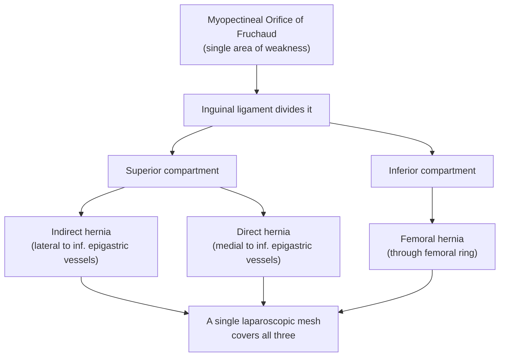
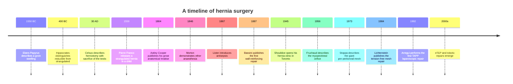

## The Story of Hernia

> *Pull up a chair. Before we dissect the anatomy, before we memorise the mesh techniques and the eponymous repairs, let me tell you a story — a story that is older than surgery itself, older than anaesthesia, older than the germ theory. It is a story about a single, stubborn problem: how does one persuade a piece of bowel to stay where it belongs?*

---

### Chapter 1 — A Word from the Ancients

The word **"hernia"** comes from the Latin *hernios*, itself borrowed from the Greek **ἔρνος (érnos)** — meaning a *bud*, a *sprout*, or a *young shoot of a tree*. The ancients, watching a soft swelling rise from a man's groin when he coughed, saw what we still see: something living, pushing outward from within, like a green shoot pressing through the bark.

Hippocrates, writing around **400 BC**, used the word *kele* (κήλη) — a *tumour* or *protrusion*. From it descend our modern compounds: *enterocele* (bowel hernia), *hydrocele* (water swelling), *omphalocele* (umbilical defect), *meningocele*, *cystocele*. Every time you write one of those words on a ward round, you are speaking Greek that is two and a half thousand years old.

<Callout title="A first lesson from etymology">
The very word teaches us the disease. A hernia is not a disease *of* the bowel — it is a *protrusion*, a sprout of something where it does not belong. Three things must therefore exist for a hernia to be called a hernia: a **wall** with a defect, a **sac** that pushes through it, and **contents** within that sac. Strip away the centuries of surgical refinement, and that is all there is.
</Callout>

---

### Chapter 2 — Egypt, Greece, and Rome: The First Observers

The earliest written reference to a hernia comes from the **Ebers Papyrus** (~1550 BC), where Egyptian physicians described a "swelling on the surface of the belly" that grew when a man coughed. They knew it was dangerous. They had no cure. They wrapped the patient in linen bandages and prayed.

A mummy from the **21st Egyptian Dynasty** (~1100 BC) — **Ramses V**, no less — was found at autopsy to bear a healed scrotal swelling consistent with an inguinal hernia. The pharaoh, who ruled the Nile, was defeated by his own transversalis fascia.

The **Greeks** added clinical description. Hippocrates and later **Praxagoras of Cos** (~340 BC) distinguished a **reducible** swelling (*"that returns when the patient lies down"*) from an **irreducible** one (*"that remains, becomes black, and the patient dies"*). Already, two and a half millennia ago, the spectrum from reducible → incarcerated → strangulated → gangrenous was being mapped out, not in textbooks but in the bedside experience of physicians who had no other tools but their eyes and hands.

The Romans inherited and systematised this knowledge. **Aulus Cornelius Celsus**, writing *De Medicina* in ~30 AD, described the operation for an inguinal hernia in detail: an incision over the swelling, division of the sac, and ligation. He noted with sober honesty that *"the testicle is often lost."* Roman gladiators, weight-lifters, and labourers were the typical patients. A truss of leather and bronze — the **brachiale** — was strapped tightly to keep the bulge in.

<Callout title="What the ancients already understood" type="idea">
Without anatomy textbooks, MRI, or laparoscopes, Hippocrates and Celsus had already worked out the clinical features that we still teach today: an intermittent groin lump that **appears with cough or strain and reduces on lying down**, that may become **acutely tender, dark, and unreduceable** with catastrophic consequences. The disease has not changed. Only the response to it has.
</Callout>

---

### Chapter 3 — The Long Dark Night of Surgery

For the next 1,500 years, hernia surgery did not advance. It regressed.

Across medieval Europe, **barber-surgeons and itinerant "rupture-cutters"** roamed from town to town, performing what they called *"the cure"*: a brutal incision, ligation of the sac with the **testis included**, and cauterisation with a hot iron. The mortality was ghastly. Those who survived the operation often died of sepsis weeks later.

A grim folk-tradition arose: a man with a hernia would conceal it from his wife and his employer, wear a leather truss for the rest of his life, and accept that one day, perhaps after a hard day of lifting, the bulge would suddenly become tender and refuse to reduce. He would take to his bed. Within forty-eight hours, he would be dead from what we now call **strangulation**.

In **1559**, the French royal surgeon **Pierre Franco** dared to operate on a one-year-old boy with a strangulated hernia — and saved him. Franco described, for the first time, the principle of **incising the constricting ring** to release the trapped bowel. He could not yet repair the wall, but he had separated *relief* from *cure*.

<Callout title="Why the long delay?" type="error">
Three things had to be invented before hernia surgery could be safe: **anatomy** (Vesalius, 16th century), **anaesthesia** (Morton's ether, 1846), and **antisepsis** (Lister's carbolic spray, 1867). Until all three existed, a hernia repair was a gamble between death from pain, death from haemorrhage, and death from infection. The history of hernia surgery is, in many ways, the history of these three revolutions converging on one small triangle in the groin.
</Callout>

---

### Chapter 4 — The Renaissance and the Cartographers of the Groin

The Renaissance dissectors — chasing knowledge in the candle-lit anatomy theatres of Padua and Bologna — gave us the **map** of the abdominal wall. Today, when you trace your finger across a patient's groin and recite *external oblique → internal oblique → transversus abdominis → transversalis fascia*, you are repeating the work of men whose names are still inscribed on the structures themselves.

| Anatomist | Lifespan | Structure that bears their name | What they discovered |
|---|---|---|---|
| **Petrus Camper** (Dutch) | 1722–1789 | **Camper's fascia** (superficial fatty layer) | Mapped the layered superficial fascia of the abdomen |
| **Antonio Scarpa** (Italian) | 1752–1832 | **Scarpa's fascia** (deep membranous layer) | Showed that this layer continues into the perineum (Colles' fascia) and scrotum (Dartos) — explaining why extravasated urine tracks where it does |
| **François Poupart** (French) | 1661–1709 | **Poupart's ligament** = inguinal ligament | First clear description of the inferior rolled edge of the external oblique aponeurosis |
| **Antonio de Gimbernat** (Catalan) | 1734–1816 | **Gimbernat's (lacunar) ligament** | Described the medial extension of the inguinal ligament — the medial wall of the femoral ring; he proposed dividing it to release strangulated femoral hernias |
| **Sir Astley Cooper** (English) | 1768–1841 | **Cooper's (pectineal) ligament** | A surgeon-anatomist of legendary energy; he wrote *The Anatomy and Surgical Treatment of Abdominal Hernia* (1804), still the foundational textbook |
| **Franz Kaspar Hesselbach** (German) | 1759–1816 | **Hesselbach's triangle** | Defined the floor of the inguinal canal — the area through which **direct** hernias protrude |
| **Adriaan van den Spiegel** (Flemish) | 1578–1625 | **Spigelian line and hernia** | Described the **semilunar line** — the lateral border of the rectus sheath, where the rare Spigelian hernia escapes |

<Callout title="A clinical pearl from history">
When you perform the **Deep Ring Occlusion Test** at the bedside — pressing your thumb 1 cm above the midpoint of the inguinal ligament and asking the patient to cough — you are not running a "test." You are honouring **Hesselbach**, who first showed that direct and indirect hernias enter the canal at *different points*, and that those points can be felt through the skin. The whole edifice of bedside hernia diagnosis rests on his triangle.
</Callout>

---

### Chapter 5 — The Hero of Padua: Edoardo Bassini

For all the Renaissance map-making, no surgeon could yet **repair** the groin in a way that lasted. Recurrence rates after a so-called "radical cure" approached **100% within four years**. Hernia surgery remained a temporising, miserable trade.

Then came **Edoardo Bassini**.

Bassini (1844–1924) was a young Italian medical student when, in 1866, he joined Garibaldi's revolutionary army to fight for Italian independence. At the **Battle of Lissa**, he was bayoneted in the right groin. The wound — naturally — became a painful inguinal fistula and later a hernia. He spent months convalescing, contemplating his own anatomy.

He returned to Padua, completed his training under the great anatomists, and in **1887** announced a new operation. For the first time, Bassini did not merely *excise* the sac — he **rebuilt the posterior wall of the inguinal canal**, suturing the **conjoint tendon** (the fused arches of internal oblique and transversus) **down to the inguinal ligament**, restoring the floor that nature had failed to provide.

Recurrence dropped from ~70% to **under 7%**. It was the most dramatic improvement in any surgical operation of the 19th century.

<Callout title="Bassini's legacy">
Every modern hernia repair — Shouldice, Lichtenstein, Stoppa, TEP, TAPP — descends from Bassini's central insight: **a hernia is not a sac problem; it is a wall problem**. You may excise the most beautiful sac the world has ever seen; if you do not address the wall, the bowel will return. This is why we still teach the four principles of hernia surgery in the order: **reduce → excise sac → close neck → reinforce wall**. The fourth step is Bassini's gift.
</Callout>

---

### Chapter 6 — The American Refinement: William Halsted and Earle Shouldice

Across the Atlantic, **William Stewart Halsted** of Johns Hopkins (1852–1922) — a giant of American surgery, the man who introduced rubber gloves, fine silk sutures, and meticulous tissue-handling — refined Bassini's repair by transposing the spermatic cord above the external oblique aponeurosis. His patients did better still. (Halsted himself, incidentally, lived a tragic double life: he became addicted to cocaine and morphine while experimenting on himself with local anaesthetics. His career nonetheless reshaped surgery on two continents.)

In **Toronto**, in 1945, an Ontarian doctor named **Edward Earle Shouldice** (1890–1965) opened a small clinic dedicated *exclusively* to hernia. He believed that mass-producing the operation, performing it under local anaesthesia, with the patient walking the same day, would produce results no general hospital could match. He was right. The **Shouldice repair** — a meticulous **four-layer overlapping closure** of the transversalis fascia and the conjoint tendon — produced recurrence rates of **less than 1%** in his hands, a figure that even modern mesh repairs struggle to beat. The Shouldice Hospital still operates today; trainees travel from around the world to learn the technique that bears its founder's name.

<Callout title="Why does Shouldice still matter?" type="idea">
In an era of polypropylene and laparoscopes, the Shouldice repair remains the **best non-mesh technique** ever devised — and it is the operation of choice when mesh is contraindicated: in **a contaminated field** (after bowel resection for strangulation), in **young patients with small defects**, or when **the patient simply refuses mesh**. To know how to do a Shouldice is to be free of dependence on a foreign body.
</Callout>

---

### Chapter 7 — Henri Fruchaud and the Vision of a Single Hole

In **1956**, a French anatomist named **Henri Fruchaud** (1894–1960), working at the Hôpital Saint-Antoine in Paris, published an idea so simple and so radical that it changed the way every modern hernia surgeon thinks.

Fruchaud argued that **direct inguinal, indirect inguinal, and femoral hernias are not three diseases. They are one.** All three exit the abdomen through a single area of weakness in the lower abdominal wall — an area he called **l'orifice musculo-pectinéal**, the **Myopectineal Orifice (MPO)**.

The MPO is bounded by:
- **Above**: the conjoint arch of internal oblique and transversus
- **Below**: the superior pubic ramus and Cooper's ligament
- **Medially**: the lateral edge of the rectus
- **Laterally**: the iliopsoas

The inguinal ligament merely *divides* this orifice into a **superior compartment** (where inguinal hernias escape) and an **inferior compartment** (where femoral hernias escape).

Fruchaud's insight was theoretical at the time. But forty years later, when **laparoscopic surgeons** placed a single large mesh in the pre-peritoneal plane and watched it cover all three potential hernia sites at once, they were unwittingly proving Fruchaud's geometry. **Every laparoscopic TEP, TAPP, and eTEP repair you will ever see is a tribute to a French anatomist almost no medical student has heard of.**

---

### Chapter 8 — Lichtenstein and the Tension-Free Revolution

By the 1980s, surgeons knew the truth that Bassini had concealed: **suturing native tissues together always created tension**. Tension caused ischaemia at the suture line, ischaemia caused necrosis, and necrosis caused recurrence. The reported recurrence rates after Bassini repair, in unselected community hospitals, were as high as **15%**.

Then, in **1984**, an American surgeon working out of a tiny private clinic in Los Angeles published a paper that the surgical establishment ignored — until they couldn't.

**Irving Lichtenstein** (1920–2000) proposed that, instead of sewing tissues to tissues, the surgeon should lay a sheet of **polypropylene mesh** flat across the posterior wall of the inguinal canal, suturing it with no tension at all to the inguinal ligament below and the conjoint tendon above. He called it the **"tension-free" repair**.

The name was modest. The results were not. Recurrence rates fell to **~1%**, post-operative pain dropped, and recovery shortened from weeks to days. Within a decade, the **Lichtenstein repair** had become the **gold-standard open repair worldwide**, and it remains so today.

<Callout title="Why Lichtenstein cannot fix a femoral hernia" type="error">
The Lichtenstein mesh sits **anterior to the transversalis fascia, above the inguinal ligament**. The femoral ring lies **below the inguinal ligament**, in a different anatomical compartment. The mesh, however beautifully placed, **simply cannot reach the femoral defect**. This is why an elderly woman with a groin lump *below* the inguinal ligament must never receive a Lichtenstein — and why a laparoscopic posterior approach (which sees the *whole* myopectineal orifice from inside) is so elegant.
</Callout>

---

### Chapter 9 — The French School and the Giant Mesh: René Stoppa

While Lichtenstein worked in Los Angeles, in northern France a quieter revolution was underway. **René Stoppa** (1921–2006), professor of surgery at Amiens, asked a different question: *what if we placed a mesh so large that it covered the entire myopectineal orifice from behind?*

In **1973**, Stoppa described the **Giant Prosthetic Reinforcement of the Visceral Sac (GPRVS)** — an enormous sheet of mesh laid in the pre-peritoneal space, between the peritoneum and the abdominal wall, covering both groins simultaneously. **Pascal's principle** did the work: intra-abdominal pressure pushed the visceral sac against the mesh, and the mesh against the abdominal wall, like the lid of a pressure cooker holding itself in place.

The Stoppa repair was perfect for **bilateral, recurrent, and complex hernias**. But it required a long midline incision and considerable dissection. It was the **conceptual ancestor** of every laparoscopic pre-peritoneal repair to come.

---

### Chapter 10 — Three Surgeons, Three Approaches to the Femoral Hernia

The femoral hernia has always been the most treacherous: small, hidden, frequently strangulated, and disproportionately fatal in the elderly woman. Three British and continental surgeons gave us the three classical approaches that still appear in every viva:

| Surgeon | Approach | Incision | When to use |
|---|---|---|---|
| **Charles Barrett Lockwood** (English, 1856–1914) | **Low / Infrainguinal** | Skin crease *below* the inguinal ligament, directly over the lump | **Elective, uncomplicated** femoral hernia. Quick, simple, often under LA. The femoral vein lies *lateral* — protect it. |
| **Georg Lotheissen** (Austrian, 1868–1941) | **Inguinal / Transinguinal** | Inguinal incision (as for inguinal hernia); enter the inguinal canal, open the transversalis fascia, and reduce the femoral hernia from above | When the hernia cannot be reduced from below; or when you cannot be sure pre-operatively whether it is inguinal or femoral |
| **Peter McEvedy** (Irish, 1890–1951) | **High / Suprainguinal** | Vertical or oblique incision *above* the inguinal ligament, opening the pre-peritoneal space | **Emergency** — strangulated femoral hernia. Gives instant access to **bowel** that may need resection, without committing to a full laparotomy. |

<Callout title="The unifying principle">
Each of these three approaches was invented before laparoscopy, before mesh, and even before reliable antibiotics. Yet each survives because the underlying anatomical logic — *low for elective, high for emergency, transinguinal when in doubt* — is timeless. When you read an old operative note that says *"McEvedy's incision performed for strangulated femoral hernia,"* you are reading a surgical decision made the same way in 1925, 1975, and 2025.
</Callout>

---

### Chapter 11 — The Eponymous Hernias: A Rogue's Gallery

Some hernias bear the name of the surgeon who first recognised — usually by *not missing* — the trap they conceal. Memorise them; they are the favourite traps of examiners and the rarest causes of preventable death on the surgical ward.

| Eponym | Surgeon | What it is | Why it kills |
|---|---|---|---|
| **Richter's hernia** | **August Gottlieb Richter** (German, 1742–1812) | Only *one sidewall* of the bowel is trapped in the sac | Lumen stays patent → **no obstruction symptoms** → patient presents late with a tender groin lump and *gangrene already established*. Classic in **femoral** hernias because the ring is so tight only a knuckle of bowel fits. |
| **Maydl's hernia** | **Karel Maydl** (Czech, 1853–1903) | Two adjacent loops of bowel enter the sac (a "W"), with a third loop *intra-abdominal* between them | The **intra-abdominal middle loop** is the one that strangulates — and it is invisible to the surgeon operating only on the sac. Reduce the obvious loops, miss the necrotic one, close up, and the patient dies of peritonitis. |
| **Littre's hernia** | **Alexis Littré** (French, 1658–1726) | Hernia containing a **Meckel's diverticulum** | Two diseases for the price of one. May perforate inside the sac. |
| **Amyand's hernia** | **Claudius Amyand** (Anglo-French, 1660–1740) | Hernia containing the **vermiform appendix** (in an inguinal sac) | In 1735, Amyand performed the world's first successful **appendicectomy** — through an inguinal hernia sac, on an 11-year-old boy. The boy survived. |
| **De Garengeot's hernia** | **René-Jacques Croissant de Garengeot** (French, 1688–1759) | Appendix within a **femoral** sac | Even rarer than Amyand's. Often diagnosed only at operation. |

<Callout title="Reduction-en-masse — the ghost trap" type="error">
A note on a cousin to these traps. **Reduction-en-masse** occurs when a surgeon (or, worse, a junior doctor at the bedside) believes they have reduced a hernia, but in fact has pushed the **sac and its trapped contents together as a single unit** behind the abdominal wall. The lump disappears. Everyone is reassured. The bowel inside continues to strangulate, hidden from view, and the patient deteriorates over the next 24 hours with rising lactate, peritonitis, and shock. This is why we never reduce a tender, irreducible hernia with force — and why we always re-examine the patient after taxis.
</Callout>

---

### Chapter 12 — The Diagnosis: A Story Told by Hands

Every clinical sign you elicit at the bedside has a history.

When you ask the patient to **stand**, you are using the same trick as the Roman physician Aretaeus, who noted that a hernia *"hides when the man lies, and emerges when he stands."* When you place your fingers over the lump and ask him to **cough**, you are eliciting the **expansile cough impulse** described by **Sir Astley Cooper** in 1804 — and you remember, as you do, that a femoral hernia *often does not* transmit a cough impulse, because the femoral ring is so tight that the contents are wedged motionless inside.

When you reduce the hernia, press your thumb over the deep inguinal ring, and ask the patient to cough again — that is the **Deep Ring Occlusion Test**, and it is the bedside descendant of Hesselbach's anatomy. *Controlled = indirect; not controlled = direct.* (And the test is, to be honest, only ~86% accurate for indirect and ~35% for direct — the *real* answer is given on the operating table, when you see the sac's relation to the inferior epigastric vessels with your own eyes.)

When you palpate **above** the lump and ask, *"can I get above it?"* — you are deciding whether the swelling comes from the **abdomen** (inguinal hernia: no, you cannot) or from the **scrotum** (hydrocele, varicocele: yes, you can). When you shine a torch through it, you are testing transillumination — bright lantern of fluid, dull shadow of bowel.

And when, at the foot of the bed, you decide whether the lump sits **above and medial** or **below and lateral** to the pubic tubercle — you are making the single most important distinction in the whole encounter: **inguinal or femoral**. Above and medial: probably reducible, probably elective. Below and lateral, in an elderly woman, often without cough impulse: **probable femoral, probable strangulation, get to theatre**.

<Callout title="Investigation, in one breath">
Hernia is a **clinical diagnosis**. The majority of cases need no imaging. **Ultrasound** (with Valsalva) is the first-line modality if there is doubt. **CT** is reserved for uncertainty, suspected complications (strangulation, obstruction), or rare hernias (obturator, Spigelian, internal). **Lactate** is the most sensitive biochemical marker of bowel ischaemia in a complicated hernia. The truss, the X-ray, and the herniography of older textbooks are now historical curiosities.
</Callout>

---

### Chapter 13 — The Complication That Has Killed for Three Thousand Years

Strangulation is not a modern problem. The Egyptians described it. Hippocrates wrote about it. Celsus operated for it. Pierre Franco saved a child from it in the 16th century. And it still kills patients in 2026, because the pathophysiology has not changed.

Here is the sequence — the same sequence that killed Roman gladiators and Victorian dockworkers and modern grandmothers who delayed coming to A&E:

1. **A loop of bowel enters a tight neck.** Femoral ring, small umbilical defect, narrow indirect sac at the deep ring — the smaller the neck, the worse the outcome.
2. **The thin-walled veins are compressed first.** Venous return fails. Bowel becomes engorged and oedematous. The lump becomes harder, redder, more tender.
3. **The bowel swells, and now it cannot reduce.** What was reducible an hour ago is now incarcerated.
4. **Tissue pressure rises. The arterioles close.** Ischaemia begins. The patient's pain transitions from *colicky* (the muscle is still trying to push past the obstruction) to **constant** (the muscle is now dying).
5. **The mucosal barrier fails.** Gut bacteria translocate. Endotoxin enters the bloodstream. The patient becomes febrile, tachycardic, lactaemic.
6. **Full-thickness gangrene.** Then perforation. Then faecal peritonitis. Then sepsis. Then death.

<Callout title="The single most important sentence in this story">
When a patient's hernia pain changes from **colicky to constant**, the bowel has stopped contracting. That is not a refinement of the history — that is **dying bowel speaking through the patient's nervous system**. There is no medical treatment. The next words out of your mouth are *"book theatre."*
</Callout>

---

### Chapter 14 — The Modern Era: Cameras, Carbon Dioxide, and Mesh

In **1990**, an Irish gynaecologist named **Ger** described placing staples through a laparoscope to close a hernia defect from inside. It worked. By **1992**, **Arregui** in Indianapolis had performed the first **TAPP (Trans-Abdominal Pre-Peritoneal)** repair, and shortly after **McKernan** introduced the **TEP (Totally Extra-Peritoneal)** technique, dissecting the pre-peritoneal space without ever entering the abdomen.

Both operations placed a flat sheet of polypropylene over the entire **myopectineal orifice of Fruchaud** — covering direct, indirect, and femoral defects in one elegant manoeuvre. Pascal's principle, as Stoppa had foreseen, held the mesh in place.

Three decades on, the choice between open and laparoscopic is rarely a battle of ideology — it is a matter of context:

- **First-time, unilateral, uncomplicated hernia in a fit man** → **open Lichtenstein** under local anaesthesia, home the same day.
- **Bilateral hernias, recurrent hernia after open repair, female patient (in whom femoral hernia must not be missed), or athletic patient with sportsman's groin** → **laparoscopic TEP or TAPP**.
- **Strangulated hernia with bowel of doubtful viability** → **open emergency exploration**, McEvedy's approach for femoral, and tissue repair (Shouldice) if the field is contaminated.
- **A child** → ***herniotomy alone*** — high ligation of the patent processus vaginalis, **no mesh**, because the child's tissue is healthy and the only problem is the embryological remnant.

---

### Chapter 15 — Epilogue: Why This Story Matters at the Bedside

You will not be asked, on a clinical exam, who **Henri Fruchaud** was. You will not need to recite the year **Bassini** published his repair, or the city in which **Shouldice** built his clinic.

But you *will* be asked to:

- Examine an elderly woman with a groin lump, recognise that it lies **below and lateral** to the pubic tubercle, that it has **no cough impulse**, that the contents are tender — and to understand, in your bones, why the answer is *femoral hernia, urgent surgical referral, do not attempt taxis*.
- Look at a child crying with an irreducible inguinal swelling and to know that **a herniotomy** is what they need — *not* a Lichtenstein, *not* a mesh, because the problem is a patent processus vaginalis, not a weak transversalis fascia.
- Stand at the foot of an emergency theatre trolley with a strangulated hernia and choose between an inguinal and a McEvedy approach, and to understand that the choice was made for you by an Irish surgeon a hundred years ago.
- Recognise the moment a hernia patient's pain becomes **constant**, and to act on it before the bowel becomes black.

These bedside instincts are not arbitrary rules to memorise. They are the **distilled clinical wisdom of three thousand years** — of Egyptian physicians, Greek philosophers, Roman surgeons, Renaissance anatomists, Italian nationalists, Canadian clinicians, French theorists, American innovators, and laparoscopic pioneers — all working on the same small, stubborn problem.

The story of hernia is the story of surgery in microcosm: a long, slow march from helplessness to mastery, written in the names of the men whose triangles, ligaments, rings, and operations you now carry in your pocket — and in your hands.

<Callout title="One last historical pearl">
Edoardo Bassini, the man who arguably invented modern hernia surgery, was operated on for his own war-related groin pathology by *himself*, looking down at the field through a hand-mirror, under local anaesthesia. He was, in every literal sense, the first person to repair an inguinal hernia using the Bassini technique. The mortality of the operation was 0%. The recurrence was 0%. The patient was very pleased.
</Callout>

---

### Further reading (chronological, for the curious)

- Cooper A. *The Anatomy and Surgical Treatment of Abdominal Hernia.* London, 1804.
- Bassini E. *Sopra 100 casi di cura radicale dell'ernia inguinale.* Padua, 1888.
- Fruchaud H. *Anatomie chirurgicale des hernies de l'aine.* Paris, 1956.
- Stoppa R. *The treatment of complicated groin and incisional hernias.* World J Surg, 1989.
- Lichtenstein IL et al. *The tension-free hernioplasty.* Am J Surg, 1989.
- Read RC. *The development of inguinal herniorrhaphy.* Surg Clin North Am, 1984.
